<a id="readme-top"></a>
# 欢迎来到 Nano Banana(nanobanana)/GPT-5/GPT‑4o/豆包 图片提示词（Prompts）精选！

🎉 在线演示地址：https://www.aipipixia.online/

---
## 获取最新提示词？你可以通过这3个渠道。
<div style="width: 98%;">
<table>
  <tr>
    <!-- 左侧文字单元格 -->
    <td style="width: 60%; padding: 2px; vertical-align: middle; border: none;">
      <p>1、微信公众号：未来职场AI学堂</p><p>2、扫一扫，拉你进大群《AI技术学习交流群》</p>
    </td>
    <!-- 右侧图片单元格 -->
    <td>
      
    </td>
  </tr>
</table>
</div>

---

<a id="prompt-toc"></a>
## 📖 案例目录
*   [案例 1000：山顶观看烟花秀 ](#prompt-1000)
*   [案例 999：手臂搭在巨大的3D汤姆猫身上 ](#prompt-999)
*   [案例 998：元旦特辑-粉色的秋千童话风 ](#prompt-998)
*   [案例 997：元旦特辑-复古旗袍名媛风 ](#prompt-997)
*   [案例 996：3D卡通形象击碎墙壁 ](#prompt-996)
*   [案例 995：时装设计师根据人物形象绘制草图 ](#prompt-995)
*   [案例 994：百科全书式信息卡片 ](#prompt-994)
*   [案例 993：专业首饰类型设计全流程展示 ](#prompt-993)
*   [案例 992：刺绣歌曲海报 ](#prompt-992)
*   [案例 991：超逼真的电影感肖像 ](#prompt-991)
*   [案例 990：高级时装工作室照片拼贴画 ](#prompt-990)
*   [案例 989：一张竖版服装海报 ](#prompt-989)
*   [案例 988：圣诞特辑-冷艳圣诞甜酷皆在方寸间 ](#prompt-988)
*   [案例 987：九宫格拼贴画 ](#prompt-987)
*   [案例 986：梦幻般的电影级增强现实视觉效果 ](#prompt-986)
*   [案例 985：沙与风产品摄影 ](#prompt-985)
*   [案例 984：角色拆解艺术海报 ](#prompt-984)
*   [案例 983：微型艺术家在巨大的人类指甲上作画 ](#prompt-983)
*   [案例 982：技术图纸展示板 ](#prompt-982)
*   [案例 981：童趣风格插画 ](#prompt-981)
*   [案例 980：涂鸦线条干刷色块 ](#prompt-980)
*   [案例 979：超逼真专业的夜间烟火表演 ](#prompt-979)
*   [案例 978：一张超写实的电影海报 ](#prompt-978)
*   [案例 977：运动少女照片 ](#prompt-977)
*   [案例 976：博物馆标本摄影 ](#prompt-976)
*   [案例 975：动漫风格的数字海报 ](#prompt-975)
*   [案例 974：圣诞特辑-蜜桃背景里的圣诞少女小心思 ](#prompt-974)
*   [案例 973：圣诞特辑-圣诞限定大头贴，9格甜度满格 ](#prompt-973)
*   [案例 972：圣诞特辑-美妆博主圣诞妆容教程界面 ](#prompt-972)
*   [案例 971：第一人称射击游戏视角 ](#prompt-971)
*   [案例 970：一个微缩场景模型 ](#prompt-970)
*   [案例 969：女子将食指向前伸出朝向相机镜头 ](#prompt-969)
*   [案例 968：年轻漂亮的双马尾女子 ](#prompt-968)
*   [案例 967：三联拼贴画描绘了女性的三个连续瞬间 ](#prompt-967)
*   [案例 966：建筑插画师为住宅制作的展示板 ](#prompt-966)
*   [案例 965：苹果iOS照片应用的图库网格视图 ](#prompt-965)
*   [案例 964：时髦的亚洲时尚博主 ](#prompt-964)
*   [案例 963：圣诞特辑-圣诞姜饼跨框投喂 ](#prompt-963)
*   [案例 962：圣诞特辑-圣诞小精灵 ](#prompt-962)
*   [案例 961：圣诞特辑-圣诞活动邀请卡 ](#prompt-961)
*   [案例 960：圣诞特辑-圣诞护肤品套装促销卡片 ](#prompt-960)
*   [案例 959：电影级的增强现实视觉效果 ](#prompt-959)
*   [案例 958：卡通风格钥匙扣 ](#prompt-958)
*   [案例 957：高端专业平铺式产品摄影 ](#prompt-957)
*   [案例 956：显示在2000年代初日本的手机屏幕上 ](#prompt-956)
*   [案例 955：3D橡胶软管角色设计 ](#prompt-955)
*   [案例 954：一张完整的产品高端宣传照 ](#prompt-954)
*   [案例 953：普通物体转化为巨型纪念碑 ](#prompt-953)
*   [案例 952：不同服装风格的贴纸 ](#prompt-952)
*   [案例 951：衣服悬浮在空中 ](#prompt-951)
*   [案例 950：圣诞特辑-我的圣诞与自己合拍 ](#prompt-950)
*   [案例 949：圣诞特辑-红韵点睛圣诞风尚志 ](#prompt-949)
*   [案例 948：圣诞特辑-圣诞四格甜妹 ](#prompt-948)
*   [案例 947：圣诞特辑-人物定格在奇幻巨型玻璃雪球里 ](#prompt-947)
*   [案例 946：指定年份的小玩意和发明可视化 ](#prompt-946)
*   [案例 945：将你最喜欢的角色变成收藏品 ](#prompt-945)
*   [案例 944：超逼真的Macbook屏幕视频会议图 ](#prompt-944)
*   [案例 943：五联宽幅胶片拼贴作品 ](#prompt-943)
*   [案例 942：植发一年的改变图 ](#prompt-942)
*   [案例 941：摆放着一个与本人相似的Q版模型 ](#prompt-941)
*   [案例 940：钢铁侠可口可乐 ](#prompt-940)
*   [案例 939：概念艺术杂志的编辑照片 ](#prompt-939)
*   [案例 938：女性正从她的手机屏幕中走出来 ](#prompt-938)
*   [案例 937：电影感十足的肖像摄影作品 ](#prompt-937)
*   [案例 936：卡通画变成 Funko Pop 乙烯基人偶 ](#prompt-936)
*   [案例 935：Y2K时代的拼贴海报 ](#prompt-935)
*   [案例 934：女性自拍照 ](#prompt-934)
*   [案例 933：女性在奔跑时腾空而起 ](#prompt-933)
*   [案例 932：电影般的时尚网格图 ](#prompt-932)
*   [案例 931：年轻女性的韩式时尚特写肖像 ](#prompt-931)
*   [案例 930：90年代复古黑白肖像照 ](#prompt-930)
*   [案例 929：女子面部的超近距离微距肖像 ](#prompt-929)
*   [案例 928：女士手持一个自己的木质相框 ](#prompt-928)
*   [案例 927：女性站在KAWS风格艺术雕塑旁 ](#prompt-927)
*   [案例 926：金发女子跪在游艇甲板上 ](#prompt-926)
*   [案例 925：健身房自拍照 ](#prompt-925)
*   [案例 924：电视新闻演播室现场 ](#prompt-924)
*   [案例 923：冬至海报 ](#prompt-923)
*   [案例 922：产品高端商业营销设计 ](#prompt-922)
*   [案例 921：MacBook Pro打开了X应用的照片 ](#prompt-921)
*   [案例 920：城市渲染数字艺术海报 ](#prompt-920)
*   [案例 919：丁香色长裙女性双版本比例对比 ](#prompt-919)
*   [案例 918：生成一周的服装搭配 ](#prompt-918)
*   [案例 917：用手指操纵自己的复制品 ](#prompt-917)
*   [案例 916：高端影棚肖像照 ](#prompt-916)
*   [案例 915：照片转换成漫画 ](#prompt-915)
*   [案例 914：复古风格照相亭 ](#prompt-914)
*   [案例 913：超逼真的 8K 街头抓拍肖像 ](#prompt-913)
*   [案例 912：垂直三格拼贴画 ](#prompt-912)
*   [案例 911：36 个穿着同一套衣服的不同人像 ](#prompt-911)
*   [案例 910：女生四宫格照片 ](#prompt-910)
*   [案例 909：精美杂志上的文章照片 ](#prompt-909)
*   [案例 908：标本盒与现实的穿搭美学双重奏 ](#prompt-908)
*   [案例 907：剪纸艺术 ](#prompt-907)
*   [案例 906：和影视剧中人物自拍 ](#prompt-906)
*   [案例 905：用中国奇幻书写世界名画 ](#prompt-905)
*   [案例 904：维多利亚哥特皇室写真照 ](#prompt-904)
*   [案例 903：提示词小子讽刺漫画 ](#prompt-903)
*   [案例 902：圣诞场景的圣诞贺卡 ](#prompt-902)
*   [案例 901：金发女子自拍照 ](#prompt-901)
---
<a id="prompt-1000"></a>
## 案例 1000：山顶观看烟花秀 模型：Nano banana pro

<div style="display: flex; justify-content: space-between;">
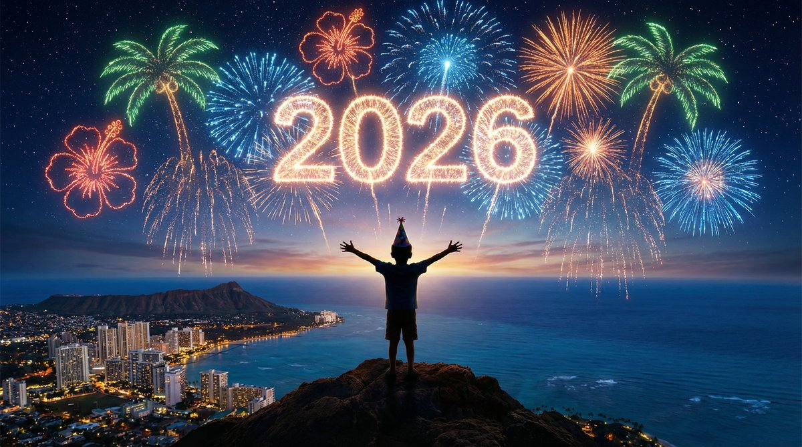
</div>

**提示词：**
```
{
  "template_name": "New Year City Skyline Celebration",
  "description": "A cinematic shot of a child overlooking a city skyline with custom fireworks effects.",
  "prompt_template": "A stunning cinematic shot of a joyful child in silhouette, wearing a whimsical party hat, standing on a high mountain peak with arms outstretched in wonder. The background is a breathtaking aerial night view of the Shanghai skyline, featuring the Oriental Pearl Tower, The Bund, and the winding Huangpu River under a starry night sky. The sky erupts with {city_fireworks_effect}. A massive, glowing firework display clearly spells out '2026' in the center. 8k resolution, photorealistic, magical atmosphere, highly detailed urban nightscape.",
  "input_variables": {
    "city_fireworks_effect": {
      "type": "string",
      "description": "Description of the style, shape, and vibe of the fireworks.",
      "default_value": "a spectacular Disney-style fireworks show, featuring Mickey Mouse shaped bursts, fairy-tale pastel colors, glittering magic dust, and dreamlike cascading sparks"
    }
  },
  "full_prompt_example": "A stunning cinematic shot of a joyful child in silhouette, wearing a whimsical party hat, standing on a high mountain peak with arms outstretched in wonder. The background is a breathtaking aerial night view of the Shanghai skyline, featuring the Oriental Pearl Tower, The Bund, and the winding Huangpu River under a starry night sky. The sky erupts with a spectacular Disney-style fireworks show, featuring Mickey Mouse shaped bursts, fairy-tale pastel colors, glittering magic dust, and dreamlike cascading sparks. A massive, glowing firework display clearly spells out '2026' in the center. 8k resolution, photorealistic, magical atmosphere, highly detailed urban nightscape."
}
城市：夏威夷
```

<a id="prompt-999"></a>
## 案例 999：手臂搭在巨大的3D汤姆猫身上 (来源 [@ZaraIrahh](https://x.com/ZaraIrahh/status/2005816508602278010)) 模型：Nano banana pro

<div style="display: flex; justify-content: space-between;">
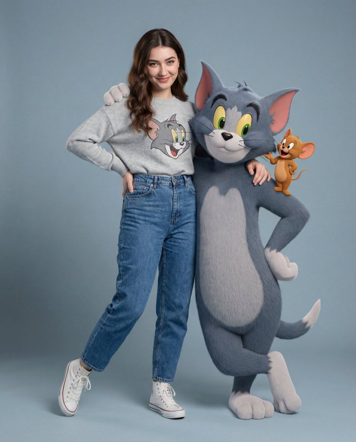
</div>

**提示词：**
```
"image_generation":(
"quality": "hyper-realistic",
"face": ("preserve_original": true, "reference_match'": true),
"subject":{
"description": "A stylish person with the same face.",
“clothing":{
"Top": ("type": "knitted sweater", "color": "light grey (Tom Theme) ". }
"pants": ("type": "high-waisted jeans", "color": "denim blue".
"shoes":("type": "high-top sneakers", "color": "white")
"pose": "standing with arm around a giant 3D Tom while Jerry
sits on Tom's shoulder",
"expression": "fun, mischievous"
"character_element":{
"name": "Tom & Jerry",
"type': "3D photorealistic duo",
"interaction': "Tom poses confidently, Jerry looks playful"
"environment-( "background'. (clean grey-blue backdrop"}
}
```

**中文提示词：**
```
"image_generation" :(
“质量”：“超逼真”，
“face”: ("preserve_original": true, "reference_match": true),
“主题” :{
描述：一个穿着时尚但长相雷同的人。
“服装” :{
上衣：（类型：针织毛衣，颜色：浅灰色（汤姆主题））。
"裤子": "类型": "高腰牛仔裤", "颜色": "牛仔蓝"
“鞋子” :( “类型”：“高帮运动鞋”，“颜色”：“白色”）
“姿势”： “手臂搭在巨大的3D汤姆猫身上，而杰瑞……”
坐在汤姆的肩膀上”，
“表达方式”：“有趣，调皮”
"character_element" :{
"name": "汤姆和杰瑞",
“type”: “3D 逼真双人组”
“互动”：“汤姆自信地摆姿势，杰瑞看起来很顽皮”
"环境-("背景" . (干净的灰蓝色背景"}
}
```

<a id="prompt-998"></a>
## 案例 998：元旦特辑-粉色的秋千童话风 (来源 [@songguoxiansen](https://x.com/songguoxiansen/status/2005268799512309855)) 模型：Nano banana pro

<div style="display: flex; justify-content: space-between;">

</div>

**中文提示词：**
```
[关键：保持精确的面部特征，保留原始脸部结构，图中角色与上传参考图完全一致]
专业工作室梦幻人像,人物展现如珍珠般润泽白皙的肌肤,淡妆突出自然红润和水蜜桃唇色。她穿着渐变粉金色纱质长裙,裙身点缀手工刺绣的金色星星和红色小花,肩部装饰白色羽毛披肩。发型是浪漫的半披半扎,后半部分编成精致的鱼骨辫盘成花朵状,用金色星月发冠、红色小玫瑰和珍珠发链装饰,前半部分卷发自然垂落。她坐在悬空的金色秋千上,双手轻握绳索,一条腿自然垂下另一条腿微曲,身体微微后仰如荡秋千姿态,裙摆随动作飘起,头部侧向一边露出甜美笑容眼神梦幻。背景是纯白渐变到粉金色的背景布,上方悬挂金色和红色星星装饰、"2026"立体数字吊坠、透明气球束,地面虚化处散落粉色和金色花瓣。柔光箱从多角度打光营造梦幻柔焦效果,顶光制造仙气光晕。Hasselblad X2D-100C拍摄,浅景深,色调粉嫩梦幻,高端工作室童话风质感。
```

<a id="prompt-997"></a>
## 案例 997：元旦特辑-复古旗袍名媛风 (来源 [@songguoxiansen](https://x.com/songguoxiansen/status/2005097871977447736)) 模型：Nano banana pro

<div style="display: flex; justify-content: space-between;">
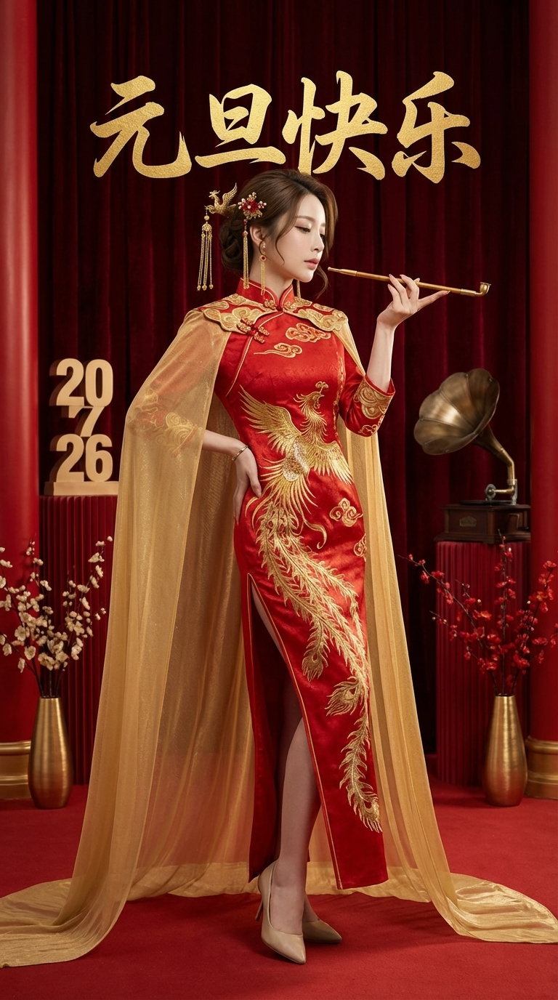
</div>

**中文提示词：**
```
[关键：保持精确的面部特征，保留原始脸部结构，图中角色与上传参考图完全一致]
精致工作室立姿肖像,人物拥有如凝脂般细腻白皙的肌肤,淡雅妆容强调通透感和裸粉唇妆。她身着传统红色凤凰刺绣旗袍,高开叉设计展现修长美腿,袖口和领口绣满金线祥云纹样,外搭金色薄纱长披风从肩部垂落至地面。发型是典雅的侧边低盘发,用金色凤凰步摇、红色珠花和长长的金色流苏装饰,发饰随动作轻微摇曳,一侧留出波浪卷发修饰脸型。她站立在红色地毯上呈经典旗袍站姿,一条腿从开叉处露出,一只手叉腰展现自信,另一只手拿着金色烟斗式长杆烟嘴优雅置于唇边,头部微侧展现精致侧颜,眼神冷艳高贵。背景是深红色天鹅绒幕布,中央悬挂金色"元旦快乐"书法大字和"2026"立体装置,两侧对称布置红色立柱、金色花瓶插梅花、复古留声机。伦勃朗光营造经典好莱坞氛围,强调明暗对比和戏剧张力。Phase One拍摄系统,色彩浓烈复古,顶级工作室vintage大片质感。
```

<a id="prompt-996"></a>
## 案例 996：3D卡通形象击碎墙壁 (来源 [@CharaspowerAI](https://x.com/CharaspowerAI/status/2004968032745951651)) 模型：Nano banana pro

<div style="display: flex; justify-content: space-between;">

</div>

**提示词：**
```
3d cartoon of a happy [character] breaking down [type of wall or object] with [hands / body / special ability], in the style of pixar. adorable [eye description], lovely colorful soft background, vibrant colors, very cute face, high detail, octane render, depth of field, cinematic lighting.
```

**中文提示词：**
```
一个快乐的[角色]用[手/身体/特殊能力]击碎[某种类型的墙壁或物体]的3D卡通形象，风格类似皮克斯动画。可爱的[眼睛描述]，柔和多彩的背景，鲜艳的色彩，非常可爱的脸庞，高细节，渲染效果出色，景深效果，电影级光照。
```

<a id="prompt-995"></a>
## 案例 995：时装设计师根据人物形象绘制草图 (来源 [@CharaspowerAI](https://x.com/CharaspowerAI/status/2004937832163422365)) 模型：Nano banana pro

<div style="display: flex; justify-content: space-between;">
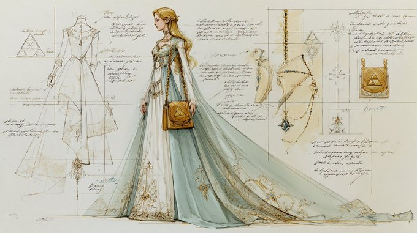
</div>

**提示词：**
```
a fashion designer's sketch of an [elegant outfit or dress] inspired by [ character], featuring [key iconic accessory or detail]. the design includes notes in pencil and ink, emphasizing details, [delicate embroidery or pattern details], and matching accessories.
```

**中文提示词：**
```
一位时装设计师根据[人物]的形象绘制的[优雅服装或连衣裙]草图，以[关键标志性配饰或细节]为特色。设计图包含铅笔和墨水笔记，强调细节、[精致的刺绣或图案细节]以及配套配饰。
```

<a id="prompt-994"></a>
## 案例 994：百科全书式信息卡片 (来源 [@yyyole](https://x.com/yyyole/status/2005135811185180757)) 模型：Nano banana pro

<div style="display: flex; justify-content: space-between;">
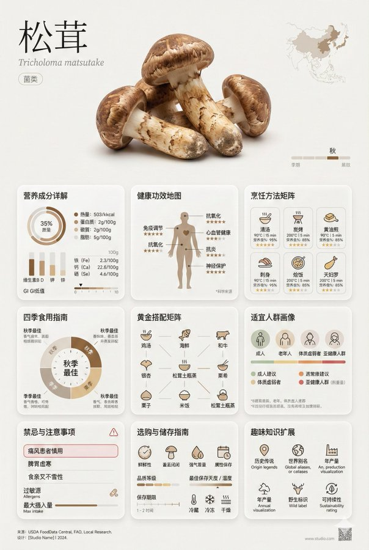
</div>

**中文提示词：**
```
一张极简艺术风格的[芦笋]百科全书式信息卡片，
博物馆展品级别的设计品质，信息丰富但视觉克制

【整体构图 - 黄金分割布局】
- 画面比例：2:3竖版 或 3:4方形
- 三大视觉区域：
    * 顶部展示区（30%）：大尺寸食材摄影 + 优雅标题排版
    * 中部信息区（60%）：多层次信息模块网格系统
    * 底部注释区（10%）：来源标注 + 设计细节

【顶部展示区 - 视觉焦点】
• 食材名称：超大字号，细线体/宋体，字间距加宽
• 拉丁学名：小字号斜体，灰色调
• 食材分类标签：极简胶囊形状标签
• 主图：去背景食材特写，工作室灯光，微阴影
• 原产地小型地图图示
• 当季时间轴线条图

【中部核心信息区 - 9大模块】

1、营养成分详解
- 圆环图：卡路里、蛋白质、碳水、脂肪占比
- 条形图：维生素A/C/E/K含量对比
- 矿物质微量元素列表（钙、铁、锌等）
- 每100g营养数据精确标注
- GI值（升糖指数）可视化刻度尺

2、健康功效地图
- 人体轮廓图标注受益部位
- 5-6个主要功效图标化展示
- 功效强度等级标识（⭐⭐⭐⭐⭐）
- 科学研究来源小标注

3、烹饪方法矩阵
- 8-10种烹饪方式图标网格
- 每种方式最佳温度/时间参数
- 营养保留率百分比显示
- 推荐指数星级评价
- 难度等级色彩标识

4、四季食用指南
- 圆形时间轮盘设计
- 标注最佳食用月份
- 不同季节功效变化说明
- 时令搭配建议

5、黄金搭配矩阵
- 9宫格搭配食材小图标
- 搭配理由简短标注
- 协同增效/相克警示
- 经典菜品配方示例
- 营养互补关系连线图

6、适宜人群画像
- 人群图标（儿童/孕妇/老人/运动员等）
- 推荐程度色彩编码
- 特殊人群剂量建议
- 年龄段分类指南

7、禁忌与注意事项
- 红色警示框设计
- 不宜人群清晰列举
- 过敏源标识
- 药物相互作用提示
- 最大摄入量警戒线

8、选购与储存指南
- 新鲜度判断要点（颜色/手感/气味）
- 品质等级划分图示
- 最佳储存温度/湿度数据
- 保鲜期时间轴
- 冷藏/冷冻/常温图标指南

9、趣味知识扩展
- 历史小故事（起源/传说）
- 世界各地别名
- 年产量数据可视化
- 有机/转基因标识说明
- 可持续性评级

【视觉系统 - 极简艺术美学】

配色方案：
- 主色：食材本身的自然色彩提取
- 辅色：大地色系（米白/燕麦/亚麻/石墨灰）
- 强调色：克制使用1-2个高纯度色彩
- 背景：纯白或极浅灰（#FAFAFA）
- 文字：深灰而非纯黑（#2C2C2C）

字体系统：
- 标题：超细线条无衬线字体（Helvetica Neue UltraLight）
- 正文：现代几何字体（DIN/Futura）
- 数据：等宽字体（Roboto Mono）
- 中文：思源黑体Light/方正兰亭黑
- 字号层级：6级字号系统（48/32/24/16/12/10pt）

图标系统：
- 统一2pt线宽
- 圆角一致性（2px）
- 24x24px网格对齐
- stroke而非fill优先
- 负空间利用

布局系统：
- 12列网格系统
- 8pt基准网格对齐
- 模块间距：24pt/32pt/48pt
- 边距：页边距48pt起
- 卡片圆角：8-12px
- 微妙分割线：0.5pt，15%透明度

质感细节：
- 微渐变背景（3-5%色值变化）
- 柔和投影（0 4px 24px rgba(0,0,0,0.04)）
- 磨砂玻璃效果（backdrop-filter: blur(20px)）
- 元素间微妙高度差异（海拔系统）
- 数据区域淡色填充（5%透明度）

【信息可视化原则】
- 数据图表：Edward Tufte简约数据墨水原则
- 去除非必要装饰
- 图表网格线极淡（10%透明度）
- 数据点精确标注
- 趋势线平滑自然

【呼吸感营造】
- 模块间留白≥模块内容宽度的25%
- 文字行间距1.6-1.8倍
- 段落间距≥2行高
- 图文组合留白法则

风格关键词：
瑞士国际主义平面设计、日本侘寂美学、包豪斯功能主义、
斯堪的纳维亚极简主义、Dieter Rams设计哲学、
无印良品视觉语言、Kinfolk杂志美学、
苹果产品设计语言、Google Material Design精髓
```

<a id="prompt-993"></a>
## 案例 993：专业首饰类型设计全流程展示 (来源 [@yyyole](https://x.com/yyyole/status/2004766562360942975)) 模型：Nano banana pro

<div style="display: flex; justify-content: space-between;">
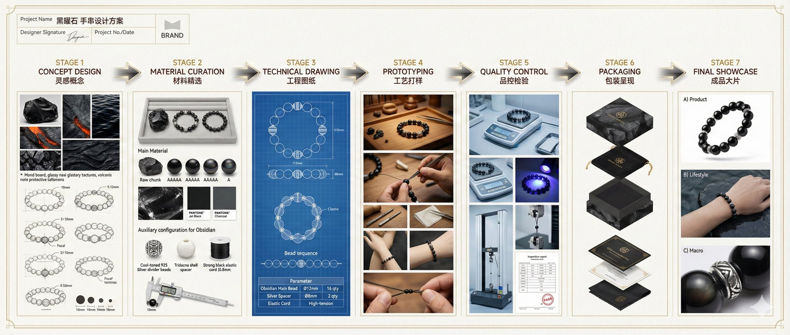
</div>

**中文提示词：**
```
专业{首饰类型}设计全流程展示 | {主材料}商业级设计过程可视化，专业设计系统文档风格。
【主材料】：{金}（如：虎眼石、翡翠、南红玛瑙）
【首饰类型】：{手镯}（如：手串、吊坠、戒指、耳环
【辅材智能配置】：根据主材料自动匹配（金属配件、隔珠、弹力线等）

专业珠宝设计全流程展示图 | 从概念到成品的完整设计过程

项目信息板块（左上角）
项目名称：「{主材料} {首饰类型}设计方案」
设计师签名栏（muyang）
项目编号和日期
品牌Logo预留位
金色装饰线框

第一阶段：设计概念 CONCEPT DESIGN
视觉呈现：
灵感拼贴板（Mood Board）：{主材料}原石照片、纹理特写、色彩提取
手绘草图：3-4个设计方案，铅笔素描风格
文化元素融入（如虎眼石→东方瑞兽纹样）
比例尺标注，关键尺寸备注
标注内容：
设计理念说明（中英双语）
目标客群定位
预算区间估算

第二阶段：材料精选 MATERIAL CURATION
主材料展示区：
{主材料}原矿到成品珠粒对比
4-6颗品质分级展示（AAAAA→A级）
显微镜下纹理特写
色卡比对（Pantone色号标注）
专业珠宝托盘呈现
辅材智能搭配区：
金属配件：根据主材料调性选择暖色系主材（虎眼石、南红）→ 18K玫瑰金/红铜
冷色系主材（青金石、海蓝宝）→ 925银/白金
中性主材（黑曜石、玛瑙）→ 精钢/钛钢
隔珠/配珠：尺寸比例协调（主珠直径的1/3-1/2）
材质对比（如虎眼石配砗磲/椰壳）
数量配比建议
串线材料：手串→弹力线（克重标注）
项链→不锈钢钢丝/K金链
透明展示盒分格摆放
光照：顶部柔光 + 侧面暖光，突出材质光泽

第三阶段：工程图纸 TECHNICAL DRAWING
CAD专业制图：
三视图（正视/侧视/俯视），精确到0.1mm
剖面图展示内部结构（如隔珠穿孔位置）
尺寸标注线（箭头 + 数字）
珠子排列顺序图解
结绳工艺节点详图
蓝图底色 + 白色线框，建筑图纸风格
参数表格：
| 部件 | 尺寸 | 数量 | 材质 |
| {主材料}主珠 | Ø{X}mm | {N}颗 | 天然{主材料} |
| 隔珠 | Ø{Y}mm | {M}颗 | {辅材} |
| 配件 | - | 1套 | {金属材质} |

第四阶段：工艺打样 PROTOTYPING
制作过程：
选珠配对：工匠用卡尺测量，色差比对
打磨抛光：砂轮机/手工打磨台
穿孔检查：专业灯光透视孔洞
试戴调整：手腕/颈部模特展示，周长调节
细节特写：金属扣头安装过程，微距摄影
环境设置：
传统工作台（木质/大理石台面）
专业珠宝工具铺陈（镊子、放大镜、量具）
暖色工作灯照明
工匠手部特写（展现匠心）

第五阶段：品控检验 QUALITY CONTROL
检测场景：
紫外线灯下检测{主材料}真伪
电子秤精确称重（克重显示）
游标卡尺复核尺寸
拉力测试弹力线强度
检验报告单特写（证书编号、检测数据）
分屏展示：
左侧：检测设备操作
右侧：放大显示检测结果
底部：合格印章/质检签字
色调：冷色调科技感，白色实验室环境

第六阶段：包装呈现 PACKAGING
包装系统展示：
内包装：定制绒布袋/锦盒，品牌烫金Logo
外包装：艺术礼盒，{主材料}纹理印刷
附件配套：材质证书卡
保养说明书（图文并茂）
品牌故事卡片
擦拭布/密封袋
构图：爆炸图式展开，层层递进

第七阶段：成品大片 FINAL SHOWCASE

A组-产品摄影：
纯白背景悬浮拍摄，360°全角度
特写镜头：{主材料}猫眼效果/晶体纹理
金属配件反光细节
尺寸参照物（硬币/尺子）
专业影棚四点布光
B组-场景应用：
真人手腕/颈部佩戴
生活化场景（咖啡桌、书桌、户外）
不同光线环境（自然光/夜景灯光）
动态展示（手部移动形成光轨）
C组-细节放大：
100倍微距：{主材料}内部结构
金属接口工艺特写
结绳编织纹理
品牌刻印细节

整体视觉规范
布局架构
横向时间轴：7阶段等宽分布，21:9电影比例
流程箭头：立体金属质感，渐变发光效果
信息层级：一级标题：粗体中文+细体英文，金色
二级标题：黑体，12号
正文标注：宋体/思源黑体，9号
色彩系统
背景基调：#F8F6F0 象牙白
主材料色：根据{主材料}天然色提取（虎眼石→琥珀金棕）
金属色：K金 #D4AF37
银色 #C0C0C0
玫瑰金 #B76E79
强调色：深褐 #3E2723（文字/边框）
摄影标准
分辨率：最低4K（3840×2160）
景深：F8-F11保持各阶段清晰
色温：5500K标准日光
格式：RAW原片后期，保留最大细节
```

<a id="prompt-992"></a>
## 案例 992：刺绣歌曲海报 (来源 [@sundyme](https://x.com/sundyme/status/2005129744690675731)) 模型：Nano banana pro

<div style="display: flex; justify-content: space-between;">
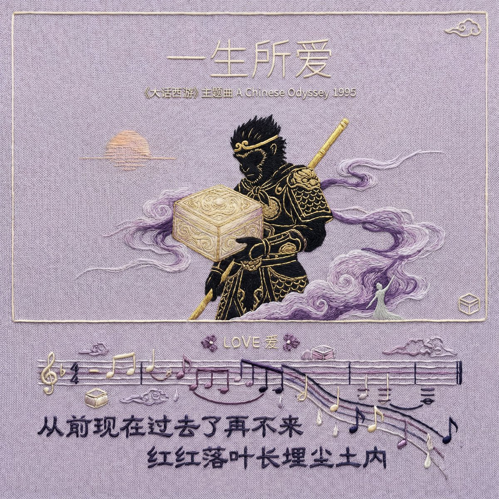
</div>

**提示词：**
```
Ultra-detailed album cover for \"[歌曲名称]\". Style: Huang Hai's minimalist aesthetic with HIGH-QUALITY HAND-EMBROIDERED SILK ART. Format: Vertical Poster (1:1 aspect ratio).

CRITICAL: Every element must appear as hand-embroidered with visible, realistic stitching details. Show individual thread stitches, slight texture variations, and authentic embroidery craftsmanship.

Visual Structure:
- Delicate high-end silk fabric background with subtle sheen and fine weave texture, [配色方案], occupying 75% of canvas.
- Scene Visualization: A simplified, poetic scene of [场景描述], rendered in hand-embroidered silk with VISIBLE REALISTIC STITCHING DETAILS.
- Scale Contrast: Tiny, barely visible silhouettes of [细节元素] at the bottom/corners.

Base: Luxurious silk fabric background with subtle sheen, fine weave texture, and soft luminous quality.

HAND-EMBROIDERY DETAILS: Every element must show:
- Individual visible thread stitches with slight texture
- Microscopic silk thread details with subtle metallic sheen
- Realistic embroidery craftsmanship with slightly imperfect, organic stitching
- Visible stitch patterns and thread texture variations
- Authentic hand-embroidered appearance with natural imperfections
  The scene features soft muted colors (pale [颜色] for the [元素], muted [颜色] for the [元素], soft [颜色] for the [元素]). Realism: Extreme dimensional depth, realistic hand-embroidered stitches, tactile silk texture with visible stitch details.

Color Palette: Subtle high-end [主色调] silk background. Soft muted colors for the scene (pale [颜色], muted [颜色], soft [颜色]). Elegant, refined, and sophisticated mood.

Typography:
- Top title \"[歌曲名称]\" in minimalist elegant serif typography (hand-embroidered in subtle thread), surrounded by maximum breathing space.
- Subtitle \"[艺术家] • [年份] • [风格类型]\" in refined font.
- Small bilingual text \"[英文关键词] [中文关键词]\" in refined font.

CRITICAL - BOTTOM DESIGN: The text must show OBVIOUS hand-embroidered style with:
- Spacing between individual stitches visible
- Organic, slightly imperfect stitch patterns
- Natural texture variations in the thread
- Hand-stitched appearance rather than dense machine embroidery
- Clear manual embroidery craftsmanship

Bottom Design: Elegant flow of musical notes intertwined with refined calligraphy showcasing TWO COHESIVE, NARRATIVE-FULL lyrics from the song:
Line 1: \"[第一句歌词]\"\nLine 2: \"[第二句歌词]\"\nRendered in elegant [书法风格] style calligraphy with refined strokes, all hand-embroidered with VISIBLE INDIVIDUAL STITCHES. The text should show clear hand-stitched style with spacing between stitches. [音乐风格] musical notes arranged in subtle [图案] patterns. Embroidered in [主色线] and [辅色线] threads, connecting notes and text with delicate [线条类型] lines, showing OBVIOUS hand-embroidered texture with individual stitch visibility.

Border: Minimal single thin line border in [边框颜色] (hand-embroidered). Corner: One small elegant [符号] symbol (hand-stitched). Photorealistic hand-embroidered silk texture with VISIBLE STITCH DETAILS, fine weave, subtle sheen, authentic embroidery craftsmanship. The text area must show OBVIOUS hand-stitched character with visible individual stitches and natural texture.
```

<a id="prompt-991"></a>
## 案例 991：超逼真的电影感肖像 (来源 [@hx831126](https://x.com/hx831126/status/2005219164009668903)) 模型：Nano banana pro

<div style="display: flex; justify-content: space-between;">
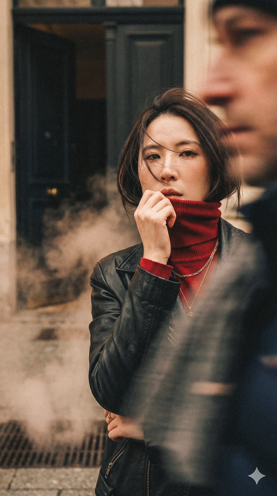
</div>

**中文提示词：**
```
超逼真的电影感肖像，高端时尚9：16画幅杂志风格摄影。

发型：短发，发丝被风吹拂，飘散在脸上，以时尚的方式部分遮挡面部特征。

主体：仅使用上传的面部参考图像作为主要拍摄对象。面部特征、骨骼结构和自然肤质（可见毛孔）需100%匹配。不得改变种族或性别特征。

服装：黑色复古皮夹克搭配红色高领细线针织（堆叠领口），佩戴金色项链，优雅现代的造型。

场景/环境：时间为冬天，街上有供暖热蒸汽，充满欧洲风格，一个复古公寓的门，门打开着，里面黑漆漆，

动作/动态：前景有人快速移动，动态模糊（长曝光效果）挡住部分画面和镜头。拍摄对象保持完美清晰、沉静。拍摄对象静止，轻微仰头，看着镜头，一只手拉着高领毛衣的领子扯着挡住下颌线和嘴唇（时尚杂志模特的post）位于画面的右侧。

构图：低角度仰拍人物，胸部以上竖幅肖像，主体人物位置偏右构图，线条简洁流畅

相机：24mm广角镜头低角度仰拍视角，浅景深，电影感虚化效果，专业的时尚写实风格。

光照：柔和的电影感光照，暖色调，营造氛围感。高光控制得当，阴影保留细节。

色彩/后期：高细节，高级色彩分级，自然的肤质纹理，微妙的胶片感（无明显颗粒）。无文字、无徽标、无水印。
```

<a id="prompt-990"></a>
## 案例 990：高级时装工作室照片拼贴画 (来源 [@miilesus](https://x.com/miilesus/status/2004620767087263838?referrer=grok.com)) 模型：Nano banana pro

<div style="display: flex; justify-content: space-between;">
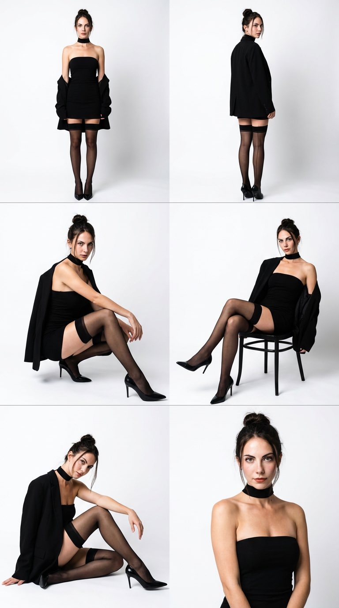
</div>

**提示词：**
```
Create a realistic high-fashion studio photo collage featuring the same woman in six to eight different poses, using the uploaded face image as the exact facial reference (same facial structure, eyes, nose, lips, skin tone, and overall identity).

The woman has a slim and elegant body, natural proportions, pale to light skin tone, a delicate oval face, soft but sharp facial features, large expressive eyes, thin lips, and a calm, confident expression. Her hair is long, black, styled in a messy bun with loose strands falling naturally around the face.

Outfit: a tight black strapless mini dress, paired with sheer black thigh-high stockings, pointed-toe black stiletto heels with thin heels, and a formal black blazer worn in different ways across poses (fully worn, draped over one shoulder, hanging off one arm, or resting loosely on the arms). Accessories include a thin black choker necklace.

Poses included in the collage:

Standing front-facing full body pose, neutral expression, blazer hanging off the arms.

Standing back-facing pose with the head turned toward the camera, blazer worn on the shoulders, legs straight.

Squatting or semi-crouching pose with one leg forward, sharp gaze toward the camera.

Seated pose on a black chair with legs crossed, blazer off one shoulder, elegant and composed expression.

Seated low pose with knees bent, body leaning slightly forward, blazer worn on one arm only.

Half-body portrait facing the camera, shoulders relaxed, clean editorial look.

Environment: clean white seamless studio background with soft high-key lighting. Large softbox light placed in front and slightly to the side, creating soft shadows beneath the body. Even lighting that clearly shows fabric texture, skin detail, and shoe shine.

Photography style: high-end fashion editorial, professional studio photography, ultra high-definition, sharp focus, natural skin texture, realistic shadows, no lens distortion, accurate anatomy and proportions.

Composition: vertical fashion collage layout with evenly spaced images.

Aspect ratio: 9:16.
```

**中文提示词：**
```
使用上传的面部图像作为精确的面部参考（相同的面部结构、眼睛、鼻子、嘴唇、肤色和整体特征），创建一个逼真的高级时装工作室照片拼贴画，以同一位女性的六到八个不同的姿势为特色。

这位女士身材纤细优雅，比例匀称，肤色白皙，脸型精致，五官柔和却不失轮廓分明，双眼明亮动人，嘴唇纤薄，神态沉稳自信。她一头乌黑长发随意挽成一个发髻，几缕碎发自然垂落在脸颊两侧。

服装：一件紧身黑色无肩带迷你连衣裙，搭配黑色薄纱过膝长袜、黑色尖头细高跟鞋，以及一件黑色正式西装外套，外套在不同姿势下以不同方式穿着（完全穿上、披在一侧肩上、挂在一侧手臂上或随意搭在手臂上）。配饰包括一条黑色细颈链。

拼贴画中包含的姿势：

站立式全身像，正面朝向观众，表情平静，西装外套挂在手臂上。

背对镜头站立，头部转向镜头，西装外套披在肩上，双腿伸直。

蹲姿或半蹲姿，一条腿向前迈出，目光锐利地看向镜头。

她盘腿坐在黑色椅子上，西装外套滑落一侧肩膀，神态优雅沉稳。

坐姿低位，双膝弯曲，身体略微前倾，西装外套只搭在一只胳膊上。

半身像，面向镜头，肩膀放松，画面干净利落，适合杂志拍摄。

环境：洁净的白色无缝摄影棚背景，柔和的高调灯光。大型柔光箱放置在前方略偏一侧，在人体下方营造出柔和的阴影。均匀的光线清晰地展现了织物纹理、肌肤细节和鞋子的光泽。

摄影风格：高端时尚大片、专业影棚摄影、超高清、清晰对焦、自然肌肤纹理、逼真阴影、无镜头畸变、准确的解剖结构和比例。

构图：竖版时尚拼贴布局，图片间距均匀。

宽高比：9:16。
```

<a id="prompt-989"></a>
## 案例 989：一张竖版服装海报 (来源 [@aidavid125](https://x.com/aidavid125/status/2004699464255356984)) 模型：Nano banana pro

<div style="display: flex; justify-content: space-between;">
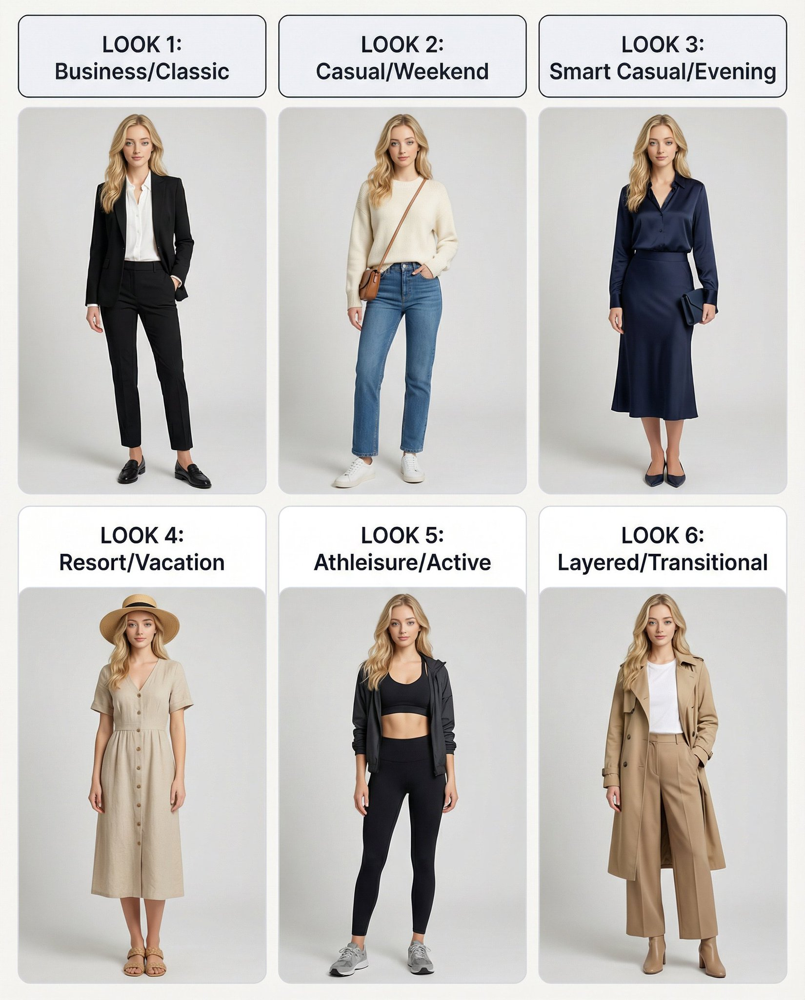
</div>

**提示词：**
```
Using the uploaded photo as the sole character reference, generate a vertical outfit poster.

【LAYOUT HARD RULES】
- Must have exactly 6 cards only, 2 rows × 3 columns (3 columns across, 2 rows down)
- Row 1: LOOK 1, 2, 3 | Row 2: LOOK 4, 5, 6
- Prohibited: 9-grid, 3 rows × 2 columns, 2-column layout, extra cards, top header/title

【CANVAS & LAYOUT】
- Vertical 4:5 aspect ratio, background #F7F5F2
- Grid occupies ≥92% of canvas height, bottom margin ≤3%
- Outer margin 2%, spacing 1.5%, strictly aligned

【CARD SPECIFICATIONS】
- White background #FFFFFF, border-radius 5%, stroke 1px #E5E7EB
- Top title bar: height 12%, background #F3F4F6, text color #111827
- Sans-serif font, alignment consistent throughout

【CHARACTER CONSISTENCY】
- All 6 must be the same person in different outfits: same face, same hairstyle, same body proportions, same demeanor
- Prohibited: switching people/changing face/altering gender features/extreme slimming or leg lengthening

【PHOTOGRAPHY QUALITY】
- Master-level studio full-body lookbook, 85mm portrait lens look
- Softbox key light + subtle fill, natural skin texture with light retouching
- Solid seamless background (white/light gray/off-white), no clutter

【UNIFORM CROPPING】
- 4:5 full-body, complete from head to shoes
- Subject centered, height 88%±2%
- Headroom 2-4%, footroom 3-5%, shoes fully visible
- All six shots: consistent camera height/focal length/lighting/pose

【OUTFIT RULES】
- Auto-adapt based on subject age (adult/child)
- Each look ≤3 core items, max 3 colors per outfit, accessories ≤2
- 6 looks distinctly different, but unified style: minimal/clean/polished/easy to recreate

【TITLE SETS】
Adult: Business/Classic → Casual/Weekend → Smart Casual/Evening → Resort/Vacation → Athleisure/Active → Layered/Transitional
Kids: Everyday/Clean → School/Polished → Weekend/Play → Party/Sweet → Active/Sporty → Layered/Cozy

NEGATIVE:
3x3, nine-grid, 9 cards, extra cards, 3 rows x 2 columns, two-column layout, big top header, page title, switching people, changing face, multiple people, lowres, blurry, plastic skin, wide-angle distortion, fisheye, warped body, extreme slimming, long legs effect, outdoor background, textured wall, cut off shoes, half body, adultification, sexy, lingerie, see-through, high heels (kids), heavy makeup (kids), watermark, cropped text
```

**中文提示词：**
```
以上传的照片为唯一人物参考，生成一张竖版服装海报。

【布局硬性规则】
- 必须正好有 6 张卡片，2 行 × 3 列（横向 3 列，纵向 2 行down)
- 第 1 行：造型 1、2、3 | 第 2 行：造型 4、5、6
- 禁止使用：9格网格、3行×2列、2栏布局、额外卡片、顶部标题/标题

【画布与布局】
- 垂直4:5宽高比，背景#F7F5F2
- 网格占据画布高度的 92% ≥ ，底部边距为 3% ≤
  外边距 2%，行距 1.5%，严格对齐

【卡片规格】
- 白色背景#FFFFFF ，圆角 5%，描边 1px #E5E7EB
- 顶部标题栏：高度 12%，背景色#F3F4F6 ，文本颜色 #111827
- 无衬线字体，对齐方式始终一致

【角色一致性】
- 这6个人必须是同一个人，只是穿着不同的衣服：同样的脸，同样的发型，同样的身材比例，同样的举止。
- 禁止：换人/改变容貌/改变性别特征/极端瘦身或拉长腿部

【摄影质量】
- 大师级影棚全身写真集，85mm 人像镜头拍摄效果
- 柔光箱主光 + 轻微补光，自然肌肤纹理，轻微修图
- 纯色无缝背景（白色/浅灰色/米白色），无杂物

【统一裁剪】
- 4:5 全身照，从头到脚完整呈现
- 以受试者为中心，身高 88%±2%
  头部空间2-4%，脚部空间3-5%，鞋子完全可见
- 所有六张照片：相机高度/焦距/光线/姿势均保持一致

【穿搭规则】
- 根据受试者年龄（成人/儿童）自动调整
- 每套造型≤ 3件核心单品，每套服装最多3种颜色，配饰≤ 2件
- 6 看起来截然不同，但风格统一：简约/干净/精致/易于复刻

【标题集】
成人：商务/经典→休闲/周末→商务休闲/晚装→度假/休闲→运动休闲/活力→叠穿/过渡装
儿童：日常/干净→上学/整洁→周末/玩耍→派对/甜美→活力/运动→多层/舒适

消极的：
3x3，九宫格，9张卡片，额外卡片，3行2列，双栏布局，顶部大标题，页面标题，人物切换，换脸，多人，低分辨率，模糊，塑料皮肤，广角畸变，鱼眼，身体扭曲，极度瘦身，长腿效果，户外背景，纹理墙，鞋子被剪掉，半身，成人化，性感，内衣，透视，高跟鞋（儿童），浓妆（儿童），水印，裁剪文字
```

<a id="prompt-988"></a>
## 案例 988：圣诞特辑-冷艳圣诞甜酷皆在方寸间 (来源 [@songguoxiansen](https://x.com/songguoxiansen/status/2004008192200921372)) 模型：Nano banana pro

<div style="display: flex; justify-content: space-between;">
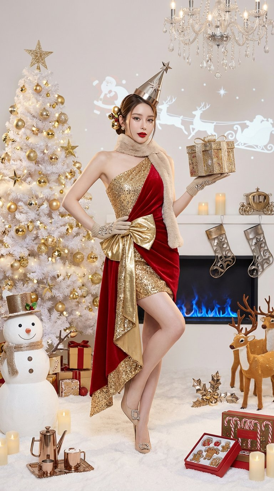
</div>

**中文提示词：**
```
[关键：保持精确的面部特征，保留原始脸部结构，整个拼图中角色完全一致]
高级时尚感的妆容，采用金属质感的妆面，眼影是香槟金色渐变到玫瑰金，眼角延伸出精致的金色眼线，下眼睑点缀碎钻如冰晶闪烁。睫毛根根分明如芭比娃娃，眉毛是野生眉形态。唇部是镜面光泽的樱桃红色，腮红是高光打造的立体感。发型是时髦的低盘发，发髻用金色装饰球和圣诞铃铛点缀，侧边垂落几缕精致卷发，头顶斜戴着设计感十足的金属质感圣诞帽，帽檐镶嵌北极星装饰。身着改良版现代圣诞服，采用不对称设计，一侧肩膀露出，红色天鹅绒面料混搭金色亮片，腰间系着夸张的金色蝴蝶结，下摆不规则裁剪。搭配毛绒围巾随意搭在肩上，戴着镶钻的针织手套。人物摆出时尚大片姿势，一腿微曲，一手叉腰，另一手优雅地托着一个装饰奢华的礼物盒，表情高冷又不失节日欢愉。背景是纯白色摄影棚布置成的圣诞场景，巨大的白色圣诞树装饰着金色装饰球、灯串和星星。地面铺满仿真雪花，摆放着精致的雪人雕塑、圣诞麋鹿装置。旁边有个现代设计感的壁炉装置，里面跳动着蓝色的炉火。墙面投影着圣诞老人剪影、驯鹿鲁道夫、雪橇、圣诞马车的图案。周围散落着高级包装的糖果、姜饼礼盒、拐杖糖。圣诞袜以装置艺术形式悬挂。地上摆放着精致的热可可套装。冬青叶和槲寄生以金属雕塑形式呈现。蜡烛造型灯在四周营造氛围。冰晶吊灯从天花板垂下。打光采用多灯位布光，主光、轮廓光、发光分离，营造时尚大片的高级质感。
```

<a id="prompt-987"></a>
## 案例 987：九宫格拼贴画 (来源 [@msjiaozhu](https://x.com/msjiaozhu/status/2003819615282229720)) 模型：Nano banana pro

<div style="display: flex; justify-content: space-between;">
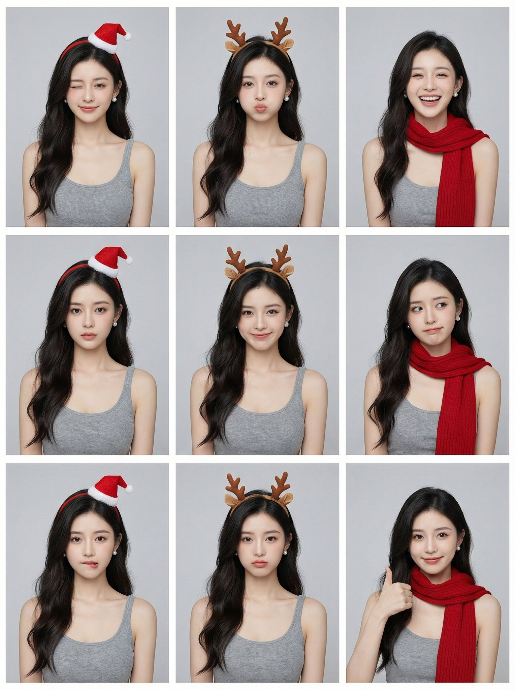
</div>

**提示词：**
```
{
"project_settings": {
"task_type": "Single_Image_Contact_Sheet (9-Grid)",
"aspect_ratio": "3:4",
"resolution_mode": "High / Upscale (Crucial for face details in grids)",
"batch_size": 1
},
"reference_config": {
"usage": "Upload Reference Image -> Set Strength to 0.5-0.7",
"purpose": "Define the 3x3 grid structure and character identity"
},
"prompt_payload": {
"structure_trigger": "A single contact sheet image containing a 3x3 photo grid matrix",
"grid_logic": "9 distinct panels separated by thin white borders",
"subject_consistency": "Same young asian woman in all 9 panels, identical outfit, identical hairstyle",
"expression_variation": "9 different facial expressions (winking, tongue out, surprised, laughing, serious, etc.)",
"camera_angles": "Varied angles in each panel (high angle, low angle, straight on)",
"visual_style": "Photorealistic, Studio lighting, Light grey background, K-pop idol photocard style"
},
"negative_prompt": [
"One single portrait",
"merged bodies",
"distorted grid lines",
"missing panels",
"cartoon",
"illustration",
"different clothes"
]
}
```

**中文提示词：**
```
{
"project_settings": {
"task_type": "单图联系表（9格）",
"aspect_ratio": "3:4",
"resolution_mode": "高/放大（网格中面部细节至关重要）",
"batch_size": 1
},
"reference_config": {
"用法" "上传参考图像->设置强度为 0.5-0.7",
“目的”：“定义 3x3 网格结构和角色标识”
},
"prompt_payload": {
"structure_trigger": "包含 3x3 照片网格矩阵的单个联系表图像",
"grid_logic": "9 个不同的面板，由细白边框分隔",
“subject_consistency”: “所有9幅画中的都是同一位年轻的亚洲女性，穿着相同的衣服，发型也相同”
"expression_variation": "9 种不同的面部表情（眨眼、吐舌头、惊讶、大笑、严肃等）",
"camera_angles": "每个面板采用不同的角度（高角度、低角度、正面）",
"visual_style": "照片写实风格，影棚灯光，浅灰色背景，K-pop偶像小卡风格"
},
"negative_prompt": [
“一幅肖像”，
“合并体”，
“扭曲的网格线”，
“缺失面板”，
“卡通片”，
“插图”，
“不同的衣服”
]
}
```

<a id="prompt-986"></a>
## 案例 986：梦幻般的电影级增强现实视觉效果 (来源 [@itis_Jarvo33](https://x.com/itis_Jarvo33/status/2004015740329017641)) 模型：Nano banana pro

<div style="display: flex; justify-content: space-between;">
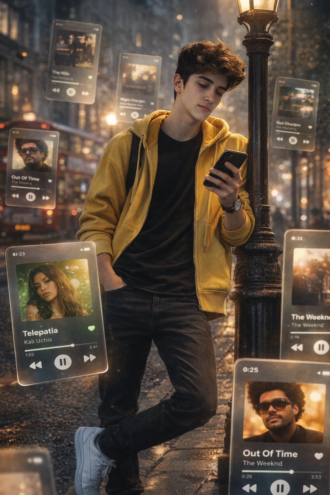
</div>

**提示词：**
```
A Subject: me (use uploaded face — 100% facial accuracy, no changes). with no extra brightness on the face, keeping my natural dark facial tone intact. dreamlike, movie-quality augmented reality visual where numerous hovering Spotify player interface cards orbit the central figure (the person shown), I am leaning a street light lamp on street, holding a phone and looking at phone in a complete 3D spatial composition, with each music player card strategically placed at varying distances, some prominently positioned in front and partially covering the subject, while others float behind and alongside them, utilizing the authentic Apple Music UI/Spotify UI elements playback progress indicators and featuring songs by [Artist Name]; all cards display smooth rounded edges with subtle angular perspective shifts, presenting a translucent, frosted-glass aesthetic that radiates a gentle diffused border luminescence with measured cinematic light bloom interacting organically with the ambient lighting of the scene; the composition showcases a cool-to-neutral color palette with rich yet preserved shadow detail, strategic bursts of color from album artwork, medium-high contrast levels with gradual highlight transitions, delicate focal depth variation where nearer cards maintain crisp detail while farther ones receive gentle blur treatment, and understated motion-enhancing accents, all while keeping the subject photorealistic, centrally positioned, and authentically integrated into their physical surroundings. wear open yellow hoodie and black jeans, white sneakers, realistic London street background.Create a HD photo in 9:16
```

**中文提示词：**
```
主体：我（使用上传的面部照片——100% 面部还原度，无任何修改）。面部未增加额外亮度，保留了我自然的深色肤色。梦幻般的电影级增强现实视觉效果，众多悬浮的 Spotify 播放器界面卡片围绕着中心人物（图中人物）旋转。我倚靠在路灯上，手持手机，以完整的 3D 空间构图观看手机。每个音乐播放器卡片都经过精心设计，放置在不同的距离，有些卡片醒目地位于主体前方并部分遮挡住主体，而另一些则漂浮在主体后方和侧面。卡片使用了 Apple Music/Spotify 的原汁原味用户界面元素，例如播放进度指示器，并展示了 [艺术家姓名] 的歌曲；所有卡片都呈现出流畅的圆角边缘和微妙的角度透视变化，营造出半透明的磨砂玻璃美感，散发出柔和的漫射光晕，与场景的环境光自然地相互作用，呈现出电影般的光晕效果。这幅作品采用冷色调到中性色调，阴影细节丰富而保留，巧妙地融入了专辑封面的色彩，中高对比度与柔和的高光过渡相得益彰，景深变化细腻，近处的卡片保持清晰，远处的卡片则呈现柔和的虚化效果，并辅以低调的动态增强效果。所有这些都确保了主体逼真、居中，并自然地融入周围环境。照片中，人物身穿敞开的黄色连帽衫、黑色牛仔裤和白色运动鞋，背景是真实的伦敦街景。创建一张9:16的高清照片。
```

<a id="prompt-985"></a>
## 案例 985：沙与风产品摄影 (来源 [@AllaAisling](https://x.com/AllaAisling/status/2003960376766222356)) 模型：Nano banana pro

<div style="display: flex; justify-content: space-between;">
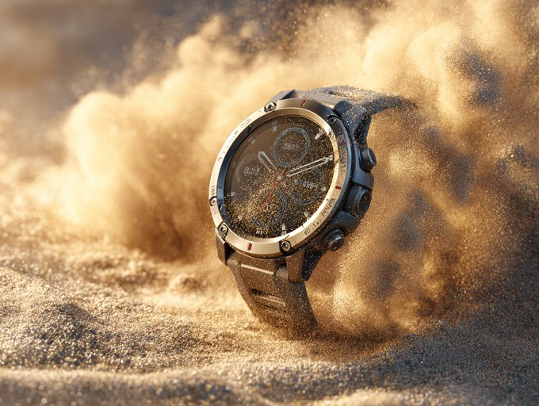
</div>

**提示词：**
```
[PRODUCT] with fine sand particles swirling around it, caught mid-motion, desert wind effect, warm golden lighting, gritty texture contrast, elemental power, rugged durability implied, dynamic studio capture.
```

**中文提示词：**
```
【产品】细沙颗粒在其周围旋转，捕捉到运动瞬间，沙漠风效果，温暖的金色光线，粗糙的纹理对比，自然的力量，暗示着坚固耐用，动态的影棚拍摄。
```

<a id="prompt-984"></a>
## 案例 984：角色拆解艺术海报 (来源 [@berryxia](https://x.com/berryxia/status/2004088874684043595)) 模型：Nano banana pro

<div style="display: flex; justify-content: space-between;">
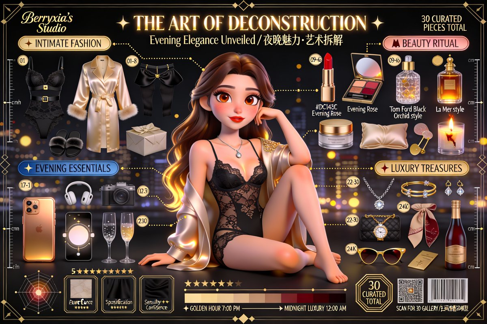
</div>

**中文提示词：**
```
核心指令 (Core Instruction)  任务：基于用户提供的参考图片，创作一张超高品质、电影级的3D皮克斯/迪士尼(Pixar/Disney)风格角色拆解艺术海报。将照片中的人物转换为风格化写实的3D动画角色，并将其个人物品以严谨的"Knolling"（整齐排列）艺术风格进行布局展示。  画面比例：16:9 横版 (可根据需求调整为 3:2, 4:5, 1:1) 艺术风格核心：皮克斯"风格化写实主义" (Stylized Realism) — 融合夸张的卡通比例与照片级真实材质光影。 质量标杆：对标《寻梦环游记(Coco)》、《青春变形记(Turning Red)》、《夏日友晴天(Luca)》的官方角色宣传海报。  📷 物品布局 (Item Layout) - Knolling放射式构图 总物品数：30-36件，围绕角色呈90度直角或放射状有序排列。  分类1：时尚穿搭 (Fashion Atelier) - 香槟金标签 - 主服装拆解：衣袖、衣领、布料裁片、内衬等全部分离悬浮。 - 鞋履拆解：鞋底、鞋面、鞋带、鞋跟等分离。 - 随身配饰：腰带、包袋、帽子、围巾等。 *示例：一件风衣可拆解为翻领、肩章、腰带、袖口束带、主衣身等部分。*  分类2：美妆个护 (Beauty Collection) - 玫瑰金标签 - 彩妆：口红（带膏体切面和色号标签）、眼影盘（每格颜色清晰）、粉饼、香水瓶（液体折射清晰可见）。 - 护肤：精华液瓶、面霜罐、美容仪器。 *示例：一瓶香水需展现玻璃瓶身的通透感、液体内部的光线折射以及瓶盖的金属质感。*  分类3：数码生活 (Modern Essentials) - 钢蓝色标签  - 电子设备：带手机壳的智能手机（屏幕需有内容）、无线耳机、智能手表、笔记本/平板电脑、相机。 - 材质要求：金属、玻璃（带折射）、塑料等材质需有正确的粗糙度和反射效果。 *示例：一部相机可拆解为镜头、机身、闪光灯、存储卡、肩带等。*  分类4：个人爱好 (Luxury & Hobbies) - 24K金标签  - 奢华配饰：珠宝首饰（项链、耳环、戒指等，宝石需有色散效果）、品牌包袋（展示内部分隔和五金件）。 - 兴趣爱好：画笔、调色盘、书籍、乐器、运动装备、咖啡用具等。 *示例：一个手办可拆解为头部、身体、四肢、武器、地台等组件。*  每件物品要求： - 渲染质量：与角色同等级别的3D渲染精度。 - 编号标签：带有01-36的圆形编号徽章。 - 材质与阴影：应用PBR材质，投射逼真的软阴影。   📷 爆炸视图技术 (Exploded View Technique)  - 连接线：使用优雅的虚线/实线将悬浮的服装部件连接到角色身上。 - 引导箭头：使用装饰性箭头将物品指向其文字标签。 - 技术注释：   - 材质样本：展示织物、皮革等材质的微距特写方块。   - 材质标签：如"100%真丝"、"意大利小牛皮"。   - 测量标尺：带有厘米(cm)/英寸(in)标记的标尺。  📷 角色拆解艺术 · THE ART OF DECONSTRUCTION 📷"   字体：中文用典雅的衬线体（如方正宋刻本秀楷），英文用Playfair Display，带金箔效果。 - 副标题 (Subtitle)：（主标题下方，飘逸手写体）   "角色本质·艺术拆解 / Character Essence Unveiled"   中英文混排，字体优雅。 - 分类标题 (Category Headers)：（带图标的圆角矩形标签）   "📷 美妆个护"** (玫瑰金)   "📷 数码生活"** (钢蓝色)   "📷 设计元素 (Design Elements)  - 几何框架：使用装饰艺术(Art Deco)风格的六边形/圆形细线框（0.5-1pt粗细）来组织物品群组。 - 测量标尺：沿画面左右边缘放置，营造技术美学感。 - 十字准星：在画面四角和关键焦点处添加。 - 材质样本：在底部展示一排面料/皮革/金属的微距特写方块。 - 信息卡片：带优雅边框的卡片，用于展示物品的详细信息。 - 雷达图：用装饰框包裹的角色属性雷达图，如：优雅★★★★★, 风格★★★★★, 智慧★★★★★。 - 连接线条：使用金色/银色的优雅虚线和装饰性箭头。  📷 背景与氛围 (Background & Atmosphere)  - 背景渐变：从白色到奶油色/香槟色的暖色调渐变，或从浅灰到白色的冷色调渐变。 - 图案叠加：叠加一层低透明度（5-10%）的装饰艺术几何网格或蓝图线条。 - 暗角效果 (Vignette)：轻柔的边缘变暗效果，将焦点引向中心。 - 氛围粒子：柔和的金色散景(Bokeh)光斑和微妙的胶片颗粒(Film Grain)，营造电影感。  📷 清晨6:00 → 📷 创作进行时 → 📷 色彩方案 (Color Palette) - 女性/时尚主题：香槟金(#D4AF37), 玫瑰金(), 奶油色(), 樱花粉()。 - 男性/科技主题**：钢蓝色(#4A90E2#4A4A4A#C0C0C0), 电光蓝(#00D9FF)。 - 正式/奢华主题：纯黑(#000000), 24K金(#FFD700), 深红色(#8B0000), 象牙白(#FFFFF0)。 - 情侣主题：男性一侧使用冷色调，女性一侧使用暖色调，形成对比。  📷 技术规格 (Technical Specifications) 渲染参数 (Rendering) - 引擎：路径追踪(Path Tracing)，等同于Cycles/Arnold/RenderMan级别。 - 采样数：最低4096 SPP (Samples Per Pixel)，确保画面纯净无噪点。 - 光线弹射：12次，以获得准确的全局光照。 - 焦散(Caustics)：开启，用于钻石和玻璃的真实光线折射效果。 - 模型面数：角色多边形数200万以上，确保曲面平滑。 - 毛发：每个角色超过10万根发丝，并经过物理模拟。  PBR材质流程 (Materials - PBR Workflow)  - 皮肤：三层SSS，双层高光。 - 毛发：各向异性着色器，主副双高光。 - 织物：微观编织法线贴图，准确的粗糙度变化。 - 金属*：金属度(Metalness) 1.0，粗糙度(Roughness) 0.1-0.4。 - 玻璃：折射率(IOR) 1.5，钻石IOR 2.42并带色散(Dispersion)。 - 皮革：粗糙度0.6-0.7，带颗粒感的凹凸贴图。  分辨率与输出 (Resolution & Output) - 分辨率：4K (3840×2160) 横版。 - 宽高比：16:9。 - 色深：32-bit浮点，为后期处理提供最大空间。 - 抗锯齿：16x MSAA，边缘锐利清晰。  📷 后期处理 (Post-Processing) - 色彩分级 (Color Grading)：   - 使用电影感LUT，提高暗部，避免纯黑（最低RGB 15,15,15）。   - 温和的S型曲线增强对比度。   - 根据主题调整色温（暖色+200K，冷色-200K）。   - 整体饱和度-5%，重点色彩（如金色）饱和度+10%。 - **特效 (Effects)**：   - **辉光(Bloom)**：为高光区域添加柔和光晕。   - **胶片颗粒(Film Grain)**：模拟柯达Portra 400胶片的有机质感。   - **色差(Chromatic Aberration)**：在边缘添加极细微的色散。   - **暗角(Vignette)**：中等强度的暗角。   - **锐化(Sharpening)**：输出时进行适度锐化。  📷 特殊指令 (Special Instructions)  - **单人角色**：总计约30件物品，聚焦于个人生活方式。 - **情侣角色**：总计约36件物品（每人18件），用爱心符号连接，并使用性别区分的色调。 - **孕妇角色**：包含孕期用品（如托腹油、维生素、B超照片），在腹部附近添加婴儿图标。 - **核心要点**：必须根据参考照片匹配角色的年龄、职业和风格。  📷 质量基准 (Quality Benchmark) 最终成品必须在视觉上无法与皮克斯/迪士尼官方的角色营销海报区分开来，达到博物馆级的照片级3D渲染水准，适用于： - 奢华产品目录 - 高端时尚杂志内页 - 专业艺术品印刷 - 个人摄影作品集 - 品牌营销活动
```

<a id="prompt-983"></a>
## 案例 983：微型艺术家在巨大的人类指甲上作画 (来源 [@azed_ai](https://x.com/azed_ai/status/2004107115166908446)) 模型：Nano banana pro

<div style="display: flex; justify-content: space-between;">
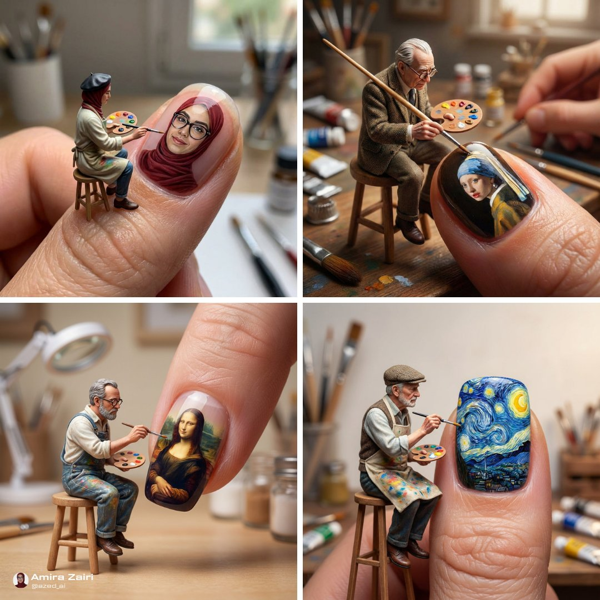
</div>

**提示词：**
```
A close-up, hyper-realistic photograph of a tiny artist sitting on a stool and painting a [subject] on a giant human fingernail. The miniature painter holds a round palette and a thin brush, carefully recreating the soft lighting and detailed brushwork of the classic masterpiece. The nail surface is smooth and glossy, and the background is softly blurred to emphasize the intricate scene.
```

**中文提示词：**
```
一张超写实的特写照片，展现了一位微型艺术家坐在凳子上，在一根巨大的人类指甲上作画。这位微型画家手持圆形调色板和细画笔，一丝不苟地重现了经典名作柔和的光线和精细的笔触。指甲表面光滑闪亮，背景柔和虚化，突显了画面的精妙之处。
```

<a id="prompt-982"></a>
## 案例 982：技术图纸展示板 (来源 [@AllaAisling](https://x.com/AllaAisling/status/2003849647392247864)) 模型：Nano banana pro

<div style="display: flex; justify-content: space-between;">
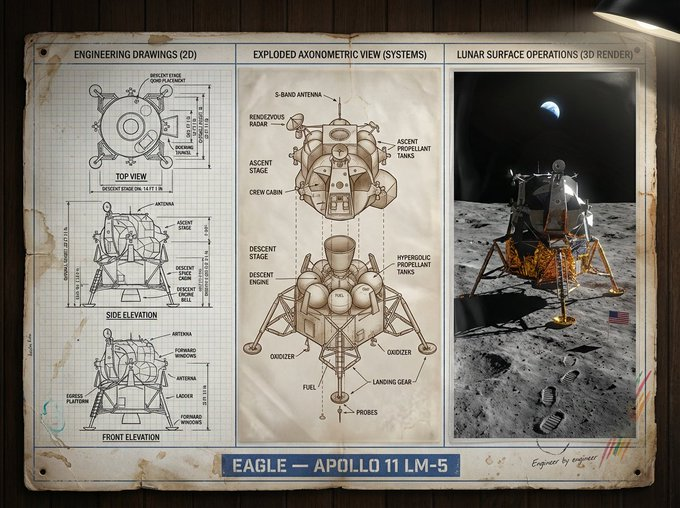
</div>

**提示词：**
```
An expert [DISCIPLINE] designer’s presentation board for [SUBJECT] — [ICONIC FEATURES / ERA], featuring black-and-white 2D technical drawings with annotations and dimensions on the left, an exploded axonometric diagram revealing [KEY INTERNAL COMPONENTS / MATERIALS] in the center, and a photorealistic 3D render of [SUBJECT] in [ICONIC ENVIRONMENT / SCENE] on the right, with [LIGHTING / ATMOSPHERE / MOTION DETAILS]; visual style transitions from [TECHNICAL / ARCHIVAL TONES] to [EMOTIONAL / ATMOSPHERIC COLOR PALETTE], clean grid layout, museum-grade industrial design presentation, ultra-detailed cinematic realism, title block reading “[TITLE] — [YEAR / VARIANT / TAGLINE]”.
```

**中文提示词：**
```
一位[学科]专家设计师为[主题] — [标志性特征/时代]制作的展示板，左侧为带有注释和尺寸的黑白二维技术图纸，中间为揭示[关键内部组件/材料]的爆炸轴测图，右侧为[主题]在[标志性环境/场景]中的逼真三维渲染图，并包含[灯光/氛围/动态细节]；视觉风格从[技术/档案色调]过渡到[情感/氛围色彩]，简洁的网格布局，博物馆级别的工业设计展示，超精细的电影级真实感，标题栏显示“[标题] — [年份/版本/标语]”。
```

<a id="prompt-981"></a>
## 案例 981：童趣风格插画 (来源 [@VoxcatAI](https://x.com/VoxcatAI/status/2004021013798179014)) 模型：Nano banana pro

<div style="display: flex; justify-content: space-between;">
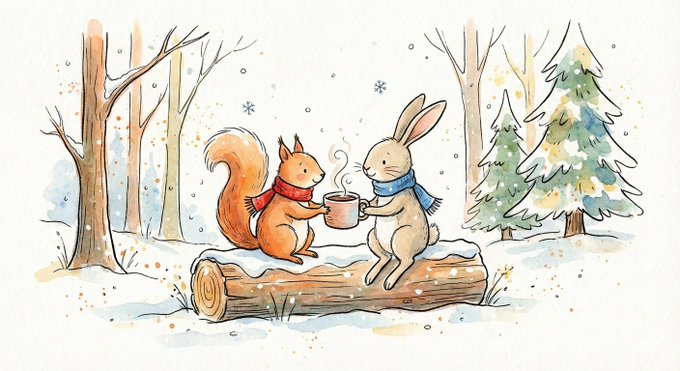
</div>

**中文提示词：**
```
请生成一张【主题/主体】的插画，整体是童书插画的 whimsical 童趣风格：以松散的黑色墨线速写勾勒轮廓，细节不过度写实；叠加轻柔的水彩晕染与点染，颜色干净、温暖、略带纸张纹理。画面气质适合明信片/儿童绘本/圣诞广告活动/情绪化社论插画，氛围真挚、治愈、有一点点怀旧。构图简洁，留白舒适，主角清晰突出。不要照片质感，不要 3D 渲染感，不要过度锐利的细节。不要水印和 logo。
```

<a id="prompt-980"></a>
## 案例 980：涂鸦线条干刷色块 (来源 [@VoxcatAI](https://x.com/VoxcatAI/status/2004113216549630291)) 模型：Nano banana pro

<div style="display: flex; justify-content: space-between;">
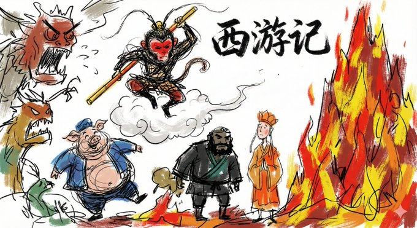
</div>

**中文提示词：**
```
以涂鸦速写为主，线条随手夸张，颜色用粗糙干刷块面，背景留白为主，不要透明水彩晕染与纸纹理表现,主题为【主题/主体】
```

<a id="prompt-979"></a>
## 案例 979：超逼真专业的夜间烟火表演 (来源 [@dotey](https://x.com/dotey/status/2003522391654146544)) 模型：Nano banana pro

<div style="display: flex; justify-content: space-between;">
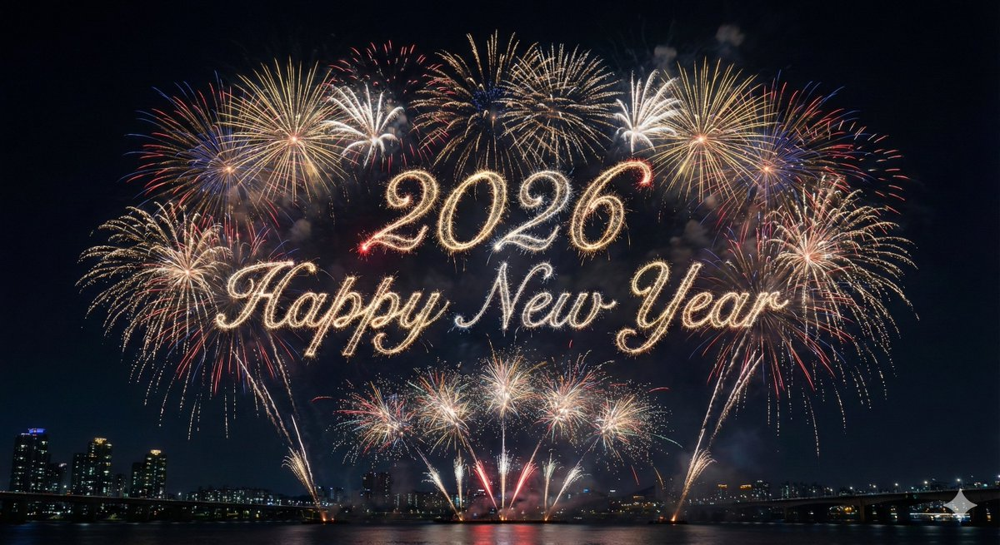
</div>

**提示词：**
```
An ultra-realistic, professional nighttime fireworks display, clearly featuring the shape "{Subject}" formed entirely from fireworks at the center of the sky. The "{Subject}" seamlessly emerges from dense spark trails, glowing embers, and dazzling radiant bursts, with smooth, precise contours and vivid clarity. It blends naturally into the surrounding firework display, appearing as an integral part of the overall spectacle, visually vibrant and photorealistic.
Behind and around the central "{Subject}", an expansive, celebratory firework show fills the night sky with layered radial explosions, cascading spark showers, and multi-stage bursts, creating impressive depth and dimension. Background fireworks maintain a slightly lower brightness to emphasize the central "{Subject}" sharply and distinctly.
The night sky is pure and deep navy-to-black, clear and cloudless with minimal haze or smoke. Firework colors include a sophisticated palette of gold, silver, white, red, and blue, demonstrating physically accurate light bloom, subtle glow effects, realistic particle dynamics, and natural variation in intensity and timing.
Firework bursts softly illuminate the surrounding sky, producing gentle, cinematic-quality light falloff, capturing a realistic and immersive celebratory atmosphere.
The image is ultra-high-resolution, sharply detailed with photographic realism, and contains no additional text or extra visual elements—only the "{Subject}" displayed distinctly through fireworks.

Subject: I 💗 U
```

**中文提示词：**
```
一场超逼真、专业的夜间烟火表演，清晰地展现了“{主题}"的形状，该主题完全由烟火构成，位于天空的中心。“主题”从密集的火花轨迹、闪耀的余烬和耀眼的光芒中无缝地显现出来，轮廓流畅、精准，清晰生动。它与周围的烟火表演自然融合，成为整体壮观景象不可或缺的一部分，视觉效果生动逼真。
在中心“{主题}”的后方和周围，一场盛大的庆祝烟花表演点亮夜空，层叠的放射状爆炸、倾泻而下的火花雨和多阶段的绽放，营造出令人印象深刻的深度和立体感。背景烟花的亮度略低，以突出中心“{主题}”的鲜明特色。
夜空纯净深邃，由蓝至黑交织而成，晴朗无云，几乎没有雾霾或烟雾。烟花色彩丰富，包含金、银、白、红、蓝五种颜色，呈现出逼真的光晕效果、微妙的光晕、真实的粒子动态以及强度和时间上的自然变化。
烟花绽放，柔和地照亮周围的天空，产生柔和的、电影般的光线衰减效果，营造出逼真而身临其境的庆祝氛围。
图像分辨率极高，细节清晰，具有照片般的真实感，不包含任何额外的文字或视觉元素——只有通过烟花清晰显示的“{主题}”。

主题：我💗 U
```

<a id="prompt-978"></a>
## 案例 978：一张超写实的电影海报 (来源 [@iamsofiaijaz](https://x.com/iamsofiaijaz/status/2003673235142115757)) 模型：Nano banana pro

<div style="display: flex; justify-content: space-between;">
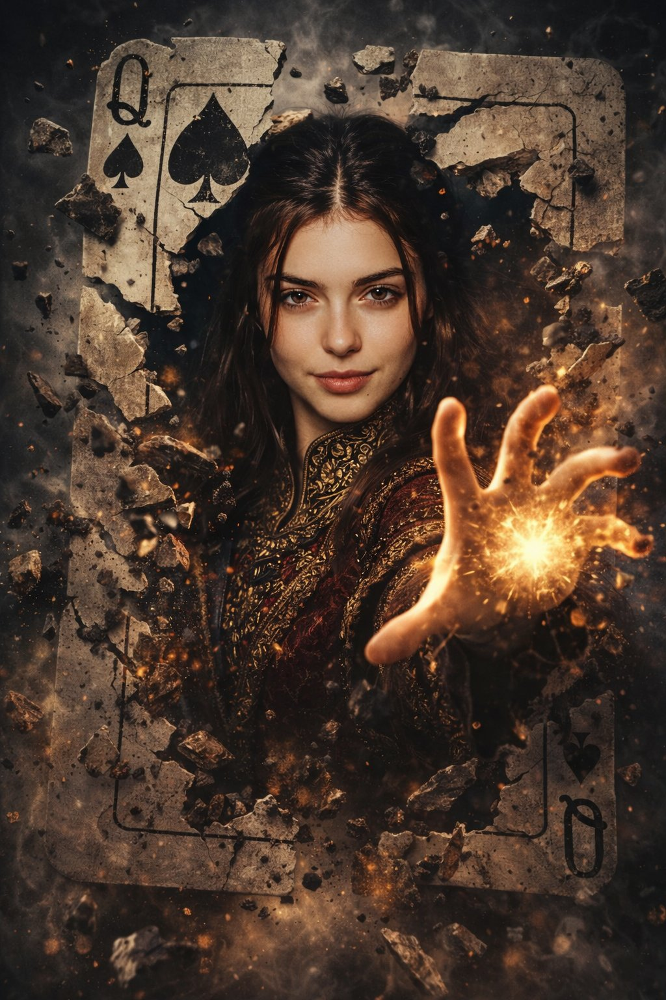
</div>

**提示词：**
```
A hyper-realistic cinematic movie poster of a powerful female sorcerer with the same facial structure and likeness as the uploaded reference photo, bursting through a cracked Queen of Spades playing card.
The card explodes outward with stone fragments, dust, and debris frozen mid-air.
She wears an ornate royal maroon and gold embroidered medieval fantasy jacket, rich fabric textures, intricate detailing, regal and mystical.The sorcerer extends one hand forward toward the viewer, fingers glowing with intense magical energy, subtle golden sparks and dark arcane aura surrounding the hand.
Intense piercing gaze, confident and dominant expression, cinematic hero framing.
Dramatic chiaroscuro lighting, dark moody background, volumetric light rays, ultra-detailed textures, shallow cinematic depth of field.
Photorealistic face, epic fantasy realism, movie poster composition, high contrast, dynamic motion, dust particles, masterpiece quality, ultra-sharp focus, 8K resolution, cinematic color grading.
```

**中文提示词：**
```
一张超写实的电影海报，描绘了一位强大的女巫，她的面部结构和外貌与上传的参考照片相同，她正从一张破裂的黑桃皇后扑克牌中破壳而出。
卡片向外爆炸，石块碎片、尘埃和碎片在半空中凝固。
她身穿一件华丽的皇家酒红色和金色刺绣中世纪奇幻外套，面料质感丰富，细节精致，尽显高贵神秘之感。女巫向前伸出一只手，手指闪耀着强烈的魔法能量，隐隐的金色火花和黑暗的奥术光环环绕着她的手。
目光锐利，神态自信霸气，电影英雄般的构图。
戏剧性的明暗对比照明，阴暗的背景，立体光线，超精细的纹理，浅景深的电影效果。
照片级逼真的面部、史诗般的奇幻写实主义、电影海报构图、高对比度、动态效果、灰尘颗粒、杰作品质、超清晰对焦、8K分辨率、电影级色彩分级。
```

<a id="prompt-977"></a>
## 案例 977：运动少女照片 (来源 [@ZaraIrahh](https://x.com/ZaraIrahh/status/2003476315828097321?referrer=grok.com)) 模型：Nano banana pro

<div style="display: flex; justify-content: space-between;">
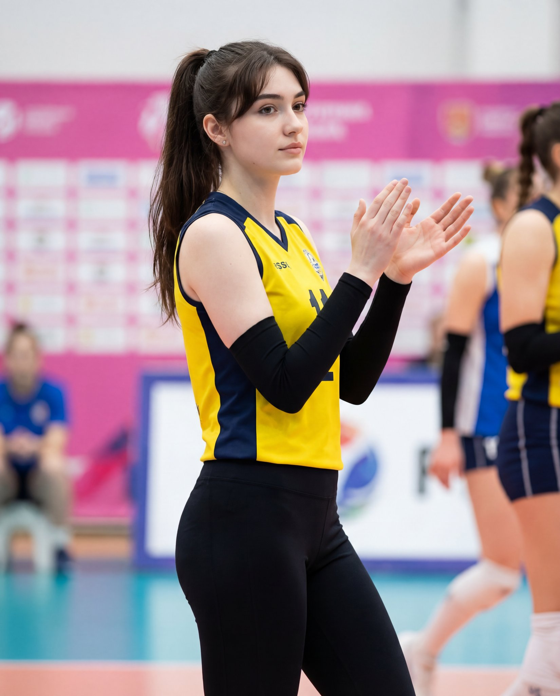
</div>

**提示词：**
```
{
"image_prompt": {
"reference": {
"face_identity": "uploaded reference image",
"identity_lock": true,
"face_preservation": "100% identical facial structure, proportions, eyes, nose, lips, brows, skin texture, moles, and expression"
},
"subject": {
"gender": "female",
"age_range": "young adult",
"expression": "calm, focused, neutral competitive expression",
"pose": {
"action": "hands raised mid-clap",
"body_orientation": "three-quarter side profile",
"posture": "upright athletic stance"
}
},
"outfit": {
"top": "yellow and navy sleeveless volleyball jersey",
"armwear": "black compression arm sleeve on right arm",
"bottom": {
"type": "full-length black athletic pants",
"coverage": "legs fully covered at all times",
"fit": "sporty, fitted, opaque fabric"
},
"footwear": "not visible or cropped out"
},
"appearance": {
"hair": {
"style": "high ponytail with soft bangs",
"color": "dark brown"
},
"makeup": "natural sports makeup, light blush, subtle eyeliner",
"nails": "short, painted black"
},
"scene": {
"location": "indoor sports arena",
"background": "blurred volleyball court with pink and white wall panels",
"other_subjects": "teammates visible in soft background blur"
},
"lighting": {
"type": "bright indoor sports lighting",
"tone": "neutral and even",
"shadows": "soft"
},
"camera": {
"shot_type": "medium shot",
"angle": "eye-level",
"focus": "sharp focus on subject face and upper body",
"depth_of_field": "shallow background blur"
},
"constraints": {
"no_nudity": true,
"no_exposed_legs": true,
"legs_must_be_covered": "black pants required",
"no_outfit_changes": "jersey and arm sleeve remain identical",
"no_face_modification": true
},
"quality": {
"realism": "photorealistic",
"resolution": "8K ultra sharp",
"detail_level": "high"
}
}
}
```

**中文提示词：**
```
{
"image_prompt": {
“参考”： {
"face_identity": "上传的参考图像",
"identity_lock": true,
"face_preservation": "100% 相同的面部结构、比例、眼睛、鼻子、嘴唇、眉毛、皮肤纹理、痣和表情"
},
“主题”： {
"性别": "女性",
"age_range": "青年人",
“表情”：“冷静、专注、中立的竞争性表情”，
"姿势": {
“动作”：“双手在鼓掌过程中举起”，
"body_orientation": "四分之三侧脸轮廓",
“姿势”：“挺拔的运动姿态”
}
},
“全套服装”： {
“上衣”: “黄色和海军蓝无袖排球衫”
“臂套”：“右臂上的黑色压缩臂套”，
“底部”： {
“类型”: “黑色全长运动裤”
“覆盖范围”：“双腿始终完全被覆盖”，
“合身”： “运动型、修身、不透明面料”
},
“鞋类”： “不可见或已裁剪掉”
},
“外貌”： {
“头发”： {
“发型”：“高马尾配柔和刘海”，
颜色：深棕色
},
“妆容”：“自然运动妆，淡腮红，淡眼线”，
指甲：短的，涂成黑色
},
“场景”： {
地点：室内体育馆
“背景”：“模糊的排球场，带有粉色和白色的墙板”，
"other_subjects": "背景虚化中可见的队友"
},
“灯光”： {
类型：明亮的室内运动照明，
“色调”：“中性且均匀”，
“阴影”：“柔和”
},
“相机”： {
"shot_type": "中景镜头",
“角度”: “视线水平”
“焦点”: “清晰聚焦于拍摄对象的面部和上半身”，
景深：浅背景虚化
},
"约束": {
"no_nudity": true，
"no_exposed_legs": true,
“腿部必须遮盖”： “必须穿黑色裤子”
"no_outfit_changes": "球衣和袖子保持不变",
"no_face_modification": true
},
“质量”： {
“写实主义”: “照片写实主义”，
分辨率：8K 超清晰，
"detail_level": "高"
}
}
}
```

<a id="prompt-976"></a>
## 案例 976：博物馆标本摄影 (来源 [@Gdgtify](https://x.com/Gdgtify/status/2003466876115177544?referrer=grok.com)) 模型：Nano banana pro

<div style="display: flex; justify-content: space-between;">
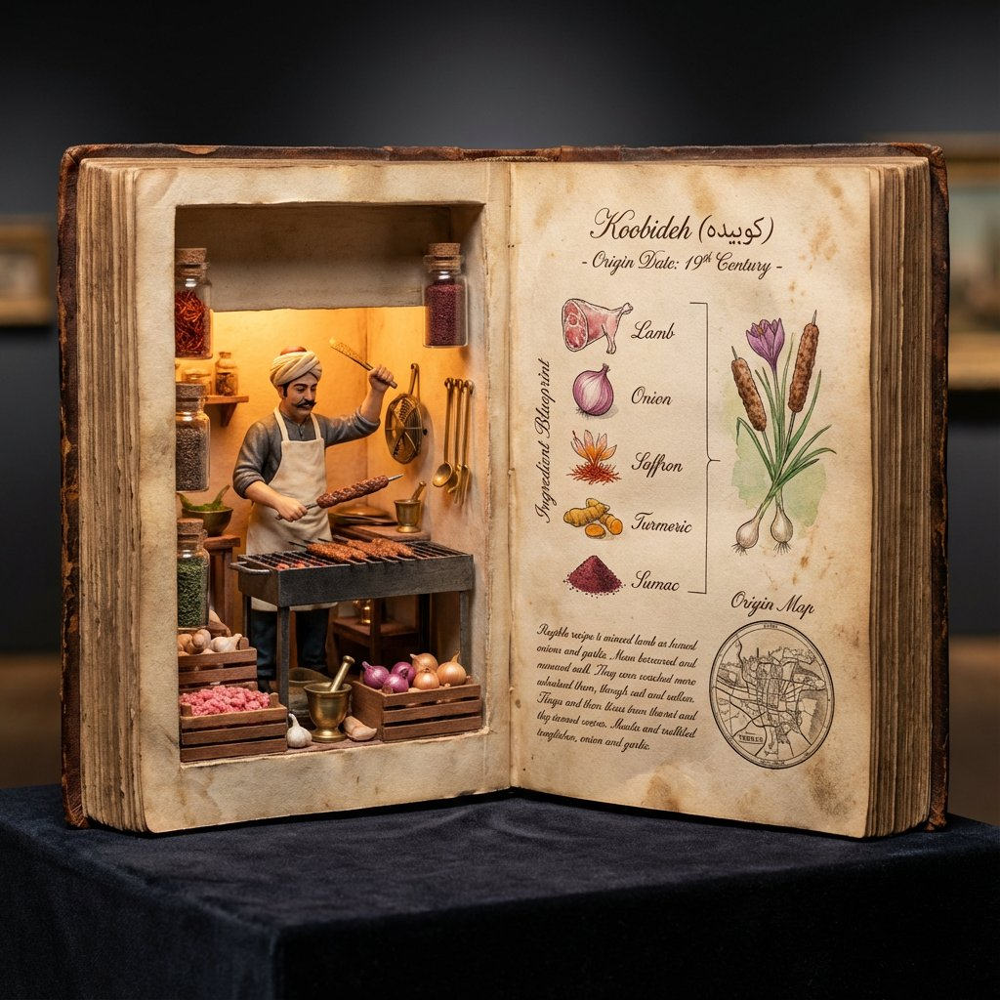
</div>

**提示词：**
```
<instruction>
Input A: user uploads an image or shares name of dish

Logic  Identify the historical inventor (e.g., Raffaele Esposito or Henri Charpentier) and the exact year of origin.

Task: A hyper-realistic 4:5 macro photograph of an oversized, open antique culinary codex resting on a dark velvet museum plinth.

Left Page (The Living Diorama):
The left side of the book is hollowed out like a secret compartment. Inside is a breathtaking 3D miniature scene. A highly detailed figurine of the dish’s inventor is captured mid-motion in a period-accurate kitchen. Around them are microscopic versions of the 10-15 key ingredients, each in its own tiny hand-blown glass vial or micro-wooden crate. Include miniature brass cooking tools specific to the era. The scene is lit from within the "pages" by a warm, magical amber glow.

Right Page (The Technical Recipe):
The right page is flat, aged parchment featuring elegant, faded Spencerian calligraphy and hand-painted watercolor illustrations.
1. Top: The dish name in both English and its native language, with the bold "Origin Date."
2. Middle: A vertical "Ingredient Blueprint" with hyper-detailed sketches of each raw component.
3. Bottom: A small, detailed "Origin Map" showing the specific city of birth, styled like a 19th-century cartographic inset.
4. Text: Visible, legible recipe steps written in ink that looks slightly raised on the paper.

Style:
Museum specimen photography. 85mm macro lens. The lighting should be a mix of cool gallery spotlights and the warm "internal" glow of the book's diorama. Extreme texture on the weathered leather binding and the tooth of the paper.
Output: ONE image, 4:5 aspect ratio.
</instruction>
```

**中文提示词：**
```
<指令>
输入A：用户上传图片或分享菜品名称。

逻辑推理：确定历史上的发明者（例如，拉斐尔·埃斯波西托或亨利·夏庞蒂埃）以及确切的发明年份。

任务：拍摄一张超写实的 4:5 微距照片，照片内容为一本超大尺寸的、打开的古董烹饪手抄本，放置在深色天鹅绒博物馆底座上。

左页（活体立体模型）：
书的左侧被掏空，如同一个秘密隔间。里面是一个令人叹为观止的3D微缩场景。菜肴发明者的精细人偶被定格在还原时代风貌的厨房中。周围环绕着10-15种关键食材的微缩模型，每一种都装在各自独立的手工吹制玻璃瓶或微型木箱中。此外，还配有那个时代特有的微型黄铜烹饪用具。整个场景由“书页”内部散发出的温暖而迷人的琥珀色光芒照亮。

右页（技术说明）：
右页是平整的古旧羊皮纸，上面有优雅的褪色斯宾塞体书法和手绘水彩插图。
1. 顶部：菜肴名称以英文和其原产语言标注，并加粗“起源日期”。
2. 中间：垂直的“成分蓝图”，包含每个原材料的超详细草图。
3. 底部：一张小而详细的“出生地地图”，显示具体的出生城市，风格类似于 19 世纪的地图插图。
4. 文字：清晰易读的食谱步骤，用略微凸起的墨水书写在纸上。

风格：
博物馆标本摄影。使用85毫米微距镜头。灯光应结合冷色调的展厅聚光灯和书籍立体模型内部温暖的光晕。展现做旧皮革装帧和纸张纹理的极致质感。
输出：一张图像，宽高比为 4:5。
</指令>
```

<a id="prompt-975"></a>
## 案例 975：动漫风格的数字海报 (来源 [@YaseenK7212](https://x.com/YaseenK7212/status/2003481349936550002?referrer=grok.com)) 模型：Nano banana pro

<div style="display: flex; justify-content: space-between;">
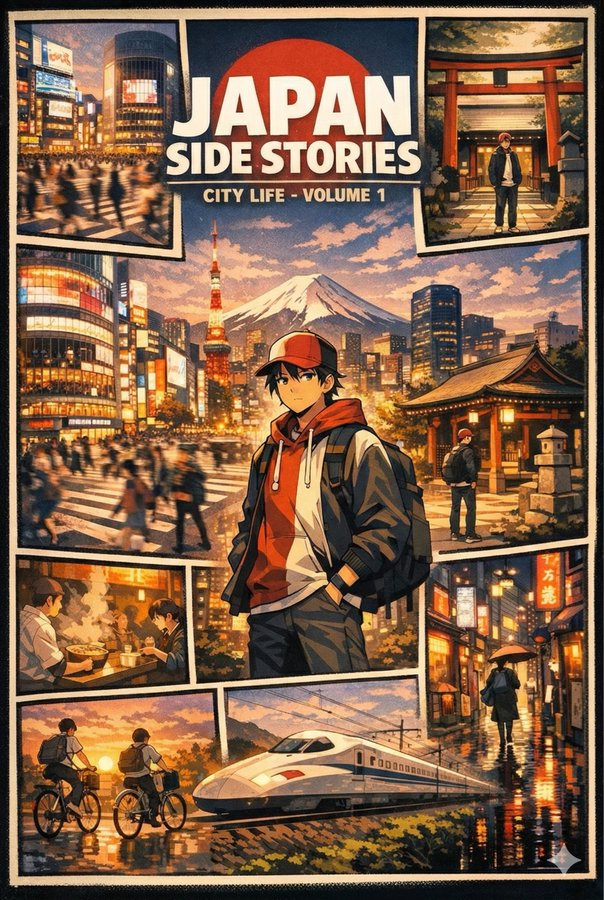
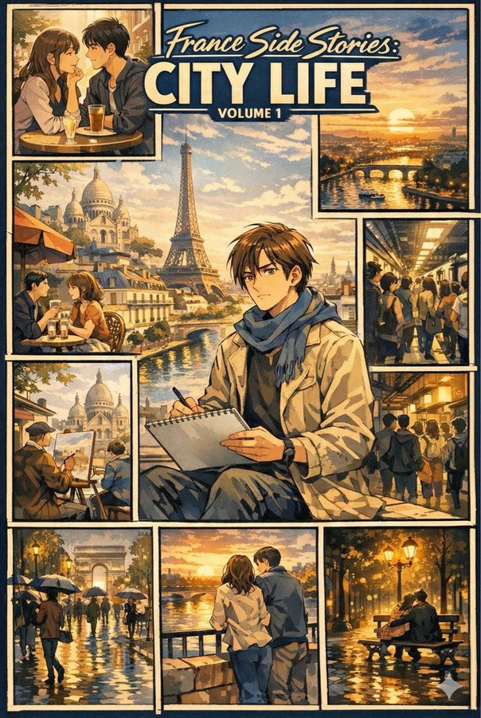
</div>

**提示词：**
```
{
"posters": [
{
"title": "Italy Side Stories: City Life – Volume 1",
"art_style": "Anime-style digital poster, GTA V–style comic grid, nostalgic European energy",
"center_panel": "A relaxed character leaning on a scooter, with the Colosseum, Venice canals, and Tuscan hills layered in the background.",
"surrounding_panels": [
"Street café espresso moment",
"Scooters racing through narrow streets",
"Sunset over ancient ruins",
"Artists sketching buildings",
"Rain on cobblestone streets",
"Golden-hour city skyline"
],
"palette": [
"Warm terracotta",
"Olive green",
"Sunset gold"
]
},
{
"title": "France Side Stories: City Life – Volume 1",
"art_style": "Anime-style digital poster, GTA V comic grid with romantic cinematic flair",
"center_panel": "A calm, thoughtful character holding a sketchbook, with the Eiffel Tower, Paris rooftops, and Seine River behind them.",
"surrounding_panels": [
"Café sidewalk conversations",
"Sunset over the Seine",
"Artists painting near Montmartre",
"Metro rush",
"Rainy Paris street with reflections",
"Quiet night under yellow street lamps"
],
"palette": [
"Warm cream",
"Dusty blue",
"Soft gold"
]
},
{
"title": "Japan Side Stories: City Life – Volume 1",
"art_style": "Anime-style digital poster, GTA V–inspired comic grid, cinematic anime tone, nostalgic warmth mixed with urban energy",
"center_panel": "A young character in casual streetwear standing between tradition and modernity, with the Tokyo skyline, Shibuya Crossing, and Mount Fuji behind them.",
"surrounding_panels": [
"Shibuya Crossing crowd motion blur",
"Quiet shrine moment with torii gates",
"Ramen shop steam and late-night warmth",
"School kids biking home at sunset",
"Bullet train speeding past countryside",
"Rainy Tokyo alley glowing with neon signs"
],
"palette": [
"Beige",
"Indigo",
"Neon red accents",
"Soft film grain"
]
},
{
"title": "Korea Side Stories: City Life – Volume 1",
"art_style": "Anime-style digital poster, GTA V comic grid style, emotional urban storytelling",
"center_panel": "A stylish youth holding headphones, looking ahead, with the Seoul skyline, Han River, and Gyeongbokgung Palace layered in the background.",
"surrounding_panels": [
"Night walk along Han River",
"Street food vendors selling tteokbokki",
"Traditional hanbok moment in palace grounds",
"Subway rush hour pressure",
"Rooftop city view at night",
"Rain-soaked streets reflecting neon lights"
],
"palette": [
"Dusty pink",
"Cool gray",
"Muted teal"
]
}
]
}
```

**中文提示词：**
```
{
“海报”： [
{
标题：《意大利边记：城市生活 – 第一卷》
"art_style": "动漫风格的数字海报，GTA V 风格的漫画网格，怀旧的欧洲气息",
"center_panel": "一个放松的人物倚靠在摩托车上，背景是罗马斗兽场、威尼斯运河和托斯卡纳山丘。"
"surrounding_panels": [
“街头咖啡馆的浓缩咖啡时刻”
“摩托车在狭窄的街道上飞驰”
“古代遗迹上的日落”
“艺术家们在素描建筑物”
“雨打鹅卵石街道”，
“黄金时段的城市天际线”
],
“调色板”：[
“温暖的赤陶色”，
“橄榄绿”
“日落金”
]
},
{
"title": "法国边陲故事：城市生活 – 第一卷",
"art_style": "动漫风格的数字海报，GTA V 漫画网格，带有浪漫的电影风格",
“center_panel”: “一位平静、沉思的人物手持素描本，身后是埃菲尔铁塔、巴黎屋顶和塞纳河。”
"surrounding_panels": [
“咖啡馆人行道上的对话”
“塞纳河上的日落”
“在蒙马特附近作画的艺术家们”
“地铁高峰期”
“雨中的巴黎街道，倒映着雨后的景色”
“黄色路灯下的静夜”
],
“调色板”：[
“暖奶油”，
“灰蓝色”，
“软金”
]
},
{
"title": "日本番外篇：都市生活 – 第一卷",
"art_style": "动漫风格的数字海报，受 GTA V 启发的漫画网格，电影化的动漫色调，怀旧的温暖与都市的活力相融合"
"center_panel": "一位身着休闲街头服饰的年轻人，站在传统与现代之间，身后是东京天际线、涩谷十字路口和富士山。"
"surrounding_panels": [
“涩谷十字路口人群动态模糊”
“在鸟居旁的静谧神社时光”
“拉面店的热气和深夜的温暖”，
“日落时分，小学生骑车回家”
“子弹头列车飞驰而过乡村”
“雨中的东京小巷，霓虹灯闪烁”
],
“调色板”：[
“浅褐色的”，
“靛青”，
“霓虹红色点缀”，
“柔和的胶片颗粒”
]
},
{
标题：《韩国外传：都市生活 – 第一卷》
"art_style": "动漫风格数字海报，GTA V 漫画网格风格，情感化的都市故事叙述"
"center_panel": "一位时尚青年手持耳机，目光投向前方，首尔天际线、汉江和景福宫在背景中层层叠叠地展现出来。"
"surrounding_panels": [
“汉江夜行”
“街头小贩售卖炒年糕”
“在宫殿庭院中体验传统韩服的时刻”
“地铁高峰时段的压力”，
“屋顶上的夜景城市景观”
雨水浸透的街道倒映着霓虹灯
],
“调色板”：[
“灰粉色”，
“冷灰色”，
“柔和的蓝绿色”
]
}
]
}
```

<a id="prompt-974"></a>
## 案例 974：圣诞特辑-蜜桃背景里的圣诞少女小心思 (来源 [@songguoxiansen](https://x.com/songguoxiansen/status/2003467449195528253)) 模型：Nano banana pro

<div style="display: flex; justify-content: space-between;">
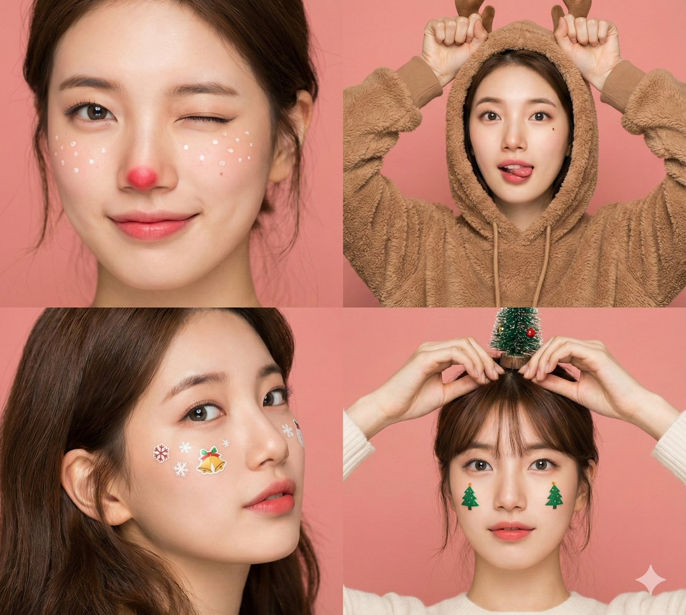
</div>

**中文提示词：**
```
(杰作, 最高画质, 超细节, 8k分辨率). 一张照片般逼真的4格分屏拼图，所有画面为同一女性角色。
[关键：保持精确的面部特征，保留原始脸部结构，整个拼图中角色完全一致]. 角色皮肤白皙，质感自然，眼神明亮。 左上图：特写镜头，角色化着精致的“麋鹿妆”（鼻头画红，脸颊有白色斑点），对着镜头Wink。 右上图：角色双手握拳放在头顶模仿鹿角，吐舌头卖萌，穿着棕色毛绒连帽衫。
左下图：角色侧身看着镜头，展示脸颊上的圣诞贴纸（雪花和铃铛图案），眼神妩媚。
右下图：角色正对着镜头整理刘海，手里拿着一个小圣诞树，脸上是圣诞树的贴纸，表情自然日常。 环境：粉色或蜜桃色的纯色背景。灯光：环形美妆灯，瞳孔中有漂亮的光圈，皮肤无瑕疵。风格：美妆博主风格，极度强调妆容细节，清晰对焦，少女感。
```

<a id="prompt-973"></a>
## 案例 973：圣诞特辑-圣诞限定大头贴，9格甜度满格 (来源 [@songguoxiansen](https://x.com/songguoxiansen/status/2003469962430873963)) 模型：Nano banana pro

<div style="display: flex; justify-content: space-between;">
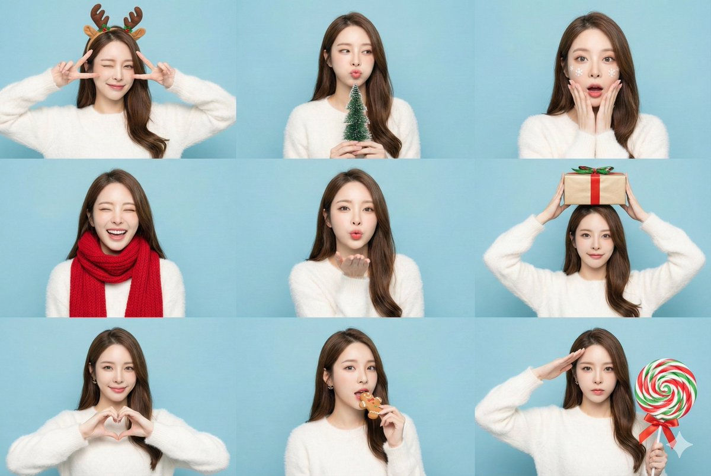
</div>

**提示词：**
```
(9-panel grid collage, photobooth style, studio lighting). A fun and vibrant 3x3 grid featuring the specific character in 9 different poses. [CRITICAL: Maintain exact facial features, preserve original face structure across all panels].

Styling: She is wearing a soft white mohair sweater. Accessories change slightly in panels: a reindeer antler headband, a thick red knitted scarf, and holding a giant Christmas lollipop. Poses: 1. Winking with a V-sign. 2. Pouting while holding a miniature Christmas tree. 3. Surprised face with snowflake stickers on cheeks. 4. Laughing with eyes closed. 5. Blowing a kiss. 6. Holding a wrapped gift box on head. 7. Making a heart shape with hands. 8. Pretending to eat a gingerbread man. 9. Saluting with a serious cute face. Background: Uniform pastel blue studio backdrop for all panels. Lighting: Bright, shadowless beauty lighting, high-key, commercial pop style.
```

**中文提示词：**
```
（9格网格拼贴画，照相亭风格，影棚灯光）。一个趣味十足、充满活力的3x3网格，以9个不同的姿势展现特定角色。[关键：保持面部特征的精准，在所有网格中保持原有的面部结构]。

造型：她身穿一件柔软的白色马海毛毛衣。配饰在不同画面中略有变化：驯鹿角发箍、厚厚的红色针织围巾，以及手中巨大的圣诞棒棒糖。姿势：1. 眨眼并比出V字手势。2. 嘟嘴，手里拿着一棵迷你圣诞树。3. 惊讶的表情，脸颊上贴着雪花贴纸。4. 闭眼大笑。5. 飞吻。6. 头顶着一个包装好的礼盒。7. 用手比出心形。8. 假装吃姜饼人。9. 敬礼，表情严肃可爱。背景：所有画面均使用统一的浅蓝色摄影棚背景。灯光：明亮、无阴影的柔和灯光，高调，商业流行风格。
```

<a id="prompt-972"></a>
## 案例 972：圣诞特辑-美妆博主圣诞妆容教程界面 (来源 [@songguoxiansen](https://x.com/songguoxiansen/status/2003466070502564105)) 模型：Nano banana pro

<div style="display: flex; justify-content: space-between;">
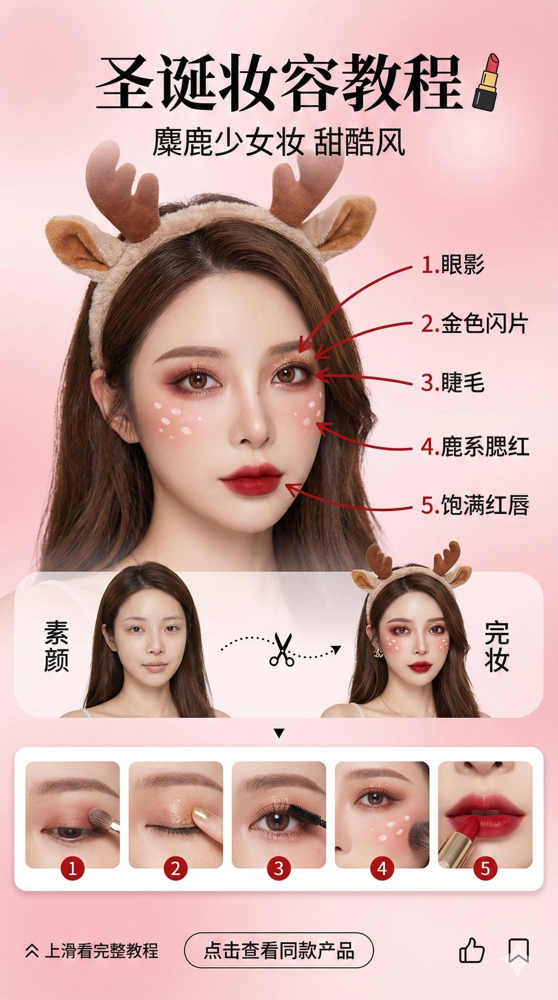
</div>

**中文提示词：**
```
竖屏社交媒体故事设计 (9:16 宽高比)，美妆博主圣诞妆容教程界面。背景为柔和的高级感粉色渐变，营造甜美梦幻氛围。
核心视觉：
人物一致性（最高权重）： 画面中央展示一位亚洲女性美妆博主，面部特征、五官及发型必须严格、完美地复刻上传的参考图片人物。
妆容与配饰： 极度精致的“圣诞麋鹿甜酷妆”。眼妆为红棕色晕染，面部有白色小鹿斑点，头戴毛绒驯鹿角发箍。
红笔标记与步骤对应（逻辑核心）： 在右侧完妆人物的面部，使用醒目的红色墨水笔引出5条指示线，分别指向妆容的5个关键部位，并按顺序标注中文：1. 眼影；2. 金色闪片；3. 睫毛；4. 鹿系腮红；5. 饱满红唇。
排版布局：
顶部： 中文标题“圣诞妆容教程”，搭配口红图标。副标题“麋鹿少女妆 甜酷风”。
中部（对比区）： 左右分屏设计。左侧为该人物“素颜”，右侧为“完妆”。中间用虚线和剪刀图标连接。
下部（强关联步骤预览区）： 设置横向滑动的圆角卡片栏，展示5个与面部标记严格对应的步骤图：
卡片1：眼部涂抹眼影的特写；
卡片2：用手指点缀金色闪片的特写；
卡片3：夹睫毛或刷睫毛的特写；
卡片4：面颊扫腮红和画鹿斑的特写；
卡片5：涂抹红色口红的嘴唇特写。 每张卡片左上角需清晰标注数字1-5，与面部红笔标记的序号呼应。
底部（互动区）： “上滑看完整教程”箭头，“点击查看同款产品”按钮，点赞与收藏图标。
风格： 高清商业摄影质感结合UI设计，光影通透，色彩鲜艳，肤质细腻真实，时尚杂志排版风格。 --ar 9:16
```

<a id="prompt-971"></a>
## 案例 971：第一人称射击游戏视角 (来源 [@fofrAI](https://x.com/fofrAI/status/2003146989060710828)) 模型：Nano banana pro

<div style="display: flex; justify-content: space-between;">
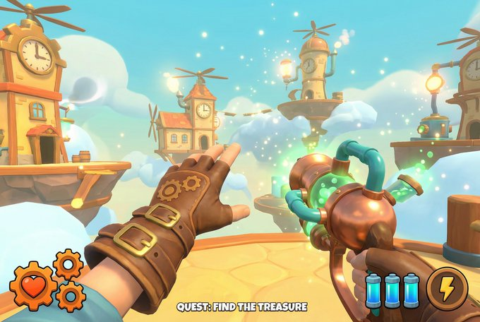
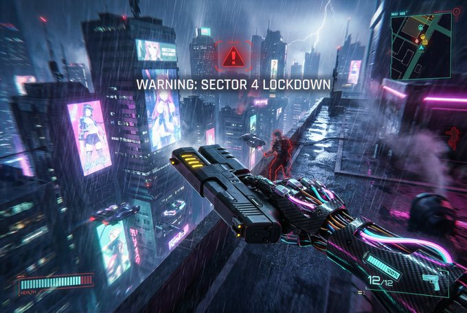
</div>

**提示词：**
```
{
"subject": {
"description": "First-person shooter (FPS) perspective of a cybernetic mercenary holding a dual-barreled smart pistol in a dystopian mega-city.",
"mirror_rules": "HUD elements and text must be legible and non-mirrored. Charge meter reads '100%'.",
"age": "N/A",
"expression": {
"eyes": null,
"mouth": null,
"overall": "Adrenaline-fueled, chaotic, fast-paced"
},
"face": {
"preserve_original": "false",
"texture": "Ocular implant interface, glitch effects",
"makeup": null,
"features": "Augmented reality (AR) overlay with scan lines"
},
"hair": null,
"body": {
"frame": "Robotic prosthetic arm visible in foreground",
"waist": null,
"chest": null,
"legs": "Not visible",
"skin": {
"visible_areas": "None (cybernetics)",
"tone": "Chrome and synthetic black",
"texture": "Carbon fiber weave, exposed wiring, neon tubing",
"lighting_effect": "Pink and cyan reflections from city lights"
}
},
"pose": {
"position": "First-person view, weapon canted slightly sideways, dynamic movement",
"base": "Parkour/Wall-running stance",
"overall": "High-velocity action camera angle"
},
"clothing": {
"top": {
"effect": "Tech-wear jacket sleeve, tactical wrist computer"
},
"bottom": null
}
},
"accessories": {
"jewelry": null,
"device": "Experimental Smart Pistol. Matte black finish with glowing yellow heat vents. Holographic ammo projection displaying '12/12'.",
"prop": "HUD Overlay: Red enemy outlines, Threat detection (center), Mini-map (top right), Health bar (bottom left). Text prompt: 'WARNING: SECTOR 4 LOCKDOWN'."
},
"photography": {
"camera_style": "In-game screenshot, Ray-traced Render",
"angle": "First-person POV, high FOV (Field of View)",
"shot_type": "Landscape, POV",
"aspect_ratio": "16:9",
"texture": "Next-gen graphics, wet surface reflections, chromatic aberration, digital noise",
"lighting": "Neon signage (pink, purple, cyan), dark shadows, volumetric fog, wet pavement glare",
"depth_of_field": "Motion blur on edges, sharp focus on weapon and immediate target"
},
"background": {
"setting": "Rain-slicked rooftop in a Cyberpunk metropolis",
"wall_color": "Dark concrete and neon",
"elements": [
"Massive holographic billboards featuring anime girls",
"Flying cars in traffic lanes below",
"Dense skyscrapers blocking the sky",
"Heavy rain falling"
],
"atmosphere": "Dystopian, gritty, technological noir",
"lighting": "Artificial city lights, gloom, lightning flashes"
},
"the_vibe": {
"energy": "High-octane, rebellious",
"mood": "Dark, electric, dangerous",
"authenticity": "High-end PC game screenshot",
"intimacy": "Visceral combat",
"story": "escaping a corporate security raid",
"caption_energy": "System Override"
},
"constraints": {
"must_keep": [
"FPS perspective",
"Glitchy HUD elements",
"Cybernetic hand details",
"Neon lighting",
"Text 'WARNING: SECTOR 4 LOCKDOWN'",
"Rain effects"
],
"avoid": [
"Third-person view",
"Daylight",
"Nature/Trees",
"Medieval weaponry",
"Clean military aesthetic"
]
},
"negative_prompt": [
"third person",
"sunlight",
"grass",
"mountains",
"clean",
"low poly",
"blurry",
"peaceful"
]
}
```

**中文提示词：**
```
{"主体设定": {"描述": "身处反乌托邦巨型都市的生化雇佣兵，手持双管智能手枪的第一人称射击（FPS）视角","镜像规则": "平视显示器（HUD）元素及文字必须清晰可辨且不可镜像。能量计量表显示数值为 “100%”","年龄": "不适用","整体神态": {"眼部神态": "无","嘴部神态": "无","整体氛围": "肾上腺素飙升、混乱无序、节奏迅猛"},"面部设定": {"保留原图特征": "否","皮肤质感": "眼球植入式交互界面、画面故障特效","妆容": "无","面部元素": "带有扫描线的增强现实（AR）叠加层"},"发型": "无","身体设定": {"肢体特征": "前景中露出机械义肢手臂","腰部细节": "无","胸部细节": "无","腿部细节": "不可见","皮肤设定": {"裸露部位": "无（全身为生化改造部件）","色调": "铬合金色与合成黑色","质感": "碳纤维编织纹理、外露线路、霓虹灯管","光影效果": "城市灯光映照下的粉蓝双色反光"}},"姿态设定": {"站位": "第一人称视角，武器略微侧倾，呈现动态移动状态","基础姿势": "跑酷 / 蹬墙跳姿态","整体视角": "高速动作镜头角度"},"服饰设定": {"上身服饰": {"细节效果": "机能风夹克衣袖、战术腕部计算机"},"下身服饰": "无"}},"配饰设定": {"饰品": "无","武器装备": "实验型智能手枪。哑光黑枪身，配发光黄色散热口。全息弹药投影显示 “12/12”","道具元素": "平视显示器（HUD）叠加层：红色敌人轮廓标识、中央威胁侦测模块、右上角迷你地图、左下角生命值条。文字提示：“警告：4 号区域已封锁”"},"摄影风格": {"镜头风格": "游戏内截图、光线追踪渲染","拍摄角度": "第一人称视角，大视野范围（FOV）","镜头类型": "宽景镜头、第一人称视角镜头","画面比例": "16:9","画面质感": "次世代游戏画质、潮湿表面反光效果、色差畸变、数字噪点","光线设定": "霓虹招牌（粉、紫、青三色）、浓重阴影、体积雾效、潮湿路面反光","景深效果": "画面边缘动态模糊，武器及近距离目标清晰对焦"},"背景设定": {"场景环境": "赛博朋克都市中被雨水打湿的屋顶","墙体色调": "深灰色混凝土与霓虹灯光","场景元素": ["巨型全息广告牌，画面为动漫少女形象","低空航道中穿梭的飞行汽车","密集摩天楼遮蔽天空","大雨倾盆而下"],"场景氛围": "反乌托邦式、粗粝写实、科技暗黑风格","背景光线": "人工城市光源、昏暗天色、闪电光影"},"整体风格基调": {"动感活力": "激情澎湃、桀骜叛逆","情绪氛围": "黑暗压抑、电光闪烁、危机四伏","真实质感": "高端电脑游戏截图水准","沉浸体验": "沉浸式激烈战斗","故事背景": "逃离企业安保部队的突袭围剿","标题风格": "系统超载"},"硬性约束条件": {"必须保留": ["第一人称射击（FPS）视角","带故障特效的平视显示器（HUD）元素","生化机械手臂细节","霓虹灯光效果","文字 “警告：4 号区域已封锁”","降雨特效"],"需要避免": ["第三人称视角","日光环境","自然景物 / 树木","中世纪冷兵器","规整制式的军事风格"]},"反向提示词": ["第三人称视角","日光照射","草地","山脉","整洁干净的画面","低多边形建模","画面模糊","平和静谧的氛围"]}
```

<a id="prompt-970"></a>
## 案例 970：一个微缩场景模型 (来源 [@aleenaamiir](https://x.com/aleenaamiir/status/2003300924283089325)) 模型：Nano banana pro

<div style="display: flex; justify-content: space-between;">

</div>

**提示词：**
```
A miniature diorama showing tiny [PEOPLE / CHARACTERS] struggling with an oversized [EVERYDAY OBJECT]. Exaggerated scale contrast, expressive poses, cinematic lighting. Ultra-detailed props, handcrafted realism, macro lens perspective.
```

**中文提示词：**
```
一个微缩场景模型，展现了渺小的[人物/角色]与一个超大的[日常物品]搏斗的场景。夸张的比例对比、富有表现力的姿势、电影级的光影效果。极其精细的道具、手工制作的逼真质感、微距镜头视角。
```

<a id="prompt-969"></a>
## 案例 969：女子将食指向前伸出朝向相机镜头 (来源 [@Ankit_patel211](https://x.com/Ankit_patel211/status/2003366639170113824)) 模型：Nano banana pro

<div style="display: flex; justify-content: space-between;">
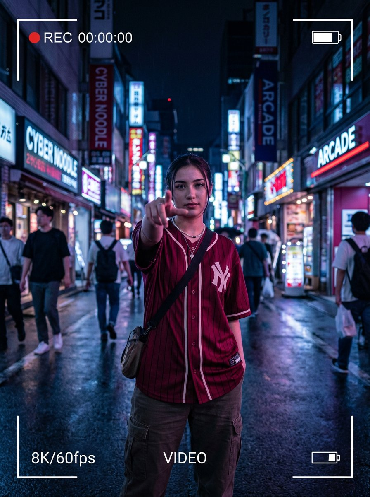
</div>

**提示词：**
```
{
"request_id": "portrait_neon_urban_001",
"configuration": {
"model": "v6. 0_or_latest",
"output_settings": {
"dimensions": {
"width": 1080,
"height": 1920,
"aspect_ratio": "9:16",
"target_resolution": "64K DSLR"
}
}
},
"scene_composition": {
"subject": {
"entity": "Young woman",
"pose": "Standing confidently",
"action": "Extending index finger forward toward camera lens",
"interaction": "Dynamic gesture / POV interaction",
"wardrobe": {
"outerwear": "dark crimson red striped baseball-style shirt",
"undergarment": "Light inner shirt",
"bottoms": "Cargo pants",
"accessories": [
"Necklace",
"Crossbody bag"
]
}
},
"environment": {
"location": "Urban street",
"time_of_day": "Night",
"ambience": "Neon-lit",
"background_elements": [
"Colorful city lights",
"Blurred passersby"
]
},
"cinematography": {
"camera": {
"perspective": "Wide-angle",
"depth_of_field": "Soft bokeh",
"motion": "Slight motion blur"
},
"lighting": {
"style": "Cinematic",
"primary_sources": [cyber punk street lights", "City glow"]
},
"ui_overlay": {
"enabled": true,
"aesthetic": "Smartphone video recording",
"on_screen_elements": [
"REC 00:00:00",
"8K/60fps",
"Frame brackets",
"VIDEO indicator",
"CINEMATIC indicator"
]
}
}
},
"technical_rendering": {
"style": "Hyper-realistic",
"engines": [
"Octane Render",
"Unreal Engine 5"
]
},
"negative_prompt": {
"stylistic_exclusions": [
"cartoon",
"illustration",
"anime"
],
"quality_exclusions": [
"low quality",
"pixelated",
"blurry"
],
"anatomical_exclusions": [
"bad anatomy",
"deformed hands",
"extra fingers",
"missing limbs",
"bad proportions"
],
"branding_exclusions": [
"watermark (except for requested UI overlays)"
]
}
}
```

**中文提示词：**
```
{
"request_id": "portrait_neon_urban_001",
“配置”： {
“模型”： "v6. 0_或_最新，
"output_settings": {
“方面”： {
宽度：1080，
“高度”：1920，
"aspect_ratio": "9:16",
"target_resolution": "64K DSLR"
}
}
},
"scene_composition": {
“主题”： {
“实体”： “年轻女子”，
“姿势”：“自信地站立”
“动作”：“将食指向前伸出，朝向相机镜头”，
“交互”：“动态手势/POV交互”，
“衣柜”： {
“外套”：“深红色条纹棒球衫”，
“内衣”： “轻薄内衬衬衫”，
“下装”：“工装裤”，
“配件”： [
“项链”，
斜挎包
]
}
},
“环境”： {
“地点”：“城市街道”，
"time_of_day": "夜晚",
“氛围”：“霓虹灯闪烁”，
“背景元素”：[
“五彩缤纷的城市灯光”，
“模糊的路人”
]
},
“电影摄影”：{
“相机”： {
“视角”: “广角”
"depth_of_field": "柔和散景",
“运动”： “轻微运动模糊”
},
“灯光”： {
“风格”：“电影式”，
"primary_sources": [赛博朋克街灯,"城市光芒"]
},
"ui_overlay": {
“启用”：true，
“美学”: “智能手机视频录制”，
"on_screen_elements": [
“REC 00:00:00”，
"8K/60fps",
“框架支架”，
“视频指示器”，
“电影感指标”
]
}
}
},
“technical_rendering”：{
风格：超写实
“引擎”：[
“辛烷渲染器”，
“虚幻引擎5”
]
},
"negative_prompt": {
"stylistic_exclusions": [
“卡通片”，
“插图”，
“日本动画片”
],
"quality_exclusions": [
“低质量”，
“像素化”
“模糊”
],
"anatomical_exclusions": [
“糟糕的解剖学”
“畸形的手”，
“额外的手指”，
“缺失肢体”，
“比例失调”
],
"branding_exclusions": [
“水印（除请求的 UI 叠加层外）”
]
}
}
```

<a id="prompt-968"></a>
## 案例 968：年轻漂亮的双马尾女子 (来源 [@lexx_aura](https://x.com/lexx_aura/status/2003145469451551070)) 模型：Nano banana pro

<div style="display: flex; justify-content: space-between;">
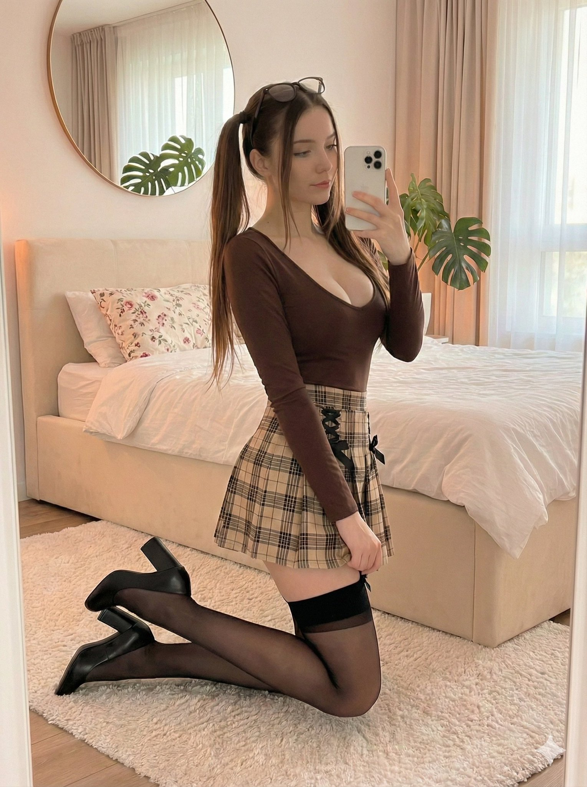
</div>

**提示词：**
```
{
"image_analysis": {
"subject": {
"demographics": "Young woman, white skin tone, roughly 20s",
"hair": "Long dark brunette hair styled in low twin-tails (pigtails) with a middle part",
"face": "Neutral expression, looking at phone screen, soft 'glam' makeup with mauve lipstick",
"accessories": "Black rimmed glasses resting on top of head, small gold pendant necklace, small gold hoop earrings"
},
"apparel": {
"top": "Chocolate brown, long-sleeve, scoop-neck fitted top",
"bottom": "Beige and black plaid pleated mini skirt featuring decorative black ribbon bows and lace-up details on the front",
"legwear": "Black semi-sheer thigh-high stockings",
"footwear": "Black patent leather block-heeled pumps"
},
"pose_and_action": {
"type": "Mirror selfie, full-body shot",
"posture": "Kneeling on the floor, legs tucked underneath, torso angled slightly to the right",
"hands": "Right hand holding a white smartphone (iPhone Pro style) covering part of face; left hand reaching back to touch the heel of the left shoe"
},
"environment": {
"location": "Modern, minimalist bedroom",
"flooring": "White fluffy shag rug on light wood floor",
"furniture": [
"Cream upholstered bed frame with white bedding",
"Pillow with delicate floral pattern",
"White wardrobe/closet doors in background"
],
"decor": "Large round mirror on wall reflecting a potted green plant (Monstera style) and window curtains"
},
"technical_specs": {
"lighting": "Soft natural daylight, diffuse indoor lighting, neutral color temperature",
"aesthetic": "Coquette, influencer fashion, soft girl, clean aesthetic",
"color_palette": ["Chocolate brown", "Beige", "White", "Black"]
}
}
}
```

**中文提示词：**
```
{
"image_analysis": {
“主题”： {
“人口统计信息”：“年轻女性，白皙肤色，大约20多岁”，
“头发”：“深棕色长发，梳成低低的双马尾（麻花辫），中分”，
“脸部”：“表情平静，看着手机屏幕，化着淡雅的‘魅惑’妆容，涂着淡紫色口红”，
“配饰”： “戴在头顶的黑框眼镜，小巧的金色吊坠项链，小巧的金色耳环”
},
"服装": {
“上衣”：巧克力棕色长袖圆领修身上衣
“下装”：“米色和黑色格子褶裥迷你裙，正面饰有黑色丝带蝴蝶结和系带细节”，
“腿部服饰”：“黑色半透明过膝长袜”，
鞋履：黑色漆皮粗跟高跟鞋
},
"pose_and_action": {
“类型”：“镜子自拍，全身照”，
“姿势”：“跪在地上，双腿蜷缩在身下，躯干略微向右倾斜”，
“双手”：右手拿着一部白色智能手机（iPhone Pro 款式），遮住了部分脸部；左手向后伸去触摸左鞋的鞋跟。
},
“环境”： {
位置：现代简约卧室
“地板”：“浅色木地板上铺着白色蓬松长毛地毯”，
“家具”： [
“米色软垫床架，配白色床品”
“带有精致花卉图案的枕头”
背景中的白色衣柜/壁橱门
],
“装饰”：“墙上挂着一面大圆镜，镜中映照着一盆绿色植物（龟背竹风格）和窗帘”。
},
"technical_specs": {
“照明”：“柔和的自然日光、漫射室内照明、中性色温”，
“美学”：“轻佻、网红时尚、温柔女孩、清新美学”
"color_palette": ["巧克力棕色", "米色", "白色", "黑色"]
}
}
}
```

<a id="prompt-967"></a>
## 案例 967：三联拼贴画描绘了女性的三个连续瞬间 (来源 [@underwoodxie96](https://x.com/underwoodxie96/status/2003340602193379443)) 模型：Nano banana pro

<div style="display: flex; justify-content: space-between;">
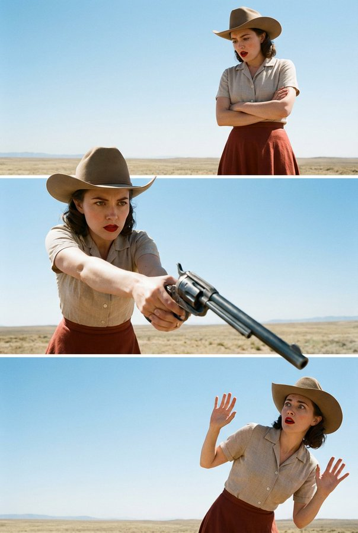
</div>

**提示词：**
```
A real-life woman is presented in a vertical triptych collage composition, depicting three consecutive moments (a calm stance, a direct confrontation, and a startled reaction). Each panel deliberately uses left–right offset positioning to create a coherent visual narrative flow.

The image is shot in a photorealistic, cinematic live-action style, high resolution with subtle natural grain, true contrast, hard natural daylight, a clear blue sky, and deep depth of field consistent with real lens behavior. The scene takes place in an open outdoor environment.

The subject wears a cowboy hat, a short-sleeve button-up shirt, and a brownish-red long skirt. Her makeup is retro-inspired, with distinct red lipstick and clearly defined eye makeup.

Top panel:
The subject is positioned toward the right, leaving open sky on the left. She stands with arms crossed, looking toward the lower-left with a surprised expression.
Middle panel:
The subject is positioned toward the left, aiming a firearm with the barrel angled toward the lower-right. Her expression is focused and sharp, and the shot is taken from a slightly top-down angle. In this panel, both the subject and the weapon intentionally break through the top and bottom panel borders, overlapping the frame lines to create a clear layered effect. The middle panel serves as the primary visual focal point.

Bottom panel:
The subject is positioned in the lower-right corner, leaving more negative space on the left. She raises both hands defensively, her eyes naturally widened in surprise, looking toward the upper-left. The subject intentionally breaks the panel frame and overlaps the border lines, forming a distinct layered composition.
The image maintains a 2:3 aspect ratio and a photorealistic live-action style, explicitly avoiding illustration or comic aesthetics.
```

**中文提示词：**
```
这幅竖幅三联拼贴画描绘了一位真实女性的三个连续瞬间（平静的姿态、正面的对峙和惊愕的反应）。每幅画都巧妙地运用了左右错位布局，从而营造出连贯的视觉叙事效果。

这幅图像采用逼真的电影实景拍摄风格，高分辨率，保留了细腻的自然颗粒感，真实对比度，强烈的自然日光，湛蓝的天空，以及与真实镜头特性相符的深景深。场景设定在开阔的户外环境中。

照片中的人物戴着牛仔帽，身穿短袖衬衫和棕红色长裙。她的妆容充满复古气息，涂着醒目的红色唇膏，眼妆也十分精致。

顶部面板：
拍摄对象位于画面右侧，左侧是开阔的天空。她双臂交叉抱于胸前，面露惊讶地看向左下方。
中间面板：
画面主体位于左侧，持枪瞄准，枪口指向右下方。她表情专注而锐利，镜头采用略微俯拍的角度。在这个画面中，主体和武器都刻意突破了上下边框，与画框线重叠，营造出清晰的层次感。中间的画面则成为主要的视觉焦点。

底部面板：
画面主体位于右下角，左侧留白较多。她双手举起，做出防御姿态，双眼因惊讶而睁大，目光看向左上方。主体有意打破画框的限制，与边框线重叠，形成层次分明的独特构图。
该图像保持 2:3 的宽高比和照片级写实的真人拍摄风格，明确避免了插画或漫画的美学风格。
```

<a id="prompt-966"></a>
## 案例 966：建筑插画师为住宅制作的展示板 (来源 [@AllaAisling](https://x.com/AllaAisling/status/2003122606527205436)) 模型：Nano banana pro

<div style="display: flex; justify-content: space-between;">
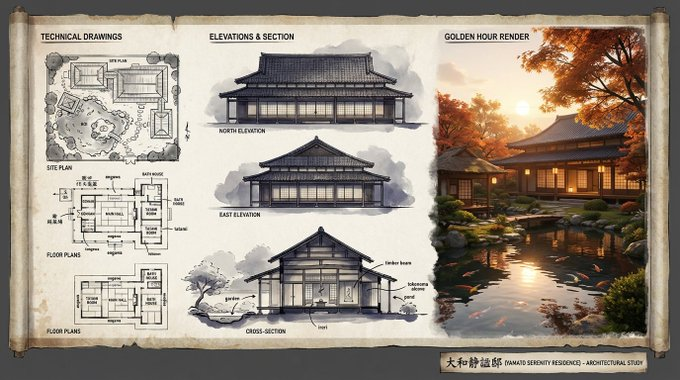
</div>

**提示词：**
```
An expert architectural illustrator's presentation board for a [STYLE] residence featuring [KEY ARCHITECTURAL ELEMENTS].
The canvas flows left to right: black and white 2D drawings (Site Plan, Floor Plans) on the left, Elevations and Cross-Section in the center, and a photorealistic 3D render at [TIME OF DAY/LIGHTING] on the right.
Unified aesthetic blending [LINEWORK STYLE] with [TEXTURE/MATERIAL]. [TECHNICAL DRAWING TONES] transitioning to [RENDER COLOUR PALETTE]. Title block reads '[PROJECT NAME]'.
```

**中文提示词：**
```
一位专业的建筑插画师为[风格]住宅制作的展示板，该住宅以[关键建筑元素]为特色。
画布从左到右依次为：左侧为黑白二维图纸（场地平面图、楼层平面图），中间为立面图和剖面图，右侧为[一天中的时间/光照条件]下的照片级三维渲染图。
统一的美学风格融合了[线条风格]和[纹理/材质]。[技术绘图色调]过渡到[渲染调色板]。标题栏显示“[项目名称]”。
```

<a id="prompt-965"></a>
## 案例 965：苹果iOS照片应用的图库网格视图 (来源 [@Tz_2022](https://x.com/Tz_2022/status/2003298471713939941)) 模型：Nano banana pro

<div style="display: flex; justify-content: space-between;">
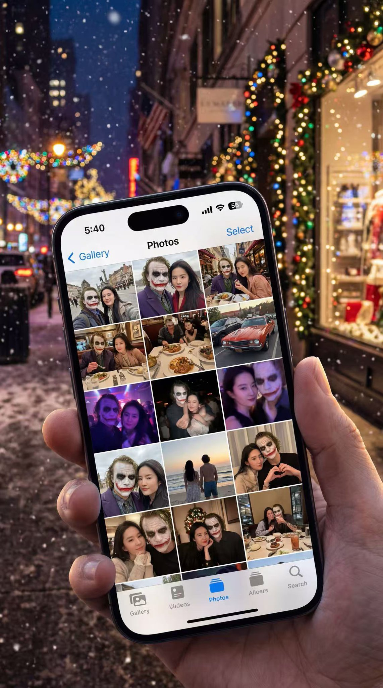
</div>

**中文提示词：**
```
基于【参考照片人物】。一张极其真实的特写照片，一只手拿着一部 iPhone 15 pro。屏幕亮着，显示着苹果 iOS “照片”应用的图库网格视图。屏幕上密密麻麻的缩略图是一个非常自然、未经筛选的情侣生活记录（基于【参考照片人物】）。内容非常多样：有户外旅行的风景合照、在餐厅吃饭的抓拍、在车里的搞怪自拍、模糊的夜店或演唱会照片、海边的背影、当然也有一些居家的温馨时刻。照片的光线、色彩和风格各不相同，看起来非常真实生动。背景是虚化的繁华城市夜景，充满了圣诞节的装饰。可以看到背景中有大片的街道节日彩灯（Christmas lights）、模糊的雪花飘落，以及远处商场橱窗的节日布置。光线更加丰富多彩，营造出一种热闹的圣诞外出氛围。
```

<a id="prompt-964"></a>
## 案例 964：时髦的亚洲时尚博主 (来源 [@underwoodxie96](https://x.com/underwoodxie96/status/2003362169547817413)) 模型：Nano banana pro

<div style="display: flex; justify-content: space-between;">
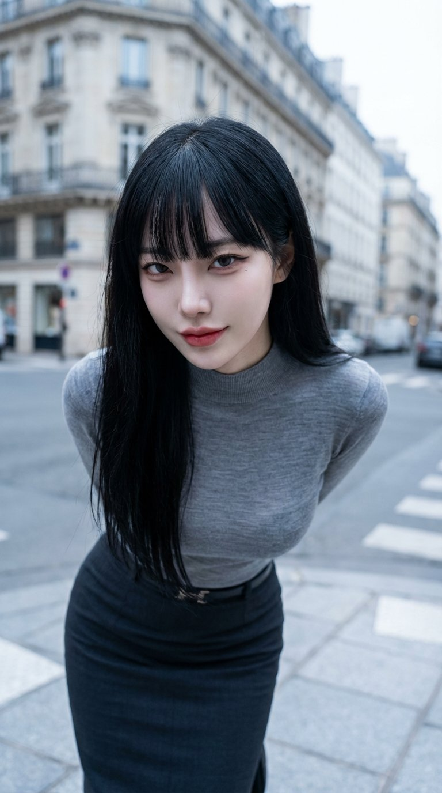
</div>

**提示词：**
```
{
"subject": {
"description": "A stunning high-angle shot of a chic Asian fashion influencer with a cool, alluring attitude.",
"age": "20s",
"expression": {
"eyes": {
"look": "sharp fox-eyes, piercing gaze directed at camera",
"energy": "confident, slightly cold, seductive",
"details": "defined eyeliner, emphasized aegyosal"
},
"mouth": {
"position": "relaxed lips, subtle smirk",
"energy": "chic"
},
"overall": "stunning, high-visual-impact beauty"
},
"face": {
"preserve_original": false,
"makeup": "high-contrast makeup, pale porcelain skin, reddish gradient lips, sharp jawline, V-shape face",
"style": "cool-toned beauty, K-pop idol visual"
},
"hair": {
"color": "black",
"style": "long sleek straight hair with full straight bangs",
"effect": "glossy, high-fashion finish"
},
"body": {
"frame": "slim, petite, fragile aesthetic",
"pose": {
"position": "leaning forward significantly",
"overall": "dynamic foreshortening, emphasis on head and upper torso"
},
"skin": {
"tone": "cold fair skin",
"lighting_effect": "brightened face, soft beauty lighting, no dark shadows"
}
},
"clothing": {
"top": {
"type": "ultra-fine gauge knit top",
"color": "cool grey",
"details": "mock neck, skin-tight fit, lightweight thin fabric (not thick)",
"effect": "perfectly sculpting body curves, smooth texture"
},
"bottom": {
"type": "dark pencil skirt",
"details": "high waisted with thin luxury belt"
}
}
},
"photography": {
"camera_style": "High-end social media snapshot",
"angle": "High angle POV",
"shot_type": "Medium close-up",
"aspect_ratio": "9:16",
"texture": "clear, sharp, slightly filtered for beauty",
"lighting": "overcast cool daylight, soft diffuse light"
},
"background": {
"setting": "European classic architecture",
"atmosphere": "fashionable street corner",
"blur": "bokeh background to emphasize subject"
},
"negative_prompt": [
"round face",
"plain face",
"no makeup",
"warm yellow skin",
"chunky knit",
"thick sweater",
"loose clothing",
"wrinkled fabric",
"dull eyes",
"friendly boring smile",
"low resolution",
"dark lighting"
]
}
```

**中文提示词：**
```
{
“主题”： {
“描述”：“一张令人惊艳的高角度照片，展现了一位时髦的亚洲时尚博主，她拥有酷炫迷人的气质。”
年龄：20多岁，
“表达”： {
"眼睛": {
“眼神”：“锐利的狐狸眼，目光锐利地盯着镜头”，
“能量”：“自信、略带冷漠、诱人”，
“细节”： “精致的眼线，突出的卧蚕”
},
“嘴”： {
“姿势”：“嘴唇放松，带着一丝不易察觉的微笑”，
“能量”： “时尚”
},
“总体评价”：“令人惊艳、极具视觉冲击力的美感”
},
“脸”： {
"preserve_original": false,
“妆容”：“高对比度妆容，苍白瓷白的肌肤，红润渐变的嘴唇，棱角分明的下颌线，V字脸”，
风格：冷色调美人，K-pop偶像视觉形象
},
“头发”： {
“颜色：黑色”，
“发型”：“长而柔顺的直发，配以齐刘海”，
效果：光泽亮丽、时尚感十足
},
“身体”： {
“框架”：“纤细、娇小、脆弱的美学”，
"姿势": {
“姿势”：“明显向前倾斜”，
“整体”： “动态透视缩短，强调头部和上半身”
},
“皮肤”： {
色调：冷白皮肤，
"lighting_effect": "提亮面部，柔和美颜光，无阴影"
}
},
“衣服”： {
“顶部”： {
“类型”：“超细针织上衣”，
颜色：冷灰色，
“细节”：“高领，紧身剪裁，轻薄面料（不厚）”
“效果”：“完美勾勒身体曲线，质地光滑”
},
“底部”： {
类型：深色铅笔裙，
“细节”：“高腰设计，配以纤细奢华腰带”
}
}
},
“摄影”： {
“camera_style”: “高端社交媒体快照”
"角度": "高角度POV",
"shot_type": "中近景",
"aspect_ratio": "9:16",
“质感”：“清晰、锐利、略带滤镜效果，更显美感”，
“照明”：“阴天冷色调的日光，柔和的漫射光”
},
“背景”： {
“背景”：“欧洲古典建筑”，
“氛围”：“时尚街角”，
“模糊”： “散景背景以突出主体”
},
"negative_prompt": [
“圆脸”，
“朴素的脸”，
“素颜”
“温暖的黄色皮肤”，
“粗针织物”，
“厚毛衣”，
宽松的衣服
“皱巴巴的布料”，
“眼神呆滞”，
“友善而乏味的微笑”，
“低分辨率”，
“昏暗的灯光”
]
}
```

<a id="prompt-963"></a>
## 案例 963：圣诞特辑-圣诞姜饼跨框投喂 (来源 [@songguoxiansen](https://x.com/songguoxiansen/status/2003109598232969590)) 模型：Nano banana pro

<div style="display: flex; justify-content: space-between;">
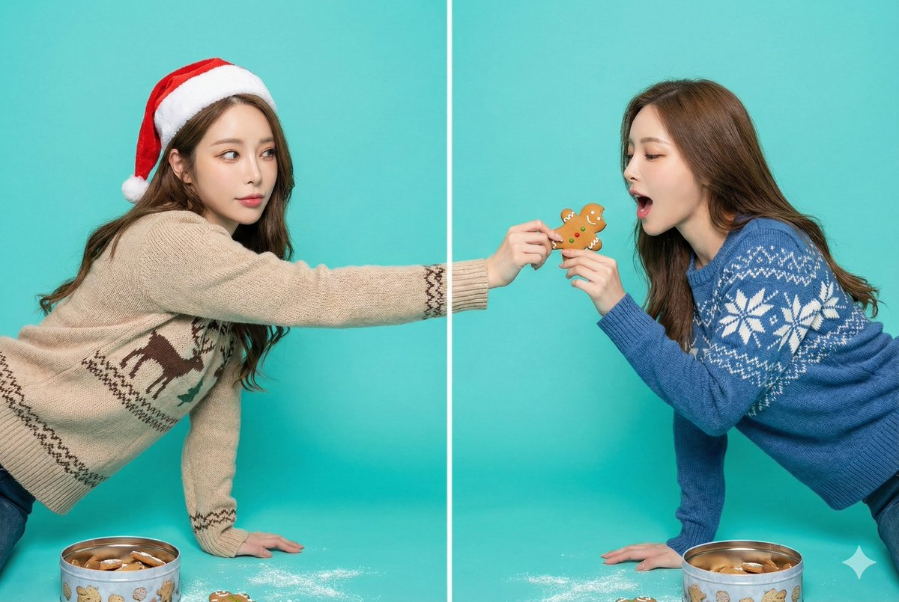
</div>

**中文提示词：**
```
【关键：两边人物的面部必须与源图像完全相同】。左侧面板： 穿着带有驯鹿图案的米色毛衣，带着圣诞帽，身体右倾，手里拿着一块咬了一口的姜饼人饼干，正试图递过中间的分割线，眼神看向右侧。右侧面板： 穿着带有雪花图案的蓝色毛衣，身体左倾，张开嘴巴，手伸过分割线去接那块饼干。道具： 脚下有装饼干的铁盒和散落的糖霜。背景： 明亮的青色（Teal）摄影棚背景。灯光/风格： 平光，明亮，叙事感，俏皮。
```

<a id="prompt-962"></a>
## 案例 962：圣诞特辑-圣诞小精灵 (来源 [@songguoxiansen](https://x.com/songguoxiansen/status/2003101132378591474)) 模型：Nano banana pro

<div style="display: flex; justify-content: space-between;">
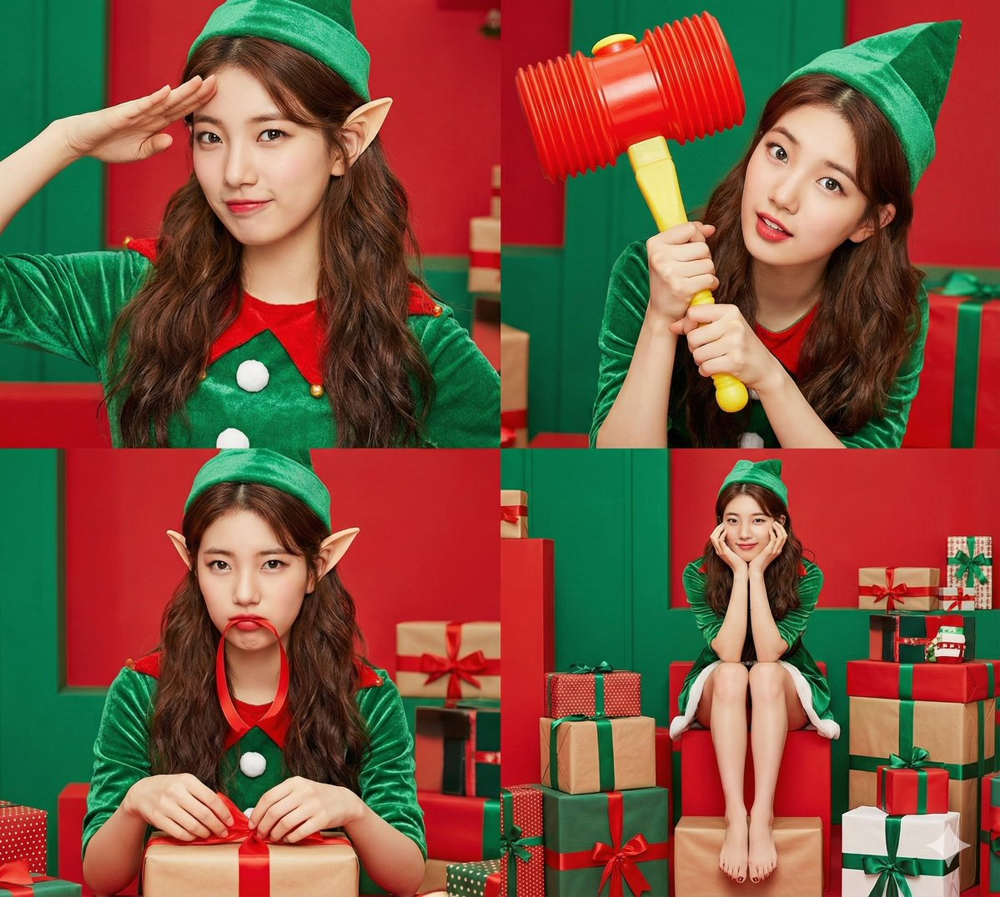
</div>

**中文提示词：**
```
(杰作, 最高画质, 超细节, 8k分辨率). 一张照片般逼真的4格分屏拼图，所有画面为同一女性角色。[关键：保持精确的面部特征，保留原始脸部结构，整个拼图中角色完全一致]. 角色皮肤白皙，质感自然，眼神明亮。左上图：角色穿着绿色的圣诞精灵服装，戴着尖尖的精灵耳朵道具，对着镜头敬礼，表情顽皮。右上图：角色手里拿着一个巨大的玩具锤子，假装要敲打镜头，眼睛睁得圆圆的。左下图：角色正在包装礼物，嘴里咬着丝带的一端，眉头微皱显得很专注可爱。右下图：角色坐在礼物堆上，双手托腮，双脚悬空晃动，一脸满足。环境：色彩饱和的圣诞工坊背景，红绿撞色。灯光：明亮的影棚灯光，无阴影，卡通感强。风格：K-pop专辑内页风格，色彩鲜艳跳跃，清晰对焦，活泼搞怪。
```

<a id="prompt-961"></a>
## 案例 961：圣诞特辑-圣诞活动邀请卡 (来源 [@songguoxiansen](https://x.com/songguoxiansen/status/2003099057737412852)) 模型：Nano banana pro

<div style="display: flex; justify-content: space-between;">

</div>

**中文提示词：**
```
设计欢乐圣诞活动邀请卡,卡通风格,彩色气球和礼物图案,顶部大字"圣诞狂欢party",中文"时间:12月25日晚7点"、"地点:上海皇家酒店",可爱圣诞老人招手,活泼有趣风格,宽高比：9:16。
```

<a id="prompt-960"></a>
## 案例 960：圣诞特辑-圣诞护肤品套装促销卡片 (来源 [@songguoxiansen](https://x.com/songguoxiansen/status/2003096613359853946)) 模型：Nano banana pro

<div style="display: flex; justify-content: space-between;">

</div>

**中文提示词：**
```
制作一张专业的圣诞护肤品套装促销卡片,采用竖版构图设计,整体风格简约高端。背景使用柔和的渐变色,从顶部的冰雪白色过渡到底部的淡粉色,营造出清新优雅的氛围。画面中央偏上位置,精心摆放着一套高端护肤品礼盒,礼盒采用磨砂白色包装,表面压印精致的雪花纹理和品牌Logo(Dior)。礼盒呈打开状态,内部露出三瓶不同大小的护肤品瓶子,瓶身设计简约现代,搭配金色瓶盖。产品周围巧妙地摆放着圣诞装饰元素:几支新鲜的松枝、小巧的金色铃铛、几颗红色浆果,以及散落的小礼物盒,所有道具都经过精心布光,呈现出高级的产品摄影质感。卡片顶部使用纤细优雅的字体书写"圣诞礼遇 · 焕颜新生"的中文标题。中部产品下方用醒目的红色字体标注促销信息"限量礼盒装 8折优惠 买赠面膜5片",底部配有行动号召按钮样式的文字"立即抢购 数量有限",以及活动有效期"12月15日-26日"。整体设计强调产品质感和节日氛围的完美结合。宽高比9:16
```

<a id="prompt-959"></a>
## 案例 959：电影级的增强现实视觉效果 (来源 [@oggii_0](https://x.com/oggii_0/status/2002963262812585990)) 模型：Nano banana pro

<div style="display: flex; justify-content: space-between;">
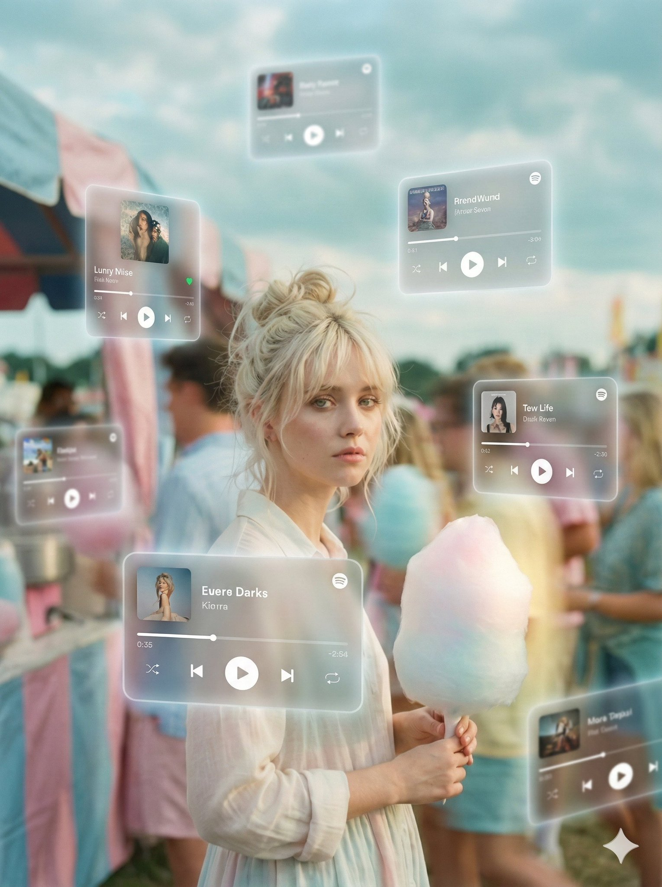
</div>

**提示词：**
```
A dreamlike, movie-quality augmented reality visual where numerous hovering Spotify player interface cards orbit the central figure (the person shown) in a complete 3D spatial composition, with each music player card strategically placed at varying distances, some prominently positioned in front and partially covering the subject, while others float behind and alongside them, utilizing the authentic Apple Music UI/Spotify UI elements playback progress indicators and featuring songs by [Artist Name]; all cards display smooth rounded edges with subtle angular perspective shifts, presenting a translucent, frosted-glass aesthetic that radiates a gentle diffused border luminescence with measured cinematic light bloom interacting organically with the ambient lighting of the scene; the composition showcases a cool-to-neutral color palette with rich yet preserved shadow detail, strategic bursts of color from album artwork, medium-high contrast levels with gradual highlight transitions, delicate focal depth variation where nearer cards maintain crisp detail while farther ones receive gentle blur treatment, and understated motion-enhancing accents, all while keeping the subject photorealistic, centrally positioned, and authentically integrated into their physical surroundings.
```

**中文提示词：**
```
一个梦幻般的、电影级的增强现实视觉效果，其中众多悬浮的 Spotify 播放器界面卡片围绕中心人物（图中所示人物）旋转，构成一个完整的 3D 空间构图，每个音乐播放器卡片都经过精心布置，放置在不同的距离，有些卡片醒目地位于人物前方并部分遮挡住人物，而另一些卡片则漂浮在人物身后和旁边，利用真实的 Apple Music UI/Spotify UI 元素播放进度指示器，并展示 [艺术家姓名] 的歌曲；所有卡片都呈现出光滑的圆角边缘和微妙的角度透视变化，呈现出半透明的磨砂玻璃美感，散发出柔和的漫射边缘光晕，并带有适度的电影级光晕，与场景中的环境光自然地互动；构图展现了冷色调到中性色调的色彩，阴影细节丰富而保留，巧妙地融入了专辑封面的色彩，中高对比度与渐强的高光过渡相得益彰，景深变化细腻，近处的卡片保持清晰的细节，而远处的卡片则呈现出柔和的虚化效果，并辅以低调的动态增强效果，所有这些都保持了主体逼真、居中，并真实地融入到周围环境中。
```

<a id="prompt-958"></a>
## 案例 958：卡通风格钥匙扣 (来源 [@r4jjesh](https://x.com/r4jjesh/status/2002893222608331014)) 模型：Nano banana pro

<div style="display: flex; justify-content: space-between;">
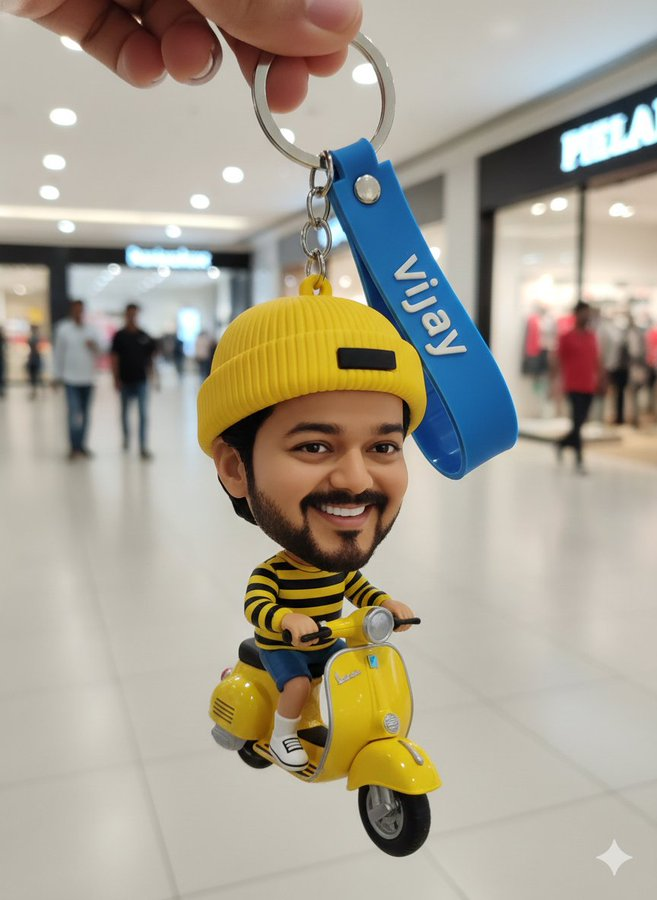
</div>

**提示词：**
```
{
"reference": "use uploaded image as facial reference, preserve original face and identity exactly",
"character_type": "caricature-style keychain, gender-neutral",
"pose": "riding a yellow scooter indoors",
"head_style": "oversized head with joyful, playful smile",
"outfit_beanie": "yellow knit beanie",
"outfit_top": "striped yellow-black sweater",
"outfit_bottom": "denim shorts",
"socks": "white socks",
"footwear": "white sneakers",
"keychain_detail": "blue strap labeled 'SAMMU'",
"lighting": "soft indoor lighting",
"depth_of_field": "shallow depth of field",
"background": "mall-like indoor environment",
"style": "whimsical, toy-like, premium collectible",
"photography": "cinematic product photography",
"texture": "smooth plastic, high
detail finish"
}
```

**中文提示词：**
```
{
“参考”：“使用上传的图片作为面部参考，精确保留原始面部和身份信息”，
"character_type": "卡通风格钥匙扣，中性款",
“姿势”：“在室内骑黄色滑板车”，
"head_style": "大头，带着快乐、俏皮的笑容",
"outfit_beanie": "黄色针织帽",
"outfit_top": "条纹黄黑毛衣",
"outfit_bottom": "牛仔短裤",
“袜子”: “白袜子”，
“鞋类”: “白色运动鞋”，
"keychain_detail": "蓝色表带，标签为'SAMMU'",
“照明”：“柔和的室内照明”，
"depth_of_field": "浅景深",
“背景”：“类似购物中心的室内环境”，
“风格”：“异想天开、玩具般、高级收藏品”
“摄影”: “电影化产品摄影”，
“质感”：光滑塑料，高
细节处理”
}
```

<a id="prompt-957"></a>
## 案例 957：高端专业平铺式产品摄影 (来源 [@elCarlosVega](https://x.com/elCarlosVega/status/2002824697013297266)) 模型：Nano banana pro

<div style="display: flex; justify-content: space-between;">
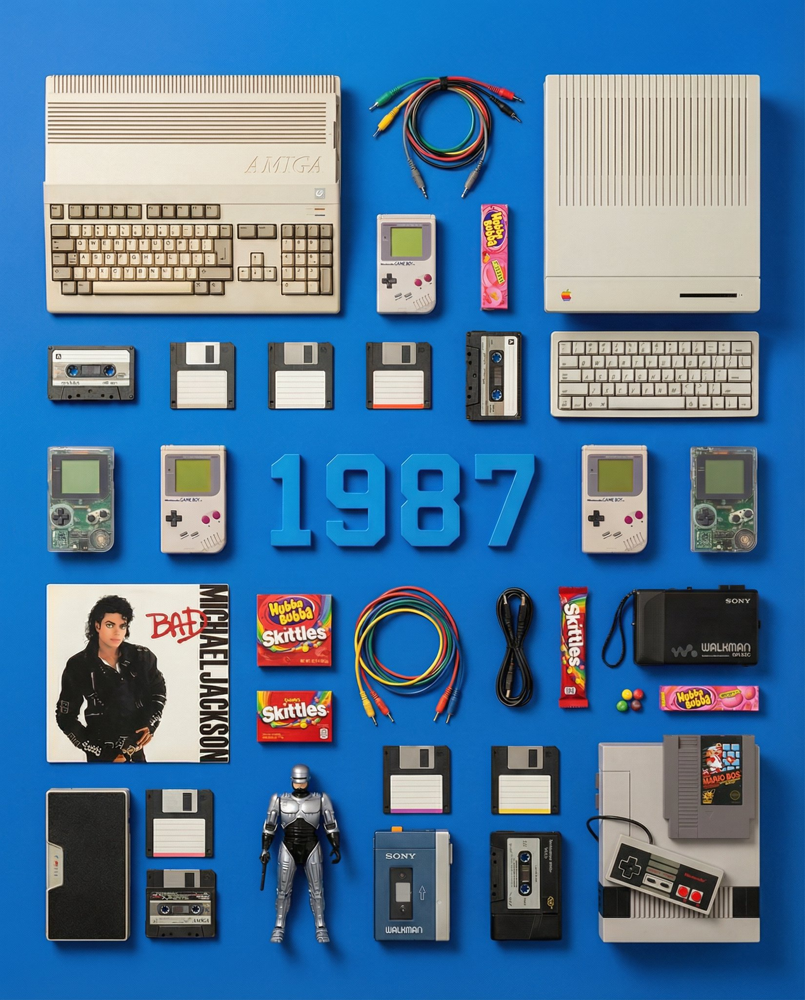
</div>

**提示词：**
```
Fotografía de producto profesional estilo 'Knolling' (Flat Lay) de alta gama, representando una cápsula del tiempo del año [AÑO].

Composición: Organización cenital meticulosamente alineada en una cuadrícula perfecta de 90 grados.
Fondo: Superficie sólida mate de color [COLOR QUE CONTRASTE, EJ: AMARILLO MOSTAZA / AZUL ELÉCTRICO].

Sujetos (Autogeneración Histórica): Selecciona y renderiza con precisión fotográfica los 5 objetos tecnológicos o de cultura pop más icónicos lanzados específicamente en [AÑO]. Incluye 5-7 accesorios menores correspondientes a la época (cables, medios de almacenamiento, papelería o dulces retro).

Elemento Central: El año "[AÑO]" está escrito en el centro exacto de la cuadrícula utilizando tipografía física y táctil (letras de plástico recortado, madera o metal) con una fuente acorde a la década.

Iluminación y Estética: Iluminación de estudio "Softbox" cenital, completamente difusa y sin sombras duras (shadowless).

Estilo: Simetría obsesiva tipo Wes Anderson, vibrante, deconstruido, organizado y visualmente satisfactorio.
Renderizado: Fotorealismo 8k, texturas de plástico y metal detalladas.
```

**中文提示词：**
```
高端专业“平铺式”产品摄影，代表了[年份]年的时光胶囊。

构图：精心排列的天顶线构成完美的 90 度网格。
背景：纯哑光表面，颜色为对比色[例如：芥末黄/电光蓝]。

主题（历史自创）：选择并以照片般的精确度呈现[年份]发布的5件最具代表性的科技或流行文化物品。包括5-7件与该时代相符的小配件（线缆、存储介质、文具或复古糖果）。

中心元素：年份“[YEAR]”用实体和触感排版（切割塑料字母、木头或金属）写在网格的正中心，字体选择与该年代相符。

灯光和美学：顶部“柔光箱”摄影棚照明，完全漫射，没有硬阴影（无阴影）。

风格：极致对称，韦斯·安德森式，充满活力，解构主义，井然有序，视觉上令人愉悦。
渲染：8K 照片级真实感，精细的塑料和金属纹理。
```

<a id="prompt-956"></a>
## 案例 956：显示在2000年代初日本的手机屏幕上 (来源 [@serena_ailab](https://x.com/serena_ailab/status/2002854097494687964)) 模型：Nano banana pro

<div style="display: flex; justify-content: space-between;">
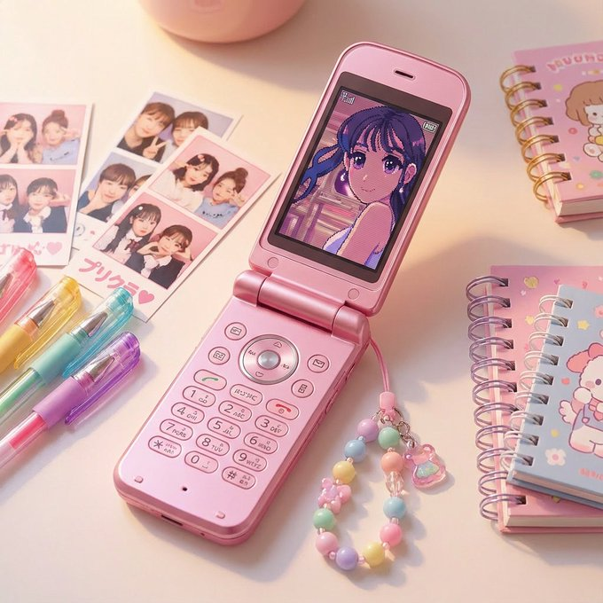
</div>

**提示词：**
```
Display the subject from the attached image on a flip phone (garakei) LCD screen from early 2000s Japan. The phone is open, with glossy pink or white shell, physical buttons, and simple beaded straps with pastel colored beads. The screen shows the image with pixelated edges and warm color saturation typical of 2000s mobile displays. Surrounded by nostalgic items like photo stickers, gel pens, and mini notebooks. Nostalgic, kawaii, emotional, soft lighting.
```

**中文提示词：**
```
将附图中的主题显示在2000年代初日本的翻盖手机（garakei）液晶屏幕上。手机处于打开状态，外壳是亮粉色或白色，带有实体按键和简单的串珠表带，表带上串着柔和色调的珠子。屏幕上的图像边缘略带像素化，色彩饱和度偏暖，这是2000年代手机屏幕的典型特征。周围摆放着一些充满怀旧气息的小物件，例如照片贴纸、中性笔和迷你笔记本。画面充满怀旧、可爱、温馨的氛围，灯光柔和。
```

<a id="prompt-955"></a>
## 案例 955：3D橡胶软管角色设计 (来源 [@The_Sycomore](https://x.com/The_Sycomore/status/2002841670992502880)) 模型：Nano banana pro

<div style="display: flex; justify-content: space-between;">

</div>

**提示词：**
```
[Subject], stylized 3D rubberhose character, smooth 3D render,  Solid [Color] color background, dynamic pose, soft ground shadow, bright soft lighting, modern playful design
```

**中文提示词：**
```
[主题]，风格化的3D橡胶软管角色，流畅的3D渲染，纯色[颜色]背景，动态姿势，柔和的地面阴影，明亮柔和的光照，现代趣味设计
```

<a id="prompt-954"></a>
## 案例 954：一张完整的产品高端宣传照 (来源 [@AmirMushich](https://x.com/AmirMushich/status/2002793794975273279)) 模型：Nano banana pro

<div style="display: flex; justify-content: space-between;">
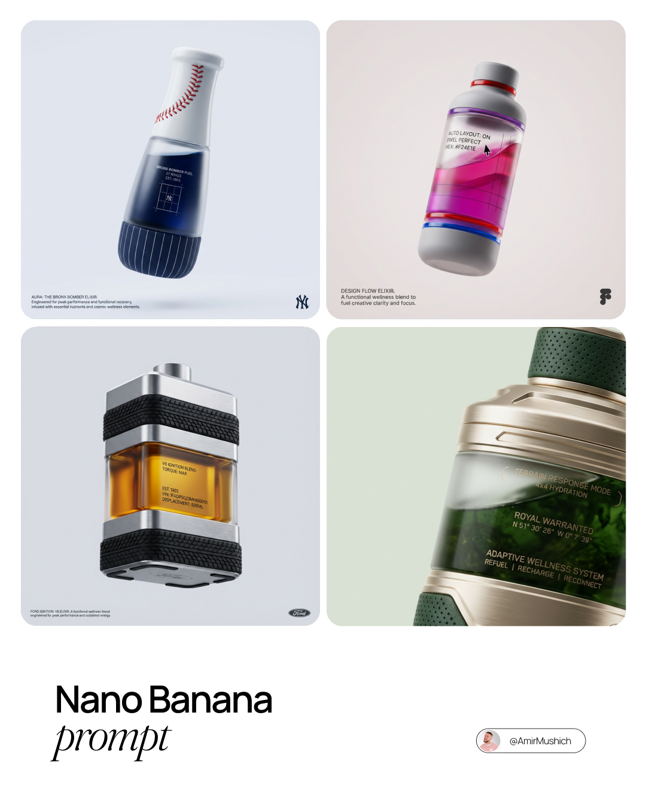
</div>

**提示词：**
```
[BRAND NAME] is launching a new functional wellness elixir (e.g., adaptogenic, nootropic, or natural energy drink). As the Creative Director, devise a product name and visualize a complete high-end promotional shot. The aesthetic is "Cosmic Premium"—technological, clean, and sophisticated, like top-tier Apple product photography.

THE PRODUCT: Design a sculptural, multi-layered beverage bottle suspended in the center. The form is engineered and futuristic. The materials are hyper-tactile: bead-blasted titanium details, frosted borosilicate glass, and textured haptic polymer grips.
**Crucial Color Instruction:** The liquid inside must have a distinct, natural color relevant to its invented function (e.g., vibrant turmeric yellow, deep berry red, earthy matcha green, or pale calming blue). The liquid should look real with subtle natural sediment.
**Crucial Graphic Detail:** On the clear glass section of the bottle, apply a layer of subtle, minimalist, technical typography printed in matte white ink. This design should feel utilitarian and futuristic (e.g., small technical specs like 'SPACE GRADE FORMULA', 'BATCH: OZ-9', volume indicators, or coordinate markings), adding a functional aesthetic similar to aerospace labeling, without overwhelming the bottle's clean lines.

THE ENVIRONMENT & LIGHTING: The bottle is in a seamless studio.
**Crucial Background Instruction:** The background must be a solid, clean, very light pastel tone that is specifically chosen to complement the liquid color (e.g., a soft cool mint background for a warm orange liquid, or a pale blush background for a deep green liquid). No gradients. Ultra-soft, diffused studio lighting creates sleek highlights on metal and deep subsurface scattering in the glass and liquid.

PHOTOGRAPHY STYLE: High-resolution 100mm macro lens shot. Shallow depth of field, sharp focus on bottle textures and the printed graphics on the glass, smooth pastel background bokeh. 8k resolve, hyper-realistic textures.

GRAPHIC OVERLAYS: Include subtle dark gray UI elements.
Bottom Left Corner: Very small, minimalist text (like Manrope Regular font) describing the product's name and function in two sentences.
Bottom Right Corner: A small, minimalist dark gray logomark for [BRAND NAME].
```

**中文提示词：**
```
[品牌名称] 即将推出一款全新的功能性健康饮品（例如，具有适应原、益智或天然能量的饮料）。作为创意总监，请构思产品名称并构思一张完整的高端宣传照。美学风格为“宇宙级奢华”——科技感十足、简洁精致、高端大气，如同顶级苹果产品摄影作品。

产品：设计一款造型独特、多层结构的饮料瓶，瓶身悬浮于中央。造型充满未来感和工程感。材质触感极佳：喷砂钛金属细节、磨砂硼硅酸盐玻璃和纹理触感聚合物握把。
**关键颜色说明:**内装液体必须具有与其功能相符的独特、自然的颜色（例如，鲜艳的姜黄、深邃的浆果红、质朴的抹茶绿或宁静的浅蓝）。液体应呈现逼真的效果，并带有细微的天然沉淀。
**关键图形细节:**在瓶子的透明玻璃部分，印上一层简洁、极简的哑光白色技术字体。这种设计应兼具实用性和未来感（例如，“太空级配方”、“批次: OZ-9 ”等小型技术规格、容量指示或坐标标记），增添类似航空航天标签的功能美感，同时又不破坏瓶子简洁的线条。

环境与灯光：瓶子放置在一个无缝摄影棚内。
**关键背景说明:**背景必须是纯色、干净、非常浅的粉彩色调，并且要经过精心挑选以衬托液体颜色（例如，暖橙色液体搭配柔和的薄荷绿背景，或深绿色液体搭配淡粉色背景）。禁止使用渐变色。超柔和的漫射摄影棚灯光可以在金属表面营造出光滑的高光，并在玻璃和液体表面形成深邃的散射效果。

摄影风格：高分辨率100mm微距镜头拍摄。浅景深，清晰聚焦于瓶身纹理和玻璃上的印刷图案，柔和的粉彩背景虚化。8K分辨率，超逼真的纹理。

图形叠加层：包含微妙的深灰色用户界面元素。
左下角：非常小的极简文字（类似 Manrope Regular 字体），用两句话描述产品的名称和功能。
右下角：[品牌名称] 的小型、极简的深灰色标志。
```

<a id="prompt-953"></a>
## 案例 953：普通物体转化为巨型纪念碑 (来源 [@aleenaamiir](https://x.com/aleenaamiir/status/2002937974993088841)) 模型：Nano banana pro

<div style="display: flex; justify-content: space-between;">
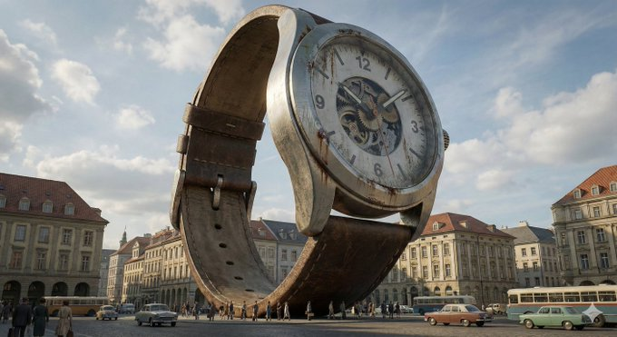
</div>

**提示词：**
```
Transform [EVERYDAY OBJECT] into a massive real-world monument. Surface materials are physically accurate, with visible wear, scratches, dust, and scale references like people and vehicles. Shot from a low-angle cinematic perspective, realistic daylight, ultra-detailed textures.
```

**中文提示词：**
```
将[日常物品]转化为一座宏伟的现实世界纪念碑。表面材质真实还原物理细节，包括可见的磨损、划痕、灰尘以及人物和车辆等比例参照物。采用低角度电影视角拍摄，逼真的日光效果，以及超精细的纹理。
```

<a id="prompt-952"></a>
## 案例 952：不同服装风格的贴纸 (来源 [@linxiaobei888](https://x.com/linxiaobei888/status/2003003721827987592)) 模型：Nano banana pro

<div style="display: flex; justify-content: space-between;">

</div>

**中文提示词：**
```
一个以上传照片为原型的3*3贴纸包，人物穿着不同服装和时尚风格。边缘干净裁剪，带有粗线条轮廓，姿势富有表现力，整体采用活泼的现代贴纸设计。在每个贴纸旁边采用中英文标注风格，所有贴纸保持相同的面部特征、一致的相似度和比例。
包含教师装、传统、护士制服、街头潮牌和奇幻灵感等多种服装风格。高分辨率成品，带有柔和阴影和光泽贴纸纸张质感，适合社交分享。
```

<a id="prompt-951"></a>
## 案例 951：衣服悬浮在空中 (来源 [@GirlsinAIArt](https://x.com/GirlsinAIArt/status/2003021477277483079)) 模型：Nano banana pro

<div style="display: flex; justify-content: space-between;">
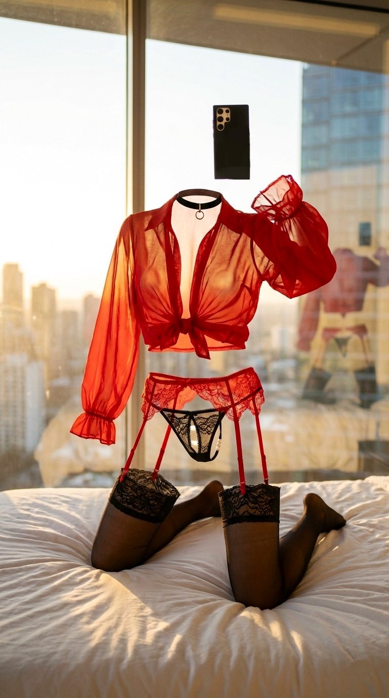
</div>

**提示词：**
```
A shape is an illusion created by placing clothes floating in the air.
```

**中文提示词：**
```
形状是通过将衣服悬浮在空中而产生的错觉。
```

<a id="prompt-950"></a>
## 案例 950：圣诞特辑-我的圣诞与自己合拍 (来源 [@songguoxiansen](https://x.com/songguoxiansen/status/2002382591823896676)) 模型：Nano banana pro

<div style="display: flex; justify-content: space-between;">

</div>

**提示词：**
```
(2-panel vertical split, twin concept, studio photography). Two panels side-by-side showing the specific character interacting with the frame edge (as if looking at herself). [CRITICAL: Keep the face identical to the source image in both panels].

Left Panel: Wearing a green sweater and Santa hat, holding a Christmas cracker ready to pull, leaning right.
Right Panel: Wearing a red sweater, holding the other end of the Christmas cracker, leaning left. Surrounded by Christmas lights.
Props: Wrapped gifts and a snowman doll at their feet.
Background: Yellow or teal bright studio background.
Lighting: Flat, bright, shadowless lighting.
Style: Fun, creative, "cloning" effect, playful narrative.
aspect_ratio: 16:9
```

**中文提示词：**
```
（两格竖版分镜，双生主题，影棚拍摄）两格画面并排呈现，特定角色与画框边缘互动（仿佛在看向镜中的自己）【重要要求：两格画面中人物的面部必须与原图完全一致】
左格：身着绿色毛衣、头戴圣诞帽，手持圣诞拉炮待拉响，身体向右倾斜右格：身着红色毛衣，握住圣诞拉炮的另一端，身体向左倾斜，周身环绕圣诞彩灯
道具：脚边摆放包装好的礼物与雪人玩偶背景：明亮的黄色或蓝绿色影棚背景光线：均匀明亮、无阴影的打光风格：活泼新颖，带 “分身” 特效，营造趣味叙事感画面比例：16:9
```

<a id="prompt-949"></a>
## 案例 949：圣诞特辑-红韵点睛圣诞风尚志 (来源 [@songguoxiansen](https://x.com/songguoxiansen/status/2002735852284457029)) 模型：Nano banana pro

<div style="display: flex; justify-content: space-between;">
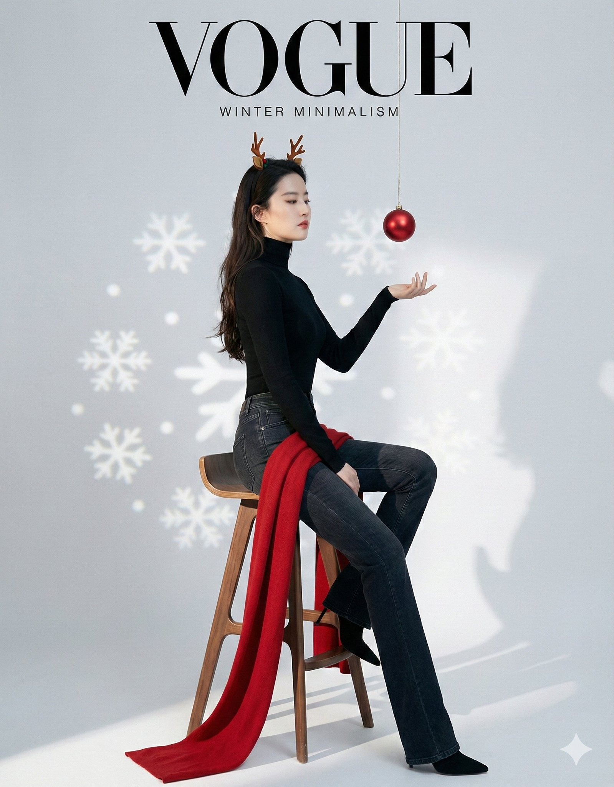
</div>

**提示词：**
```
(Magazine cover layout, minimalist composition, negative space). A full-body studio shot of the specific character sitting on a tall stool. [CRITICAL: Ensure the face is exactly the same as the reference].

Styling: Minimalist chic outfit (black turtleneck, jeans). A long red scarf flowing down. Wearing subtle reindeer antlers. Props: A single red Christmas bauble hanging from a string right above her hand. Snowflake light patterns projected on the background wall. Background: Solid light grey or white seamless paper. Lighting: Soft, directional light creating a clean look with defined shadows. Style: Vogue or Elle magazine style, high fashion, clean lines, modern and sophisticated.
```

**中文提示词：**
```
（杂志封面版式，极简构图，留白设计）特定人物坐在高脚凳上的全身棚拍造型。【重点要求：务必保证人物面部与参考图完全一致】
造型：简约时髦穿搭（黑色高领毛衣、牛仔裤），一条红色长围巾垂坠飘动。佩戴低调的驯鹿角发饰。道具：一颗红色圣诞装饰球用细绳悬挂，恰好位于她的手上方。背景：雪花光影图案投射于背景墙面；背景采用纯色浅灰或白色无缝背景纸。光线：柔和定向光，打造干净利落的视觉效果，同时形成轮廓清晰的阴影。风格：《Vogue》或《Elle》杂志风格，高奢时尚，线条简洁，兼具现代感与精致格调。
```

<a id="prompt-948"></a>
## 案例 948：圣诞特辑-圣诞四格甜妹 (来源 [@songguoxiansen](https://x.com/songguoxiansen/status/2002730147313840161)) 模型：Nano banana pro

<div style="display: flex; justify-content: space-between;">

</div>

**提示词：**
```
(Masterpiece, top quality, ultra-detailed, 8k resolution). A photorealistic 4-panel split screen grid collage featuring the same specific female character in all panels. [CRITICAL: Maintain exact facial features, preserve original face structure, consistent character reference throughout all panels]. The character has a fair complexion, natural skin texture, and bright eyes.
Panel 1 (Top Left): The character is winking playfully, wearing plush reindeer antlers, holding a candy cane near her cheek, joyful expression.Panel 2 (Top Right): The character is wearing a red Santa hat with white fur trim, looking surprised with hands covering her mouth, eyes wide open.Panel 3 (Bottom Left): The character is blowing a kiss, holding a small wrapped gift box with a gold ribbon, wearing a cozy oversized white knitted sweater.Panel 4 (Bottom Right): The character is giving a soft smile, eyes full of affectionate gaze, wearing a Christmas reindeer accessory around her neck, dressed in a red velvet Christmas dress with white fur trim, wearing red fluffy Christmas gloves, forming a heart shape with both hands beside her cheeks.
Environment: Solid studio background in soft pastel red or green.Lighting: Bright, high-key studio lighting, ring light reflection in eyes, soft shadows, uniform illumination.Style: Korean photobooth style, vibrant colors, sharp focus, cute and energetic atmosphere, commercial photography aesthetic.
```

**中文提示词：**
```
（杰作级，顶级品质，超高清细节，8K分辨率）。这是一幅逼真的四格分屏网格拼贴画，所有画面均以同一位女性角色为中心。[关键：保持面部特征的精准还原，保留原有的面部结构，所有画面均使用一致的角色参考图]。该角色肤色白皙，肤质自然，双眸明亮动人。
第一格（左上）：角色俏皮地眨着眼，头戴毛绒驯鹿角，脸颊边放着一根拐杖糖，表情快乐。第二格（右上）：角色戴着一顶镶有白色毛边的红色圣诞帽，双手捂着嘴，睁大眼睛，一脸惊讶。第三格（左下）：角色送出一个飞吻，手里拿着一个系着金色丝带的小礼盒，身穿一件舒适的白色宽松针织衫。第四格（右下）：角色露出温柔的微笑，眼神充满爱意，脖子上戴着圣诞驯鹿饰品，身穿镶有白色毛边的红色天鹅绒圣诞连衣裙，戴着红色毛绒圣诞手套，双手放在脸颊两侧，比出一个心形。
环境：柔和的粉红色实心影棚背景或green.Lighting ：明亮的高调影棚灯光，眼睛中环形灯反射，柔和的阴影，均匀illumination.Style ：韩式照相亭风格，鲜艳的色彩，清晰的焦点，可爱而充满活力的氛围，商业摄影美学。
```

<a id="prompt-947"></a>
## 案例 947：圣诞特辑-人物定格在奇幻巨型玻璃雪球里 (来源 [@songguoxiansen](https://x.com/songguoxiansen/status/2002370189384691980)) 模型：Nano banana pro

<div style="display: flex; justify-content: space-between;">
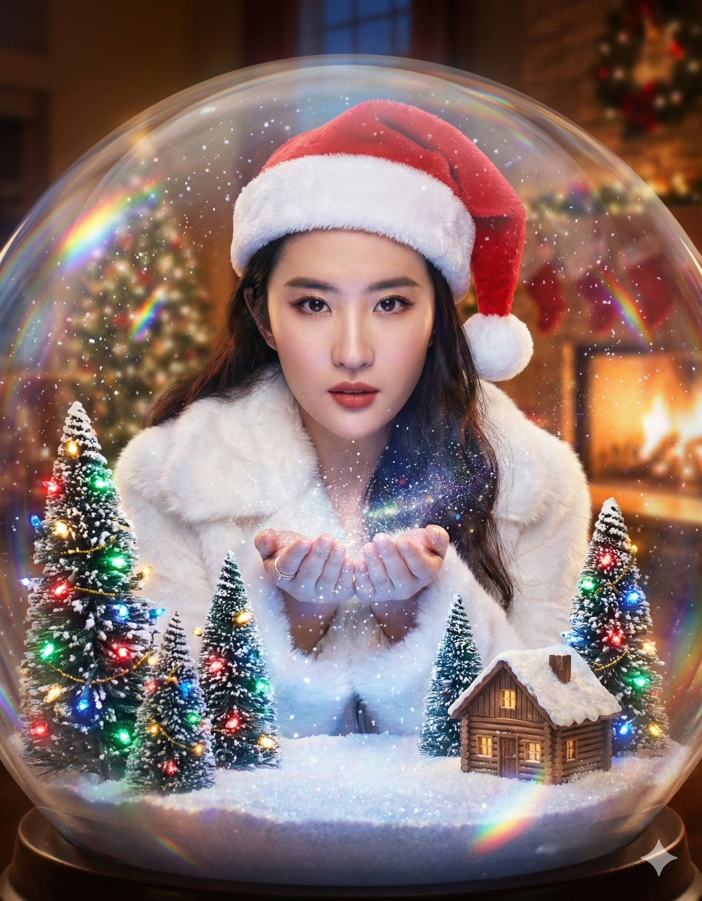
</div>

**提示词：**
```
(Surrealism, fantasy art, macro photography style). A magical composition where the specific character is captured inside a giant, life-sized glass snow globe. [CRITICAL: Keep the face identical to the source image, maintain consistent facial features within the glass distortion].

Inside the Globe: The character is wearing a white faux fur winter coat and a red Santa hat, catching falling snowflakes with her hands. The environment inside includes miniature snow-covered pine trees decorated with colorful Christmas lights twinkling in red, green, blue, and gold. A tiny wooden cabin sits among the trees. Swirling magical glitter and snow dust fill the air inside the sphere.

Outside the Globe: The background is a blurry, cozy living room with a fireplace, emphasizing that the character is inside the ornament.

Lighting: The snow globe is glowing from within, illuminated by the warm colorful glow of the Christmas tree lights mixing with cool magical blue and white light on the falling snow. The character's face is beautifully lit by this magical mixed lighting. External warm light reflects off the curved glass surface, creating rainbow prismatic effects.

Technical: Ray tracing reflections on the glass, refraction effects, crystal clear focus on the character, magical atmosphere, ethereal and dreamy aesthetic, 8k resolution, intricate details of the snowflakes and Christmas lights bokeh.
```

**中文提示词：**
```
（超现实主义、奇幻艺术、微距摄影风格）。一幅充满魔幻色彩的作品，将特定人物置于一个巨大的、真人大小的玻璃雪球中。[关键：保持面部与原图一致，在玻璃变形中保持面部特征的一致性]。

球体内部：人物身穿白色人造毛皮冬装，头戴红色圣诞帽，正用手接住飘落的雪花。球体内部的景象包括覆盖着白雪的微型松树，树上装饰着闪烁着红、绿、蓝、金四色圣诞彩灯。树丛中坐落着一间小木屋。球体内部弥漫着旋转的魔法闪光和雪花。

地球仪外部：背景是一个模糊的、舒适的客厅，里面有一个壁炉，强调了人物位于装饰品内部。

灯光：雪球内部散发着柔和的光芒，圣诞树彩灯温暖多彩的光芒与飘落雪花上清冷梦幻的蓝白色灯光交相辉映。人物的脸庞在这梦幻般的混合灯光下显得格外美丽。外部温暖的光线反射在弧形玻璃表面，折射出彩虹般的棱镜效果。

技术特点：光线追踪玻璃上的反射、折射效果、清晰聚焦于人物、营造神奇氛围、空灵梦幻的美感、8K 分辨率、雪花和圣诞彩灯散景的精细细节。
```

<a id="prompt-946"></a>
## 案例 946：指定年份的小玩意和发明可视化 (来源 [@Gdgtify](https://x.com/Gdgtify/status/2002307108050776474)) 模型：Nano banana pro

<div style="display: flex; justify-content: space-between;">
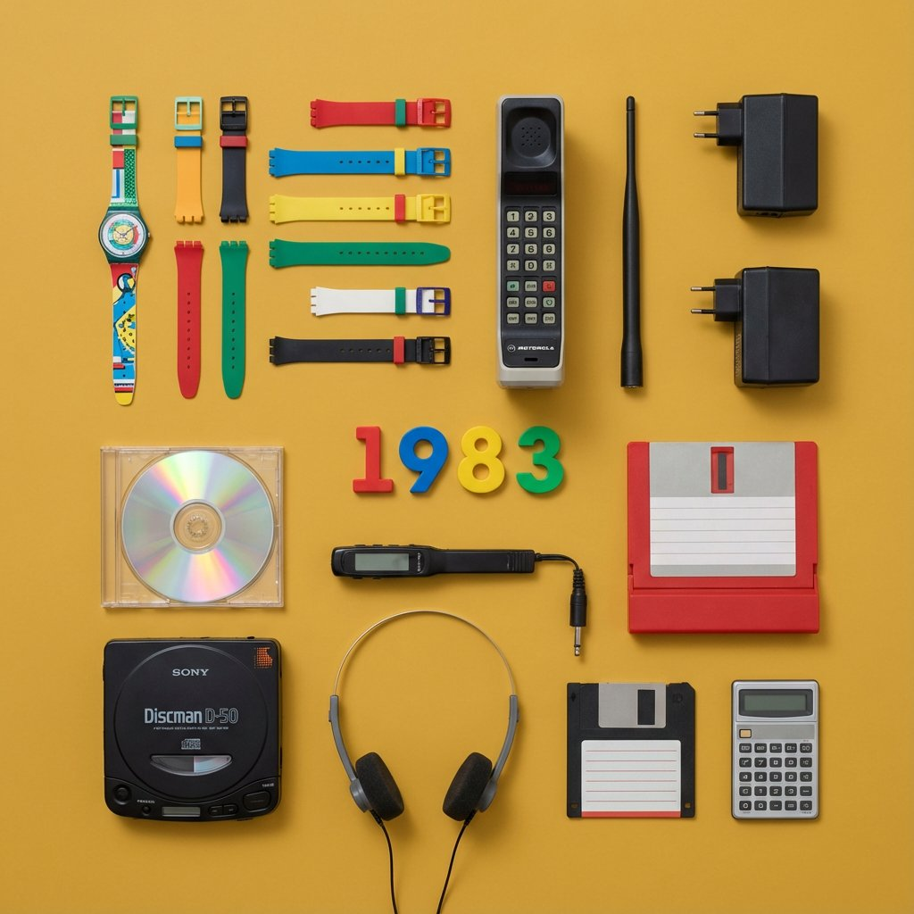
</div>

**提示词：**
```
Do this for 1983 > You are a Professional Product Photographer specializing in knolling Flat Lay photography. I will provide a Year or inventor. Step 1: The Selection.  > Identify 3 to 5 inventions from that year, plus 5-7 smaller related accessories (e.g., if the invention is a camera, include film rolls; if it's a car part, include a wrench).

Step 2: The Layout. Arrange all items on a flat, solid-colored matte background (choose a color that contrasts well with the items).

The Grid: Align everything at perfect 90-degree angles. Organize them by size and shape.

The Vibe: Deconstructed, organized, satisfying, geometric.

The Lighting:

Soft, flat, overhead studio lighting (shadowless).

Output:

A single 4:5 image.

The Year (e.g., "1955") should be arranged using physical typography (like metal letters or cut paper) placed in the center of the grid.

Style: Wes Anderson symmetry, high-end commercial advertising, vibrant.
```

**中文提示词：**
```
请完成以下关于 1983 年的任务 > 您是一位专业产品摄影师，专长于轻柔的平铺摄影。我将提供一个年份或一位发明家。步骤 1：选择。  >从该年份中找出 3 到 5 项发明，以及 5 到 7 项相关的小型配件（例如，如果发明是相机，则包括胶卷；如果是汽车零件，则包括扳手）。

步骤 2：布局。将所有物品排列在平整的纯色哑光背景上（选择与物品形成鲜明对比的颜色）。

网格法：将所有物体对齐成完美的 90 度角。按大小和形状进行排列。

氛围：解构的、有条理的、令人满意的、几何的。

照明：

柔和、平整的顶灯式摄影棚照明（无阴影）。

输出：

一张4:5比例的图片。

年份（例如“1955”）应使用实体印刷品（如金属字母或剪纸）放置在网格的中心。

风格：韦斯·安德森式的对称美，高端商业广告风格，充满活力。
```

<a id="prompt-945"></a>
## 案例 945：将你最喜欢的角色变成收藏品 (来源 [@Gdgtify](https://x.com/Gdgtify/status/2002116477307044203)) 模型：Nano banana pro

<div style="display: flex; justify-content: space-between;">
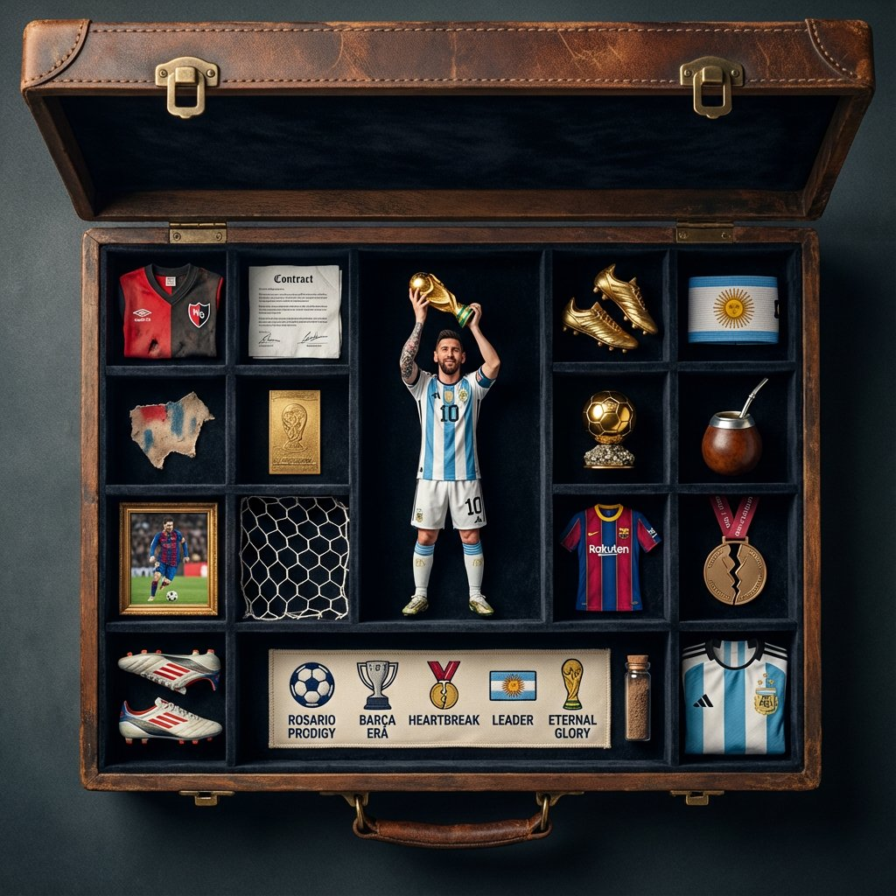
</div>

**提示词：**
```
do this for Messi: <instruction>
Relic-Loadout Kit
Input A is a fictional or real character (image/name) OR story IP (poster/name).
Analyze and infer: character archetype, iconic scene, signature items, and moral arc.
Goal: Premium collector kit box with compartments (no logos; minimal text).
Rules:
Center compartment: mini figurine.
Surround 10–16 relic props that teach the character arc (before/after item, symbol of sacrifice, tool of choice).
Add a tiny “arc timeline” strip with 5 beats (icons + 1–2 words max each).
Output: one image, 4:5 product hero shot.
</instruction>
```

**中文提示词：**
```
请为梅西做这件事：</指令>
遗物装备包
输入 A 是虚构或真实的角色（图像/名称）或故事 IP（发布者/名称）。
分析和推断：人物原型、标志性场景、标志性物品和道德弧线。
目标：带隔层的优质收藏套装盒（无标志；文字极少）。
规则：
中间隔层：迷你人偶。
围绕 10-16 件遗物道具来展现角色弧光（前后物品、牺牲的象征、选择的工具）。
添加一个包含 5 个节点的“弧线时间轴”小条（每个节点最多可包含 1-2 个图标和 1-2 个单词）。
输出：一张图片，4:5 产品主图。
</指令>
```

<a id="prompt-944"></a>
## 案例 944：超逼真的Macbook屏幕视频会议图 (来源 [@egeberkina](https://x.com/egeberkina/status/2002114484903800832)) 模型：Nano banana pro

<div style="display: flex; justify-content: space-between;">

</div>

**提示词：**
```
{
"task": "hyper_realistic_macbook_screen_photography",
"reference_logic": "exact_microsoft_teams_waiting_room_ui_macos",
"output": {
"type": "single_image",
"resolution": "ultra_high_resolution_8k",
"realism": "indistinguishable_from_real_laptop_photo",
"capture_style": "iphone_photo_of_macbook_screen",
"post_processing": "none"
},
"scene": {
"application": "Microsoft Teams",
"platform": "macOS",
"ui_state": "meeting_waiting_room",
"top_status_text": "Meeting now",
"center_message": "We've let people in the meeting know you're waiting.",
"background": "pure_black_dark_mode"
},
"ui_layout": {
"left_panel": {
"video_preview": {
"position": "bottom_left",
"aspect_ratio": "landscape",
"camera_toggle": "on",
"background_filters_button": "visible_below_preview"
}
},
"right_panel": {
"audio_section": {
"title": "Computer audio",
"selected_device": "AirPods Max",
"volume_slider": "horizontal_blue_indicator",
"mute_toggle": "off"
},
"audio_options": [
"Phone audio",
"Room audio",
"Don't use audio"
],
"cancel_button": {
"label": "Cancel",
"position": "bottom_right",
"style": "rounded_rectangle"
}
}
},
"subject": {
"gender": "female",
"hair": {
"color": "natural_blonde",
"style": "soft_bangs_with_loose_layers",
"texture": "individual_strands_visible"
},
"face": {
"skin": "true_human_skin_texture",
"details": "visible_pores_micro_imperfections",
"retouching": "none"
},
"eyewear": {
"brand": "Ray-Ban",
"model": "Wayfarer",
"type": "prescription_glasses",
"frame_color": "black",
"lens_reflection": "subtle_real_world_glare"
},
"headphones": {
"model": "AirPods Max",
"color": "space_gray",
"fit": "natural_over_ear_position"
},
"clothing": {
"top": "neutral_crop_top",
"style": "casual_minimal"
},
"expression": "calm_focused_waiting",
"gaze": "slightly_downward"
},
"environment": {
"background": "modern_open_office",
"ceiling": "exposed_industrial_ducts",
"lighting": {
"type": "soft_natural_daylight",
"mixed_with": "indoor_office_lighting",
"temperature": "5200K"
}
},
"screen_reflection": {
"enabled": true,
"source": "same_subject_as_video_preview",
"reflection_type": "soft_glass_reflection",
"intensity": "very_subtle",
"opacity": 0.05,
"sharpness": "low",
"distortion": "slight_glass_warp",
"positioning": "offset_not_centered",
"visibility_rules": {
"ui_text": "fully_readable",
"icons": "unobstructed",
"reflection_never_overpowers_ui": true
},
"realism_notes": [
"not_mirror_like",
"not_double_face",
"no_symmetry",
"appears_only_on_dark_areas"
]
},
"macos_elements": {
"dock": {
"visible": true,
"style": "macos_default_big_sur_or_later",
"reflection": "subtle",
"indicator_dot": "visible_under_active_apps",
"icons": [
"Finder",
"Mail",
"Calendar",
"Microsoft Teams",
"Adobe Illustrator",
"Adobe InDesign",
"Adobe After Effects",
"Adobe Lightroom",
"Adobe Photoshop",
"Adobe Premiere Pro",
"App Store",
"System Settings"
]
},
"menu_bar": {
"visibility": "partial_top_edge",
"elements": [
"WiFi",
"Battery",
"Time",
"macOS_control_icons"
]
}
},
"camera": {
"device": "iPhone",
"angle": "slightly_off_axis",
"handheld": true,
"screen_artifacts": [
"soft_glass_reflection",
"minor_glare",
"fingerprint_smudges",
"dust_particles",
"moire_pattern"
]
},
"color_profile": {
"contrast": "natural_display_contrast",
"saturation": "neutral_realistic",
"white_balance": "accurate_screen_calibrated"
},
"negative_prompt": [
"generic_video_call_ui",
"zoom_interface",
"google_meet_ui",
"fake_buttons",
"wrong_fonts",
"misaligned_panels",
"ai_generated_ui",
"blurred_text",
"plastic_skin",
"over_sharpening",
"mirror_reflection",
"double_face",
"incorrect_dock_icons"
]
}
```

**中文提示词：**
```
{
"任务": "超逼真的Macbook屏幕摄影",
"reference_logic": "exact_microsoft_teams_waiting_room_ui_macos",
“输出”： {
"type": "single_image",
"分辨率": "超高分辨率_8k",
“真实感”： “与真实笔记本电脑照片无法区分”
"capture_style": "iphone_photo_of_macbook_screen",
"post_processing": "无"
},
“场景”： {
“应用程序”：“Microsoft Teams”，
“平台”： “macOS”，
"ui_state": "会议室等候室",
"top_status_text": "正在开会",
"center_message": "我们已经通知会议中的其他人您正在等待。"
“背景”： “纯黑_深色模式”
},
"ui_layout": {
"left_panel": {
"video_preview": {
"位置": "左下角",
"aspect_ratio": "landscape",
"camera_toggle": "开启",
"background_filters_button": "visible_below_preview"
}
},
"right_panel": {
"audio_section": {
标题：计算机音频，
"selected_device": "AirPods Max",
"音量滑块": "水平蓝色指示器",
"mute_toggle": "关闭"
},
"audio_options": [
“电话音频”，
“房间音频”，
“请勿使用音频”
],
"取消按钮": {
标签： 取消，
"位置": "右下角",
"样式": "圆角矩形"
}
}
},
“主题”： {
"性别": "女性",
“头发”： {
颜色：自然金发，
"style": "soft_bangs_with_loose_layers",
"texture": "individual_strands_visible"
},
“脸”： {
"皮肤": "真实人类皮肤纹理",
"详情": "可见毛孔微瑕疵",
“修饰”： “无”
},
"眼镜": {
品牌：雷朋，
“型号”：“旅行者”，
"type": "处方眼镜",
"frame_color": "黑色",
"lens_reflection": "subtle_real_world_glare"
},
“耳机”： {
“型号”：“AirPods Max”，
"颜色": "太空灰",
"fit": "natural_over_ear_position"
},
“衣服”： {
"上衣": "中性露脐上衣",
风格：休闲简约
},
"表情": "平静专注的等待",
“凝视”: “略微向下”
},
“环境”： {
“背景”： “现代开放式办公室”
"天花板": "裸露的工业风管",
“灯光”： {
"type": "柔和自然日光",
"mixed_with": "室内办公照明",
温度：5200K
}
},
"screen_reflection": {
“启用”：true，
"source": "same_subject_as_video_preview",
"reflection_type": "soft_glass_reflection",
“强度”： “非常微妙”，
“不透明度”：0.05，
“锐度”: “低”
"失真": "轻微玻璃变形",
"定位": "offset_not_centered",
"visibility_rules": {
"ui_text": "完全可读",
“图标”：“畅通无阻”，
"reflection_never_overpowers_ui": true
},
"realism_notes": [
"not_mirror_like",
“非双面”，
"no_symmetry",
"仅在深色区域出现"
]
},
"macos_elements": {
"码头": {
“可见”：是，
"style": "macos_default_big_sur_or_later",
“反思”：“微妙的”，
"indicator_dot": "visible_under_active_apps",
“图标”：[
“发现者”，
“邮件”，
“日历”，
“Microsoft Teams”，
“Adobe Illustrator”
“Adobe InDesign”，
“Adobe After Effects”，
“Adobe Lightroom”，
“Adobe Photoshop”，
“Adobe Premiere Pro”，
“App Store”，
系统设置
]
},
"menu_bar": {
"可见性": "部分顶部边缘",
“元素”：[
“无线上网”，
“电池”，
“时间”，
"macOS_control_icons"
]
}
},
“相机”： {
"设备": "iPhone",
"角度": "略微偏离轴线",
“手持式”：是，
"screen_artifacts": [
"soft_glass_reflection",
“轻微眩光”，
“指纹污迹”，
"灰尘颗粒",
莫尔条纹图案
]
},
"color_profile": {
"对比度": "natural_display_contrast",
"饱和度": "中性_真实"
“white_balance”: “accur_screen_calibrated”
},
"negative_prompt": [
"generic_video_call_ui",
"zoom_interface",
"google_meet_ui",
"fake_buttons",
"wrong_fonts",
“错位面板”，
"ai_generated_ui",
"模糊文本",
"塑料皮肤",
“过度锐化”
"镜像反射",
“双面”，
"incorrect_dock_icons"
]
}
```

<a id="prompt-943"></a>
## 案例 943：五联宽幅胶片拼贴作品 (来源 [@BeautyVerse_Lab](https://x.com/BeautyVerse_Lab/status/2002263911413031260)) 模型：Nano banana pro

<div style="display: flex; justify-content: space-between;">
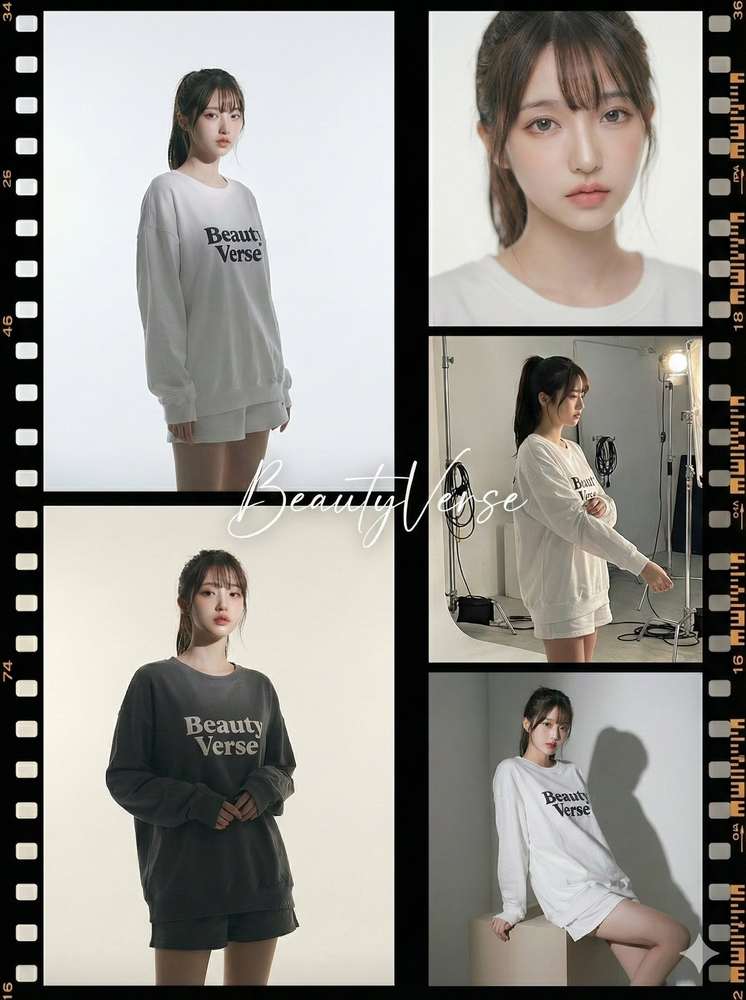
</div>

**提示词：**
```
{
"project_title": "High-End Studio Fashion Editorial '5-Panel Wide Film' Collage",
"structure": "Asymmetric 2-column layout: Left column contains 2 stacked panels; Right column contains 3 stacked panels. Total height of both columns is identical.",
"aspect_ratio": "3:4",
"aesthetic_theme": {
"style": "Professional studio editorial mixed with seamless vintage film strip aesthetic",
"mood": "Minimalist, sophisticated, balanced yet dynamic",
"color_palette": [
"Clean whites",
"Sophisticated charcoals",
"Soft champagne gold",
"Deep black film borders",
"Neutral skin tones"
],
"textures": [
"Subtle film grain",
"Matte celluloid finish",
"Seamless cyclorama wall",
"High-fashion fabric textures"
]
},
"framing_and_borders": {
"type": "Integrated 5-panel wide film strip",
"details": [
"The layout is a single large rectangular film frame divided into 5 segments",
"Authentic film rebate with sprocket holes and frame numbers only on the FAR LEFT and FAR RIGHT outer vertical edges",
"The top and bottom outer edges are clean black film borders",
"Internal dividers: All internal lines (the central vertical divider and the horizontal lines on both sides) are simple, solid thin black lines"
]
},
"subject_reference": {
"source": "image_1.png",
"instruction": "The subject's physical appearance, complete outfit, and accessories must exactly match the person in image_1.png. Maintain visual consistency across all five frames."
},
"composition_layout": {
"left_column_stack": {
"dimensions": "Two stacked vertical panels",
"frames": [
{
"id": "frame_top_left",
"type": "Full-body studio editorial shot",
"setting": "Clean minimalist studio",
"pose": "Sophisticated standing pose, showcasing the full outfit silhouette",
"lighting": "High-contrast rim lighting"
},
{
"id": "frame_bottom_left",
"type": "Medium-shot editorial",
"setting": "Minimalist studio background",
"pose": "Artistic sitting or leaning pose, focusing on the upper body and garment flow",
"lighting": "Soft directional lighting"
}
]
},
"right_column_stack": {
"dimensions": "Three stacked horizontal panels matching the total height of the left column",
"frames": [
{
"id": "frame_top_right",
"type": "Close-up beauty portrait",
"setting": "Professional studio setup",
"pose": "Frontal view, elegant expression, focus on facial features",
"visual_effects": "Shallow depth of field, sharp focus on eyes"
},
{
"id": "frame_middle_right",
"type": "Candid BTS side-shot",
"setting": "Working studio environment with equipment visible",
"lighting": "Raw studio working lights",
"pose": "Relaxed, natural demeanor, perhaps looking at a monitor off-camera",
"props_and_details": "Visible C-stands and studio cables"
},
{
"id": "frame_bottom_right",
"type": "Dynamic detail or medium-shot",
"setting": "Studio corner with minimalist pedestal",
"lighting": "Butterfly lighting setup",
"pose": "Fashion-forward pose, highlighting accessories or specific outfit textures"
}
]
}
},
"central_element": {
"type": "Signature Overlay",
"content": "BeautyVerse",
"position": "Center of the entire composition, placed on the central vertical divider",
"style": {
"appearance": "Elegant fluid cursive, translucent white ink",
"texture": "Fine ink stroke",
"scaling": "Medium-sized"
}
}
}
```

**中文提示词：**
```
{"项目标题": "高端影棚时尚大片《五联宽幅胶片》拼贴作品","布局结构": "非对称双栏布局：左栏包含 2 个竖向堆叠的画面单元；右栏包含 3 个竖向堆叠的画面单元，两栏总高度保持一致","画幅比例": "3:4","美学主题": {"风格定位": "专业影棚大片风格融合无缝复古胶片条质感","整体氛围": "简约高级，平衡且富有动感","色彩搭配": ["纯净白色","高级炭灰色","柔和香槟金色","深邃黑色胶片边框","自然裸肤色"],"质感表现": ["细腻胶片颗粒","哑光赛璐珞质感","无缝影棚弧形背景墙","高级时装面料肌理"]},"画框与边框设计": {"边框类型": "一体化五联宽幅胶片式边框","细节说明": ["整体构图为一个大型矩形胶片画框，内部划分为 5 个画面单元","仅在最左侧和最右侧的外垂直边缘保留真实的胶片边缘留白、齿孔及画面编号","上下外边缘为简洁的纯黑胶片边框","内部分割线：所有内部线条（竖向中分割线及两侧的横向分割线）均为简洁的纯黑色细实线"]},"人物参考要求": {"参考素材": "image_1.png","执行说明": "人物的外形、全套服装及配饰必须与 image_1.png 中的人物完全一致，所有五个画面单元需保持视觉统一性"},"构图布局细则": {"左栏堆叠区域": {"尺寸规格": "两个竖向堆叠的画面单元","画面设定": [{"编号": "左上画面","拍摄类型": "全身影棚时尚大片","场景设定": "极简干净的影棚环境","姿势要求": "优雅站姿，完整展现服装廓形","灯光方案": "高对比度轮廓光"},{"编号": "左下画面","拍摄类型": "中景时尚大片","场景设定": "极简影棚背景","姿势要求": "艺术感坐姿或倚靠姿势，聚焦上半身及服装垂坠感","灯光方案": "柔和定向光"}]},"右栏堆叠区域": {"尺寸规格": "三个横向排布的画面单元，与左栏总高度保持一致","画面设定": [{"编号": "右上画面","拍摄类型": "特写美妆肖像","场景设定": "专业影棚布景","姿势要求": "正面朝向镜头，表情优雅，聚焦面部五官","视觉效果": "浅景深处理，眼部精准对焦"},{"编号": "右中画面","拍摄类型": "抓拍式幕后侧拍镜头","场景设定": "工作状态下的影棚环境，可见各类设备","灯光方案": "影棚工作实景光源","姿势要求": "状态松弛自然，可设定为看向镜头外的监视器","道具与细节": "可见 C 型支架及影棚线缆"},{"编号": "右下画面","拍摄类型": "动感细节特写或中景镜头","场景设定": "影棚角落搭配极简展示台","灯光方案": "蝶形布光方案","姿势要求": "时尚感造型姿势，突出配饰细节或服装特定肌理"}]}},"核心视觉元素": {"元素类型": "标志性叠加文字","文字内容": "BeautyVerse","摆放位置": "整个构图的正中央，置于竖向中分割线上","风格设定": {"字体外观": "流畅优雅的草书字体，半透明白色墨效","笔触质感": "纤细精致的墨迹笔触","尺寸比例": "中等字号"}}}
```

<a id="prompt-942"></a>
## 案例 942：植发一年的改变图 (来源 [@egeberkina](https://x.com/egeberkina/status/2002465235391967688)) 模型：Nano banana pro

<div style="display: flex; justify-content: space-between;">

</div>

**提示词：**
```
{
"task": "ultra_realistic_hair_transplant_progression",
"output": {
"type": "single_image_multi_stage",
"layout": "horizontal_timeline_grid",
"resolution": "ultra_high_resolution",
"realism": "clinical_photographic_realism",
"quality": "medical_documentary_photography",
"retouching": {
"skin": "minimal_medical_grade",
"preserve_scalp_texture": true,
"no_cosmetic_enhancement": true
}
},
"subject": {
"person": {
"gender": "male",
"age": "young_to_middle_adult",
"ethnicity": "neutral",
"identity": "same_patient_consistent",
"head_position": "identical_angle_each_stage"
}
},
"timeline": {
"stages": [
{
"label": "Pre-Op",
"time": "before_transplant",
"hair": {
"density": "significant_recession",
"pattern": "male_pattern_baldness",
"scalp_visibility": "high"
},
"scalp": "clean_shaved",
"skin_tone": "natural"
},
{
"label": "Day 2",
"time": "2_days_post_op",
"hair": {
"grafts": "fresh_implanted_visible",
"density": "low_evenly_spaced"
},
"scalp": "redness_micro_scabs_swelling",
"notes": "clearly_visible_implant_points"
},
{
"label": "Week 2",
"time": "14_days",
"hair": {
"grafts": "short_fragile_hairs",
"shedding": "early_phase"
},
"scalp": "reduced_redness_remaining_scabs"
},
{
"label": "Month 1",
"time": "4_weeks",
"hair": {
"shedding": "shock_loss_phase",
"visibility": "patchy_thin"
},
"scalp": "mostly_normal"
},
{
"label": "Month 3",
"time": "12_weeks",
"hair": {
"regrowth": "fine_new_hairs_emerging",
"density": "low_but_even"
},
"texture": "thin_soft"
},
{
"label": "Month 6",
"time": "6_months",
"hair": {
"density": "moderate",
"coverage": "clearly_improving"
},
"texture": "thicker_but_uneven_length"
},
{
"label": "Month 9",
"time": "9_months",
"hair": {
"density": "high",
"hairline": "natural_definition"
},
"texture": "healthy_normal_growth"
},
{
"label": "Month 12",
"time": "12_months",
"hair": {
"density": "final_result",
"coverage": "full_natural"
},
"texture": "mature_thick_hair",
"finish": "non_styled_natural"
}
]
},
"scene": {
"location": "clinical_photo_room",
"background": {
"color": "neutral_light_gray",
"texture": "flat"
},
"consistency": "same_lighting_same_camera_same_distance"
},
"composition": {
"crop": "top_of_head_and_forehead",
"angle": "slightly_top_down",
"alignment": "perfect_grid_spacing",
"labels": "small_clean_medical_typography"
},
"camera": {
"camera_type": "medical_documentation_camera",
"lens": "85mm",
"aperture": "f8",
"sharpness": "high",
"distortion": "none"
},
"lighting": {
"type": "even_clinical_softbox",
"contrast": "low",
"shadows": "minimal",
"skin_accuracy": "true_to_life"
},
"negative_prompt": [
"instant_full_hair",
"fake_density",
"wig_like_texture",
"beauty_lighting",
"styled_hair",
"marketing_glow",
"cgi_scalp",
"unrealistic_speed"
]
}
```

**中文提示词：**
```
{
"任务": "超逼真植发进展",
“输出”： {
"type": "single_image_multi_stage",
"布局": "horizo​​ntal_timeline_grid",
"分辨率": "超高分辨率",
"realism": "clinical_photographic_realism",
"质量": "医疗纪实摄影",
“修饰”：{
"皮肤": "最低医疗级",
"preserve_scalp_texture": true,
"no_cosmetic_enhancement": true
}
},
“主题”： {
“人”： {
“性别”： “男”，
“年龄”： “青年至中年”
“种族”： “中立”，
"identity": "same_patient_consistent",
"head_position": "identical_angle_each_stage"
}
},
"时间线": {
“阶段”：[
{
标签：术前，
"时间": "移植前",
“头发”： {
“密度”： “显著衰退”，
"pattern": "male_pattern_balness",
"scalp_visibility": "高"
},
"头皮": "剃光头",
"skin_tone": "自然"
},
{
标签：第 2 天，
"time": "2_days_post_op",
“头发”： {
"移植体": "新鲜植入的可见体",
"密度": "低均匀分布"
},
“头皮”: “发红_微痂_肿胀”
"notes": "清晰可见的植入点"
},
{
标签：第 2 周，
"时间": "14_天",
“头发”： {
"移植"": "短而脆弱的头发",
“脱落”: “早期阶段”
},
"头皮": "减少红肿，剩余结痂"
},
{
标签： 1 月，
"时间": "4_周",
“头发”： {
"脱落": "冲击损失阶段",
"可见性": "斑驳的薄弱"
},
头皮：基本正常
},
{
标签： “3 月”
"时间": "12_周",
“头发”： {
"regrowth": "fine_new_hairs_emerging",
“密度”： “低但均匀”
},
"纹理": "薄而柔软"
},
{
标签：第 6 个月，
"时间": "6_个月",
“头发”： {
“密度”：“中等”，
“覆盖范围”： “明显改善”
},
"纹理": "较厚但长度不均匀"
},
{
标签： 9 月，
“时间”: “ 9_个月”
“头发”： {
“密度”：“高”，
"发际线": "自然定义"
},
"texture": "healthy_normal_growth"
},
{
标签：第 12 个月，
"时间": "12_个月",
“头发”： {
"密度": "最终结果",
“覆盖范围”： “全天然”
},
"texture": "成熟浓密的头发",
"finish": "non_styled_natural"
}
]
},
“场景”： {
"location": "clinical_photo_room",
“背景”： {
“颜色”： “中性浅灰色”
“纹理”：“扁平”
},
“一致性”： “相同光照_相同相机_相同距离”
},
“作品”： {
"crop": "头顶和前额",
"角度": "略微自上而下",
"对齐方式": "完美网格间距",
标签： 小型_清晰_医疗排版
},
“相机”： {
"camera_type": "medical_documentation_camera",
镜头：85mm，
光圈：f8，
“锐度”: “高”
“失真”： “无”
},
“灯光”： {
"type": "even_clinical_softbox",
“对比度”：“低”，
“阴影”：“极简”，
"skin_accuracy": "true_to_life"
},
"negative_prompt": [
"instant_full_hair",
“伪密度”，
"wig_like_texture",
“beauty_lighting”，
“造型发型”，
"marketing_glow",
"cgi_scalp",
"不切实际的速度"
]
}
```

<a id="prompt-941"></a>
## 案例 941：摆放着一个与本人相似的Q版模型 (来源 [@rovvmut_](https://x.com/rovvmut_/status/2002037335161217483)) 模型：Nano banana pro

<div style="display: flex; justify-content: space-between;">
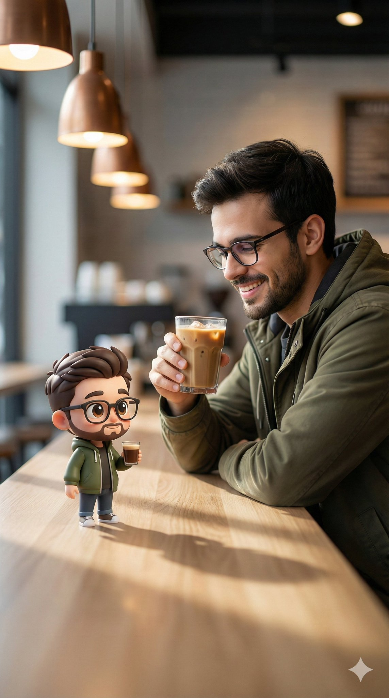
</div>

**提示词：**
```
A young man sitting casually at a modern café counter, smiling while holding a glass of iced coffee. On the table in front of him stands a small 3D chibi character version of the same man. The chibi has super-deformed proportions, a large head, big expressive eyes, and simplified facial features. It has a smooth 3D plastic or clay-like texture, soft studio lighting, and a clear shadow on the table surface. The chibi is holding a tiny glass of coffee. Warm pendant lights, wooden café interior, cinematic realistic human combined with stylized 3D chibi, shallow depth of field, vertical 9:16.
```

**中文提示词：**
```
一位年轻男子随意地坐在现代咖啡馆的吧台边，面带微笑，手里拿着一杯冰咖啡。他面前的桌子上摆放着一个与他本人相似的3D Q版人物模型。这个Q版人物模型比例夸张，头部较大，眼睛炯炯有神，面部特征较为简化。它拥有光滑的3D塑料或黏土质感，柔和的摄影棚灯光照射在桌面上，投射出清晰的阴影。Q版人物模型手中拿着一小杯咖啡。画面中，温暖的吊灯、木质的咖啡馆内饰、写实的人物造型与风格化的3D Q版人物模型相结合，运用了浅景深，采用9:16的竖幅构图。
```

<a id="prompt-940"></a>
## 案例 940：钢铁侠可口可乐 (来源 [@YaseenK7212](https://x.com/YaseenK7212/status/2002013476370444766)) 模型：Nano banana pro

<div style="display: flex; justify-content: space-between;">
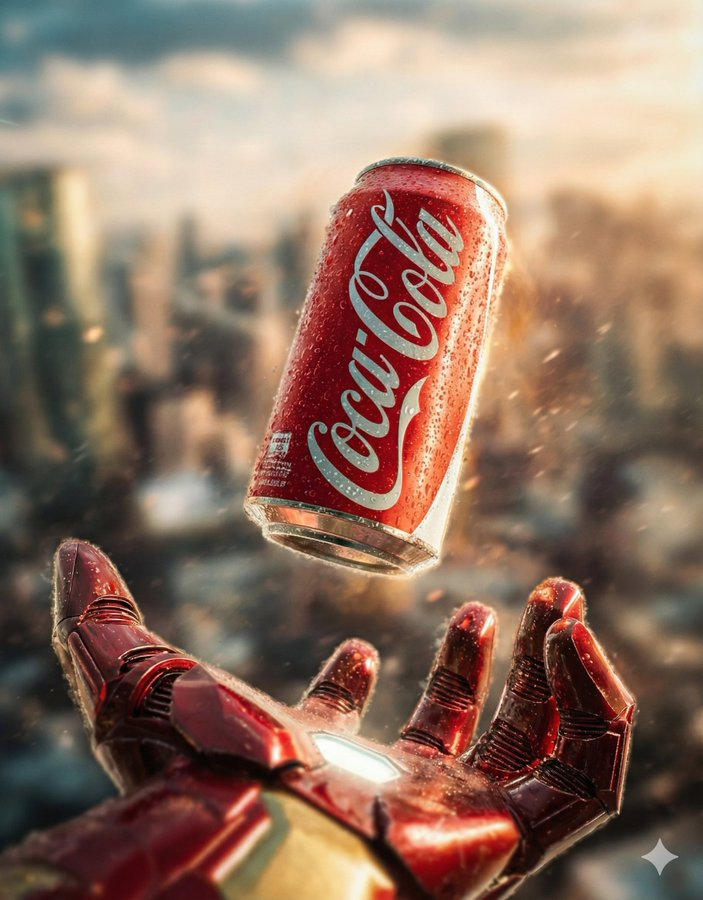
</div>

**提示词：**
```
[
{
"concept_id": "iron_man_coke",
"visual_breakdown": {
"focus_object": "Coca-Cola Can",
"character_element": "Iron Man's Gauntlet",
"environment": "Blurred City Skyline"
},
"artistic_direction": {
"lighting": "Cinematic/Metallic",
"mood": "technological"
},
"generation_command": {
"aspect_ratio": "7:9",
"concise_prompt": "Iron Man's gauntlet hovering below a floating Coca-Cola can, cinematic city background, dramatic movie poster lighting. --ar 7:9"
}
},
{
"concept_id": "hulk_pepsi",
"visual_breakdown": {
"focus_object": "Crushed Pepsi Can",
"character_element": "Hulk's Giant Hand",
"environment": "Smoky City Ruins"
},
"artistic_direction": {
"lighting": "Explosive/High Contrast",
"mood": "destructive"
},
"generation_command": {
"aspect_ratio": "7:9",
"concise_prompt": "Hulk's giant hand hovering over a crushed Pepsi can embedded in pavement, smoky ruins, explosive action movie style. --ar 7:9"
}
},
{
"concept_id": "thor_sprite",
"visual_breakdown": {
"focus_object": "Sprite Bottle",
"character_element": "Thor's Glowing Hand",
"environment": "Storm/Lightning"
},
"artistic_direction": {
"lighting": "Electric/Blue-Toned",
"mood": "mythological"
},
"generation_command": {
"aspect_ratio": "7:9",
"concise_prompt": "Thor's glowing hand holding a floating Sprite bottle amidst crackling lightning and rain, Mjolnir in background, epic poster style. --ar 7:9"
}
},
{
"concept_id": "dr_strange_fanta",
"visual_breakdown": {
"focus_object": "Fanta Bottle",
"character_element": "Doctor Strange's Hand",
"environment": "Golden Magic Portal"
},
"artistic_direction": {
"lighting": "Magical/Golden Bokeh",
"mood": "mystical"
},
"generation_command": {
"aspect_ratio": "7:9",
"concise_prompt": "Doctor Strange casting a spell under a spinning Fanta bottle inside a golden magic portal, mystical Sanctum background, cinematic lighting. --ar 7:9"
}
}
]
```

**中文提示词：**
```
[{"概念编号": "钢铁侠_可口可乐","视觉分解": {"核心物体": "可口可乐罐","角色元素": "钢铁侠的护手","环境场景": "模糊的城市天际线"},"艺术指导": {"光影风格": "电影质感 / 金属质感","氛围基调": "科技感"},"生成指令": {"画面比例": "7:9","简洁提示词": "钢铁侠的护手悬浮于漂浮的可口可乐罐下方，电影感城市背景，戏剧化电影海报光影效果。--ar 7:9"}},{"概念编号": "绿巨人_百事可乐","视觉分解": {"核心物体": "变形的百事可乐罐","角色元素": "绿巨人的巨手","环境场景": "烟雾弥漫的城市废墟"},"艺术指导": {"光影风格": "爆炸冲击感 / 高对比度","氛围基调": "破坏性"},"生成指令": {"画面比例": "7:9","简洁提示词": "绿巨人的巨手悬浮于嵌在路面中的变形百事可乐罐上方，烟雾废墟背景，爆炸风格动作片质感。--ar 7:9"}},{"概念编号": "雷神_雪碧","视觉分解": {"核心物体": "雪碧瓶","角色元素": "雷神的发光手掌","环境场景": "暴风雨 / 闪电"},"艺术指导": {"光影风格": "电光感 / 蓝色调","氛围基调": "神话感"},"生成指令": {"画面比例": "7:9","简洁提示词": "雷神的发光手掌托着漂浮的雪碧瓶，周围电闪雷鸣、大雨倾盆，雷神之锤置于背景，史诗级海报风格。--ar 7:9"}},{"概念编号": "奇异博士_芬达","视觉分解": {"核心物体": "芬达瓶","角色元素": "奇异博士的手掌","环境场景": "金色魔法传送门"},"艺术指导": {"光影风格": "魔法质感 / 金色散景","氛围基调": "神秘感"},"生成指令": {"画面比例": "7:9","简洁提示词": "奇异博士在金色魔法传送门内，于旋转的芬达瓶下方施法，背景为神秘的圣所场景，电影质感光影效果。--ar 7:9"}}]
```

<a id="prompt-939"></a>
## 案例 939：概念艺术杂志的编辑照片 (来源 [@AmirMushich](https://x.com/AmirMushich/status/2002029348132721016)) 模型：Nano banana pro

<div style="display: flex; justify-content: space-between;">
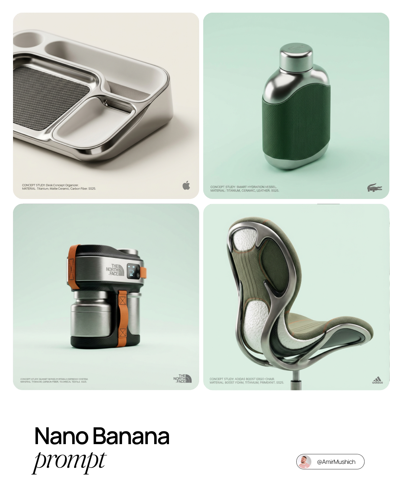
</div>

**提示词：**
```
[BRAND NAME]:
A high-end, glossy concept art magazine editorial photograph of a unique, unexpected functional object conceptualized and designed by the brand.

**1. The Concept & Object (AI Invention):**
Based on the design philosophy, heritage, and material vocabulary of the specified brand, the AI must invent a novel utility product (NOT standard clothing, shoes, or bags). Examples could be home goods, tech accessories, tools, or sporting equipment, reinterpretated through the brand's lens. The object should feel sculptural yet functional.

**2. Materials & Details (Hyper-Premium):**
The object is constructed from ultra-premium, highly tactile materials characteristic of the brand (e.g., patinated exotic leathers, brushed aerospace-grade titanium, sculpted matte ceramics, molded carbon fiber, or technical high-fashion textiles). Every detail is hyper-realistic: visible stitching, microscopic material grain, precision engravings, and complex texture contrasts.

**3. Photography & Lighting (Cinematic Studio):**
Shot on a medium format Phase One camera with a 100mm macro lens. Extremely shallow depth of field, with sharp focus on the hero details of the object and a creamy, smooth bokeh background. The lighting is sophisticated studio softbox lighting: gentle, enveloping fill light with precise rim lighting to accentuate contours and material textures.

**4. Environment:**
A seamless, impeccably clean studio cyclorama background in a pure, ultra-light pastel tone (e.g., desaturated mint, pale blush, or off-white), free of shadows.

**5. Layout & UI Elements (Strict Placement):**
- **Bottom Right Corner:** A small, understated, monochrome gray logo of the brand.
- **Bottom Left Corner:** Small, minimalist monochrome gray text describing the invented product. The font style looks like Manrope Regular with very tight tracking (kerning) and balanced line spacing. Example format: "CONCEPT STUDY: [AI inserts invented product name]. MATERIAL: [AI inserts main materials]. SS25."
```

**中文提示词：**
```
[品牌名称]:
这是一张高端、光鲜亮丽的概念艺术杂志的编辑照片，展示了该品牌构思和设计的独特、出人意料的功能性物品。

** 1.概念与对象（人工智能发明） :**
基于指定品牌的设计理念、历史传承和材料语汇，人工智能必须创造一款新颖的实用产品（并非标准服装、鞋履或包袋）。产品示例可以是家居用品、科技配件、工具或运动器材，并以品牌视角进行重新诠释。该产品应兼具雕塑感和实用功能。

** 2. 材料与细节（超高端） :**
这款产品采用品牌标志性的超高端、触感极佳的材质打造而成（例如，做旧珍稀皮革、拉丝航空级钛金属、雕塑哑光陶瓷、模压碳纤维或高科技时尚面料）。每个细节都力求逼真：清晰可见的缝线、微观材质纹理、精准的雕刻以及复杂的质感对比。

** 3.摄影与灯光（电影工作室） :**
使用Phase One中画幅相机和100mm微距镜头拍摄。景深极浅，主体细节清晰锐利，背景则呈现柔和细腻的散景效果。灯光采用专业的影棚柔光箱：柔和的环绕式补光，辅以精准的轮廓光，凸显物体的轮廓和材质纹理。

** 4. 环境:**
一个无缝、无可挑剔的干净的摄影棚环形背景，采用纯净、超浅的粉彩色调（例如，褪色的薄荷绿、淡腮红或灰白色），没有阴影。

** 5. 布局和 UI 元素（严格放置） :**
- **右下角:**品牌的小巧、低调、单色灰色标志。
- **左下角:**描述发明产品的简洁单色灰色小字。字体样式类似Manrope Regular，字距非常紧凑（字距调整），行距均衡。示例格式：“概念研究：[AI插入发明产品名称]。材料：[AI插入主要材料]。2025春夏。”
```

<a id="prompt-938"></a>
## 案例 938：女性正从她的手机屏幕中走出来 (来源 [@underwoodxie96](https://x.com/underwoodxie96/status/2002293540299420050)) 模型：Nano banana pro

<div style="display: flex; justify-content: space-between;">
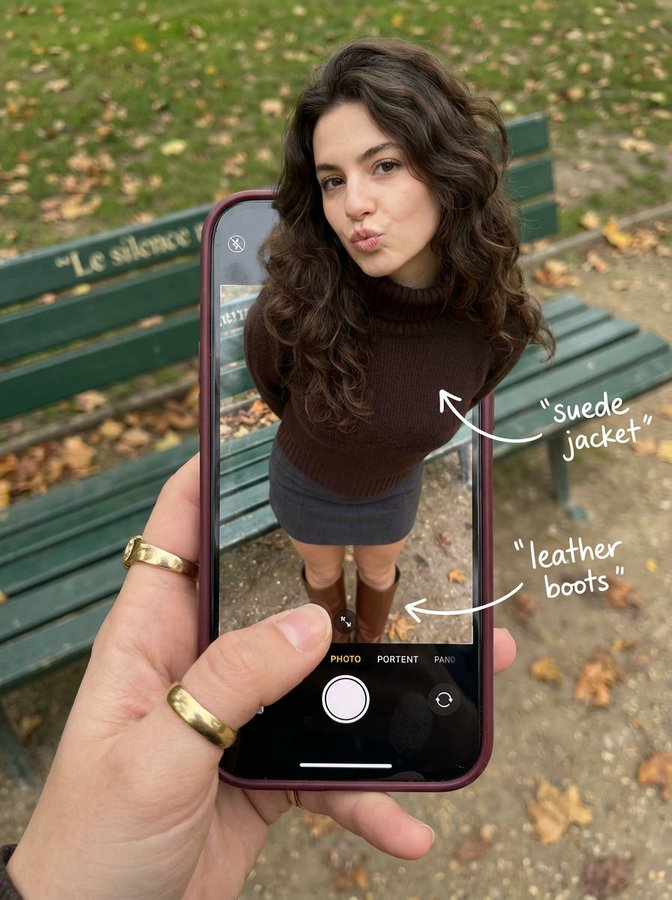
</div>

**提示词：**
```
{

"subject": {

"description": "A hyper-realistic optical illusion photograph. A young Caucasian woman appears to be stepping out of a smartphone screen held in a hand. The screen displays the camera interface, capturing her boots, while her real upper body extends out of the phone into reality.",

"mirror_rules": "Ensure the phone screen clearly shows the iOS Camera UI (shutter button, mode text). Handwritten annotations must be legible and not mirrored.",

"age": "20s",

"expression": {

"eyes": {

"look": "Alluring and playful",

"energy": "Confident, direct",

"direction": "Looking at the viewer"

},

"mouth": {

"position": "Blowing a kiss or pouting",

"energy": "Chic and charming"

},

"overall": "Lifelike, engaging interaction"

},

"face": {

"preserve_original": "false",

"makeup": "Natural glam, matte foundation, defined European features",

"features": "High nose bridge, double eyelids, defined jawline"

},

"hair": {

"color": "Dark brown",

"style": "Long, loose waves, voluminous",

"effect": "Realistic shine, wind-blown effect"

},

"body": {

"frame": "Petite but proportionally realistic",

"waist": "Defined",

"chest": "Covered by turtleneck",

"legs": "Visible INSIDE the phone screen interface wearing boots",

"skin": {

"visible_areas": "Face, hands",

"tone": "Fair Caucasian skin",

"texture": "Ultra-realistic skin texture, visible pores, natural imperfections",

"lighting_effect": "Soft daylight"

}

},

"pose": {

"position": "Torso and head emerging vertically from the phone, legs displayed on the screen",

"base": "Dynamic standing pose",

"overall": "充满活力的随机姿势，让人感觉生命力满满"

},

"clothing": {

"top": {

"effect": "精致的穿搭，High-quality textile photography"

},

"bottom": {

"type": "Mini Skirt and Leather Boots",

"color": "Dark Grey (skirt), Brown (boots)",

"details": "Boots visible on the screen beneath the UI elements"

}

}

},

"accessories": {

"jewelry": "Gold rings on the photographer's hand (foreground)",

"device": "Smartphone with burgundy case. The screen is ACTIVE and DETAILED: it displays the IOS Camera App Interface (white circular shutter button at bottom, 'PHOTO' text).",

"prop": "On the phone screen: White handwritten-style text overlays with arrows pointing to the outfit elements (e.g., text 'suede jacket' with arrow, 'leather boots' with arrow)."

},

"photography": {

"camera_style": "DSLR photography, Macro lens for phone details",

"angle": "POV, High angle looking down at hand",

"shot_type": "Composite photography",

"aspect_ratio": "3:4",

"texture": "Sharp screen pixels, fingerprint smudges on screen, realistic fabric texture",

"lighting": "Overcast soft natural light",

"depth_of_field": "Background bench blurred (Bokeh), Phone screen UI and subject sharp"

},

"background": {

"setting": "Parisian Park in Autumn",

"wall_color": "Green bench, grey ground",

"elements": [

"Green park bench with text 'Le silence'",

"Autumn leaves"

],

"atmosphere": "Cinematic, realistic",

"lighting": "Natural ambient light"

},

"the_vibe": {

"energy": "Sophisticated, viral social media content",

"mood": "Fashion forward",

"aesthetic": "OOTD breakdown, creative edit",

"authenticity": "Photorealistic texture, not CGI",

"intimacy": "POV",

"story": "Fashion styling breakdown",

"caption_energy": "Styling brown suede & leather"

},

"constraints": {

"must_keep": [

"Caucasian ethnicity",

"Photorealistic skin",

"Camera UI elements on screen (shutter button)",

"Handwritten text annotations on screen",

"Pop-out effect"

],

"avoid": [

"Transparent phone screen",

"Blank screen",

"3D render style",

"Cartoon",

"Plastic skin"

]

},

"negative_prompt": [

"transparent screen",

"blank screen",

"glass phone",

"3d",

"render",

"cartoon",

"anime",

"plastic",

"drawing",

"illustration"

]

}
```

**中文提示词：**
```
{

“主题”： {

描述：一张超逼真的光学错觉照片。一位年轻的白人女性仿佛正从她手中的智能手机屏幕中走出来。屏幕显示的是相机界面，拍下了她的靴子，而她真实的上半身则从手机屏幕中延伸到现实世界。

“mirror_rules”：确保手机屏幕清晰显示 iOS 相机界面（快门按钮、模式文本）。手写注释必须清晰可辨，且不能镜像翻转。

年龄：20多岁，

“表达”： {

"眼睛": {

“外观”：“迷人而俏皮”，

“能量”：“自信、直接”

“方向”：“看着观众”

},

“嘴”： {

“姿势”：“飞吻或撅嘴”，

“能量”：“时尚迷人”

},

“总体而言”：“栩栩如生、引人入胜的互动”

},

“脸”： {

"preserve_original": "false",

“妆容”：“自然光泽，哑光粉底，凸显欧洲五官”，

特征：高鼻梁、双眼皮、轮廓分明的下颌线

},

“头发”： {

“颜色”：“深棕色”，

“发型”：“长而蓬松的波浪卷发”，

“效果”： “逼真的光泽，风吹效果”

},

“身体”： {

“画框”：“小巧但比例逼真”，

“腰部”：“线条分明”，

“胸部”： “被高领毛衣遮盖”

“腿”：“在手机屏幕界面内部可以看到穿着靴子的腿”，

“皮肤”： {

"visible_areas": "脸部、手部",

“肤色”: “白皙的白种人肤色”

“质感”：“超逼真的肌肤质感，可见毛孔，自然瑕疵”，

"lighting_effect": "柔和的日光"

}

},

"姿势": {

“位置”：“躯干和头部从手机中垂直伸出，腿部显示在屏幕上”，

"基础": "动态站姿",

"overall": "充满活力的随机姿势，让人感觉生命力饱满"

},

“衣服”： {

“顶部”： {

"effect": "精致的穿搭，高品质的纺织摄影"

},

“底部”： {

“类型”：“迷你裙和皮靴”，

颜色：深灰色（裙子），棕色（靴子）

“详情”：“屏幕上用户界面元素下方可见的靴子”

}

}

},

“配件”： {

“珠宝”：“摄影师手上（前景）的金戒指”，

“设备”：“智能手机，酒红色手机壳。屏幕已激活且显示清晰：显示 iOS 相机应用程序界面（底部有白色圆形快门按钮，显示‘照片’字样）。”

“道具”：“手机屏幕上：白色手写体文字叠加层，箭头指向服装元素（例如，文字‘麂皮夹克’带箭头，‘皮靴’带箭头）。”

},

“摄影”： {

“camera_style”: “单反摄影，手机微距镜头，用于拍摄细节照片”

“角度”：“POV，高角度向下看手”，

"shot_type": "合成摄影",

"aspect_ratio": "3:4",

“纹理”：“清晰的屏幕像素，屏幕上的指纹污渍，逼真的织物纹理”，

“光线”：“阴天柔和的自然光”，

景深：背景虚化（散景），手机屏幕界面和主体清晰

},

“背景”： {

“场景”：“秋天的巴黎公园”，

"wall_color": "绿色长椅，灰色地面",

“元素”：[

“绿色公园长椅上写着‘寂静’”

秋叶

],

“氛围”：“电影般的，逼真的”，

“照明”：“自然环境光”

},

"氛围": {

“能量”：“复杂、病毒式传播的社交媒体内容”，

“氛围”：“时尚前卫”，

“美学”：“OOTD分解，创意剪辑”

“真实性”：“照片级真实纹理，而非 CGI”。

“亲密感”: “POV”

“故事”：“时尚造型解析”

“caption_energy”： “棕色绒面革和皮革的时尚造型”

},

"约束": {

"must_keep": [

“高加索人种”

“逼真的皮肤”，

“屏幕上的相机用户界面元素（快门按钮）”

“屏幕上的手写文字注释”

“弹出效果”

],

“避免”： [

“透明手机屏幕”，

“空白屏幕”，

“3D渲染风格”，

“卡通片”，

“塑料皮肤”

]

},

"negative_prompt": [

“透明屏幕”，

“空白屏幕”，

“玻璃手机”，

“3d，”

“使成为”，

“卡通片”，

“日本动画片”，

“塑料”，

“绘画”，

“插图”

]

}
```

<a id="prompt-937"></a>
## 案例 937：电影感十足的肖像摄影作品 (来源 [@ChillaiKalan__](https://x.com/ChillaiKalan__/status/2002572543992213748)) 模型：Nano banana pro

<div style="display: flex; justify-content: space-between;">
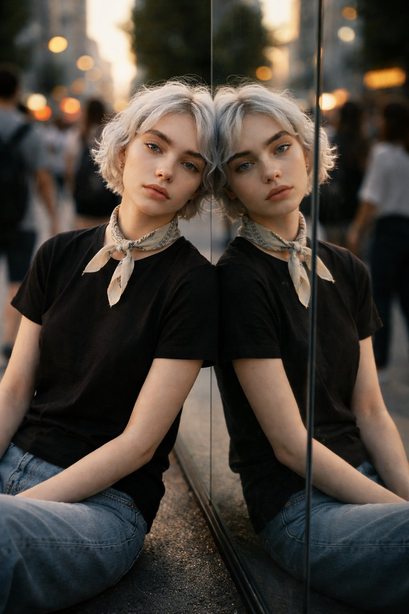
</div>

**提示词：**
```
cinematic portrait photography of a young woman sitting in a field at golden hour, soft natural light, silver-blonde short hair, minimal fashion with a black t-shirt and light bandana, fine art portrait style. emotional realism with calm expression, modern editorial mood, subject leaning against a mirror creating symmetrical reflection, high fashion editorial look, moody color grading, shallow depth of field, subject-isolation technique, viral visual composition, cinematic framing, contemporary visual storytelling. subtle texture in background, clean tones, artistic photography, urban stillness aesthetic blended with nature, soft contrast and gentle highlights.
```

**中文提示词：**
```
电影感十足的肖像摄影作品，一位年轻女子坐在田野中，沐浴在柔和的自然光下，一头银金色短发，身着黑色T恤和浅色头巾，简约时尚，展现出精致的艺术肖像风格。她神态平静，情感真挚，散发出现代时尚气息。她倚靠在镜子前，镜中映出对称的影像，营造出高级时尚大片的视觉效果。照片采用情绪化的色彩分级、浅景深和主体分离技巧，构图极具冲击力，画面充满电影感，以当代视觉叙事手法呈现。背景纹理细腻，色调干净，展现出艺术摄影的魅力，将都市的静谧与自然的和谐融合，对比柔和，高光轻柔。
```

<a id="prompt-936"></a>
## 案例 936：卡通画变成 Funko Pop 乙烯基人偶 (来源 [@michaelrabone](https://x.com/michaelrabone/status/2002710702352421371)) 模型：Nano banana pro

<div style="display: flex; justify-content: space-between;">
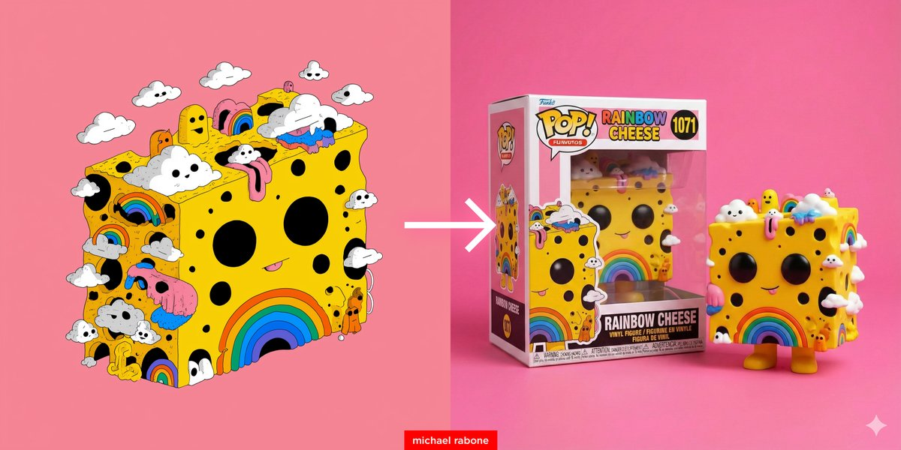
</div>

**提示词：**
```
Transform this cartoon to a Funko Pop vinyl figure. Place the Funko Pop box beside the vinyl figure (side by side) with the name 'Rainbow Cheese' on box. Place vinyl figure and box on a pink surface and pink background with studio lighting.
```

**中文提示词：**
```
将这幅卡通画变成 Funko Pop 乙烯基人偶。将 Funko Pop 包装盒放在乙烯基人偶旁边（并排摆放），包装盒上写上“Rainbow Cheese”（彩虹奶酪）。将乙烯基人偶和包装盒放在粉色的平面和粉色的背景上，并使用摄影棚灯光照明。
```

<a id="prompt-935"></a>
## 案例 935：Y2K时代的拼贴海报 (来源 [@0xbisc](https://x.com/0xbisc/status/2002664549930172496)) 模型：Nano banana pro

<div style="display: flex; justify-content: space-between;">
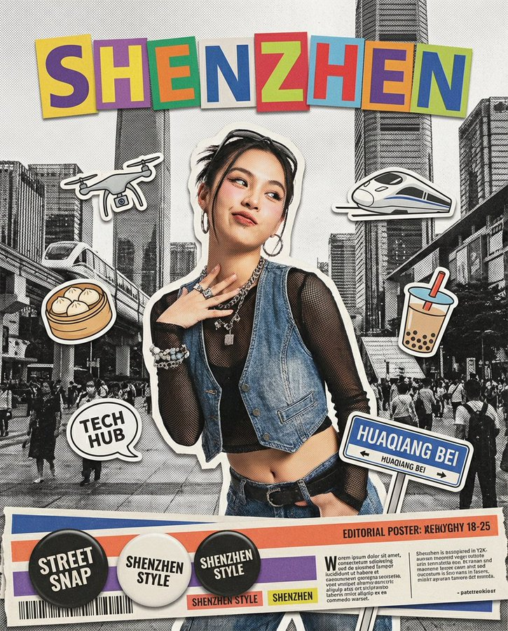
</div>

**提示词：**
```
{

"variables": {

"CITY_NAME": "Chengdu"

},

"image_specs": {

"aspect_ratio": "4:5", "resolution": "2048x2560", "quality": "ultra", "style_strength": 0.8, "detail_level": "high", "sharpen": "medium"

},

"prompt": {

"master_visual_brief": "A high-energy Y2K-inspired editorial collage poster with a strong paper-cut and magazine print aesthetic. The entire image has a tactile paper texture with visible cut edges and layered depth. The theme centers around the city {{CITY_NAME}}. All visual elements, including background imagery, stickers, symbols, typography, and graphic decorations, are culturally and visually inspired by {{CITY_NAME}}. The composition follows a fashion magazine cover logic with dense but controlled information, playful energy, and strong visual hierarchy. The character is designed as a dominant half-body portrait occupying most of the poster.", "photography_and_character": "Character: a randomly generated young woman aged approximately 18–25. She is fashionable, attractive, and trendy, with no fixed hairstyle, hair color, facial features, or makeup. Her appearance varies naturally but always remains stylish and visually appealing. Fashion style is Y2K-inspired street fashion with playful silhouettes, layered styling, and trendy colors. Framing is a strict half-body portrait: the image is cropped at the waist or slightly above, and the lower body is not visible at all. Only the upper torso, shoulders, neck, and head are shown. Pose and gesture: the character performs a randomly selected Y2K-style dynamic pose with strong tension and attitude, including expressive arm extensions, angular elbow bends, asymmetrical shoulder twists, or forward-reaching gestures. Body language remains bold, confident, and energetic. Facial expression: the expression is slightly playful and friendly, with a hint of cuteness layered on top of confidence. Subtle smiles, softly open lips, bright eyes, or a relaxed playful look are allowed, while the overall attitude remains fashion-forward and dynamic rather than cute-only.", "camera_and_lighting": "Editorial portrait framing with a wide-angle look at close distance, optimized for half-body composition. The camera captures only the upper torso and head, with the lower body fully cropped out of frame. Perspective supports dynamic Y2K poses without distorting facial proportions. Lighting is soft, even, and magazine-style, avoiding harsh shadows. The subject is intended to be cut out and integrated into a paper collage rather than rendered as pure realism.", "graphic_design_layout": "Center-focused editorial collage layout. At the top, the city name '{{CITY_NAME}}' appears as the main headline in bold uppercase geometric sans-serif letters. Each letter is placed on an individual colored paper rectangle and arranged in a slight arc. The large half-body character overlaps and partially covers the headline and nearby graphic elements, creating a break-the-frame effect. Surrounding the character are floating paper stickers, speech bubbles, and cut-out graphics inspired by {{CITY_NAME}} culture, including local food, landmarks, symbols, street signs, and iconic objects. The bottom section features a full-width magazine-style collage footer composed of layered paper strips, bold button-style typography, small editorial text blocks, and thumbnail-style graphics.", "background_system": "The background is a black-and-white or desaturated urban street scene from {{CITY_NAME}}, such as crowds, architecture, or city textures. Background contrast is reduced and softened with grain so it supports the composition without competing with the main subject. The background is partially obscured by the large half-body character and collage elements and maintains a printed-paper appearance rather than photographic realism.", "materials_and_textures": "A consistent paper-based aesthetic across the entire image. Visible paper grain, halftone dots, print noise, and slight ink bleed. All elements appear as physical paper cut-outs layered together. Edges are imperfect and tactile. Stickers, typography, and characters cast subtle shadows to suggest layered depth. No glossy, metallic, or digital materials are present.", "composition_and_balance": "Clear and stable visual hierarchy: top city headline '{{CITY_NAME}}', central half-body character (upper torso only), dynamic Y2K-style pose with slightly playful facial expression, surrounding city-themed stickers, and bottom magazine-style collage footer. Strong overlaps between character, typography, and stickers create depth while preserving the established layout."

},

"constraints": {

"must_include": \[ "City name headline using {{CITY_NAME}}", "Strict half-body portrait (waist-up only)", "Lower body completely cropped out", "Y2K-style dynamic pose with strong tension", "Playful but controlled facial expression", "Paper collage and cut-out magazine aesthetic", "City-specific background and stickers related to {{CITY_NAME}}", "Full-width magazine-style collage footer", "Visible paper texture and layered depth" \], "must_avoid": \[ "Full-body view", "Visible legs, knees, thighs, or feet", "Neutral or stiff poses", "Overly cute or childish expressions", "Sexualized expressions or gestures", "Grotesque facial distortion", "Minimalist or empty layouts", "Glossy digital or 3D materials" \]

},

"negative_prompt": "full body, legs visible, knees, thighs, feet, stiff pose, neutral posture, childish expression, exaggerated cute face, sexualized expression, blurry face, deformed hands, extra fingers, bad anatomy, grotesque distortion, minimalist layout, flat image, hyper-realistic photography, glossy surfaces, plastic skin, dull colors, watermark, logo, unreadable text",

"typography_rules": {

"headline": { "text": "{{CITY_NAME}}", "font_style": "bold geometric sans-serif, uppercase", "treatment": "each letter on a separate colored paper rectangle, slightly arched, subtle shadow", "material": "printed paper cut-out" }, "supporting_text": { "style": "editorial magazine blocks, playful sticker captions, speech bubbles", "material": "paper-based printed texture" }

},

"rendering_notes": {

"depth_layers": "background city paper layer -> mid-ground half-body character -> foreground dynamic pose, expressive face, stickers, and typography", "print_feel": "strong magazine print texture with halftone dots, paper grain, and slight ink bleed", "edge_treatment": "clearly visible imperfect cut paper edges"

}

}
```

**中文提示词：**
```
{

"变量": {

城市名称：成都

},

"image_specs": {

"aspect_ratio": "4:5", "resolution": "2048x2560", "quality": "ultra", "style_strength": 0.8, "detail_level": "high", "sharpen": "medium"

},

“提示词”： {

“视觉设计概要”： “这是一张充满活力、灵感源自Y2K时代的拼贴海报，具有强烈的剪纸和杂志印刷美感。整幅图像呈现出触感丰富的纸张纹理，可见的切割边缘和层次感。主题围绕着城市{{ CITY_NAME }}展开。所有视觉元素，包括背景图像、贴纸、符号、字体和图形装饰，都从文化和视觉上汲取灵感，源自城市{{ CITY_NAME }} 。构图遵循时尚杂志封面的逻辑，信息丰富但控制得当，充满活力，并具有清晰的视觉层次。人物被设计成占据海报大部分空间的半身肖像。” “摄影与人物”： “人物：一位随机生成的年轻女性，年龄在18至25岁之间。她时尚、迷人、潮流，没有固定的发型、发色、五官或妆容。她的外貌自然变化，但始终保持时尚和视觉吸引力。时尚风格是受Y2K时代启发的街头时尚。”俏皮的轮廓、层次丰富的造型和潮流的色彩。构图采用严格的半身像：画面裁剪至腰部或略高于腰部，下半身完全不可见。仅展现上半身、肩膀、颈部和头部。姿势和手势：人物摆出随机选择的Y2K风格动态姿势，充满张力和态度，包括富有表现力的手臂伸展、肘部角度弯曲、不对称的肩部扭转或向前伸展的动作。肢体语言大胆、自信且充满活力。面部表情：表情略带俏皮和友好，在自信之上又增添了一丝可爱。允许有淡淡的微笑、微微张开的嘴唇、明亮的眼神或轻松俏皮的表情，整体风格保持时尚前卫和动感，而非仅仅可爱。“相机和灯光”：“采用广角镜头近距离拍摄的编辑人像构图，针对半身像进行了优化。相机仅拍摄上半身和头部，下半身不可见。”人物身体完全裁剪出画面之外。透视效果支持动态的千禧年风格姿势，且不会扭曲面部比例。光线柔和均匀，采用杂志风格，避免了生硬的阴影。人物旨在被剪裁并融入纸质拼贴画中，而非以纯粹的写实手法呈现。平面设计布局：以中心为焦点的编辑拼贴画布局。顶部，城市名称“ {{城市名称}} ”以粗体大写几何无衬线字体作为主标题。每个字母都放置在单独的彩色纸质矩形上，并呈略微弧形排列。较大的半身人物与标题和附近的图形元素重叠并部分覆盖，营造出一种打破画面框架的效果。人物周围环绕着漂浮的纸质贴纸、对话气泡和剪纸图形，其灵感来自{{城市名称}}的文化，包括当地美食、地标、符号、路标和标志性物品。底部部分是一个由多层纸张组成的全宽杂志风格拼贴画页脚。条状文字、醒目的按钮式字体、小型编辑文本块和缩略图式图形。”, “背景系统”: “背景是来自{{城市名称}}的黑白或低饱和度城市街景，例如人群、建筑或城市纹理。背景对比度降低，并添加了颗粒感以柔化画面，从而在不干扰主体的情况下支持构图。背景部分被大型半身人物和拼贴元素遮挡，保持了印刷纸的外观，而非照片的真实感。”, “材质与纹理”: “整个图像保持一致的纸质美学。可见的纸张纹理、半色调网点、印刷噪点和轻微的墨迹晕染。所有元素都像是层叠在一起的实体纸片。边缘不完美且触感明显。贴纸、字体和人物投射出微妙的阴影，暗示出层次感。没有光泽、金属或数字材质。”, “构图与平衡”: “清晰稳定的视觉层次：顶部城市标题“ {{城市名称}} ”，中央半身人物（仅上半身），动态的千禧年风格姿势，略带俏皮的面部表情，周围环绕着城市主题贴纸，底部是杂志风格的拼贴页脚。人物、字体和贴纸之间的强烈重叠在保持既定布局的同时，营造出层次感。

},

"约束": {

"必须包含：" [ "使用城市名称作为标题{{ CITY_NAME }} ", "严格的半身像（仅腰部以上）", "下半身完全裁剪", "Y2K风格的动态姿势，充满张力", "俏皮但克制的表情", "纸质拼贴和剪贴杂志风格", "与城市相关的背景和贴纸{{ CITY_NAME }} ", "全宽杂志风格拼贴页脚", "可见的纸张纹理和层次感" ], "必须避免：" [ "全身照", "可见的腿、膝盖、大腿或脚", "中性或僵硬的姿势", "过于可爱或幼稚的表情", "性化的表情或手势", "怪诞的面部扭曲", "极简主义或空白的布局", "光面数字或3D材质" ]

},

"negative_prompt": "全身，腿部可见，膝盖，大腿，脚，僵硬姿势，中立姿势，幼稚表情，夸张可爱表情，性化表情，模糊面部，畸形手，多余手指，解剖结构错误，怪诞扭曲，极简布局，平面图像，超写实摄影，光滑表面，塑料皮肤，暗淡色彩，水印，标志，无法辨认的文字",

"typography_rules": {

"标题": { "正文": " {{城市名称}} ", "字体": "粗体几何无衬线字体，大写", "处理方式": "每个字母位于单独的彩色纸矩形上，略微拱起，带有微妙的阴影", "材质": "印刷纸剪裁" }, "辅助文本": { "风格": "杂志社论版块，趣味贴纸标题，对话气泡", "材质": "纸质印刷纹理" }

},

"渲染注释": {

"depth_layers": "背景：城市纸张层->中景：半身人物->前景：动态姿势、表情丰富的面部、贴纸和文字。"print_feel": "强烈的杂志印刷纹理，带有半色调网点、纸张纹理和轻微的墨迹晕染。"edge_treatment": "清晰可见的不完美裁切纸张边缘。"

}

}
```

<a id="prompt-934"></a>
## 案例 934：女性自拍照 (来源 [@Ankit_patel211](https://x.com/Ankit_patel211/status/2002377471388442654)) 模型：Nano banana pro

<div style="display: flex; justify-content: space-between;">
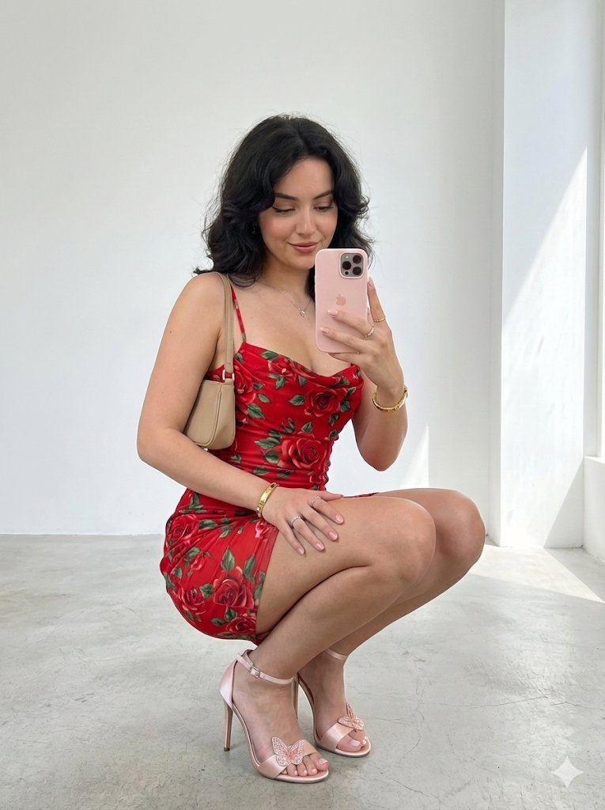
</div>

**提示词：**
```
{
"generative_directive": {
"technical_specifications": {
"format": "Mirror Selfie",
"device": "Smartphone Camera",
"device_model_prop": "iPhone 16 Pro Max",
"lens_type": "Wide-angle lens",
"aspect_ratio": "9:16",
"focal_priority": [
"Body",
"Hands"
]
},
"subject_configuration": {
"demographics": "Woman",
"skin_appearance": "Warm and even tone",
"posture": {
"body_angle": "Slightly angled",
"vibe": "Relaxed, natural feeling",
"right_hand": "Holding phone next to face",
"left_arm": "Hanging naturally near body",
"interaction": "Holding a shoulder bag in left hand"
}
},
"apparel_breakdown": {
"garment_type": "Short Dress",
"color_palette": {
"base": "Cream-white",
"accent_pattern": "Pink roses and green leaves"
},
"design_elements": {
"straps": "Thin straps",
"neckline": "Softly draped",
"silhouette": "Fitted, highlighting waist and hips",
"detailing": "Gentle gathering around abdomen",
"hemline": "Short and slightly wavy"
},
"textile_properties": {
"weight": "Lightweight and fluid",
"elasticity": "Soft elasticity",
"texture": "Subtle natural sheen",
"drape": "Gentle drape"
},
"style_keywords": [
"Romantic",
"Feminine",
"Elegant"
]
},
"styling_details": {
"accessories": {
"jewelry": "Thin gold bracelet",
"bag": "Shoulder bag"
},
"beauty": {
"makeup_style": "Light and natural",
"complexion": "Fresh",
"cheeks": "Soft blush",
"lips": "Natural pink-toned, partially visible"
},
"nails": {
"shape": "Almond-shaped",
"length": "Medium",
"color": "Light nude shade"
}
},
"scene_environment": {
"location_type": "Fairly bright interior",
"background_elements": "Smooth, minimalist white wall",
"lighting_setup": {
"source": "Natural daylight from side window",
"quality": "Soft, diffused",
"highlight_targets": [
"Bright tones",
"Refined textures",
"Gold accessory details"
]
}
},
"critical_constraints": {
"preservation_rule": "Strictly maintain original face, facial features, proportions, skin texture, and expression. No alterations to identity."
}
}
}
```

**中文提示词：**
```
{
"generative_directive": {
"technical_specifications": {
"格式": "镜子自拍",
"设备": "智能手机摄像头",
"device_model_prop": "iPhone 16 Pro Max",
"lens_type": "广角镜头",
"aspect_ratio": "9:16",
"焦点优先级": [
“身体”，
“手”
]
},
"subject_configuration": {
“人口统计信息”：“女性”，
"skin_appearance": "温暖均匀的肤色",
"姿势": {
"body_angle": "略微倾斜",
“氛围”：“轻松、自然的感觉”，
"右手": "将手机举到脸旁",
"左臂": "自然下垂于身体附近",
“互动”：“左手拿着肩包”
}
},
"apparel_breakdown": {
"garment_type": "短裙",
"color_palette": {
“基色”: “乳白色”
"accent_pattern": "粉色玫瑰和绿色叶子"
},
"design_elements": {
“肩带”： “细肩带”
“领口”：“柔软垂坠”，
“轮廓”：“修身，凸显腰部和臀部”，
“细节”：“腹部周围轻柔地收拢”，
裙摆：短款，略微卷曲
},
"textile_properties": {
“重量”： “轻盈流畅”
“弹性”： “柔软弹性”，
“质感”：“柔和自然的光泽”，
"drape": "轻柔的垂坠"
},
"style_keywords": [
“浪漫的”，
“女性化的”，
“优雅的”
]
},
"styling_details": {
“配件”： {
“珠宝”：“细金手镯”，
“包”： “肩包”
},
“美丽”： {
"makeup_style": "清淡自然"
“肤色”： “清新”，
“脸颊”：“淡淡的红晕”，
“嘴唇”： “自然粉色调，部分可见”
},
"指甲": {
“形状”： “杏仁形”
"长度": "中等",
颜色：浅裸色
}
},
"scene_environment": {
"location_type": "室内光线充足",
"background_elements": "光滑、简约的白色墙壁",
"lighting_setup": {
“光源”：“侧窗的自然日光”，
“品质”：“柔和、扩散”，
"highlight_targets": [
“明亮的色调”，
“精致的质感”，
“金色配饰细节”
]
}
},
"critical_constraints": {
"preservation_rule": "严格保持原有的面部特征、比例、皮肤纹理和表情。不得改变身份。"
}
}
}
```

<a id="prompt-933"></a>
## 案例 933：女性在奔跑时腾空而起 (来源 [@underwoodxie96](https://x.com/underwoodxie96/status/2002639331501224005)) 模型：Nano banana pro

<div style="display: flex; justify-content: space-between;">
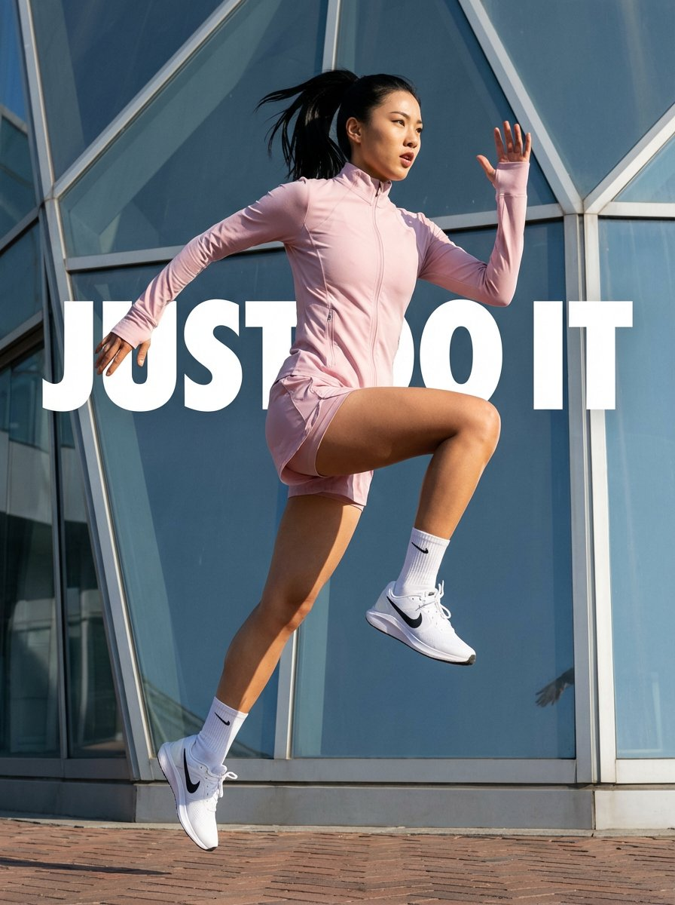
</div>

**提示词：**
```
{
"subject": {
"description": "A fit young Asian woman frozen in mid-air while running, capturing a dynamic athletic moment.",
"mirror_rules": "N/A",
"age": "20s",
"expression": {
"eyes": {
"look": "focused ahead",
"energy": "determined",
"direction": "forward"
},
"mouth": {
"position": "slightly open breathing",
"energy": "concentrated"
},
"overall": "intense focus and athletic determination"
},
"face": {
"preserve_original": true,
"makeup": "natural fresh look"
},
"hair": {
"color": "black",
"style": "high ponytail",
"effect": "flying back dynamically due to motion"
},
"body": {
"frame": "athletic and toned",
"waist": "visible silhouette",
"chest": "covered",
"legs": "muscular definition visible, mid-air stride",
"skin": {
"visible_areas": "legs, face, hands",
"tone": "warm tan",
"texture": "smooth with muscle definition",
"lighting_effect": "high contrast sunlight highlights"
}
},
"pose": {
"position": "mid-air jump",
"base": "levitating",
"overall": "dynamic running stride, one knee raised high, arms swinging"
},
"clothing": {
"top": {
"type": "long-sleeve athletic zip-up jacket",
"color": "pastel pink",
"details": "fitted, sporty seams",
"effect": "stretched with movement"
},
"bottom": {
"type": "athletic shorts",
"color": "pastel pink",
"details": "matching set"
}
}
},
"accessories": {
"headwear": null,
"jewelry": null,
"device": null,
"prop": {
"type": "footwear",
"details": "white sneakers with black swoosh logo, white crew socks"
}
},
"photography": {
"camera_style": "commercial advertising photography",
"angle": "low angle worm's eye view",
"shot_type": "full body side profile",
"aspect_ratio": "3:4",
"texture": "sharp focus, high contrast, commercial print quality",
"lighting": "hard daylight, direct sun, strong shadows",
"depth_of_field": "deep, background visible but geometric"
},
"background": {
"setting": "urban modern exterior",
"wall_color": "blue-grey glass",
"elements": [
"geometric triangular glass facade",
"metallic frames",
"reflection of runner in glass",
"brick pavement at bottom"
],
"typography": {
"text_content": "JUST DO IT",
"font_style": "Massive Bold Sans-Serif (Nike style)",
"color": "White",
"position": "Center of the image",
"integration": "Layered text: placed behind the subject or overlaying the center with slight transparency",
"visual_weight": "Dominant slogan"
},
"atmosphere": "modern, clean, energetic, motivational",
"lighting": "bright natural sunlight"
},
"the_vibe": {
"energy": "explosive power",
"mood": "motivational",
"aesthetic": "urban sportswear commercial",
"authenticity": "high",
"intimacy": "distant observer",
"story": "morning run in the city, pushing limits",
"caption_energy": "Just Do It."
},
"constraints": {
"must_keep": [
"text 'JUST DO IT' clearly visible",
"mid-air suspension",
"pastel pink outfit",
"geometric glass background",
"sharp focus"
],
"avoid": [
"misspelled text",
"text covering the face",
"blur",
"studio background",
"static pose"
]
},
"negative_prompt": [
"typos",
"gibberish text",
"cluttered text",
"motion blur",
"distorted limbs",
"bad anatomy",
"extra legs",
"dull lighting"
]
}
```

**中文提示词：**
```
{
“主题”： {
描述：一位身材健美的年轻亚裔女性在奔跑时腾空而起，定格了她充满活力的运动瞬间。
"mirror_rules": "N/A",
年龄：20多岁，
“表达”： {
"眼睛": {
“看”：“专注于前方”，
“能量”：“坚定的”，
“方向”: “向前”
},
“嘴”： {
“姿势”：“微微张开呼吸”，
“能量”: “集中的”
},
“总体而言”：“高度专注和运动上的决心”
},
“脸”： {
"preserve_original": true,
妆容： “自然清新妆容”
},
“头发”： {
“颜色：黑色”，
“发型”：“高马尾辫”，
“效果”：“由于运动而动态地向后飞”
},
“身体”： {
“体型”： “运动型且线条优美”，
“腰部”: “可见轮廓”，
“胸部”： “覆盖的”，
“腿部”：“肌肉线条清晰可见，腾空迈步”，
“皮肤”： {
"visible_areas": "腿、脸、手",
“色调”：“暖棕色”，
“质地”：“光滑，肌肉线条分明”，
"lighting_effect": "高对比度阳光高光"
}
},
"姿势": {
“位置”：“空中跳跃”，
“基座”：“悬浮”，
“整体”： “动态跑步步伐，单膝高抬，双臂摆动”
},
“衣服”： {
“顶部”： {
“类型”：“长袖运动拉链夹克”，
“颜色”： “淡粉色”，
“细节”：“合身、运动感十足的缝线”，
“效果”：“随着运动而拉伸”
},
“底部”： {
“类型”：“运动短裤”，
“颜色”： “淡粉色”，
“详情”：“配套套装”
}
}
},
“配件”： {
“头饰”：null，
“珠宝”：null，
“设备”：null，
"prop": {
"type": "鞋类",
“细节”：“白色运动鞋，黑色耐克标志，白色船袜”
}
},
“摄影”： {
"camera_style": "商业广告摄影",
“角度”: “低角度虫眼视图”
"shot_type": "全身侧脸轮廓",
"aspect_ratio": "3:4",
“纹理”：“清晰聚焦，高对比度，商业印刷质量”，
“照明”：“强烈的日光、直射阳光、强烈的阴影”，
景深： “深邃，背景可见但呈几何形状”
},
“背景”： {
“环境”: “都市现代外观”，
"wall_color": "蓝灰色玻璃"
“元素”：[
“几何三角形玻璃幕墙”，
“金属框架”，
“跑步者在玻璃中的倒影”
“底部是砖砌路面”
],
"排版": {
"text_content": "JUST DO IT",
"font_style": "Massive Bold Sans-Serif (Nike style)",
颜色：白色，
"位置": "图像中心",
“整合”：“分层文本：放置在主体后面或以略微透明的方式覆盖中心”，
"视觉权重": "主要标语"
},
“氛围”：“现代、干净、充满活力、令人振奋”
“照明”：“明亮的自然阳光”
},
"氛围": {
“能量”：“爆炸力”，
“情绪”：“激励的”，
“美学”: “都市运动服饰广告”
“真实性”： “高”，
“亲密”: “疏离的观察者”，
“故事”：“城市晨跑，挑战极限”
“caption_energy”： “Just Do It.”
},
"约束": {
"must_keep": [
“文字‘JUST DO IT’清晰可见”，
“空中悬架”，
“淡粉色套装”，
“几何玻璃背景”，
“清晰聚焦”
],
“避免”： [
拼写错误的文本
“遮住脸部的文字”，
“模糊”，
“摄影棚背景”，
“静态姿势”
]
},
"negative_prompt": [
错别字，
“乱码文本”，
“杂乱的文本”，
“动态模糊”，
“肢体畸形”，
“糟糕的解剖学”
“额外的腿”，
“昏暗的灯光”
]
}
```

<a id="prompt-932"></a>
## 案例 932：电影般的时尚网格图 (来源 [@AIwithkhan](https://x.com/AIwithkhan/status/2002567761151864933)) 模型：Nano banana pro

<div style="display: flex; justify-content: space-between;">

</div>

**提示词：**
```
A cinematic fashion grid showing the uploaded photo styled in different outfits: casual, formal, ethnic, streetwear, luxury, sporty. Same face, same pose, neutral background, editorial fashion layout.
Consistent facial features and proportions across all looks, with only clothing, styling, and accessories changing.
Soft professional studio lighting with balanced shadows for a high-end magazine feel.
Ultra-realistic fabric textures, refined color grading, sharp details, modern fashion editorial aesthetic.
```

**中文提示词：**
```
一个电影般的时尚网格图，展示了上传的照片搭配不同服装的效果：休闲、正式、民族风、街头风、奢华风、运动风。同一张脸，同样的姿势，中性背景，时尚大片式的排版。
所有造型都保持一致的面部特征和比例，只有服装、造型和配饰会发生变化。
柔和的专业影棚灯光，搭配均衡的阴影，营造出高端杂志般的质感。
超逼真的面料纹理、精细的色彩分级、清晰的细节、现代时尚大片美学。
```

<a id="prompt-931"></a>
## 案例 931：年轻女性的韩式时尚特写肖像 (来源 [@iamsofiaijaz](https://x.com/iamsofiaijaz/status/2002410368476627268)) 模型：Nano banana pro

<div style="display: flex; justify-content: space-between;">
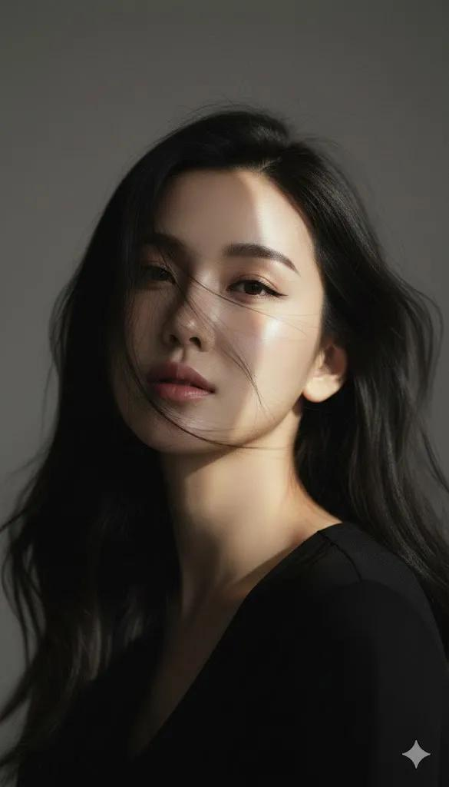
</div>

**提示词：**
```
"subject": {
"description": "A Korean-editorial close-up portrait of a young woman use attached photo with porcelain-white skin, captured in a fleeting instant as wind lifts her black hair mid-motion. A single narrow hard light beam strikes her face from a 45-degree diagonal angle, illuminating only the facial planes while everything else falls into deep shadow. A very faint prism/refraction rainbow appears subtly within the lit area, creating a cool, sharp, effortless swagger.", "mirror_rules": null, "age": "early 20s", "expression": { "eyes": { "look": "steady, unbothered", "energy": "cool confidence, detached", "direction": "toward the camera with a slight side gaze" }, "mouth": { "position": "slightly parted", "energy": "controlled, unapologetic" }, "overall": "cool, restrained, sharp swagger" }, "face": { "preserve_original": true, "makeup": "K-beauty clean matte look: softly structured brows, minimal eyeliner, low-saturation lips, porcelain skin with
}
```

**中文提示词：**
```
"主体"：{"描述"："参照所附照片，拍摄一位拥有瓷白肌肤的年轻女性的韩式时尚特写肖像，定格于微风拂起她黑发的动态瞬间。一道纤细的硬光光束从 45 度斜角打在她的脸上，仅照亮面部轮廓，其余所有区域均隐没于深邃阴影之中。在受光区域内，隐约浮现一道极淡的棱镜折射彩虹光斑，营造出清冷、利落且浑然天成的飒爽气场。"，"镜像规则"：无，"年龄"："二十岁出头"，"神态表情"：{"眼部"：{"眼神"："沉稳淡然"，"气质"："冷峻自信，疏离淡漠"，"视线方向"："直视镜头，略带侧视角度"},"唇部"：{"状态"："微张"，"气质"："克制沉稳，坦荡无畏"},"整体神态"："清冷克制，利落飒爽"},"面部"：{"保留原图特征"：是，"妆容"：" 韩式清透哑光妆效：眉形自然立体，眼线极简，唇色低饱和度，瓷白肌肤质感}
```

<a id="prompt-930"></a>
## 案例 930：90年代复古黑白肖像照 (来源 [@SimplyAnnisa](https://x.com/SimplyAnnisa/status/2002582470567604295)) 模型：Nano banana pro

<div style="display: flex; justify-content: space-between;">
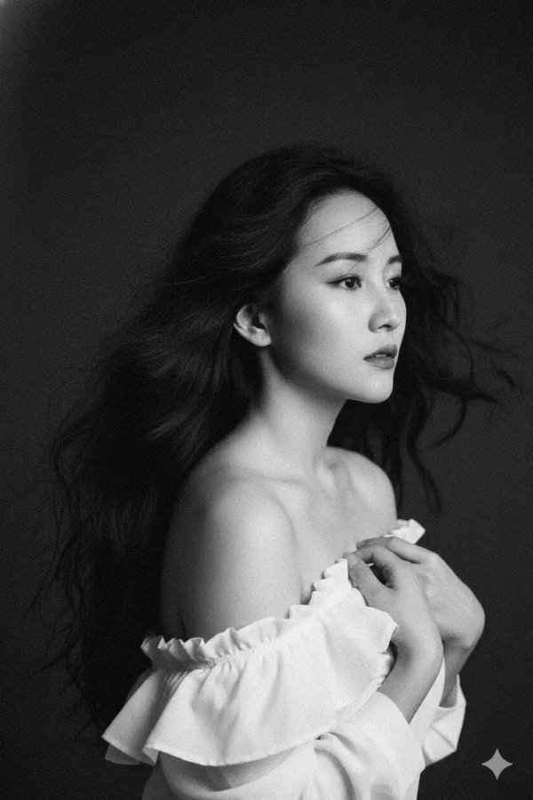
</div>

**提示词：**
```
Create and don't change her face.
A highly artistic 90s vintage black and white (monochrome) portrait. It features a beautiful woman with classic facial features and long, voluminous, wavy, wind-blown black hair. She gazes off to the side with a pensive, poetic look. The woman holds a piece of ruffled white fabric or clothing against her chest, her shoulders wide open (off-shoulder). The plain, dark background provides a sharp contrast to her skin and white clothing. The image texture has a very pronounced film grain, a 35mm film aesthetic, and soft lighting that accentuates the cheekbones and hair texture. Masterpiece quality, 8k, emotional, and cinematic.
```

**中文提示词：**
```
保持她的容貌，不要改变她的容貌。
这是一张极具艺术气息的90年代复古黑白肖像照。照片中的女子容貌姣好，五官经典，一头乌黑亮丽的长发随风飘扬，蓬松而富有波浪。她侧目凝视，眼神中流露出沉思和诗意。女子胸前披着一块白色褶皱布料或衣物，双肩敞开（露肩）。简洁的深色背景与她白皙的肌肤和洁白的衣衫形成鲜明对比。照片质感细腻，带有明显的胶片颗粒感，呈现出35毫米胶片的复古美感，柔和的光线突显了她的颧骨和发丝纹理。8K高清画质，情感饱满，极具电影质感，堪称艺术杰作。
```

<a id="prompt-929"></a>
## 案例 929：女子面部的超近距离微距肖像 (来源 [@Vivekhy](https://x.com/Vivekhy/status/2002080283873714488)) 模型：Nano banana pro

<div style="display: flex; justify-content: space-between;">
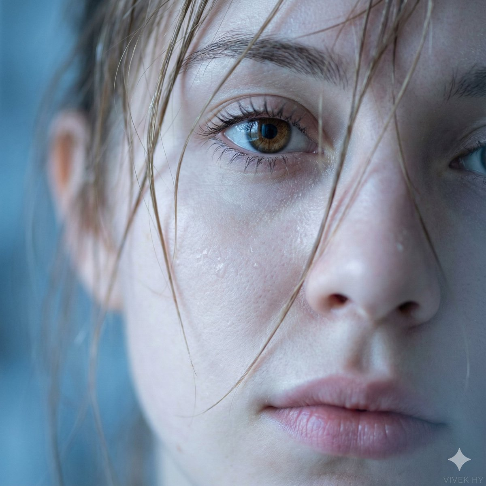
</div>

**提示词：**
```
{
"prompt_description": {
"subject": "Extreme close-up macro portrait of a young woman's face, partial view focusing on one eye, nose, and lips",
"skin_texture": "Hyper-realistic skin details, visible pores, dewy and fresh complexion, soft porcelain skin tone",
"eyes": "Sharp brown iris with highly detailed eyelashes, clear catchlight reflection, intense and soft gaze",
"hair": "Wet, messy strands of light brown hair falling naturally across the face and eye",
"lips": "Soft natural pink lips, subtle texture, slightly parted"
},
"artistic_style": {
"lighting": "Soft diffused cool lighting, cinematic blue tones, ambient soft shadows",
"aesthetic": "Photorealistic, Cinematic, Masterpiece, Raw photo quality, 8k resolution"
},
"camera_settings": {
"lens": "85mm",
"shot_type": "Macro / Extreme Close-up",
"aperture": "f/1.8 (shallow depth of field)",
"focus": "Sharp focus on the eye"
},
"output_parameters": {
"aspect_ratio": "1:1 (Square)",
"signature": "VIVEK HY",
"signature_location": "Bottom right corner"
}
}
```

**中文提示词：**
```
{
"prompt_description": {
“主题”：“年轻女子面部的超近距离微距肖像，局部视角，聚焦于一只眼睛、鼻子和嘴唇”，
"skin_texture": "超逼真的皮肤细节，可见的毛孔，水润清新的肤色，柔和的瓷白肤色",
“眼睛”：“锐利的棕色虹膜，睫毛细节丰富，眼神明亮，目光深邃而柔和”，
“头发”：“湿漉漉的、凌乱的浅棕色头发自然地垂落在脸颊和眼睛上”，
“嘴唇”： “柔软自然的粉红色嘴唇，质地细腻，微微张开”
},
"artistic_style": {
“照明”：“柔和的漫射冷光，电影般的蓝色调，柔和的环境阴影”，
“美学”： “照片级真实感、电影级、杰作级、原始照片质量、8K分辨率”
},
"camera_settings": {
镜头：85mm，
"shot_type": "微距/超近景",
“光圈”: “f/1. 8 (浅景深)”，
“聚焦”： “清晰聚焦于眼睛”
},
"output_parameters": {
"aspect_ratio": "1:1 (正方形)",
签名：VIVEK HY，
"签名位置": "右下角"
}
}
```

<a id="prompt-928"></a>
## 案例 928：女士手持一个自己的木质相框 (来源 [@AIwithSynthia](https://x.com/AIwithSynthia/status/2002578332496638452)) 模型：Nano banana pro

<div style="display: flex; justify-content: space-between;">
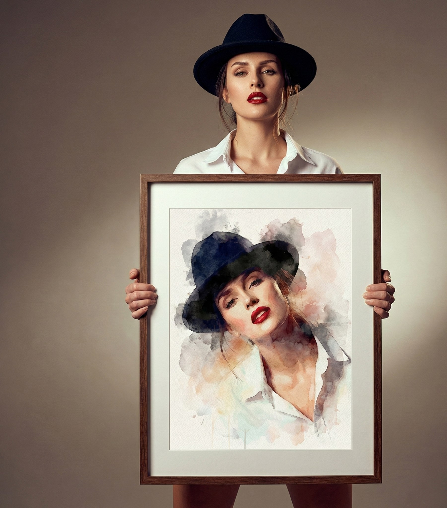
</div>

**提示词：**
```
A stylish woman wearing a black fedora and white shirt stands against a soft neutral studio background, holding a wooden frame. Inside the frame is a photo watercolor portrait of herself, painted with loose brushstrokes, soft ink bleeds, and expressive splashes. The watercolor version tilts slightly, with vivid red lips and delicate facial details. Google Gemini Cinematic studio lighting, shallow depth of field, elegant editorial fashion aesthetic, fine art photography blended with watercolor illustration, ultra-high resolution, minimal composition, calm and sophisticated mood.
```

**中文提示词：**
```
一位身着黑色软呢帽和白色衬衫的时尚女士，站在柔和的中性色调摄影棚背景前，手持一个木质相框。相框内是一幅她本人的水彩肖像照片，笔触自由流畅，墨迹晕染自然，色彩泼洒灵动。水彩画略微倾斜，鲜艳的红唇和精致的面部细节跃然纸上。照片采用谷歌Gemini影棚灯光，浅景深，展现出优雅的时尚美学，将艺术摄影与水彩插画巧妙融合，超高分辨率，极简构图，营造出平静而精致的氛围。
```

<a id="prompt-927"></a>
## 案例 927：女性站在KAWS风格艺术雕塑旁 (来源 [@xmiiru_](https://x.com/xmiiru_/status/2002578056628601143)) 模型：Grok

<div style="display: flex; justify-content: space-between;">
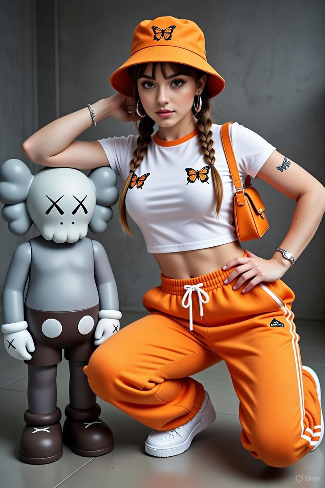
</div>

**提示词：**
```
{
"prompt": "Ultra realistic fashion editorial photography of a stylish young woman posing next to a gray KAWS-style art figure, One knee on the floor, one leg bent forward, body slightly angled, one arm resting casually on the statue’s head, the other hand on hip. Confident fierce expression, sharp gaze toward camera. Wearing a vibrant orange bucket hat with butterfly emblem, white fitted crop t-shirt with orange butterfly graphics, bright orange track pants with white piping, white sneakers Small orange shoulder bag, subtle tattoos visible, braided hair accents, minimal jewelry. Monochrome orange streetwear aesthetic. Minimalist indoor space with gray walls and clean floor. Soft diffused studio lighting, realistic skin texture, sharp focus, high fashion streetwear vibe, professional photography, ultra-detailed, 8K resolution. Don't change original face",
"negative_prompt": "low quality, blur, bad anatomy, extra fingers, extra limbs, distorted pose, cartoon, anime, illustration",
"parameters": {
"aspect_ratio": "2:3",
"version": "6",
"style": "raw",
"quality": 2
}
}
```

**中文提示词：**
```
{
“提示”：“超写实时尚大片，一位时髦的年轻女性站在一个灰色的KAWS风格艺术雕塑旁，单膝跪地，一条腿向前弯曲，身体略微倾斜，一只手臂随意地搭在雕塑的头部，另一只手叉腰。她表情自信而犀利，目光直视镜头。她戴着一顶饰有蝴蝶图案的亮橙色渔夫帽，一件印有橙色蝴蝶图案的白色修身露脐T恤，一条饰有白色滚边的亮橙色运动裤，一只白色运动鞋，一只小巧的橙色单肩包，隐约可见的纹身，编发点缀，佩戴极简的珠宝。整体呈现单色调的橙色街头服饰美学。极简主义的室内空间，灰色墙壁和干净的地板。柔和的漫射影棚灯光，逼真的皮肤纹理，清晰的焦点，高级时尚街头服饰氛围，专业摄影，超高细节，8K分辨率。请勿更改原图。”
"negative_prompt": "低质量、模糊、解剖结构错误、多余手指、多余肢体、姿势扭曲、卡通、动漫、插画",
“参数”： {
"aspect_ratio": "2:3",
版本：6，
"风格": "原始"
“质量”：2
}
}
```

<a id="prompt-926"></a>
## 案例 926：金发女子跪在游艇甲板上 (来源 [@xmliisu](https://x.com/xmliisu/status/2002367350146773079)) 模型：Nano banana pro

<div style="display: flex; justify-content: space-between;">
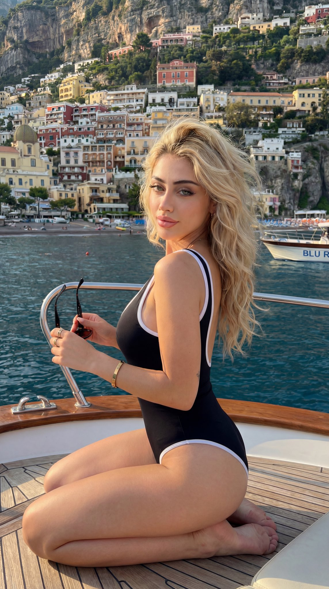
</div>

**提示词：**
```
{ "lighting": {
"source": "Natural sunlight",
"quality": "Golden hour, soft and warm",
"shadows": "Soft, well-defined shadows cast by the subject and boat elements",
"direction": "From the right, slightly backlit",
"highlights": "Bright highlights on the water, boat railing, and subject's hair"
},
"background": {
"details": "Specific buildings, church dome, beach activity are visible",
"setting": "Positano, Amalfi Coast, Italy",
"distance": "Far",
"elements": [
"Cliffside town with colorful buildings",
"Sandy beach with umbrellas and people",
"Dark blue sea",
"Other boats",
"Lush green vegetation on the cliffs"
],
"lighting_interaction": "Sunlight illuminates the town and cliffs, creating warm tones"
},
"typography": {
"color": "#2E4A7D",
"location": "On the side of the blue boat in the background right",
"font_style": "Sans-serif, uppercase, bold",
"description": "Boat name and registration details",
"text_content": "BLU RIDE"
},
"composition": {
"balance": "Asymmetrical balance between the subject in the foreground and the town in the background",
"framing": "Medium shot",
"perspective": "Slightly low angle, looking up towards the subject and background",
"leading_lines": "The boat's railing and deck lead the eye towards the subject and the town",
"depth_of_field": "Deep, with both subject and background in focus",
"rule_of_thirds": "Subject positioned in the lower right intersection"
},
"color_profile": {
"mood": "Warm, vibrant, luxurious",
"contrast": "Medium-high",
"saturation": "High",
"color_scheme": "Analogous blues and greens with warm earth tones",
"dominant_colors": [
"#2E4A7D",
"#F2F2F2",
"#C8A17B",
"#5A784A",
"#D98D6F"
]
},
"technical_specs": {
"iso": "Low",
"aperture": "f/8 or smaller for deep depth of field",
"lens_type": "Wide-angle lens",
"resolution": "High",
"camera_type": "DSLR or mirrorless",
"aspect_ratio": "4:5",
"shutter_speed": "Fast enough to freeze motion"
},
"subject_analysis": {
"hair": "Blonde, wavy, wind-blown",
"pose": "Kneeling on the boat deck, body angled towards the camera, right hand holding sunglasses, left hand on the railing",
"clothing": "Black one-piece swimsuit with white trim and cutouts",
"expression": "Looking over sunglasses with a slight smile",
"accessories": "Dark sunglasses, gold bracelet, ring",
"subject_type": "Young woman",
"hands_gestures": "Right hand adjusting sunglasses, left hand resting on the railing",
"location_on_frame": "Foreground, center-right"
},
"artistic_elements": {
"mood": "Relaxed, luxurious, aspirational",
"style": "Lifestyle photography, candid",
"texture": "Smooth boat deck, textured water, rugged cliffs, fabric of the swimsuit",
"narrative": "A woman enjoying a luxurious boat trip along the Amalfi Coast"
},
"generation_parameters": {
"seed": "Random",
"prompt": "A lifestyle photograph of a young blonde woman kneeling on the deck of a boat, wearing a black and white swimsuit and sunglasses, looking back at the camera. In the background is the cliffside town of Positano, Italy, with colorful buildings, a beach, and the sea under golden hour sunlight. The boat is moving, with other boats visible. The style is candid and luxurious.",
"model_type": "Photorealistic",
"guidance_scale": "High",
"negative_prompt": "Blurry, low resolution, studio lighting, artificial, indoors, crowded, overcast"
}
}
```

**中文提示词：**
```
{“灯光”： {
“来源”：“自然阳光”，
“品质”：“黄金时刻，柔和温暖”，
“阴影”：“主体和船只元素投射出的柔和、轮廓清晰的阴影”，
“方向”：“从右侧，略微背光”，
“亮点”：“水面、船舷和人物头发上的明亮高光”
},
“背景”： {
“细节”：“可以看到特定的建筑物、教堂圆顶和海滩活动”，
“设置”：“意大利阿马尔菲海岸波西塔诺”
“距离”: “远”
“元素”：[
“悬崖边的小镇，建筑色彩缤纷”
“沙滩上有遮阳伞和人群”
“深蓝色的大海”，
“其他船只”，
“悬崖上郁郁葱葱的植被”
],
"lighting_interaction": "阳光照亮城镇和悬崖，营造出温暖的色调"
},
"排版": {
“颜色”: “ #2E4A7D “,
“位置”：“在背景右侧蓝色船的侧面”，
"font_style": "无衬线字体，大写，粗体",
"描述": "船名和注册详情",
"text_content": "BLU RIDE"
},
“作品”： {
“平衡”：“前景主体与背景城镇之间的不对称平衡”，
“构图”：“中景”，
“视角”：“略微低角度，向上看向主体和背景”，
"leading_lines": "船的栏杆和甲板引导视线看向主体和城镇",
景深： “景深，主体和背景都清晰对焦”
“三分法构图”：“主体位于右下角交点处”
},
"color_profile": {
“氛围”：“温暖、充满活力、奢华”，
“对比度”：“中高”
“饱和度”: “高”
"配色方案": "类似蓝色和绿色，搭配温暖的大地色调",
"主色": [
" #2E4A7D "，
" #F2F2F2 "，
" #C8A17B "，
" #5A784A "，
#D98D6F
]
},
"technical_specs": {
"iso": "低",
“光圈”: “f /8或更小，以获得更大的景深”，
"lens_type": "广角镜头",
“分辨率”： “高”
"camera_type": "单反或无反"
"aspect_ratio": "4:5",
"shutter_speed": "足够快，可以凝固运动"
},
“主题分析”：{
“头发”：“金色的，波浪状的，被风吹乱的”，
“姿势”：“跪在船甲板上，身体侧对着镜头，右手拿着太阳镜，左手扶着栏杆”，
“服装”：“黑色连体泳衣，带有白色滚边和镂空设计”
“表情”：“透过太阳镜，带着一丝微笑看着前方”，
“配饰”：“深色太阳镜、金手镯、戒指”
"subject_type": "年轻女子",
“hands_gestures”: “右手调整太阳镜，左手扶在栏杆上”
"location_on_frame": "前景，中心偏右"
},
“artistic_elements”：{
“氛围”：“轻松、奢华、令人向往”
“风格”：“生活方式摄影，抓拍”
“质感”：“光滑的船甲板，波光粼粼的水面，崎岖的悬崖，泳衣的面料”，
叙事：一位女士正在享受沿着阿马尔菲海岸的豪华游艇之旅
},
"generation_parameters": {
“种子”： “随机”，
提示：一张生活方式照片，一位年轻的金发女子跪在船甲板上，身穿黑白泳衣，戴着太阳镜，回头看向镜头。背景是意大利波西塔诺的悬崖小镇，色彩缤纷的建筑、沙滩和沐浴在金色阳光下的大海。船正在行驶，可以看到其他船只。风格自然而奢华。
"model_type": "Photorealistic",
"guidance_scale": "高",
"negative_prompt": "模糊、低分辨率、影棚灯光、人造光、室内、拥挤、阴天"
}
}
```

<a id="prompt-925"></a>
## 案例 925：健身房自拍照 (来源 [@xIrissy](https://x.com/xIrissy/status/2002372846807654508)) 模型：Nano banana pro

<div style="display: flex; justify-content: space-between;">
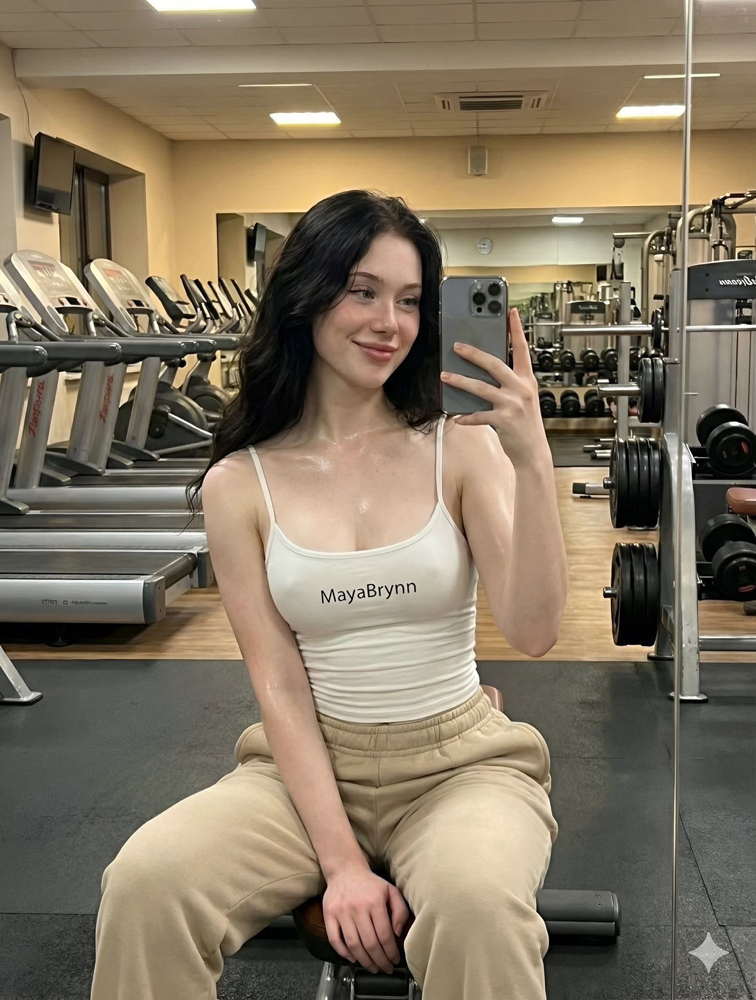
</div>

**提示词：**
```
{
"image_analysis": {
"type": "Mirror Selfie",
"setting": "Gym / Fitness Center",
"subject": {
"gender": "Female",
"age_group": "Young Adult",
"appearance": {
"hair": "Long, dark, wavy",
"skin_tone": "Fair",
"expression": "Slight smile, looking at phone screen",
"details": "Visible sweat/sheen on skin indicating a workout"
},
"pose": "Seated on a gym bench, leaning slightly forward, holding a phone with the left hand"
},
"attire": {
"top": {
"color": "White",
"style": "Spaghetti strap tank top / camisole",
"text_content": "MayaBrynn"
},
"bottom": {
"color": "Beige / Tan",
"style": "Loose-fitting sweatpants"
}
},
"accessories": {
"phone": "iPhone (Pro model) with grey case"
},
"environment": {
"background_left": "Row of grey commercial treadmills",
"background_right": "Dumbbell rack with weights, gym equipment reflection in mirror",
"lighting": "Overhead artificial gym lighting",
"flooring": "Black rubber gym mats"
},
"technical_aspects": {
"perspective": "First-person reflection",
"focus": "Sharp on subject, slightly softer background",
"style": "Realistic, Social Media Aesthetic, Fitness"
}
}
}
```

**中文提示词：**
```
{
"image_analysis": {
类型： 镜子自拍，
“设置”：“健身房/健身中心”，
“主题”： {
"性别": "女",
"age_group": "青年人",
“外貌”： {
“头发”：“长，深色，波浪形”，
"skin_tone": "白皙",
“表情”：“微微一笑，看着手机屏幕”
“细节”：“皮肤上有可见的汗水/光泽，表明进行过锻炼”
},
“姿势”：“坐在健身长凳上，身体略微前倾，左手拿着手机”
},
着装：{
“顶部”： {
颜色：白色，
“款式”：“吊带背心/吊带衫”，
"text_content": "MayaBrynn"
},
“底部”： {
颜色：米色/棕褐色，
款式：宽松运动裤
}
},
“配件”： {
“手机”: “iPhone（Pro 型号），灰色手机壳”
},
“环境”： {
"background_left": "一排灰色的商用跑步机",
"background_right": "哑铃架和杠铃片，健身器材在镜子中的倒影"
“照明”：“体育馆顶棚人工照明”，
“地板”： “黑色橡胶健身垫”
},
"technical_aspects": {
“视角”: “第一人称反思”
“焦点”：“主体清晰，背景略微柔和”，
风格：写实、社交媒体美学、健身
}
}
}
```

<a id="prompt-924"></a>
## 案例 924：电视新闻演播室现场 (来源 [@Just_sharon7](https://x.com/Just_sharon7/status/2002615857185501519)) 模型：Nano banana pro

<div style="display: flex; justify-content: space-between;">
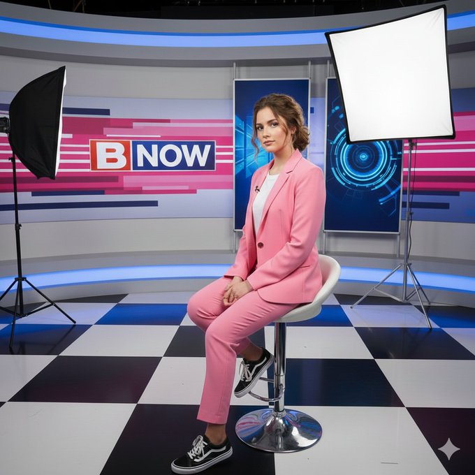
</div>

**提示词：**
```
{
"subject": {
"person": "Young Western woman",
"pose": "Side profile, seated on a high white swivel bar stool, looking directly at the camera with a subtle, neutral expression",
"hair": "Dark blond, styled in a voluminous low side bun (chignon) with loose strands framing the face",
"clothing": {
"jacket": "Tailored bubblegum pink blazer, single-button closure, notched lapels",
"undershirt": "Plain white crew-neck top",
"trousers": "Matching bubblegum pink slim-fit dress pants",
"footwear": "Black canvas low-top sneakers with white soles and black laces (Vans style)"
}
},
"environment": {
"setting": "Professional television news studio or talk show set",
"background_elements": [
{
"type": "LED Screen",
"content": "Pink and white horizontal stripes with a vertical logo reading 'B NOW' in bold block letters"
},
{
"type": "Digital Graphic",
"content": "Blue circular futuristic HUD/UI interface graphic on a vertical panel"
}
],
"furniture": "White modern curved bar stool with chrome pedestal base; glossy white and black reflective studio flooring"
},
"technical_details": {
"lighting": [
"High-key studio lighting",
"Large white softbox visible on a stand to the right",
"Black flag/scrim visible on the left side of the frame",
"Blue ambient LED accent lighting along the base of the walls"
],
"camera_angle": "Medium full shot, eye-level, slight side-on perspective",
"composition": "The subject is centered vertically, positioned between studio equipment and digital screens, showing the 'behind-the-scenes' reality of the set",
"color_palette": {
"primary": "Bubblegum pink, stark white",
"secondary": "Deep blue, black",
"accents": "Chrome, neutral grey"
}
},
"vibe": "Professional yet candid, modern, broadcast media aesthetic"
}
```

**中文提示词：**
```
{
“主题”： {
“人”: “年轻的西方女性”
“姿势”：“侧脸，坐在白色高脚旋转吧台凳上，直视镜头，表情微妙而中性”，
“头发”：“深金色，梳成蓬松的低侧发髻（发髻），几缕碎发垂在脸颊两侧”，
“衣服”： {
“外套”：“修身泡泡糖粉色西装外套，单扣，缺角翻领”
“内衣”： “纯白色圆领上衣”，
“裤子”： “配套的泡泡糖粉色修身西裤”
“鞋类”：“黑色帆布低帮运动鞋，白色鞋底，黑色鞋带（Vans 款式）”
}
},
“环境”： {
“场景”：“专业电视新闻演播室或脱口秀节目现场”，
“背景元素”：[
{
"type": "LED屏幕",
“内容”：“粉色和白色横条纹，带有醒目的竖排“B NOW”标志”
},
{
"type": "数字图形",
“内容”：“垂直面板上的蓝色圆形未来主义HUD/UI界面图形”
}
],
“家具”：“白色现代弧形吧台凳，镀铬底座；亮白色和黑色反光工作室地板”
},
"technical_details": {
“灯光”： [
“高调影棚灯光”，
“右侧支架上可以看到一个大型白色柔光箱，”
“画面左侧可见黑色旗帜/幕布”，
“沿墙底部设置蓝色环境LED重点照明”
],
“camera_angle”: “中景全景，平视，略微侧视”
“构图”：“主体垂直居中，位于摄影棚设备和数字屏幕之间，展现了片场‘幕后’的真实情况。”
"color_palette": {
“主色”：泡泡糖粉色，纯白色，
“次要的”: “深蓝色，黑色”
“点缀色”：铬色、中性灰
}
},
“氛围”：“专业而坦诚，现代，广播媒体美学”
}
```

<a id="prompt-923"></a>
## 案例 923：冬至海报 (来源 [@sundyme](https://x.com/sundyme/status/2002592213851832742)) 模型：Nano banana pro

<div style="display: flex; justify-content: space-between;">

</div>

**中文提示词：**
```
一个温馨的3D C4D Octane渲染场景，采用无黑色轮廓的羊毛针毡风格，具有盲盒玩具的柔和边缘审美。四只不同大小的粉彩（薄荷绿、嫩粉、淡蓝、奶油色）羊毛毡Labubu角色，身穿针织毛衣，有着标志性的圆润身体、兔耳和大眼睛，表情喜悦。它们围坐在铺着针织桌布的矮桌旁，桌上摆满热气腾腾的饺子、茶壶和餐具。一个角色正用筷子亲昵地喂另一个角色吃饺子。地面覆盖着羊毛雪和散落的心形装饰。左侧是挂着灯笼的盛开梅花枝，右侧是祥云图案。发光的羊毛心形在空中漂浮。背景是温暖的橙黄色渐变，营造出冬至家庭团聚的节日氛围。顶部是巨大、发光、毛绒质感的艺术字体“饺饺情深，岁岁安康”。中间是清晰简单的祝福语：“愿家人健康快乐，幸福安康！”。8K分辨率，高细节，暖光摄影棚照明，垂直2:3比例。
```

<a id="prompt-922"></a>
## 案例 922：产品高端商业营销设计 (来源 [@firatbilal](https://x.com/firatbilal/status/2002424619232588218)) 模型：Nano banana pro

<div style="display: flex; justify-content: space-between;">
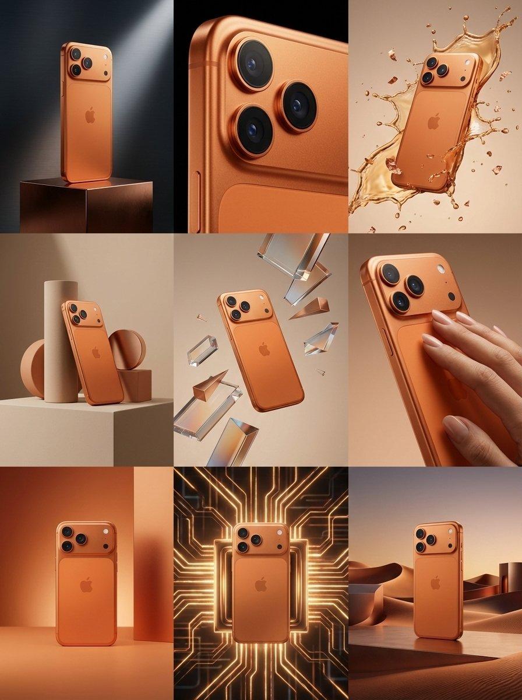
</div>

**提示词：**
```
Create a 3×3 grid in
3:4 aspect ratio for a high-end commercial marketing campaign using the uploaded product as the central subject.

Each frame must present a distinct visual concept while maintaining perfect product consistency across all nine images.

Grid Concepts (one per cell):

1. Iconic hero still life with bold composition

2. Extreme macro detail highlighting material, surface, or texture

3. Dynamic liquid or particle interaction surrounding the product

4. Minimal sculptural arrangement with abstract forms

5. Floating elements composition suggesting lightness and innovation

6. Sensory close-up emphasizing tactility and realism

7. Color-driven conceptual scene inspired by the product palette

8. Ingredient or component abstraction (non-literal, symbolic)

9. Surreal yet elegant fusion scene combining realism and imagination

Visual Rules:
Product must remain 100% accurate in shape, proportions, label, typography, color, and branding
No distortion, deformation, or redesign of the product
Clean separation between product and background

Lighting & Style:
Soft, controlled studio lighting
Subtle highlights, realistic shadows
High dynamic range, ultra-sharp focus
Editorial luxury advertising aesthetic
Premium sensory marketing look

Overall Feel:
Modern, refined, visually cohesive
High-end commercial campaign
Designed for brand websites, social grids, and digital billboards
Hyperreal, cinematic, polished, and aspirational
```

**中文提示词：**
```
创建一个 3×3 的网格
3:4 宽高比，适用于以上传产品为中心主题的高端商业营销活动。

每幅画面都必须呈现独特的视觉概念，同时在所有九幅画面中保持产品的完美一致性。

网格概念（每个单元格一个）：

1. 构图大胆的标志性英雄静物画

2. 极致的宏观细节，突出材质、表面或纹理。

3. 产品周围的动态液体或颗粒相互作用

4. 极简主义的抽象造型雕塑摆设

5. 漂浮元素构成，暗示着轻盈和创新。

6. 强调触觉和真实感的感官特写

7. 以产品色卡为灵感的色彩驱动型概念场景

8. 成分或组成部分抽象（非字面意义、符号意义）

9. 超现实而又优雅的融合场景，兼具现实主义与想象力

视觉规则：
产品在形状、比例、标签、字体、颜色和品牌标识方面必须保持100%准确。
产品不得有任何变形、扭曲或重新设计。
产品与背景之间清晰分离

灯光与风格：
柔和、可控的摄影棚灯光
微妙的高光，逼真的阴影
高动态范围，超清晰对焦
编辑奢华广告美学
高端感官营销外观

整体感觉：
现代、精致、视觉上和谐统一
高端商业推广活动
专为品牌网站、社交媒体平台和数字广告牌而设计
超现实的、电影般的、精致的、令人向往的
```

<a id="prompt-921"></a>
## 案例 921：MacBook Pro打开了X应用的照片 (来源 [@marmaduke091](https://x.com/marmaduke091/status/2002348744491348365)) 模型：Nano banana pro

<div style="display: flex; justify-content: space-between;">
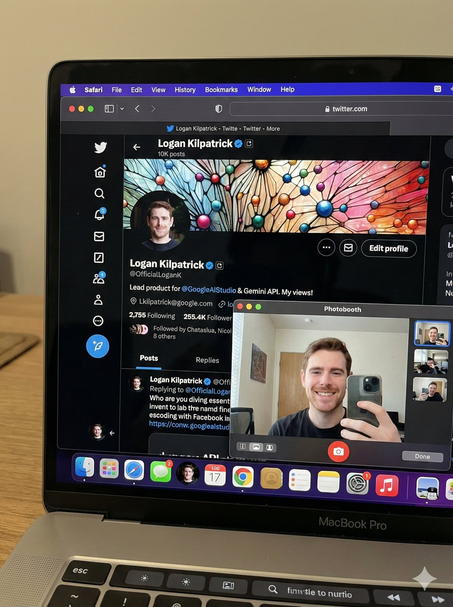
</div>

**提示词：**
```
candid 3:4 still of a macbook pro with x opened on safari and this x account is mine (so don't put follow buttons there but accurate ones) as also the pfp can be seen on sidedock bar too, with next to it photobooth opened with me (this guy on pfp) selfie-ing from the webcam, do not change my face, no gibberish text, phone still, flat normal quality
```

**中文提示词：**
```
一张3:4比例的MacBook Pro照片，Safari浏览器打开了X应用，这个X账号是我的（所以不要放关注按钮，但要放准确的关注按钮），头像也显示在侧边栏，旁边打开了Photo Booth，我（头像上的这个人）正在用摄像头自拍，不要修改我的脸，没有乱码，手机拍摄，普通画质。
```

<a id="prompt-920"></a>
## 案例 920：城市渲染数字艺术海报 (来源 [@op7418](https://x.com/op7418/status/2002592082125578427)) 模型：Nano banana pro

<div style="display: flex; justify-content: space-between;">
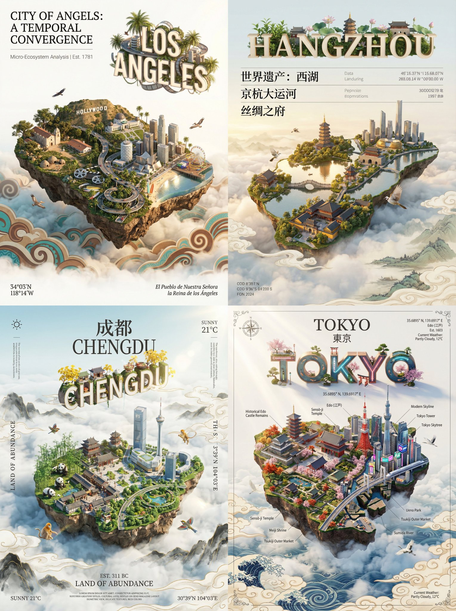
</div>

**中文提示词：**
```
一张针对 [城市名称] 的城市渲染数字艺术海报。

画面核心主体是一个漂浮在白云上方、形状像所选城市的并且占据画面大部分内容的微型岛屿。岛屿的形状与城市在地图上的形状相似，无缝融合城市独特的标志性地标、自然景观及文化元素。加入城市特有的鸟类、电影般的光影、鲜艳色彩、航拍视角和阳光反射效果，建筑不宜太多太密集。

岛屿展现历史与现代的无缝融合。一部分是该城市最具代表性的古代历史建筑；另一部分平滑过渡为城市的地标建筑和天际线景观。

岛屿漂浮浩瀚云海之上。云海采用该城市所在文化圈的传统艺术风格进行表现。

立体城市拼音或英文名的 3D 文字漂浮在微型岛屿的上方，这组文字像一个生态与文化共生的微缩生态装置。

在画面四周和主体周围，叠加一层极简、高雅、具有博物馆展板质感的信息排版层。主要检索相关的城市信息，主要信息使用经典的衬线字体，辅助数据可使用极细的极简无衬线体。在画面的角落，以类似古典地图集或高级杂志扉页的方式排版。用衬线体标注城市的地理坐标、别称或建城年份，以及当前的天气，作为装饰性的背景信息，整体排版留白极多，排版克制、干净、平衡，如同在欣赏一件珍贵的艺术品。

风格要求： Octane Render, C4D, Isometric City, Micro World, Living Ecosystem, 8k Resolution. DreamWorks style, 3D modeling, delicate, soft light projection.
```

<a id="prompt-919"></a>
## 案例 919：丁香色长裙女性双版本比例对比 (来源 [@saniaspeaks_](https://x.com/saniaspeaks_/status/2001944607714673042)) 模型：Nano banana pro

<div style="display: flex; justify-content: space-between;">
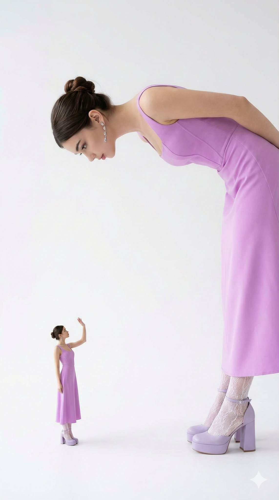
</div>

**提示词：**
```
{
"type": "image_generation_prompt",
"style": "ultra-realistic, high-fashion editorial, studio photography",
"identity_preservation": {
"use_reference_image": true,
"alter_face": false,
"strict_identity_lock": true,
"notes": "Create an extremely realistic image that is ultra-similar to the referenced girl. Preserve her facial identity, proportions, hairstyle, and overall appearance exactly as in the reference."
},
"subject": {
"gender": "female",
"appearance": {
"hair": {
"color": "dark",
"style": "elegant updo (bun)"
},
"jewelry": [
"delicate dangling earrings"
],
"expression": "calm, confident, composed"
}
},
"wardrobe": {
"dress": {
"type": "full-length elegant dress",
"color": "bright lilac",
"style": "fitted bodice with a refined silhouette, modest and fully covered",
"fabric": "smooth, high-quality fabric with a soft sheen"
},
"legwear": {
"type": "white lace-patterned tights or stockings",
"details": "floral or lace motif, refined and elegant"
},
"footwear": {
"type": "platform heels",
"color": "bright lilac",
"details": "thick high heel with ankle strap, bold and fashionable"
}
},
"composition": {
"concept": "scale contrast with two versions of the same woman",
"aspect_ratio": "9:16",
"foreground": {
"figure": "large version of the woman",
"pose": "leaning forward and downward, gently curving her back to look at the miniature version",
"emphasis": "long neck, arms, legs, and shoes dominating the frame for dramatic scale"
},
"background": {
"figure": "miniature version of the same woman",
"pose": "standing upright, appearing to salute, greet, or wave toward the larger figure",
"outfit": "identical full-length lilac dress, white lace tights, and lilac platform heels"
}
},
"environment": {
"setting": "studio",
"background": {
"color": "clean white or very light gray",
"style": "minimalist, distraction-free"
}
},
"color_palette": {
"dominant_colors": [
"bright lilac",
"white"
],
"overall_tone": "clean, elegant, high-contrast fashion palette"
},
"lighting": {
"type": "soft studio lighting",
"effects": [
"even illumination",
"clear separation between figures",
"enhanced fabric and skin realism"
]
},
"quality": {
"realism": "ultra-realistic",
"detail_level": "high detail in skin, fabric textures, lace patterns, and footwear",
"rendering": "photorealistic, editorial-grade finish"
},
"mood": {
"atmosphere": "stylish, artistic, playful with scale",
"tone": "elegant, modern, fashion-forward"
},
"output_goal": "Create a maximally realistic and ultra-faithful fashion image of a woman in a full-length lilac dress, featuring a creative scale-play composition with two versions of the same subject, set against a clean studio background in a 9:16 format."
}
```

**中文提示词：**
```
{
"type": "image_generation_prompt",
“风格”：“超写实、高级时尚杂志大片、影棚摄影”，
"identity_preservation": {
"use_reference_image": true,
"alter_face": false,
"strict_identity_lock": true,
“备注”：“创作一幅与参考女孩极其相似的逼真图像。务必保留她的面部特征、身材比例、发型和整体外貌，与参考图完全一致。”
},
“主题”： {
"性别": "女性",
“外貌”： {
“头发”： {
“颜色”：“深色”，
"发型": "优雅盘发（发髻）"
},
“珠宝”： [
“精致的垂坠耳环”
],
表情：平静、自信、沉着
}
},
“衣柜”： {
“裙子”： {
类型：优雅长裙
“颜色”： “亮丁香色”，
“款式”：“修身胸衣，线条优美，端庄得体，完全遮盖身体”。
“面料”：光滑、高品质的面料，带有柔和的光泽
},
"腿部服装": {
“类型”：“白色蕾丝图案的紧身裤或长筒袜”，
细节：花卉或蕾丝图案，精致优雅
},
鞋类：{
类型：厚底高跟鞋，
“颜色”： “亮丁香色”，
“细节”：“粗跟高跟鞋，踝带设计，大胆时尚”
}
},
“作品”： {
“概念”：“同一女性的两个不同版本之间的比例对比”，
"aspect_ratio": "9:16",
前景：{
“人物”：“女性的放大版”，
“姿势”：“身体前倾向下，轻轻弯曲背部，看着微缩模型”，
“强调”：“修长的脖子、手臂、腿和鞋子占据画面，营造出戏剧性的比例感”。
},
“背景”： {
“人物”：“同一女性的微缩版本”，
“姿势”：“直立站立，看起来像是在向较大的人物敬礼、问候或挥手”，
“服装”： “同款淡紫色长连衣裙、白色蕾丝紧身裤和淡紫色厚底高跟鞋”
}
},
“环境”： {
“设置”: “工作室”
“背景”： {
“颜色”: “纯白色或非常浅的灰色”，
风格：极简主义，无干扰
}
},
"color_palette": {
"主色": [
“亮紫色”，
“白色的”
],
"overall_tone": "干净、优雅、高对比度的时尚色调"
},
“灯光”： {
“类型”：“柔和的影棚灯光”，
“效果”：[
“均匀照明”，
“数字之间有明显的分隔”，
“增强织物和皮肤的真实感”
]
},
“质量”： {
“写实主义”：“超写实主义”，
"detail_level": "皮肤、织物纹理、蕾丝图案和鞋履的细节都非常丰富",
“渲染”：“照片级真实感，编辑级效果”
},
“情绪”： {
“氛围”：“时尚、艺术、巧妙运用比例”，
“基调”：“优雅、现代、时尚前卫”
},
"output_goal": "创作一幅极其逼真、高度还原的女性时尚照片，照片中女性身穿淡紫色长裙，采用创意性的比例构图，使用同一主题的两个版本，背景为干净的摄影棚，格式为 9:16。"
}
```

<a id="prompt-918"></a>
## 案例 918：生成一周的服装搭配 (来源 [@schnapoon](https://x.com/schnapoon/status/2001847957390549090)) 模型：Nano banana pro

<div style="display: flex; justify-content: space-between;">
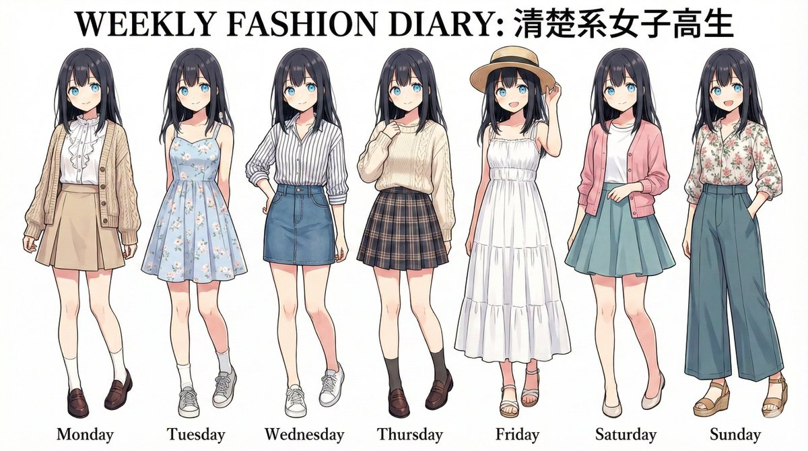
</div>

**中文提示词：**
```
环境：
【角色特征]:高中女生，留着黑色长发
【时尚主题]:现代高中女生日常穿着，整洁干净】

转换规则：
- 一张时尚造型图，展示了[Character Features]中的七个相同的角色并排站成一排。
- 仅穿着 7 套基于【时尚主题】的全新休闲服装。
- 参考图像的风格得到了完美保留。
- 他们不穿[参考图片中的服装]，而是根据[时尚主题]穿七套不同的服装。
  全身照。
- 背景为纯白色或略带象牙色。
  脚下有自然的阴影。这幅图的布局看起来像是从杂志上剪下来的。
- 每个图形下方从左到右分别写着“星期一”、“星期二”、“星期三”、“星期四”、“星期五”、“星期六”和“星期日”。
- 顶部醒目的标题文字。

艺术风格：
- 高分辨率
- 摄影棚灯光
- 4k
  ——ar 16:9
```

<a id="prompt-917"></a>
## 案例 917：用手指操纵自己的复制品 (来源 [@FitzGPT](https://x.com/FitzGPT/status/2001695202600456576)) 模型：Nano banana pro

<div style="display: flex; justify-content: space-between;">
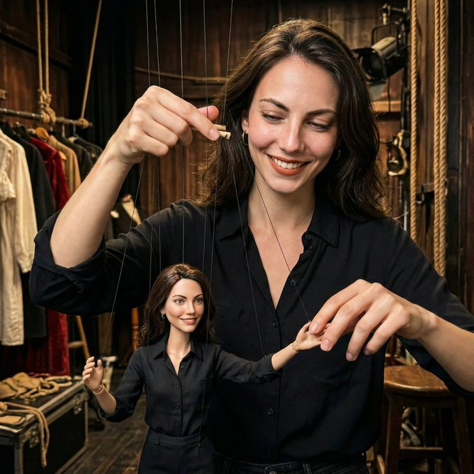
</div>

**提示词：**
```
ekteki kişi, bir tiyatro kulisinde kendisinin kopya kuklasını (marionette) parmaklarıyla hareket ettiriyor.
```

**中文提示词：**
```
附图中的人正在剧院的化妆间里用手指操纵自己的复制品（木偶）。
```

<a id="prompt-916"></a>
## 案例 916：高端影棚肖像照 (来源 [@AIwithkhan](https://x.com/AIwithkhan/status/2001685648768680052)) 模型：Nano banana pro

<div style="display: flex; justify-content: space-between;">
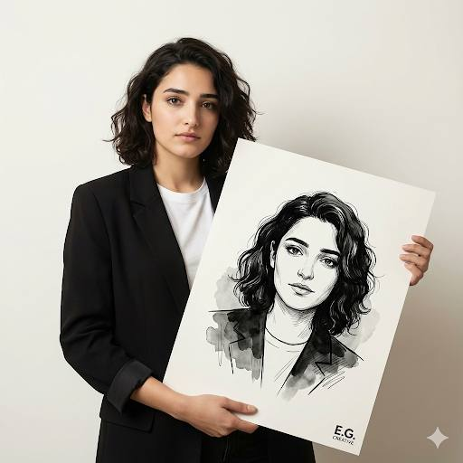
</div>

**提示词：**
```
A high-end studio portrait using the uploaded photo as the main subject. The person stands confidently against a clean, minimal background in soft neutral tones, holding a large vertical poster in front of them. The poster features an artistic reinterpretation of the same uploaded photo — stylized as a digital illustration, sketch, or painterly artwork — clearly recognizable as the same face. Professional studio lighting with a soft key light and subtle rim light creates gentle shadows and depth. The subject’s expression is calm and confident, body posture relaxed yet strong, evoking a modern personal brand identity. Clean composition, balanced framing, premium editorial aesthetic, shallow depth of field, ultra-realistic skin texture, crisp details, contemporary creator branding vibe, cinematic realism, 1:1 aspect ratio, high resolution.
```

**中文提示词：**
```
这是一张以上传照片为主体的高端影棚肖像照。照片中的人物自信地站在简洁的中性色调背景前，手持一张大幅竖版海报。海报上是对同一张照片的艺术化重新诠释——风格化为数字插画、素描或绘画作品——清晰地展现了同一张面孔。专业的影棚灯光，柔和的主光和微妙的轮廓光营造出柔和的阴影和层次感。人物表情沉稳自信，身姿放松而有力，展现出现代个人品牌形象。构图简洁，取景均衡，呈现高端时尚美感，浅景深，肌肤纹理逼真，细节清晰，散发出当代创作者的品牌气息，兼具电影般的真实感，1:1宽高比，高分辨率。
```

<a id="prompt-915"></a>
## 案例 915：照片转换成漫画 (来源 [@ecommartinez](https://x.com/ecommartinez/status/2001689993778249952)) 模型：Nano banana pro

<div style="display: flex; justify-content: space-between;">
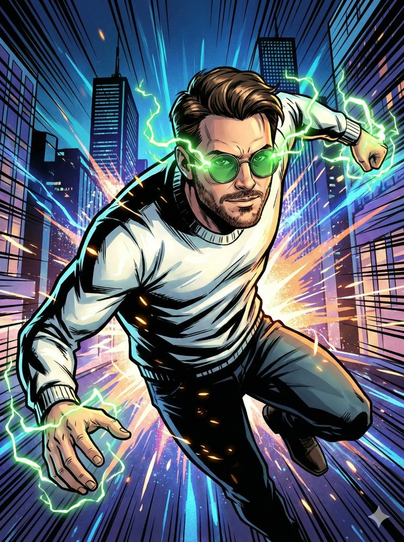
</div>

**提示词：**
```
Crea una ilustración de cómic moderno usando mi imagen de referencia como personaje principal.
Estilo inspirado en los cómics de superhéroes contemporáneos y novelas gráficas cinematográficas.
El personaje mantiene los rasgos faciales exactos y su identidad de la foto de referencia, transformados en un estilo cómic estilizado con líneas limpias pero expresivas.
Añade contornos negros marcados, sombreado dinámico con tinta y colores de alto contraste.
Aplica efectos FX como energía brillante, chispas, estelas de movimiento, haces de luz y partículas sutiles para aumentar la acción y la intensidad.
Usa una pose de acción dinámica o una postura poderosa, con perspectiva exagerada y ángulos dramáticos.
El fondo debe ser gráfico y cinematográfico: formas urbanas abstractas, líneas de velocidad o explosiones de energía, sin distraer del personaje.
La iluminación es dramática, con luces y sombras fuertes para dar profundidad e impacto.
Estilo final: portada de cómic moderno de alta calidad, detalles nítidos, colores vibrantes, composición enérgica, ilustración profesional, impacto visual fuerte.
No cambies el rostro, solo estilízalo.
```

**中文提示词：**
```
请以我的参考图为主角，创作一幅现代漫画插画。
风格灵感源自当代超级英雄漫画和电影图像小说。
该角色保留了参考照片中的精确面部特征和身份，并被转化为线条简洁但富有表现力的风格化漫画风格。
它增加了清晰的黑色轮廓、动态的墨迹阴影和高对比度的颜色。
应用诸如明亮能量、火花、运动轨迹、光束和细微粒子等特效，以增强动作和强度。
采用动态动作姿势或有力的站姿，并运用夸张的透视和戏剧性的角度。
背景应具有图形感和电影感：抽象的城市形状、速度线条或能量爆发，但不要分散对角色的注意力。
灯光效果极佳，强烈的明暗对比营造出深度和冲击力。
最终风格：高质量的现代漫画封面，细节清晰，色彩鲜艳，构图充满活力，插图专业，视觉冲击力强。
不要改变你的容貌，只需进行一些风格上的修饰。
```

<a id="prompt-914"></a>
## 案例 914：复古风格照相亭 (来源 [@miilesus](https://x.com/miilesus/status/2001734583830626635)) 模型：Nano banana pro

<div style="display: flex; justify-content: space-between;">
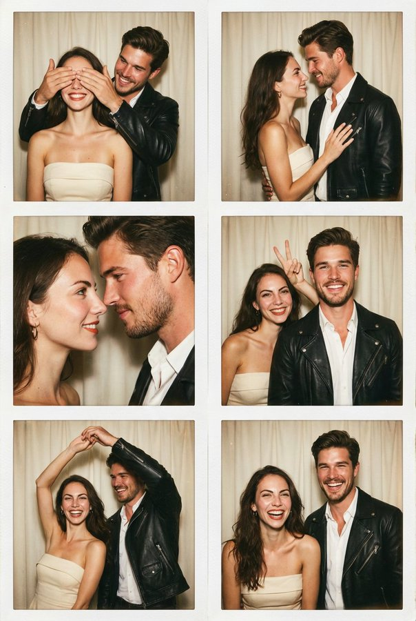
</div>

**提示词：**
```
Create a realistic vintage-style photo booth / Polaroid photo collage featuring the same couple, using the two uploaded images as exact face references for both individuals (preserve both identities accurately).
The couple appears natural, affectionate, and playful, captured in multiple candid moments as if taken inside a photo booth. The woman and the man maintain their original facial features, skin tones, and expressions.
Woman: elegant, feminine, glowing skin, natural makeup, soft blush, glossy lips, long dark hair styled loosely with gentle volume. Wearing a minimal strapless cream or light beige dress.
Man: clean and handsome appearance, short dark hair, light stubble or clean-shaven, wearing a black leather jacket over a white shirt
Scenes & poses included in the collage:
The woman smiling brightly while the man stands behind her playfully covering her eyes.
The couple standing close, facing each other lovingly, her hand resting on his chest.
A close face-to-face moment with soft smiles and eye contact.
The woman standing behind the man, making a peace sign while smiling at the camera.
A playful dancing pose where the man lifts one of the woman’s hands as if spinning her.
A relaxed, candid moment where both laugh naturally at the camera.
Environment: neutral photo booth backdrop with soft vertical curtains, warm indoor lighting, subtle shadows, cozy and intimate atmosphere.
Photography style: vintage Polaroid / analog photo booth aesthetic, slightly soft focus, gentle grain, mild blur, natural imperfections, warm tones, realistic skin texture.
Lighting: soft frontal flash combined with ambient light, creating a casual, real-life snapshot feeling.
Mood & vibe: romantic, playful, spontaneous, intimate, youthful, nostalgic.
Composition: multi-frame vertical collage, evenly spaced images, authentic photo booth layout.
Quality: high realism, not AI-looking, natural proportions, no distortion.
```

**中文提示词：**
```
使用上传的两张照片作为两人的面部参考，制作一张逼真的复古风格照相亭/宝丽来照片拼贴画，照片中的人物为同一对情侣（准确保留两人的身份）。
这对情侣看起来自然、亲密又充满活力，多张抓拍照片仿佛是在照相亭里拍摄的。男女双方都保留了原本的面部特征、肤色和表情。
女士：优雅妩媚，肌肤散发光泽，妆容自然，腮红轻柔，双唇水润，一头乌黑长发随意披散，略带蓬松感。身着简约的米色或浅米色抹胸连衣裙。
男士：外表干净英俊，短黑发，留着淡淡的胡茬或刮得干干净净，身穿黑色皮夹克，内搭白色衬衫。
拼贴画中包含的场景和姿势：
女人笑容灿烂，男人站在她身后，顽皮地捂住了她的眼睛。
这对情侣站得很近，彼此深情地对视着，她的手放在他的胸口。
面对面的亲密时刻，带着柔和的微笑和眼神交流。
站在男子身后的女子对着镜头微笑，并比出和平手势。
一个俏皮的舞蹈姿势，男子抬起女子的一只手，仿佛要将她旋转起来。
轻松自然的瞬间，两人对着镜头自然地笑了起来。
环境：中性风格的拍照背景，搭配柔和的垂直窗帘、温暖的室内灯光、微妙的光影，营造出温馨私密的氛围。
摄影风格：复古宝丽来/模拟照相亭美学，略微柔焦，轻微颗粒感，轻微模糊，自然瑕疵，暖色调，逼真的皮肤纹理。
光线：柔和的正面闪光灯与环境光相结合，营造出一种随意、真实的快照感觉。
氛围：浪漫、俏皮、随性、亲密、青春、怀旧。
构图：多帧竖幅拼贴，图像间距均匀，真实的照相亭布局。
质量：高度逼真，不像人工智能生成的，比例自然，无变形。
```

<a id="prompt-913"></a>
## 案例 913：超逼真的 8K 街头抓拍肖像 (来源 [@Taaruk_](https://x.com/Taaruk_/status/2001656897699733967)) 模型：Nano banana pro

<div style="display: flex; justify-content: space-between;">
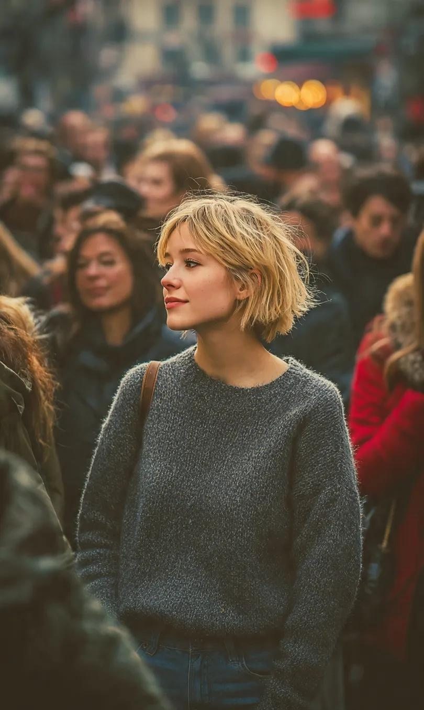
</div>

**提示词：**
```
{
"Objective": "Create an ultra-realistic 8K candid street portrait capturing quiet emotion and authenticity within a crowded urban environment.",

"Subject": {
"Gender": "Female",
"Appearance": {
"Hair": "Short blonde hair with soft, natural texture",
"Makeup": "Minimal, natural look",
"Skin": {
"Texture": "Realistic skin texture with subtle freckles",
"Highlights": "Soft natural highlights with gentle tonal transitions"
},
"Expression": "Calm, thoughtful, introspective",
"Gaze": "Looking slightly to the side, not directly at the camera"
},
"Wardrobe": {
"Top": "Simple grey knitted sweater with visible fabric weave",
"Bottom": "Casual jeans",
"Accessories": "Thin shoulder-bag strap visible across the shoulder"
}
},

"Scene_Description": {
"Setting": "Busy city street",
"Crowd": {
"Density": "Surrounded by a dense flow of pedestrians",
"Background_Treatment": "Softly blurred figures creating depth and motion"
},
"Environment": "Urban street atmosphere with natural movement"
},

"Lighting_and_Color": {
"Lighting": {
"Type": "Natural daylight",
"Quality": "Soft and even, without harsh shadows"
},
"Color_Grading": {
"Style": "Warm cinematic tones",
"Characteristics": [
"Natural skin tones",
"Muted urban background colors",
"Subtle film-inspired contrast"
]
}
},

"Camera_and_Composition": {
"Shot_Type": "Candid street portrait",
"Depth_of_Field": "Shallow depth of field isolating the subject",
"Focus": "Sharp focus on the subject with background crowd softly blurred",
"Angle": "Eye-level, unobtrusive framing"
},

"Visual_Style": {
"Resolution": "Ultra-realistic 8K",
"Aesthetic": "Documentary street photography",
"Detail_Characteristics": [
"Sharp facial detail",
"Natural fabric texture",
"Soft motion blur in background",
"Subtle film grain for realism"
]
},

"Mood_and_Storytelling": {
"Themes": [
"Stillness within chaos",
"Quiet reflection",
"Human presence in urban life"
],
"Atmosphere": "Emotional, authentic, understated realism"
},

"Output_Requirements": {
"Format": "Image",
"Orientation": "Portrait or cinematic street frame",
"Quality": "Professional documentary-grade realism"
}
}
```

**中文提示词：**
```
{
“目标”：“在拥挤的都市环境中，捕捉安静的情感和真实感，创作一张超逼真的 8K 街头抓拍肖像。”

“主题”： {
性别：女，
“外貌”： {
“头发”：“柔软自然的短金发”，
“妆容”：“简约自然妆容”
“皮肤”： {
“纹理”：“逼真的皮肤纹理，带有细小的雀斑”，
“高光”： “柔和自然的高光，色调过渡平缓”
},
“表情”：“冷静、深思熟虑、内省”
“目光”：“略微看向一侧，而不是直视镜头”
},
“衣柜”： {
“上衣”：“简约灰色针织毛衣，织物纹理清晰可见”，
下装：休闲牛仔裤
“配饰”：“肩上露出细细的肩包肩带”
}
},

"场景描述": {
“场景”：“繁忙的城市街道”，
人群：{
“密度”：“周围人流密集”，
“背景处理”：“柔和模糊的人物形象，营造出深度和动感”
},
“环境”：“具有自然动感的都市街道氛围”
},

"照明和颜色": {
“灯光”： {
“类型”：“自然日光”，
“品质”：“柔和均匀，无生硬阴影”
},
"Color_Grading": {
风格：温暖的电影色调
“特征”： [
“自然肤色”
“柔和的城市背景色彩”，
“微妙的胶片风格对比”
]
}
},

“相机与构图”：{
"Shot_Type": "街头抓拍肖像",
“景深”： “浅景深突出主体”，
“焦点”：“主体清晰对焦，背景人群柔和虚化”，
“角度”：“视线水平，不显眼的构图”
},

"视觉样式": {
“分辨率”：“超逼真 8K”，
“美学”：“纪实街头摄影”，
"Detail_Characteristics": [
“面部细节清晰”，
“天然面料质感”
“背景呈现柔和的动态模糊效果”
“细腻的胶片颗粒感，营造真实感”
]
},

"情绪与故事讲述": {
“主题”：[
“混乱中的平静”
“静静地思考”，
“人类在城市生活中的存在”
],
“氛围”：“情感丰富、真实、含蓄的现实主义”
},

"输出要求": {
"格式": "图像",
“方向”：“竖幅或电影街景构图”，
“质量”：“专业纪录片级别的真实感”
}
}
```

<a id="prompt-912"></a>
## 案例 912：垂直三格拼贴画 (来源 [@lexx_aura](https://x.com/lexx_aura/status/2001886993836343775)) 模型：Nano banana pro

<div style="display: flex; justify-content: space-between;">
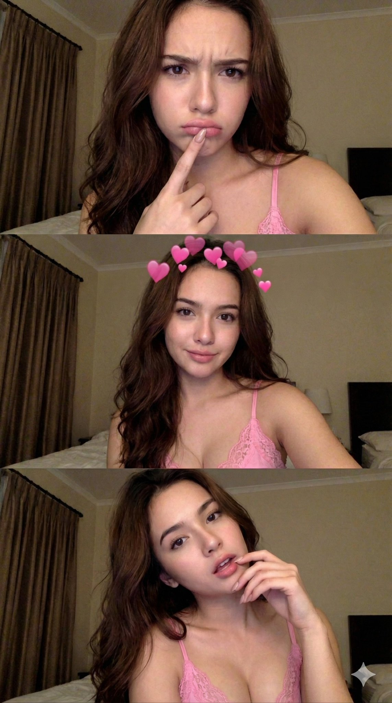
</div>

**提示词：**
```
{
"image_structure": {
"layout": "Vertical three-panel collage",
"aspect_ratio": "Tall vertical strip",
"shot_type": "Close-up selfies"
},
"subject_details": {
"demographics": "Young woman with long, wavy brunette hair",
"skin": "Natural skin texture, minimal or no makeup",
"clothing": "Pink lace-trimmed bralette or camisole top with thin spaghetti straps",
"accessories": "Long manicured nails (nude/pale pink color)"
},
"environment": {
"setting": "Dimly lit bedroom or hotel room interior",
"background_elements": [
"Beige/cream colored walls",
"Heavy brown curtains on the left side",
"Partial view of a bed headboard in the background"
]
},
"lighting_and_style": {
"lighting": "Warm, indoor artificial lighting, low-light conditions",
"aesthetic": "Candid selfie style, slightly grainy phone camera quality, early 2010s social media aesthetic, flash photography look",
"mood": "Casual, intimate, playful"
},
"panel_breakdown": {
"top_panel": {
"expression": "Pouting or confused, eyebrows slightly furrowed",
"pose": "Finger hooked over bottom lip, looking directly at camera"
},
"middle_panel": {
"expression": "Soft smile, looking directly at camera",
"overlay_effect": "Digital pink heart crown filter (Snapchat style) floating around the head"
},
"bottom_panel": {
"expression": "Relaxed, mouth slightly open, gazing at camera",
"pose": "Head tilted to the side, hand gently touching chin and lower lip"
}
}
}
```

**中文提示词：**
```
{
"image_structure": {
“布局”：“垂直三格拼贴画”，
"aspect_ratio": "高竖条",
"shot_type": "特写自拍"
},
"subject_details": {
“人口统计信息”：“年轻女性，留着长长的棕色波浪卷发”，
“肌肤”: “自然肌肤纹理，几乎不化妆”
“服装”：“粉色蕾丝边吊带文胸或吊带背心”，
“配饰”： “修剪整齐的长指甲（裸色/浅粉色）”
},
“环境”： {
“场景”：“光线昏暗的卧室或酒店房间内部”，
“背景元素”：[
“米色/奶油色墙壁”，
“左侧是厚重的棕色窗帘，”
“背景中可以看到床头板的一部分”
]
},
"lighting_and_style": {
“照明”：“温暖的室内人工照明，光线较暗的环境”，
“美学”：“随意的自拍风格，略带颗粒感的手机相机画质，2010 年代初期的社交媒体美学，闪光灯摄影效果”，
“氛围”： “轻松、亲密、俏皮”
},
"panel_breakdown": {
"top_panel": {
“表情”：“撅嘴或困惑，眉毛微微皱起”，
姿势：“手指勾住下唇，直视镜头”
},
"middle_panel": {
“表情”：“柔和的微笑，直视镜头”
"overlay_effect": "粉色爱心皇冠滤镜（Snapchat风格）漂浮在头部周围"
},
"bottom_panel": {
“表情”：“放松，嘴巴微张，凝视着镜头”
“姿势”：“头部侧倾，手轻轻触碰下巴和下唇”
}
}
}
```

<a id="prompt-911"></a>
## 案例 911：36 个穿着同一套衣服的不同人像 (来源 [@gokayfem](https://x.com/gokayfem/status/2001680146252669084)) 模型：Nano banana pro

<div style="display: flex; justify-content: space-between;">
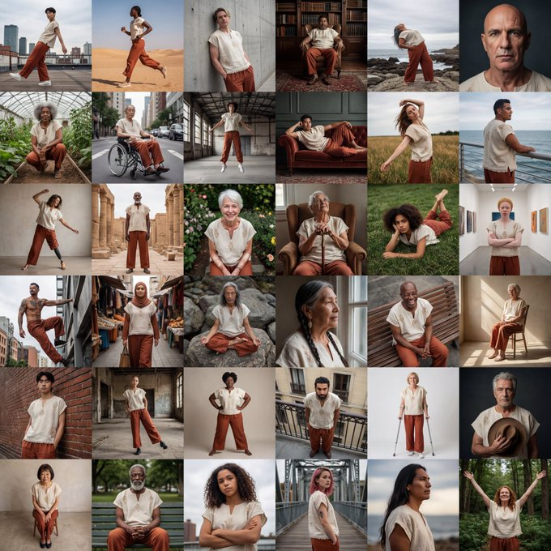
</div>

**提示词：**
```
6x6 grid layout. Editorial fashion photography. Use the reference clothing item on all 36 models. Every single cell must feature a completely unique individual—no two people should look remotely similar.
Maximize human diversity across:
Age: Teenagers, 20s, 30s, 40s, 50s, 60s, 70s, 80s+, elderly with wrinkles and grey hair
Body types: Extremely thin, slim, athletic, muscular, stocky, chubby, fat, plus-size, obese, petite, tall, short, broad-shouldered, narrow-framed, pear-shaped, apple-shaped, hourglass, rectangular, long-limbed, short-limbed.
Ethnicity & skin tones: East Asian, Southeast Asian, South Asian, Middle Eastern, North African, Sub-Saharan African, West African, East African, Indigenous Australian, Pacific Islander, Native American, Indigenous South American, Scandinavian, Mediterranean, Eastern European, Western European, Caribbean, mixed race, albino. Full spectrum of skin tones from the palest to the deepest.
Hair: Bald, shaved, buzz cut, afro, locs, braids, straight, wavy, curly, coily, long, short, grey, white, natural colors, receding hairline, thinning hair, thick full hair, hijab, head wraps, turbans.
Features: Freckles, vitiligo, acne, scars, birthmarks, moles, gap teeth, crooked teeth, big nose, small nose, wide nose, narrow nose, round face, angular face, soft jawline, strong jawline, monolid eyes, deep-set eyes, hooded eyes, big lips, thin lips, visible disabilities, prosthetics, wheelchair users, amputees.
Each cell: different pose, different camera angle. Poses should feel editorial and unexpected—leaning, crouching, mid-stride, arched, sprawled, seated, jumping, twisting, lounging. Camera angles vary—low angle, overhead, Dutch tilt, wide shot, tight crop, ground-level, profile, three-quarter view.
Moody, high contrast, cinematic lighting. Varied environments—studio, architectural, urban, natural. Sharp detail, clothing as focal point. Final result should feel like the most inclusive, human-rich fashion editorial ever created—a true celebration of every single type of human body that exists.
```

**中文提示词：**
```
6x6网格布局。时尚摄影。所有36位模特均需穿着同一件参考服装。每个单元格中的模特必须完全不同——任何两个人都不能有任何相似之处。
最大限度地提高人类多样性：
年龄：青少年、20多岁、30多岁、40多岁、50多岁、60多岁、70多岁、80岁以上、有皱纹和白发的老年人
体型：极瘦、苗条、健壮、肌肉发达、敦实、丰满、肥胖、大码、肥胖、娇小、高挑、矮小、肩宽、骨架窄、梨形、苹果形、沙漏形、矩形、四肢长、四肢短。
种族与肤色：东亚人、东南亚人、南亚人、中东人、北非人、撒哈拉以南非洲人、西非人、东非人、澳大利亚原住民、太平洋岛民、美洲原住民、南美原住民、斯堪的纳维亚人、地中海人、东欧人、西欧人、加勒比人、混血儿、白化病患者。涵盖从最浅到最深的各种肤色。
头发：光头、剃光头、寸头、爆炸头、脏辫、辫子、直发、波浪卷发、卷发、螺旋卷发、长发、短发、灰发、白发、自然发色、发际线后移、头发稀疏、浓密头发、头巾、头巾、头巾。
特征：雀斑、白癜风、痤疮、疤痕、胎记、痣、牙缝、牙齿歪斜、大鼻子、小鼻子、宽鼻子、窄鼻子、圆脸、棱角分明的脸、柔和的下颌线、硬朗的下颌线、单眼皮、深陷眼窝、眼睑下垂、厚嘴唇、薄嘴唇、明显的残疾、假肢、轮椅使用者、截肢者。
每个单元格：不同的姿势，不同的拍摄角度。姿势应具有编辑感和出人意料的特质——倾斜、蹲伏、迈步、拱背、伸展、坐姿、跳跃、扭转、慵懒。拍摄角度也多种多样——低角度、俯视、倾斜镜头、广角镜头、特写镜头、地面视角、侧面视角、四分之三侧面视角。
营造氛围感，运用高对比度的电影级灯光。场景多样——包括摄影棚、建筑、都市和自然环境。注重细节刻画，以服装为视觉焦点。最终呈现的作品应展现出前所未有的包容性和人文关怀，真正赞美每一种人体形态。
```

<a id="prompt-910"></a>
## 案例 910：女生四宫格照片 (来源 [@lexx_aura](https://x.com/lexx_aura/status/2001653710745739419)) 模型：Nano banana pro

<div style="display: flex; justify-content: space-between;">
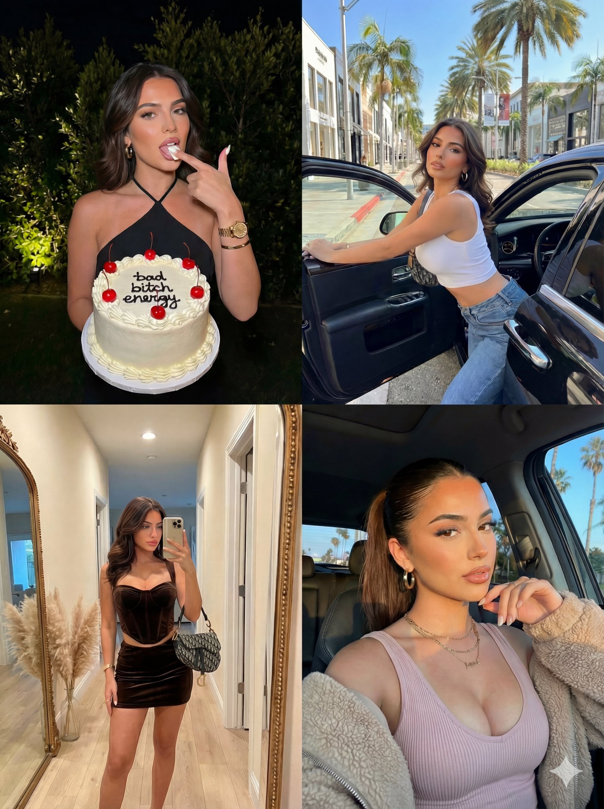
</div>

**提示词：**
```
{
"image_layout": "2x2 grid collage featuring four distinct photographs of the same female subject.",
"subject_general": {
"gender": "Female",
"hair_color": "Dark brown/black",
"hair_style": "Long, styled in loose waves in three panels; sleek high ponytail in one panel",
"aesthetic": "Glamorous, influencer, trendy, luxury lifestyle"
},
"panels": [
{
"position": "top_left",
"setting": "Outdoors at night, dark background with illuminated green foliage",
"action": "Subject is holding a cake with one hand and licking frosting off the index finger of the other hand",
"outfit": {
"top": "Black halter-neck sleeveless top",
"jewelry": "Gold wristwatch, gold bangle bracelet, ring, small hoop earrings"
},
"props": {
"item": "Round white frosted cake",
"details": [
"Red cherries on top",
"Decorative white piping along edges",
"Black icing text reading 'bad bitch energy'"
]
}
},
{
"position": "top_right",
"setting": "Daytime city street, likely an upscale shopping district (e.g., Rodeo Drive) with palm trees and storefronts visible",
"action": "Subject is leaning out of the open door of a black luxury car, looking at the camera",
"outfit": {
"top": "White sleeveless ribbed crop top",
"bottom": "Blue denim jeans",
"accessories": "Shoulder bag (strap visible), gold hoop earrings"
},
"lighting": "Bright natural sunlight casting shadows"
},
{
"position": "bottom_left",
"setting": "Indoor hallway, beige walls, wooden floor",
"action": "Full-body mirror selfie",
"outfit": {
"style": "Matching two-piece set",
"color": "Dark brown/chocolate",
"top": "Velvet/suede corset-style bustier top",
"bottom": "Mini skirt",
"accessories": "Patterned designer handbag (resembling Dior Saddle bag), stack of gold bracelets"
},
"background_details": [
"Large rectangular mirror with gold frame leaning against wall",
"Vase with pampas grass in the corner",
"Doorway visible in reflection"
]
},
{
"position": "bottom_right",
"setting": "Inside a vehicle or outdoors, golden hour sunlight",
"action": "Close-up selfie, hand raised near mouth/chin",
"outfit": {
"top": "Light pink/mauve ribbed tank top",
"outerwear": "Beige fuzzy/sherpa jacket worn off-the-shoulder",
"jewelry": "Layered gold necklaces with pendants, hoop earrings"
},
"hair_styling": "Sleeked back high ponytail",
"background_details": "Car window frame, palm trees and blue sky visible in background"
}
]
}
```

**中文提示词：**
```
{
"image_layout": "2x2 网格拼贴，包含同一女性对象的四张不同照片。"
"subject_general": {
"性别": "女",
"hair_color": "深棕色/黑色",
"发型": "长发，分成三片，烫成蓬松的波浪卷；一片，扎成光滑的高马尾辫",
“美学”： “魅力四射、网红、潮流、奢华生活方式”
},
“面板”：[
{
"位置": "左上",
“场景”：“夜晚的户外，深色背景，绿色树叶在灯光下闪烁”，
“动作”：“受试者一手拿着蛋糕，另一只手的食指正在舔掉上面的糖霜”，
“全套服装”： {
“上衣”： “黑色露背无袖上衣”，
“珠宝”：金手表、金手镯、戒指、小耳环
},
"props": {
“商品”: “圆形白色糖霜蛋糕”
“细节”： [
“上面放些红樱桃”，
“边缘饰有白色滚边”，
“黑色糖霜上写着‘坏女孩能量’”
]
}
},
{
"位置": "右上角",
“场景”：“白天的城市街道，可能是一个高档购物区（例如罗迪欧大道），可以看到棕榈树和商店橱窗”，
“动作”：“拍摄对象从一辆黑色豪华轿车的敞开车门探出身子，看着镜头”。
“全套服装”： {
“上衣”：“白色无袖罗纹露脐上衣”，
“底部”：“蓝色牛仔裤”，
配饰：单肩包（肩带可见）、金色圆环耳环
},
“光线”：“明亮的自然阳光投射出阴影”
},
{
"位置": "左下角",
“场景”：“室内走廊，米色墙壁，木地板”，
“动作”：“全身镜前自拍”，
“全套服装”： {
“款式”：“配套两件套”
颜色：深棕色/巧克力色，
“上衣”：天鹅绒/麂皮紧身胸衣式上衣，
“下装”: “迷你裙”，
“配饰”：“图案名牌手提包（类似迪奥马鞍包），一叠金手镯”
},
"background_details": [
“一面金色边框的大长方形镜子斜靠在墙上”
“花瓶角落里放着蒲苇草”
“倒影中可见门口”
]
},
{
"位置": "右下角",
“场景”：“车内或室外，日落时的金色阳光”，
“动作”：“近距离自拍，手举到嘴/下巴附近”，
“全套服装”： {
上衣：浅粉色/淡紫色罗纹背心，
“外套”：“米色毛绒/羊羔绒夹克，露肩穿着”，
“珠宝”：“多层金项链配吊坠，圈形耳环”
},
"发型"："光滑的高马尾辫",
"background_details": "背景中可以看到车窗框、棕榈树和蓝天"
}
]
}
```

<a id="prompt-909"></a>
## 案例 909：精美杂志上的文章照片 (来源 [@NanoBanana](https://x.com/NanoBanana/status/2001678061662531590)) 模型：Nano banana pro

<div style="display: flex; justify-content: space-between;">
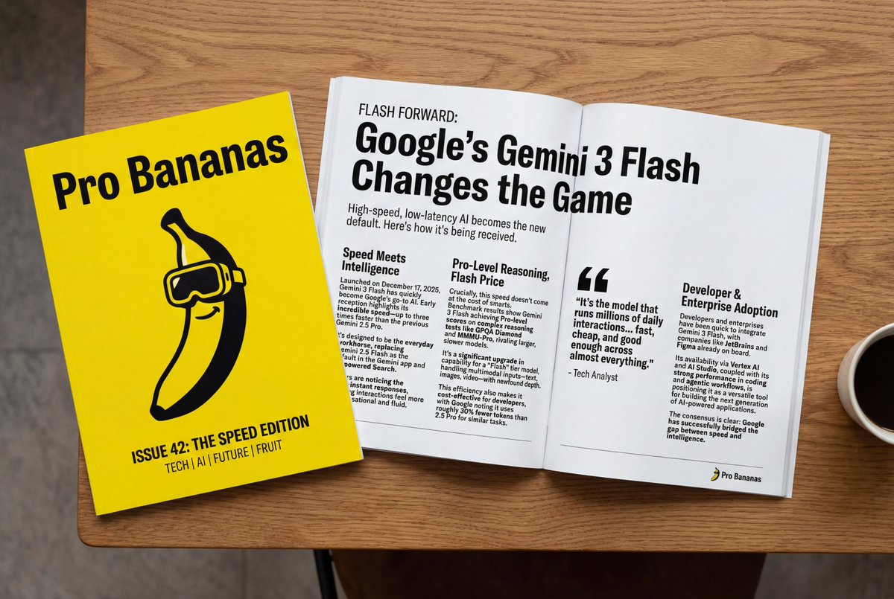
</div>

**提示词：**
```
Use search to find how the Gemini 3 Flash launch has been received. Use this information to write a short article about it (with headings). Return a photo of the article as it appeared in a glossy magazine. Show the magazine cover (Pro Bananas), and the two page spread of the article about Gemini 3 Flash.
```

**中文提示词：**
```
使用搜索功能查找“Gemini 3 Flash”发布的反响。利用这些信息撰写一篇关于此次发射的短文（需包含标题）。提交一篇刊登在精美杂志上的文章照片。请展示杂志封面（Pro Bananas）以及关于“Gemini 3 Flash”的两页文章。
```

<a id="prompt-908"></a>
## 案例 908：标本盒与现实的穿搭美学双重奏 (来源 [@LufzzLiz](https://x.com/LufzzLiz/status/2001831802269499412)) 模型：Nano banana pro

<div style="display: flex; justify-content: space-between;">
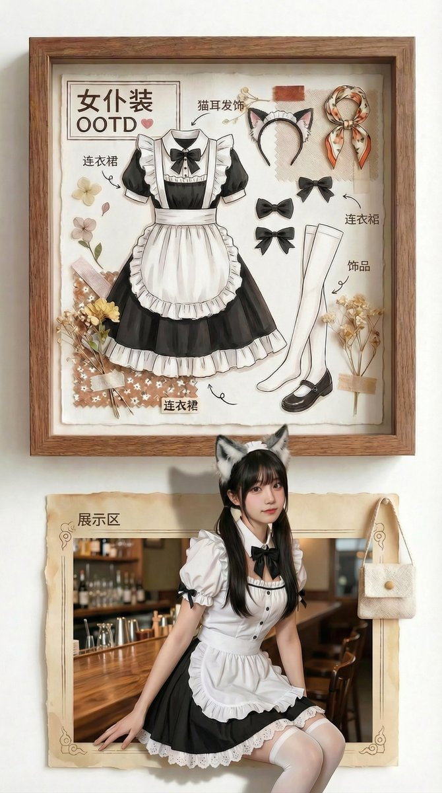
</div>

**提示词：**
```
A vertical split-screen creative product photography composition on a clean white wall background. High-resolution, photorealistic, commercial advertisement quality.

Top Section: The Specimen Box
The upper half features an exquisite light oak wooden shadow box frame mounted on the wall. Inside, a specific outfit is displayed as an artistic flat-lay museum specimen: [Insert Clothing Details Here, e.g., a sleek black satin slip dress with delicate lace trim and thin spaghetti straps]. The garments are neatly pinned in place. Surrounding them are small thematic decorative props: [Insert Props, e.g., dried roses, vintage perfume bottles, silk ribbon]. Elegant calligraphy on the matte paper backdrop reads: [Insert Text, e.g., "Midnight Elegance" or "Silk & Secrets"]. Soft studio lighting accentuates the rich texture and drape of the fabric.

Bottom Section: Naked-Eye 3D Reality
The lower half creates a hyperrealistic "naked-eye 3D" illusion. A rectangular picture-frame border sits directly beneath the top box. A stunningly realistic young woman [Insert Model Description, e.g., a poised East Asian model with long wavy black hair, subtle smoky eyes, and a confident gaze] wears the exact same outfit as shown above.

She lounges casually on the bottom edge of the frame—one leg bent with foot resting inside the frame, the other leg elegantly dangling out into the viewer’s space. Her torso leans back slightly, elbow resting on her raised knee, fingers lightly grazing the fabric near her collarbone. Her body forms a soft, sensual S-curve that highlights the garment’s silhouette without overt exposure. She looks directly at the camera with a calm, knowing smile—inviting yet enigmatic. This dynamic, lifelike pose contrasts powerfully with the static, archival display above, creating visual tension between reality and presentation.

Technical Specs:
Soft natural shadows, ambient occlusion, bright and airy yet cinematic lighting, 8K resolution, Octane Render, vivid but refined color palette, ultra-detailed fabric textures (satin sheen, lace transparency, stitching), shallow depth of field, Vogue editorial style, filmic grain, professional fashion photography.

Negative Prompt (recommended):
blurry, low-res, distorted anatomy, extra limbs, deformed hands, cartoon, anime, doll-like, plastic skin, overexposed, cluttered background, text errors, mismatched clothing, floating objects, unrealistic proportions.
参考人物，想看老师制服
```

<a id="prompt-907"></a>
## 案例 907：剪纸艺术 (来源 [@berryxia](https://x.com/berryxia/status/2002015301618294794)) 模型：Nano banana pro

<div style="display: flex; justify-content: space-between;">
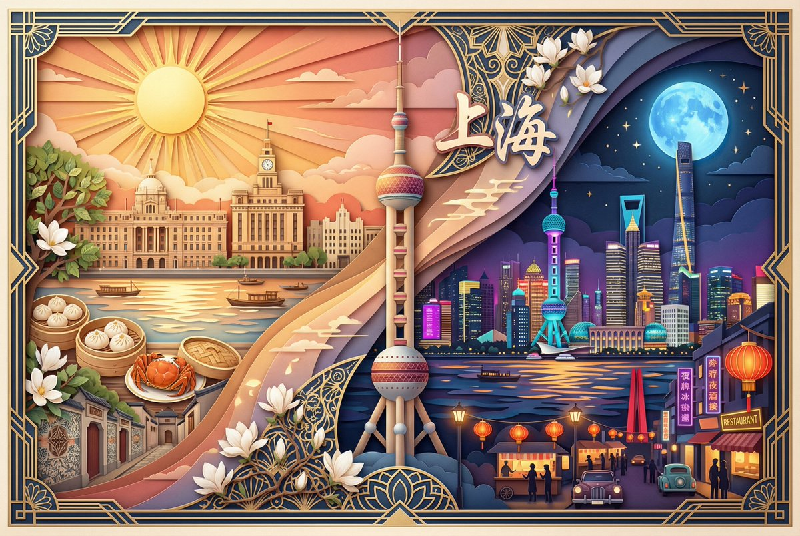
</div>

**中文提示词：**
```
Paper cut layered art: [城市名称英文] ([城市名称本地语言]) day-night elegant diagonal split (top-left→bottom-right) with soft artistic transition.
Core: ONE [标志性地标建筑] bisected diagonally with elegant gradient - warm golden tones (day side: orange, peach, coral, amber, [特色暖色]) / cool tones with rich warm lights (night side: navy, purple, midnight blue, with abundant yellow windows, red lanterns, vibrant [特色]accents).
CRITICAL AESTHETIC REQUIREMENTS:
- Beautiful, visually stunning composition
- Rich details and intricate paper cut patterns
- Elegant color harmony with [城市文化] aesthetics
- Sophisticated [文化特色] decorative elements
- High artistic value with refined craftsmanship
  Text: "[城市名称文字]" in beautiful [语言类型] calligraphy/typography, split by diagonal with elegant transition, surrounded by exquisite [本地装饰图案1], [本地装饰图案2], and [本地装饰图案3], strong dimensional depth with layered shadow effects.
  Day side (left/top): Brilliant golden sun with radiating warm rays, gorgeous warm amber/peach/coral sky with [特色氛围描述], [城市气质] sophisticated atmosphere. Beautiful daytime elements - [特色美食1] with [细节描述], [特色美食2] with [呈现方式], [特色美食3] with [艺术呈现], [其他美食]; stunning [代表性植物1] with detailed [部位] in rich [颜色], [代表性植物2] with [特征描述]; magnificent [地理特征] in bright [颜色] reflection with [细节]; [标志性建筑/场景1] with ornate details glowing in sunlight, [特色街景/场景] with refined [细节], [文化活动场景] with [描述].
  Diagonal transition: Soft gradient with twilight beauty - [过渡色1], [过渡色2], [过渡色3], [过渡色4], [过渡色5] - creating elegant natural flow [体现城市特色的过渡描述].
  Night side (right/bottom): Gorgeous blue/silver moon with ethereal glow and sparkling stars, rich deep navy and midnight blue sky with beautiful depth. Spectacular nighttime atmosphere with abundant warm light sources creating magical [文化特色] ambiance - numerous glowing yellow windows/lights creating patterns, elegant orange street lamps [位置描述], beautiful traditional red lanterns [场景描述], stunning purple-magenta [特色灯光], brilliant cyan-teal [地标灯光], golden light from [场所] glows, rich amber reflections [位置]. Night elements - dazzling illuminated [夜间地标1] with [效果], magnificent glowing [夜间地标2], charming [夜间场景] with [氛围], vibrant [夜生活描述].
  Unified elements (each appears once with elegant transition): [主要地标1] showing beautiful gradient from day to night, [主要地标2] with [细节], [地理特征] with [变化描述], [建筑群] with [风格描述], [植物] with natural beauty, [交通工具], [文化符号] with [装饰], harmonious blend of [传统特色] and [现代特色].
  Craft technique: 10-12 distinct paper layers with EXTREME pronounced depth and dimension, very thick visible edges (4-6mm thickness showing dimension), dramatic shadows creating powerful 3D sculptural relief effect, each element shows intricate multi-layer construction with refined details, ornate [文化特色] decorative patterns throughout ([图案1], [图案2], [图案3]), side-lighting creating stunning dimensional effect [强调特色].
  Format: landscape orientation, no border, no frame, elegant soft diagonal transition (clear enough to show duality but refined and artistic), sophisticated visual balance, BEAUTIFUL and STUNNING overall aesthetic capturing [城市特色].
  The artwork should be visually gorgeous, [气质形容词1], [气质形容词2] - capturing [城市核心特质描述].

{以此风格展示绘制梵高的人物展示，使用4K输出 9:16 周五就是与梵高相关的元素}
```

<a id="prompt-906"></a>
## 案例 906：和影视剧中人物自拍 (来源 [@xmiiru_](https://x.com/xmiiru_/status/2001935712275267952)) 模型：Nano banana pro

<div style="display: flex; justify-content: space-between;">
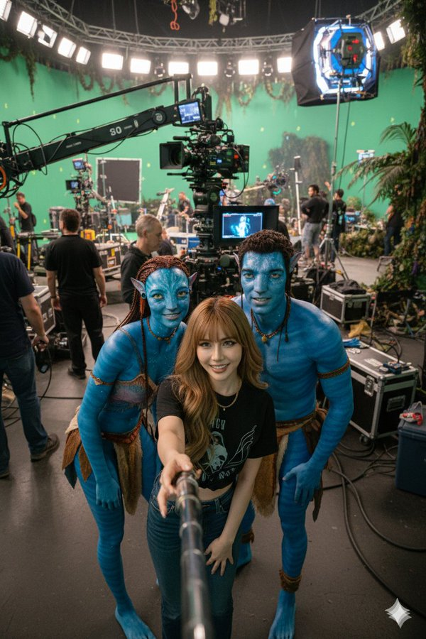
</div>

**提示词：**
```
Create a realistic first-person POV selfie as if the camera is my own eyes using a phone’s front-facing camera. The phone, my hands, and my arms must NOT be visible in the frame. Use the uploaded image as my identity reference and keep my face recognizable through perspective consistency. I am not part of the cast I’m a guest on set wearing modern, casual real-world clothing that does not match the actors’ wardrobe. The actors are aware of the selfie, standing very close to me, leaning in naturally, and looking directly into the camera as if pausing for a quick friendly shot between takes.

The framing should feel intimate and face-level, with actors filling the foreground. The background must clearly show a believable behind-the-scenes film set with cameras, crew, lighting rigs, monitors, and equipment. The image should feel candid, unpolished, and spontaneous.

Place me inside: [MOVIE OR TV SHOW NAME] (optional: cast members)
```

**中文提示词：**
```
请使用手机前置摄像头，拍摄一张逼真的第一人称视角自拍，就像用自己的眼睛拍摄一样。手机、我的手和手臂都不能出现在画面中。请使用上传的图片作为我的身份参考，并通过保持视角一致来确保我的脸部清晰可辨。我不是剧组成员，而是片场的客串演员，穿着与演员服装不同的现代休闲日常服装。演员们知道我在自拍，他们会站在我旁边，自然地靠近我，并直视镜头，就像在拍摄间隙和我友好地拍张合照一样。

构图应营造亲密感，采用平视视角，演员占据前景。背景必须清晰展现一个可信的幕后拍摄现场，包括摄像机、工作人员、灯光设备、监视器和器材。画面应给人一种自然、未经修饰、随意的感觉。

请将我放入：[电影或电视剧名称]（可选：演员表）
```

<a id="prompt-905"></a>
## 案例 905：用中国奇幻书写世界名画 (来源 [@LufzzLiz](https://x.com/LufzzLiz/status/2001637740568596705)) 模型：Nano banana pro

<div style="display: flex; justify-content: space-between;">
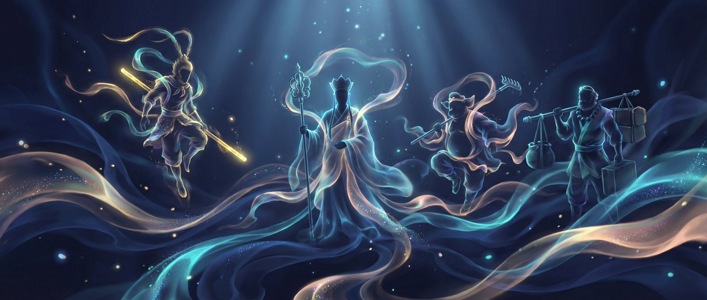
</div>

**提示词：**
```
{
"meta_info": {
"title": "Ethereal Hanfu Spirit",
"style_category": "Chinese Fantasy / Abstract Digital Art",
"aspect_ratio": "3:1"
},
"visual_elements": {
"subject": {
"description": "Silhouette wearing attire determined by the character",
"pose": "Pose determined by the character, floating in mid-air",
"composition": "Centered ethereal figure with flowing trails extending to the sides"
},
"atmosphere": {
"lighting": "Bioluminescent glow, volumetric lighting, rim lighting",
"effects": "Flowing smoke, light particles, holographic dispersion, silk-like energy trails",
"colors": ["Deep Navy Blue", "Glowing Cyan", "Iridescent Gold", "Soft Peach"]
}
},
"prompt_export": {
"natural_language_prompt": "A wide panoramic digital artwork depicting a figure composed of flowing ribbons of light, translucent smoke, and iridescent particles. The background features deep, moody indigo and dark blue tones. The figure emits a soft, magical bioluminescent glow in hues of gold, peach, and cyan. The overall style is abstract fantasy, emphasizing fluid motion and a dreamy atmosphere, rendered in 8K resolution with highly detailed textures and exhibiting the Tyndall effect.",
"tag_based_prompt": " silhouette, flowing light lines, smoke effects, particle effects, bioluminescence, iridescent effects, dark blue background, cinematic lighting, ethereal, mystical, masterpiece, best quality, 8k, wide angle --ay 21:9 ",
"negative_prompt": "photorealistic, solid skin, heavy outlines, messy lines, text, watermark, low quality, jpeg artifacts, blurry, distorted face, bad anatomy"
},
"technical_settings_recommendation": {
"sampler": "Euler a / DPM++ 2M Karras",
"steps": 30,
"cfg_scale": 7.0,
"model_suggestion": "Niji 6 (for Midjourney) or Abstract/Fantasy-based SDXL models"
}
}
角色设为： 西游记师徒四人
```

<a id="prompt-904"></a>
## 案例 904：维多利亚哥特皇室写真照 (来源 [@songguoxiansen](https://x.com/songguoxiansen/status/2001828831615946768)) 模型：Nano banana pro

<div style="display: flex; justify-content: space-between;">
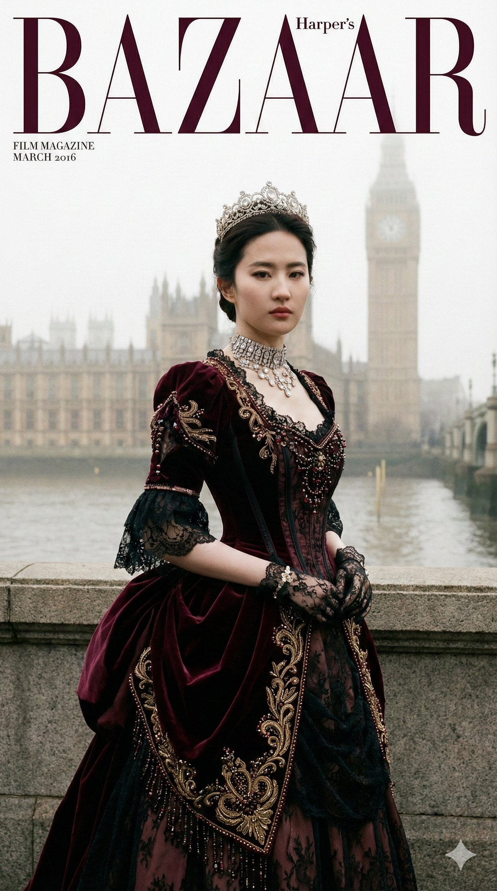
</div>

**中文提示词：**
```
生成一张 9:16 竖版「维多利亚哥特皇室」写实照片：以我上传的 FACE_REF 为人物身份参考，100%还原五官与骨相；人物身穿“维多利亚时代（19世纪）宫廷礼服方向”的重工礼服（紧身胸衣、大裙撑、蕾丝/天鹅绒、皇室珠宝），在伦敦塔桥或威斯敏斯特宫（大本钟）旁拍摄。画面具备《Harper’s Bazaar》级别的摄影、造型与封面设计，保持杂志的一贯设计风格（中英文设计）。

【INPUTS | 输入】
FACE_REF：我上传的人物五官参考图（身份锁定）

【ABSOLUTE PRIORITY | 身份锁定（最高优先级）】
100%还原 FACE_REF 的五官与骨相：眼距、鼻梁鼻翼、唇形、下颌线、颧骨结构完全一致，不得漂移。
真实皮肤质感：可见细微纹理与毛孔，不要过度磨皮与网红化。
成年女性形象（adult）。

【SHOT TYPE | 景别二选一（由模型随机选其一，且必须真实统一）】
A) 半身封面：胸口到腰上方，珠宝、蕾丝领口与眼神最清晰（主推）
B) 全身封面：从头到脚完整呈现巨大的裙撑轮廓与伦敦地标的结合，透视感强（备选）
（无论A/B：都必须保持“封面构图”，有留白空间给排版，但不要撕纸/手绘效果。）

【LOCATION | 场景（英国伦敦）】
伦敦地标：泰晤士河畔，背景是宏伟的哥特式建筑威斯敏斯特宫（大本钟）或 伦敦塔桥的塔楼。
天气二选一（随机）：1) 伦敦雾霭（经典的雾都质感，光线柔和神秘） 2) 阴雨方歇（地面湿润反光，天空呈铅灰色）
背景干净：无游客、无现代标识、无手机状态栏UI、无水印字幕。

【LIGHTING & CAMERA | 摄影质感（杂志级）】
镜头感：85mm人像质感（半身）或 50mm/70mm（全身），浅景深，眼睛最清晰。
光线：阴天漫射光 + 戏剧性补光（强调面部结构）；钻石/宝石有真实火彩；天鹅绒质感深邃。
色彩：高级电影感，低饱和度的蓝灰环境色与服装的深色调（红/蓝/黑）形成哥特美学；整体干净、通透、贵气。

【WARDROBE | 维多利亚宫廷礼服（重工、塑形、繁复细节）】
目标审美：“蜂腰、大裙摆、层叠蕾丝、重磅天鹅绒、皇冠、女王气场”。

轮廓与层次（X型剪裁）
上身：结构感极强的紧身胸衣（Corset），方领或高领，泡泡袖或羊腿袖
下身：巨大的裙撑（Crinoline 或 Bustle），后腰部有明显的堆叠设计，裙摆拖地
装饰：大量的荷叶边、蝴蝶结、垂坠的流苏
面料与工艺（重手艺必须“看得见”）
主面料：重磅丝绒、塔夫绸、尚蒂伊蕾丝（Chantilly Lace）
主要工艺：珠绣、金线刺绣、缎带编织
纹样主题：大马士革纹（Damask）、玫瑰、蓟花（苏格兰象征）、佩斯利纹
细节：蕾丝手套、颈饰（Choker）、勋章/胸针
头面（皇室珠宝头饰）
核心结构：维多利亚式小王冠（Tiara）或 羽毛头饰
装饰：钻石、蓝宝石、珍珠
耳饰/颈饰：极度夸张的钻石项链、耳坠

【COLOR MATRIX | 颜色矩阵搭配（必须执行，且必须“皇室深色”）】
（维多利亚晚期的深沉奢华）
从以下三套“主色方案”中随机选 1 套作为【底色/大面积主面料色】。

Scheme G（皇室蓝底）：
底色：深宝蓝/午夜蓝（丝绒质感）
刺绣/装饰：银色蕾丝、钻石、蓝宝石
Scheme A（维多利亚红底）：
底色：酒红/勃艮第红（深沉热情）
刺绣/装饰：黑色蕾丝、金色刺绣、红宝石
Scheme R（丧服黑底）：
底色：墨黑（Black Jet，极度哥特）
刺绣/装饰：黑色串珠、黑色蕾丝、少量金色或银色提亮

【颜色执行规则】
色彩要深沉浓郁，体现“日不落”的威严和哥特式的神秘。

【POSE | 封面姿态（威严、僵直、女王感）】
半身：下巴微扬，眼神冷峻，一手轻抚项链
全身：站姿挺拔（像肖像画一样），双手交叠在裙撑上，气场压倒一切
表情：严肃、高傲、不可一世；绝对不笑（维多利亚风格）。

【OUTPUT | 输出】
1 张 9:16 竖版写实杂志封面级照片
随机：半身 or 全身（A/B二选一）
随机：雾霭 or 阴雨（天气二选一）
随机：宝蓝 / 酒红 / 墨黑（颜色矩阵三选一）
造型：维多利亚宫廷礼服方向 + 皇冠/Choker + 紧身胸衣大裙撑 + 丝绒蕾丝
```

<a id="prompt-903"></a>
## 案例 903：提示词小子讽刺漫画 (来源 [@dotey](https://x.com/dotey/status/2001334145386189179)) 模型：Nano banana pro

<div style="display: flex; justify-content: space-between;">
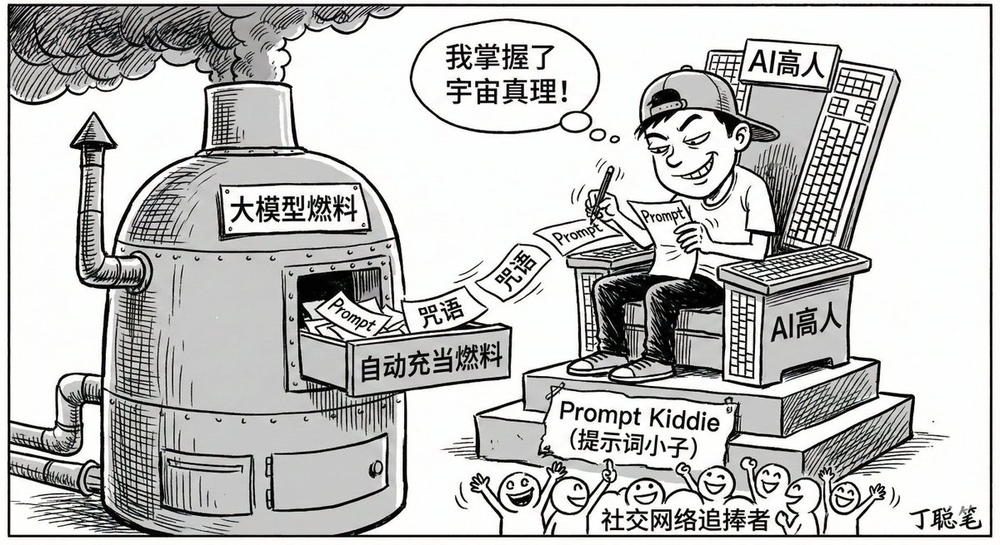
</div>

**中文提示词：**
```
以丁聪的风格画一幅讽刺漫画，主题是：
> 今天社交网络上被追捧的所谓AI高人,不过是 Prompt Kiddie(提示词小子)。
> 整天转帖一些提示词,其实是在自动充当大模型的燃料。
```

<a id="prompt-902"></a>
## 案例 902：圣诞场景的圣诞贺卡 (来源 [@NanoBanana](https://x.com/NanoBanana/status/2001234210409857077)) 模型：Nano banana pro

<div style="display: flex; justify-content: space-between;">
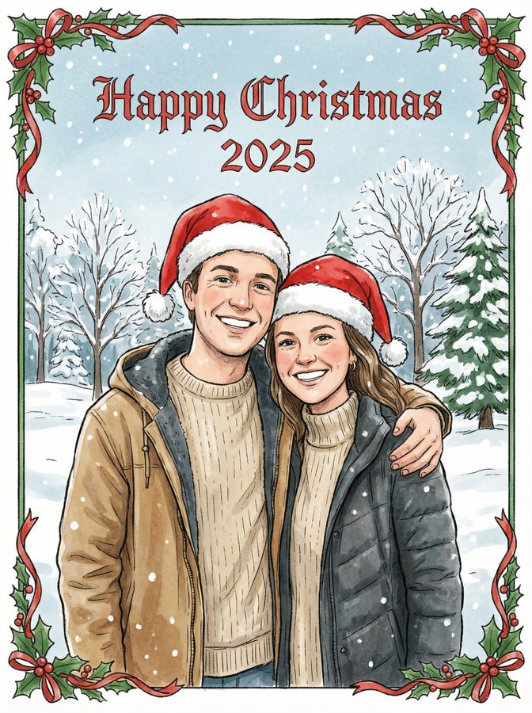
</div>

**提示词：**
```
a faithfully illustrated Christmas card design featuring the couple in Christmas hats, and the text "Happy Christmas 2025", it is friendly and traditional, with a classical design, in a winter wonderland
```

**中文提示词：**
```
一张忠实描绘圣诞场景的圣诞贺卡设计，卡片上这对夫妇戴着圣诞帽，并写着“2025圣诞快乐”。设计风格温馨传统，采用经典的冬日仙境风格。
```

<a id="prompt-901"></a>
## 案例 901：金发女子自拍照 (来源 [@brindleyai](https://x.com/brindleyai/status/2001200342864667035)) 模型：Nano banana pro

<div style="display: flex; justify-content: space-between;">
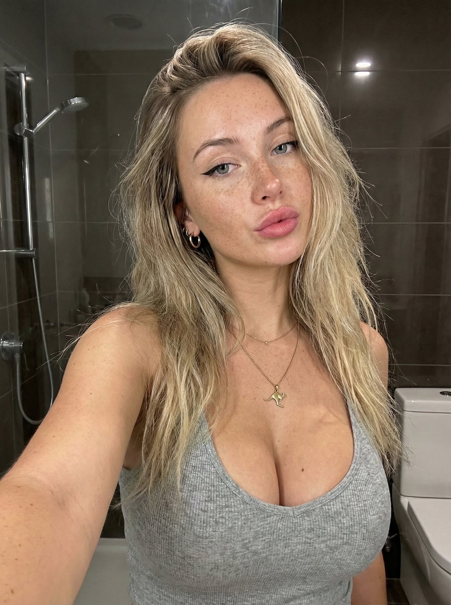
</div>

**提示词：**
```
{
"subject": {
"demographics": "Young female, approx 20-24 years old, Caucasian.",
"hair": {
"color": "Dirty blonde to light blonde gradient.",
"style": "Long, straight with slight wave, layered, casual parting.",
"texture": "Soft, natural strands, slightly tousled, roots visible.",
"movement": "Falling naturally over shoulders and back."
},
"face": {
"shape": "Oval with soft jawline.",
"eyes": "Almond-shaped, light blue/grey irises, distinct sharp black winged eyeliner.",
"nose": "Button nose, soft bridge.",
"lips": "Full, plump, rosy pink, slightly parted in a pouty expression.",
"skin_details": "Prominent, heavy freckles across nose and cheeks. Smooth texture but with realistic skin grain. Natural blush.",
"micro_details": "Mole on right upper chest, mole on left shoulder."
},
"body_proportions": {
"build": "Voluminous, curvy, heavy bust.",
"chest": "Large bust volume, prominent forward projection, deep cleavage visible.",
"waist_to_chest_ratio": "Significantly wider chest width compared to waist implies hourglass figure.",
"shoulders": "Soft, rounded, natural slope.",
"dominance": "Upper torso volume visually dominates the frame."
},
"clothing": {
"top": "Heather grey ribbed knit tank top/camisole.",
"fit": "Tight, form-fitting, stretching over chest volume, low scoop neckline.",
"straps": "Thick straps, sitting securely on shoulders."
},
"accessories": {
"jewelry": {
"Small gold hoop earrings.",
"Gold chain necklace with a small 'G' letter pendant.",
"Longer thin gold chain with a distinct kangaroo pendant."
}
}
},
"pose": {
"type": "Handheld selfie perspective.",
"orientation": "Frontal close-up, slightly angled from above.",
"head_position": "Tilted slightly to subject's right.",
"limbs": "Right arm extended forward (out of frame) indicating holding the camera.",
"gaze": "Direct eye contact with lens, alluring and confident.",
"spine_curvature": "Slight arch implied by chest prominence."
},
"setting": {
"environment": "Domestic bathroom.",
"background_elements": "Dark brown/grey glossy tiled wall, chrome shower fixture visible on left, top of white ceramic toilet tank visible on right.",
"depth": "Shallow depth of field, background elements slightly out of focus."
},
"camera": {
"shot_type": "Close-up, selfie portrait.",
"angle": "High angle (slightly above eye level), typical of smartphone selfies.",
"focal_length": "24mm to 28mm equivalent (wide angle smartphone lens).",
"framing": "Chest-up shot, cropping at mid-torso.",
"focus": "Sharp focus on eyes and face, slight fall-off on shoulders.",
"perspective": "Slight foreshortening of the extended arm side."
},
"lighting": {
"source": "Soft, diffused overhead ambient bathroom lighting.",
"direction": "Front-top lighting.",
"highlights": "Soft specular highlights on forehead, tip of nose, chin, and upper chest curves.",
"shadows": "Soft shadows under the chin and defining the cleavage depth.",
"quality": "Natural, flattering, no harsh contrast."
},
"mood_and_expression": {
"tone": "Casual, sultry, confident.",
"expression": "Relaxed pout, 'cool girl' aesthetic.",
"atmosphere": "Intimate, candid."
},
"style_and_realism": {
"style": "Photorealistic, social media aesthetic.",
"fidelity": "High fidelity skin texture, no airbrushing.",
"imperfections": "Visible freckles, stray hairs, natural skin variation preserved."
},
"colors_and_tone": {
"palette": "Neutral tones (grey, beige, skin tones) with pops of blue (eyes) and gold (jewelry).",
"skin_tone": "Fair to light tan, warm undertones.",
"white_balance": "Slightly warm, indoor tungsten mix.",
"saturation": "Natural, slightly vibrant lips and eyes.",
"contrast": "Medium contrast."
},
"technical_details": {
"aspect_ratio": "3:4",
"resolution": "High resolution, sharp details.",
"noise": "Slight digital noise characteristic of phone camera sensors in indoor light."
}
}
```

**中文提示词：**
```
{
“主题”： {
“人口统计信息”：“年轻女性，大约20-24岁，白种人。”
“头发”： {
颜色：从脏金色到浅金色的渐变色。
发型：长直发，略带波浪，层次分明，随意分缝。
“质感”：“柔软自然的发丝，略显蓬松，发根可见。”
“动作”：“自然地垂落在肩膀和背部。”
},
“脸”： {
“脸型”：“椭圆形，下颌线条柔和。”
“眼睛”：“杏仁状，浅蓝灰色虹膜，清晰锐利的黑色上扬眼线。”
“鼻子”：“小巧的鼻子，柔和的鼻梁。”
“嘴唇”：“饱满、丰润、呈玫瑰粉色，微微张开，带着一丝嘟嘴的表情。”
“皮肤细节”： “鼻子和脸颊上有明显的、较多的雀斑。质地光滑，但保留了真实的皮肤纹理。自然的红晕。”
"micro_details": "右胸上方有一颗痣，左肩上有一颗痣。"
},
"body_proportions": {
体型：丰满、曲线优美、胸部丰满。
“胸部”：“胸部丰满，胸部前凸明显，乳沟深邃可见。”
腰胸比：胸部宽度明显大于腰部宽度，表明身材呈沙漏形。
“肩部”：“柔和、圆润、自然的坡度。”
“主导性”：“上半身的体积在视觉上主导了画面。”
},
“衣服”： {
上衣：浅灰色罗纹针织背心/吊带衫。
“合身”：紧身、贴合胸部曲线，低圆领。
“肩带”：“厚实的肩带，牢牢地贴在肩膀上。”
},
“配件”： {
“珠宝”： {
“小金圈耳环。”
“金链项链，配有一个小小的字母‘G’吊坠。”
“较长的细金链，配有独特的袋鼠吊坠。”
}
}
},
"姿势": {
类型：手持自拍视角。
“方向”：“正面特写，略微从上方倾斜。”
“头部位置”： “略微向拍摄对象的右侧倾斜。”
四肢：右臂向前伸展（超出画面），表示正在握持相机。
“凝视”：“通过镜头直接与眼睛对视，充满魅力和自信。”
"spine_curvature": "胸部突出所暗示的轻微弧度。"
},
“环境”： {
“环境”：“家用浴室。”
"background_elements": "深棕色/灰色光面瓷砖墙，左侧可见镀铬淋浴装置，右侧可见白色陶瓷马桶水箱顶部。"
“景深”：“浅景深，背景元素略微失焦。”
},
“相机”： {
"shot_type": "特写，自拍肖像。"
“角度”：“高角度（略高于视线水平），是智能手机自拍的典型角度。”
"focal_length": "24mm 至 28mm 等效焦距（广角智能手机镜头）",
“构图”：“胸部以上镜头，裁剪至躯干中部。”
“焦点”：“眼睛和脸部清晰聚焦，肩膀略微虚化。”
“透视”：“伸展的手臂一侧略微缩短。”
},
“灯光”： {
光源：柔和、漫射的浴室顶灯。
“方向”：“前上照明。”
“高光”：“额头、鼻尖、下巴和上胸曲线处的柔和镜面高光。”
“阴影”：“下巴下方柔和的阴影勾勒出乳沟的深度。”
“品质”：“自然、讨喜、无强烈对比。”
},
"mood_and_expression": {
语气：随意、性感、自信。
“表情”：“放松的嘟嘴，‘酷女孩’风格。”
“氛围”：“亲密、坦诚。”
},
"风格与现实主义": {
风格：写实风格，社交媒体美学。
“真实感”： “高保真度的皮肤纹理，无修图。”
“瑕疵”：“可见的雀斑、杂乱的毛发、自然的肤色差异均得以保留。”
},
"colors_and_tone": {
“调色板”：“以中性色调（灰色、米色、肤色）为主，点缀以蓝色（眼妆）和金色（珠宝）。”
“肤色”: “白皙至浅棕色，暖色调。”
“白平衡”: “略微偏暖的室内钨丝灯混合模式。”
“饱和度”：“自然、略带活力的唇部和眼部。”
“对比度”: “中等对比度。”
},
"technical_details": {
"aspect_ratio": "3:4",
分辨率：高分辨率，细节清晰。
“噪声”: “室内光线下手机摄像头传感器特有的轻微数字噪声。”
}
}
```