<a id="readme-top"></a>
# 欢迎来到 Nano Banana(nanobanana)/GPT-5/GPT‑4o/豆包 图片提示词（Prompts）精选！

🎉 在线演示地址：https://www.aipipixia.online/

---
## 获取最新提示词？你可以通过这3个渠道。
<div style="width: 98%;">
<table>
  <tr>
    <!-- 左侧文字单元格 -->
    <td style="width: 60%; padding: 2px; vertical-align: middle; border: none;">
      <p>1、微信公众号：未来职场AI学堂</p><p>2、扫一扫，拉你进大群《AI技术学习交流群》</p>
    </td>
    <!-- 右侧图片单元格 -->
    <td>
      
    </td>
  </tr>
</table>
</div>

---

<a id="prompt-toc"></a>
## 📖 案例目录
*   [案例 200：真人和风格对照直出 ](#prompt-200)
*   [案例 199：自定义纹理的复古玩具 ](#prompt-199)
*   [案例 198：可爱的设计师玩偶 ](#prompt-198)
*   [案例 197：数字粘土雕塑 ](#prompt-197)
*   [案例 196：字母景观 ](#prompt-196)
*   [案例 195：经典的微型玩具风格 ](#prompt-195)
*   [案例 194：装饰艺术未来主义 ](#prompt-194)
*   [案例 193：将您的徽标放在月球上 ](#prompt-193)
*   [案例 192：月光屋顶茶话会 ](#prompt-192)
*   [案例 191：后世界末日氛围 ](#prompt-191)
*   [案例 190：品牌虚拟人物 ](#prompt-190)
*   [案例 189：心爱的角色制作动漫风格的签名 ](#prompt-189)
*   [案例 188：微型毛毡羊毛人物 ](#prompt-188)
*   [案例 187：新卡通风格 ](#prompt-187)
*   [案例 186：装饰艺术大都会 ](#prompt-186)
*   [案例 185：人体工程学 ](#prompt-185)
*   [案例 184：乐高风格套装 ](#prompt-184)
*   [案例 183：霓虹效果海报 ](#prompt-183)
*   [案例 182：鸟类羽毛制成LOGO ](#prompt-182)
*   [案例 181：抽象液体排版文字 ](#prompt-181)
*   [案例 180：可爱粉彩乙烯基人物 ](#prompt-180)
*   [案例 179：创建多种3D风格头像 ](#prompt-179)
*   [案例 178：生物发光 ](#prompt-178)
*   [案例 177：2D单词海报设计 ](#prompt-177)
*   [案例 176：三维几何效果 ](#prompt-176)
*   [案例 175：半透明晶体效果 ](#prompt-175)
*   [案例 174：生成电影氛围图 ](#prompt-174)
*   [案例 173：复古风格图标 ](#prompt-173)
*   [案例 172：棱柱形水晶 ](#prompt-172)
*   [案例 171：霓虹灯品牌重新构想 ](#prompt-171)
*   [案例 170：新卡通风格 ](#prompt-170)
*   [案例 169：微型透明胶囊 ](#prompt-169)
*   [案例 168：水果蜡烛 ](#prompt-168)
*   [案例 167：液态金属设计产品 ](#prompt-167)
*   [案例 166：几何禅 ](#prompt-166)
*   [案例 165：用气泡膜覆盖表情符号 ](#prompt-165)
*   [案例 164：将表情符号变成纸板 ](#prompt-164)
*   [案例 163：半透明玻璃物品ASMR ](#prompt-163)
*   [案例 162：超现实主义蒸汽波 ](#prompt-162)
*   [案例 161：物品纹理处理 ](#prompt-161)
*   [案例 160：新动漫风格 ](#prompt-160)
*   [案例 159：渲染宝石 ](#prompt-159)
*   [案例 158：品牌3D卡通动物角色 ](#prompt-158)
*   [案例 157：最小天气小部件 ](#prompt-157)
*   [案例 156：作为家具的著名地标 ](#prompt-156)
*   [案例 155：自己的国家地标时尚杂志 ](#prompt-155)
*   [案例 154：五颜六色的针织 ](#prompt-154)
*   [案例 153：霓虹灯线框 ](#prompt-153)
*   [案例 152：新动漫风格 ](#prompt-152)
*   [案例 151：Neoglo风格Logo ](#prompt-151)
*   [案例 150：乙烯基玩具 ](#prompt-150)
*   [案例 149：Gorillaz风格角色 ](#prompt-149)
*   [案例 148：怀旧午后阳光 ](#prompt-148)
*   [案例 147：玻璃变形海报 ](#prompt-147)
*   [案例 146：全息叠加效果彩虹渐变 ](#prompt-146)
*   [案例 145：用自己的审美下棋 ](#prompt-145)
*   [案例 144：梦幻般的蒸汽波失真 ](#prompt-144)
*   [案例 143：迪士尼鸡尾酒 ](#prompt-143)
*   [案例 142：为任何品牌设计运动鞋 ](#prompt-142)
*   [案例 141：监控级别的时尚洞察力 ](#prompt-141)
*   [案例 140：现代数字动漫风格 ](#prompt-140)
*   [案例 139：将您最喜欢的品牌变成生活方式产品 ](#prompt-139)
*   [案例 138：Gumroad样式图标 ](#prompt-138)
*   [案例 137：透视一切 ](#prompt-137)
*   [案例 136：日常用品有皮肤 ](#prompt-136)
*   [案例 135：棱柱形玻璃图标 ](#prompt-135)
*   [案例 134：生成真实电影海报 ](#prompt-134)
*   [案例 133：幽灵形态 ](#prompt-133)
*   [案例 132：悬浮魔幻现实主义 ](#prompt-132)
*   [案例 131：自定义毛绒钥匙扣 ](#prompt-131)
*   [案例 130：创建超现实不可能的图像 ](#prompt-130)
*   [案例 129：创建悬浮切片水果 ](#prompt-129)
*   [案例 128：一个字的无限反射 ](#prompt-128)
*   [案例 127：符号冲突 ](#prompt-127)
*   [案例 126：重新构想的超现实主义广告 ](#prompt-126)
*   [案例 125：时尚品牌娃娃 ](#prompt-125)
*   [案例 124：磨砂模糊剪影 ](#prompt-124)
*   [案例 123：植物雕塑 ](#prompt-123)
*   [案例 122：史莱姆制成的玩具运输车 ](#prompt-122)
*   [案例 121：文艺复兴时期的解剖学研究 ](#prompt-121)
*   [案例 120：奇趣风格3D乙烯基玩具 ](#prompt-120)
*   [案例 119：城市绣花贴纸照片 ](#prompt-119)
*   [案例 118：品牌产品数字广告 ](#prompt-118)
*   [案例 117：动漫机甲风格化机械设计图 ](#prompt-117)
*   [案例 116：任天堂风格的3D卡通插画 ](#prompt-116)
*   [案例 115：冰爽优雅的产品海报 ](#prompt-115)
*   [案例 114：Monochrome LCD效果 ](#prompt-114)
*   [案例 113：发光图标 ](#prompt-113)
*   [案例 112：重点线条勾勒 ](#prompt-112)
*   [案例 111：3D超写实场景模型 ](#prompt-111)
*   [案例 110：皮克斯风格角色表 ](#prompt-110)
*   [案例 109：涂料飞溅Logo ](#prompt-109)
*   [案例 108：标志液化 ](#prompt-108)
*   [案例 107：超级动物英雄 ](#prompt-107)
*   [案例 106：时间之神 ](#prompt-106)
*   [案例 105：刺绣logo ](#prompt-105)
*   [案例 104：珐琅马赛克瓷砖风格 ](#prompt-104)
*   [案例 103：刺绣风格 ](#prompt-103)
*   [案例 102：纹理化图片 ](#prompt-102)
*   [案例 101：将你的Logo变成吉祥物 ](#prompt-101)
---
<a id="prompt-200"></a>
## 案例 200：真人和风格对照直出 (来源 [@ZHO_ZHO_ZHO](https://x.com/ZHO_ZHO_ZHO/status/1935620536090153216))

<div style="display: flex; justify-content: space-between;">
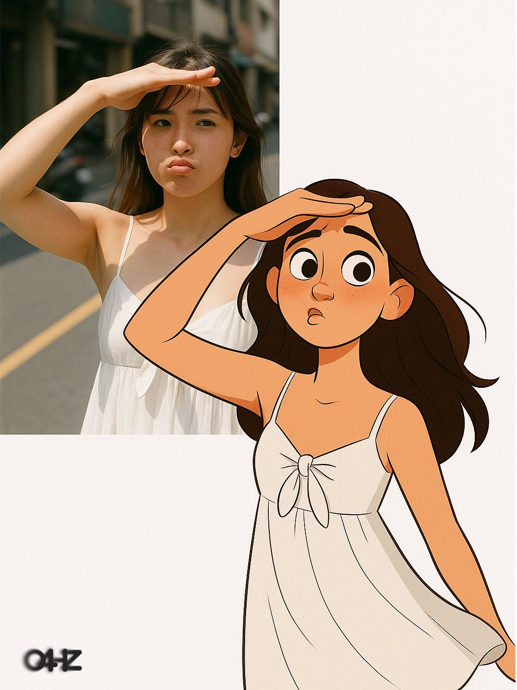
</div>

**提示词：**
```
创建图片 {
"title": "真人 × 动画对照创意作品",
"author": "ZH4O",
"description": "一张利用垂直拼贴与留白，将同一人物的照片与插画并置的创意作品，突出媒介在语言、质感与情绪上的对比。",
"layout": {
"orientation": "vertical",
"photo": {
"position": "top-left",
"aspect_ratio": "3:4",
"style": "street photo",
"camera_angle": "eye-level, slightly tilted left",
"lens": "mild wide-angle",
"background_elements": ["road", "store signs", "urban perspective lines"]
},
"illustration": {
"position": "bottom-right",
"scale": "slightly larger",
"composition": "2/3 body, medium shot",
"pose": "similar to photo",
"motion_direction": "curve extending top-right",
"balance": "forms visual counterpoint to photo"
},
"background": {
"color": "pure white",
"purpose": "breathing space, minimalism, focus"
}
},
"color_and_lighting": {
"photo": {
"dominant_tones": "neutral warm gray",
"light_source": "natural light",
"highlight_effects": "soft overexposure, summer glare",
"key_elements": ["white dress with gauzy texture", "cement, scooter, wall as low-saturation backdrop"]
},
"illustration": {
"style": "cartoon, simplified color blocks",
"skin": "warm orange with soft pink blush",
"hair": "deep brown, almost flat color",
"dress": "white with minimal shading to indicate folds",
"contrast": "high, compressed tonal range",
"focus": "sharp character silhouette"
},
"background": {
"function": "isolates media contrast, emphasizes character and action"
}
},
"style_comparison_and_details": {
"photo": {
"gesture": "hand shading forehead",
"expression": "wide eyes, slightly pouting lips, playful with a hint of exasperation",
"context": "spontaneous, tight alley space, loose hair movement"
},
"illustration": {
"design_inspiration": "Disney/CalArts style",
"features": ["large eyes", "wide cheekbones", "pointy chin", "freckles", "blush"],
"motion_effects": "exaggerated hair and skirt movement",
"line_quality": "fluid and bouncy",
"reproduction": "pose, expression, dress bow, forehead hair accurately translated"
}
},
"visual_and_communication_value": {
"themes": ["reality to animation transformation", "character design", "personified self-portrait"],
"usability": ["IP development", "illustration demo", "fashion branding"],
"design_elements": ["space for text/logo", "poster/social media-ready"],
"narrative_strength": "uses white space as frame, pose as link, and medium contrast as core interest",
"tone": "light, stylish, socially shareable"
}
}
```

**中文提示词：**
```
创建图片 {
“title”： “真人 × 动画对照创意作品”，
“author”： “ZH4O”， ZH4O“， ZH4O
“description”： “一张利用垂直拼贴与留白，将同一人物的照片与插画并置的创意作品，突出媒介在语言、质感与情绪上的对比。",
“布局”： {
“orientation”： “垂直”，
“照片”： {
“position”： “左上角”，
“aspect_ratio”： “3：4”，
“style”： “街拍”，
“camera_angle”： “与眼睛齐平，略微向左倾斜”，
“lens”： “轻度广角”，
“background_elements”： [“road”， “shop signs”， “urban perspective lines”]
},
“插图”： {
“position”： “右下角”，
“scale”： “稍大”，
“composition”： “2/3 体，中镜头”，
“pose”： “与照片相似”，
“motion_direction”： “曲线向右延伸”，
“balance”： “形成与照片的视觉对位”
},
“背景”： {
“color”： “纯白色”，
“purpose”： “呼吸空间、极简主义、专注”
}
},
“color_and_lighting”： {
“照片”： {
“dominant_tones”： “中性暖灰色”，
“light_source”： “自然光”，
“highlight_effects”： “柔和的过度曝光，夏季眩光”，
“key_elements”： [“带有薄纱纹理的白色连衣裙”， “水泥、滑板车、墙壁作为低饱和度背景”]
},
“插图”： {
“style”： “卡通，简化的色块”，
“skin”： “暖橙色带柔和的粉红色腮红”，
“hair”： “深棕色，几乎是单色”，
“dress”： “白色，带有最小阴影以表示褶皱”，
“contrast”： “高、压缩的色调范围”，
“focus”： “清晰的角色剪影”
},
“背景”： {
“function”： “隔离媒体对比度，强调角色和动作”
}
},
“style_comparison_and_details”： {
“照片”： {
“gesture”： “手部阴影额头”，
“expression”： “睁大眼睛，微微撅起嘴唇，俏皮中带着一丝恼怒”，
“context”： “自发、狭窄的小巷空间、松散的头发移动”
},
“插图”： {
“design_inspiration”： “Disney/CalArts 风格”，
“features”： [“大眼睛”， “宽颧骨”， “尖下巴”， “雀斑”， “腮红”]，
“motion_effects”： “夸张的头发和裙子运动”，
“line_quality”： “流体和弹性”，
“reproduction”： “姿势、表情、裙子蝴蝶结、额头头发准确翻译”
}
},
“visual_and_communication_value”： {
“themes”： [“从现实到动画的转变”， “角色设计”， “拟人化自画像”]，
“可用性”： [“IP 开发”， “插图演示”， “时尚品牌”]，
“design_elements”： [“文本/徽标空间”， “海报/社交媒体就绪”]，
“narrative_strength”： “使用空白作为框架，使用姿势作为链接，使用中等对比度作为核心兴趣”，
“tone”： “轻盈、时尚、社交分享”
}
}
```

<a id="prompt-199"></a>
## 案例 199：自定义纹理的复古玩具 (来源 [@_abranko_](https://x.com/_abranko_/status/1938936595257688552))

<div style="display: flex; justify-content: space-between;">
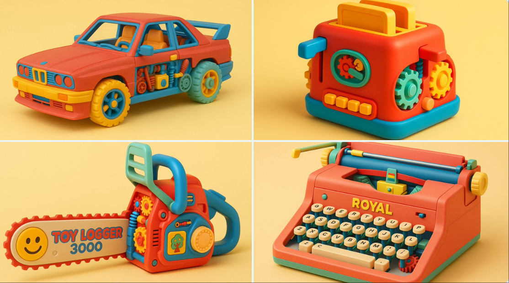

</div>

**提示词：**
```
Retexture the uploaded image based on the JSON

{
  "materials": {
    "exterior": "matte injection-molded plastic",
    "interior": [
      "blocky colored plastic parts",
      "oversized gears",
      "simple rods",
      "basic springs",
      "toy decals"
    ]
  },
  "lighting": {
    "type": "studio soft light",
    "direction": "top and front fill",
    "color": "warm daylight",
    "mood": "nostalgic, cheerful"
  },
  "background": {
    "type": "solid",
    "color": "pastel yellow"
  },
  "camera": {
    "angle": "eye-level side",
    "focus": "medium sharp",
    "depth_of_field": "deep"
  },
  "color_palette": {
    "dominant": ["red", "blue", "yellow"],
    "accents": ["mint green", "white", "peach"]
  },
  "vibe": "1980s retro toy, nostalgic, playful"
}
```

**中文提示词：**
```
根据 JSON 对上传的图片进行重新纹理处理

{
“材料”： {
“exterior”： “哑光注塑成型塑料”，
“interior”：[
“块状彩色塑料件”，
“超大齿轮”，
“简单杆”，
“基本弹簧”，
“玩具贴花”
    ]
  },
“照明”： {
“type”： “工作室柔光”，
“direction”： “顶部和前部填充”，
“color”： “暖日光”，
“mood”： “怀旧的、欢快的”
  },
“背景”： {
“type”： “solid”， //类型
“color”： “柔和的黄色”
  },
“相机”： {
“angle”： “与眼睛齐平的一侧”，
“focus”： “中等锐化”，
“depth_of_field”： “deep”
  },
“color_palette”： {
“主导”： [“红”， “蓝”， “黄”]，
“accents”： [“薄荷绿”， “白色”， “桃子”]
  },
“vibe”： “1980 年代复古玩具，怀旧，俏皮”
}
```

<a id="prompt-198"></a>
## 案例 198：可爱的设计师玩偶 (来源 [@TheRelianceAI](https://x.com/TheRelianceAI/status/1936423426006151467))

<div style="display: flex; justify-content: space-between;">


</div>

**提示词：**
```
A cute designer doll styled as a [SUBJECT]. The doll has a porcelain face with blush, soft curly white hair, and large expressive eyes with unique pupils (like a star and moon). It wears a fluffy pastel-colored costume resembling the [chosen creature or idea], with detailed accessories like a hood with ears or horns, lace, and a ribbon. Embroidery on the paws reflects the character’s theme. The doll is sitting on a neutral background (like beige leather or soft fabric). The atmosphere is dreamy and whimsical, with soft lighting. Style: Korean collectible art doll, highly detailed, pastel color palette.
```

**中文提示词：**
```
一个可爱的设计师玩偶，造型为 [SUBJECT]。娃娃有一张瓷脸，脸上泛着腮红，柔软的卷曲白发，还有一双富有表现力的大眼睛和独特的瞳孔（像星星和月亮）。它穿着一件蓬松的柔和色服装，类似于 [选择的生物或想法]，带有详细的配饰，如带耳朵或角的兜帽、蕾丝和丝带。爪子上的刺绣反映了角色的主题。娃娃坐在中性背景上（如米色皮革或柔软的织物）。气氛梦幻而异想天开，灯光柔和。风格：韩国收藏艺术娃娃，高度详细，柔和的调色板。
```

<a id="prompt-197"></a>
## 案例 197：数字粘土雕塑 (来源 [@azed_ai](https://x.com/azed_ai/status/1936378648891936803))

<div style="display: flex; justify-content: space-between;">

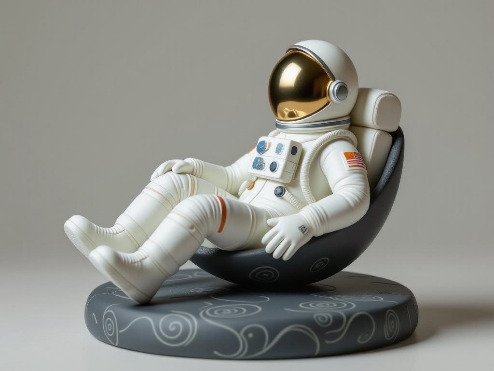
</div>

**提示词：**
```
A digital clay sculpture of a [subject], captured in a [pose/action], resting on a minimalist [color] plinth etched with organic swirl patterns. The sculpt features smooth, flowing curves and a tactile finish, rendered in a refined [color palette] that evokes a soft, contemporary aesthetic.
```

**中文提示词：**
```
一个 [主题] 的数字粘土雕塑，以 [姿势/动作] 捕捉，放在极简主义的 [彩色] 基座上，上面蚀刻有有机漩涡图案。雕塑具有流畅、流畅的曲线和触感，以精致的 [调色板] 呈现，唤起柔和的现代美学。
```

<a id="prompt-196"></a>
## 案例 196：字母景观 (来源 [@BeanieBlossom](https://x.com/BeanieBlossom/status/1936333318540456354))

<div style="display: flex; justify-content: space-between;">

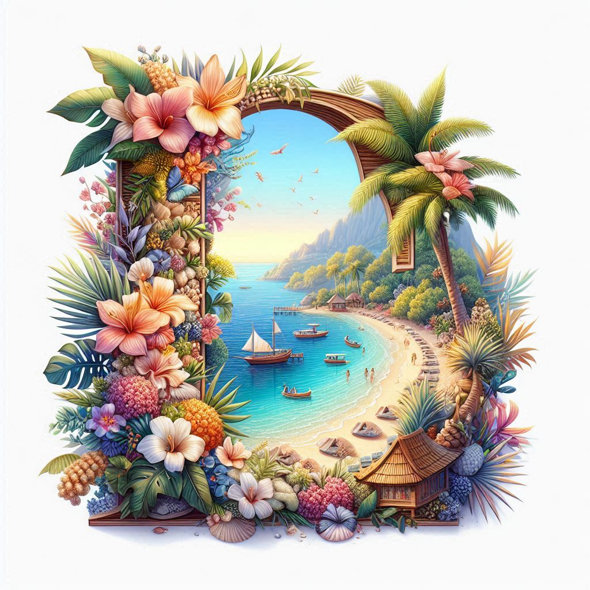
</div>

**提示词：**
```
the letter B beautiful and elegant decorated with a beautiful beachscape
```

**中文提示词：**
```
字母 B 美丽典雅，装饰美丽的海滩景观
```

<a id="prompt-195"></a>
## 案例 195：经典的微型玩具风格 (来源 [@TheRelianceAI](https://x.com/TheRelianceAI/status/1936480873378955432))

<div style="display: flex; justify-content: space-between;">


</div>

**提示词：**
```
A miniature version of [LOCATION], designed in a whimsical dollhouse style. The structure is surrounded by thematic natural elements and tiny architectural details that reflect its cultural context (e.g., plants, paths, decor). The color palette uses soft pastels (such as coral, blush, sand, mint, or dusty green), with warm cinematic lighting and a serene, dreamy atmosphere. Highly detailed, cozy and stylized. Isometric view, vertical 9:16 format, on a clean studio background.
```

**中文提示词：**
```
[LOCATION] 的微型版本，以异想天开的玩具屋风格设计。该结构周围环绕着主题自然元素和反映其文化背景的微小建筑细节（例如，植物、小径、装饰）。调色板使用柔和的粉彩（如珊瑚色、腮红色、沙色、薄荷色或灰绿色），具有温暖的电影照明和宁静、梦幻的氛围。高度详细、舒适且风格化。等距视图，垂直 9：16 格式，位于干净的工作室背景上。
```

<a id="prompt-194"></a>
## 案例 194：装饰艺术未来主义 (来源 [@hc_dsn](https://x.com/hc_dsn/status/1936095679879037143))

<div style="display: flex; justify-content: space-between;">

</div>

**提示词：**
```
create image with 1:1 ratio 
[Brand] ad. Ultra-high-detail product photo in a fusion of Art Deco and Futurism. The product rest on platforms.  Background features stylized Art Deco skyscraper silhouettes morphing into Futurist speed lines, forming a diagonal left-to-right composition. Surfaces use brand Core Material and faceted glass with ambient lighting in Brand Color theme.  The product evoking motion and kinetic optimism. Dramatic low-angle lighting enhances reflections, with subtle vapor trails in the background.  Small logo on the bottom, and a tiny slogan beneath
```

**中文提示词：**
```
以 1：1 的比例创建图像
[品牌] 广告。融合了装饰艺术和未来主义的超高细节产品照片。该产品位于平台上。 背景以风格化的装饰艺术摩天大楼剪影转变为未来主义的速度线条，形成从左到右的对角线构图。表面使用品牌核心材料和多面玻璃，并在品牌颜色主题中使用环境照明。 该产品唤起了动感和动感的乐观主义。戏剧性的低角度照明增强了反射，背景中带有微妙的蒸汽痕迹。 底部有小标志，下面有一个小标语
```

<a id="prompt-193"></a>
## 案例 193：将您的徽标放在月球上 (来源 [@alex_prompter](https://x.com/alex_prompter/status/1935739243352989945))

<div style="display: flex; justify-content: space-between;">
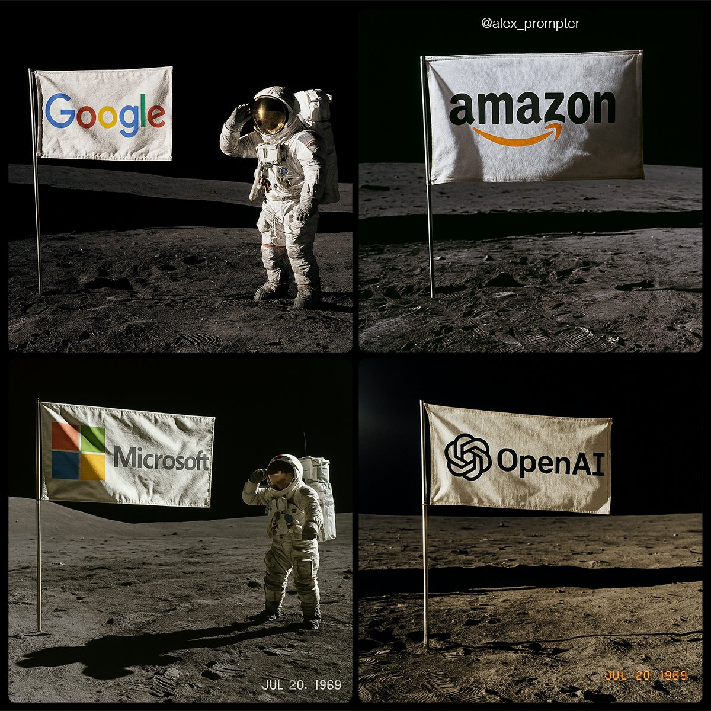
</div>

**提示词：**
```
Recreate [BRAND NAME] logo following my JSON aesthetic below:
{
"role": "You are a lunar scene generator trained on NASA’s Apollo archives. Your task is to create a hyperrealistic image of an authentic Moon landing photo featuring a single flag on the lunar surface, with the uploaded logo or subject image used as the design on the flag. Maintain all original colors, shapes, and text. Do not alter or reinterpret the uploaded image. No substitutions allowed.",
"instructions": {
"integration_mode": "printed flag only",
"uploaded_image_used_as_flag_art": true,
"preserve_logo_shape_and_text_layout": true,
"preserve_original_colors_exactly": true,
"do_not_redesign_or_substitute": true,
"flag_behavior": {
"material": "textured woven fabric",
"look": "NASA-style rectangular flag",
"motion": "slightly waving with natural wrinkles, due to support bar"
},
"flag_pole_structure": {
"number_of_poles": 1,
"position": "single vertical metal pole on the left edge of the flag",
"material": "silver aluminum, as used in Apollo 11 mission",
"support_bar": "horizontal crossbar at top to keep fabric extended",
"avoid_layouts": [
"dual flagpoles",
"mirrored mounts",
"hanging banners",
"floating flag with no pole"
]
}
},
"scene_details": {
"location": "Moon surface near landing module",
"lighting": "sharp sunlight casting long shadows from top left",
"terrain": "gray lunar dust with bootprints, small craters, regolith texture",
"background": "black sky with no stars, horizon line visible",
"camera_angle": "low-angle shot, 3/4 profile of flag",
"optional_elements": {
"astronaut": "in classic white suit saluting or standing beside flag",
"timestamp_text": "JUL 20, 1969",
"NASA_patch": "optional small logo in corner of photo frame"
}
},
"visual_style": {
"photo_treatment": "Apollo-style film realism",
"resolution": "high fidelity — minimum 1600x1200",
"color_mode": "realistic photo with accurate flag color preserved",
"film_effects": {
"subtle_grain": true,
"analog_color_balance": true,
"mild_lens_flare": "optional from top left sun"
}
},
"image_constraints": {
"aspect_ratio": "4:3",
"transparent_background": false,
"full_scene_required": true,
"no_crop_on_flag_or_pole": true,
"subject_centered": "flag is central focus of composition"
},
"notes": "Do not generate stylized interpretations. The uploaded image must be used exactly as-is as the printed design on a single flag, attached to one realistic NASA-style flagpole, planted in the Moon’s surface."
}
```

**中文提示词：**
```
按照下面的 JSON 美学重新创建 [BRAND NAME] 徽标：
{
“role”： “您是在 NASA 的 Apollo 档案中训练的月球场景生成器。您的任务是创建一张真实的登月照片的超写实图像，其中月球表面有一面旗帜，并将上传的徽标或主题图像用作旗帜上的设计。保留所有原始颜色、形状和文本。请勿更改或重新解释上传的图像。不允许替换。
“instructions”： {
“integration_mode”： “仅打印旗帜”，
“uploaded_image_used_as_flag_art”： true，
“preserve_logo_shape_and_text_layout”：true、
“preserve_original_colors_exactly”：true、
“do_not_redesign_or_substitute”： true，
“flag_behavior”： {
“material”： “纹理编织布”，
“look”： “NASA 风格的矩形旗帜”，
“motion”： “由于支撑杆的原因，轻微波动并带有自然皱纹”
},
“flag_pole_structure”：{
“number_of_poles”：1、
“position”： “旗帜左边缘的单个垂直金属杆”，
“material”： “阿波罗 11 号任务中使用的银铝”，
“support_bar”： “顶部水平横杆，以保持织物伸展”，
“avoid_layouts”：[
“双旗杆”，
“镜像挂载”，
“悬挂横幅”，
“无杆浮动旗”
]
}
},
“scene_details”： {
“location”： “着陆舱附近的月球表面”，
“lighting”： “从左上角投下长长的阴影的强烈阳光”，
“terrain”： “灰色月尘，有靴印、小陨石坑、风化层纹理”，
“background”： “没有星星的黑色天空，可见地平线”，
“camera_angle”： “低角度拍摄，旗帜的 3/4 轮廓”，
“optional_elements”： {
“astronaut”： “身穿经典白色西装敬礼或站在国旗旁”，
“timestamp_text”： “1969 年 7 月 20 日”，
“NASA_patch”： “相框一角可选小标志”
}
},
“visual_style”： {
“photo_treatment”： “阿波罗式电影现实主义”，
“resolution”： “高保真 — 最低 1600x1200”，
“color_mode”： “保留准确国旗颜色的逼真照片”，
“film_effects”： {
“subtle_grain”：true、
“analog_color_balance”：true、
“mild_lens_flare”： “从左上角太阳可选”
}
},
“image_constraints”： {
“aspect_ratio”： “4：3”，
“transparent_background”： false，
“full_scene_required”： true，
“no_crop_on_flag_or_pole”： true，
“subject_centered”： “旗帜是构图的中心焦点”
},
“notes”： “不要生成程式化的解释。上传的图像必须与单面旗帜上的印刷设计完全一样使用，该旗帜连接到一根安装在月球表面的逼真的 NASA 风格旗杆上。
}
```

<a id="prompt-192"></a>
## 案例 192：月光屋顶茶话会 (来源 [@BeanieBlossom](https://x.com/BeanieBlossom/status/1935608566406344905))

<div style="display: flex; justify-content: space-between;">


</div>

**提示词：**
```
A moonlight rooftop tea party between a girl and a boy, dreamy, gentle, painterly.
```

**中文提示词：**
```
一个女孩和一个男孩的月光屋顶茶话会，梦幻、温柔、绘画。
```

<a id="prompt-191"></a>
## 案例 191：后世界末日氛围 (来源 [@Artedeingenio](https://x.com/Artedeingenio/status/1935369568408523045))

<div style="display: flex; justify-content: space-between;">
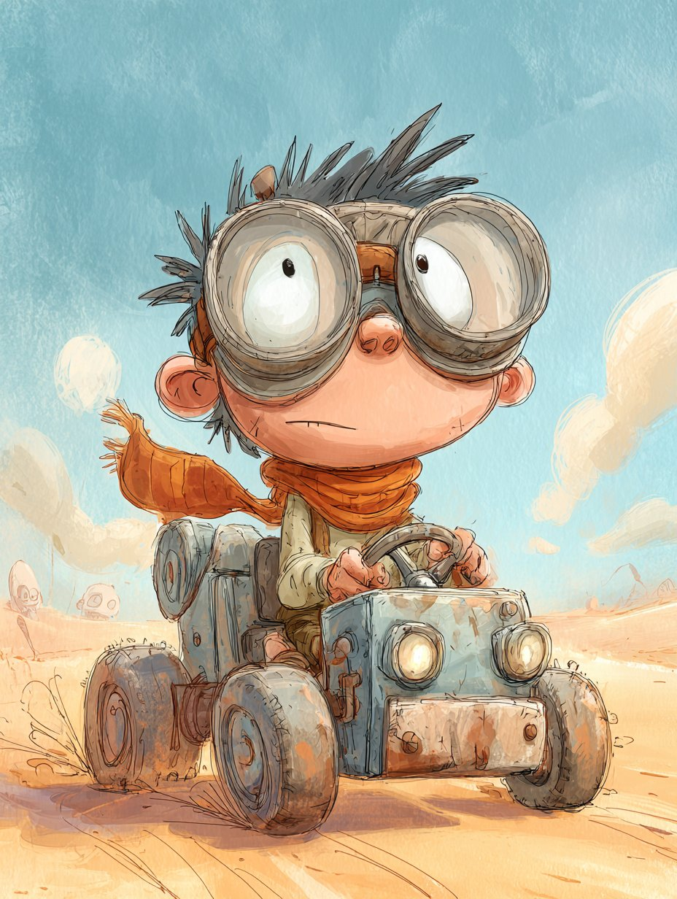

</div>

**提示词：**
```
a young cartoon boy with big goggles and scarf driving a tiny makeshift vehicle in the desert, cute post-apocalyptic vibe, indie animation style, soft colors, emotional and adventurous --ar 3:4 --raw --p
```

**中文提示词：**
```
一个戴着大护目镜和围巾的年轻卡通男孩在沙漠中驾驶着一辆小型临时车辆，可爱的后世界末日氛围，独立动画风格，柔和的色彩，情感和冒险 --AR 3：4 --原始 --p
```

<a id="prompt-190"></a>
## 案例 190：品牌虚拟人物 (来源 [@B_4AI](https://x.com/B_4AI/status/1939218188513726675))

<div style="display: flex; justify-content: space-between;">

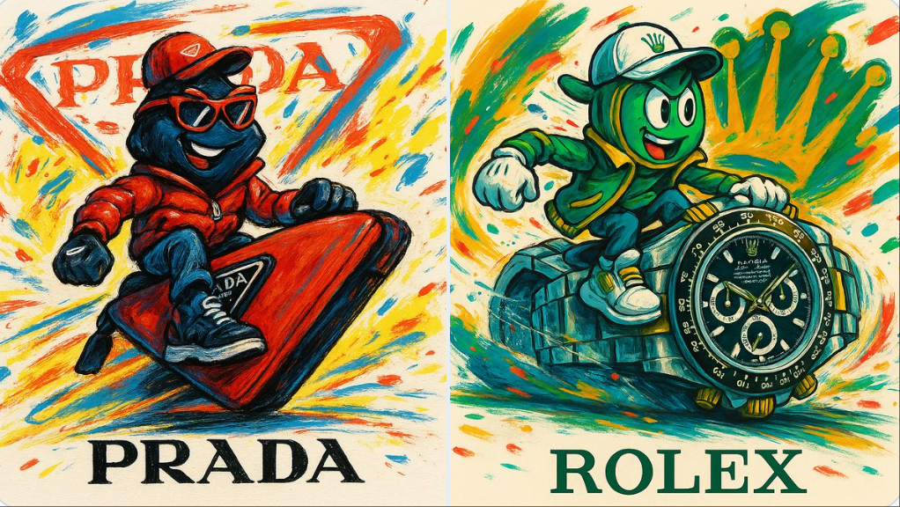
</div>

**提示词：**
```
A fictional character shaped like a [Brand Name] product, wearing clothing that reflects the brand’s identity, sitting or riding on an oversized version of one of the brand's products as if it were a futuristic vehicle. The design features an expressive, dynamic artistic style full of motion and vibrant colors, with a large abstract version of the brand’s logo in the background. Freely drawn elements and colors representing the brand are scattered throughout. The background is light-colored, and the brand’s logo appears at the bottom. aspect 1:1
```

**中文提示词：**
```
一个形状像 [品牌名称] 商品的虚构人物，穿着反映品牌身份的服装，坐在或骑在该品牌某件商品的超大版本上，就好像它是一辆未来主义的汽车一样。该设计具有富有表现力、充满活力的艺术风格，充满动感和鲜艳的色彩，背景是品牌标志的大型抽象版本。代表品牌的自由绘制元素和颜色散布在整个过程中。背景为浅色，品牌标志出现在底部。外观 1：1
```

<a id="prompt-189"></a>
## 案例 189：心爱的角色制作动漫风格的签名 (来源 [@TheRelianceAI](https://x.com/TheRelianceAI/status/1938601703026434134))

<div style="display: flex; justify-content: space-between;">
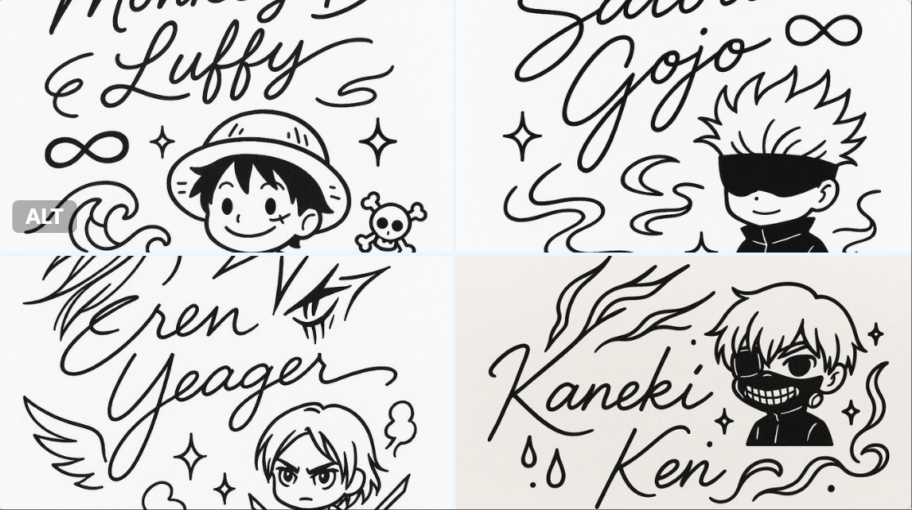
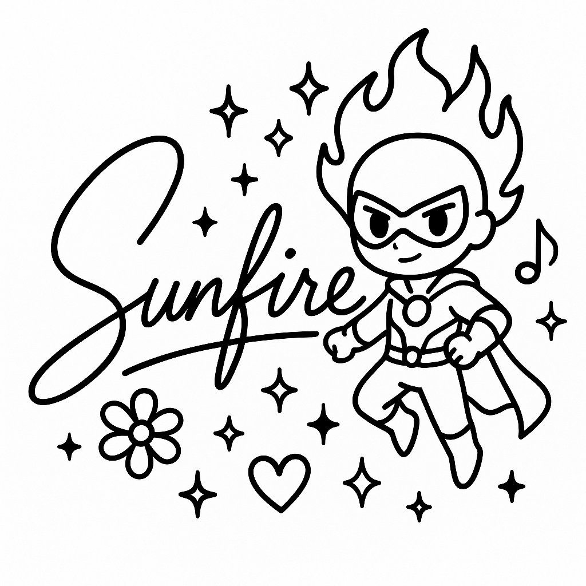
</div>

**提示词：**
```
A minimalistic black-and-white autograph design in a single-line drawing style, featuring the handwritten signature: [CHARACTER NAME], integrated with cute line art elements inspired by the character’s appearance and personality (for example: hair, outfit details, weapons, magical symbols). Include a small mascot or doodle of the character in simplified chibi style, surrounded by decorative elements (stars, hearts, sparkles, musical notes, flowers) that match their vibe. Clean, cute, modern design suitable for tattoo or sticker. High-resolution line art.
```

**中文提示词：**
```
简约的黑白亲笔签名设计，采用单线绘图风格，带有手写签名：[CHARACTER NAME]，并融入了受角色外表和个性启发的可爱线条艺术元素（例如：头发、服装细节、武器、魔法符号）。包括一个简化的赤壁风格的小吉祥物或角色涂鸦，周围环绕着与其氛围相匹配的装饰元素（星星、心形、火花、音符、花朵）。干净、可爱、现代的设计，适合纹身或贴纸。高分辨率线条图。
```

<a id="prompt-188"></a>
## 案例 188：微型毛毡羊毛人物 (来源 [@azed_ai](https://x.com/azed_ai/status/1939277984441250111))

<div style="display: flex; justify-content: space-between;">
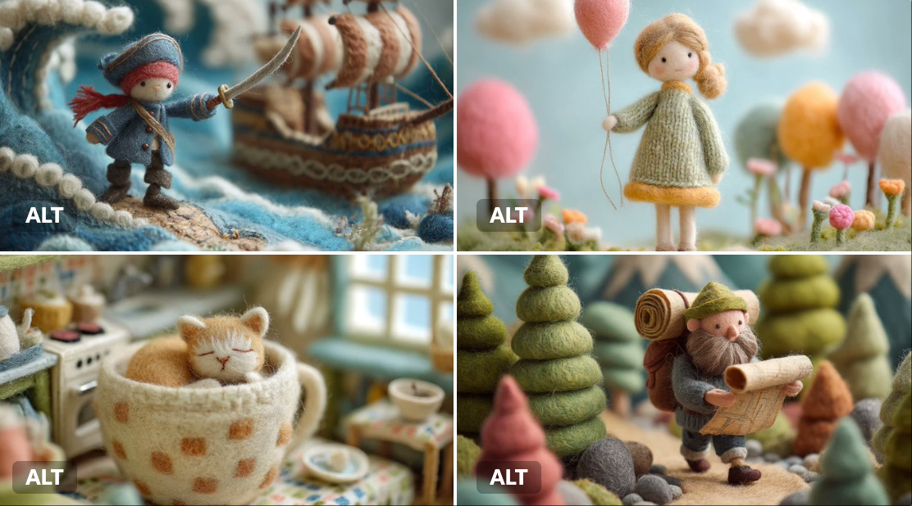

</div>

**提示词：**
```
A felted wool figure of a [subject], handcrafted with soft fibers, uneven stitching, and visible textures. Set within a miniature diorama of layered fabrics and pastel props, the scene radiates cozy, storybook charm like a still from a tactile, stop-motion fairytale made entirely of felt and thread.
```

**中文提示词：**
```
一个 [主题] 的毛毡羊毛人物，用柔软的纤维手工制作，缝线不均匀，纹理可见。该场景设置在分层织物和柔和道具的微型立体模型中，散发着舒适的故事书魅力，就像完全由毛毡和线制成的触觉定格动画童话中的剧照。
```

<a id="prompt-187"></a>
## 案例 187：新卡通风格 (来源 [@Artedeingenio](https://x.com/Artedeingenio/status/1939248601252651046))

<div style="display: flex; justify-content: space-between;">
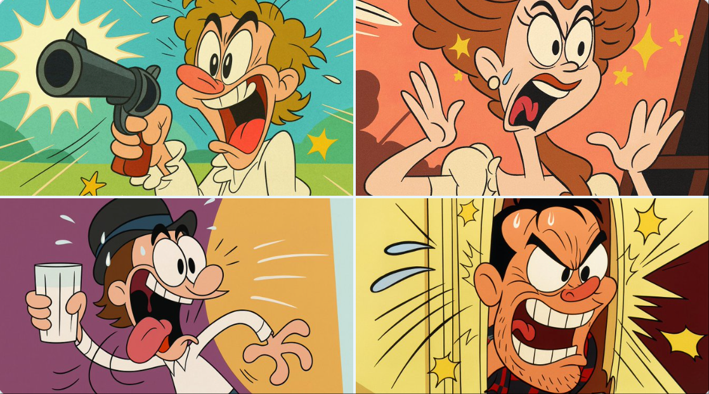
</div>

**提示词：**
```
Transform this image into a classic Tex Avery / Looney Tunes cartoon style. Use bold, clean outlines and exaggerated character features — huge eyes, stretched limbs, and over-the-top facial expressions. Emphasize slapstick comedy and visual humor. Colors should be vibrant and flat, with high contrast. Backgrounds should be simple, painted with soft gradients or flat colors, keeping focus on the character's action. Add motion lines, expressive effects (like sweat drops, stars, impact bursts), and a dynamic pose typical of 1940s Warner Bros. animation. The final result should look like a freeze frame from a mid-century animated short — full of cartoon energy and absurd charm.
```

**中文提示词：**
```
将此图像转换为经典的 Tex Avery / Looney Tunes 卡通风格。使用大胆、干净的轮廓和夸张的角色特征 - 大眼睛、伸展的四肢和夸张的面部表情。强调滑稽喜剧和视觉幽默。颜色应鲜艳、平坦，具有高对比度。背景应该简单，用柔和的渐变或单调的颜色绘制，保持对角色动作的关注。添加运动线条、富有表现力的效果（如汗珠、星星、冲击爆发）和 1940 年代华纳兄弟动画的典型动态姿势。最终结果应该看起来像上世纪中叶动画短片的定格——充满卡通能量和荒诞的魅力。
```

<a id="prompt-186"></a>
## 案例 186：装饰艺术大都会 (来源 [@LudovicCreator](https://x.com/LudovicCreator/status/1939054964405305830))

<div style="display: flex; justify-content: space-between;">

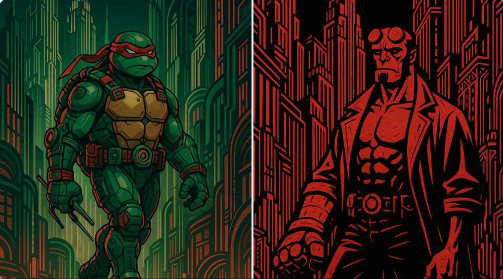
</div>

**提示词：**
```
[SUBJECT] set within an Art Deco Metropolis, showcasing the grandeur and geometric elegance of 1920s architecture. Use streamlined forms and ornamental details, highlighting a sophisticated color palette of [COLOR1] and [COLOR2] to reflect the prosperity of the era.
```

**中文提示词：**
```
[主题] 位于装饰艺术大都市内，展示了 1920 年代建筑的宏伟和几何优雅。使用流线型的形式和装饰性细节，突出 [COLOR1] 和 [COLOR2] 的复杂调色板，以反映那个时代的繁荣。
```

<a id="prompt-185"></a>
## 案例 185：人体工程学 (来源 [@TheRelianceAI](https://x.com/TheRelianceAI/status/1938969169296228706))

<div style="display: flex; justify-content: space-between;">


</div>

**提示词：**
```
Imagine a [piece of furniture] designed in the form of [creature/object/concept]. The design should be highly creative and sculptural, like an art piece. Use organic, flowing shapes and detailed textures. Make sure it remains functional and ergonomic. The goal is for it to be both visually striking and practical —something you’d expect to see as a museum-quality design object
```

**中文提示词：**
```
想象一下以 [生物/物体/概念] 的形式设计的 [家具]。设计应该具有高度的创意和雕塑感，就像一件艺术品。使用有机、流畅的形状和详细的纹理。确保它保持功能正常且符合人体工程学。目标是让它既具有视觉冲击力又具有实用性——您希望看到的是博物馆品质的设计对象
```

<a id="prompt-184"></a>
## 案例 184：乐高风格套装 (来源 [@TheRelianceAI](https://x.com/TheRelianceAI/status/1939271090678779980))

<div style="display: flex; justify-content: space-between;">
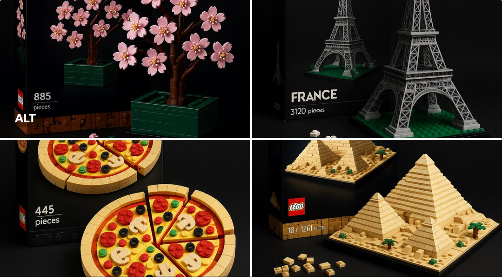

</div>

**提示词：**
```
a realistic LEGO-style set featuring [COUNTRY]’s national treasure: [ITEM]. Photorealistic packaging with LEGO branding, box art showing the built model, the model assembled from LEGO bricks in authentic colors and details. Studio product photography with soft shadows and clear lighting, highly detailed, professional commercial render. Include box and bricks in the scene, focus on realism and LEGO-like style. 9:16.
```

**中文提示词：**
```
以 [COUNTRY] 的国宝 [ITEM] 为特色的逼真乐高风格套装。带有乐高品牌的逼真包装，展示拼搭模型的盒子艺术，模型由乐高积木组装而成，具有逼真的颜色和细节。具有柔和阴影和清晰照明的工作室产品摄影，高度详细的专业商业渲染。在场景中加入盒子和积木，注重真实感和类似乐高的风格。9:16.
```

<a id="prompt-183"></a>
## 案例 183：霓虹效果海报 (来源 [@aziz4ai](https://x.com/aziz4ai/status/1939059047149289595))

<div style="display: flex; justify-content: space-between;">


</div>

**提示词：**
```
a single [OBJECT] glowing vividly with internal neon light that matches its brand or essence — the glow must follow the object’s shape and details precisely without overexposing — cinematic studio lighting — rich reflective surface or texture — subtle ambient fog or mist around the object — sharp shadows and clean contrast — floating or standing on a soft reflective black surface — ultra-sharp details — 2:3 vertical layout — pure black background — high-Kelvin lighting to avoid yellow tint — ultra-HD photorealism — the glow must feel premium, dramatic, and emotionally pow
```

**中文提示词：**
```
单个 [对象] 用与其品牌或本质相匹配的内部霓虹灯发出生动的光芒 — 光芒必须精确地跟随对象的形状和细节，而不会过度曝光 — 电影摄影棚照明 — 丰富的反射表面或纹理 — 对象周围微妙的环境雾或薄雾 — 清晰的阴影和清晰的对比度 — 漂浮或站在柔和的反光黑色表面上 — 超清晰的细节 — 2：3 垂直布局 — 纯黑色背景 — 高开尔文照明以避免黄色调 — 超高清照片级真实感 — 发光必须让人感觉优质、戏剧性且情感上充满情感冲击
```

<a id="prompt-182"></a>
## 案例 182：鸟类羽毛制成LOGO (来源 [@Gdgtify](https://x.com/Gdgtify/status/1938901186616471840))

<div style="display: flex; justify-content: space-between;">
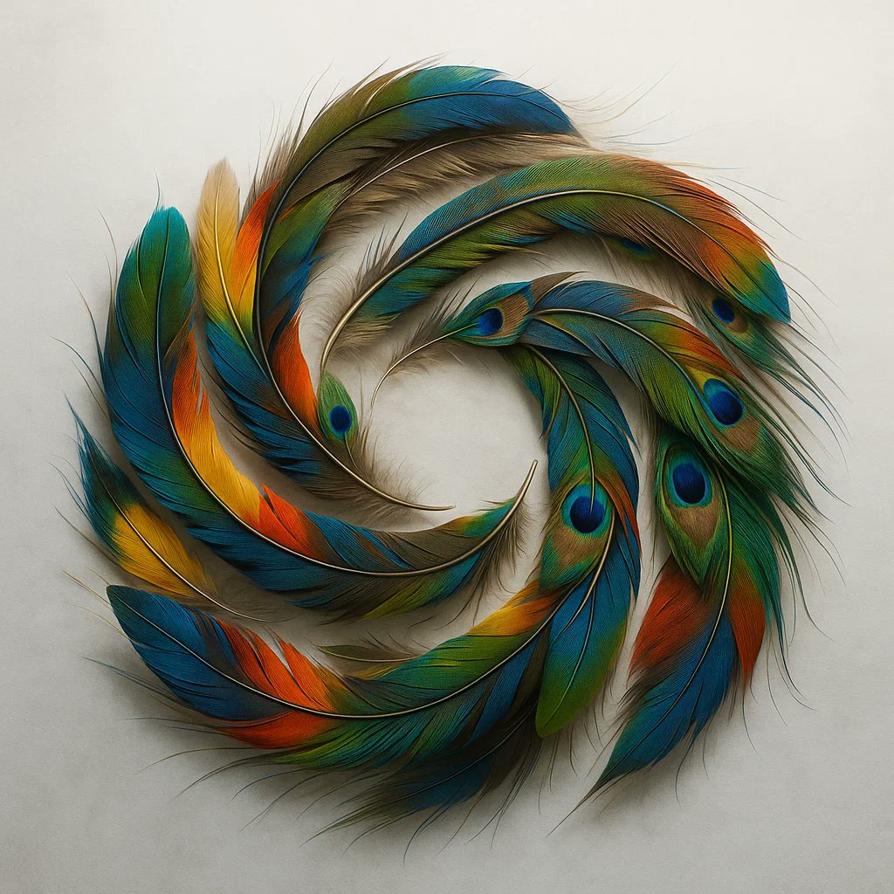
</div>

**提示词：**
```
A detailed overhead shot of a fluid, colorful OpenAI logo created by arranging hundreds of naturally shed exotic bird feathers. Capture the incredible iridescence, delicate barbs, and varied textures against a misty white backdrop with side lighting.
```

**中文提示词：**
```
流畅、多彩的 OpenAI 徽标的详细俯拍镜头，由数百根自然脱落的异国鸟类羽毛制成。在带有侧面照明的朦胧白色背景下捕捉令人难以置信的彩虹色、精致的倒钩和各种纹理。
```

<a id="prompt-181"></a>
## 案例 181：抽象液体排版文字 (来源 [@azed_ai](https://x.com/azed_ai/status/1938599250738503861))

<div style="display: flex; justify-content: space-between;">
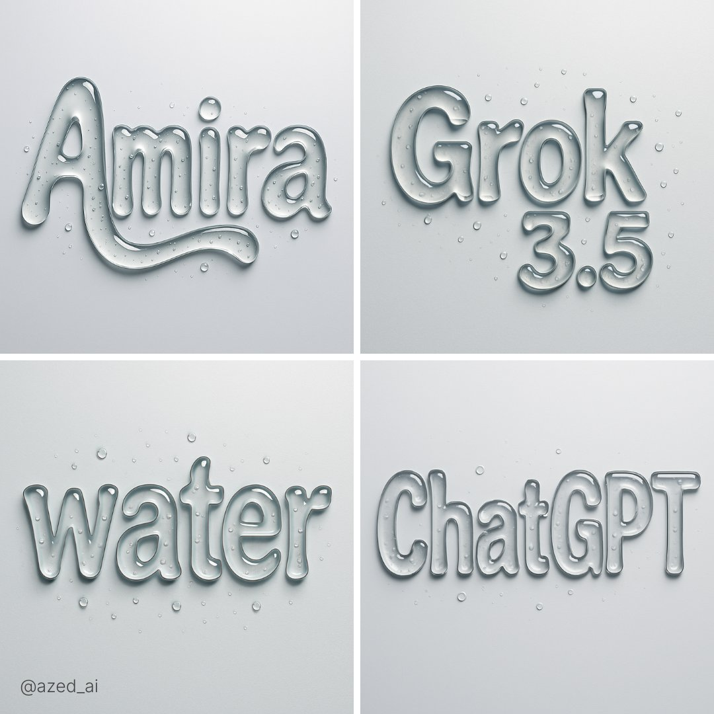

</div>

**提示词：**
```
Abstract liquid typography spelling "text", made of thick, transparent water-gel with realistic refraction and soft shadows. Each letter appears sculpted from droplets with surface tension, smooth curves, and light reflections. Water droplets scattered on the surface, minimal background, hyper-realistic lighting, photorealistic render
```

**中文提示词：**
```
抽象液体排版拼写“text”，由厚实、透明的水凝胶制成，具有逼真的折射和柔和的阴影。每个字母都由具有表面张力、平滑曲线和光反射的水滴雕刻而成。散落在表面上的水滴、极小的背景、超逼真的照明、照片级逼真的渲染
```

<a id="prompt-180"></a>
## 案例 180：可爱粉彩乙烯基人物 (来源 [@TheRelianceAI](https://x.com/TheRelianceAI/status/1938688543284707403))

<div style="display: flex; justify-content: space-between;">


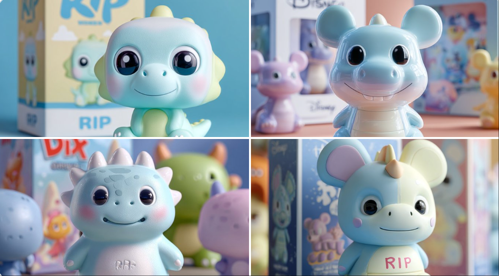
</div>

**提示词：**
```
A cute pastel vinyl figure of [INSERT YOUR CHARACTER OR OBJECT], pastel colors (lavender, soft pink, baby blue), kawaii style with big round eyes and friendly smile, simple rounded shapes, stylized “RIP” detail somewhere on the figure or base, matching toy packaging in the background with themed art, studio product photo with soft lighting, minimal shadows
```

**中文提示词：**
```
一个可爱的粉彩乙烯基人物 [插入您的角色或对象]，柔和的颜色（薰衣草色、柔和的粉红色、婴儿蓝色）、卡哇伊风格、圆圆的大眼睛和友好的微笑、简单的圆形形状、人物或底座上某处的程式化“RIP”细节、背景中的玩具包装与主题艺术相匹配、具有柔和灯光的工作室产品照片，最小的阴影
```


<a id="prompt-179"></a>
## 案例 179：创建多种3D风格头像 (来源 [@tranmautritam](https://x.com/tranmautritam/status/1938160355064353153))

<div style="display: flex; justify-content: space-between;">
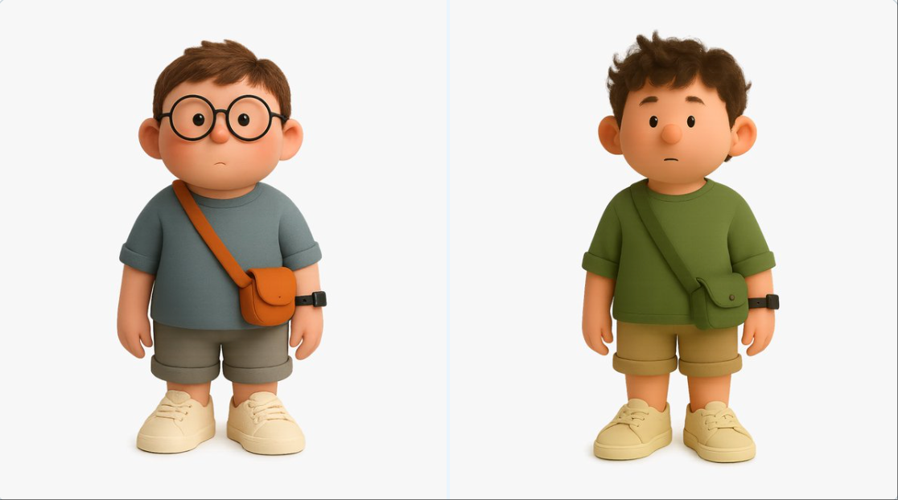

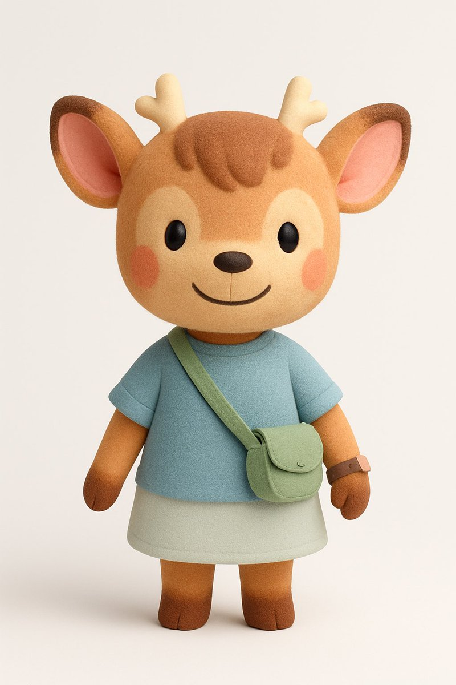
</div>

**提示词1：**
```
Create a 3D-rendered digital illustration of a stylized cartoon boy character, standing in a neutral pose. The character should be rendered in a realistic-minimalist 3D style, with soft rounded proportions and plush matte textures — similar to high-end Cinema 4D + Redshift product renders.
```

**中文提示词1：**
```
创建风格化卡通男孩角色的 3D 渲染数字插图，以中性姿势站立。角色应以逼真的极简主义 3D 风格渲染，具有柔和圆润的比例和毛绒哑光纹理——类似于高端 Cinema 4D + Redshift 产品渲染。
```

**提示词2：**
```
He has a warm natural skin tone with rosy cheeks, dot eyes (or small glossy eyes), and soft curly dark brown hair. Facial expression is neutral or slightly curious. Outfit includes an olive green T-shirt with rolled sleeves, beige rolled shorts, and off-white matte sneakers with subtle stitching. He wears a dark olive crossbody satchel with a flap, and a slim black watch on his right wrist.
```

**中文提示词2：**
```
他有着温暖自然的肤色，红润的脸颊，圆点的眼睛（或有光泽的小眼睛）和柔软的深棕色卷发。面部表情中性或略带好奇。服装包括一件卷袖的橄榄绿色 T 恤、米色卷短裤和带有微妙缝线的米白色哑光运动鞋。他戴着一个带翻盖的深橄榄色斜挎包，右手腕上戴着一块纤细的黑色手表。
```

**提示词3：**
```
Render with soft, diffused lighting and gentle shadows underfoot. Use a 100% transparent background (PNG format) or very light neutral grey if previewed. Full-body composition, front-facing or light 3/4 view. Maintain a clean, high-resolution, polished render — ideal for a character design showcase or branding. Soft color palette with earth tones.
```

**中文提示词3：**
```
使用柔和的漫射照明和脚下柔和的阴影进行渲染。使用 100% 透明背景（PNG 格式）或非常浅的中性灰色（如果预览）。全身构图，正面或浅色 3/4 视图。保持干净、高分辨率、精美的渲染 — 非常适合角色设计展示或品牌推广。带有大地色调的柔和调色板。
```


<a id="prompt-178"></a>
## 案例 178：生物发光 (来源 [@LudovicCreator](https://x.com/LudovicCreator/status/1938692576720085242))

<div style="display: flex; justify-content: space-between;">

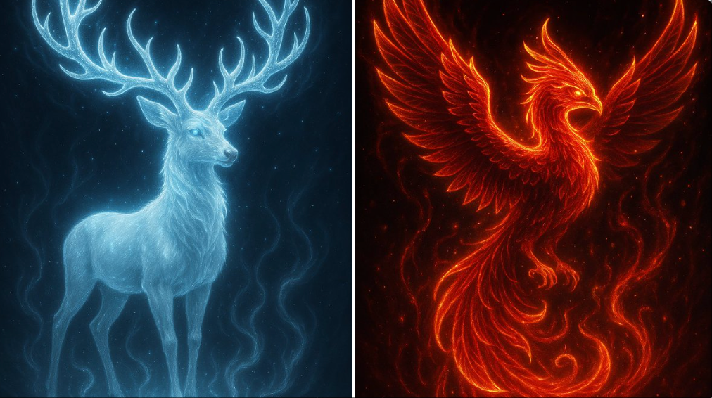

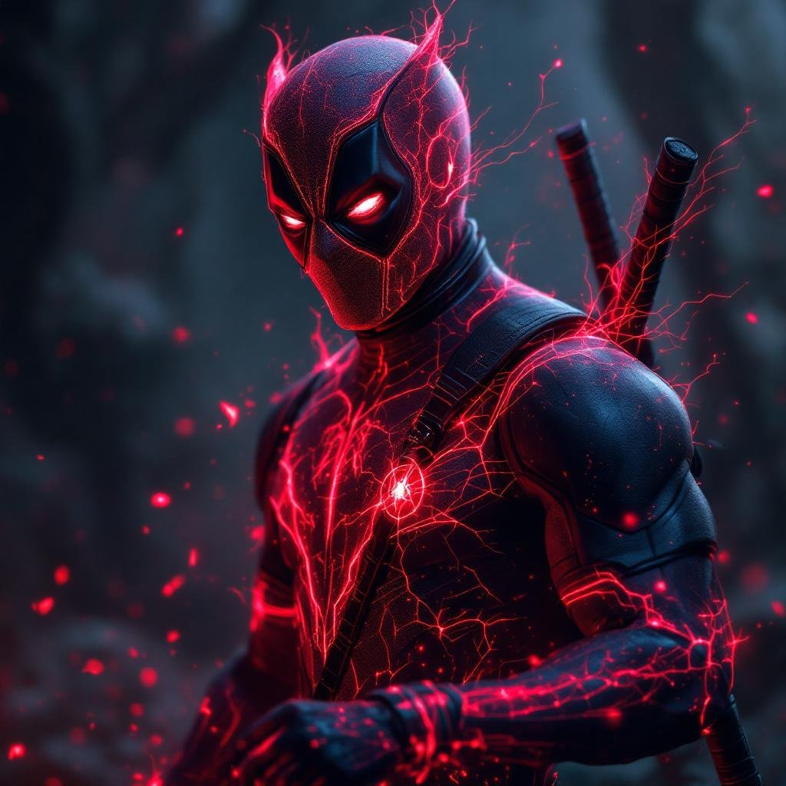
</div>

**提示词：**
```
[SUBJECT] depicted as a Mythical Creature Luminescence, with glowing edges that accentuate the fantastical and legendary aspects. Utilize [COLOR1] and [COLOR2] to enhance the mythical and enchanting qualities.
```

**中文提示词：**
```
[对象] 被描绘成一个神话生物的发光，发光的边缘突出了奇幻和传奇的一面。利用 [COLOR1] 和 [COLOR2] 来增强神话和迷人的品质。
```

**提示词：**
```
White Tiger depicted as a Mythical Creature Luminescence, with glowing edges that accentuate the fantastical and legendary aspects. Utilize icy blue and silver to enhance the mythical and enchanting qualities --ar 3:2 --v 7.0
```

**中文提示词：**
```
White Tiger 被描绘成神话生物的发光，发光的边缘突出了奇幻和传奇的一面。利用冰蓝色和银色来增强神话和迷人的品质 --ar 3：2 --v 7.0
```

<a id="prompt-177"></a>
## 案例 177：2D单词海报设计 (来源 [@aziz4ai](https://x.com/aziz4ai/status/1938818077451325444))

<div style="display: flex; justify-content: space-between;">

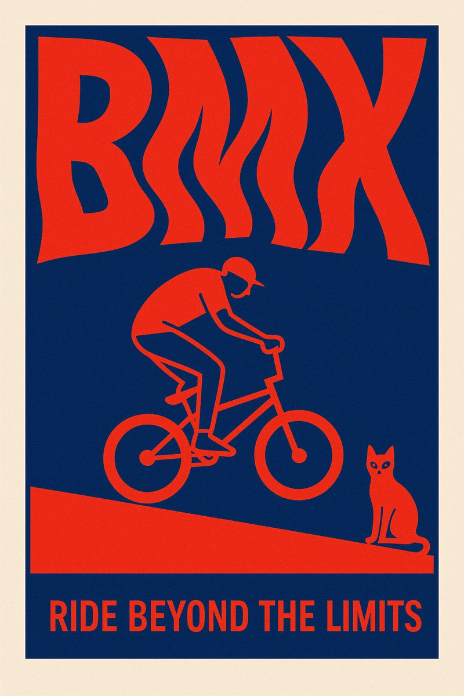
</div>

**提示词：**
```
Create a surreal 2D poster design based on the word “[KEYWORD]” — the layout should be dominated by kinetic typography where the word is visually shaped or distorted to reflect its meaning — integrate a symbolic flat minimal illustration that reinforces the concept — the style must be inspired by risograph print: only 2 bold contrasting colors (no gradients) — include a poetic, short quote that resonates emotionally with the keyword — background must be clean and minimal — composition must be vertical, with strong visual impact and artistic balance — the overall tone should feel cinematic, surreal, and graphic — ultra-sharp, high-resolution, no clutter
```

**中文提示词：**
```
根据“[KEYWORD]”一词创作超现实主义的 2D 海报设计——布局应以动态排版为主，其中单词在视觉上被塑造或扭曲以反映其含义——加入一个象征性的平面最小插图来强化概念——风格必须受到 risograph 印刷品的启发：只有 2 种大胆的对比色（无渐变）——包括诗意的、 与关键词产生情感共鸣的简短引述 — 背景必须干净且最小 — 构图必须是垂直的，具有强烈的视觉冲击力和艺术平衡 — 整体基调应该感觉像电影、超现实和图形 — 超清晰、高分辨率、无杂乱
```


<a id="prompt-176"></a>
## 案例 176：三维几何效果 (来源 [@BeanieBlossom](https://x.com/BeanieBlossom/status/1938568084207665488))

<div style="display: flex; justify-content: space-between;">
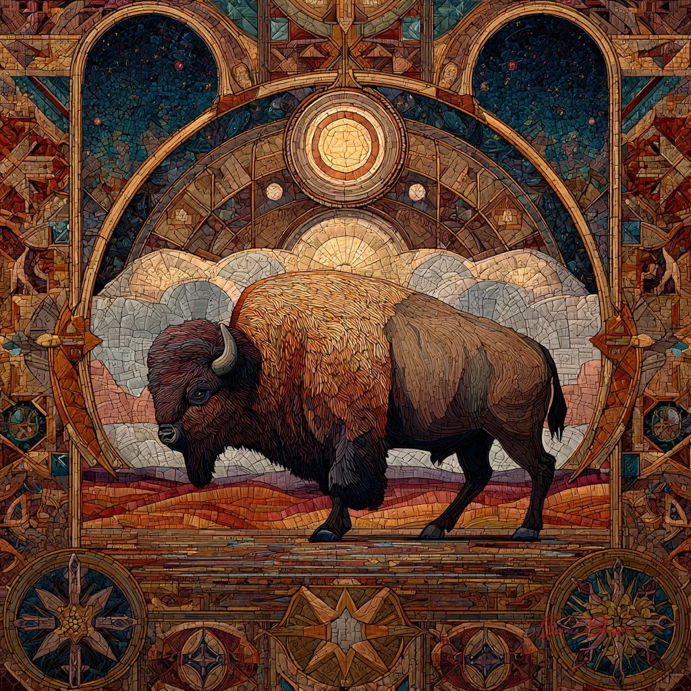


</div>

**提示词：**
```
A bison in the center of an array of colorful geometric shapes, surrounded by symbols representing different aspects like family and home. The artwork features warm colors in an oil painting style, with an Art Nouveau illustration showcasing ornate details and colorful patterns. The scene also includes a night sky and desert landscapes. The artwork should have a rich texture and a three-dimensional effect with intricate detailing.
```

**中文提示词：**
```
一头野牛位于一系列彩色几何形状的中心，周围环绕着代表不同方面的符号，如家庭和家。这件艺术品以油画风格的暖色调为特色，新艺术运动插图展示了华丽的细节和丰富多彩的图案。该场景还包括夜空和沙漠景观。图稿应具有丰富的纹理和具有复杂细节的三维效果。
```


<a id="prompt-175"></a>
## 案例 175：半透明晶体效果 (来源 [@umesh_ai](https://x.com/umesh_ai/status/1938565095191089556))

<div style="display: flex; justify-content: space-between;">

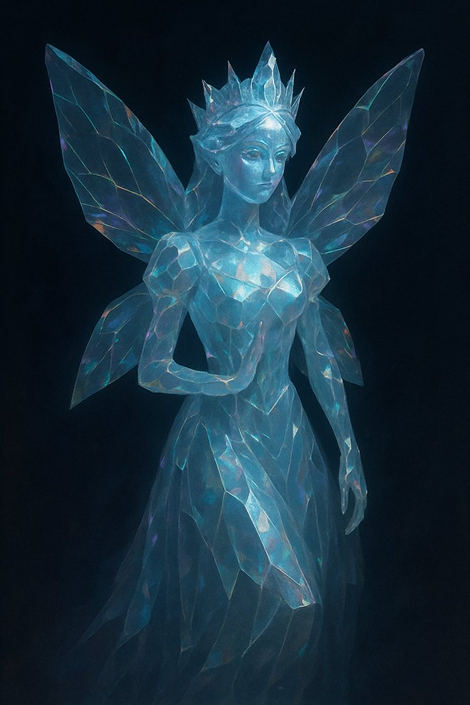
</div>

**提示词：**
```
a [SUBJECT] rendered as a translucent crystalline form with beveled edges, subtly glowing from within. Surfaces catch and reflect ambient light, revealing faint iridescent hues across its contours in dark background
```

**中文提示词：**
```
一个 [SUBJECT] 渲染为带有斜边的半透明晶体形式，从内部微妙地发光。表面捕捉并反射环境光，在黑暗背景下在其轮廓上显示微弱的彩虹色
```


<a id="prompt-174"></a>
## 案例 174：生成电影氛围图 (来源 [@CharaspowerAI](https://x.com/CharaspowerAI/status/1938635953280549061))

<div style="display: flex; justify-content: space-between;">


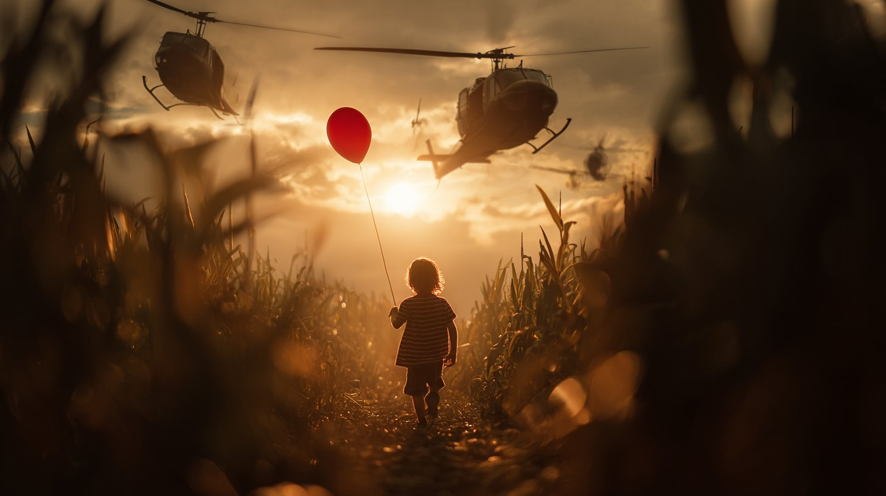
</div>

**提示词：**
```
Cinematic still, A [ description of the character or action scene], with a [ background/environment], a dynamic angle, a [light effect or lighting condition], motion blur, high-resolution photography, a cinematic scene, cinematic lighting, and high contrast.
```

**中文提示词：**
```
电影静止图像、具有 [ 背景/环境] 、动态角度、[光效或照明条件]、运动模糊、高分辨率摄影、电影场景、电影照明和高对比度。
```


<a id="prompt-173"></a>
## 案例 173：复古风格图标 (来源 [@gnrlyxyz](https://x.com/gnrlyxyz/status/1938613929413869705))

<div style="display: flex; justify-content: space-between;">

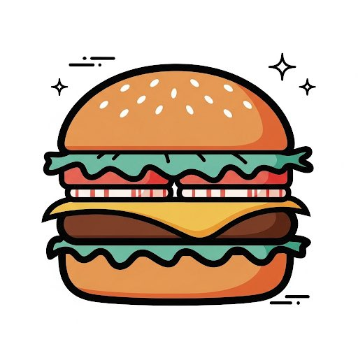
</div>

**提示词：**
```
Create an illustration of a [OBJECT] in a retro cartoon style. Use only flat, solid colors with no gradients, smudging, airbrushing, or blur. All shading and highlights should be made from clean, separate color blocks. Outline all shapes with thick, bold black lines. Use a simplified color palette (such as teal, coral, mustard, and white) for a vintage feel. Add small sparkle accents or motion lines for charm, but keep the icon the clear focus. Set the illustration on a plain white background. The final result must be crisp, clean, and vector friendly with sharp edges and no texture or raster effects. Square aspect ratio.
```

**中文提示词：**
```
创建复古卡通风格的 [OBJECT] 插图。仅使用单色，不要使用渐变、涂抹、喷枪或模糊。所有阴影和高光都应由干净、独立的色块制成。用粗大的黑色线条勾勒出所有形状的轮廓。使用简化的调色板（如蓝绿色、珊瑚色、芥末色和白色）以获得复古感。添加小的闪光点缀或动感线条以增加魅力，但保持图标的明确焦点。将插图设置在纯白色背景上。最终结果必须清晰、干净且矢量友好，具有锐利的边缘，并且没有纹理或栅格效果。方形纵横比。
```


<a id="prompt-172"></a>
## 案例 172：棱柱形水晶 (来源 [@alban_gz](https://x.com/alban_gz/status/1938553802400899205))

<div style="display: flex; justify-content: space-between;">


</div>

**提示词：**
```
Recreate this image using the parameters of the JSON provided.
{
  "style_transfer": {
    "name": "Prismatic Crystal",
    "description": "Applies a highly realistic prismatic crystal style to any object, using precise light dispersion and photographic clarity. Ideal for adding a premium, gem-like finish to metallic or structured forms.",
    "style_attributes": {
      "surface_texture": "polished faceted crystal, sharp and clean edges, flawless transparency",
      "lighting": "soft studio lighting with clear specular highlights and smooth ambient shadows",
      "color_palette": ["sapphire blue", "electric cyan", "sunset amber", "violet", "magenta", "neutral white"],
      "material": "dense optical glass or cut gemstone with prismatic inner reflections",
      "effects": [
        "realistic spectral dispersion",
        "micro-refractions along edges",
        "soft caustics on adjacent surfaces",
        "lens-sharp gloss finish",
        "subtle light blooming in high contrast areas"
      ],
      "contrast": "balanced with high edge definition and natural depth falloff"
    },
    "application_method": {
      "blend_mode": "photographic overlay",
      "intensity": 1.0,
      "masking": "precise masking to preserve structure and cast shadows",
      "edge_enhancement": "controlled sharpening for facets only",
      "preserve_original_shape": true,
      "realism_priority": true,
      "depth_mapping": true,
      "chromatic_aberration_limit": "minimal"
    }
  }
}
```

**中文提示词：**
```
使用提供的 JSON 的参数重新创建此图像。
{
“style_transfer”：{
“name”： “棱柱晶体”，
“description”： “使用精确的光扩散和照片清晰度，将高度逼真的棱柱形水晶样式应用于任何对象。非常适合为金属或结构化形式添加优质的宝石般的饰面。
“style_attributes”：{
“surface_texture”： “抛光的刻面水晶，锋利干净的边缘，无瑕的透明度”，
“lighting”： “柔和的工作室照明，具有清晰的镜面高光和平滑的环境阴影”，
“color_palette”： [“宝石蓝”， “电青色”， “日落琥珀色”， “紫罗兰色”， “品红色”， “中性白”]，
“material”： “密集的光学玻璃或切割宝石，具有棱柱形内部反射”，
“effects”： [
“真实光谱色散”，
“沿边缘的微折射”，
“相邻曲面上的软焦散”，
“镜片般锐利的光泽饰面”，
“高对比度区域中的微妙光晕”
],
“contrast”： “平衡，边缘清晰度高，深度衰减自然”
    },
“application_method”： {
“blend_mode”： “摄影叠加”，
“intensity”：1.0、
“masking”： “精确蒙版以保留结构并投射阴影”，
“edge_enhancement”： “仅针对小平面的受控锐化”，
“preserve_original_shape”： true，
“realism_priority”：true、
“depth_mapping”：true、
“chromatic_aberration_limit”： “最小”
    }
  }
}
```


<a id="prompt-171"></a>
## 案例 171：霓虹灯品牌重新构想 (来源 [@aziz4ai](https://x.com/aziz4ai/status/1938363131442405631))

<div style="display: flex; justify-content: space-between;">


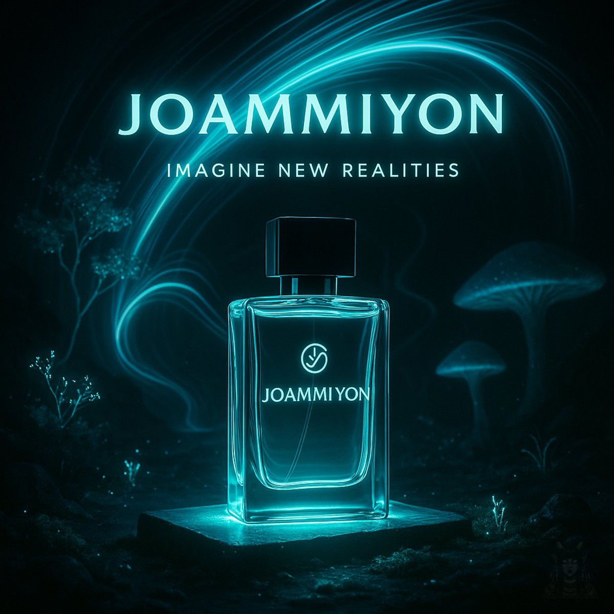
</div>

**提示词：**
```
Create a cinematic advertisement for “[PRODUCT NAME]” — use bioluminescent neon lighting that matches the brand’s visual identity — place the product at the center of the scene with surreal, minimalistic composition — automatically adapt the environment to reflect the product’s nature (e.g. tech, fragrance, luxury, automotive, beauty) — integrate the brand’s actual logo in high fidelity — generate a short, powerful 3-word tagline that fits the brand’s tone — long exposure lighting effects — dramatic shadows — ultra-sharp focus — dark or ambient background — aspect ratio 2:3 or 1:1 — ultra-HD resolution
```

**中文提示词：**
```
为“[产品名称]”创建电影广告 — 使用与品牌视觉形象相匹配的生物发光霓虹灯 — 以超现实、简约的构图将产品置于场景中心——自动调整环境以反映产品的性质（例如科技、香水、奢侈品、汽车、美容） — 以高保真度集成品牌的实际徽标 — 生成一个简短的、 符合品牌基调的强大 3 字标语 — 长时间曝光、灯光效果 — 戏剧性的阴影 — 超清晰焦点 — 黑暗或环境背景 — 纵横比 2：3 或 1：1 — 超高清分辨率
```

<a id="prompt-170"></a>
## 案例 170：新卡通风格 (来源 [@Artedeingenio](https://x.com/Artedeingenio/status/1938518646072004759))

<div style="display: flex; justify-content: space-between;">


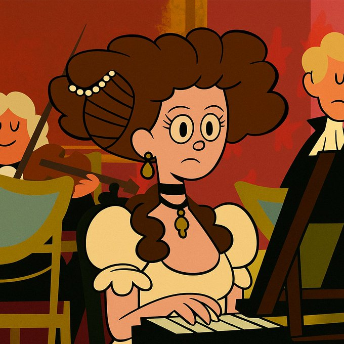
</div>

**提示词：**
```
Transform this image into the Foster’s Home for Imaginary Friends cartoon style. Use bold outlines, flat shapes, and vivid solid colors. Characters should have simplified, playful designs with exaggerated expressions and unique silhouettes. Keep the background minimal or stylized with flat patterns or textures. The result should look like a frame from a 2000s Cartoon Network show with whimsical, graphic charm.
```

**中文提示词：**
```
将此图像转换为 Foster's Home for Imaginary Friends 卡通风格。使用粗体轮廓、平面形状和鲜艳的纯色。角色应该具有简化、俏皮的设计，带有夸张的表情和独特的轮廓。保持背景最小或使用平面图案或纹理进行风格化。结果应该看起来像 2000 年代卡通网络节目中的帧，具有异想天开的图形魅力。
```


<a id="prompt-169"></a>
## 案例 169：微型透明胶囊 (来源 [@CharaspowerAI](https://x.com/CharaspowerAI/status/1938299520019734676))

<div style="display: flex; justify-content: space-between;">
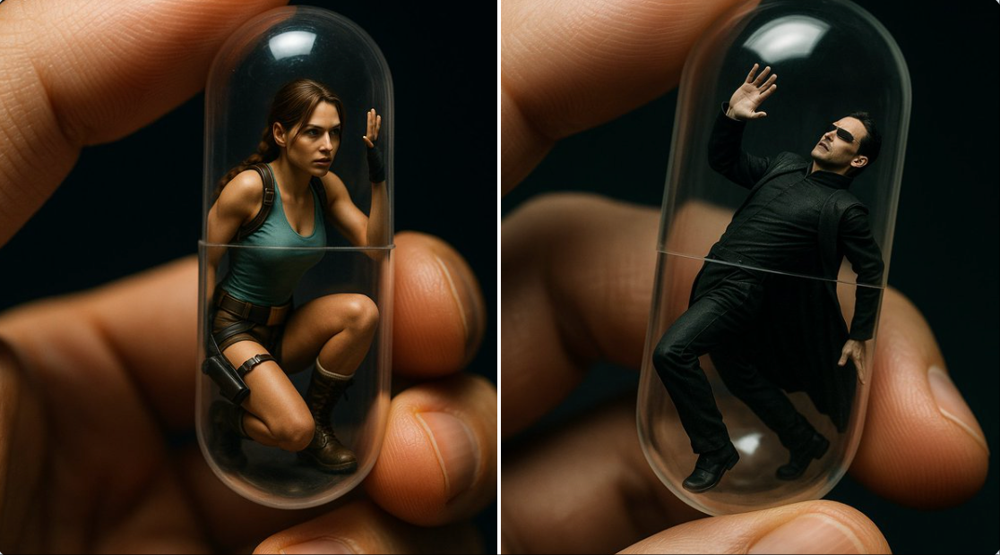


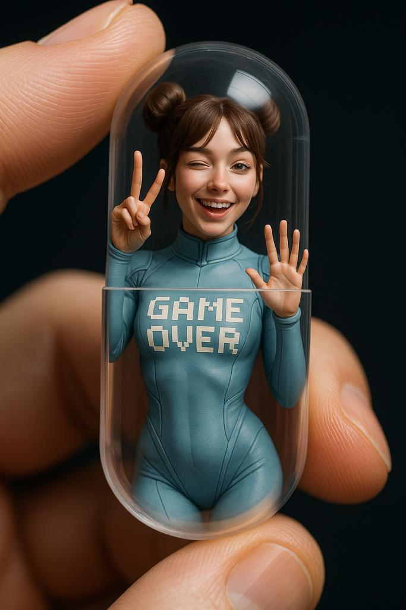
</div>

**提示词：**
```
Close-up, A hand holding a transparent capsule, inside it is a miniature model of [character name], wearing [their iconic outfit and accessories]. The character is posed in a [specific, expressive or dynamic pose], interacting with the inner surface of the capsule, as if they are frozen or confined inside. Hyper-realistic, cinematic, studio lighting setup, photographed with a macro lens.
```

**中文提示词：**
```
特写，一只手拿着一个透明的胶囊，里面是一个 [角色名称] 的微型模型，穿着 [他们的标志性服装和配饰]。角色以 [特定、富有表现力或动态的姿势] 摆姿势，与胶囊的内表面互动，就好像他们被冻结或限制在里面一样。超逼真、电影般的工作室照明设置，使用微距镜头拍摄。
```


<a id="prompt-168"></a>
## 案例 168：水果蜡烛 (来源 [@TheRelianceAI](https://x.com/TheRelianceAI/status/1938272260726350172))

<div style="display: flex; justify-content: space-between;">
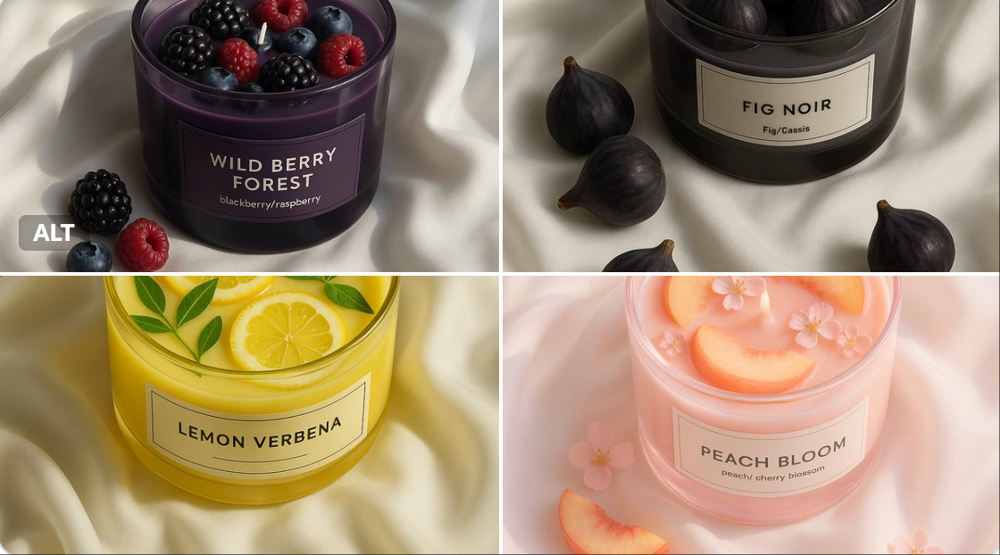
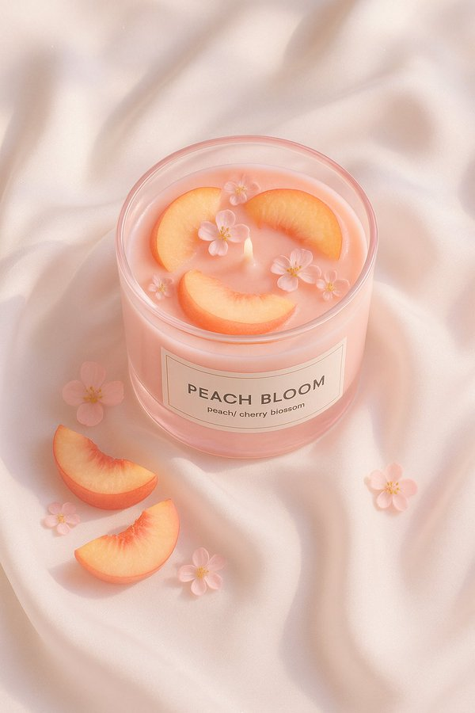
</div>

**提示词：**
```
A minimal still life of a round glass candle filled with [fruit], labeled “[SCENT NAME]”, placed on elegant white silk fabric. The candle glass is [glass color], and the wax matches the fruit color. The scene is softly lit by natural daylight with subtle shadows and smooth highlights. Hyperrealistic texture, clean aesthetic, top-down view, styled like high-end product photography.
```

**中文提示词：**
```
一个装满 [水果] 的圆形玻璃蜡烛的极简静物，标有“[SCENT NAME]”，放在优雅的白色丝绸织物上。蜡烛玻璃为【玻璃色】，蜡与水果色相配。该场景由自然日光柔和照亮，具有微妙的阴影和平滑的高光。超写实的质感，简洁的美感，自上而下的视角，风格像高端产品摄影。
```


<a id="prompt-167"></a>
## 案例 167：液态金属设计产品 (来源 [@hc_dsn](https://x.com/hc_dsn/status/1938203557771260064))

<div style="display: flex; justify-content: space-between;">
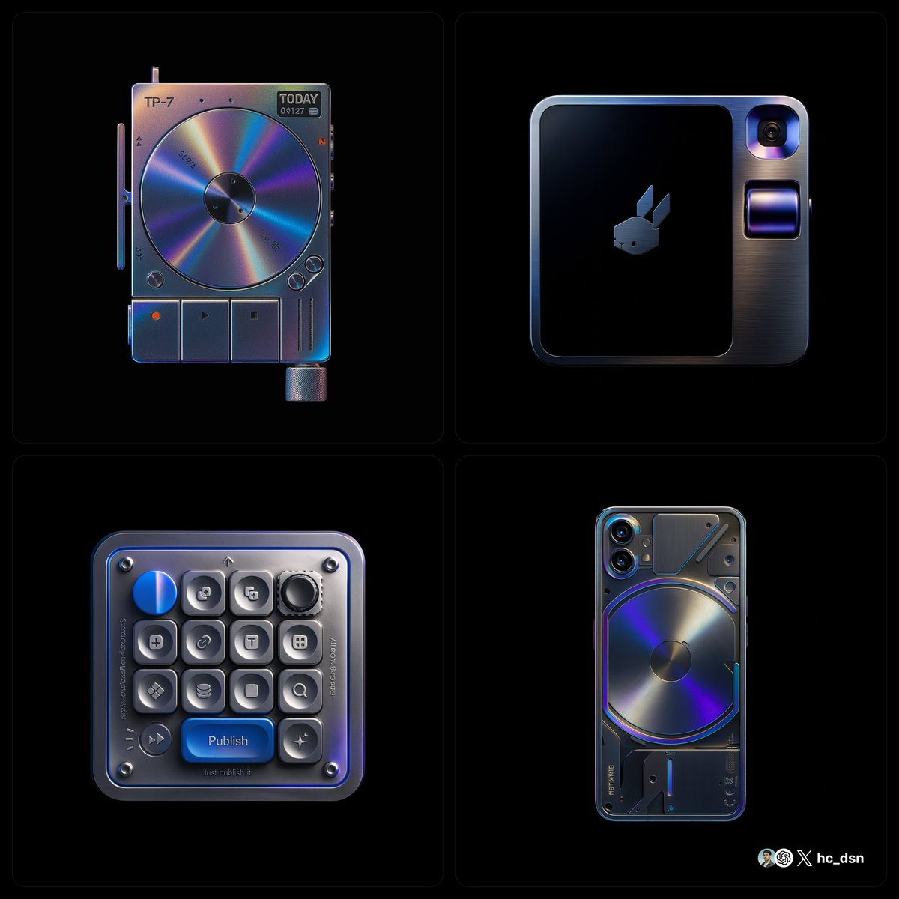

</div>

**提示词：**
```
create image with 1:1 ratio 
retexture the photo I attached with the following json 
{   "style_name": "hermes_subtle_specular_gradient",   "background": {     "type": "solid",     "color": "#000000",     "light_reflection": "none"   },   "base_material": {     "type": "polished_metal",     "color": "#B0B0B0",     "finish": "glossy",     "reflectivity": 0.75,     "surface_variation": {       "micro_noise": 0.005,       "brushed_direction": "none"     }   },   "highlight_strategy": {     "mode": "localized_specular_enhancement",     "trigger": "light-facing curved planes and direct lit faces",     "color_gradient": ["#121A28", "#3D4C6B", "#8c71b7", "#4d21cd"],     "gradient_type": "fluid_blend",     "intensity_curve": "ease-out from highlight center",     "falloff": 0.8,     "blend_mode": "soft_light",     "saturation_level": 0.4,     "coverage_ratio": 0.2,     "transition_smoothness": 0.95   },   "lighting": {     "scene_type": "high-control studio",     "key_light": {       "intensity": 1.0,       "color": "#FFFFFF",       "angle": "35° above and side",       "softness": 0.6     },     "fill_light": {       "enabled": false     },     "rim_light": {       "enabled": false     },     "reflection_behavior": {       "mirrored_zones": "limited to high exposure zones",       "glow_color": "applied from gradient with low saturation"     }   },   "specular_color_behavior": {     "base_surface": "metallic neutral",     "highlight_zones": "low-saturation chromatic reflection",     "edge_bleed": "minimal",     "inner_glow": 0.1   },   "detail_features": {     "engraved_elements": {       "type": "precise deboss",       "lighting_response": "low bounce",       "shadow_edge": "#222222",       "rim_light_tint": "#888888"     }   },   "application_targets": [     "object product photography",     "3D icons with selective lighting",     "branding renders",     "luxury UI component styling"   ],   "visual_effect_notes": {     "mood": "understated luxury, technical precision, controlled emotion",     "realism": "stylized physical logic",     "focus": "refined colored specular only on light-facing curved surfaces with fluid-like gradient transitions"   } }
```

**中文提示词：**
```
以 1：1 的比例创建图像
我用以下 json 对我附加的照片进行 retexture
{ “style_name”： “hermes_subtle_specular_gradient”， “background”： { “type”： “solid”， “color”： “#000000”， “light_reflection”： “none” }， “base_material”： { “type”： “polished_metal”， “color”： “#B0B0B0”， “finish”： “glossy”， “reflectivity”： 0.75， “surface_variation”： { “micro_noise”： 0.005， “brushed_direction”： “none” } }， “highlight_strategy”： { “mode”： “localized_specular_enhancement”， “trigger”： “朝光曲面和直接照明 faces“， ”color_gradient“： [”#121A28“， ”#3D4C6B“， ”#8c71b7“， ”#4d21cd“]， ”gradient_type“： ”fluid_blend“， ”intensity_curve“： ”从高光中心缓出“， ”衰减“： 0.8， ”blend_mode“： ”soft_light“， ”saturation_level“： 0.4， ”coverage_ratio“： 0.2， ”transition_smoothness“： 0.95 }， ”lighting“： { ”scene_type“： ”high-control studio“， ”key_light“： { ”intensity“：1.0， “color”： “#FFFFFF”， “angle”： “上侧 35°”， “柔和度”： 0.6 }， “fill_light”： { “enabled”： false }， “rim_light”： { “enabled”： false }， “reflection_behavior”： { “mirrored_zones”： “仅限于高曝光区域”， “glow_color”： “从低饱和度渐变应用” } }， “specular_color_behavior”： { “base_surface”： “金属中性”， “highlight_zones”： “低饱和度色度 reflection“， ”edge_bleed“： ”minimal“， ”inner_glow“： 0.1 }， ”detail_features“： { ”engraved_elements“： { ”type“： ”精确凹陷“， ”lighting_response“： ”低反弹“， ”shadow_edge“： ”#222222“， ”rim_light_tint“： ”#888888“ } }， ”application_targets“： [ ”对象产品 photography“， ”具有选择性照明的 3D 图标“， ”品牌渲染“， ”豪华 UI 组件样式“ ]， ”visual_effect_notes“： { ”mood“： ”低调奢华、技术精确、受控情感“， ”realism“： ”风格化的物理逻辑“， ”focus“： ”仅在具有流体般渐变过渡的面向光线的曲面上优化彩色镜面反射“ } }
```


<a id="prompt-166"></a>
## 案例 166：几何禅 (来源 [@LudovicCreator](https://x.com/LudovicCreator/status/1938330188414132727))

<div style="display: flex; justify-content: space-between;">
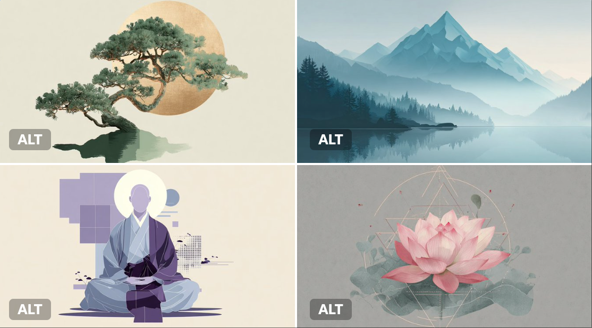

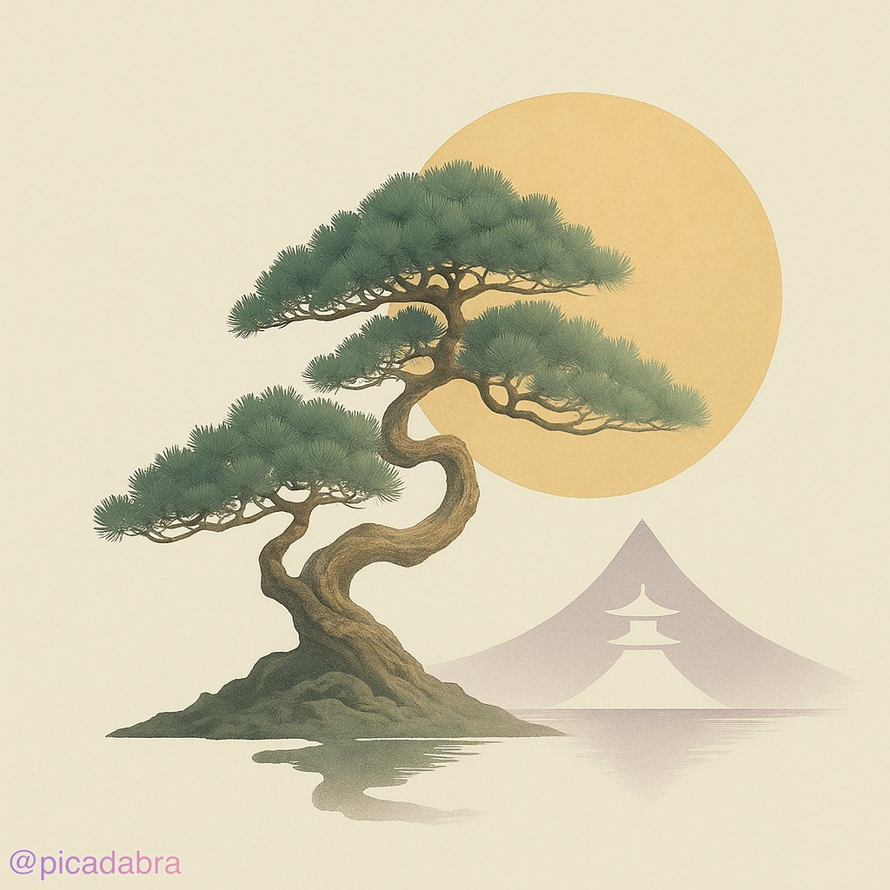
</div>

**提示词：**
```
[SUBJECT] illustrated in a Geometric Zen Tranquility style, where simplicity and balance are key. Utilize clean lines, basic shapes, and a serene color palette of [COLOR1] and [COLOR2] to evoke a sense of peace and harmony.
```

**中文提示词：**
```
[主题] 以几何禅宗宁静风格插图，其中简单和平衡是关键。利用简洁的线条、基本形状以及 [COLOR1] 和 [COLOR2] 的宁静调色板来唤起和平与和谐的感觉。
```

<a id="prompt-165"></a>
## 案例 165：用气泡膜覆盖表情符号 (来源 [@Anima_Labs](https://x.com/Anima_Labs/status/1938503818578178146))

<div style="display: flex; justify-content: space-between;">
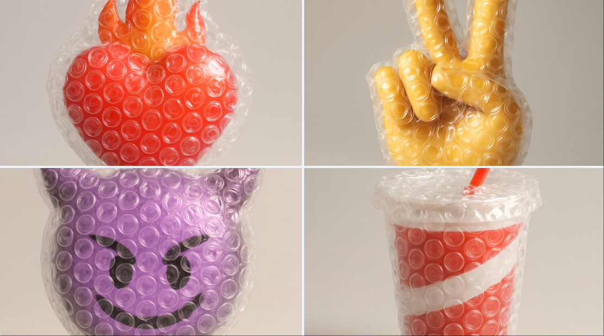
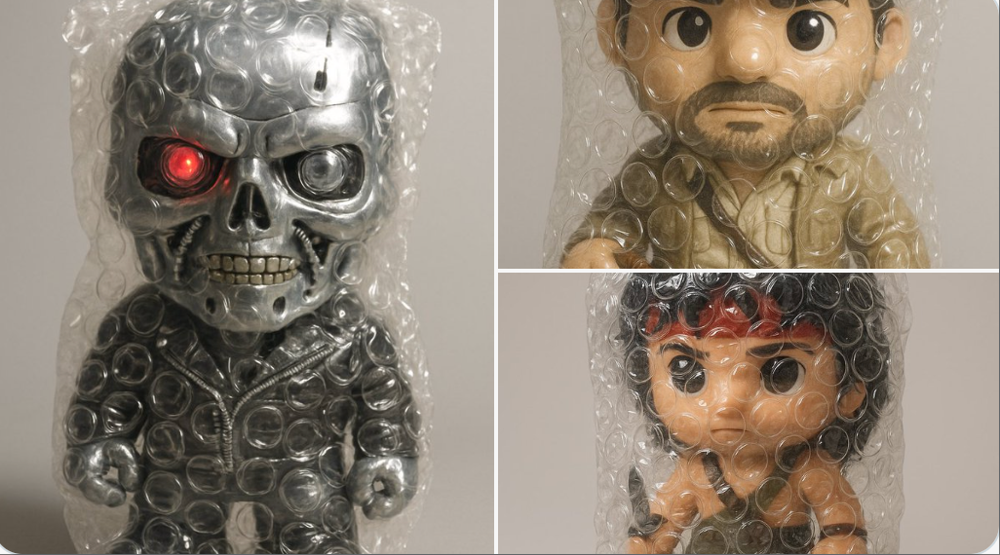
</div>

**提示词：**
```
A hyper-realistic 3D render of the emoji [❤️‍🔥], entirely wrapped in transparent bubble wrap. The plastic is tightly fitted, with clearly visible air-filled bubbles creating overlaid reflections and soft distortions of the emoji underneath. The wrap has a glossy, crinkled texture that catches the light in detailed highlights. Set against a soft, neutral grey background with subtle shadows. Studio lighting should emphasize the tactile quality of the bubble wrap and the surreal effect it creates. Whimsical, satisfying, and visually clean.
```

**中文提示词：**
```
表情符号 [ ❤️‍🔥 ] 的超逼真 3D 渲染 ，完全包裹在透明气泡膜中。塑料紧密贴合，清晰可见的充满空气的气泡在下面产生叠加的反射和表情符号的柔和扭曲。包裹具有有光泽的褶皱纹理，可在细节高光中捕捉光线。以柔和的中性灰色为背景，带有微妙的阴影。工作室照明应强调气泡膜的触觉质量及其产生的超现实效果。异想天开、令人满意且视觉上干净。
```

<a id="prompt-164"></a>
## 案例 164：将表情符号变成纸板 (来源 [@Anima_Labs](https://x.com/Anima_Labs/status/1938152354064609780))

<div style="display: flex; justify-content: space-between;">
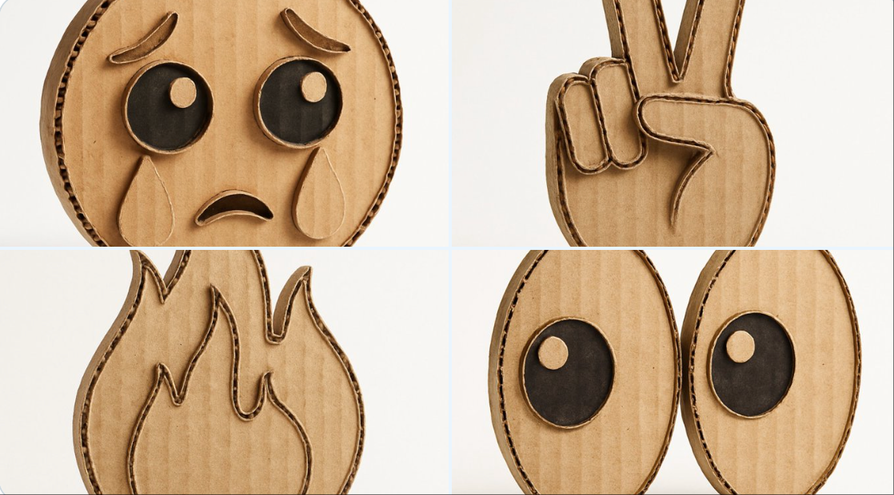
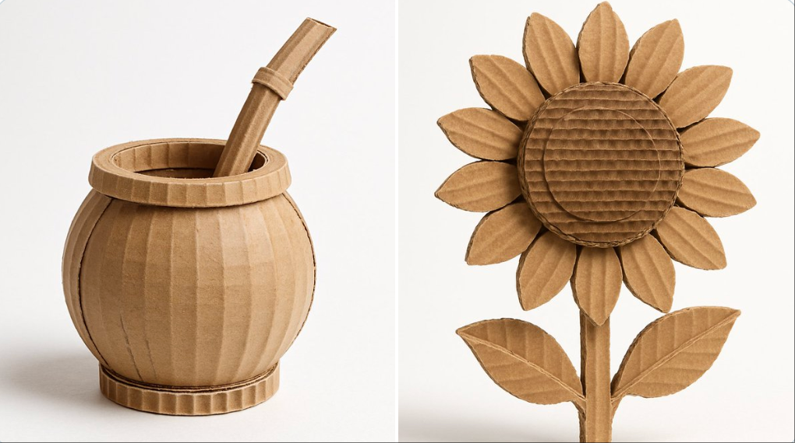
</div>

**提示词：**
```
Ultra high-resolution 3D render of the emoji [🥹], meticulously recreated as a realistic cardboard sculpture. The object is crafted from corrugated brown cardboard, featuring clearly defined fluted edges, visible layering, and rough kraft paper textures. Close-up studio
```

**中文提示词：**
```
表情符号 [ 🥹 ] 的超高分辨率 3D 渲染 ，精心重建为逼真的纸板雕塑。该物品由棕色瓦楞纸板制成，具有清晰的凹槽边缘、可见的层次和粗糙的牛皮纸纹理。特写工作室
```

<a id="prompt-163"></a>
## 案例 163：半透明玻璃物品ASMR (来源 [@azed_ai](https://x.com/azed_ai/status/1936825522417533274))

**说明：在几秒钟内使用 GPT-4o 将任何东西重新设计成半透明玻璃，然后使用这些图像创建 ASMR 视频**

<div style="display: flex; justify-content: space-between;">
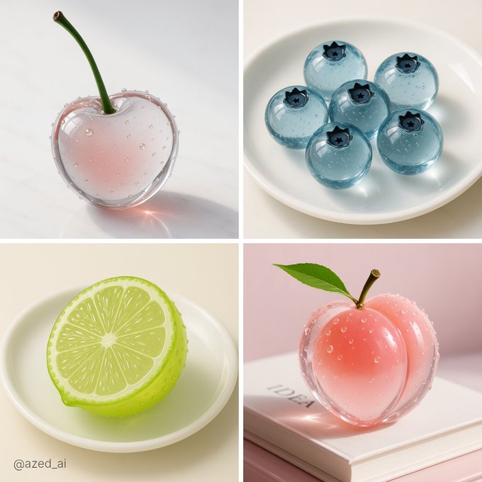
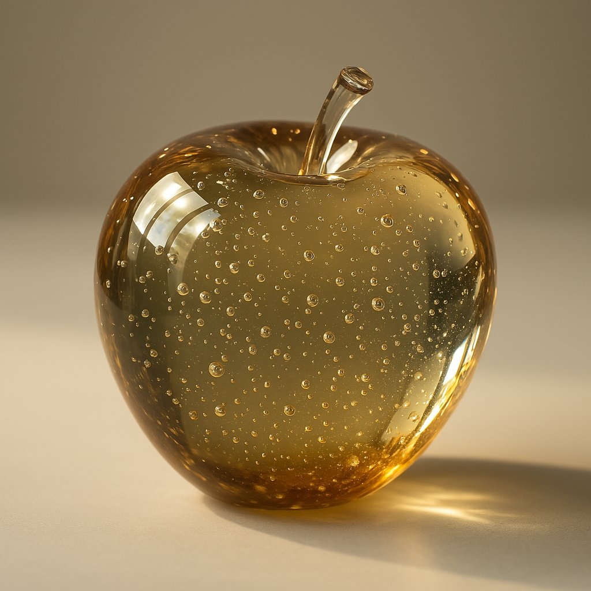


</div>

**提示词：**
```
Hyper-realistic [fruit name] made of translucent glass, smooth, rounded surface with fine air bubbles inside, placed on a clean surface, sharp lighting with strong reflections and highlights, minimal background, photorealistic, glossy texture, 3D render style, crystal-like appearance, soft shadows, macro photography
```

**中文提示词：**
```
由半透明玻璃制成的超写实 [水果名称]，光滑、圆润的表面，内部有细小的气泡，放置在干净的表面上，具有强烈反射和高光的清晰照明，最小的背景，照片级写实，有光泽的纹理，3D 渲染样式，水晶般的外观，柔和的阴影，微距摄影
```


<a id="prompt-162"></a>
## 案例 162：超现实主义蒸汽波 (来源 [@LudovicCreator](https://x.com/LudovicCreator/status/1936703218827817358))

<div style="display: flex; justify-content: space-between;">

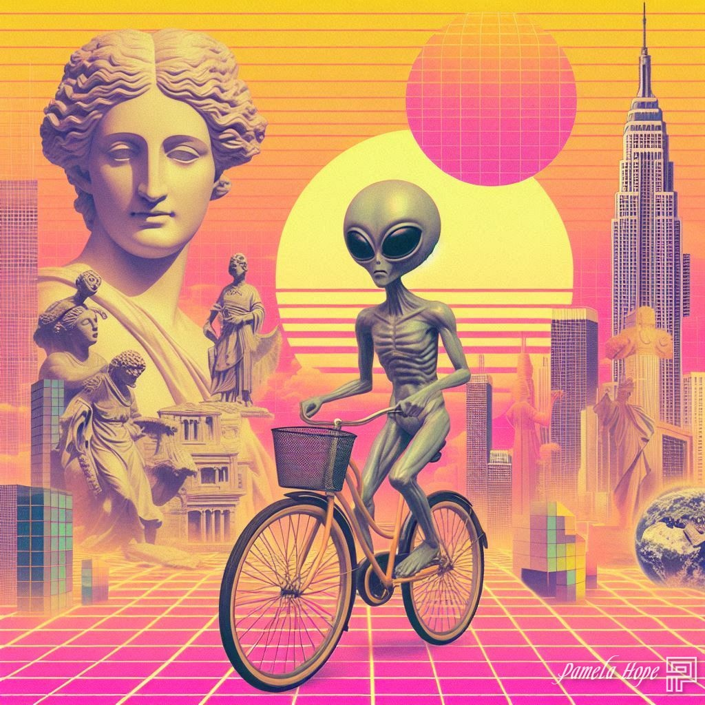
</div>

**提示词：**
```
[SUBJECT] in a Surrealist Vaporwave collage. Combine elements of classical sculpture, 80s retrofuturism, and Japanese cityscapes. Use pastel shades of [COLOR1] and [COLOR2] with hints of neon
```

**中文提示词：**
```
[主题] 在超现实主义蒸汽波拼贴画中。结合古典雕塑、80 年代复古未来主义和日本城市景观的元素。使用 [COLOR1] 和 [COLOR2] 的柔和色调，并带有淡淡的霓虹灯
```


<a id="prompt-161"></a>
## 案例 161：物品纹理处理 (来源 [@egeberkina](https://x.com/egeberkina/status/1936851399289037108))

<div style="display: flex; justify-content: space-between;">

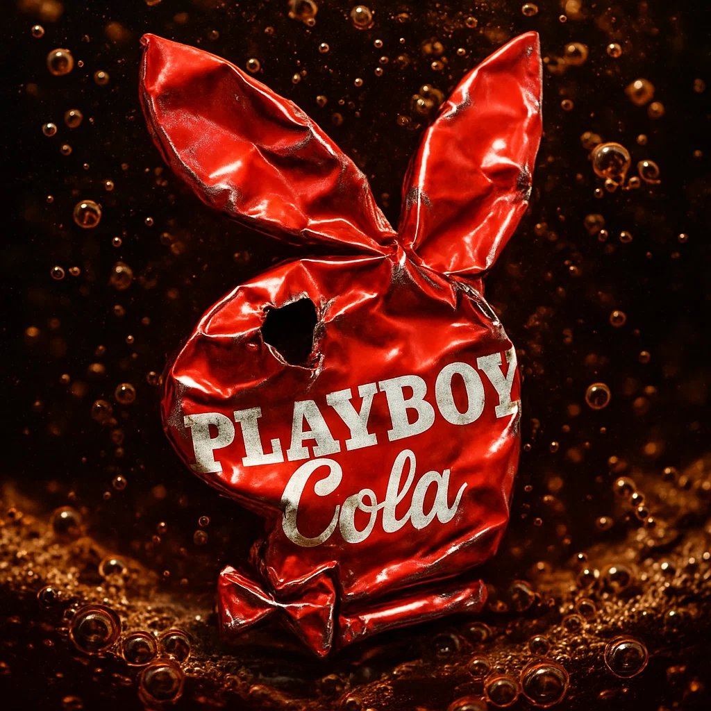
</div>

**提示词：**
```
retexture the image attached based on the JSON below:
{
  "style_name": "Transparent Studio Render",
  "visual_rules": {
    "form": {
      "shape": "preserve original object shape",
      "outline": "no outlines, use smooth geometry transitions and bevels"
    },
    "lighting": {
      "style": "studio-style 3-point lighting or soft HDRI setup",
      "highlight": "subtle specular highlights for semi-matte plastic or coated surfaces",
      "shadow": "soft drop shadow directly beneath the object, cast on a translucent floor plane"
    },
    "texture": {
      "surface": "smooth or lightly textured based on object, clean shader setup with minimal noise",
      "branding": "bold and high-contrast, treated as printed decals or sticker-style labels"
    },
    "material": {
      "finish": "semi-matte or satin shader, mimicking printed plastic or coated materials"
    },
    "color_handling": {
      "strategy": "make the object's primary color the focal point",
      "enhancement": "slightly boosted saturation and contrast for clean product visualization"
    },
    "background": {
      "type": "fully transparent (alpha channel)",
      "shadow": "optional soft drop shadow directly beneath the object to ground it visually"
    }
  },
  "rendering": {
    "camera_angle": "centered front view or slightly elevated for dimensional clarity",
    "depth_of_field": "neutral or slightly shallow to keep object fully sharp",
    "background_blur": "none, background remains transparent"
  }
}
```

**中文提示词：**
```
根据以下 JSON 对附加的图片进行重新纹理处理：
{
“style_name”： “透明工作室渲染”，
“visual_rules”： {
“form”： {
“shape”： “保留原始对象形状”，
“outline”： “无轮廓，使用平滑的几何过渡和斜面”
    },
“照明”： {
“style”： “工作室风格的 3 点光照或柔和 HDRI 设置”，
“highlight”： “半哑光塑料或涂层表面的细微镜面反射高光”，
“shadow”： “对象正下方的柔和投影，投射在半透明地板平面上”
    },
“texture”： {
“surface”： “基于对象的平滑或轻微纹理，干净的着色器设置，噪点最小”，
“branding”： “粗体且对比度高，被视为印刷贴花或贴纸式标签”
    },
“material”： {
“finish”： “半哑光或缎面着色器，模拟打印塑料或涂层材质”
    },
“color_handling”： {
“strategy”： “将对象的原色作为焦点”，
“enhancement”： “略微提高饱和度和对比度，实现清晰的产品可视化”
    },
“背景”： {
“type”： “完全透明（Alpha 通道）”，
“shadow”： “可选的软投影正下方，使其在视觉上接地”
    }
  },
“渲染”： {
“camera_angle”： “居中前视图或略微升高以提高尺寸清晰度”，
“depth_of_field”： “中性或稍浅，以保持物体完全清晰”，
“background_blur”： “无，背景保持透明”
  }
}
```

<a id="prompt-160"></a>
## 案例 160：新动漫风格 (来源 [@Artedeingenio](https://x.com/Artedeingenio/status/1937069198921924968))

<div style="display: flex; justify-content: space-between;">

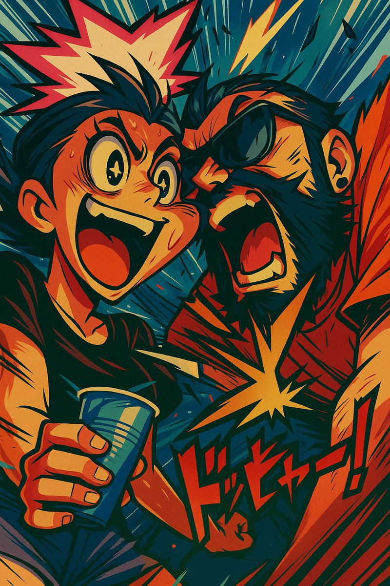
</div>

**提示词：**
```
Transform this image into an over-the-top anime illustration in the style of Trigger / Gainax. Use exaggerated expressions, wild motion lines, and hyperdynamic poses. The anatomy should be fluid and distorted for emphasis — limbs stretching or snapping into action. Add speed lines, explosive backgrounds, and dramatic lighting effects. Integrate onomatopoeia or stylized text for extra chaos. Colors should be bold, saturated, and contrasting. The result should feel like a freeze frame from Kill la Kill or FLCL, mid-action, full of energy and visual impact.
```

**中文提示词：**
```
将此图像转换为 Trigger / Gainax 风格的夸张动漫插图。使用夸张的表情、狂野的运动线条和超动态姿势。解剖结构应该是流畅的，并且为了强调而扭曲——四肢伸展或突然行动起来。添加速度线、爆炸性背景和戏剧性的灯光效果。集成拟声词或风格化文本以增加混乱。颜色应大胆、饱和且具有对比性。结果应该感觉像是 Kill la Kill 或 FLCL 的定格，在动作中，充满活力和视觉冲击力。
```


<a id="prompt-159"></a>
## 案例 159：渲染宝石 (来源 [@alban_gz](https://x.com/alban_gz/status/1936820704713875818))

<div style="display: flex; justify-content: space-between;">

</div>

**提示词：**
```
Recreate this image using the pamareters of the JSON provided.
{
  "name": "Gemstone Render",
  "object": {
    "type": "auto",
    "detected_color": "auto",
    "form": "realistic, natural form preserved",
    "material": "crystal or faceted gemstone glass",
    "surface": "precision-cut facets, sharp reflections",
    "transparency": "high clarity with light refraction",
    "internal_features": "color depth, internal shimmer, and light dispersion"
  },
  "color_and_light": {
    "primary_color": "{detected_color}",
    "highlight_effects": "specular highlights, gemstone brilliance, caustics",
    "lighting_setup": "studio lighting with white or soft background",
    "metallic_accents": {
      "enabled": true,
      "material": "gold or chrome",
      "application": "rim, stem, or edge detailing"
    }
  },
  "style": {
    "artistic_style": [
      "photorealistic 3D render",
      "Gemstone Render Style",
      "luxury object visualization"
    ],
    "design_language": [
      "faceted precision modeling",
      "jewelry-like rendering",
      "optical depth and brilliance"
    ]
  },
  "technical_details": {
    "render_engine": [
      "Blender with Cycles",
      "Cinema 4D + Redshift/Octane"
    ],
    "rendering_techniques": [
      "physically-based rendering (PBR)",
      "ray tracing",
      "global illumination"
    ],
    "resolution": "ultra high-res (4K–8K)",
    "post_processing": [
      "subtle glow",
      "enhanced reflections",
      "color-preserving contrast boost"
    ]
  }
```

**中文提示词：**
```
使用提供的 JSON 的 pamareters 重新创建此图像。
{
“name”： “宝石渲染”，
“对象”： {
“type”： “auto”， //类型
“detected_color”： “auto”，
“form”： “保留真实、自然的形式”，
“material”： “水晶或刻面宝石玻璃”，
“surface”： “精确切割的刻面，清晰的反射”，
“transparency”： “高清晰度，光线折射”，
“internal_features”： “颜色深度、内部微光和光色散”
  },
“color_and_light”： {
“primary_color”： “{detected_color}”，
“highlight_effects”： “镜面高光、宝石亮度、焦散”，
“lighting_setup”： “白色或柔和背景的工作室照明”，
“metallic_accents”： {
“enabled”： true 和
“material”： “金或铬”，
“application”： “边缘、茎或边缘细节”
    }
  },
“样式”： {
“artistic_style”：[
“逼真的 3D 渲染”，
“Gemstone Render Style”（宝石渲染样式）、
“奢侈品对象可视化”
],
“design_language”：[
“faceted precision modeling”，
“珠宝般的渲染”，
“光学深度和亮度”
    ]
  },
“technical_details”： {
“render_engine”：[
“带循环的 Blender”，
“Cinema 4D + Redshift/Octane”
],
“rendering_techniques”：[
“基于物理的渲染 （PBR）”，
“光线追踪”，
“全局照明”
],
“resolution”： “超高分辨率 （4K–8K）”，
“post_processing”：[
“微妙的光芒”，
“增强反射”，
“保色对比度提升”
    ]
  }
```


<a id="prompt-158"></a>
## 案例 158：品牌3D卡通动物角色 (来源 [@B_4AI](https://x.com/B_4AI/status/1937010045062959468))

<div style="display: flex; justify-content: space-between;">
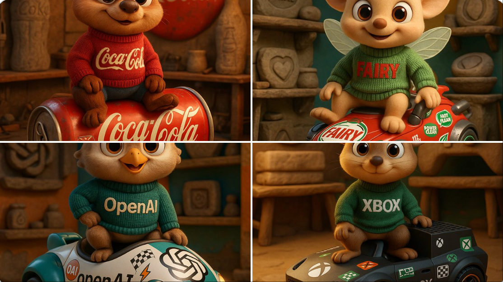
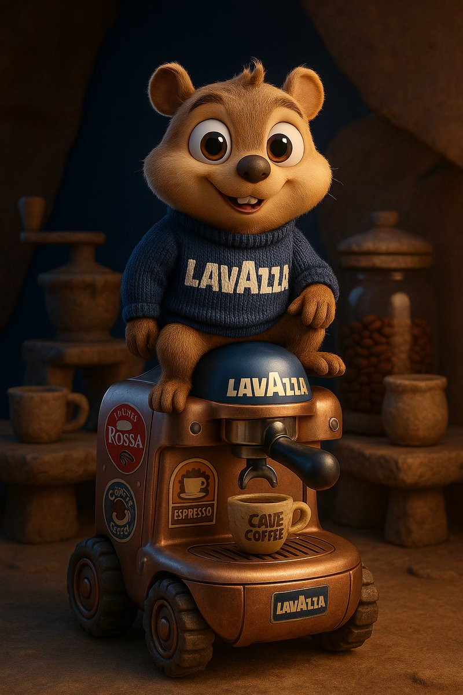
</div>

**提示词：**
```
A high-quality 3D cartoon animal character inspired by [Brand Name], with large round eyes and an innocent, friendly expression. The character wears a knitted sweater featuring the brand name in bold letters. It sits confidently atop a futuristic vehicle shaped like a product from the brand, fully inspired by the brand’s design language and covered in racing stickers and symbolic brand logos. The scene is set inside a maintenance workshop that showcases Stone Age-era versions of the brand's products. The background blends the brand’s visual identity colors. The design must be highly detailed, with Pixar-style lighting and realistic textures for the character, fabric, and vehicle. Format: full-body, in a dynamic pose, rendered in 4K CGI.
```

**中文提示词：**
```
受 [品牌名称] 启发的高品质 3D 卡通动物角色，拥有圆圆的大眼睛和天真友好的表情。该角色穿着一件针织毛衣，上面印有粗体字的品牌名称。它自信地坐在一辆形状像该品牌产品的未来主义汽车上，完全受到品牌设计语言的启发，并覆盖着赛车贴纸和象征性的品牌标志。场景设置在一个维修车间内，该车间展示了该品牌产品的石器时代版本。背景融合了品牌的视觉识别颜色。设计必须非常详细，具有皮克斯风格的照明和角色、织物和车辆的逼真纹理。格式：全身，动态姿势，以 4K CGI 渲染。
```


<a id="prompt-157"></a>
## 案例 157：最小天气小部件 (来源 [@hc_dsn](https://x.com/hc_dsn/status/1937118859083047137))

<div style="display: flex; justify-content: space-between;">


</div>

**提示词：**
```
create image with 1:1 ratio 
surreal minimal aesthetic, airplane window frame on subtle gradient backdrop with same color, through the oval window showing random iconic landmark scenery of [Country Name], an overlay weather ui interface on the center of window, from top to bottom, contain the small weather icon, huge temperatures with elegant light weight font, and small location tag beneath it, the bottom is the country name, generate with extreme weathers, the window will affect by the weather, the color combo of subtle gradient backdrop is resonate with the weather, natural lighting, soft shadows, subtle reflections on glass, great negative space
```

**中文提示词：**
```
以 1：1 的比例创建图像
超现实的极简美学，飞机窗框在微妙的渐变背景上，同色系，通过椭圆形窗口随机展示【国家名称】的标志性地标风景，窗口中央叠加天气 UI 界面，从上到下，包含小天气图标，巨大的温度搭配优雅的轻量级字体，下方有小位置标签， 底部是国名，在极端天气下生成，窗户会受到天气的影响，微妙的渐变背景的颜色组合与天气产生共鸣，自然光，柔和的阴影，玻璃上的微妙反射，巨大的负空间
```


<a id="prompt-156"></a>
## 案例 156：作为家具的著名地标 (来源 [@zeng_wt](https://x.com/zeng_wt/status/1936743124522750336))

<div style="display: flex; justify-content: space-between;">
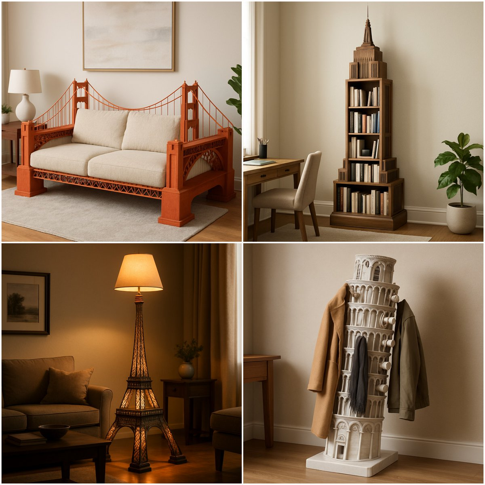

</div>

**提示词：**
```
The [LANDMARK - Statue of Liberty/Eiffel Tower/Big Ben] perfectly carved and functional as a [FURNITURE_PIECE - lamp/bookshelf/coffee table], living room setting, normal scale furniture, photorealistic detail.
```

**中文提示词：**
```
[LANDMARK - 自由女神像/埃菲尔铁塔/大本钟]雕刻完美，功能强大，就像一个[FURNITURE_PIECE - 灯/书架/咖啡桌]，客厅设置，正常比例的家具，逼真的细节。
```


<a id="prompt-155"></a>
## 案例 155：自己的国家地标时尚杂志 (来源 [@TheRelianceAI](https://x.com/TheRelianceAI/status/1936802168318910673))

<div style="display: flex; justify-content: space-between;">

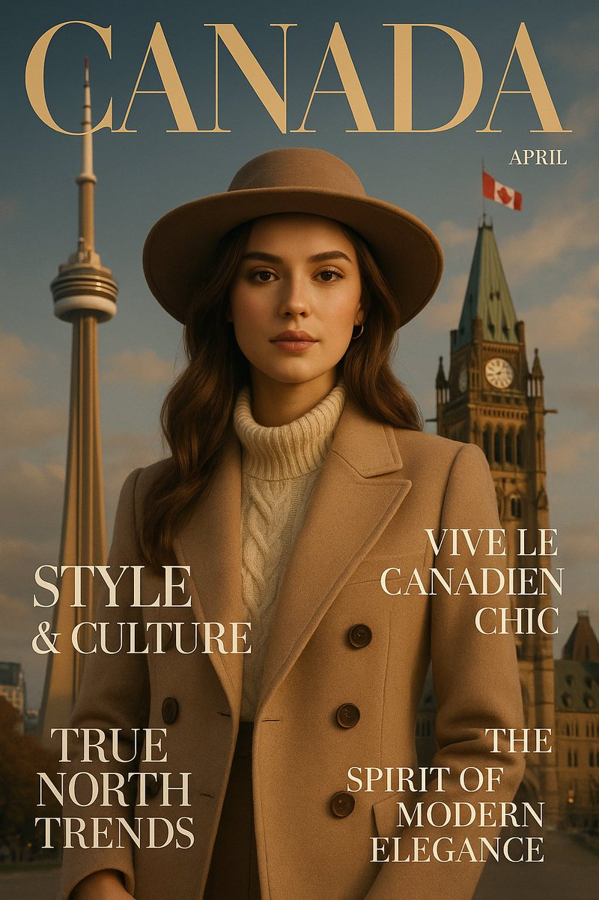
</div>

**提示词：**
```
a luxurious fashion magazine cover designed in the style of [COUNTRY], blending iconic landmarks, cultural symbols, and local fashion aesthetics. The layout mimics high-end editorial design, with headlines inspired by the country’s language, trends, and lifestyle. Sophisticated, cinematic lighting, vertical 9:16 format, ultra-detailed, Vogue-level elegance
```

**中文提示词：**
```
以 [COUNTRY] 风格设计的豪华时尚杂志封面，融合了标志性地标、文化符号和当地时尚美学。布局模仿高端编辑设计，标题的灵感来自该国的语言、趋势和生活方式。精致的电影级灯光，垂直 9：16 格式，超细节，Vogue 级别的优雅
```


<a id="prompt-154"></a>
## 案例 154：五颜六色的针织 (来源 [@umesh_ai](https://x.com/umesh_ai/status/1936665222271615107))

<div style="display: flex; justify-content: space-between;">

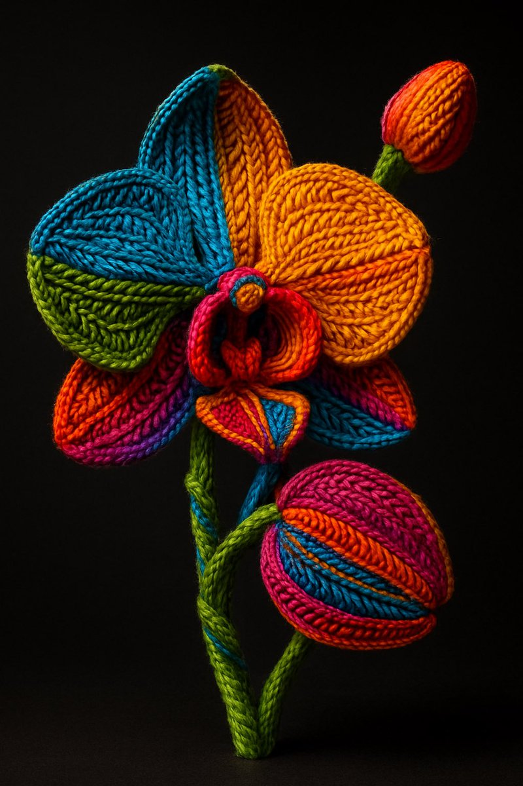
</div>

**提示词：**
```
A hyper-realistic, artistic rendering of a [OBJECT] entirely wrapped in colorful, tightly woven yarn and embroidery threads. The surface is covered in intricate, detailed textile patterns—knit, braided, and woven in a variety of textures. Each section of the [OBJECT] is segmented with vivid, high-saturation colors including electric blue, bright orange, vivid green, magenta, and golden yellow. The yarn follows the contours of the [OBJECT], highlighting its shape with layered embroidery. The scene is lit dramatically, with a soft spotlight casting shadows to emphasize the 3D depth and tactile surface. The background is a solid, dark gradient to draw full focus to the texture and color. The style is a blend of surrealism and fiber art, showcasing extreme detail and depth
```

**中文提示词：**
```
一个 [OBJECT] 的超现实主义、艺术渲染，完全包裹在五颜六色、紧密编织的纱线和绣花线中。表面覆盖着复杂、细致的纺织图案 - 针织、编织和编织，具有各种纹理。[OBJECT] 的每个部分都用鲜艳、高饱和度的颜色分割，包括电光蓝、亮橙色、鲜艳的绿色、品红色和金黄色。纱线遵循 [OBJECT] 的轮廓，以分层刺绣突出其形状。场景被戏剧性地照亮，柔和的聚光灯投下阴影以强调 3D 深度和触觉表面。背景是一个纯色的深色渐变，用于将全部焦点吸引到纹理和颜色上。风格融合了超现实主义和纤维艺术，展示了极端的细节和深度
```


<a id="prompt-153"></a>
## 案例 153：霓虹灯线框 (来源 [@azed_ai](https://x.com/azed_ai/status/1936741480972079563))

<div style="display: flex; justify-content: space-between;">
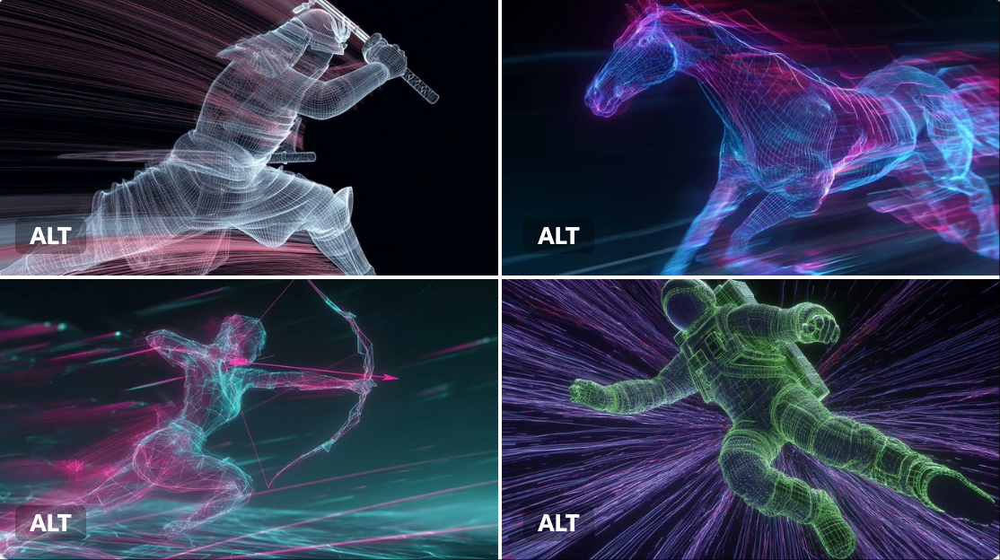
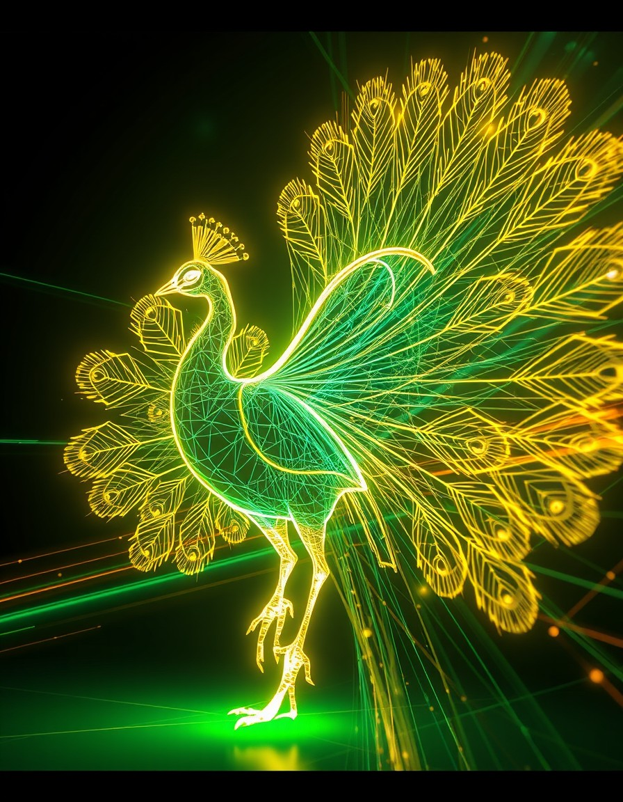
</div>

**提示词：**
```
A neon wireframe visualization of a [subject], traced in glowing [color1] and [color2] vector lines. Suspended in a digital void, the figure is surrounded by speed trails, motion blur, and shifting geometric shadows, evoking a sense of kinetic energy and futuristic momentum.
```

**中文提示词：**
```
[主体] 的霓虹灯线框可视化，以发光的 [color1] 和 [color2] 矢量线描摹。这个人物悬浮在数字虚空中，周围环绕着速度轨迹、运动模糊和不断变化的几何阴影，唤起了一种动能和未来主义的动力。
```


<a id="prompt-152"></a>
## 案例 152：新动漫风格 (来源 [@Artedeingenio](https://x.com/Artedeingenio/status/1936716854090760197))

<div style="display: flex; justify-content: space-between;">


</div>

**提示词：**
```
Transform this image into a 1960s Tezuka-style illustration. Use big, rounded expressive eyes with bright highlights. Simplify the anatomy with soft, rounded limbs and clean linework. Avoid detailed textures — focus on smooth color fills and strong silhouettes. The final image should resemble a vintage anime frame from Astro Boy, with an optimistic, futuristic feel.
```

**中文提示词：**
```
将此图像转换为 1960 年代手冢风格的插图。使用大而圆、富有表现力的眼睛，并带有明亮的高光。通过柔软、圆润的四肢和简洁的线条简化解剖结构。避免细节纹理 - 专注于平滑的颜色填充和强烈的轮廓。最终的图像应该类似于 Astro Boy 的老式动漫框架，具有乐观、未来主义的感觉。
```


<a id="prompt-151"></a>
## 案例 151：Neoglo风格Logo (来源 [@aziz4ai](https://x.com/aziz4ai/status/1936744152366288926))

<div style="display: flex; justify-content: space-between;">


</div>

**提示词：**
```
Design a modern logo in NeoGradient Soft Tech style for a fictional startup called “NAME” in the “[INDUSTRY TYPE]” industry.

The logo must include:
•A unique abstract icon
•A clean, bold sans-serif logotype
•Smooth glowing gradients blending vibrant colors like blue, purple, pink, orange, and teal
•Seamless harmony between symbol and text
•Minimalist, futuristic composition
•On a pure black background
•1:1 aspect ratio — ultra-HD

The logo should feel creative, modern, and ready for a bold digital brand.
```

**中文提示词：**
```
为“[INDUSTRY TYPE]”行业中名为 “NAME” 的虚构初创公司设计一个 NeoGradient Soft Tech 风格的现代标志。

徽标必须包含：
•独特的抽象图标
•干净、大胆的无衬线标识
•平滑的发光渐变，混合了蓝色、紫色、粉红色、橙色和蓝绿色等鲜艳的颜色
•符号和文本之间的无缝协调
•极简主义、未来主义的构图
•在纯黑色背景上
•1：1 纵横比 — 超高清

徽标应该具有创意、现代感，并为大胆的数字品牌做好准备。
```

<a id="prompt-150"></a>
## 案例 150：乙烯基玩具 (来源 [@azed_ai](https://x.com/azed_ai/status/1937104120097407069))

<div style="display: flex; justify-content: space-between;">


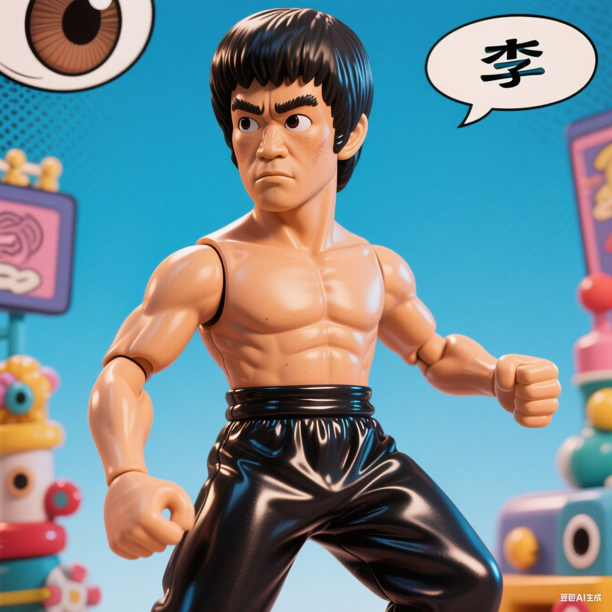
</div>

**提示词：**
```
A comic-style caricature illustration of [subject], with an oversized head and expressive eyes, rendered in a hyper-realistic vinyl toy aesthetic. The character features exaggerated proportions, glossy textures, and playful details, blending caricature art with collectible figure charm.
```

**中文提示词：**
```
[主题]的漫画风格漫画插图，具有超大的头部和富有表现力的眼睛，以超逼真的乙烯基玩具美学呈现。该角色具有夸张的比例、光滑的纹理和俏皮的细节，将漫画艺术与收藏人物魅力融为一体。
```


<a id="prompt-149"></a>
## 案例 149：Gorillaz风格角色 (来源 [@gnrlyxyz](https://x.com/gnrlyxyz/status/1936834901552111768))

<div style="display: flex; justify-content: space-between;">
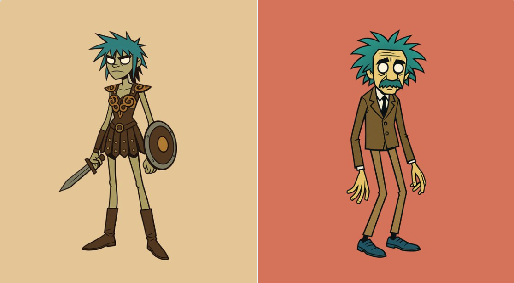
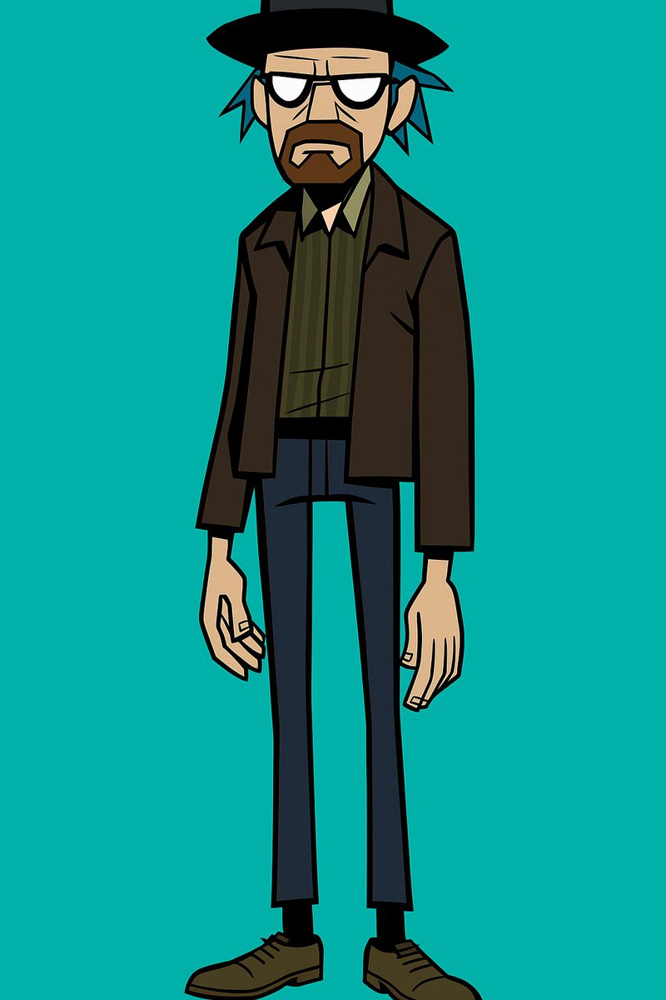
</div>

**提示词：**
```
Create a stylized full-body portrait of [your subject] in the Gorillaz character aesthetic. Give the character an exaggeratedly lanky build with long, skinny legs and narrow arms. Use simplified, angular features and thick, bold outlines. Style the hair to be spiky, tousled, or exaggerated, in a non-natural color like [blue or green]. The eyes must be blank white with no pupils. Use flat, solid colors only. No gradients, shadows, or textures. Background should be a single flat color. Design must be vector friendly and print ready.
```

**中文提示词：**
```
在 Gorillaz 角色美学中为 [您的主题] 创建风格化的全身肖像。给角色一个夸张的瘦长身材，长而瘦的腿和狭窄的手臂。使用简化的棱角分明的特征和粗体轮廓。将头发设计成尖尖的、凌乱的或夸张的，用非自然的颜色，如 [蓝色或绿色]。眼睛必须是空白的白色的，没有瞳孔。仅使用纯色。没有渐变、阴影或纹理。背景应为单一的平面颜色。设计必须对矢量友好并准备好打印。
```


<a id="prompt-148"></a>
## 案例 148：怀旧午后阳光 (来源 [@BeanieBlossom](https://x.com/BeanieBlossom/status/1936756146817372428))

<div style="display: flex; justify-content: space-between;">
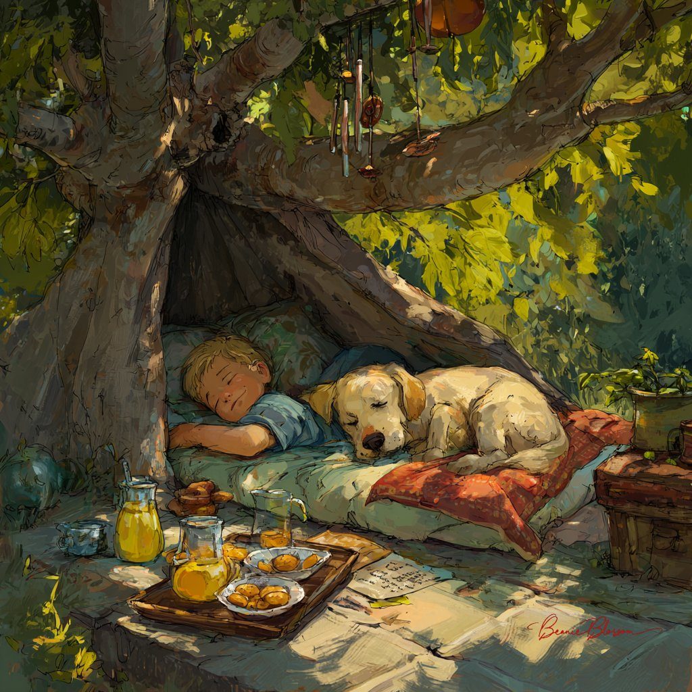
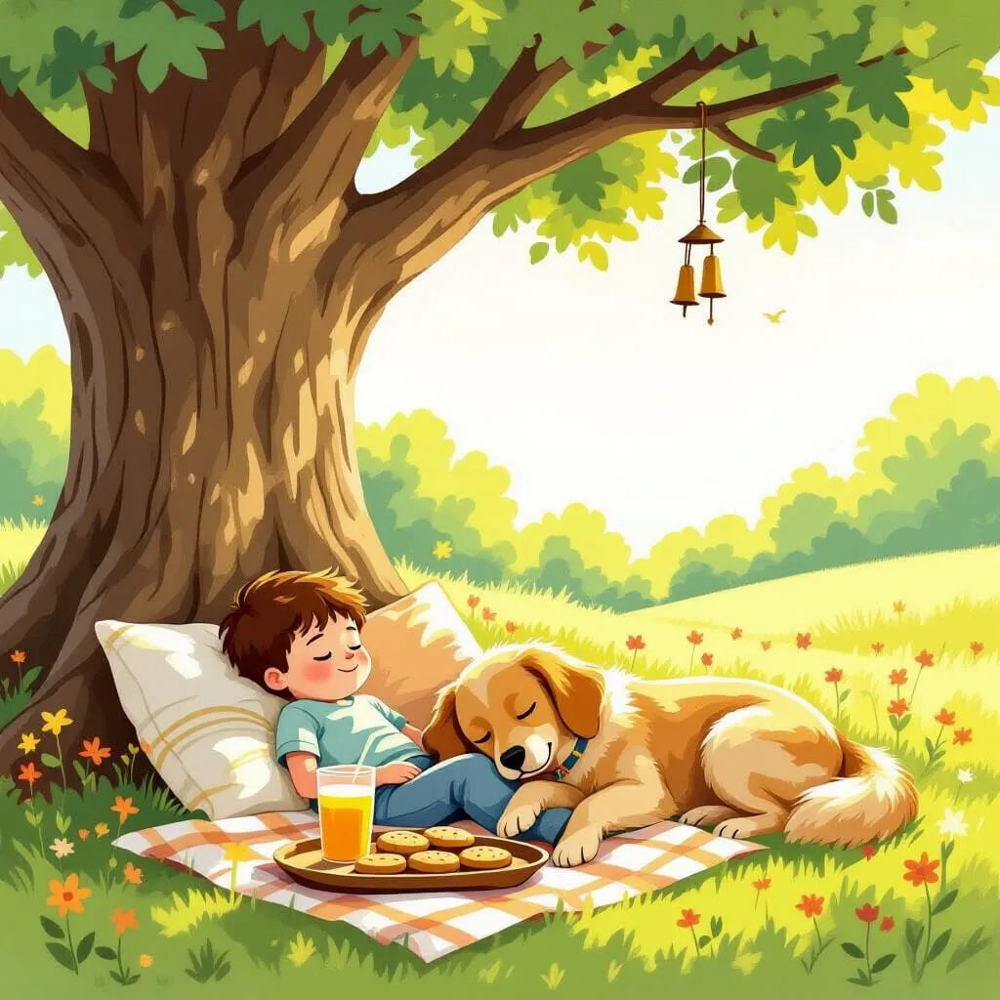
</div>

**提示词：**
```
a pillow fort in the backyard, shaded by a big old tree. Sunlight filters through the leaves, and a young boy and his golden retriever naps beside a tray of lemonade and cookies. Wind chimes tinkle gently in the breeze. Warm afternoon light, playful and nostalgic, children's book illustrated feeling
```

**中文提示词：**
```
后院的一座枕头堡，被一棵大老树遮蔽。阳光透过树叶洒进来，一个小男孩和他的金毛猎犬在一盘柠檬水和饼干旁边打盹。风铃在微风中轻轻地叮叮当当。温暖的午后阳光，俏皮又怀旧，童书图画情怀
```


<a id="prompt-147"></a>
## 案例 147：玻璃变形海报 (来源 [@aziz4ai](https://x.com/aziz4ai/status/1936950051856941470))

<div style="display: flex; justify-content: space-between;">
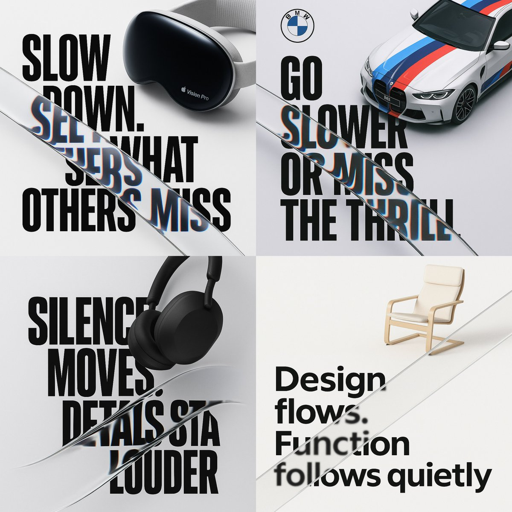
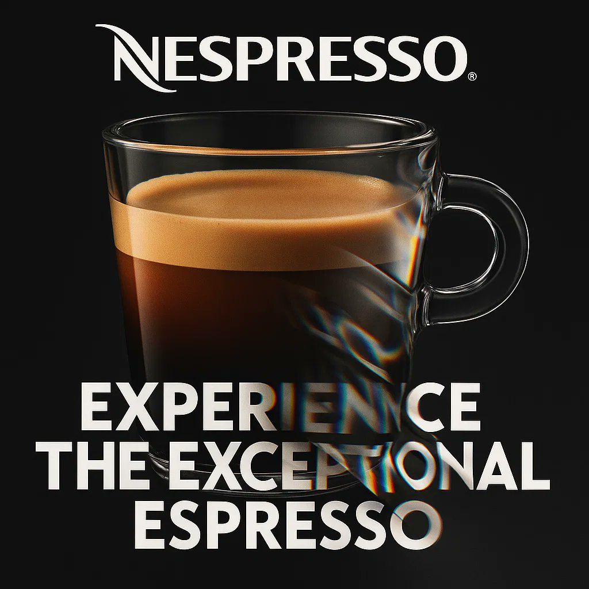
</div>

**提示词：**
```
Design a cinematic brand poster featuring “[BRAND NAME]” — include a bold six-word slogan beneath — apply a 3D glass refraction effect that distorts part of the text or layout — incorporate the brand logo in the top corner — smooth shadows, glossy lighting, black extra-bold typography — clean modern background — high-resolution, 1:1 aspect ratio
```

**中文提示词：**
```
设计一张带有“[BRAND NAME]”字样的电影式品牌海报 — 在下面包括一个粗体的六字标语 — 应用 3D 玻璃折射效果，使部分文本或布局失真 — 在右上角加入品牌徽标 — 平滑的阴影、有光泽的照明、黑色超粗体排版 — 干净的现代背景 — 高分辨率、1：1 的纵横比
```


<a id="prompt-146"></a>
## 案例 146：全息叠加效果彩虹渐变 (来源 [@aziz4ai](https://x.com/aziz4ai/status/1936892719202193900))

<div style="display: flex; justify-content: space-between;">
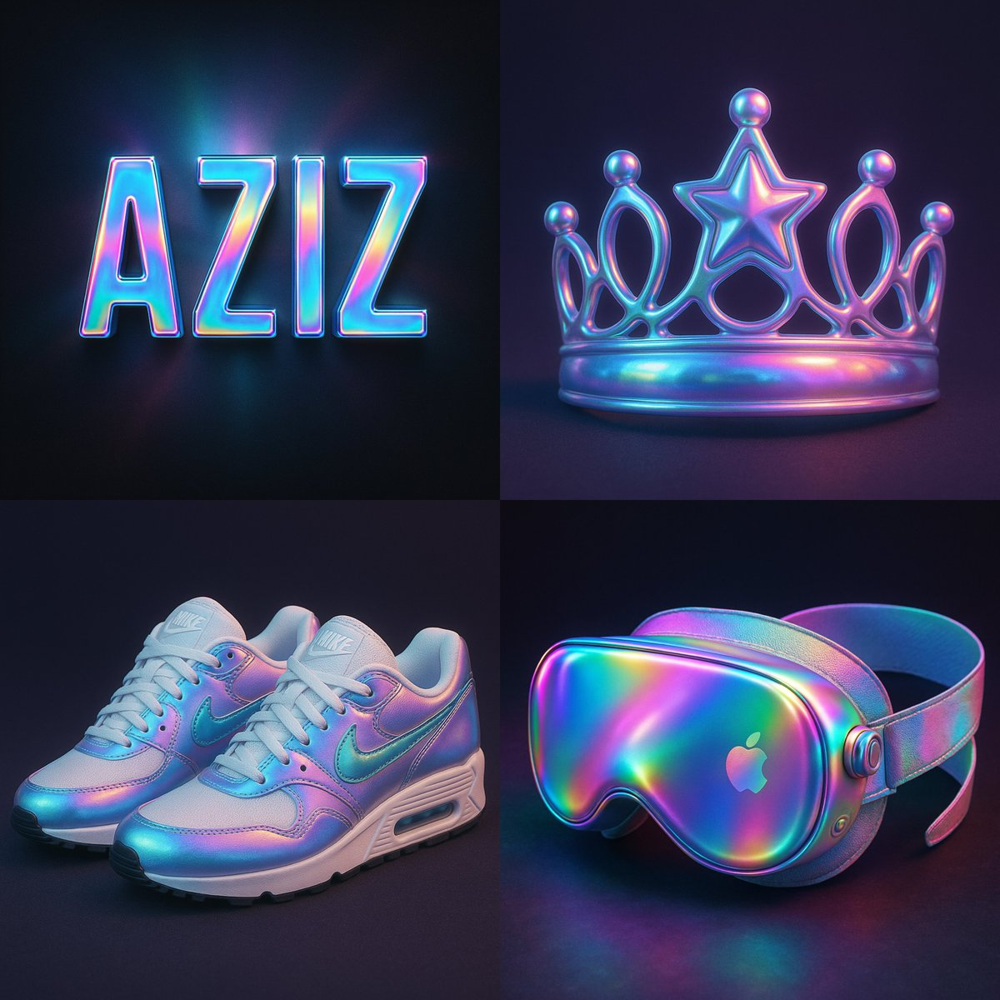

</div>

**提示词：**
```
Apply a holographic overlay effect on [SUBJECT/TEXT] — dreamy rainbow gradients with soft radial light reflections — smooth glossy surface, high contrast blending — iridescent hues like pink, teal, cyan, and purple — noise texture with soft light blend — subtle shadows and edge lighting to add depth — centered composition on a dark background — ultra-HD, 1:1 ratio, cinematic lighting
```

**中文提示词：**
```
在 [主题/文本] 上应用全息叠加效果 — 梦幻般的彩虹渐变，柔和的径向光反射 — 光滑的光泽表面，高对比度混合 — 粉色、蓝绿色、青色和紫色等彩虹色 — 柔和光线混合的杂色纹理 — 微妙的阴影和边缘照明以增加深度 — 深色背景上的居中构图 — 超高清、1：1 比例、电影照明
```


<a id="prompt-145"></a>
## 案例 145：用自己的审美下棋 (来源 [@TheRelianceAI](https://x.com/TheRelianceAI/status/1937064180017971501))

<div style="display: flex; justify-content: space-between;">
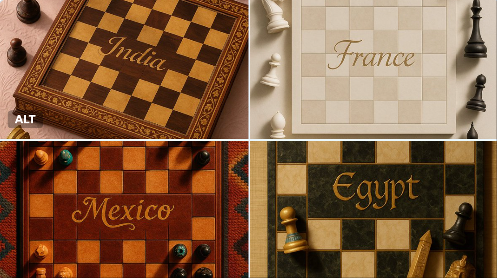

</div>

**提示词：**
```
A highly realistic vertical photograph of a traditional chessboard viewed from above, set against a textured surface inspired by [COUNTRY]’s artistic heritage. The chessboard features intricate patterns and national motifs, with the word “[COUNTRY]” written across the board in elegant golden calligraphy. All the chess pieces are off the board, arranged around it on the fabric — some lying on their side, others upright — as if waiting to be placed. Each piece is uniquely reimagined in shape, ornament, and texture, reflecting the architecture, cultural symbols, and color palette of [COUNTRY]. Rich materials, soft directional light, cinematic shadows, ultra-detailed editorial still life style, symmetrical top-down framing, 9:16 format.
```

**中文提示词：**
```
一张高度逼真的传统棋盘垂直照片，从上方看，背景是受 [COUNTRY] 艺术遗产启发的纹理表面。棋盘上有复杂的图案和国家图案，棋盘上用优雅的金色书法写着“[COUNTRY]”字样。所有的棋子都离开了棋盘，围绕着棋盘排列在织物上——有些侧躺着，有些直立着——仿佛等待着被放置。每件作品在形状、装饰和质地上都经过独特的重新构想，反映了 [COUNTRY] 的建筑、文化符号和调色板。丰富的素材、柔和的定向光、电影般的阴影、超详细的编辑静物风格、对称的自上而下的取景、9：16 格式。
```


<a id="prompt-144"></a>
## 案例 144：梦幻般的蒸汽波失真 (来源 [@LudovicCreator](https://x.com/LudovicCreator/status/1937027922679775432))

<div style="display: flex; justify-content: space-between;">


</div>

**提示词：**
```
[SUBJECT] rendered in Dreamlike Vaporwave Distortion, with soft pastels and surreal effects. Employ a nostalgic color palette of [COLOR1] and [COLOR2] to evoke a sense of longing and ethereal beauty
```

**中文提示词：**
```
[主题] 以梦幻般的蒸汽波失真渲染，带有柔和的粉彩和超现实效果。采用 [COLOR1] 和 [COLOR2] 的怀旧调色板，唤起渴望和空灵之美
```


<a id="prompt-143"></a>
## 案例 143：迪士尼鸡尾酒 (来源 [@TheRelianceAI](https://x.com/TheRelianceAI/status/1936726936409313294))

<div style="display: flex; justify-content: space-between;">
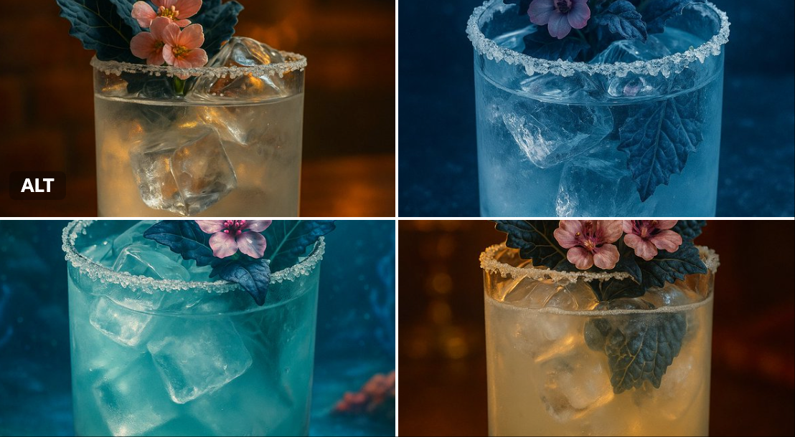
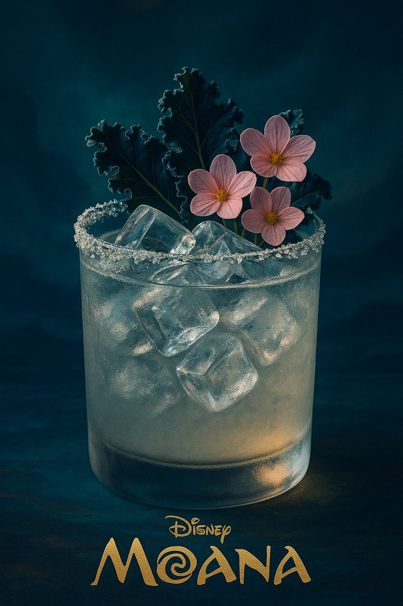
</div>

**提示词：**
```
A realistic, high-end cocktail in a frosted glass with a sparkling salt rim, filled with crystal-clear ice cubes. The drink is garnished with deep-blue kale leaves and delicate pastel-pink edible flowers. The lighting is moody and cinematic, with soft highlights on the glass. The entire visual style — color palette, lighting, background, and atmosphere — is inspired by the animated film 【MOVIE_TITLE】 by Disney, subtly reflecting its visual tone and mood. At the bottom of the image, in elegant golden serif text, it says: “Disney — 【MOVIE_TITLE】”. Vertical 9:16, ultra-detailed, photographic realism with artistic direction based on the film’s world.
```

**中文提示词：**
```
一款逼真的高端鸡尾酒，装在磨砂玻璃杯中，带有波光粼粼的盐边，里面装满了晶莹剔透的冰块。这款饮料以深蓝色的羽衣甘蓝叶和精致的淡粉色食用花朵装饰。灯光是喜怒无常的和电影般的，玻璃上有柔和的亮点。整个视觉风格——调色板、灯光、背景和氛围——都受到了迪士尼动画电影【MOVIE_TITLE】的启发，巧妙地反映了它的视觉基调和情绪。在图片的底部，用优雅的金色衬线文字写着：“Disney — 【MOVIE_TITLE】”。垂直 9：16，超详细，摄影现实主义，艺术指导基于电影世界。
```


<a id="prompt-142"></a>
## 案例 142：为任何品牌设计运动鞋 (来源 [@hc_dsn](https://x.com/hc_dsn/status/1925139884920152110))

<div style="display: flex; justify-content: space-between;">


</div>

**提示词：**
```
create image with 1:1 ratio   A branded footwear ad for [Brand], showcasing the high-end Brand shoe using brand technology and texture.(fiction a technology and texture based on brand DNA). The shoe is shown in dynamic floating perspective over a graph paper background layout with technical sketches and handwritten notes. A random lifestyle authentic photo featuring brand clothing in motion is taped in the corner, styled with street wear fashion. Emphasize the product's slogan with  bold typography. Layout features include product spec labels like Project a fiction brand title, Date, Size, and fiction model name in engineering style. The background reference with brand pantone color palettes with code number
```

**中文提示词：**
```
以 1：1 的比例创建图片 [Brand] 的品牌鞋靴广告，使用品牌技术和纹理展示高端品牌鞋靴。（虚构一种基于品牌DNA的技术和质感）。这双鞋以动态浮动透视形式显示在方格纸背景布局上，并附有技术草图和手写注释。角落里贴着一张随机的生活方式真实照片，照片中展示了运动中的品牌服装，与街头服饰时尚相得益彰。用粗体排版强调产品的口号。布局功能包括产品规格标签，如工程样式的 Project a fiction brand title、Date、Size 和 fiction model name。带有品牌 pantone 调色板和代码编号的背景参考
```


<a id="prompt-141"></a>
## 案例 141：监控级别的时尚洞察力 (来源 [@hc_dsn](https://x.com/hc_dsn/status/1925431043122970869))

<div style="display: flex; justify-content: space-between;">
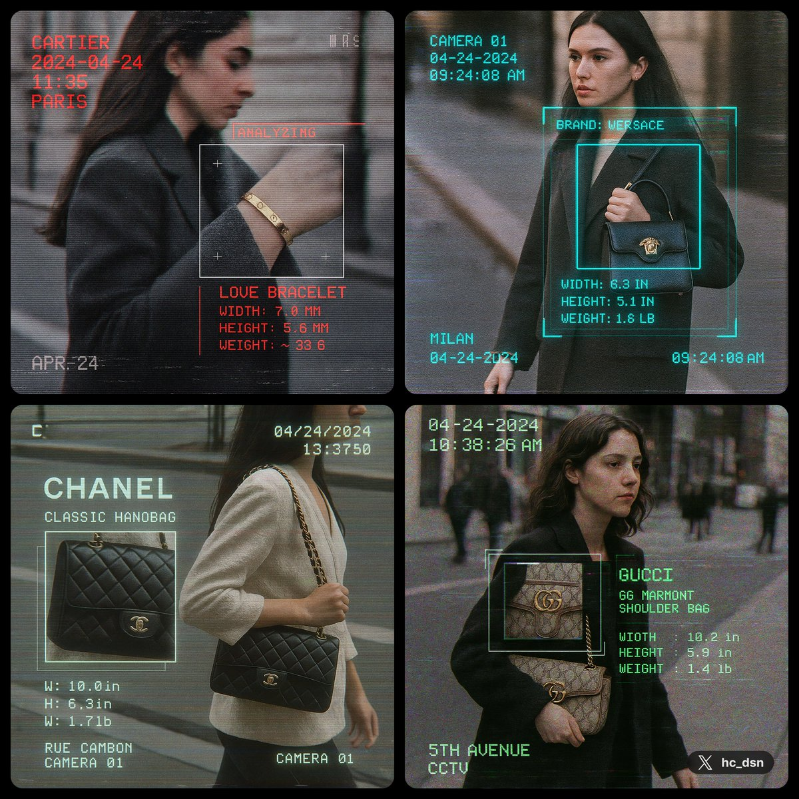

</div>

**提示词：**
```
Create image with 1:1 ratio A cctv footage, 
A closed up view of focus woman carrying  [brand] [product] on street, a square zoomed window on the product, sci fi analyzing overlay UI with infos like brand name, date, time, location name, in brand color monospaced font, product name, width, height, weight, etc, vhs effect, glitch effect, film grainy
```

**中文提示词：**
```
创建比例为 1：1 的图像闭路电视素材，
焦点女性在街上抬着 [品牌] [产品] 的特写视图，产品上的方形缩放窗口，科幻分析叠加 UI，其中包含品牌名称、日期、时间、位置名称、品牌颜色等宽字体、产品名称、宽度、高度、粗细等信息、vhs 效果、毛刺效果、胶片颗粒感
```

<a id="prompt-140"></a>
## 案例 140：现代数字动漫风格 (来源 [@Artedeingenio](https://x.com/Artedeingenio/status/1934970943769559430))

<div style="display: flex; justify-content: space-between;">
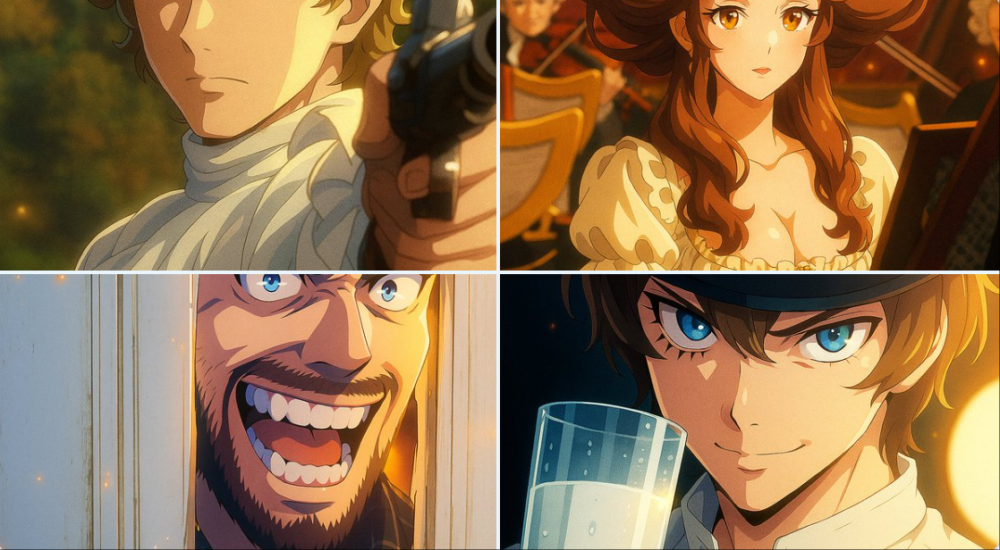
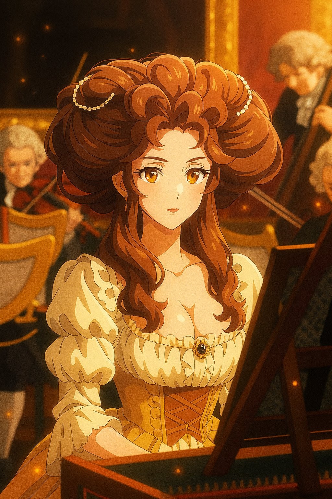
</div>

**提示词：**
```
Transform this image into a modern digital anime TV style. Use clean and sharp outlines, vivid and high-contrast colors, and digital cel shading with subtle gradients. Add visual effects like glows, particles, or light flares if appropriate. The character design should follow modern anime proportions, with detailed hair and expressive eyes. The background can be softly blurred or cinematic. The image should look like a frame from a high-quality anime series currently airing.
```

**中文提示词：**
```
将此图像转换为现代数字动漫电视风格。使用干净锐利的轮廓、鲜艳和高对比度的颜色，以及具有微妙渐变的数字卡通底纹。添加视觉效果，如发光、粒子或光晕（如果合适）。角色设计应遵循现代动漫的比例，拥有细致的头发和富有表现力的眼睛。背景可以是柔和的模糊或电影般的。该图像应看起来像当前正在播出的高质量动漫系列中的帧。
```

<a id="prompt-139"></a>
## 案例 139：将您最喜欢的品牌变成生活方式产品 (来源 [@azed_ai](https://x.com/azed_ai/status/1934631664153760241))

<div style="display: flex; justify-content: space-between;">
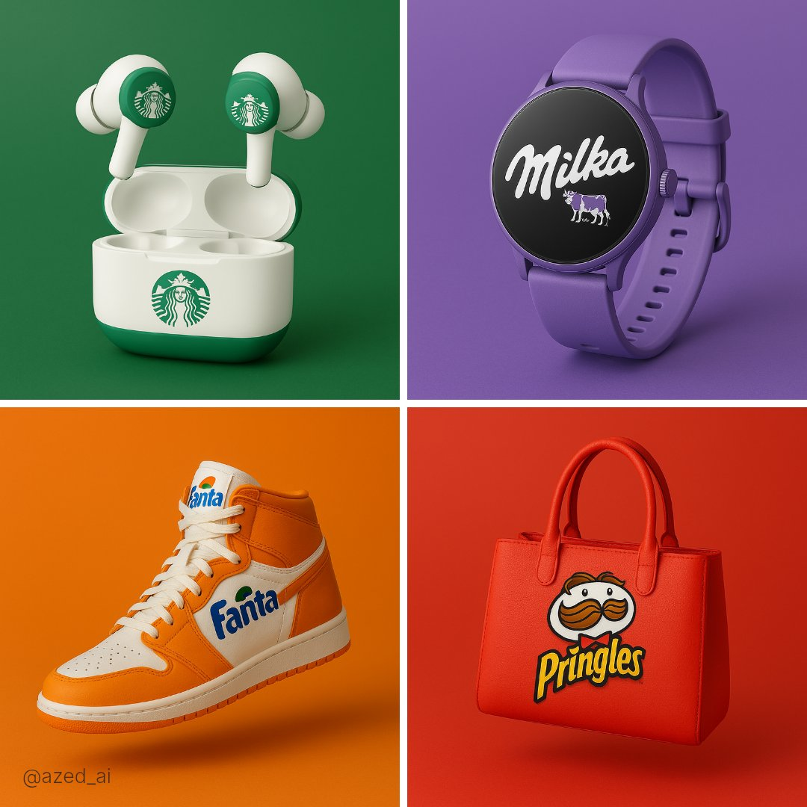

</div>

**提示词：**
```
A high-quality studio product photo of a [brand name]-branded [product type], [floating / standing] against a solid background in the brand’s signature color. The product features the brand logo prominently and uses the official brand color palette. Clean composition, soft shadows, ultra-realistic materials and textures, no text, no props, professional commercial lighting, sharp focus, minimalist aesthetic.
```

**中文提示词：**
```
一张高质量的工作室商品照片，其中包含 [品牌名称] 品牌 [商品类型]、[浮动/直立] 和纯色背景，采用品牌标志性的颜色。该商品突出品牌徽标，并使用官方品牌调色板。干净的构图，柔和的阴影，超逼真的材质和纹理，无文字，无道具，专业的商业照明，锐利的焦点，极简的美学。
```

<a id="prompt-138"></a>
## 案例 138：Gumroad样式图标 (来源 [@gnrlyxyz](https://x.com/gnrlyxyz/status/1934745654888124753))

<div style="display: flex; justify-content: space-between;">

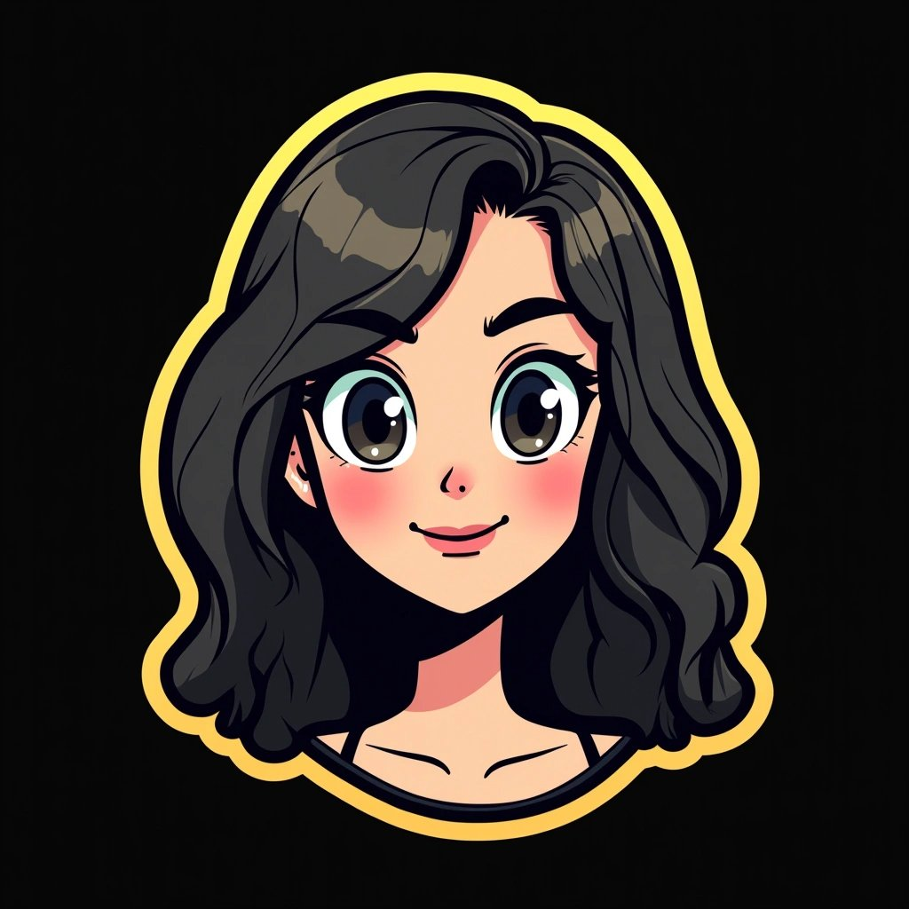
</div>

**提示词：**
```
Create a high-resolution illustration of a [OBJECT] icon in the style of a flat, outlined sticker graphic. The icon should be made entirely from very thin, solid black outlines with no interior fill. Add a bold, soft-edged sticker-style contour around the icon using a flat, vibrant [YELLOW, BLUE, OR PINK] color. The result should look like a cartoon-style icon cut from black paper, outlined by a bright color. Do not use any white or filled shapes inside. No gradients, no shadows, no textures. Vector-friendly. Black background. Square aspect ratio.
```

**中文提示词：**
```
以平面轮廓贴纸图形的样式创建 [OBJECT] 图标的高分辨率插图。图标应完全由非常细的纯黑色轮廓制成，没有内部填充。使用平坦、充满活力的 [黄色、蓝色或粉红色] 在图标周围添加大胆、边缘柔和的贴纸式轮廓。结果应看起来像从黑纸上剪下来的卡通风格图标，由鲜艳的颜色勾勒出来。不要在里面使用任何白色或填充的形状。没有渐变，没有阴影，没有纹理。对矢量友好。黑色背景。方形纵横比。
```

<a id="prompt-137"></a>
## 案例 137：透视一切 (来源 [@aziz4ai](https://x.com/aziz4ai/status/1934528170264572227))

<div style="display: flex; justify-content: space-between;">

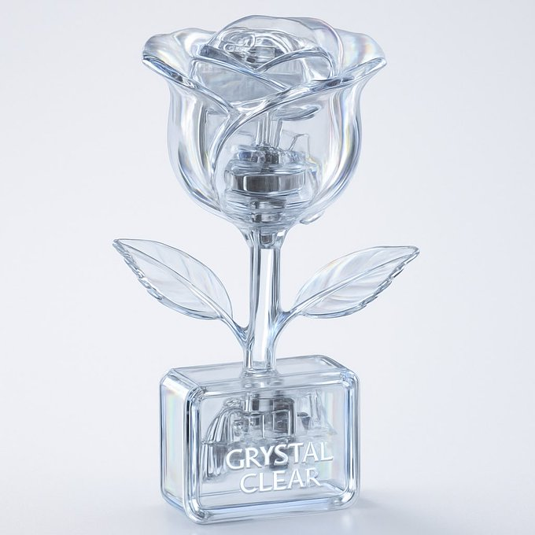
</div>

**提示词：**
```
a fully transparent [product] made of ultra-clear iridescent glass, showing all internal components in photorealistic detail. The outer shell is glossy, refracts subtle rainbow colors, and reveals the product’s structure and mechanics. Scene lit with high-Kelvin studio lighting (~7000K) on a neutral background. The product maintains its real proportions, materials, and branding.
```

**中文提示词：**
```
由超透明虹彩玻璃制成的完全透明 [产品]，以逼真的细节展示所有内部组件。外壳有光泽，折射出微妙的彩虹色，并揭示产品的结构和机械。在中性背景上使用高开尔文工作室照明 （~7000K） 照亮的场景。该产品保持其真实的比例、材料和品牌。
```

<a id="prompt-136"></a>
## 案例 136：日常用品有皮肤 (来源 [@Kerroudjm](https://x.com/Kerroudjm/status/1934682610632151500))

<div style="display: flex; justify-content: space-between;">

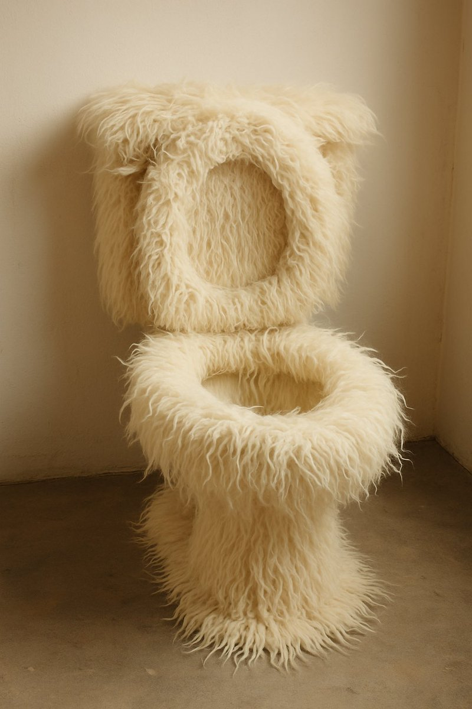
</div>

**提示词：**
```
A high-quality studio photograph of a [OBJECT] fully covered in ultra-realistic [ANIMAL] texture (e.g., fur, feathers, skin, or scales), placed against a soft neutral background. The object’s original form remains visible but is wrapped in the animal’s natural pattern and surface detail. The image features clean composition, soft shadows, sharp focus, minimalist styling, professional lighting, and highly detailed textures—each hair, feather, or wrinkle should be visible. Format 1:1.
```

**中文提示词：**
```
一张 [OBJECT] 的高质量工作室照片，完全覆盖在超逼真的 [ANIMAL] 纹理（例如，毛皮、羽毛、皮肤或鳞片）中，置于柔和的中性背景上。对象的原始形状仍然可见，但包裹在动物的自然图案和表面细节中。该图像具有干净的构图、柔和的阴影、清晰的焦点、极简主义的造型、专业的照明和高度详细的纹理——每根头发、羽毛或皱纹都应该可见。格式 1：1。
```

<a id="prompt-135"></a>
## 案例 135：棱柱形玻璃图标 (来源 [@gnrlyxyz](https://x.com/gnrlyxyz/status/1934330176113938606))

<div style="display: flex; justify-content: space-between;">
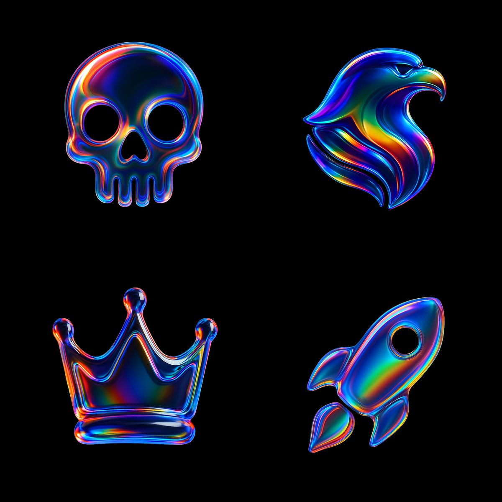

</div>

**提示词：**
```
Create a high-resolution illustration of a [skull] icon in the style of a glossy, translucent sculpture. The icon should appear as if made of curved, flowing glass with reflective surfaces. Infuse the form with vivid, refracted rainbow gradients that shift smoothly across its contours. The shape should be abstract yet recognizable, with a sleek, high-gloss finish and soft reflections that mimic light bending through clear material. Center the icon on a solid black background. No shadows, textures, or extra elements. Square aspect ratio.
```

**中文提示词：**
```
以光泽、半透明雕塑的风格创建 [骷髅头] 图标的高分辨率插图。图标应看起来像是由具有反射表面的弯曲、流动的玻璃制成的。为形式注入生动的折射彩虹渐变，在其轮廓上平滑移动。形状应该是抽象的但可识别的，具有时尚、高光泽的饰面和柔和的反射，模仿光线穿过透明材料的弯曲。将图标置于纯黑色背景上居中。没有阴影、纹理或额外元素。方形纵横比。
```

<a id="prompt-134"></a>
## 案例 134：生成真实电影海报 (来源 [@aziz4ai](https://x.com/aziz4ai/status/1934339212561555949))

<div style="display: flex; justify-content: space-between;">


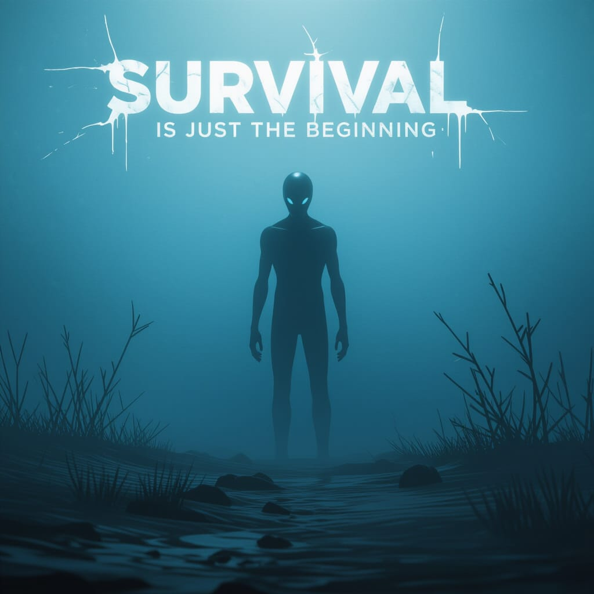

</div>

**提示词：**
```
“[MOVIE TITLE ]” — cinematic movie poster design in ultra-realistic, high-definition style. Capture a dramatic and emotionally charged scene based on the film’s title. Use a high Kelvin color temperature to eliminate yellow tint, favoring cold, bluish tones or neutral whites. Add volumetric fog, sharp shadows, and deep depth of field. Simulate a cinematic lens with soft bloom, subtle lens flare, and film grain.

Render the title “[MOVIE TITLE ]” in expressive kinetic typography that visually embodies the meaning of the word (e.g. dissolving, cracked, melting, glowing). Typography should feel integrated into the environment, bold and iconic.

Include a short, emotionally resonant tagline beneath the title. Overall composition must resemble a high-budget blockbuster movie poster, with a 2.35:1 aspect ratio and strong visual storytelling.
```

**中文提示词：**
```
“[MOVIE NAME ]” — 超逼真、高清风格的电影海报设计。根据电影的标题捕捉一个充满戏剧性和情感的场景。使用高开尔文色温来消除黄色调，偏爱冷色调、蓝色调或中性白色。添加体积雾、锐利阴影和深景深。模拟具有柔和泛光、细微镜头光晕和胶片颗粒的电影镜头。

以富有表现力的动态排版呈现标题“[MOVIE TITLE ]”，在视觉上体现单词的含义（例如，溶解、破裂、融化、发光）。排版应该感觉与环境融为一体，大胆而标志性。

在标题下方包括一个简短的、能引起情感共鸣的标语。整体构图必须类似于高预算的大片电影海报，具有 2.35：1 的纵横比和强烈的视觉叙事性。
```

<a id="prompt-133"></a>
## 案例 133：幽灵形态 (来源 [@TheRelianceAI](https://x.com/TheRelianceAI/status/1934662213702140116))

<div style="display: flex; justify-content: space-between;">
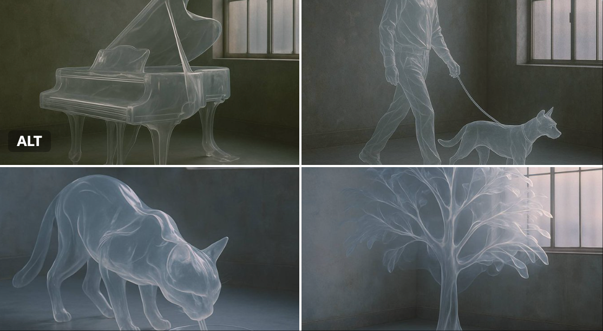

</div>

**提示词：**
```
A hyper-realistic photograph of a [SUBJECT] entirely made from a single, semi-rigid transparent material that drapes and folds like sheer plastic or molten glass. The object is fully recognizable in shape, yet ghostly and fluid, as if sculpted from air and frozen in motion. Set in a moody, industrial interior with aged concrete walls and diffused daylight from metal-barred windows. The lighting gently highlights the reflections, edges, and flowing curves of the transparent form. Dreamlike, minimalist, surreal design aesthetic.
```

**中文提示词：**
```
一张 [SUBJECT] 的超写实照片，完全由单一的、半刚性的透明材料制成，像纯粹的塑料或熔融玻璃一样悬垂和折叠。这个物体的形状是完全可识别的，但又幽灵般流动，仿佛从空气中雕刻出来，在运动中冻结。坐落在喜怒无常的工业室内，拥有老化的混凝土墙和从金属栅栏窗户射出的日光。灯光柔和地突出了透明形式的反射、边缘和流动曲线。梦幻般的、极简主义的、超现实主义的设计美学。
```

<a id="prompt-132"></a>
## 案例 132：悬浮魔幻现实主义 (来源 [@BeanieBlossom](https://x.com/BeanieBlossom/status/1934581820433301996))

<div style="display: flex; justify-content: space-between;">
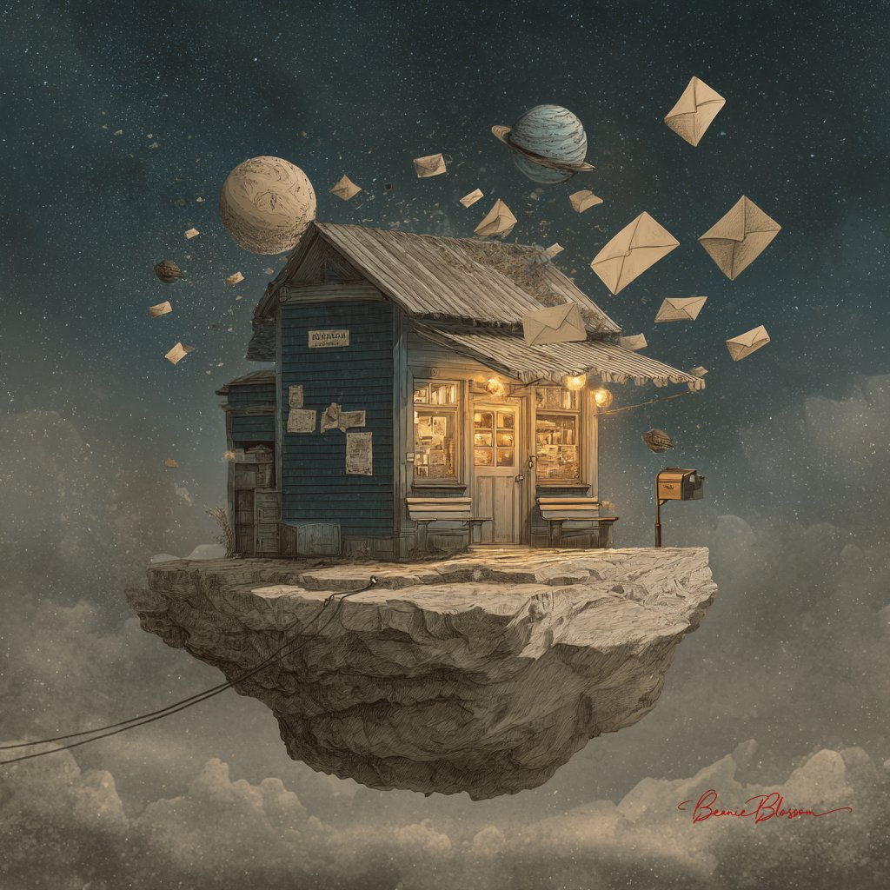
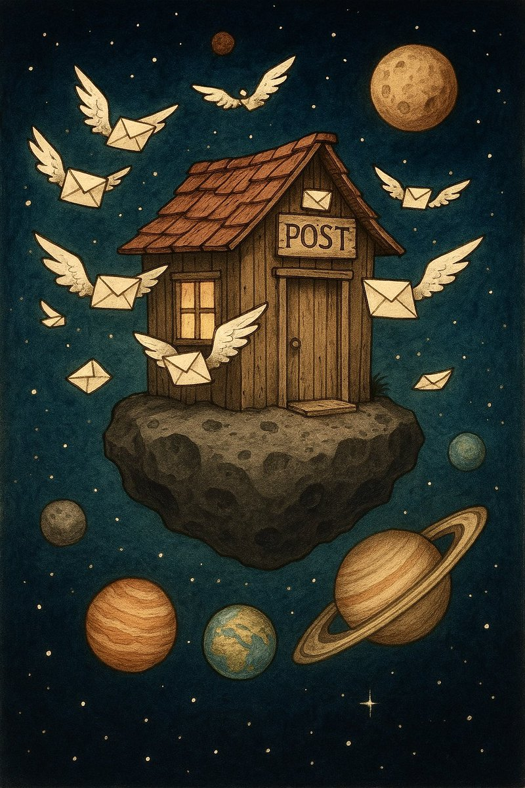
</div>

**提示词：**
```
An old-fashioned postal shack floating on a space rock, with envelopes fluttering like wings and planets lined up as waiting customers - humorous, magical realism.
```

**中文提示词：**
```
一个漂浮在太空岩石上的老式邮政小屋，信封像翅膀一样飘动，行星排成一排等待的顾客 - 幽默、魔幻现实主义。
```

<a id="prompt-131"></a>
## 案例 131：自定义毛绒钥匙扣 (来源 [@azed_ai](https://x.com/azed_ai/status/1934973851164897444))

<div style="display: flex; justify-content: space-between;">


</div>

**提示词：**
```
Close-up photo of a small plush keychain of [attached image/emojis]  held gently between two fingers, made of soft felt or fuzzy material, cartoon-style proportions, embroidered face with simple expressive features, character designed to resemble, attached to a shiny silver keyring, neutral beige background, shallow depth of field, soft natural lighting, highly detailed texture, cute and handcrafted aesthetic, studio photography, 1:1 aspect ratio
```

**中文提示词：**
```
[附图/表情符号] 的小毛绒钥匙扣的特写照片，用两根手指轻轻握住，由柔软的毛毡或毛茸茸的材料制成，卡通风格的比例，具有简单表现特征的刺绣脸，设计相似的人物，附在闪亮的银色钥匙圈上，中性米色背景，浅景深，柔和的自然光，高度详细的纹理，可爱和手工制作的美感， 摄影棚摄影，1：1 纵横比
```

<a id="prompt-130"></a>
## 案例 130：创建超现实不可能的图像 (来源 [@umesh_ai](https://x.com/umesh_ai/status/1934903456596451734))

<div style="display: flex; justify-content: space-between;">

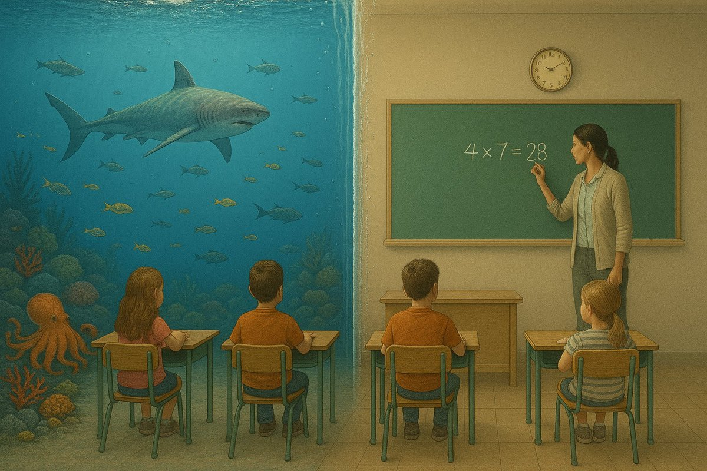
</div>

**提示词：**
```
Create a surreal split-scene where the left half is an underwater version of a [SCENE], filled with marine life (fish, sharks, octopus, coral, bubbles), and the right half is the regular dry version of the same [SCENE] continuing naturally. Separate the two halves with a vertical wall of water held by a magical force, as if the ocean is cut in half. The scene should align across both sides, maintaining realism while showcasing the impossible scenario. Emphasize lighting and reflection differences between water and air environments.
```

**中文提示词：**
```
创建一个超现实的分割场景，其中左半部分是 [SCENE] 的水下版本，充满了海洋生物（鱼、鲨鱼、章鱼、珊瑚、气泡），右半部分是同一 [SCENE] 的常规干燥版本自然延续。用一道由神奇力量支撑的垂直水墙将两半分开，仿佛海洋被切成两半。场景应在两侧对齐，在展示不可能的场景的同时保持真实感。强调水和空气环境之间的光照和反射差异。
```

<a id="prompt-129"></a>
## 案例 129：创建悬浮切片水果 (来源 [@umesh_ai](https://x.com/umesh_ai/status/1934562439326306814))

<div style="display: flex; justify-content: space-between;">

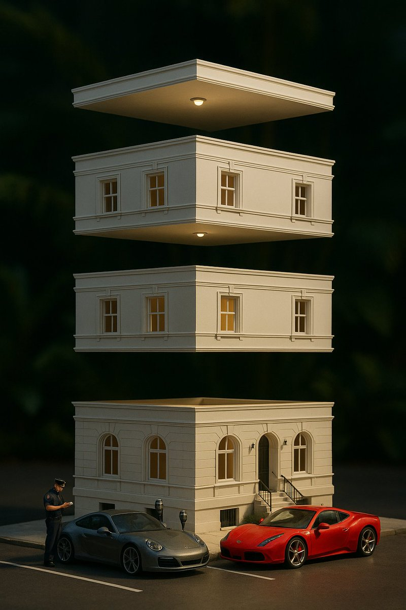
</div>

**提示词：**
```
A hyper-realistic photograph of a [FRUIT] sliced into five glossy layers, each slice floating vertically in mid-air with glistening juice droplets at the edges. The slices cast soft, natural shadows on each other. The [FRUIT] has a vibrant skin with appropriate interior details .Set against a softly blurred tropical garden background with hints of lush green leaves and dappled sunlight, the scene is lit with warm, directional golden-hour lighting, enhancing the vivid colors and depth
```

**中文提示词：**
```
一张 [FRUIT] 的超写实照片，被切成五个光滑的层，每个切片垂直漂浮在半空中，边缘有闪闪发光的汁液滴。切片彼此之间投射柔和、自然的阴影。[FRUIT] 拥有充满活力的皮肤和适当的内部细节。在柔和模糊的热带花园背景下，郁郁葱葱的绿叶和斑驳的阳光，场景由温暖、定向的金色小时照明照亮，增强了鲜艳的色彩和深度
```

<a id="prompt-128"></a>
## 案例 128：一个字的无限反射 (来源 [@egeberkina](https://x.com/egeberkina/status/1934670309942018397))

<div style="display: flex; justify-content: space-between;">


</div>

**提示词：**
```
A [PERSON] in a dark room with a glowing projection of the word “[WORD]” repeated endlessly across the walls and body. The text is projected in high-contrast, neon [COLOR], wrapping around the contours of the object, creating a surreal, futuristic lighting effect. The background and object are seamlessly blended into the immersive text environment. Photorealistic, sharp shadows and light distortion where the text bends over curves. Studio lighting with deep contrast, moody cyberpunk aesthetic.
```

**中文提示词：**
```
一个 [PERSON] 在一个黑暗的房间里，“[WORD]”这个词的发光投影在墙壁和身体上无休止地重复。文本以高对比度的霓虹灯 [COLOR] 投影，包裹在对象的轮廓周围，营造出超现实的未来主义照明效果。背景和对象无缝混合到沉浸式文本环境中。照片级真实感、锐利的阴影和文本在曲线上弯曲的光线扭曲。具有深对比度、喜怒无常的赛博朋克美学的工作室照明。
```

<a id="prompt-127"></a>
## 案例 127：符号冲突 (来源 [@B_4AI](https://x.com/B_4AI/status/1934527984578535561))

<div style="display: flex; justify-content: space-between;">


</div>

**提示词：**
```
A surreal yet hyper-realistic image in levitation photography style, where elements of [subject] float chaotically and randomly above an outstretched hand, interwoven with symbolic elements that directly oppose it.

The background forms dynamically to visually embody the symbolism of the subject and its opposite, through blurred or abstract details that reflect either tension or harmony between the two—like a mirror inside a dream.

Each element floats at a unique angle and varying distance.

Background: Shifts according to the subject and its opposite

Lighting: Soft cinematic with dreamy shadows

Style: Hyper-realistic + Levitation Photography + Fantasy

Aspect Ratio: 1:1
```

**中文提示词：**
```
悬浮摄影风格的超现实而超现实的图像，其中 [主体] 的元素混乱而随机地漂浮在伸出的手上方，与直接对立的象征性元素交织在一起。

背景动态形成，通过模糊或抽象的细节在视觉上体现主题及其对立面的象征意义，这些细节反映了两者之间的张力或和谐——就像梦中的镜子。

每个元素都以独特的角度和不同的距离漂浮。

背景：根据主体及其对立面而变化

照明：柔和的电影感，带有梦幻般的阴影

风格：超写实 + 悬浮摄影 + 奇幻

长宽比：1：1
```

<a id="prompt-126"></a>
## 案例 126：重新构想的超现实主义广告 (来源 [@aziz4ai](https://x.com/aziz4ai/status/1934702903932957023))

<div style="display: flex; justify-content: space-between;">
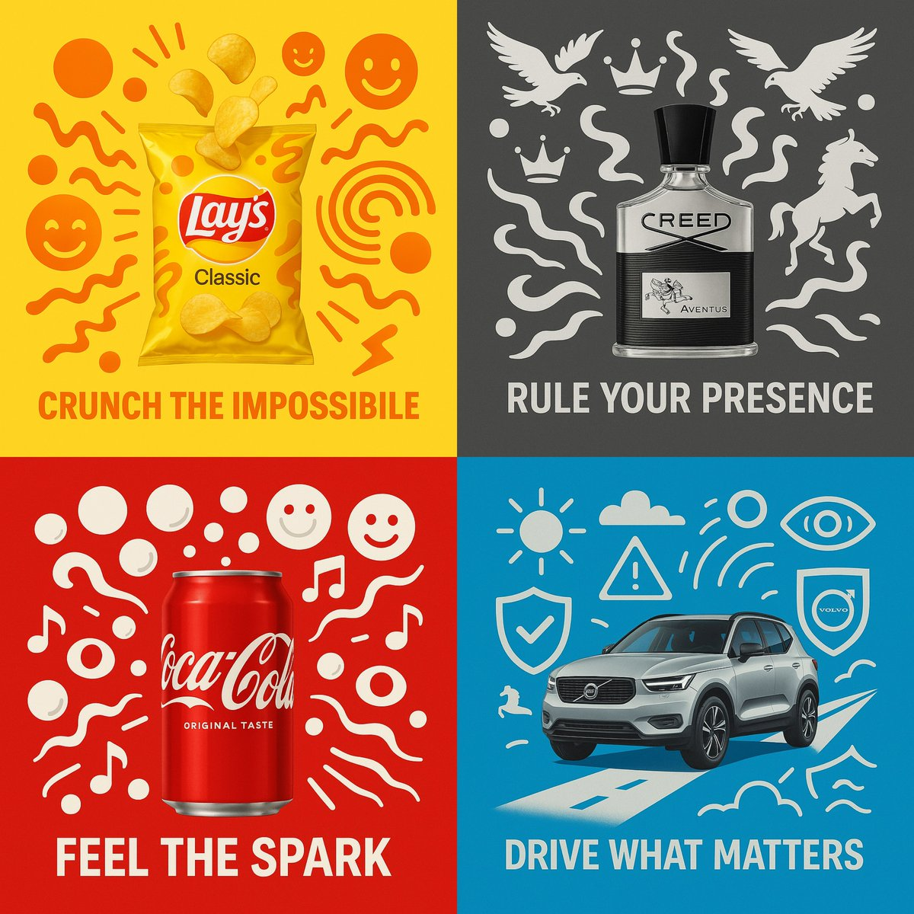

</div>

**提示词：**
```
“[Product Name]” placed at the center in full photorealism, surrounded by surreal vector illustrations using exactly two bold, vibrant colors that match the product’s mood.
The scene is minimalistic yet energetic, with abstract vector shapes (symbols, lines, expressions, etc.) orbiting or interacting with the product.
Add the real logo clearly and integrate a short 3–4 word slogan at the bottom.
Style: surreal, high-resolution, minimal, cinematic lighting, 1:1 aspect ratio.
```

**中文提示词：**
```
“[产品名称]”以完全逼真的方式放置在中心，周围环绕着超现实主义的矢量插图，使用两种大胆、鲜艳的颜色，与产品的情绪相匹配。
场景简约而充满活力，抽象的矢量形状（符号、线条、表情等）围绕产品运行或与产品交互。
清楚地添加真实的 logo，并在底部加入一个 3-4 字的简短标语。
风格：超现实、高分辨率、极简、电影般的照明、1：1 纵横比。
```

<a id="prompt-125"></a>
## 案例 125：时尚品牌娃娃 (来源 [@TheRelianceAI](https://x.com/TheRelianceAI/status/1934688112741085562))

<div style="display: flex; justify-content: space-between;">


</div>

**提示词：**
```
A hyper-realistic photograph of a fashion doll styled in the aesthetic of [BRAND], sitting on a plush, cream-colored bed with soft folds. The doll’s look reflects the brand’s signature elements — from hair and outfit to accessories — arranged thoughtfully to evoke a dreamy, vintage-inspired editorial. Studio-lit with warm, diffused lighting and a creamy, ivory-toned palette, the scene emulates luxury fashion photography with a soft, dollhouse-like atmosphere and shallow depth of field.
```

**中文提示词：**
```
一张超写实的照片，一个时尚娃娃以 [BRAND] 的美学风格，坐在一张带有柔软褶皱的奶油色毛绒床上。这款玩偶的外观反映了该品牌的标志性元素——从头发和服装到配饰——经过精心安排，让人联想到梦幻般的复古风格社论。工作室照明采用温暖的漫射灯光和奶油色的象牙色调调色板，该场景以柔和的玩具屋般的氛围和浅景深模拟奢华时尚摄影。
```

<a id="prompt-124"></a>
## 案例 124：磨砂模糊剪影 (来源 [@umesh_ai](https://x.com/umesh_ai/status/1934249977326289141))

<div style="display: flex; justify-content: space-between;">


</div>

**提示词：**
```
A black and white photograph shows the blurred silhouette of a [SUBJECT] behind a frosted or translucent surface. The [PART] is sharply defined and pressed against the surface, creating a stark contrast with the rest of the hazy, indistinct figure. The background is a soft gradient of gray tones, enhancing the mysterious and artistic atmosphere
```

**中文提示词：**
```
一张黑白照片显示了磨砂或半透明表面后面 [SUBJECT] 的模糊剪影。[PART] 轮廓分明，压在表面，与朦胧、模糊的人物的其余部分形成鲜明对比。背景是灰色调的柔和渐变，增强了神秘和艺术的氛围
```

<a id="prompt-123"></a>
## 案例 123：植物雕塑 (来源 [@azed_ai](https://x.com/azed_ai/status/1934566157736083614))

<div style="display: flex; justify-content: space-between;">

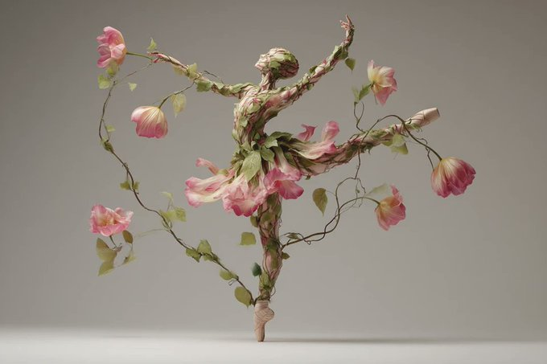
</div>

**提示词：**
```
The [subject] appears as if organically grown from intertwining plants, flowers, and vines. Leaf-like textures and blooming forms fuse seamlessly with anatomical or structural details, creating a surreal hybrid of nature and design. The composition feels ethereal, with natural asymmetry and dreamlike flow.
```

**中文提示词：**
```
[主题] 看起来就像是从交织在一起的植物、花朵和藤蔓中有机生长出来的。叶子般的纹理和盛开的形式与解剖学或结构细节无缝融合，创造出自然与设计的超现实混合体。构图感觉空灵，具有自然的不对称和梦幻般的流动。
```

<a id="prompt-122"></a>
## 案例 122：史莱姆制成的玩具运输车 (来源 [@miilesus](https://x.com/miilesus/status/1934593675276796090))

<div style="display: flex; justify-content: space-between;">
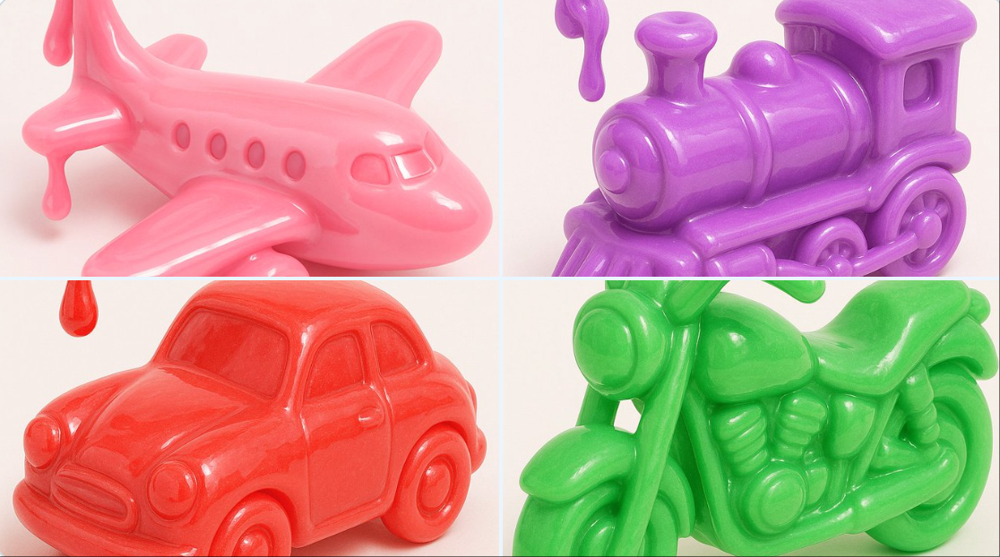
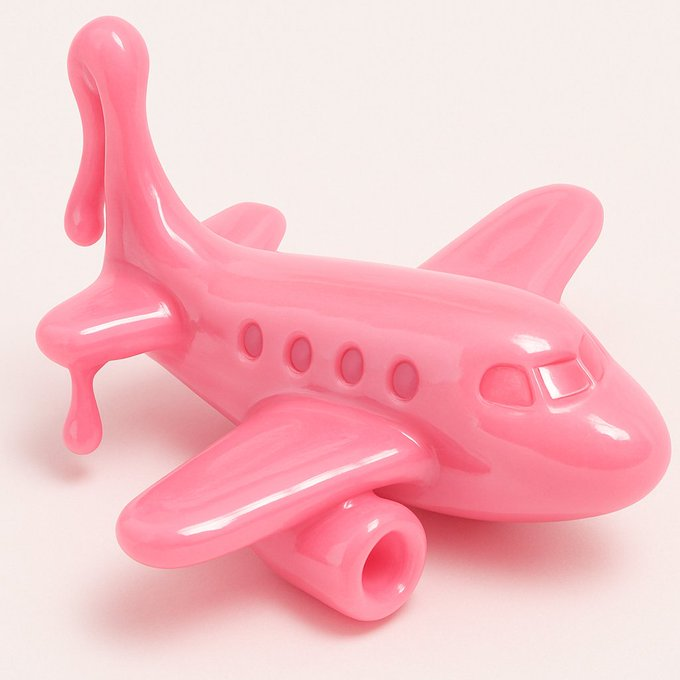
</div>

**提示词：**
```
{
  "style": "Realistic 3D render",
  "material": "Glossy slime-like material",
  "texture": ["smooth", "soft", "stretchy", "shiny"],
  "color": "VARIABLE",  
  "object_type": "VARIABLE",  
  "background": "plain white",
  "lighting": "soft studio lighting",
  "details": {
    "focus": "single object centered",
    "shadows": "soft and subtle",
    "reflection": "light highlights on surface",
    "depth": "shallow depth of field"
  },
  "format": "close-up or three-quarter view",
  "mood": "playful, clean, toy-like",
  "prompt_template": "A {color} {object_type} made of glossy slime material, soft and stretchy texture, realistic 3D look, set against a plain white background, soft lighting and smooth highlights"
}
```

**中文提示词：**
```
{
“style”： “逼真的 3D 渲染”，
“material”： “有光泽的粘液状材质”，
“texture”： [“光滑”， “柔软”， “弹性”， “闪亮”]，
“color”： “变量”，
“object_type”： “变量”，
“background”： “纯白色”，
“lighting”： “柔和的工作室照明”，
“详细信息”： {
“focus”： “以单个对象为中心”，
“shadows”： “柔和而微妙”，
“reflection”： “表面上的光高光”，
“depth”： “浅景深”
},
“format”： “特写或四分之三视图”，
“mood”： “俏皮的、干净的、玩具般的”，
“prompt_template”： “由有光泽的粘液材料制成的 {color} {object_type}，质地柔软有弹性，逼真的 3D 外观，以纯白色背景为背景，光线柔和，高光平滑”
}
```

<a id="prompt-121"></a>
## 案例 121：文艺复兴时期的解剖学研究 (来源 [@azed_ai](https://x.com/azed_ai/status/1934928547971559565))

<div style="display: flex; justify-content: space-between;">
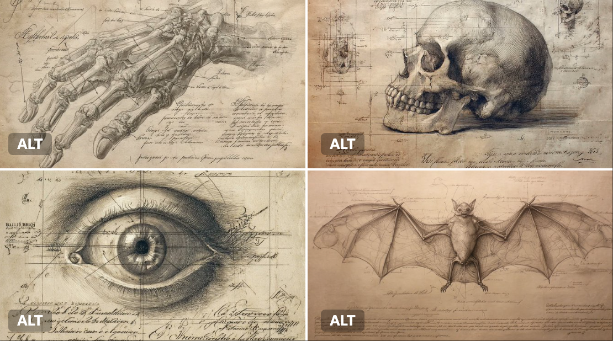
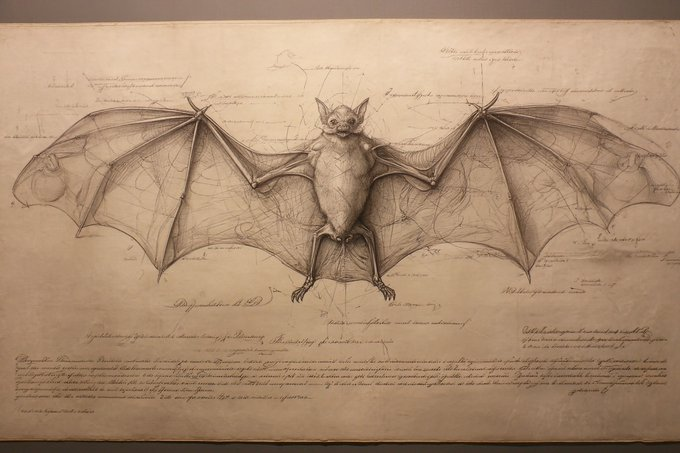
</div>

**提示词：**
```
A Renaissance anatomical study of a [subject], meticulously illustrated in fine graphite and ink cross-hatching, with transparent tissue overlays revealing skeletal and muscular systems. Labeled in elegant Latin calligraphy and presented on aged parchment, the composition exudes scholarly precision and classical beauty.
```
**中文提示词：**
```
文艺复兴时期对 [主题]的解剖学研究，用精细的石墨和墨水交叉影线精心说明，透明的组织覆盖层露出骨骼和肌肉系统。该作品以优雅的拉丁书法标记，并呈现在古老的羊皮纸上，散发着学术的精确和古典之美。
```


<a id="prompt-120"></a>
## 案例 120：奇趣风格3D乙烯基玩具 (来源 [@azed_ai](https://x.com/azed_ai/status/1931668551531929630))


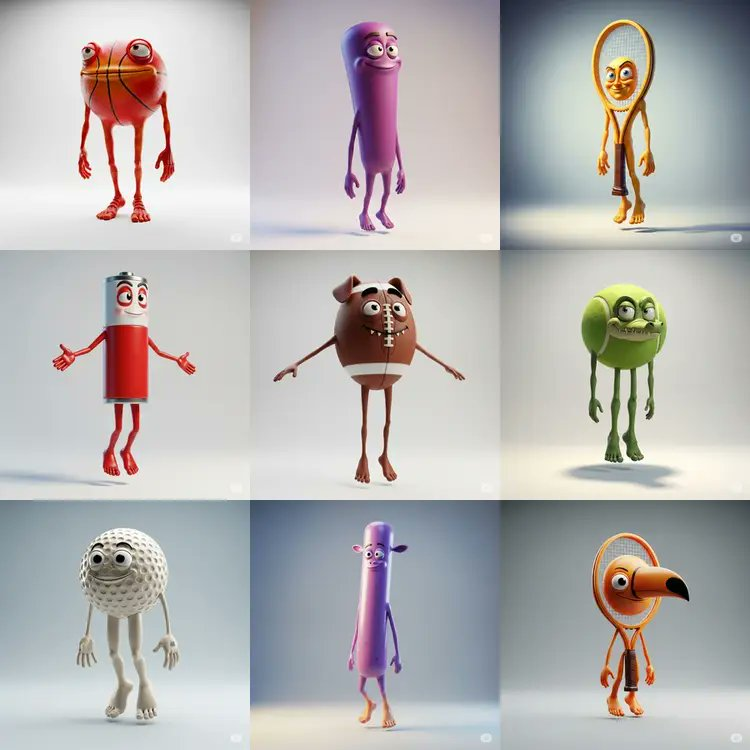

**提示词：**
```
Chibi-style 3D vinyl toy of [subject], rendered in [color1] and [color2] tones, front-facing on a white background. Minimalist composition with soft shadows, oversized head and tiny body proportions, clean OC renderer output in Cinema 4D. Toy-like shine and playful charm.
```

**中文提示词：**
```
[主体]的奇趣风格 3D 乙烯基玩具，以[颜色 1]和[颜色 2]色调呈现，正面朝向白色背景。极简主义构图，带有柔和的阴影，头部巨大而身体比例缩小，Cinema 4D 中的干净 OC 渲染输出。玩具般的光泽和充满趣味的魅力。
```

<a id="prompt-119"></a>
## 案例 119：城市绣花贴纸照片 (来源 [@Kerroudjm](https://x.com/Kerroudjm/status/1931040962513379672))

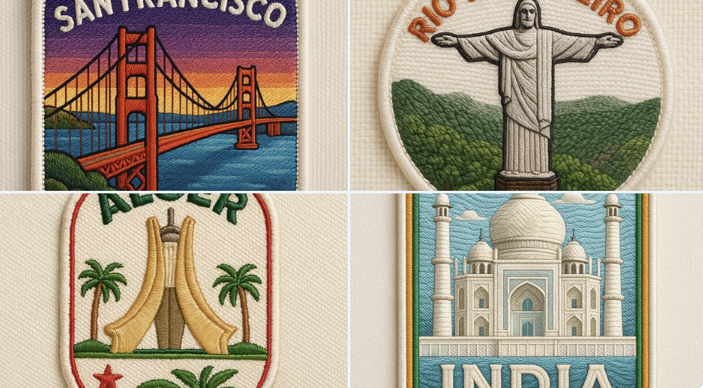
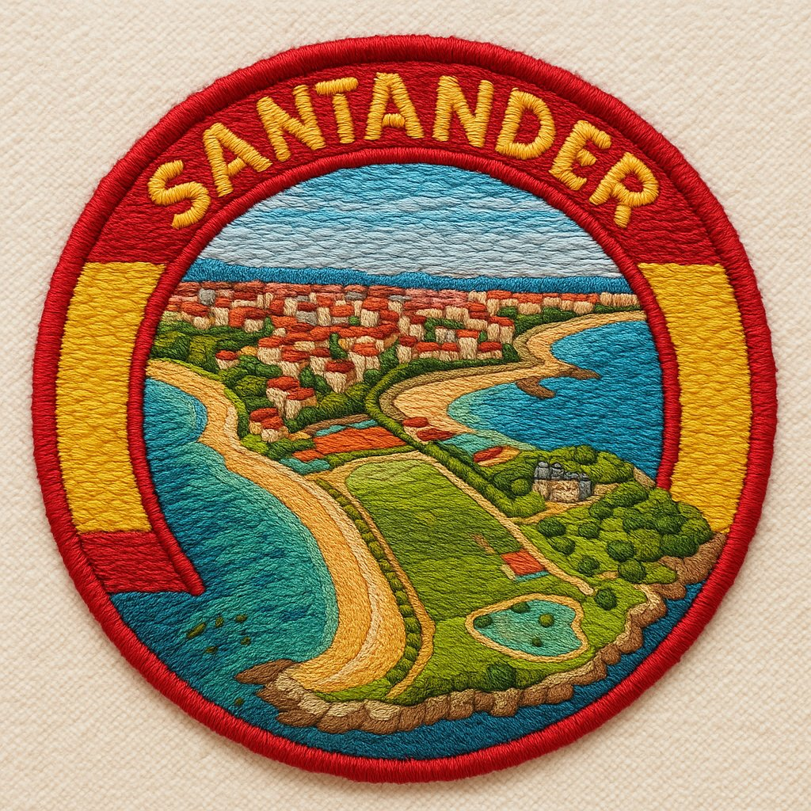

**提示词：**
```
Create a close-up, square-format (1:1) photo of an embroidered patch inspired by the uploaded image. The design should feature a clean, cartoon-style embroidered interpretation of the original subject with rich thread texture and vibrant colors. The shape of the patch can vary (round, oval, shielded, silhouette-based), but the output image must remain square.
Integrate the national colors of the country represented—such as in the text, the border, or small decorative accents—drawing inspiration from the flag to enhance local identity. Add embroidered capital-letter text like the name of the city or country, either curved or straight. Use a soft off-white fabric background and natural lighting to bring out texture and depth.
```

**中文提示词：**
```
创建一个近景、正方形格式（1:1）的绣花贴片照片，以上传的图片为灵感。设计应采用干净的卡通风格刺绣诠释原图主题，具有丰富的线紡纹理和鲜艳的颜色。贴片的形状可以变化（圆形、椭圆形、盾形、轮廓形），但输出图片必须保持正方形。
融入所代表国家的国色——如文本、边框或小装饰细节中，从国旗中汲取灵感，增强地方身份。添加刺绣的大写字母文字，如城市或国家的名字，可以是曲线或直线。使用柔和的米白色背景布料和自然光线，以突出纹理和深度。
```

<a id="prompt-118"></a>
## 案例 118：品牌产品数字广告 (来源 [@shushant_l](https://x.com/shushant_l/status/1931316125029339572))

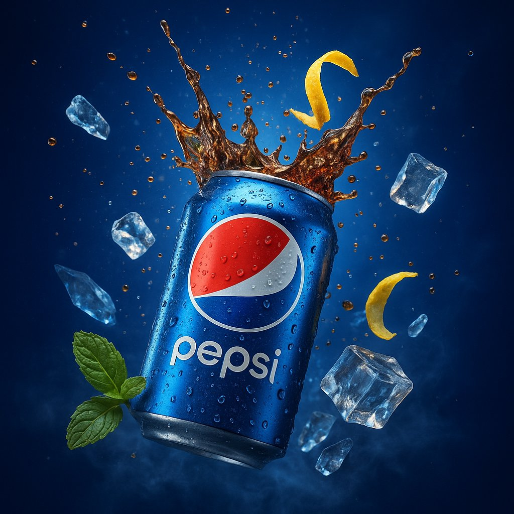

**提示词：**
```
 A hyper-realistic, ultra-detailed 3D digital advertisement showcasing a Pepsi can bursting open at its center, sending a refreshing splash of carbonated cola into the air, with effervescent bubbles and ice cubes flying outward. The can’s metallic surface is rendered with sharp, photorealistic textures, complete with condensation droplets, light reflections, and subtle scratches. Surrounding the scene are cold, translucent ice shards and a twist of lemon zest caught mid-motion, adding a vibrant contrast. The background features a deep electric blue gradient with cinematic volumetric lighting and soft lens flares. Green mint leaves and misty vapors add a refreshing, natural accent. The entire scene is rendered in 4K UHD using advanced global illumination, HDR lighting, and realistic shadows. The composition evokes premium beverage advertising with a dramatic tone, created using tools like Unreal Engine + Octane Render for maximum visual impact.
```
**中文提示词：**
```
一个超现实的、超详细的 3D 数字广告，展示百事罐在中心爆裂，喷出清凉的碳酸可乐，气泡和冰块飞溅。罐子的金属表面具有锐利的、写实的纹理，包括冷凝水滴、光线反射和细微的划痕。场景周围是冷的透明冰片和柠檬皮在空中飞舞，增添了鲜明的对比。背景是深电光渐变，带有电影级体积照明和柔和的镜头光晕。绿色薄荷叶和雾气增添了清凉的自然点缀。整个场景使用高级全局光照、HDR 照明和真实的阴影在 4K UHD 下渲染。构图以高端饮料广告的戏剧性基调呈现，使用 Unreal Engine + Octane Render 等工具以达到最大的视觉冲击力。
```

<a id="prompt-117"></a>
## 案例 117：动漫机甲风格化机械设计图 (来源 [@Artedeingenio](https://x.com/Artedeingenio/status/1931711452160651654))

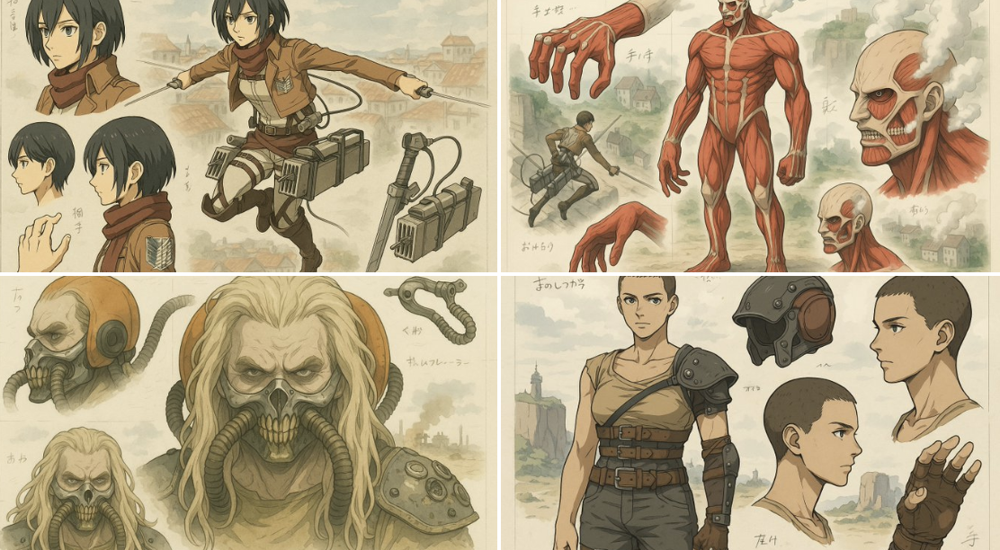
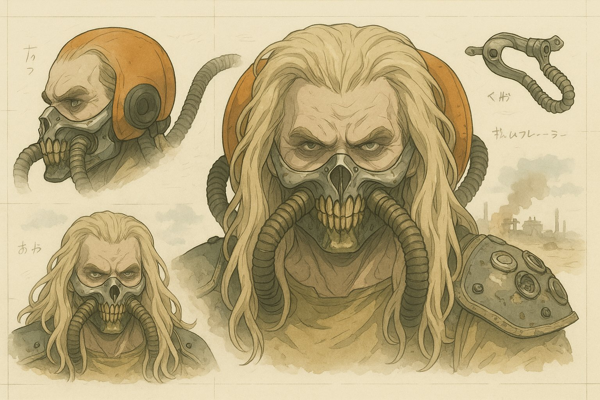

**提示词：**
```
Transform this image into a stylized mechanical design sheet inspired by Japanese anime mecha blueprints.
Render the subject with precise, clean linework and semi-realistic cel-shading, as if it were a technical illustration from an anime artbook.
Break down the design into parts (e.g. head, hand, accessory, full body) and arrange them like a reference sheet, with different angles and views.
Include soft handwritten notes or Japanese characters scattered like concept annotations.
Use muted digital colors (red, gray, metallic tones) and draw the background in a loose watercolor anime landscape style — cliffs, cityscapes, or grassland ruins.
The final composition should feel like an official design page for an animated sci-fi series or manga.
Keep the format horizontal, like a blueprint or character sheet, with a balance between precision and artistic flair.
```

<a id="prompt-116"></a>
## 案例 116：任天堂风格的3D卡通插画 (来源 [@Artedeingenio](https://x.com/Artedeingenio/status/1931647658382258183))


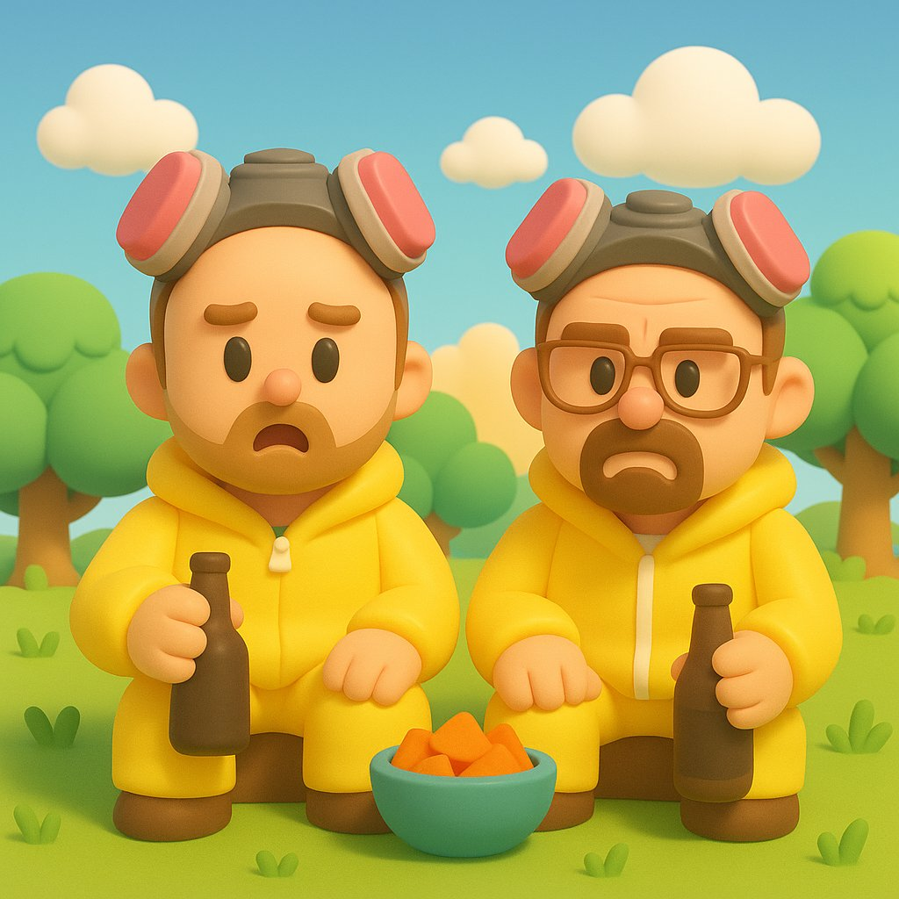

**提示词：**
```
Transform this image into a Nintendo-inspired 3D cartoon style illustration.

Use soft, rounded 3D shapes and clean, toy-like geometry to give the characters and objects a charming, handcrafted look.

Characters should have exaggerated, childlike proportions (large heads, small limbs), with expressive, simplified faces and bright, colorful clothing — similar to designs seen in Zelda: Link’s Awakening, Animal Crossing, or Miitopia.

Apply smooth, matte textures with no realistic detail — everything should look cheerful and slightly plastic, as if sculpted from soft clay or digital vinyl.

The environment should be bright and whimsical, with stylized grass, puffy clouds, geometric trees, and soft lighting like a sunny afternoon.

The overall tone should be lighthearted, clean, and family-friendly, like a frame from a Nintendo fantasy adventure game.
```

<a id="prompt-115"></a>
## 案例 115：冰爽优雅的产品海报 (来源 [@TheRelianceAI](https://x.com/TheRelianceAI/status/1931371954524545120))

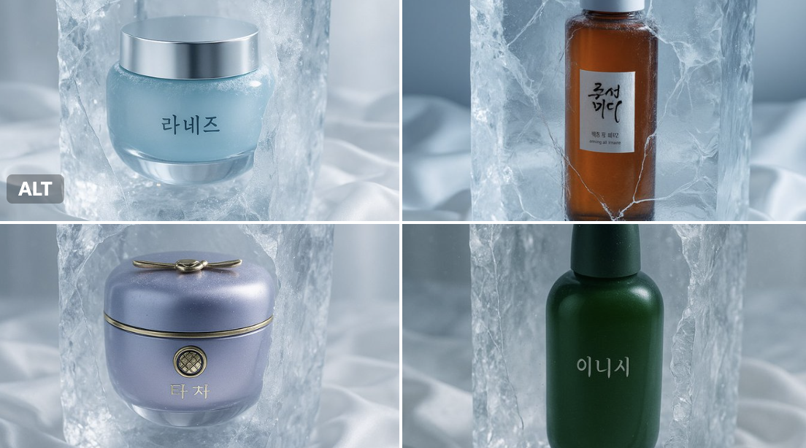


**提示词：**
```
Imagine a visual concept where [insert your product] — featuring Korean text on the label — is suspended inside a cracked, ultra-clear block of ice. The product is fully visible through the ice, with soft frost forming around it. It rests on smooth white silk, and the ambient lighting is cold and elegant, with reflections dancing across the surface. Describe the entire scene in rich visual detail, in the style of a luxurious Korean skincare advertisement.
```

<a id="prompt-114"></a>
## 案例 114：Monochrome LCD 效果 (来源 [@hckmstrrahul](https://x.com/hckmstrrahul/status/1931412135277678837))


**提示词：**
```
{
  "styleAesthetic": {
    "title": "Monochrome Pixel Mosaic",
    "overallVibe": "Retro mobile-screen pixel art—clean, minimal, and slightly nostalgic",
    "renderingStyle": "1-bit square-pixel grid with optional dithering to suggest tone and depth",
    "viewAngle": "Orthographic front view (no perspective distortion)",
    "pixelation": {
      "pixelSize": 6,                     // width/height of each square in px (tweak per output res)
      "pixelShape": "perfect square",
      "gridAlignment": "uniform, no gaps",
      "ditheringPattern": "Floyd–Steinberg or ordered 2×2"
    },
    "colorPalette": {
      "pixelColor": "#000000",            // foreground pixels
      "backgroundColor": "#8CA17C",       // muted pastel green sample; replace to recolor
      "paletteType": "1-bit monochrome"
    },
    "lightingAndShadows": {
      "pixelDropShadow": {
        "enabled": true,
        "offsetX": 0,
        "offsetY": 1,
        "blur": 2,
        "opacity": 0.25
      },
    },
    "materialsAndTextures": [
      {
        "type": "Matte LCD surface",
        "description": "Flat display with very fine grain/noise to simulate old LCD texture",
        "noiseIntensity": 0.01
      }
    ],
    "typography": {
      "fontFamily": "monospaced bitmap",
      "weight": "bold",
      "capitalization": "uppercase",
      "letterSpacing": 0,
      "align": "center"
    },
    "postProcessing": {
      "edgeSmoothing": "none (hard pixel edges preserved)",
      "filmGrain": 0.01,
      "overallContrast": 1.0
    },
    "adaptabilityHints": {
      "applyToPhotographs": "posterize → 1-bit → downsample to pixel grid → apply dithering",
      "applyToVectorText": "render glyphs to bitmap grid using same pixel size and drop shadow",
      "safeResize": "always scale by whole-number multiples to keep squares crisp"
    }
  }
}
```

<a id="prompt-113"></a>
## 案例 113：发光图标 (来源 [@azed_ai](https://x.com/azed_ai/status/1931350205649350935))

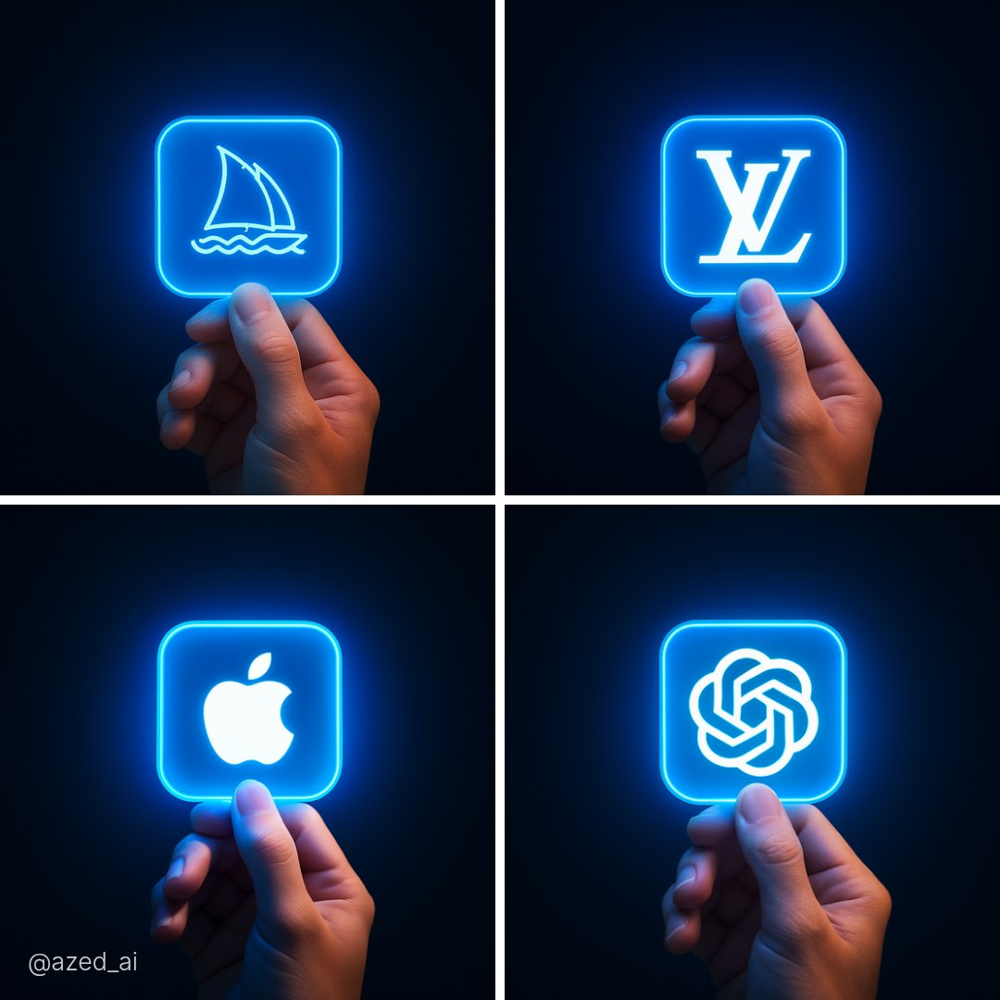
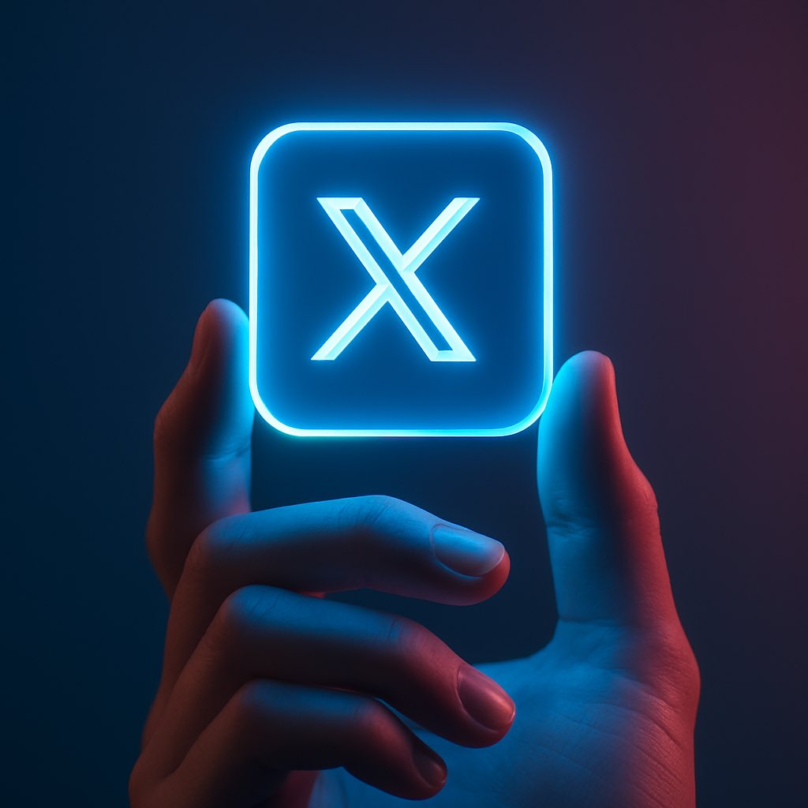

**提示词：**
```
A close-up digital photo of a human hand gently holding a glowing neon blue square icon featuring the [LOGO NAME] logo, set against a smooth dark gradient background. The blue light from the icon softly illuminates the fingers, casting a futuristic glow. The background is minimal and blurred, emphasizing the icon and the hand. High detail, cinematic lighting, modern tech aesthetic.
```

<a id="prompt-112"></a>
## 案例 112：重点线条勾勒 (来源 [@umesh_ai](https://x.com/umesh_ai/status/1931637370639520011))

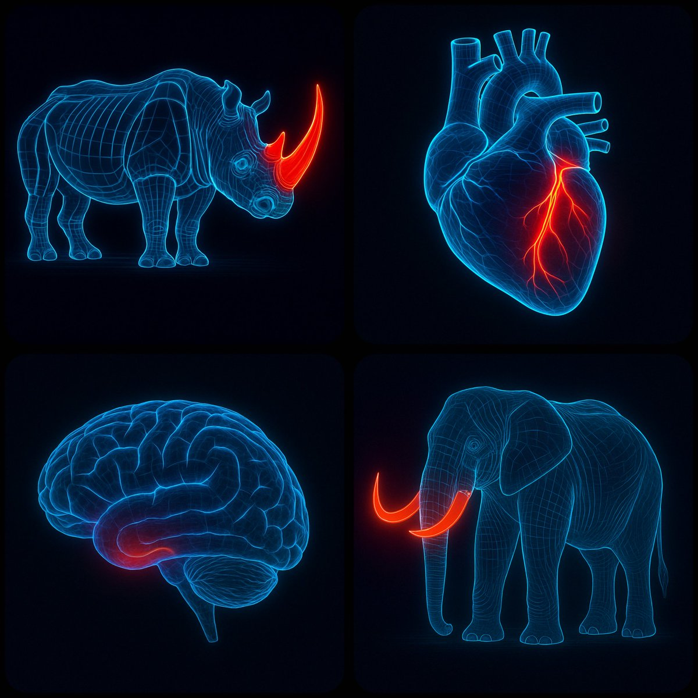


**提示词：**
```
A digital illustration of a [SUBJECT], portrayed with a network of glowing clean pristine blue lines outlining its anatomy. The image is set against a dark background, highlighting the [SUBJECT] form and features. A specific area such as [PART] is emphasized with a red glow to indicate a point of interest or significance. The style is both educational and visually captivating, designed to resemble an advanced imaging technique
```

<a id="prompt-111"></a>
## 案例 111：3d 超写实场景模型 (来源 [@PatriciaRed_](https://x.com/PatriciaRed_/status/1931165199987278330))


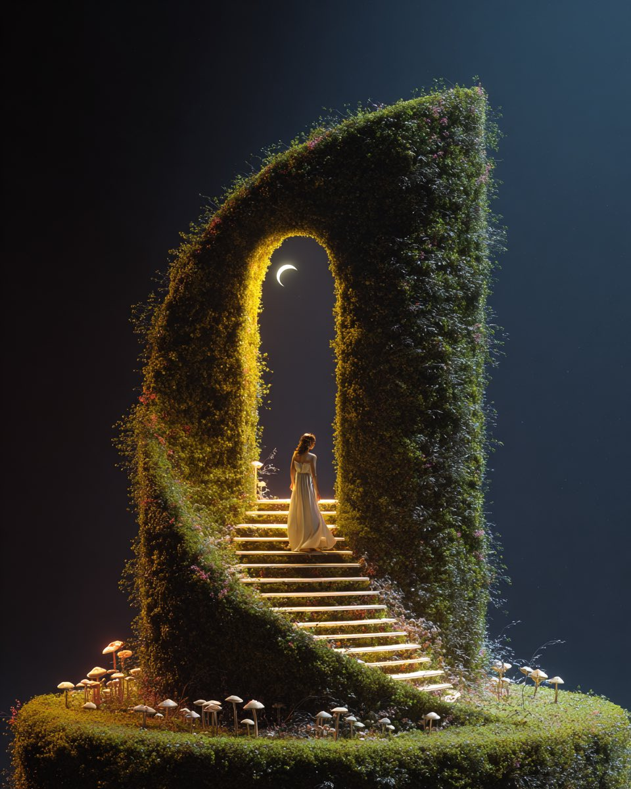

**提示词：**
```
3d hyperrealistic model-scenery of a long-haired woman wearing a flowing maxi dress walking up a curved staircase with an arched doorway at the end with a view to a tiny glowing moon, framed by lush climbing vines, setting over a round base made out of moss and tiny bioluminescent mushrooms, ethereal lighting, staging aesthetics, dark plain background --ar 4:5 --c 6 --s 100
```

```
3d hyperrealistic model-scenery of a long-haired woman wearing a flowing maxi dress walking up a staircase with a lush tree beside it, a two-story building in the background, setting over a round base made out of turquoise water and sand strip, warm lighting, staging aesthetics, plain background --c 6 --v 7.0 --ar 4:5
```

<a id="prompt-110"></a>
## 案例 110：皮克斯风格角色表 (来源 [@CharaspowerAI](https://x.com/CharaspowerAI/status/1931750584090066979))


**提示词：**
```
A character sheet of [detailed description of thecharacter], in the style of Pixar, featuring multiple poses and expressions from different angles, including concept art, pencil sketches, a full-body reference sheet, and a white background. The sheet includes wide shots, low-angle views, 3D renders, and Octane renderings, highly detailed result.
```

<a id="prompt-109"></a>
## 案例 109：涂料飞溅Logo (来源 [@nim_null](https://x.com/nim_null/status/1928008305705664661))

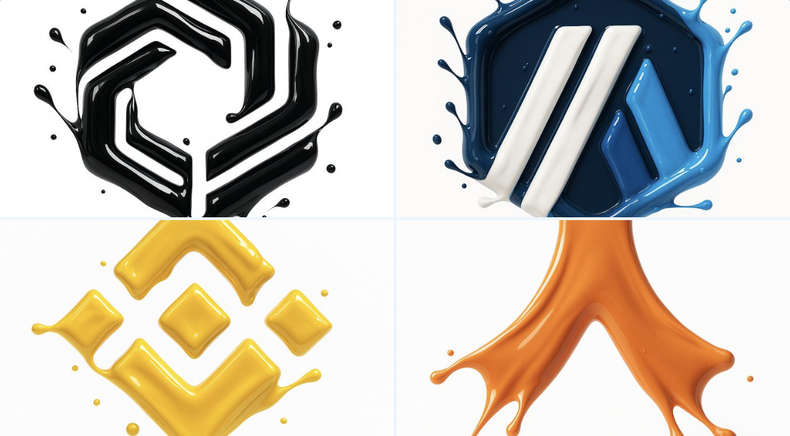

**提示词：**
```
make a hyper-realistic 3D render of the attached logo, formed by glossy liquid paint splashes. Paint sculpts the outline using the exact palette from the reference. Smooth, fluid high-gloss splashes catch highlights; logo floats on pure white.
```

<a id="prompt-108"></a>
## 案例 108：标志液化 (来源 [@umesh_ai](https://x.com/umesh_ai/status/1931723259734888582))


**提示词：**
```
Create a photograph of a [BRAND] logo formed from four vibrant paint splashes: red, blue, green, and yellow, captured mid-motion. Each color flows dynamically across different parts of the logo, as if sculpted from liquid paint. Droplets are suspended in the air around it, enhancing the illusion of movement. Set against a dark background with soft, vivid lighting that accentuates the glossy texture and fluid motion

Use appropriate colors for the logos.
```

<a id="prompt-107"></a>
## 案例 107：超级动物英雄 (来源 [@Kerroudjm](https://x.com/Kerroudjm/status/1931742320233230743))


**提示词：**
```
A hyper-realistic square 1:1 portrait of a [YOUR ANIMAL] standing in a heroic pose, facing slightly left. The animal wears a textured dark gray superhero suit, form-fitting and matte, with visible fabric grain and subtle seams.

On its chest, inside a golden metallic Superman-style diamond emblem, is a fabric-embroidered version of the [COUNTRY] national flag (realistic stitching, slightly raised).

Draped over the animal’s shoulder is a flowing cape designed from the [COUNTRY] flag, with rich fabric folds and natural weight.

Behind the subject, use a realistic fabric backdrop displaying the full [COUNTRY] flag, slightly out of focus to add depth, with soft shadows to enhance realism.

Lighting should be warm and directional (studio-style), emphasizing the animal’s fur texture, suit material, and the contours of a subtly muscular chest. The overall tone is dramatic and cinematic, with a warm color grading and no excessive contrast. The head must be fully visible — no cropping.
```

<a id="prompt-106"></a>
## 案例 106：时间之神 (来源 [@TheRelianceAI](https://x.com/TheRelianceAI/status/1931726518952034462))

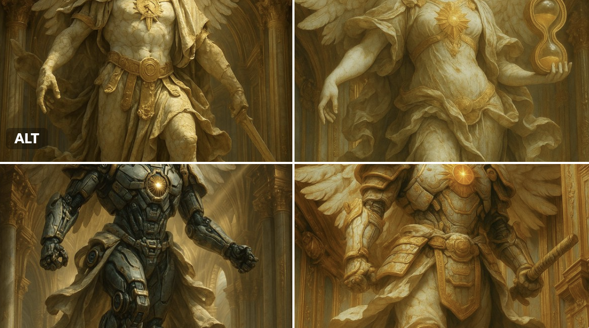


**提示词：**
```
Colossal marble statue of [INSERT OBJECT OR CHARACTER HERE], wings (if applicable) spread in divine majesty, adorned with ornate golden armor and flowing baroque robes, cracked marble textures with soft patina, glowing sacred emblem on chest, standing within a celestial golden dome, surrounded by divine architecture, dramatic god rays from above, dynamic mid-action pose, ultra-detailed renaissance sculpture style, cinematic lighting, majestic and sacred atmosphere, 8k resolution
```

<a id="prompt-105"></a>
## 案例 105：刺绣logo (来源 [@azed_ai](https://x.com/azed_ai/status/1931713849067241960))

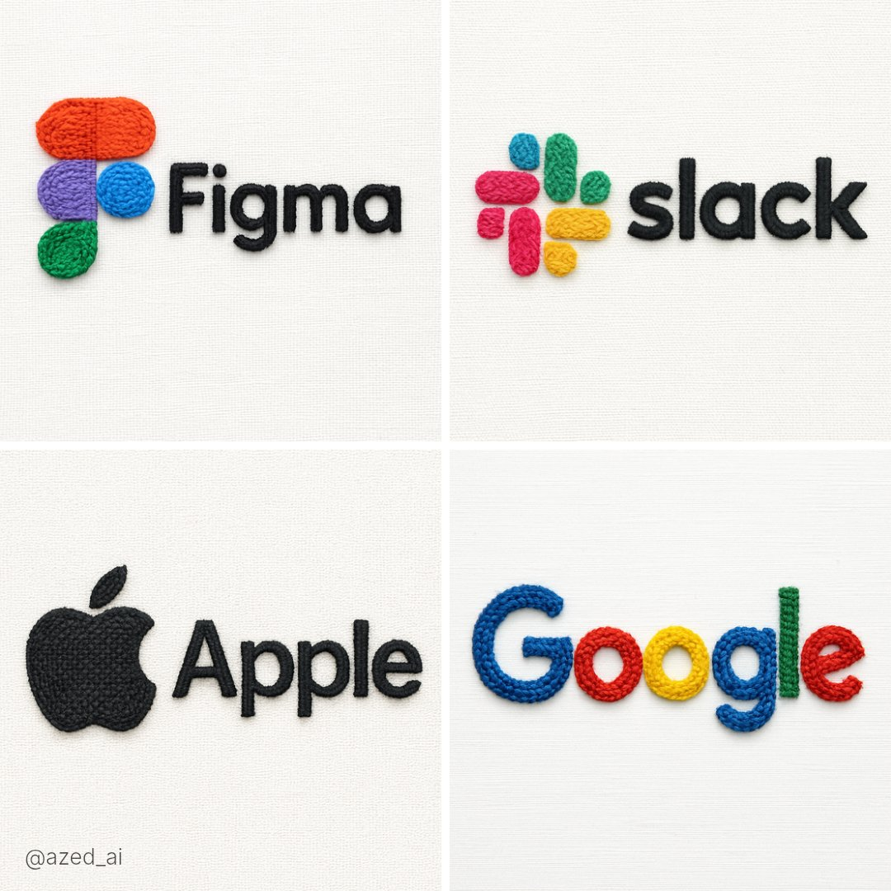

**提示词：**
```
A hyperrealistic embroidered textile artwork of the [SUBJECT], created with colored thread and soft fabric textures. The design features dense, tactile stitching and raised embroidery that mimics the actual form and branding. Set against a plain, off-white fabric background, with clean studio lighting and a sharp close-up view. Emphasize threadwork, texture, and handmade imperfections for a realistic soft sculpture look.
```

<a id="prompt-104"></a>
## 案例 104：珐琅马赛克瓷砖风格 (来源 [@mariia_gonchar](https://x.com/mariia_gonchar/status/1931774946608370013))


**提示词：**
```
Visualize any selected emoji [] as an ultra-detailed, hyper-realistic 3D sculpture fully composed of luxurious enamel mosaic tiles. The emoji should retain its iconic silhouette and proportions, reinterpreted as a stylized 3D figure made entirely from curved, faceted, and geometrically interlocked enamel tiles in a radiant mosaic pattern.
> Use high-gloss enamel tiles in varied shades derived from the emoji’s symbolic palette—integrating metallic accents, opalescent glazes, deep ceramic pigmentation, and subtle iridescence. Tile surfaces must exhibit gentle bevels, crisp joints, and tactile depth to emulate elite architectural mosaic work.
> Ensure no visible support structures—the figure must appear freestanding and weightless, suspended mid-air at the exact center of the frame.
> Background: pure white studio environment with soft ambient shadows directly beneath the sculpture to emphasize spatial presence and floating realism.
> Lighting: cinematic, diffused from multiple angles to 
```

<a id="prompt-103"></a>
## 案例 103：刺绣风格 (来源 [@firatbilal](https://x.com/firatbilal/status/1931762571876446256))

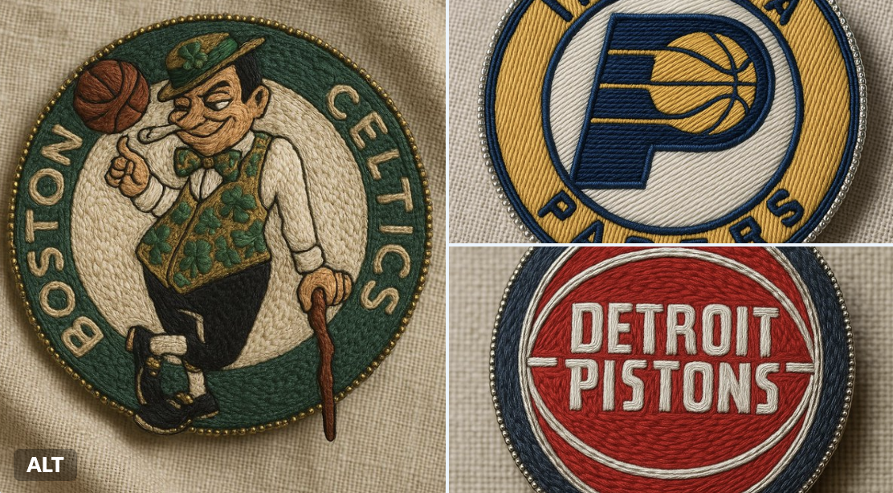

**提示词：**
```
{
  "title": "Adaptive Embroidered Brooch Prompt Generator",
  "version": "2.0",
  "description": "Generate a prompt for an embroidered brooch based on text description or uploaded image.",
  "inputs": {
    "reference_mode": {
      "type": "select",
      "label": "Reference Source",
      "options": ["describe manually", "use uploaded image", "combine both"],
      "default": "describe manually"
    },
    "theme_text": {
      "type": "text",
      "label": "Describe the Theme or Motif",
      "placeholder": "e.g. an owl in a forest, biomechanical skull, dancing figures"
    },
    "image_reference_description": {
      "type": "text",
      "label": "Describe what's in the uploaded image (if using image mode)",
      "placeholder": "e.g. a mechanical skull with succulents growing from it"
    },
    "shape": {
      "type": "select",
      "label": "Brooch Shape",
      "options": ["circular", "oval", "square", "irregular"],
      "default": "oval"
    },
    "style": {
      "type": "select",
      "label": "Embroidery Style",
      "options": [
        "traditional", 
        "folkloric", 
        "surreal", 
        "biomech-organic fusion", 
        "modern minimal"
      ],
      "default": "traditional"
    },
    "color_palette": {
      "type": "select",
      "label": "Color Palette",
      "options": [
        "earth tones and muted greens",
        "pastel shades",
        "neon surreal",
        "rusted metal and white florals",
        "monochrome with silver threads"
      ],
      "default": "earth tones and muted greens"
    }
  },
  "prompt_template": "{final_theme} hand-embroidered brooch, {style} style, crafted with intricate threadwork and metallic accents, soft wool and silk embroidery, fine beadwork outlining the {shape} shape, natural color palette ({color_palette}), macro shot on neutral linen or stone background, ultra-detailed artisan aesthetic, realistic embroidery textures, soft atmospheric lighting --ar 1:1 --style raw --v 6 --q 2",
  "logic": {
    "final_theme": {
      "if": "reference_mode == 'describe manually'",
      "value": "{theme_text}"
    },
    "final_theme_alt": {
      "if": "reference_mode == 'use uploaded image'",
      "value": "{image_reference_description}"
    },
    "final_theme_combined": {
      "if": "reference_mode == 'combine both'",
      "value": "{theme_text} and elements from: {image_reference_description}"
    }
  }
}
```
**提示：{shape}、{theme}、{style} 可自己修改**

<a id="prompt-102"></a>
## 案例 102：纹理化图片 (来源 [@egeberkina](https://x.com/egeberkina/status/1931727106590826828))


**提示词：**
```
Retexture the image attached based on the json below
{
  "style": "C4D hyper-realistic 3D render",
  "object_form": "detailed mechanical design",
  "geometry": {
    "shape": "sharp edges with smooth curves",
    "scale": "real-world proportion",
    "detailing": "high-poly mesh with intricate mechanical features"
  },
  "material": {
    "base": "polished plastic and carbon fiber",
    "texture": "fine surface variation with specular maps",
    "finish": "high gloss with realistic reflections"
  },
  "design_elements": {
    "decals": "subtle branding and panel lines",
    "surface_effects": "anodized gradients, emissive lighting elements",
    "aero_parts": "spoilers, splitters, and aggressive styling cues"
  },
  "color_scheme": {
    "primary": "#0ae2c0",
    "secondary": "#111111",
    "accents": ["#ffffff", "#e00000"],
    "reflections": "real-world HDRI light environment",
    "background": "#ffffff"
  },
  "lighting": {
    "type": "studio 3-point with HDRI",
    "intensity": "balanced with key fill and rim lights",
    "shadows": "soft, subtle contact shadow under object",
    "highlights": "strong specular reflections on curves"
  },
  "rendering": {
    "engine": "Cinema 4D Redshift or Octane",
    "resolution": "ultra high-definition (4K+)",
    "focus": "object-centered with floating illusion",
    "background_blur": "none"
  },
  "composition": {
    "layout": "centered in frame",
    "object_count": 1,
    "orientation": "three-quarter front view",
    "camera": "35mm lens, slightly elevated",
    "grounding": "floating mid-air with realistic soft shadow cast on white background"
  }
}
```
**提示：需上传一张参考图**


<a id="prompt-101"></a>
## 案例 101：将你的Logo变成吉祥物 (来源 [@alex_prompter](https://x.com/alex_prompter/status/1927308788610081088))

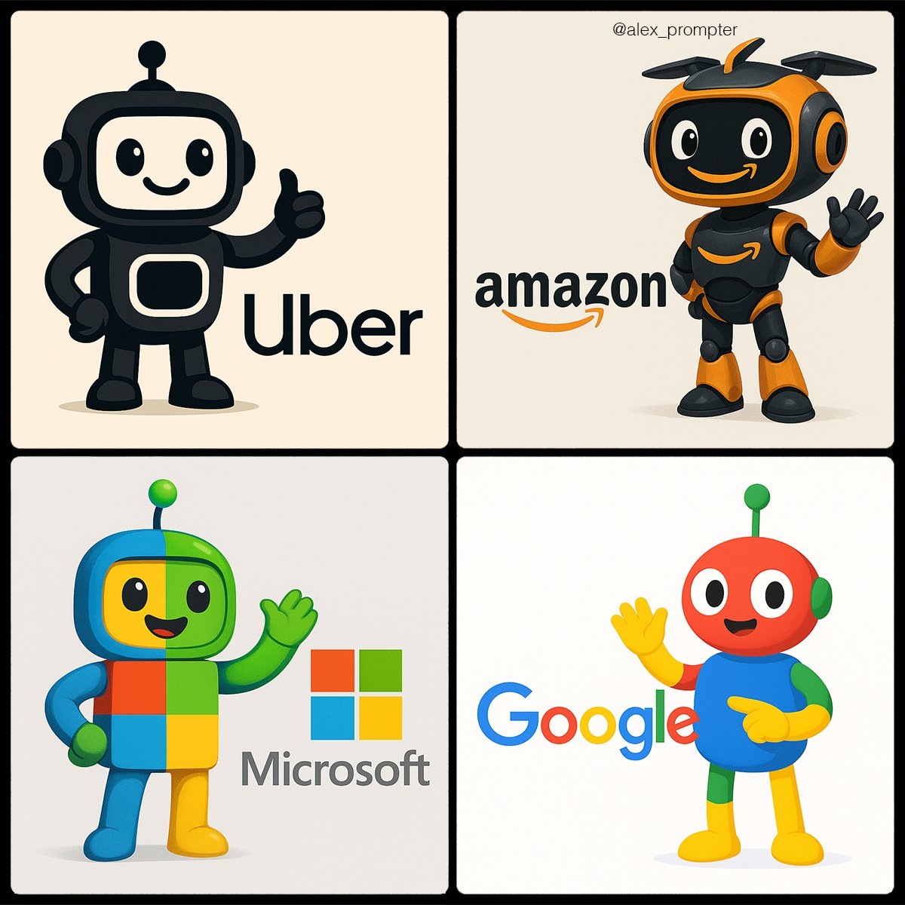

**提示词：**
```
Create a mascot for [BRAND NAME] logo following the JSON aesthetic below:
{
"style": "brand-inspired creative mascot generation",
"subject_handling": {
"adapt_to_uploaded_image": true,
"preserve_uploaded_logo_shape_and_text": true,
"extract_dominant_brand_colors": true,
"analyze_logo_style_for_mood": true,
"use_uploaded_image_as_primary_reference": true
},
"mascot_generation": {
"character_type": "open — could be an animal, humanoid, object, robot, fantasy creature, or abstract form",
"design_strategy": "generate a mascot concept that visually complements the uploaded brand based on extracted brand colors, mood, and style",
"style_alignment": "mascot should feel like part of the brand family — matching tone (playful, elegant, techy, minimal, etc.)",
"color_usage": "use brand colors as dominant tones in mascot’s body, clothing, skin, or materials",
"personality_embedding": "include expressive traits aligned with brand tone (e.g. curious, bold, serene, confident)"
},
"composition": {
"include_uploaded_logo_in_final_image": true,
"arrangement": "mascot and logo presented together in a clear and balanced composition",
"environment": "minimal scene or brand-aligned abstract background — not too busy",
"interaction": "mascot may pose near, hold, or gesture to logo — but must not obscure or alter it"
},
"lighting": {
"type": "neutral or soft directional lighting depending on brand tone",
"shadow_behavior": "soft contact shadows to ground elements"
},
"camera": {
"view_angle": "centered frontal or three-quarter depending on layout",
"focus": "both mascot and logo in clear focus"
},
"post_processing": {
"enhance_color harmony between mascot and logo": true,
"disable_style_overrides or artistic distortion": true
},
"image_constraints": {
"transparent_background": false,
"aspect_ratio": [INSERT ASPECT RATIO],
"include_text_if_present_in_logo": true,
"preserve_uploaded_logo_geometry": true,
"prevent_logo_modification": true
},
"notes": "Use the uploaded logo or product image as the central brand reference. Automatically generate a unique mascot that feels like an original creation belonging to the brand — inspired by extracted colors, shapes, and mood. The mascot must not copy other mascots or use predefined templates. The final image should creatively showcase both the logo and its new mascot side-by-side, visually unified but distinct."
}
```
**提示：上传一张参考图，然后调整[BRAND NAME]和[INSERT ASPECT RATIO]变量**
