<a id="readme-top"></a>
# 欢迎来到 Nano Banana(nanobanana)/GPT-5/GPT‑4o/豆包 图片提示词（Prompts）精选！

🎉 在线演示地址：https://www.aipipixia.online/

---
## 获取最新提示词？你可以通过这3个渠道。
<div style="width: 98%;">
<table>
  <tr>
    <!-- 左侧文字单元格 -->
    <td style="width: 60%; padding: 2px; vertical-align: middle; border: none;">
      <p>1、微信公众号：未来职场AI学堂</p><p>2、扫一扫，拉你进大群《AI技术学习交流群》</p>
    </td>
    <!-- 右侧图片单元格 -->
    <td>
      
    </td>
  </tr>
</table>
</div>

---

<a id="prompt-toc"></a>
## 📖 案例目录
*   [案例 700：上海3D城市时光之旅 ](#prompt-700)
*   [案例 699：年轻女子温柔的特写镜头 ](#prompt-699)
*   [案例 698：女子仰卧自拍照 ](#prompt-698)
*   [案例 697：毛毡材质玩具 ](#prompt-697)
*   [案例 696：日系少女赶地铁 ](#prompt-696)
*   [案例 695：3x3网格柔和的粉蓝色调摄影棚写真照 ](#prompt-695)
*   [案例 694：色彩缤纷的Y2K剪贴簿海报 ](#prompt-694)
*   [案例 693：写实照片定格JOJO风格 ](#prompt-693)
*   [案例 692：棕色长发的年轻女子自拍照 ](#prompt-692)
*   [案例 691：用英文日文标注所有物品 ](#prompt-691)
*   [案例 690：双语认知大发现-海底世界 ](#prompt-690)
*   [案例 689：双语认知大发现-交通工具 ](#prompt-689)
*   [案例 688：一位魅力四射的女性超逼真8K肖像 ](#prompt-688)
*   [案例 687：生成一张指定时间地点的逼真照片 ](#prompt-687)
*   [案例 686：中国每个城市标志性美食 ](#prompt-686)
*   [案例 685：3x3的网格特写照片 ](#prompt-685)
*   [案例 684：哥特式电影风格的肖像画 ](#prompt-684)
*   [案例 683：花园里的婚纱照 ](#prompt-683)
*   [案例 682：微缩3D卡通视图展城市最高的三座建筑 ](#prompt-682)
*   [案例 681：反推图片json提示词 ](#prompt-681)
*   [案例 680：OOTD手绘涂鸦分解 ](#prompt-680)
*   [案例 679：紫禁城建筑照片展示和设计图纸 ](#prompt-679)
*   [案例 678：疯狂动物城朱迪和尼克讲小故事-守株待兔 ](#prompt-678)
*   [案例 677：现代少年奇幻漫画 ](#prompt-677)
*   [案例 676：夜晚吐舌头女生的自拍照 ](#prompt-676)
*   [案例 675：同一张脸的柔和模糊的侧面特写 ](#prompt-675)
*   [案例 674：武当山山腰的一栋双层住宅 ](#prompt-674)
*   [案例 673：3×3的美妆电商广告制作 ](#prompt-673)
*   [案例 672：疯狂动物城朱迪和尼克 ](#prompt-672)
*   [案例 671：星座运势卡 ](#prompt-671)
*   [案例 670：年轻女子对着镜子自拍旁边是朱迪 ](#prompt-670)
*   [案例 669：女子在迪士尼商店里对着镜子自拍 ](#prompt-669)
*   [案例 668：城市俯视等距3D卡通微缩场景 ](#prompt-668)
*   [案例 667：超写实风格真实和卡通分离效果 ](#prompt-667)
*   [案例 666：极近距离的自拍照 ](#prompt-666)
*   [案例 665：外卖员的写真照 ](#prompt-665)
*   [案例 664：多图风格参考 ](#prompt-664)
*   [案例 663：哆啦A梦讲课 ](#prompt-663)
*   [案例 662：城市地标做成的蛋糕 ](#prompt-662)
*   [案例 661：根据经纬度生成的航拍图像 ](#prompt-661)
*   [案例 660：现代前卫的女生特写 ](#prompt-660)
*   [案例 659：年轻女性的超近特写肖像 ](#prompt-659)
*   [案例 658：3x3大头贴风格拼贴画 ](#prompt-658)
*   [案例 657：身着西装的女子摆出嫌犯照姿势 ](#prompt-657)
*   [案例 656：女人的自拍照 ](#prompt-656)
*   [案例 655：Google DeepMind进行一次物品整齐排列展示 ](#prompt-655)
*   [案例 654：人手拿着一颗巨大的竖式药丸的特写镜头 ](#prompt-654)
*   [案例 653：超写实的旅行广告 ](#prompt-653)
*   [案例 652：人物的电影级逼真图像 ](#prompt-652)
*   [案例 651：抹茶女孩 ](#prompt-651)
*   [案例 650：头部的空腔内正站着迷你版自己 ](#prompt-650)
*   [案例 649：一张超逼真的8K人像 ](#prompt-649)
*   [案例 648：电影感十足的照片 ](#prompt-648)
*   [案例 647：漂浮在空中的3D爆炸装配图 ](#prompt-647)
*   [案例 646：年轻女子坐在购物车里 ](#prompt-646)
*   [案例 645：一张脸六种情绪 ](#prompt-645)
*   [案例 644：极具收藏价值的国际象棋棋子 ](#prompt-644)
*   [案例 643：现代矢量海报肖像 ](#prompt-643)
*   [案例 642：黑板艺术作品-海賊女帝 ](#prompt-642)
*   [案例 641：路飞教室艺术 ](#prompt-641)
*   [案例 640：3x3网格构图进行拍摄照片 ](#prompt-640)
*   [案例 639：身穿露肩白色针织上衣 ](#prompt-639)
*   [案例 638：可爱偶像特写肖像 ](#prompt-638)
*   [案例 637：肤色白皙的美丽女性沐浴在晨光中 ](#prompt-637)
*   [案例 636：3D立体书插画 ](#prompt-636)
*   [案例 635：根据古诗画一幅画 ](#prompt-635)
*   [案例 634：水墨画风格与写实摄影的结合 ](#prompt-634)
*   [案例 633：深夜放毒是对减肥最大的不尊重 ](#prompt-633)
*   [案例 632：日式居酒屋狗狗烤串 ](#prompt-632)
*   [案例 631：根据古诗画一幅画 ](#prompt-631)
*   [案例 630：疯狂动物城的大型毛绒角色帽子 ](#prompt-630)
*   [案例 629：一张图片生成9个不同景别的镜头 ](#prompt-629)
*   [案例 628：第一人称视角牵手照片 ](#prompt-628)
*   [案例 627：MacBook Pro 笔记本电脑拆解 ](#prompt-627)
*   [案例 626：黑白水墨画风格-孤舟蓑笠翁 ](#prompt-626)
*   [案例 625：在人物周围添加糖果怪兽 ](#prompt-625)
*   [案例 624：手绘美颜科普图 ](#prompt-624)
*   [案例 623：对作品进行评价 ](#prompt-623)
*   [案例 622：自信成熟女性室内电影肖像 ](#prompt-622)
*   [案例 621：一只手拿着上传图片中的产品 ](#prompt-621)
*   [案例 620：超写实性感大嘴人物肖像 ](#prompt-620)
*   [案例 619：90年代电影质感的逼真香港复古肖像照 ](#prompt-619)
*   [案例 618：四幅时尚生活场景组成的拼贴画 ](#prompt-618)
*   [案例 617：四幅时尚生活场景组成的连贯拼贴画 ](#prompt-617)
*   [案例 616：女生背对着观众坐在编织沙发上 ](#prompt-616)
*   [案例 615：人和机器人的温馨时刻 ](#prompt-615)
*   [案例 614：一幅赛博武士的详细技术图解 ](#prompt-614)
*   [案例 613：女子坐在地板上准备喝可乐 ](#prompt-613)
*   [案例 612：一个 男人被相框套娃了 ](#prompt-612)
*   [案例 611：一幅充满活力的混合媒介杰作 ](#prompt-611)
*   [案例 610：一位自信优雅的年轻女子 ](#prompt-610)
*   [案例 609：年轻女性的时尚自拍肖像 ](#prompt-609)
*   [案例 608：一群活泼时尚的年轻人 ](#prompt-608)
*   [案例 607：9种照片专业打光效果 ](#prompt-607)
*   [案例 606：超逼真街景人像 ](#prompt-606)
*   [案例 605：海滩写真拍摄 ](#prompt-605)
*   [案例 604：夜间拖影快门曝光 ](#prompt-604)
*   [案例 603：一张韩国流行明星的抓拍照片 ](#prompt-603)
*   [案例 602：戴口罩的妹子比了个耶 ](#prompt-602)
*   [案例 601：专业工作室摄影照片 ](#prompt-601)
---

<a id="prompt-700"></a>
## 案例 700：上海3D城市时光之旅 (来源 [@servasyy](https://x.com/servasyy/status/1995412825003708860)) 模型：Nano banana pro

<div style="display: flex; justify-content: space-between;">

</div>

**提示词：**
```
A stunning hyper-realistic 3D render of Shanghai's architectural evolution displayed as detailed miniature model diorama on a large circular floating platform, like a round disc divided into four distinct quadrants. ALL buildings are rendered as tangible 3D miniature models with physical depth and dimension, not flat backgrounds. The circular platform has thick layered edges resembling geological strata in shades of brown, beige, and turquoise blue.   First quadrant (top-left): 3D miniature models of traditional Shikumen stone-gate houses with grey tiled roofs, wooden window frames, grey brick walls, red paper lanterns, tiny vintage bicycles and rickshaws as 3D models, miniature human figures.   Second quadrant (top-right): 3D miniature models of The Bund architecture - Art Deco Peace Hotel with green copper roof (3D model), neoclassical HSBC Building dome (3D model), Gothic customs house clock tower (3D model), cream and golden facades, tiny 1930s cars as 3D models, miniature pedestrian figures.   Third quadrant (bottom-right): 3D miniature models of modern Pudong skyline - Oriental Pearl Tower with pink spheres (detailed 3D model), Jin Mao Tower (3D model), Shanghai Tower twisted glass form (3D model), Shanghai World Financial Center (3D model), all skyscrapers rendered as physical miniature 3D models with depth, tiny modern vehicles, miniature contemporary figures.   Fourth quadrant (bottom-left): 3D miniature models of future sustainable architecture - vertical forest towers covered in tiny green plants (3D models), transparent solar panel buildings (3D models), organic curved parametric structures (3D models), elevated hyperloop stations (3D models), tiny drones and flying vehicles as 3D models, miniature futuristic figures.   The circular platform floats above realistic 3D rendered Huangpu River water with reflections. Traditional wooden sampan boats (3D models) transform into sleek modern cruise ships (detailed 3D models). Platform edges show beautiful wave-like geological strata texture. Background features atmospheric misty Shanghai skyline silhouettes transitioning from warm dawn orange through pink-purple twilight to deep night blue with stars.   Lighting transitions across quadrants: warm sepia tone for Shikumen, golden hour sunlight for Bund, vibrant electric blue neon for modern Pudong, holographic cyan-magenta glow for future section.   At top center: elegant bilingual typography "上海 SHANGHAI" combining traditional calligraphy with modern sans-serif, subtitle "Architectural Journey Through Time" and "建筑时光之旅".   Ultra-realistic 3D rendering style, professional architectural miniature photography, tilt-shift lens effect creating miniature appearance, all elements have physical 3D depth and dimension, hyper-detailed textures showing model craftsmanship, 4K resolution, museum-quality diorama presentation, dramatic studio lighting with depth and atmosphere, every building is a tactile 3D miniature model not a flat image.
```

**中文提示词：**
```
令人惊叹的超写实3D渲染图展现了上海建筑的演变历程，并以精细的微缩模型立体场景的形式呈现在一个大型圆形悬浮平台上，平台如同一个被分割成四个独立象限的圆盘。所有建筑均以具有真实立体感和深度的3D微缩模型呈现，而非平面背景。圆形平台边缘厚实，层叠交错，宛如地质地层，呈现出棕色、米色和蓝绿色调。第一象限（左上）：展示了传统的石库门石门建筑的3D微缩模型，这些建筑拥有灰色瓦顶、木质窗框、灰色砖墙、红色纸灯笼，以及小巧的复古自行车和人力车模型，还有微缩的人物模型。第二象限（右上）：外滩建筑的3D微缩模型——装饰艺术风格的和平饭店（绿色铜屋顶，3D模型）、新古典主义风格的汇丰银行大厦穹顶（3D模型）、哥特式海关大楼钟楼（3D模型）、奶油色和金色外墙、20世纪30年代的微型汽车（3D模型）以及微型行人。第三象限（右下）：浦东现代天际线的3D微缩模型——东方明珠塔（粉色球体，精细3D模型）、金茂大厦（3D模型）、上海中心大厦（扭曲玻璃结构，3D模型）、上海环球金融中心（3D模型），所有摩天大楼均以具有深度的实体3D微缩模型呈现，此外还有微型现代车辆和微型当代人物。第四象限（左下角）：未来可持续建筑的3D微缩模型——覆盖着微型绿色植物的垂直森林塔（3D模型）、透明太阳能板建筑（3D模型）、有机曲线参数化结构（3D模型）、高架超级高铁站（3D模型）、微型无人机和飞行器（3D模型）以及未来主义微缩模型。圆形平台漂浮在逼真的3D渲染黄浦江水面上，水面倒映着江水的纹理。传统的木制舢板（3D模型）逐渐演变为线条流畅的现代游轮（精细的3D模型）。平台边缘展现出美丽的波浪状地质层纹理。背景是朦胧的上海天际线轮廓，从温暖的晨曦橙色过渡到粉紫色的暮光，最终变为繁星点点的深邃夜空蓝色。灯光在不同象限间过渡：石库门采用温暖的棕褐色调，外滩沐浴在金色的阳光下，现代浦东则闪耀着充满活力的电光蓝霓虹灯，未来区域则呈现出全息的青色和洋红色光芒。画面顶部中央：优雅的双语字体“上海 SHANGHAI”，融合了传统书法与现代无衬线字体，副标题为“建筑时光之旅”。采用超逼真的3D渲染风格、专业的建筑微缩摄影技术，运用移轴镜头效果营造微缩景观，所有元素均具有真实的3D深度和立体感，超精细的纹理展现了模型的精湛工艺，4K分辨率，博物馆级立体模型呈现，戏剧性的影棚灯光营造出丰富的层次感和氛围，每一栋建筑都是触感十足的3D微缩模型，而非平面图像。
```

<a id="prompt-699"></a>
## 案例 699：年轻女子温柔的特写镜头 (来源 [@YaseenK7212](https://x.com/YaseenK7212/status/1995172379991883987)) 模型：Nano banana pro

<div style="display: flex; justify-content: space-between;">
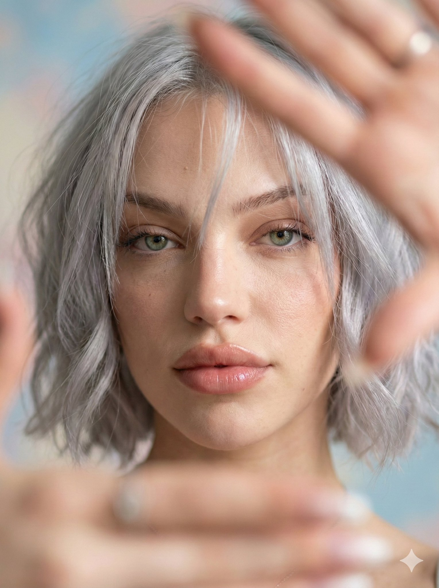
</div>

**提示词：**
```
{
  "pipeline_configuration": {
    "job_type": "img2img_transformation",
    "meta_tags": ["macro", "beauty", "soft_focus", "realism"],
    
    "input_reference_handling": {
      "preservation_rules": {
        "facial_identity": {
          "strength": 1.0,
          "instruction": "Strict 100% preservation of facial geometry and features.",
          "technique": "FaceID / IP-Adapter Strong"
        },
        "color_palette": {
          "target": "Hair Color",
          "mode": "inherit_from_source",
          "instruction": "Do not hallucinate new hair color. Map source color to new hair texture."
        }
      }
    },

    "generative_parameters": {
      "subject_definition": {
        "hair_morphology": {
          "length": "Short",
          "texture_type": "Wavy",
          "styling_aesthetic": "Intentionally messy, artfully disheveled",
          "micro_details": "Fine strands falling across forehead and near eyes",
          "color_override": null
        },
        "facial_details": {
          "expression": "Serene, gentle",
          "makeup_style": "Natural, soft-beauty approach",
          "surface_texture": "Ultra-clean skin with visible macro pores"
        }
      },

      "scene_composition": {
        "camera_settings": {
          "proximity": "Extreme Close-Up (Macro)",
          "depth_of_field": "Ultra-shallow",
          "focus_target": "Eyes",
          "lens_character": "Soft beauty lens"
        },
        "foreground_layers": {
          "element": "Hand",
          "state": "Partially blurred",
          "purpose": "Framing effect, adding depth and intimacy"
        },
        "background_layers": {
          "state": "Fully out of focus",
          "visuals": "Pastel, soft tones",
          "bokeh_quality": "Strong, smooth, creamy"
        }
      },

      "lighting_and_atmosphere": {
        "style": "Soft-beauty photography",
        "dynamic_range": "High (HDR)",
        "quality": "Airy, bright, diffused",
        "reflections": {
          "eyes": "Crisp, sharp catchlights",
          "lips": "Soft, natural shine"
        }
      }
    },

    "text_prompts": {
      "weighted_positive": {
        "(Masterpiece, Best Quality, 8k, Macro Photo)": 1.5,
        "Extreme close-up of young woman with serene gentle expression": 1.3,
        "Short wavy messy hair with stray wisps over eyes": 1.2,
        "Hand in foreground partially blurred framing the face": 1.2,
        "Macro skin texture, pores visible, individual hair strands": 1.4,
        "Ultra-sharp eyes with crisp reflections": 1.3,
        "Soft pastel bokeh background": 1.1,
        "Soft diffused lighting, airy aesthetic": 1.0
      },
      "weighted_negative": {
        "alteration of face, new hair color, long hair": 1.5,
        "plastic skin, airbrushed, smooth": 1.4,
        "cartoon, 3d render, illustration": 1.3,
        "deep focus, sharp background, clutter": 1.2,
        "deformed hand, bad anatomy": 1.4
      }
    }
  }
}
```

**中文提示词：**
```
{
"pipeline_configuration": {
"job_type": "img2img_transformation",
"meta_tags": ["macro", "beauty", "soft_focus", "realism"],

"input_reference_handling": {
"preservation_rules": {
"facial_identity": {
“强度”：1.0，
“说明”：“严格100%保留面部几何形状和特征。”
“技术”： “FaceID / IP适配器强”
},
"color_palette": {
目标：头发颜色，
"mode": "inherit_from_source",
“说明”：“不要凭空想象新的发色。将原有发色映射到新的发质上。”
}
}
},

"generative_parameters": {
"subject_definition": {
"毛发形态学": {
"长度": "短"
"texture_type": "波浪形",
"styling_aesthetic": "故意凌乱，巧妙地不修边幅",
"micro_details": "额头和眼周垂落的细小发丝",
"color_override": null
},
"facial_details": {
“表情”：“宁静，温柔”，
"makeup_style": "自然柔美风格",
"surface_texture": "肌肤极其洁净，可见毛孔"
}
},

"scene_composition": {
"camera_settings": {
“近景”: “超近特写（微距）”
"景深": "超浅",
"focus_target": "眼睛",
"lens_character": "柔和美颜镜头"
},
"前景图层": {
“元素”： “手”，
“状态”：“部分模糊”，
“目的”：“构图效果，增添深度和亲密感”
},
"background_layers": {
“状态”：“完全失焦”
“视觉效果”：“柔和的粉彩色调”，
"bokeh_quality": "强烈、柔和、细腻"
}
},

"lighting_and_atmosphere": {
“风格”：“柔美摄影”，
"dynamic_range": "高 (HDR)",
“品质”：“轻盈、明亮、柔和”，
"反思": {
“眼睛”：“清晰锐利的眼神光”，
“唇部”：“柔和自然的光泽”
}
}
},

"text_prompts": {
"加权正值": {
"（杰作，最佳品质，8K，微距照片）": 1.5，
“年轻女子表情宁静温柔的特写镜头”：1.3，
“短而蓬乱的波浪卷发，几缕碎发垂在眼前”：1.2，
“前景中部分模糊的手框住了脸部”：1.2，
“宏观皮肤纹理，毛孔可见，单根毛发可见”：1.4，
“超清晰的眼睛，反射效果极佳”：1.3，
“柔和的粉彩散景背景”：1.1，
柔和的漫射光，轻盈的美感：1.0
},
"weighted_negative": {
“面部改变、新的发色、长发”：1.5，
“塑料皮肤，喷绘，光滑”：1.4，
“卡通，3D渲染，插图”：1.3，
“景深大，背景清晰，杂乱”：1.2，
“手部畸形，解剖结构异常”：1.4
}
}
}
}
```

<a id="prompt-698"></a>
## 案例 698：女子仰卧自拍照 (来源 [@lexx_aura](https://x.com/lexx_aura/status/1995485429265575954)) 模型：Nano banana pro

<div style="display: flex; justify-content: space-between;">
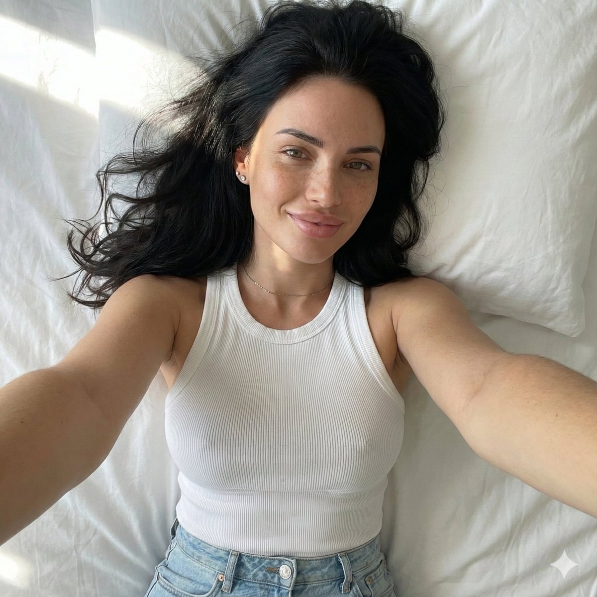
</div>

**提示词：**
```
{
  "subject": {
    "type": "young woman",
    "pose": "lying on her back, taking a selfie with her right arm extended upward",
    "expression": "soft smile, relaxed and natural",
    "gaze": "looking toward the camera",
    "skin_details": {
      "complexion": "smooth, warm, sunlit glow",
      "freckles": "visible on nose and cheeks"
    },
    "hair": {
      "color": "medium brown",
      "length": "long",
      "style": "loose, spread out on the pillow around her head"
    },
    "eyes": {
      "color": "light blue or green",
      "makeup": "subtle eyeliner"
    }
  },
  "clothing": {
    "top": {
      "type": "ribbed tank top",
      "color": "white",
      "fit": "form-fitting",
      "neckline": "scoop neck"
    },
    "bottoms": {
      "type": "jeans",
      "color": "light blue",
      "visibility": "partially visible"
    },
    "accessories": {
      "earrings": "small studs",
      "necklace": "thin, minimal chain"
    }
  },
  "environment": {
    "location": "bed or soft resting surface",
    "bedding": {
      "pillow": "white",
      "sheets": "white"
    },
    "background": "neutral wall and edge of headboard or furniture barely visible"
  },
  "lighting": {
    "type": "natural sunlight",
    "direction": "coming from upper left of frame",
    "effect": "creates warm highlights and soft shadows on face and torso"
  },
  "composition": {
    "camera_angle": "top-down selfie angle",
    "framing": "close-up of face, upper torso, and part of jeans",
    "focus": "sharp on face and upper body",
    "colors": "warm skin tones, white bedding, brown hair, neutral background"
  },
  "mood": "warm, relaxed, comfortable, natural"
}
```

**中文提示词：**
```
{
“主题”： {
“类型”: “年轻女子”
“姿势”：“仰卧，右臂向上伸展，自拍”
“表情”：“柔和的微笑，轻松自然”，
“凝视”：“看着镜头”，
"skin_details": {
“肤色”：“光滑、温暖、阳光般的光泽”，
“雀斑”：“鼻子和脸颊上可见的雀斑”
},
“头发”： {
“颜色”：“中棕色”，
"length": "长",
“风格”：“宽松地，散落在枕头上，围绕着她的头部”
},
"眼睛": {
“颜色”: “浅蓝色或绿色”
妆容：淡淡的眼线
}
},
“衣服”： {
“顶部”： {
类型：罗纹背心，
颜色：白色，
“合身”： “贴合身形”，
领口：圆领
},
"底部": {
类型：牛仔裤，
“颜色”： “浅蓝色”，
“可见性”： “部分可见”
},
“配件”： {
“耳环”: “小耳钉”
项链：纤细简约的链条
}
},
“环境”： {
“位置”：“床或柔软的休息表面”，
"床上用品": {
“枕头”： “白色”，
“床单”： “白色”
},
“背景”：“中性色调的墙壁和床头板或家具边缘几乎看不见”
},
“灯光”： {
类型：自然阳光，
“方向”：“来自画面左上方”，
“效果”：“在脸部和躯干上营造出温暖的高光和柔和的阴影”
},
“作品”： {
"camera_angle": "俯视自拍角度",
“构图”：“脸部、上半身和部分牛仔裤的特写”，
“焦点”: “清晰地聚焦在脸部和上半身”，
“色彩”：“暖色调肤色、白色床品、棕色头发、中性背景”
},
氛围：温暖、放松、舒适、自然
}
```

<a id="prompt-697"></a>
## 案例 697：毛毡材质玩具 (来源 [@TechieBySA](https://x.com/TechieBySA/status/1995486257322111217)) 模型：Nano banana pro

<div style="display: flex; justify-content: space-between;">
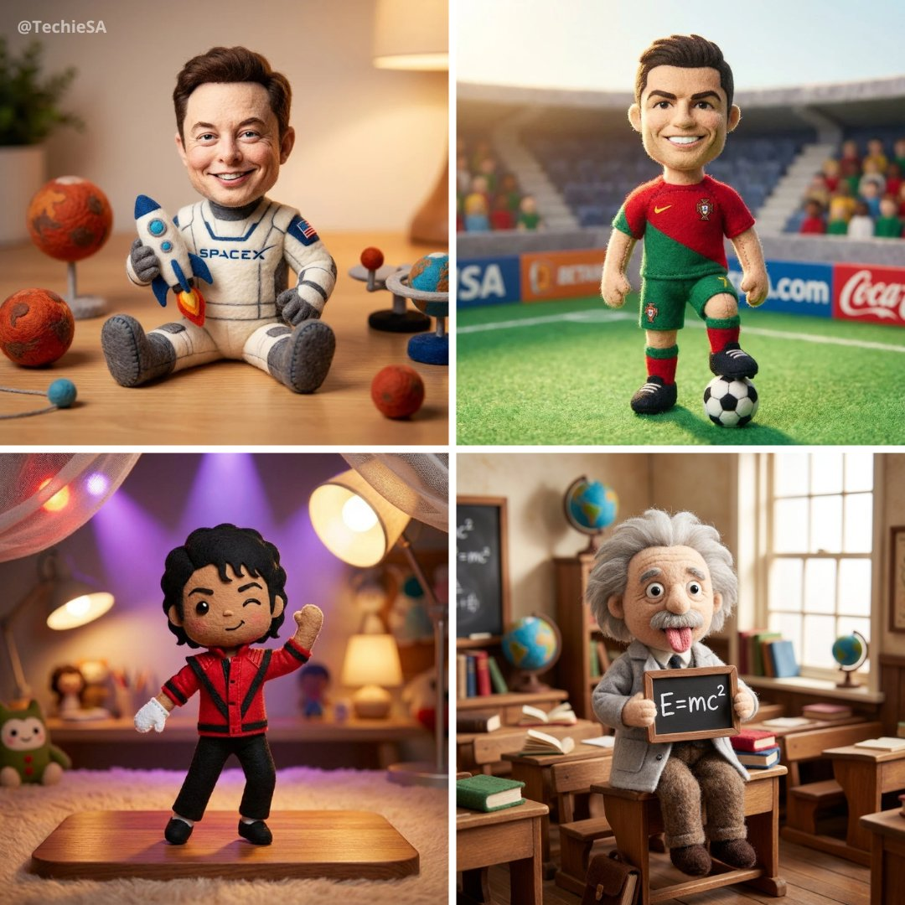
</div>

**提示词：**
```
Full body [SUBJECT] toy, [ATTRIBUTES/ACCESSORIES], [EXPRESSION], made of felt, in a [PLACE], [LIGHTING], friendly and cartoonish appearance, rich and soft textures.
```

**中文提示词：**
```
全身[主题]玩具，[属性/配件]，[表情]，毛毡材质，在[地点]，[灯光]中，友好卡通的外观，丰富柔软的质感。
```

<a id="prompt-696"></a>
## 案例 696：日系少女赶地铁 (来源 [@lxfater](https://x.com/lxfater/status/1995788532489638061)) 模型：Nano banana pro

<div style="display: flex; justify-content: space-between;">
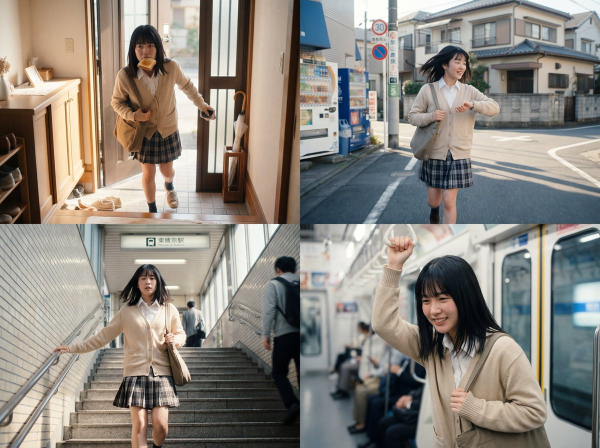
</div>

**中文提示词：**
```
Role（角色设定）
你是一位专精 日系青春电影 与 可爱少女日常写真 的顶级摄影导演。你擅长用电影分镜和细腻光影，捕捉女主从容又笨拙的小失误，营造出暖心、治愈、略带喜剧感的早晨通勤场景。
Task（任务目标）
根据以下描述，生成一张 4 格拼接构图（Four-panel composition，2x2 网格：上左、上右、下左、下右）。
必须保持同一位日系少女形象在四格中 面孔与特征 100% 一致：黑色或深棕色齐肩直发、空气刘海、淡妆、身材偏纤细。
她的穿着为 日系少女通勤风：浅色针织开衫、白衬衫、格纹半身裙、帆布鞋，背一只简洁的单肩包或双肩包。

Visual Guidelines（视觉规范）
画面质感：cinematic, Japanese movie still, 8K, soft light, shallow depth of field, subtle film grain, natural skin texture。
色调：清晨暖色调，偏柔和的奶油色与浅蓝色，高光不过曝，整体偏 温柔、干净、可爱。
背景：日本城市住宅区与地铁站环境，干净街道、路牌、自动贩卖机、站牌等细节。

构图：2x2 网格布局（Upper-left, Upper-right, Lower-left, Lower-right），每一格都是一帧电影截图。

Panel Breakdown（四格分镜拆解）

上左（Upper-left）——【迟到的预感 / The Late Morning】

视角（Camera Angle）：室内门口处的中近景，略微高机位，好像观众站在玄关看她匆忙出门。

动作（Action）：她一边踩着鞋，一边抓起门边的包和手机，嘴里咬着一小块吐司或饭团，身体微微前倾准备冲出去。

表情（Expression）：困倦中带点慌张，眼睛微睁，眉毛略上挑，带着“糟了要迟到”的可爱慌乱。
重点（Focus）：清晨从门外洒进来的暖阳勾勒出她的轮廓，玄关处杂乱但温馨的小物（鞋架、雨伞、地垫）虚焦，突出少女的慌忙瞬间。

上右（Upper-right）——【街角小跑 / Corner Dash】

视角（Camera Angle）：略低机位的侧面全身景，仿佛跟拍镜头，背景是安静街区与十字路口。

动作（Action）：她背着包小跑，裙摆和头发随风轻轻扬起，一只手按着包带防止晃动，另一只手看腕表或手机时间。

表情（Expression）：有点紧张又带点好笑的无奈，嘴角微微撅起，眼神专注前方。

重点（Focus）：路边的自动贩卖机、路牌、低饱和的街景在运动模糊中掠过，地面晨光与她的影子形成斜斜的引导线，强化“赶时间”的节奏感。

左下（Lower-left）——【楼梯冲刺 / Stair Sprint】

视角（Camera Angle）：从地铁站楼梯下方向上拍摄的低机位，仰视她奔上楼梯或往站台方向跑。

动作（Action）：她扶着扶手快速上楼梯，步伐轻快，裙摆随着动作轻轻摆动，包斜跨在身侧。

表情（Expression）：稍微喘气但坚持、认真的神情，眉头轻皱却不失可爱。

重点（Focus）：楼梯上的光影分明，顶端可见写有站名的牌子与一点点天空。背景路人略虚化，突出少女努力赶车的剪影，整体仍保持干净、清爽的画面感。

右下（Lower-right）——【刚好赶上 / Just in Time】

视角（Camera Angle）：地铁车厢内的中近景，略高机位，好像站在她对面看着她。窗外有轻微运动模糊的隧道景色。

动作（Action）：她站在车门附近，双手抓着包带或扶手，微微弯腰喘气，肩膀仍有一点起伏。

表情（Expression）：松了口气的可爱微笑，脸颊略微泛红，眼睛里有轻松和自我调侃的感觉，像是在心里说“总算没迟到”。

重点（Focus）：柔和的车厢灯光照在她的脸上，皮肤质感细腻自然。背景是朴素的车厢座位与几位乘客的模糊轮廓，营造温柔又日常的通勤氛围。

Technical Constraints（技术限制）

Consistency：四格中少女的脸部特征、发型、身材比例、服饰风格必须完全一致，确保是同一角色。

Style：hyper-realistic yet soft, cinematic, Japanese slice-of-life movie still, natural color grading, soft focus, bokeh。

Atmosphere：可爱、治愈、轻松、带一点小紧张但完全日常向，像青春爱情电影开头的通勤片头。
```

<a id="prompt-695"></a>
## 案例 695：3x3网格柔和的粉蓝色调摄影棚写真照 (来源 [@AIByAbbay](https://x.com/AIByAbbay/status/1995506422117728636)) 模型：Nano banana pro

<div style="display: flex; justify-content: space-between;">
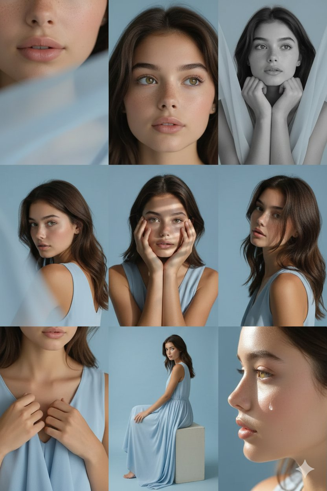
</div>

**提示词：**
```
Editorial 3x3 grid in soft pastel-blue studio. Character (face characteristics 100% same as uploaded image) wearing a light blue sleeveless dress. Shots follow original set: cheek/lip macro with blurred hand, reflective eye crop, B&W chin-rest portrait, fabric-framed over-shoulder, frontal light-band close-up, angled hair-fall portrait, hand-to-collarbone crop, seated half-body, profile droplet highlight. RAW, airy tones, smooth editorial finish.
```

**中文提示词：**
```
柔和的粉蓝色调摄影棚内，采用3x3网格构图进行拍摄。人物（面部特征与上传图片完全一致）身着浅蓝色无袖连衣裙。拍摄顺序如下：脸颊/嘴唇微距特写（手部虚化）、反光眼部特写、黑白下巴托举肖像、布框过肩特写、正面光带特写、斜角头发特写、手托锁骨特写、坐姿半身照、侧脸水滴高光。RAW格式，色调清新，后期处理柔和，适合杂志大片风格。
```

<a id="prompt-694"></a>
## 案例 694：色彩缤纷的Y2K剪贴簿海报 (来源 [@ShreyaYadav___](https://x.com/ShreyaYadav___/status/1995760655018942720)) 模型：Nano banana pro

<div style="display: flex; justify-content: space-between;">
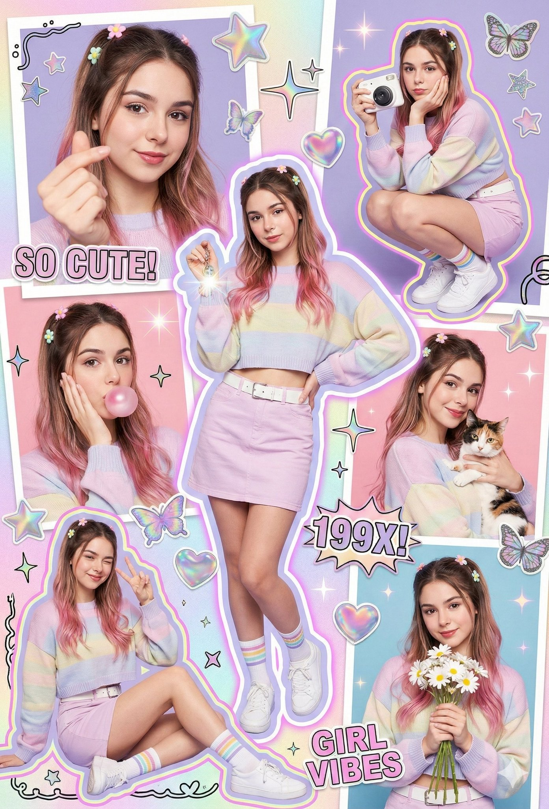
</div>

**提示词：**
```
facelock_identity": "true",
"accuracy": "100%",
scene"Colorful Y2K scrapbook poster aesthetic, vibrant stickers, multiple subjects wearing the same outfit and hairstyle with different poses and cutouts, colorful strokes and lines, frameless collage style. Includes: close-up shot with heart-shape fingers, full-body squatting pose supporting chin while holding a white polaroid camera, mid-shot touching cheek while blowing pink bubblegum, mid-shot smiling elegantly while holding a cat ,seated elegantly with one eye winking and peace sign, and mid-shot holding daisy flowers. Holographic textures, pastel gradients, glitter accents, playful doodles, magazine cut-out graphics, chaotic yet balanced layout, extremely artistic and visually engaging",
main_subject": {
"description": "A young Y2K-styled woman as the main focus in the center of the scrapbook collage.",
"style_pose": "Playful and confident Y2K pose — slight side hip pop, one hand holding a lens-flare keychain, face toward the camera with a cute-cool expression, slight pout, candid early-2000s photo vibe."
outfit": {
"top": "Cropped oversized sweater in pastel color with embroidered patches",
"bottom": "pastel skirt with a white belt",
"socks": "White ankle socks with colorful pastel stripes",
"shoes": "white sneakers",
"accessories": [
"Colorful plastic bracelets",
"Chunky colorful rings",
"Sparkling belly chain",
"hairstyle": 
"type": "Y2K half-up half-down",
"details": "Pastel flowers clips,thin front tendrils, wavy dark brown hair with bubblegum-pink tint on the lower strands, iconic early-2000s look."
additional_visuals": 
"Heart, star, and butterfly stickers",
"Retro sparkles",
"Polaroid frames",
"Neon outlines",
"Doodle borders",
"Magazine cutout texts: 'SO CUTE!', '199X!', 'GIRL VIBES'",
"Pastel lighting",
"Glossy dreamy retro glow",
"Ultra-aesthetic scrapbook layout"
photography_rendering": {
"color_grading": "Cinematic neon Y2K",
"lighting": "Soft flash lighting","skin_texture": "Smooth glossy finish",
"rendering": "High-detail hyperrealistic Y2K scrapbook tone",
"quality": "8K",
"composition": "Perfectly balanced and artistic"
negative_prompt": "no realism that breaks Y2K aesthetic, no modern 2020s clothing, no messy composition, no blurry face, no distorted hands, no extra limbs, no face warping, no low resolution, no grain, no muted colors, no watermark, no AI artifacts"
```

**中文提示词：**
```
facelock_identity："true",
“准确率”： “100%”，
场景：“色彩缤纷的Y2K剪贴簿海报美学，鲜艳的贴纸，多个人物穿着相同的服装和发型，摆出不同的姿势，并配以剪纸，色彩斑斓的笔触和线条，无框拼贴风格。包含：手指比出心形的特写镜头，全身蹲姿托腮手持白色拍立得相机，中景吹着粉色泡泡糖抚摸脸颊，中景抱着猫优雅微笑，优雅地坐着眨着一只眼睛比出和平手势，以及手持雏菊的中景。全息纹理、柔和的渐变色、闪光点缀、趣味涂鸦、杂志剪贴图案，布局看似混乱却又平衡，极具艺术性和视觉吸引力。”
主主题：{
“描述”：“一位年轻的千禧年风格女性，是剪贴簿拼贴画的中心焦点。”
"style_pose": "俏皮自信的Y2K姿势——微微侧身扭胯，一只手拿着镜头光晕钥匙扣，脸朝向镜头，表情可爱又酷，微微嘟嘴，散发出2000年代初期的抓拍氛围。"
全套服装”： {
上衣：浅色短款宽松毛衣，带有刺绣贴片。
“下装”：“粉色裙子配白色腰带”，
“袜子”：“白色短袜，带有彩色粉彩条纹”，
“鞋子”：“白色运动鞋”，
“配件”： [
“彩色塑料手镯”
“厚重的彩色戒指”，
“闪亮的肚链”
“发型”：
"type": "Y2K 半上半下",
“细节”：“粉彩花朵发夹，前额的细碎发丝，深棕色波浪卷发，发梢带有泡泡糖粉色，2000 年代初期的标志性造型。”
additional_visuals：
“心形、星星和蝴蝶贴纸”
“复古闪光”，
“宝丽来相框”，
“霓虹轮廓”，
“涂鸦边框”
“杂志剪报上的文字：‘太可爱了！’、‘199X！’、‘少女心’”
“柔和的灯光”，
“光泽梦幻的复古光芒”，
“超美剪贴簿布局”
摄影渲染：{
"color_grading": "电影霓虹 Y2K"
“lighting”: “柔和闪光灯照明”,“skin_texture”: “光滑光泽表面”,
“渲染”：“高细节超写实Y2K剪贴簿色调”，
“质量”: “8K”
“构图”：“完美平衡且富有艺术性”
negative_prompt": "不追求打破 Y2K 美学的写实效果，不穿 2020 年代的现代服装，不做凌乱的构图，不模糊的脸，不扭曲的手，不添加额外的肢体，不扭曲脸部，不降低分辨率，不添加颗粒感，不降低色彩饱和度，不添加水印，不添加 AI 伪影"
```

<a id="prompt-693"></a>
## 案例 693：写实照片定格JOJO风格 (来源 [@AI_GIRL_DESIGN](https://x.com/AI_GIRL_DESIGN/status/1994374306327847341)) 模型：Nano banana pro

<div style="display: flex; justify-content: space-between;">
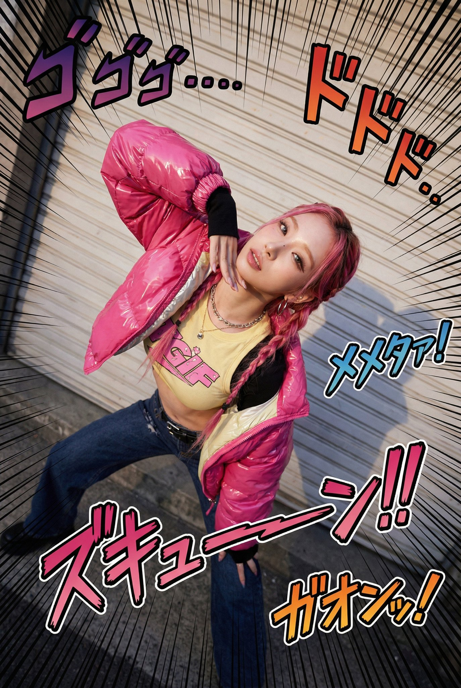
</div>

**提示词：**
```
Use the uploaded photo as the base.

Keep the person’s **face, eyes, hairstyle, makeup, outfit, and overall identity** clearly recognizable and photorealistic.
Do NOT turn the whole image into a drawing.
Do NOT replace or redraw the background; only transform the perspective as needed.

===================================================
TRANSFORM THE POSE — EXTREME “JOJO-STYLE” POSES
===================================================
Repose the body into a **randomized, exaggerated JoJo-style pose**, pushing the limits of human flexibility:
- extreme torso twist, strong contrapposto
- head tilt with dramatic confidence
- one hand framing the face, one arm extended or arched
- bold leg positions (crossed, wide stance, pointed toes)

The pose must be:
- anatomically plausible but exaggerated like JoJo
- stylish, flamboyant, theatrical

Maintain realistic lighting and natural cloth deformation.

===================================================
APPLY EXTREME CAMERA ANGLES (RANDOM EACH TIME)
===================================================
Transform the camera viewpoint to create striking JoJo-style drama:
Choose **one random angle** from the following list for each generation:

- **Ultra low-angle (“仰ぎ見”) shot**: camera near the ground looking upward
- **Ultra high-angle (“見下ろし”) shot**: camera directly above looking down
- **Dynamic wide-angle (20–24mm)**: strong perspective distortion
- **Super wide-angle (14mm)** for extreme depth & stretched limbs
- **Fisheye lens effect** with curved perspective lines
- **Dutch-angle (tilted horizon)** for manga-like tension
- **Close-up with forced perspective**: large foreground hand reaching toward the camera
- **Long-lens compression (85–135mm)** but still JoJo dramatic

Rules:
- The face must remain recognizable and photorealistic in the new angle.
- The background may be warped to match the new perspective, but must remain the same scene.
- No cartoon effects on the person themselves.

===================================================
ADD MANGA-STYLE SFX (JOJO ONOMATOPEIA)
===================================================
Add dramatic Japanese SFX in bold black-and-white ink lines:
- 「ゴゴゴゴゴ…」
- 「ドドドドド…」
- 「ズキューーーン！」
- 「バァーーーン！！」
- 「メメタァ！」
- 「ガオンッ！」

Place them:
- floating behind the person
- along the sides of the pose
- integrated with the new camera angle perspective
Do NOT cover the person’s face.

===================================================
OPTIONAL MANGA LINES
===================================================
Add subtle JoJo-style:
- speed lines
- radiating impact lines
- perspective shock lines

But keep the original background visible through them.

===================================================
FINAL GOAL
===================================================
Create a realistic photo where:
- the person remains fully recognizable,
- their body is transformed into a bold, dramatic JoJo-style pose,
- the camera angle is extreme and cinematic (low-angle, high-angle, fisheye, wide-angle, etc.),
- powerful manga SFX surround them in true JoJo fashion.

The image should feel like a **JoJo splash page happening inside a real photograph**.
```

<a id="prompt-692"></a>
## 案例 692：棕色长发的年轻女子自拍照 (来源 [@ShreyaYadav___](https://x.com/ShreyaYadav___/status/1995705447051837723)) 模型：Nano banana pro

<div style="display: flex; justify-content: space-between;">
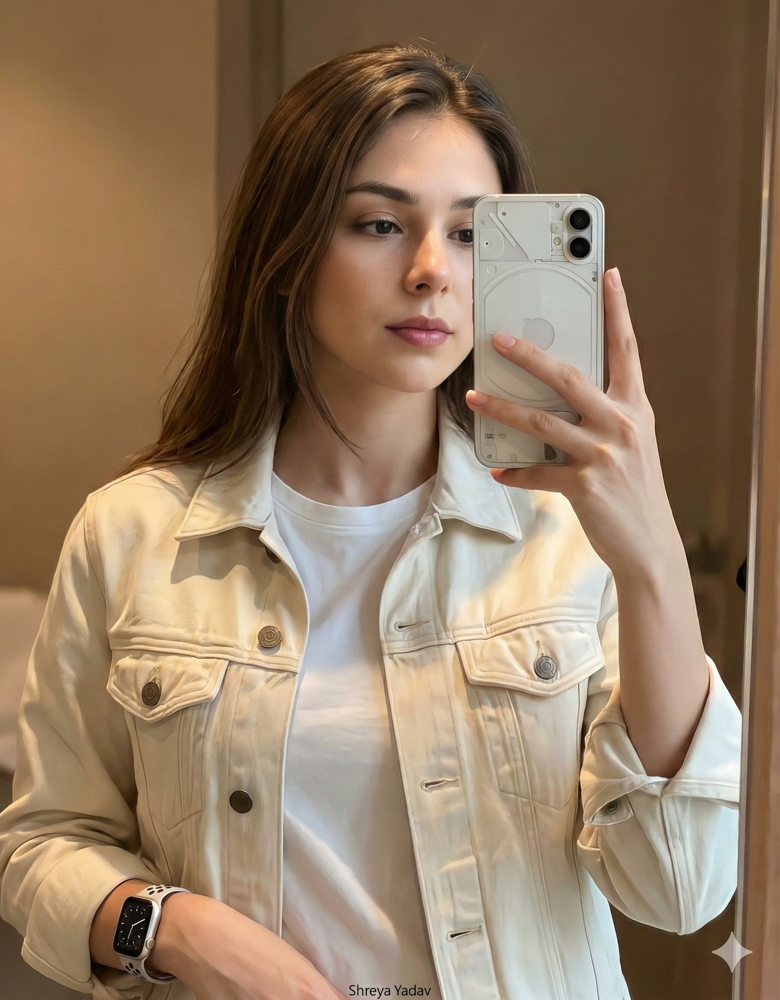
</div>

**提示词：**
```
{
  "type": "image_generation",
  "subject": {
    "reference": "Use uploaded photo for 100% face and body consistency",
    "description": "Young woman with long brown hair",
    "attire": {
      "outerwear": "Cream/off-white denim jacket",
      "innerwear": "White t-shirt",
      "accessories": "Apple digital watch on wrist"
    }
  },
  "pose": {
    "action": "Taking a mirror selfie",
    "framing": "Close-up portrait"
  },
  "props": {
    "phone_model": "White Nothing Phone (2)",
    "phone_details": "Distinctive transparent back design visible"
  },
  "environment": {
    "lighting": "Soft and warm",
    "background": "Blurred indoor context"
  },
  "style": {
    "aesthetic": "Ultrarealistic, high-detail, 8k resolution",
    "medium": "Photography"
  },
  "text_overlay": {
    "content": "Shreya Yadav",
    "placement": "Signature style"
  }
}
```

**中文提示词：**
```
{
"type": "image_generation",
“主题”： {
“参考照片”：“请使用上传的照片以确保面部和身体100%一致”。
描述：一位有着棕色长发的年轻女子，
着装：{
“外套”：“米白色牛仔夹克”，
“内衣”：“白色T恤”，
配件：手腕上的苹果数字手表
}
},
"姿势": {
“动作”：“拍镜子自拍”，
“构图”: “特写肖像”
},
"props": {
"phone_model": "White Nothing Phone (2)" ,
"phone_details": "独特的透明后盖设计清晰可见"
},
“环境”： {
“灯光”：“柔和温暖”，
“背景”：“模糊的室内环境”
},
“风格”： {
“美学”：“超逼真、高细节、8K分辨率”
“媒介”: “摄影”
},
"text_overlay": {
内容：Shreya Yadav，
“位置”: “签名风格”
}
}
```

<a id="prompt-691"></a>
## 案例 691：用英文日文标注所有物品 (来源 [@ytiskw](https://x.com/ytiskw/status/1995730583373197440)) 模型：Nano banana pro

<div style="display: flex; justify-content: space-between;">
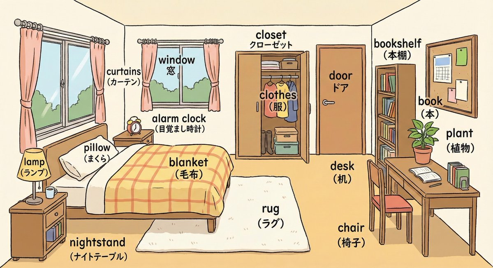
</div>

**中文提示词：**
```
请画一幅卧室的插图。用英文/日文标注所有物品。请按以下格式书写：英文（日文）。
```

<a id="prompt-690"></a>
## 案例 690：双语认知大发现-海底世界 (来源 [@nuannuan_share](https://x.com/nuannuan_share/status/1995761102295384483)) 模型：Nano banana pro

<div style="display: flex; justify-content: space-between;">
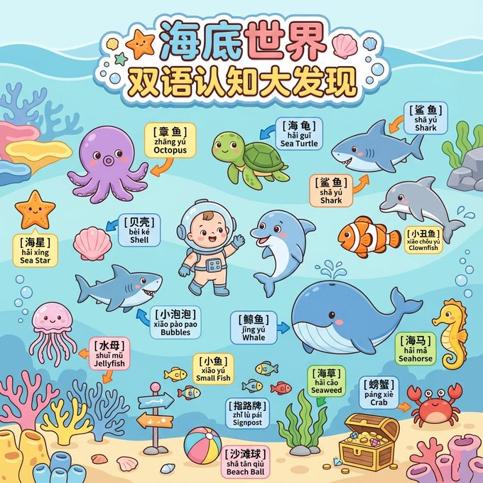
</div>

**中文提示词：**
```
[SCENE_THEME] = 海底世界
[TARGET_AGE] = 2–5 岁

生成一张可出版级的儿童认知「扁平 Q 版卡通」海底世界全景长图（Vertical A4 Panoramic Flat Cute Cartoon）。整体画风：粗线条、圆润造型、亮丽但柔和的色彩、无尖角安全风格、大块形状、高对比度、适合幼儿认知的简化卡通图形。画面要求干净、清晰、有逻辑，物体边界明显。分辨率为超清 8K。

# 一、标题区（Top Banner）
顶部加入大标题：《海底世界 双语认知大发现》。
字体为：超大号圆润卡通字体（饱满、彩色、柔影）。
两侧加入可爱的卡通海洋小图标（迷你海星、小贝壳、小水泡）。

# 二、主体场景（Main Panorama）
构图：超宽扁平卡通海底场景。前景与中景尽量清晰，不使用复杂景深；保持简单、干净的儿童友好式分区。整体像一幅“海底乐园地图”。

元素要求：
- 所有海洋生物为大头 Q 版卡通
- 线条粗、边缘柔和
- 色彩鲜明、对比明确
- 结构简单，便于儿童识别形状

加入 1–2 位引导角色（Q版潜水宝宝 / 小海豚伙伴），用夸张动作引导视线。

# 三、认知物体清单（Core Objects）
所有物体要求：圆润、扁平、卡通、大块面、易识别。

【核心大件（5–8 个）】
章鱼  
海龟  
鲨鱼  
海豚  
小丑鱼  
鲸鱼  
海马  
螃蟹

【中小件物体（8–12 个）】
海星  
贝壳  
水母  
珊瑚  
小泡泡群  
小鱼（多色）  
海草  
沙滩球  
宝箱  
海底指路牌

【环境元素（不限量）】
简化海浪、扁平珊瑚群、浅色海底沙土、贝壳碎片、水泡轨迹、Q版岩石。

# 四、双语标签系统（Bilingual Labeling System）
为所有主要认知对象添加三行标签牌（扁平圆角矩形、软色背景、简洁卡通风）。

格式固定：
第一行：中文（超粗圆体）
第二行：带声调拼音
第三行：英文（圆润无衬线）

示例：
[ 章 鱼 ]
[ zhāng yú ]
[ Octopus ]

标签颜色：浅奶黄或浅蓝  
字体：清晰、粗、易读  
标签放置在物体附近空白区。

# 五、指示箭头（Flat Cute Arrow）
使用扁平卡通风格箭头：
- 粗线条、圆头  
- 颜色醒目（橙 / 蓝）  
- 一端连接标签，一端贴近物体边界  
- 禁止箭头交叉，保持整体整洁有序。

# 六、风格收束（统一输出）
Flat Cute Cartoon Style；
Bright & Soft Color Palette；
Round Shapes & Child-safe Edges；
Clean Separation of Elements；
Bilingual Labels + Clear Arrows；
8K Ultra HD；
Simple, Fun, Easy-to-read Composition。
```

<a id="prompt-689"></a>
## 案例 689：双语认知大发现-交通工具 (来源 [@nuannuan_share](https://x.com/nuannuan_share/status/1995761102295384483)) 模型：Nano banana pro

<div style="display: flex; justify-content: space-between;">
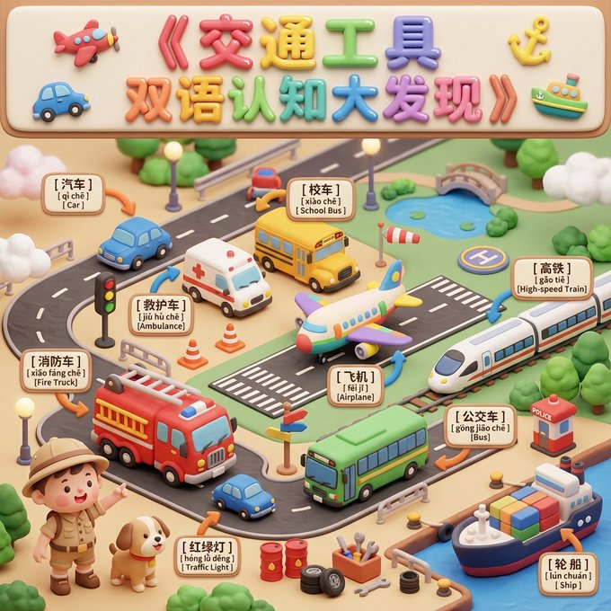
</div>

**中文提示词：**
```
[SCENE_THEME] = 交通工具
[TARGET_AGE] = 2–5 岁

生成一张可出版级的儿童认知「黏土沙盘全景长图」（Vertical A4 Panoramic Claymation Diorama）。画面风格：软萌黏土 3D、圆润、安全、马卡龙+莫兰迪色、大量柔光与体积光、统一材质、8K Ultra HD、Cinema 4D 可爱渲染。

# 一、标题区（Top Banner）
在最顶部加入大标题：《交通工具 双语认知大发现》。
使用超大号圆滚滚黏土气球字（彩色+高光）。两侧放置可爱的小型交通工具黏土浮雕（迷你飞机、迷你汽车、迷你船锚等）。

# 二、主体场景（Main Diorama）
构图：Wide-angle 微缩沙盘视角。前景与中景保持全焦清晰；背景轻度虚化；按“分组布局 + 留白呼吸感”摆放。

场景风格：像一个大型“交通工具乐园玩具沙盘”，地面有道路、滑轨、机场跑道、小型港口等。

加入 1–2 位引导角色（探险宝宝 / 黏土小狗 / 迷你机器人），做出指路和兴奋的动作，引导孩子探索车辆。

# 三、认知物体清单（Core Objects）
所有物体必须圆润、无尖角、黏土质感。

【核心大件（5–8 个）】
请放在主要区域：
小汽车  
救护车  
校车  
消防车  
飞机  
高铁  
公交车  
轮船

【中小件物体（8–12 个）】
散点式围绕大件摆放：
红绿灯  
交通锥  
方向牌  
道路栏杆  
油桶  
小轮胎  
小螺丝工具  
交通岗亭  
风向标  
小停机坪标志

【环境元素（不限量）】
柔软黏土道路  
圆滚滚路灯柱  
棉花糖云朵  
黏土树丛  
小湖泊  
小桥  
迷你机场跑道条纹

# 四、双语标签系统（Bilingual Labeling System）
为所有需要认知的交通工具加入三行软胶标签牌（圆角、厚边、轻浮雕），背景奶白或浅黄。

格式固定：
第一行：中文（超粗圆体）
第二行：带声调拼音
第三行：英文（圆润无衬线）

示例：
[ 汽 车 ]
[ qì chē ]
[ Car ]

# 五、精准箭头（3D Clay Arrow）
使用粗壮圆润的 3D 黏土箭头（橙黄或粉蓝）。一端贴标签牌，一端精准指向对应车辆。禁止箭头交叉。标签牌放在物体最近的空白区，确保画面清晰有序。

# 六、风格收束（统一模型输出）
Wide Panoramic Claymation Diorama；
Soft Pastel Colors；
Round & Child-safe Edges；
Rich but Organized Composition；
Precise Clay Arrows + Bilingual Labels；
8K Ultra HD；
Soft Volumetric Lighting；
Cinema 4D cute render style
```

<a id="prompt-688"></a>
## 案例 688：一位魅力四射的女性超逼真8K肖像 (来源 [@xmliisu](https://x.com/xmliisu/status/1995762747527626900)) 模型：Nano banana pro

<div style="display: flex; justify-content: space-between;">
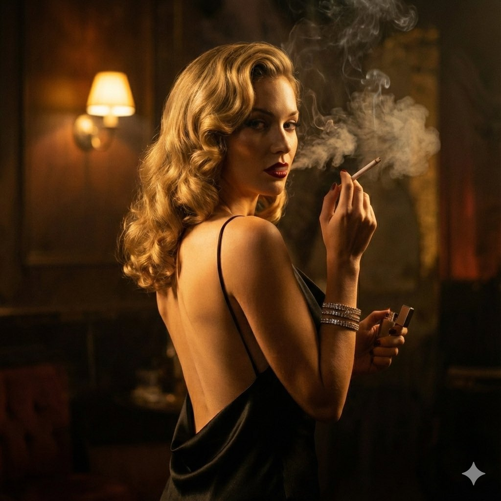
</div>

**提示词：**
```
{
  "prompt_structure": {
    "subject": {
      "archetype": "Glamorous woman",
      "facial_reference": "Use uploaded image features",
      "pose": "Three-quarter profile, body angled toward camera, arm lifted elegantly near face",
      "action": "Holding a cigarette between fingers, holding a small metallic lighter in the other hand",
      "expression_and_mood": "Sultry, confident, seductive, intimate"
    },
    "styling": {
      "hair": "Voluminous golden-blonde retro waves, sculpted 1950s pin-up bangs, soft curls framing face",
      "wardrobe": "Black satin backless dress, ultra-thin side straps, dramatic open silhouette revealing waist and hips",
      "accessories": "Large stacked silver rhinestone bracelets, small metallic lighter",
      "texture_notes": "Silky satin texture, sparkling rhinestones, glossy lips"
    },
    "composition": {
      "setting": "Old Hollywood nightlife, smoky vintage-noir atmosphere",
      "lighting": "Warm, dramatic, low-key, deep shadows, golden highlights on cheekbones",
      "framing": "Tight portrait framing"
    },
    "technical_specs": {
      "resolution": "8k ultra-high-resolution",
      "visual_style": "Hyper-realistic, cinematic, polished",
      "camera_effects": "Shallow depth of field, soft film-grain texture"
    }
  },
  "final_prompt_string": "Hyper-realistic 8k portrait of a glamorous woman with [uploaded facial features], vintage-noir style. She stands in three-quarter profile, sultry and confident, wearing a black satin backless dress with ultra-thin side straps revealing her waist. Hair styled in voluminous golden-blonde 1950s retro waves and pin-up bangs. She holds a cigarette elegantly near her face, wearing stacked silver rhinestone bracelets. Warm, dramatic low-key lighting with deep shadows and golden highlights. Smoky, intimate old Hollywood nightlife atmosphere. Shot on ultra-high-resolution camera, shallow depth of field, soft film-grain texture."
}
```

**中文提示词：**
```
{
"prompt_structure": {
“主题”： {
“原型”：“魅力女性”，
"facial_reference": "使用上传的图像特征",
“姿势”：“四分之三侧面像，身体朝向镜头，手臂优雅地抬起靠近脸部”，
“动作”：“手指间夹着一支香烟，另一只手拿着一个小型金属打火机”，
"expression_and_mood": "性感、自信、诱人、亲密"
},
"样式": {
“头发”：“蓬松的金色复古波浪卷发，精心修剪的 1950 年代复古刘海，柔和的卷发修饰脸型”，
“衣橱”： “黑色缎面露背连衣裙，超细侧带，夸张的露背设计，展现腰臀曲线”
“配饰”：“大型叠戴银色水钻手镯，小型金属打火机”，
"texture_notes": "丝滑缎面质感，闪亮水钻，亮泽双唇"
},
“作品”： {
“场景”：“老好莱坞的夜生活，烟雾缭绕的复古黑色氛围”，
“灯光”：“温暖、戏剧化、低调，深邃的阴影，颧骨上的金色高光”，
“构图”： “紧凑型人像构图”
},
"technical_specs": {
“分辨率”: “8K 超高分辨率”
"视觉风格": "超写实、电影化、精致"
“相机效果”： “浅景深，柔和的胶片颗粒纹理”
}
},
"final_prompt_string": "一张超逼真的8K肖像，展现了一位魅力四射的女性，拥有[上传的面部特征]，风格复古而神秘。她以四分之三侧面示人，性感而自信，身着黑色缎面露背礼服，纤细的侧边绑带勾勒出纤细的腰身。头发蓬松，呈20世纪50年代复古的金色波浪卷发，并配以复古的刘海。她优雅地将香烟夹在脸旁，手腕上戴着层叠的银色水钻手镯。温暖而富有戏剧性的低调光线，深邃的阴影和金色的高光交相辉映，营造出烟雾缭绕、私密而迷人的老好莱坞夜生活氛围。采用超高分辨率相机拍摄，浅景深，呈现柔和的胶片颗粒质感。"
}
```

<a id="prompt-687"></a>
## 案例 687：生成一张指定时间地点的逼真照片 (来源 [@minchoi](https://x.com/minchoi/status/1995707916649640404)) 模型：Nano banana pro

<div style="display: flex; justify-content: space-between;">
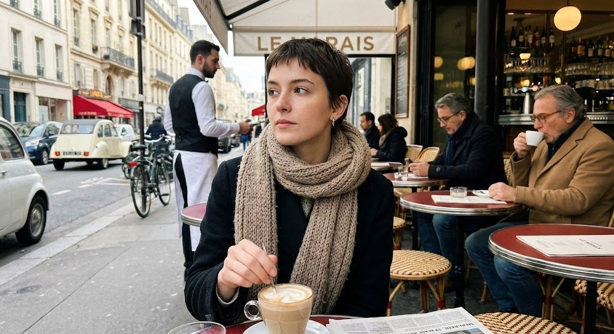
</div>

**提示词：**
```
Generate a photorealistic image of a cafe terrace in the Marais district of Paris on a Wednesday morning in March 2025. It is a crisp, cool spring morning with clear skies. Locals are drinking coffee. In sharp focus should be a young woman with a pixie cut wearing a scarf, stirring a cappuccino and looking thoughtfully to the side; the waiter and street traffic behind her are blurred. The photo should have the candid, natural morning light feel of an iPhone image.
```

**中文提示词：**
```
请生成一张逼真的照片，展现2025年3月某个星期三早晨巴黎玛莱区一家咖啡馆的露台。这是一个清爽凉爽的春日早晨，天空晴朗。当地人正在喝咖啡。照片中应清晰地呈现一位留着精灵短发、围着围巾的年轻女子，她正在搅拌一杯卡布奇诺，若有所思地看向一旁；她身后的服务员和街上的车辆则应虚化。照片应呈现出类似iPhone拍摄的自然晨光感。
```

<a id="prompt-686"></a>
## 案例 686：中国每个城市标志性美食 (来源 [@songguoxiansen](https://x.com/songguoxiansen/status/1995863480570970582)) 模型：Nano banana pro

<div style="display: flex; justify-content: space-between;">

</div>

**中文提示词：**
```
制作一张包含台湾的中国地图，每个省市都用该省市最著名的食物来构成（各省市看起来应该像是由食物组成的，而不是食物的图片）。仔细检查，确保每个省市都正确无误。
```

<a id="prompt-685"></a>
## 案例 685：3x3的网格特写照片 (来源 [@so_ainsight](https://x.com/so_ainsight/status/1995494784803426326)) 模型：Nano banana pro

<div style="display: flex; justify-content: space-between;">
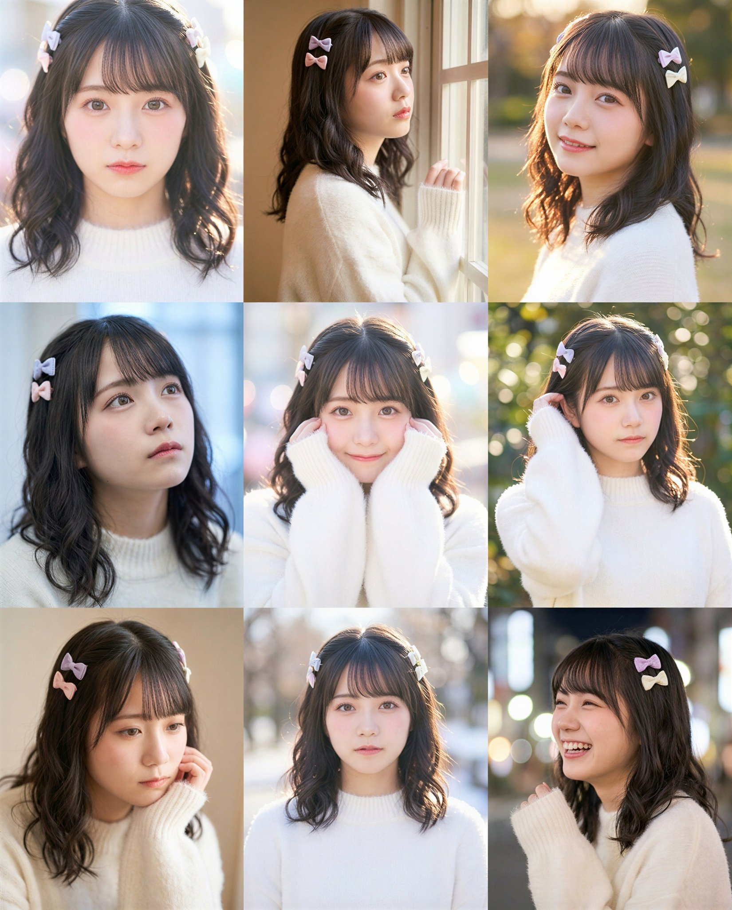
</div>

**中文提示词：**
```
使用这张女性照片，生成共 9 张图像，排列成 3x3 的网格。生成的图像数量不得超过 9 张。

所有照片必须为半身像或更近的特写（半身像、特写、肖像构图）。请勿拍摄广角照片、全身照、远景照片或广角照片。

请确保所有九张照片中女性的外貌、五官、发型和整体氛围保持一致。但是，只要不超出半身像构图的范畴，您可以更改拍摄地点、光线、角度和构图。

请仅输出3x3网格所需的9张图片。不要生成任何其他图片、预览图或差异化版本。
```

<a id="prompt-684"></a>
## 案例 684：哥特式电影风格的肖像画 (来源 [@YaseenK7212](https://x.com/YaseenK7212/status/1995536194327777287)) 模型：Nano banana pro

<div style="display: flex; justify-content: space-between;">
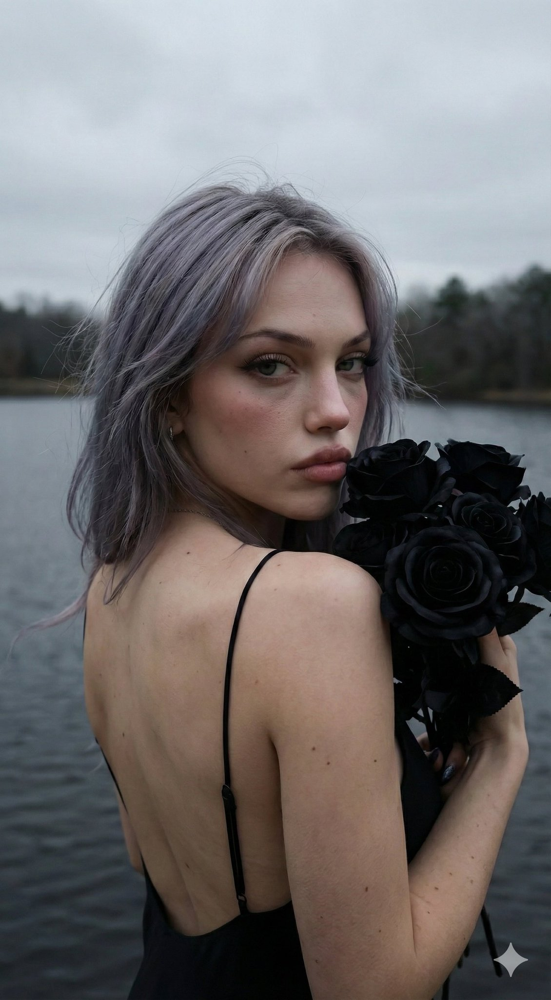
</div>

**提示词：**
```
{
  "image_request": {
    "goal": "Create a cinematic portrait based on the provided reference photo, preserving the subject’s face exactly as it appears in the reference (no alterations to facial structure, proportions, features, or expression).",
    "subject": {
      "identity_preservation": {
        "description": "The face must remain completely unchanged from the reference photo — 1000% identical in all visible facial details, proportions, contours, expression, and micro-features.",
        "notes": "No stylization, morphing, or reinterpretation of the facial structure. Only the scene, pose, and atmosphere change."
      },
      "pose": {
        "body_position": "The woman is standing with her back to the camera.",
        "head_turn": "She turns her head over her shoulder, looking toward the viewer.",
        "gaze": "Soft, melancholic, and intense."
      },
      "appearance": {
        "skin": "Smooth, pale skin with gentle cinematic texture.",
        "hair": {
          "style": "Long, straight hair.",
          "movement": "Slightly tousled by the wind."
        },
        "clothing": {
          "top": "Black backless top with delicate thin straps draping down the back."
        },
        "props": {
          "bouquet": "A bouquet of black roses held close to her face."
        }
      }
    },
    "environment": {
      "setting": "A moody lakeside or riverside.",
      "weather": "Overcast grey skies.",
      "atmosphere": "Soft, misty, melancholic, and subtly gothic."
    },
    "lighting": {
      "type": "soft diffuse lighting",
      "source": "natural overcast daylight",
      "tone": "desaturated, muted highlights",
      "mood": "gothic, melancholic, cinematic",
      "shadow_quality": "soft, low-contrast shadows"
    },
    "color_grading": {
      "palette": "desaturated neutrals, soft greys, washed-out cool tones",
      "mood": "cinematic and atmospheric"
    },
    "composition": {
      "framing": "Cinematic shoulder-turned portrait with focus on the face and roses.",
      "depth": "Shallow depth of field; background slightly blurred.",
      "emphasis": "Emotional intensity in the eyes; contrast between pale skin and black roses/top."
    },
    "style": {
      "visual_style": "cinematic realism",
      "tone": "moody, atmospheric",
      "genre_influence": "dark romantic, gothic melancholy"
    }
  }
}
```

**中文提示词：**
```
{
"image_request": {
“目标”：“根据提供的参考照片创作一幅电影风格的肖像画，完全保留照片中人物的面部特征（不得改变面部结构、比例、五官或表情）。”
“主题”： {
"identity_preservation": {
“描述”：“面部必须与参考照片完全一致——所有可见的面部细节、比例、轮廓、表情和微特征都必须1000%相同。”
备注：“面部结构未进行任何风格化、变形或重新诠释。仅场景、姿势和氛围有所改变。”
},
"姿势": {
“body_position”: “该女子背对着镜头站立。”
“head_turn”：她转过头，看向观众。
“凝视”：“柔和、忧郁而强烈。”
},
“外貌”： {
“肌肤”：“光滑、白皙的肌肤，具有柔和的电影质感。”
“头发”： {
“发型”：“长直发。”
“动感”：“被风轻轻吹乱。”
},
“衣服”： {
“上衣”：“黑色露背上衣，背部有纤细的吊带垂下。”
},
"props": {
“花束”：“她将一束黑玫瑰捧在脸旁。”
}
}
},
“环境”： {
“场景”：“一个阴郁的湖边或河边。”
天气：阴天，天空灰蒙蒙的。
“氛围”：“柔和、朦胧、忧郁，略带哥特式风格。”
},
“灯光”： {
“类型”：“柔和漫射光”，
“来源”：“自然阴天日光”，
“色调”：“去饱和、柔和的高光”，
“氛围”：“哥特式、忧郁、电影感”，
"shadow_quality": "柔和、低对比度的阴影"
},
"color_grading": {
“调色板”：“低饱和度的中性色、柔和的灰色、褪色的冷色调”，
“氛围”：“电影感十足，富有氛围感”
},
“作品”： {
“构图”：“电影般的侧脸肖像，焦点集中在脸部和玫瑰花上。”
“景深”：“浅景深；背景略微模糊。”
“强调”：“眼神中流露出的情感强度；苍白的皮肤与黑色玫瑰/上衣形成对比。”
},
“风格”： {
"视觉风格": "电影写实主义",
“基调”：“忧郁的，有氛围的”，
"genre_influence": "黑暗浪漫主义，哥特式忧郁"
}
}
}
```

<a id="prompt-683"></a>
## 案例 683：花园里的婚纱照 (来源 [@miilesus](https://x.com/miilesus/status/1995536025859354724)) 模型：Nano banana pro

<div style="display: flex; justify-content: space-between;">
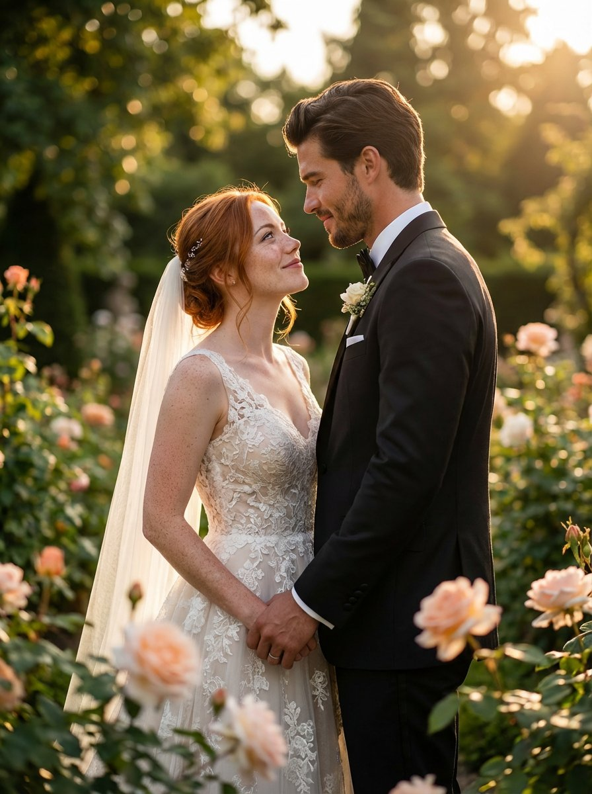
</div>

**提示词：**
```
{
 "Use [man_face] and [woman_fac]. Ultra-realistic high-end luxury wedding photography of a bride and groom standing closely together in an elegant outdoor ceremony setting. Golden hour sunlight casting warm soft highlights, natural rim light around their silhouettes, cinematic dynamic range. The bride wearing a premium handcrafted lace wedding gown with intricate embroidery details, soft flowing veil illuminated by backlight, subtle pearl accessories, refined natural bridal makeup with luminous skin texture, finely detailed eyelashes and catchlights in eyes. The groom wearing a tailored black tuxedo with satin lapels, crisp white shirt, luxury bow tie, polished boutonniere. Both posing in a candid yet editorial fashion – gentle eye contact, soft romantic smile, hands touching gracefully. Background featuring a softly blurred bokeh garden with roses, organic greenery, warm tones, shallow depth of field created by an 85mm f/1.4 full-frame lens. High-definition textures, ultra sharp facial details, realistic pores, true-to-life skin tones, natural hair strands, perfect color grading inspired by premium wedding photographers. Soft pastel color palette, creamy highlights, subtle film grain, magazine cover aesthetic. Cinematic global illumination, perfect exposure balance, no distortion, no artifacts. Award-winning photography style with fine-art wedding composition, dramatic yet soft lighting, museum-quality detail clarity.",
  
  "negative_prompt": "cartoon, illustration, painting, CGI, artificial look, uncanny valley, distorted facial features, extra limbs, deformed body parts, mismatched eyes, unnatural skin texture, plastic skin, blur, noise, pixelation, low resolution, oversaturated colors, washed out colors, hard flash, harsh shadows, blown highlights, low contrast, lens distortion, fisheye, bad anatomy, extra fingers, incorrect hand shapes, watermark, text, logo, border, frame, compression artifacts, glitch, unrealistic proportions, double face, duplicate subjects, warped background",

  "camera_settings": {
    "lens": "85mm f/1.4 prime",
    "iso": 100,
    "shutter_speed": "1/400",
    "aperture": "f/1.4",
    "white_balance": "5200K daylight"
  },

  "style": {
    "lighting": "soft natural golden hour, cinematic rim light, high dynamic range",
    "color_grade": "premium wedding film look, pastel tones, creamy highlights, warm undertones",
    "atmosphere": "romantic, elegant, fine-art editorial"
  },

  "composition": {
    "framing": "mid-shot portrait, slight angle, bride and groom centered",
    "focus": "sharp eyes, smooth bokeh background",
    "depth_of_field": "shallow, subject separation emphasized"
  },

  "width": 1024,
  "height": 1536,
  "num_inference_steps": 36,
  "guidance_scale": 8.0,
  "seed": 12345
}
```

**中文提示词：**
```
{
使用[man_face]和[woman_fac]。超逼真的高端奢华婚礼摄影，展现新郎新娘在优雅的户外仪式场地中亲密依偎的画面。金色的阳光洒下温暖柔和的高光，自然的轮廓光勾勒出他们的身影，营造出电影般的动态范围。新娘身着高级手工蕾丝婚纱，精致的刺绣细节令人叹为观止，飘逸的头纱在逆光下熠熠生辉，搭配低调的珍珠配饰，精致自然的妆容展现出肌肤的光泽感，纤长的睫毛和闪亮的眼神光更添动人。新郎身着剪裁合身的黑色礼服，缎面翻领，搭配挺括的白色衬衫、奢华的领结和精致的胸花。两人以一种自然而又不失时尚感的姿态摆出姿势——温柔的眼神交流，浪漫的微笑，双手优雅地相触。背景是一片柔和虚化的花园，点缀着玫瑰、绿植和温暖的色调，85mm f/1.4全画幅镜头营造出浅景深效果。高清的纹理，极其清晰的面部细节，逼真的画面。毛孔清晰可见，肤色自然逼真，发丝纹理自然，色彩分级完美，灵感源自顶级婚礼摄影师。柔和的粉彩色调，奶油般的亮部，细腻的胶片颗粒，杂志封面般的质感。电影级的整体光照，完美的曝光平衡，无畸变，无瑕疵。屡获殊荣的摄影风格，融合艺术婚礼构图、戏剧性却又柔和的光线，以及博物馆级别的细节清晰度。

"negative_prompt": "卡通、插画、绘画、CGI、人工质感、恐怖谷效应、面部特征扭曲、多余肢体、身体部位畸形、眼睛不对称、皮肤纹理不自然、塑料皮肤、模糊、噪点、像素化、低分辨率、色彩过饱和、色彩褪色、强光、阴影过重、高光过曝、低对比度、镜头畸变、鱼眼效果、人体解剖结构错误、多余手指、手型错误、水印、文字、标志、边框、画框、压缩伪影、故障、比例失调、双面人、重复人物、背景扭曲",

"camera_settings": {
镜头：85mm f/1.4 定焦镜头
“iso”：100，
"shutter_speed": "1/400",
光圈：f/1.4，
“white_balance”: “5200K 日光”
},

“风格”： {
“照明”：“柔和的自然黄金时段、电影般的轮廓光、高动态范围”，
"color_grade": "高级婚礼影片风格，柔和的色调，奶油色的高光，温暖的底色",
“氛围”： “浪漫、优雅、艺术感十足的编辑风格”
},

“作品”： {
“构图”：“中景肖像，略微倾斜，新郎新娘居中”，
“焦点”：“锐利的眼睛，柔和的散景背景”，
"depth_of_field": "浅景深，强调主体分离"
},

宽度：1024，
“高度”：1536，
"num_inference_steps": 36,
"guidance_scale": 8.0,
种子：12345
}
```

<a id="prompt-682"></a>
## 案例 682：微缩3D卡通视图展城市最高的三座建筑 (来源 [@michalmalewicz](https://x.com/michalmalewicz/status/1995532450861080956)) 模型：Nano banana pro

<div style="display: flex; justify-content: space-between;">
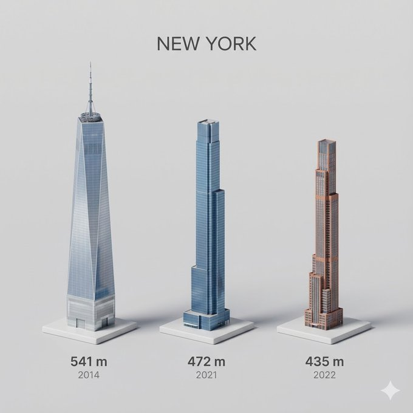
</div>

**提示词：**
```
Present a clear, side miniature 3D cartoon view of [YOUR CITY] tallest buildings. Use minimal textures with realistic materials and soft, lifelike lighting and shadows. Use a clean, minimalistic composition showing exactly the three tallest buildings in Sopot, arranged from LEFT to RIGHT in STRICT descending height order. The tallest must appear visibly tallest, the second must be clearly shorter than the first, and the third must be clearly shorter than the second.
All buildings must follow accurate relative proportions: if a building is taller in real life, it MUST be taller in the image by the same approximate ratio. No building may be visually stretched or compressed.
Each building should stand separately on a thin, simple ceramic base. Below each base, centered text should display:
Height in meters — semibold sans-serif, medium size
Year built — lighter-weight sans-serif, smaller size, directly beneath the height text
Provide consistent padding, spacing, leading, and kerning. Write “YOUR CITY NAME” centered above the buildings, using a medium-sized sans-serif font.
 No building top should overlap or touch the text above.Use accurate architectural proportions based on real-world references.Maintain consistent camera angle and identical scale for each building model.
No forced perspective. Use straight-on orthographic-style rendering. Do not exaggerate or stylize size differences beyond proportional accuracy.

Use a square 1080×1080 composition.Use a clean, neutral background. Ensure no extra objects are present.
```

**中文提示词：**
```
以清晰的侧面微缩3D卡通视图展示[您的城市]最高的三座建筑。使用极简的纹理，采用逼真的材质，并运用柔和自然的灯光和阴影。构图简洁明了，清晰地展现索波特最高的三座建筑，并严格按照从左到右的高度递减顺序排列。最高的建筑必须明显高于第一座，第二座必须明显低于第一座，第三座必须明显低于第二座。
所有建筑物必须遵循准确的相对比例：如果建筑物在现实生活中更高，那么在图像中也必须按大致相同的比例更高。任何建筑物都不得在视觉上被拉伸或压缩。
每栋建筑模型都应单独放置在一个纤薄简洁的陶瓷底座上。每个底座下方居中显示文字：
身高（米）— 半粗体无衬线字体，中等字号
建造年份——较轻的无衬线字体，较小的字号，位于高度文本的正下方
保持字间距、行距和字距一致。使用中等大小的无衬线字体，在建筑物上方居中书写“您的城市名称”。
建筑物顶部不得与上方文字重叠或接触。请使用基于真实世界参考资料的精确建筑比例。保持每个建筑模型拍摄角度一致，并采用相同的比例尺。
避免使用透视错觉。采用正面正投影式渲染。不要夸大或过度修饰尺寸差异，使其超出比例的精确范围。

使用 1080×1080 的正方形构图。使用干净、中性的背景。确保画面中没有多余的物体。
```

<a id="prompt-681"></a>
## 案例 681：反推图片json提示词 (来源 [@TugserOkur](https://x.com/TugserOkur/status/1995565865727664507)) 模型：Nano banana pro

<div style="display: flex; justify-content: space-between;">
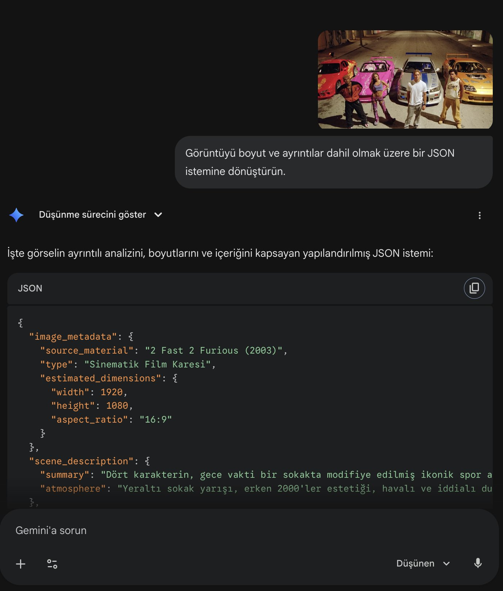
</div>

**提示词：**
```
Convert images to JSON requests, including dimensions and detailed information.
```

**中文提示词：**
```
将图片转换为 JSON 请求，包括尺寸和详细信息。
```

<a id="prompt-680"></a>
## 案例 680：OOTD手绘涂鸦分解 (来源 [@ShreyaYadav___](https://x.com/ShreyaYadav___/status/1995482012124434547)) 模型：Nano banana pro

<div style="display: flex; justify-content: space-between;">
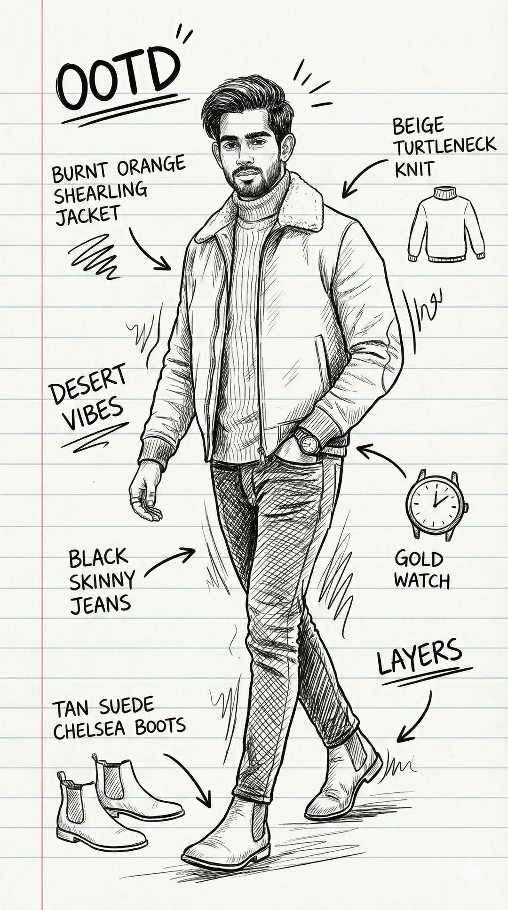
</div>

**提示词：**
```
Breakdown the look into a fun OOTD Fashion Collage, 9:16. Paper scribble aesthetic with hand-drawn arrows, doodles, and handwritten labels pointing to each outfit piece. Notebook paper texture background with ink sketch style.
```

**中文提示词：**
```
将这身造型拆解成一个有趣的每日穿搭拼贴画，9:16。纸张涂鸦风格，手绘箭头、涂鸦和手写标签指向每件单品。笔记本纸张纹理背景，墨水素描风格。
```

<a id="prompt-679"></a>
## 案例 679：紫禁城建筑照片展示和设计图纸 (来源 [@songguoxiansen](https://x.com/songguoxiansen/status/1995676568161845603)) 模型：Nano banana pro

<div style="display: flex; justify-content: space-between;">
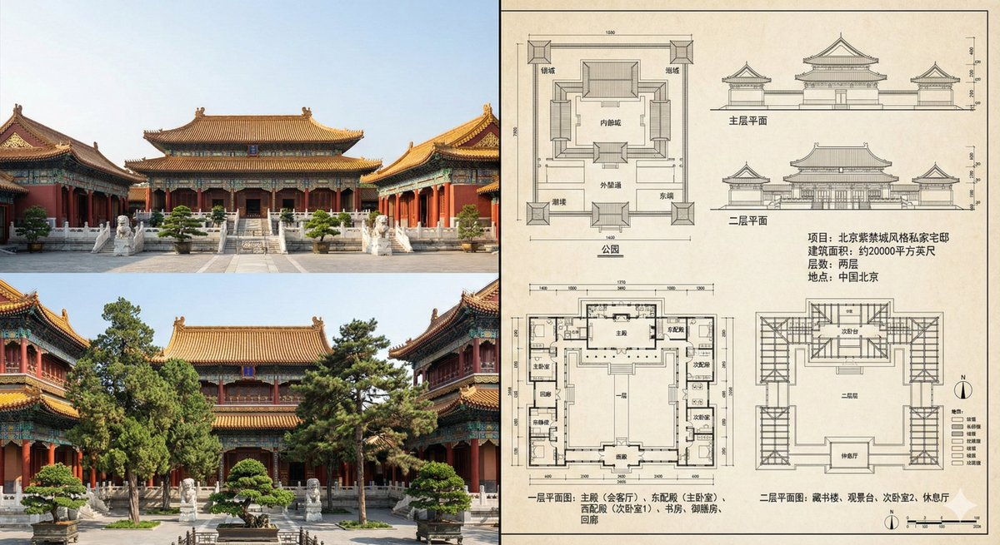
</div>

**中文提示词：**
```
一张分割为两部分的建筑展示图，最左侧三分之一是建成后的实景照片展示，右侧三分之二是详细的建筑设计图纸。

最左侧三分之一（成品展示）： 一张宏伟的、以中国北京紫禁城为风格的两层大型院落的实景照片。画面展示了一个阳光照耀下的主庭院，有重檐歇山顶的红墙黄瓦主殿和配殿，屋顶覆盖着金色的琉璃瓦，屋檐下有复杂的斗拱和精美的彩绘（如龙凤图案）。建筑坐落在汉白玉基座上，前方有雕刻的御道和石狮子。庭院内有古老的松柏和精心修剪的盆景。照片风格写实，展现出皇家园林的庄严与辉煌。

右侧三分之二（建筑设计图）： 一套详细的、带有传统蓝图风格或墨线风格的两层建筑设计图纸，图纸背景为米色宣纸纹理。

上方是总平面图和立面图，清晰标示出多进院落的布局，包括大门、前朝、后寝区域，以及围墙和角楼。立面图展示了建筑的层次和屋顶曲线。

下方是一层和二层平面图，用中文详细标注了各个功能区，例如：“一层平面图：主殿（会客厅）、东配殿（主卧室）、西配殿（次卧室1）、书房、御膳房、回廊”、“二层平面图：藏书楼、观景台、次卧室2、休息厅”。

图纸的显著位置用中文标注：“项目：北京紫禁城风格私家宅邸”、“建筑面积：约20000平方英尺”、“层数：两层”、“地点：中国北京”。图纸还包含比例尺、指北针和图例说明，线条精确，展现出复杂的木结构梁柱体系。

整张图片通过一条明确的分界线将左侧的实景与右侧的图纸隔开，但两者在主题和风格上保持高度一致，共同呈现这一宏大建筑项目。
```

<a id="prompt-678"></a>
## 案例 678：疯狂动物城朱迪和尼克讲小故事-守株待兔 (来源 [@songguoxiansen](https://x.com/songguoxiansen/status/1995700840187765046)) 模型：Nano banana pro

<div style="display: flex; justify-content: space-between;">
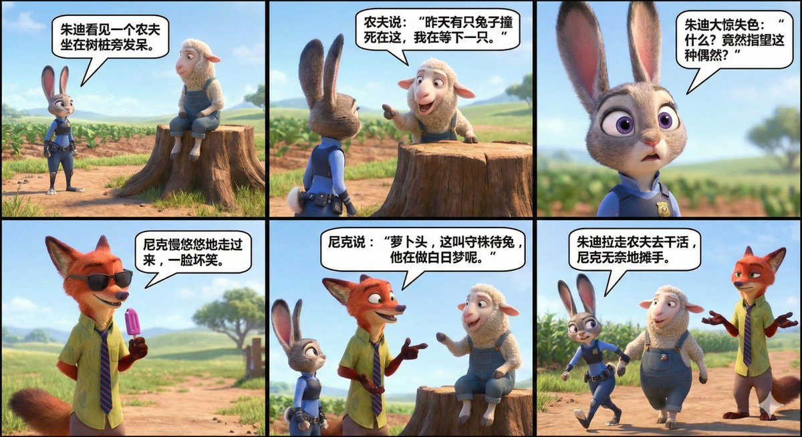
</div>

**中文提示词：**
```
第一格： 迪士尼《疯狂动物城》3D动画风格。朱迪警官穿着警服，在田野边看到一只绵羊农夫坐在一个大树桩旁边发呆。朱迪头上有一个对话气泡，里面写着中文字：“朱迪看见一个农夫坐在树桩旁发呆。”
第二格： 迪士尼《疯狂动物城》3D动画风格。朱迪走近询问，绵羊农夫指着树桩兴奋地解释。绵羊的对话气泡写着中文字：“农夫说：'昨天有只兔子撞死在这，我在等下一只。'”
第三格： 迪士尼《疯狂动物城》3D动画风格。朱迪听后大惊失色，耳朵竖得笔直，一脸不可置信的表情。朱迪的对话气泡写着中文字：“朱迪大惊失色：'什么？竟然指望这种偶然？'”
第四格： 迪士尼《疯狂动物城》3D动画风格。尼克慢悠悠地走过来，戴着墨镜，手里拿着一根爪爪冰棍，一脸坏笑。尼克的对话气泡写着中文字：“尼克慢悠悠地走过来，一脸坏笑。”
第五格： 迪士尼《疯狂动物城》3D动画风格。尼克摘下墨镜，指着绵羊农夫对朱迪解释，表情滑稽。尼克的对话气泡写着中文字：“尼克说：'萝卜头，这叫守株待兔，他在做白日梦呢。'”
第六格： 迪士尼《疯狂动物城》3D动画风格。朱迪无奈地拉着绵羊农夫去劳动，尼克在后面摊手耸肩。朱迪的对话气泡写着中文字：“朱迪拉走农夫去干活，尼克无奈地摊手。”
```

<a id="prompt-677"></a>
## 案例 677：现代少年奇幻漫画 (来源 [@IamEmily2050](https://x.com/IamEmily2050/status/1995429494493167779)) 模型：Nano banana pro

<div style="display: flex; justify-content: space-between;">
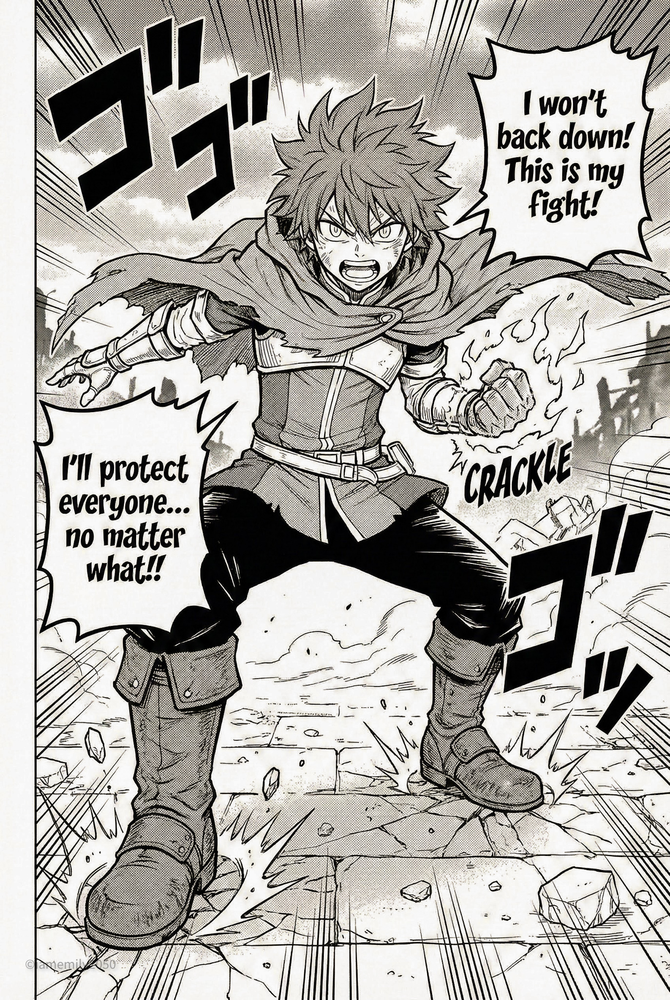
</div>

**提示词：**
```
{
  "intent": "A dramatic, high-energy battle scene featuring a determined young mage making a defiant declaration, in the style of modern Shonen fantasy manga.",
  "manga_genre": "Shonen Fantasy/Action",
  "art_style": {
    "primary_influence": "Modern Shonen Jump style (reminiscent of Black Clover, Fairy Tail), with dynamic action and expressive character work",
    "line_art_style": "Bold, clean lines with strong variable weight. Thick, confident outlines for characters, thin lines for magical effects and background detail. Energetic, flowing linework.",
    "screentone_style": "Minimal screentone use to maintain high contrast and readability. Light 20% dot screentones for subtle shading on skin. Heavy use of pure white and pure black for dramatic impact."
  },
  "panel_design": {
    "primary_panel_type": "FBP (Full-Body Panel): Entire character from head to feet with visible ground plane.",
    "composition_description": "Dynamic low-angle view, looking up at the character from ground level to emphasize heroic determination and power. The character stands in a defiant pose on a cracked, debris-strewn battlefield. The ground is clearly visible beneath and around the character's feet, with rubble, broken stones, and impact cracks radiating outward. Include 15% negative space above the head and 12% below the feet to prevent cropping. The composition creates a sense of the character rising up against adversity.",
    "aspect_ratio": "2:3",
    "key_symbolic_effects": ["Intense speed lines radiating outward from the character's body, creating explosive energy", "Focus lines converging on the character's face and raised fist, emphasizing determination", "Magical energy aura swirling around the character, rendered with flowing, organic lines", "Small impact cracks and debris particles floating around the feet to show power and grounding"]
  },
  "dialogue_and_text": {
    "speech_bubbles": [
      {
        "speaker": "Protagonist",
        "bubble_type": "shout",
        "text_content": "I won't back down! This is my fight!",
        "placement": "Upper right area of the panel, positioned above and slightly to the right of the character's head, with the bubble tail pointing toward the character's mouth",
        "emphasis": "bold"
      },
      {
        "speaker": "Protagonist",
        "bubble_type": "shout",
        "text_content": "I'll protect everyone... no matter what!!",
        "placement": "Mid-left area, positioned near the character's raised fist, with the bubble tail pointing back toward the character's face. This creates a dynamic flow of dialogue across the panel.",
        "emphasis": "bold with triple exclamation marks for maximum intensity"
      }
    ],
    "sound_effects": [
      {
        "sfx_text": "ゴゴゴ (GOGOGO - menacing rumble)",
        "placement": "Integrated into the background, positioned in the upper left and lower right corners, creating a sense of ominous power building",
        "style": "Bold, angular katakana characters rendered in a heavy, imposing font"
      },
      {
        "sfx_text": "CRACKLE",
        "placement": "Near the magical energy aura around the character's hands, integrated into the swirling energy effects",
        "style": "Jagged, electric-style lettering that follows the flow of the magical energy"
      }
    ]
  },
  "character": {
    "archetype": "Hot-blooded Shonen Protagonist: Determined, courageous, fiercely protective of friends, refuses to give up even when outmatched.",
    "design_focus": "A young male mage in his mid-teens. Wild, spiky hair (classic Shonen style) with strands flying upward from the energy aura. Large, intense eyes with prominent highlights showing unwavering determination and a hint of desperation. Wearing a battle-worn fantasy adventurer outfit: a tattered cloak flowing dramatically behind him, a fitted tunic with visible fabric tension showing a lean, athletic build, armored gauntlets on his forearms, and sturdy leather boots with visible buckles and worn soles. The boots are firmly planted on the cracked ground, with detailed lacing and scuff marks. Barefoot would be inappropriate for a battlefield, so the boots are essential and clearly visible from toe to heel.",
    "facial_expression": "Intense and defiant. Mouth open in a shout, showing gritted teeth. Brows furrowed with determination. Eyes blazing with resolve and a slight glow suggesting magical power.",
    "pose_and_body_language": "Dynamic heroic stance: feet shoulder-width apart and fully visible, planted firmly on the cracked ground with slight forward lean suggesting readiness to charge. One fist raised to chest level, clenched tightly and glowing with magical energy. The other arm extended slightly outward for balance. Body coiled with tension and power. The pose conveys both defensive readiness and offensive intent.",
    "symbolic_emotional_markers": ["Determination aura: jagged, flame-like lines surrounding the character's body", "Small sweat drops on the forehead indicating intense exertion and stakes", "Glowing eyes with white highlights suggesting inner power awakening", "Clenched fist with visible tension lines in the hand and forearm"]
  },
  "setting": {
    "location": "A devastated battlefield. Cracked and broken stone ground with large fissures and impact craters. Rubble and debris scattered around the character's feet, with some pieces floating slightly due to magical energy. The ground texture is rough stone and dirt, clearly visible beneath the character's boots. In the blurred background, suggestions of ruined structures and a stormy sky, but kept minimal to maintain focus on the character.",
    "time_of_day": "Dusk or stormy midday (dramatic, low-contrast lighting typical of climactic battle scenes)",
    "atmospheric_elements": "Dust and small debris particles floating in the air. Magical energy wisps swirling around the character. Dark, ominous clouds in the background suggesting the severity of the battle. A few small embers or sparks of magical energy drifting upward from the ground."
  },
  "inking_and_tones": {
    "line_weight_variation": "Strong variation. Very thick, bold outlines (2-3pt) for the character's silhouette and major forms to make them pop against the background. Medium weight (1-2pt) for clothing details, facial features, and magical effects. Thin lines (0.5-1pt) for hair strands, background rubble detail, and fine texture on the boots and gauntlets.",
    "primary_shading_method": "Combination of crisp black fills for deep shadows (under the chin, in the hair, cast shadows on the ground) and light 20% dot screentones for mid-tone shadows on the face and clothing. Minimal screentone use overall to maintain high contrast and energy. Cross-hatching used sparingly for texture on the tattered cloak.",
    "black_space_usage": "Strategic and balanced. Solid black used for hair shadows, the interior of the tattered cloak, and deep shadows cast by the character on the ground. Mostly white space and clean lines to maintain the bright, energetic feel of Shonen action.",
    "screentone_density": "Sparse. Screentones used only for subtle form definition on the character's face and body. The background is kept mostly white with black linework for rubble and cracks, maintaining focus on the character."
  },
  "symbolism_and_effects": {
    "motion_lines": "Intense speed lines radiating outward from the character's torso and limbs in all directions, creating a sense of explosive power and energy bursting forth. The lines are thicker near the character and taper as they extend outward.",
    "emotional_symbols": ["Determination aura: jagged, flame-like energy lines surrounding the body", "Sweat drops on forehead for intense focus and exertion", "Glowing magical energy around the raised fist, rendered with swirling, organic lines", "Small impact lines around the feet showing firm grounding and power transfer to the earth"],
    "onomatopoeia": ["ゴゴゴ (GOGOGO) - menacing/powerful rumble effect in the background", "CRACKLE - magical energy sound effect near the hands"]
  },
  "negative_directives": {
    "style": "No photorealistic rendering, no watercolor or painterly style, no full color, no soft digital gradients, no Western comic book style, no 3D rendering, no overly detailed backgrounds that distract from the character.",
    "content": "No weapons in hand (magic is the focus), no other characters in the frame, no overly busy background, cropped feet, missing feet, floating figure, cut-off ankles, feet out of frame, hands obscuring the face, hair completely covering the eyes, closed or neutral expression (must be intense and emotional).",
    "artifact_suppression": "No blurred lines, no digital painting artifacts, no color bleeding, no anti-aliasing softness, cropped feet, missing toes, deformed feet, extra limbs, anatomically impossible poses, inconsistent line weight, muddy or unclear linework."
  }
}
```

**中文提示词：**
```
{
“意图”：“一场充满戏剧性和爆发力的战斗场景，一位意志坚定的年轻魔法师发表了充满反抗精神的宣言，风格类似于现代少年奇幻漫画。”
"manga_genre": "少年奇幻/动作",
"art_style": {
“主要影响因素”： “现代少年Jump风格（让人想起《黑色五叶草》、《妖精的尾巴》），具有动感的动作和富有表现力的人物刻画”，
"line_art_style": "线条粗犷有力，线条粗细变化丰富。人物轮廓粗犷自信，魔法效果和背景细节则采用纤细线条。充满活力，线条流畅。"
"screentone_style": "尽量减少网点的使用，以保持高对比度和可读性。使用 20% 网点的浅色网点来表现皮肤上的微妙阴影。大量使用纯白和纯黑，以达到戏剧性的效果。"
},
"panel_design": {
"primary_panel_type": "FBP（全身面板）：从头到脚的整个角色，地面清晰可见。"
"composition_description": "动态的低角度视角，从地面仰视人物，强调英雄的决心和力量。人物以不屈的姿态站在满目疮痍、瓦砾遍地的战场上。人物脚下和周围的地面清晰可见，瓦砾、碎石和冲击裂缝向外辐射。头部上方留出 15% 的空白，脚下留出 12% 的空白，以避免画面裁剪。这种构图营造出人物奋起反抗逆境的气势。"
"aspect_ratio": "2:3",
"key_symbolic_effects": ["从角色身体向外辐射的强烈速度线，营造出爆发性的能量", "聚焦线汇聚于角色的面部和高举的拳头，强调其决心", "魔法能量光环环绕角色，以流畅的有机线条渲染", "脚部周围漂浮的细小冲击裂纹和碎片，展现力量与稳固性"]
},
"对话和文本": {
"speech_bubbles": [
{
“说话者”：“主角”，
"bubble_type": "喊叫",
"text_content": "我绝不退缩！这是我的战斗！"
“位置”：“位于面板的右上角，在角色头部上方略偏右的位置，气泡尾部指向角色的嘴部”，
强调：粗体
},
{
“说话者”：“主角”，
"bubble_type": "喊叫",
"text_content": "无论如何，我都会保护所有人！！"
“位置”：“位于画面左侧中间区域，靠近角色举起的拳头，气泡尾部指向角色的脸部。这样可以在画面中营造出对话的动态流动感。”
“强调”：“加粗并加上三个感叹号，以示最大程度的强调”
}
],
"sound_effects": [
{
"sfx_text": "ゴゴゴ（GOGOGO - 威胁性的隆隆声）",
“位置”：“融入背景，位于左上角和右下角，营造出一种不祥的力量积聚感”，
"style": "粗体、棱角分明的片假名字符，采用厚重、醒目的字体呈现"
},
{
"sfx_text": "噼啪声",
“放置位置”：“靠近角色双手周围的魔法能量光环，融入到旋转的能量效果中”，
“风格”：“锯齿状、电光质感的字体，跟随魔法能量的流动”
}
]
},
“特点”： {
“原型”：“热血少年漫主角：意志坚定、勇敢无畏、极力保护朋友、即使实力悬殊也绝不放弃。”
“设计重点”：一位十几岁的年轻男性魔法师。他有着狂野的刺猬头（经典少年漫画风格），几缕发丝在能量光环的映衬下向上飞舞。他那双炯炯有神的眼睛里闪烁着坚定的光芒，闪烁着一丝绝望。他身着一套饱经战火洗礼的奇幻冒险者装束：一件破旧的斗篷在他身后飘扬，一件紧身束腰外衣勾勒出他精瘦健壮的身材，前臂上戴着护手，脚上穿着结实的皮靴，靴扣清晰可见，鞋底磨损严重。皮靴牢牢地踩在龟裂的地面上，鞋带和磨损痕迹清晰可见。赤脚在战场上是不合适的，所以皮靴必不可少，从鞋头到鞋跟都清晰可见。
“面部表情”： “表情强烈而桀骜不驯。嘴巴张开，仿佛要怒吼，露出紧咬的牙齿。眉头紧锁，充满决心。双眼燃烧着坚定的火焰，闪烁着一丝光芒，暗示着某种魔法力量。”
“姿势与肢体语言”： “充满活力的英雄姿态：双脚与肩同宽，完全可见，稳稳地踩在龟裂的地面上，身体略微前倾，暗示着随时准备冲锋。一只拳头高举至胸前，紧紧握住，闪耀着魔法能量。另一只手臂略微向外伸展以保持平衡。身体充满张力和力量。此姿势既传达了防御的准备，也传达了进攻的意图。”
"symbolic_emotional_markers": ["决心光环：角色身体周围环绕着锯齿状的火焰线条", "额头上的细小汗珠表明正在承受巨大的压力", "闪烁着白光的眼睛暗示着内在力量的觉醒", "紧握的拳头，手掌和前臂上可见明显的肌肉线条"]
},
“环境”： {
地点：一片满目疮痍的战场。龟裂破碎的石质地面布满巨大的裂缝和撞击坑。瓦砾和碎片散落在角色脚下，部分碎片因魔法能量的作用而微微漂浮。地面纹理粗糙，由石头和泥土构成，在角色的靴子下清晰可见。模糊的背景中隐约可见残垣断壁和暴风雨的天空，但为了突出角色，这些元素被刻意弱化。
"time_of_day": "黄昏或暴风雨的正午（戏剧性的、低对比度的光线，典型的高潮战斗场景）",
“大气元素”：空气中漂浮着尘埃和细小的碎片。魔法能量的丝缕在角色周围盘旋。背景中阴沉的乌云暗示着战斗的严峻性。几小簇魔法能量的余烬或火花从地面向上飘散。
},
"inking_and_tones": {
"line_weight_variation": "线条粗细变化丰富。人物轮廓和主要形体采用非常粗的线条（2-3pt），使其在背景中脱颖而出。服装细节、面部特征和魔法效果采用中等粗细（1-2pt）。头发、背景碎石细节以及靴子和护手上的精细纹理采用细线（0.5-1pt）。"
“primary_shading_method”： “结合使用清晰的黑色填充来表现深阴影（下巴下方、头发中、地面上的投影），并使用20%网点的浅色网点来表现面部和衣物上的中间色调阴影。整体上尽量减少网点的使用，以保持高对比度和活力。在破烂的斗篷上少量使用交叉阴影线来表现纹理。”
“黑位运用”：策略性且平衡。头发阴影、破烂斗篷的内衬以及角色在地面上投射的深阴影均采用纯黑色。大量留白和简洁的线条，以保持少年漫画动作戏的明亮、活力感。
“screentone_density”：稀疏。网点仅用于勾勒人物面部和身体的细微轮廓。背景以白色为主，用黑色线条勾勒瓦砾和裂缝，使画面焦点集中在人物身上。
},
"symbolism_and_effects": {
“运动线”：从角色躯干和四肢向四面八方辐射出强烈的速度线，营造出爆发力和能量迸发的感觉。线条在靠近角色处较粗，向外延伸逐渐变细。
"emotional_symbols": ["决心光环：锯齿状的火焰状能量线环绕身体", "额头上的汗珠象征着高度集中和努力", "高举的拳头周围闪耀着魔法能量，以旋转的有机线条描绘", "脚部周围的细小冲击线象征着稳固的接地和力量传递到大地"]
拟声词：[“ゴゴゴ (GOGOGO) - 背景中令人不安/强大的隆隆声效果”“噼啪声 - 手附近魔法能量的声音效果”]
},
"negative_directives": {
“风格”：“不使用照片级写实渲染，不使用水彩或油画风格，不使用全彩，不使用柔和的数字渐变，不使用西方漫画风格，不使用3D渲染，不使用会分散观众对角色注意力的过于细致的背景。”
“内容”：“手中不持武器（重点是魔法），画面中没有其他角色，背景不要过于杂乱，脚部被裁剪，脚部缺失，人物漂浮，脚踝被切断，脚部超出画面，手遮住脸部，头发完全遮住眼睛，表情闭合或中性（必须强烈而富有情感）。”
"artifact_suppression": "无模糊线条、无数码绘画瑕疵、无颜色溢出、无抗锯齿柔化、无裁剪脚部、无缺失脚趾、无畸形脚部、无额外肢体、无解剖学上不可能的姿势、无不一致的线条粗细、无模糊或不清晰的线条。"
}
}
```

<a id="prompt-676"></a>
## 案例 676：夜晚吐舌头女生的自拍照 (来源 [@xmliisu](https://x.com/xmliisu/status/1995499182207996193)) 模型：Grok

<div style="display: flex; justify-content: space-between;">
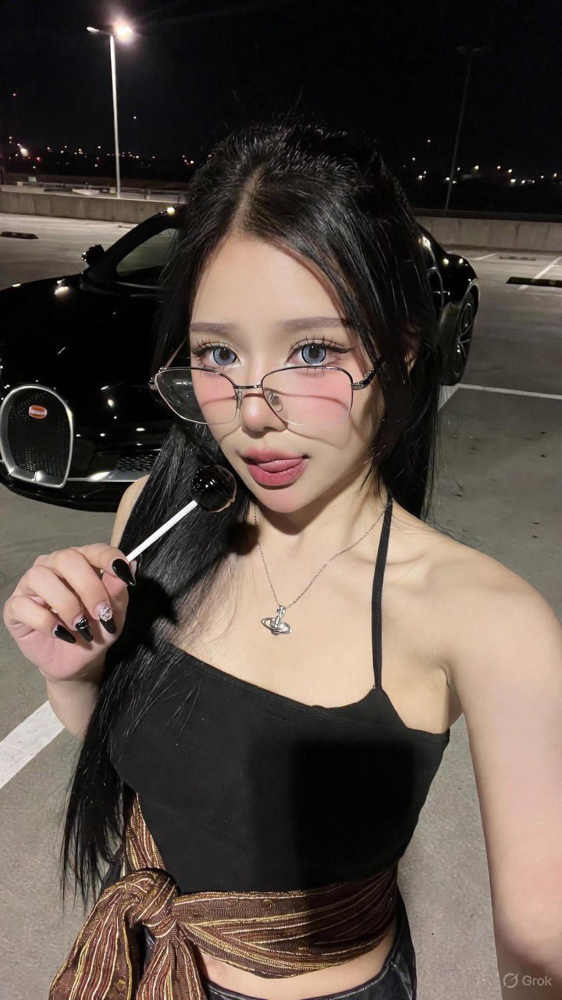
</div>

**提示词：**
```
[Image_Specifications]
Type = Realistic Portrait
Style = Douyin Aesthetic
Resolution = High Quality

[Subject_Details]
Demographics = Young Asian woman
Facial_Structure = 100% original face (no editing)
Hair_Texture = Straight, shiny
Hair_Color = Black
Hair_Length = Long

[Makeup_&_Styling]
Style = Douyin-style
Eye_Makeup = Highlights large eyes, long eyelashes
Cheeks = Rosy
Nails = Long, painted beautiful dark black

[Apparel_&_Accessories]
Eyewear = Thin silver-framed eyeglasses
Top = Black strapless top with a single strap
Waist_Accessory = Brown and gold striped fabric belt (tied in a bow)
Necklace = Small silver Vivienne Westwood Orb pendant

[Pose_&_Expression]
Action = Taking a selfie
Angle = From above
Right_Arm = Raised, holding the phone
Left_Hand = Holding a round black lollipop
Expression = Confident gaze, tongue slightly sticking out

[Environment_&_Background]
Location = Outdoor parking lot
Time_of_Day = Night
Ground_Surface = Gray concrete with white parking lines
Featured_Vehicle = Black Bugatti (visible grille and bumper)
Lighting_Conditions = Dimly lit by street lamps and distant city lights
```

**中文提示词：**
```
[图像规格]
类型 = 写实肖像
风格 = 抖音美学
分辨率 = 高质量

[主题详情]
人口统计 = 年轻亚裔女性
面部结构 = 100% 原始面部（未经编辑）
发质：直发，有光泽
发色 = 黑色
头发长度 = 长

[化妆造型]
风格 = 抖音风格
眼妆 = 突出大眼睛和长睫毛
脸颊 = 红润
指甲 = 长长的，涂着漂亮的深黑色指甲油

[服装及配饰]
眼镜 = 细银框眼镜
上衣 = 黑色单肩无肩带上衣
腰部配饰 = 棕色和金色条纹布料腰带（系成蝴蝶结）
项链 = 小型银色 Vivienne Westwood 球形吊坠

[姿势与表情]
行动 = 自拍
角度 = 从上方
右臂举起，拿着手机
左手 = 拿着一个圆形的黑色棒棒糖
表情 = 自信的眼神，舌头微微伸出

[环境与背景]
地点 = 室外停车场
时间 = 夜晚
地面 = 灰色混凝土，带有白色停车线
特色车辆 = 黑色布加迪（可见格栅和保险杠）
照明条件 = 由路灯和远处城市灯光昏暗照亮
```

<a id="prompt-675"></a>
## 案例 675：同一张脸的柔和模糊的侧面特写 (来源 [@ShreyaYadav___](https://x.com/ShreyaYadav___/status/1995540914954272826)) 模型：Grok

<div style="display: flex; justify-content: space-between;">
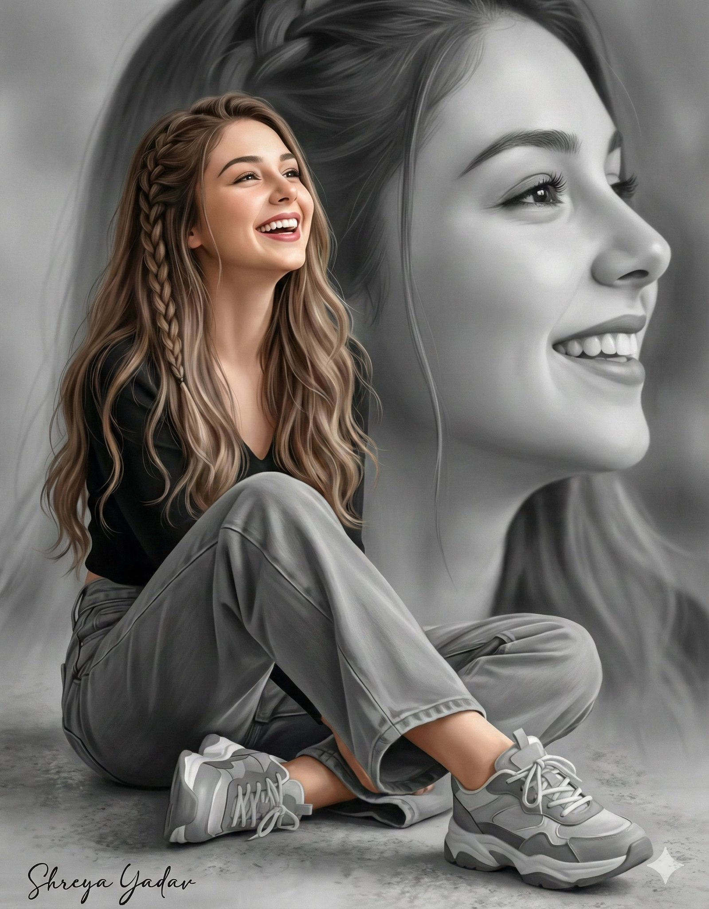
</div>

**提示词：**
```
{
  "prompt": "A full-body artistic portrait of the woman from the reference image, keeping the exact same face. She is elegantly seated on the floor wearing a modern black top, soft loose gray jeans, and chunky gray-and-white sneakers. Her long, waist-length wavy milky-brown hair flows naturally, with half of it beautifully braided. She is laughing while looking upwards, capturing a confident candid smile. The background is an artistic monochrome (black and white) composition featuring a soft, blurred close-up side profile of the same face, creating a stylish dual-layer aesthetic. High-quality soft lighting, realistic textures, cinematic realism, and an artistic portrait vibe.",
  
  "style": {
    "lighting": "soft, high-quality, realistic",
    "color_palette": "monochrome background, natural skin tones",
    "mood": "confident, candid, artistic",
    "quality": "ultra detailed, high-resolution"
  },
  
  "camera": {
    "shot": "full-body portrait",
    "angle": "slightly low angle, upward gaze feel",
    "focus": "sharp on subject, blurred artistic background"
  },
  
  "character": {
    "face": "same as reference image",
    "expression": "laughing, confident smile",
    "hair": "long wavy milky-brown, half braided",
    "outfit": {
      "top": "modern black top",
      "bottom": "soft loose gray jeans",
      "shoes": "chunky gray-and-white sneakers"
    }
  },
  
  "background": {
    "type": "artistic monochrome",
    "layers": "soft blurred close-up side profile of same face",
    "effect": "stylish dual-layer aesthetic"
  }
}
```

**中文提示词：**
```
{
“提示”：“根据参考图片，绘制一位女士的全身艺术肖像，保留其面部特征。她优雅地坐在地板上，身着现代感十足的黑色上衣、宽松的灰色牛仔裤和厚底灰白运动鞋。她及腰的乳棕色长发自然垂落，一半编成精美的辫子。她仰望天空，笑容灿烂，展现出自信而真挚的神态。背景采用艺术化的黑白构图，柔和模糊的侧脸特写营造出时尚的双层美感。画面运用了高质量的柔光、逼真的纹理、电影般的写实感以及艺术肖像的氛围。”

“风格”： {
“照明”：“柔和、高质量、逼真”，
"color_palette": "单色背景，自然肤色",
“情绪”：“自信、坦率、有艺术气息”
“质量”：“超精细，高分辨率”
},

“相机”： {
“拍摄”: “全身肖像”
“角度”：“略低的角度，向上凝视的感觉”，
“焦点”： “主体清晰，背景虚化，富有艺术感”
},

“特点”： {
“脸部”：“与参考图像相同”，
“表情”：“笑着，自信的笑容”，
“头发”：“长长的波浪状乳棕色头发，一半编成辫子”，
“全套服装”： {
“上衣”： “现代黑色上衣”，
下装：柔软宽松的灰色牛仔裤，
“鞋子”： “厚底灰白运动鞋”
}
},

“背景”： {
"type": "艺术单色",
“图层”: “同一张脸的柔和模糊的侧面特写”，
“效果”：“时尚的双层美感”
}
}
```

<a id="prompt-674"></a>
## 案例 674：武当山山腰的一栋双层住宅 (来源 [@songguoxiansen](https://x.com/songguoxiansen/status/1995668237787267575)) 模型：Nano banana pro

<div style="display: flex; justify-content: space-between;">
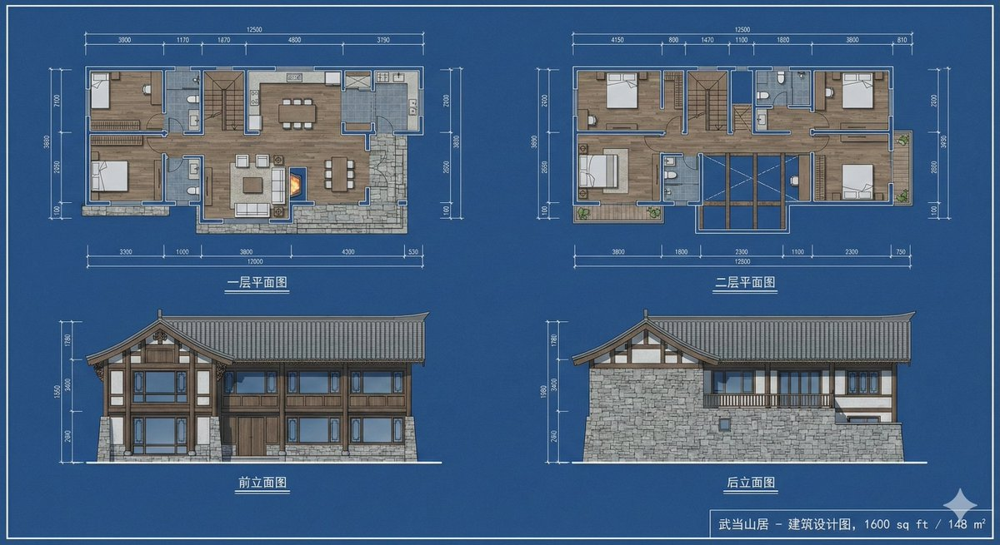
</div>

**中文提示词：**
```
一套详细的建筑设计蓝图，位于中国武当山山腰的一栋双层住宅。总建筑面积1600平方英尺（约148平方米）。包含一层平面图、二层平面图和前后立面图。布局设计为三间卧室。建筑风格为新中式，结合了传统武当山道教建筑元素与现代山地住宅特色：坡屋顶，青瓦，深色木构架梁柱，以及当地石材基座。图纸上带有尺寸标注线和建筑符号，专业建筑绘图风格，蓝底白线图。
```

<a id="prompt-673"></a>
## 案例 673：3×3的美妆电商广告制作 (来源 [@Salmaaboukarr](https://x.com/Salmaaboukarr/status/1995473175233069217)) 模型：Nano banana pro

<div style="display: flex; justify-content: space-between;">
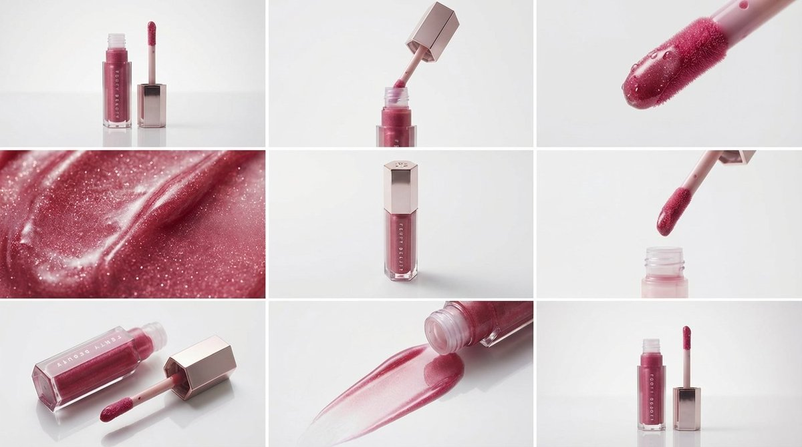
</div>

**提示词：**
```
Create an editorial photoreal 3×3 storyboard contact sheet for a high end beauty e commerce ad featuring only the following products: {{product_main}} and {{product_secondary}}

Background {{background}}.  
Lighting  {{lighting}}.  

generate as one evenly spaced 3×3 grid.  

{{panels}}
```

**中文提示词：**
```
为高端美妆电商广告制作一张 3×3 的写实风格故事板联系表，广告中仅包含以下产品： {{主产品}}和{{辅助产品}}

背景{{背景}} 。
照明{{照明}} 。

生成一个等间距的 3×3 网格。

{{面板}}
```

<a id="prompt-672"></a>
## 案例 672：疯狂动物城朱迪和尼克 (来源 [@LiEvanna85716](https://x.com/LiEvanna85716/status/1995414338493108500)) 模型：Nano banana pro

<div style="display: flex; justify-content: space-between;">
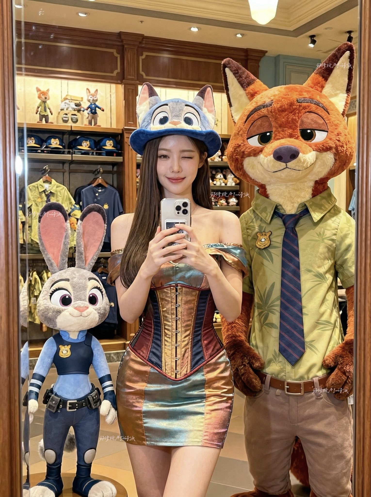
</div>

**提示词：**
```
# Nano Banana Pro Configuration - Zootopia Cyber Fan Concept
# Generated by AI Writing Assistant

project_name: "Zootopia_Cyber_Fashion_Wink"
model_base: "SDXL_Realistic_v4" # 假设的基础模型，可根据实际情况调整
output_resolution: [896, 1152]  # 3:4 Ratio, optimized for Twitter feed

character:
  id: "cyber_judy_fan_01"
  gender: "female"
  age: "20s"
  features:
    - "delicate facial features"
    - "playful expression"
    - "winking one eye"
    - "holding smartphone for selfie"

scene:
  location: "Zootopia official merchandise store"
  lighting: "interior shop lighting, soft neon accents, volumetric bloom"
  atmosphere: "lively, colorful, detailed background"

prompts:
  positive: |
    (Masterpiece, 8k resolution, photorealistic, ultra-detailed),
    POV selfie shot, beautiful young woman winking at camera,
    wearing a futuristic metallic silver corset dress (iridescent texture:1.2),
    wearing fluffy Judy Hopps rabbit ear hat (purple and grey),
    holding a high-tech smartphone, selfie gesture,
    background is a cluttered Zootopia souvenir shop,
    shelves filled with Nick Wilde and Judy Hopps plush toys (fuzzy texture:1.3),
    ZPD badges, carrots merchandise,
    depth of field, ray tracing reflections on the metallic dress,
    cinematic lighting, sharp focus on eyes and phone.

  negative: |
    (worst quality, low quality:1.4), monochrome, zombie,
    deformed anatomy, disfigured, extra fingers, bad hands, 
    missing fingers, floating limbs, disconnected limbs,
    blur, out of focus, cropped head, watermark, text, signature,
    distorted plushies, scary faces on toys.

views:
  - view_id: "main_selfie"
    camera_angle: "high angle selfie"
    focus: "face and upper body"
    description: "The main engagement shot showing the wink and the outfit details."

  - view_id: "outfit_detail"
    camera_angle: "medium shot"
    focus: "waist and background"
    description: "Showcasing the metallic texture of the corset and the Zootopia merch in the back."

# Advanced Settings for Nano Banana Pro
sampling:
  steps: 35
  cfg_scale: 7.5
  sampler: "DPM++ 2M Karras"
  seed: -1 # Random
```

**中文提示词：**
```
# Nano Banana Pro 配置 - 疯狂动物城赛博粉丝概念
# 由 AI 写作助手生成

project_name: "疯狂动物城_赛博_时尚_眨眼"
model_base: "SDXL_Realistic_v4" # 假设的基础模型，可根据实际情况调整
output_resolution: [896, 1152]  # 3:4 比例，针对 Twitter 信息流优化

character:
  id: "赛博_朱迪_粉丝_01"
  gender: "女性"
  age: "20多岁"
  features:
    - "精致的五官"
    - "顽皮/俏皮的表情"
    - "眨一只眼"
    - "手持智能手机自拍"

scene:
  location: "疯狂动物城官方周边商店"
  lighting: "室内商店照明，柔和的霓虹点缀，体积光（光晕）"
  atmosphere: "生动活泼，色彩丰富，背景细节详实"

prompts:
  positive: |
    (杰作, 8k分辨率, 照片级真实, 超精细),
    第一人称视角（POV）自拍镜头, 美丽的年轻女性对着镜头眨眼,
    身穿未来感金属银色紧身胸衣连衣裙 (彩虹色纹理:1.2),
    戴着毛茸茸的朱迪警官（Judy Hopps）兔耳帽 (紫色和灰色),
    手持高科技智能手机, 自拍姿势,
    背景是琳琅满目的疯狂动物城纪念品商店,
    货架上摆满了尼克（Nick Wilde）和朱迪（Judy Hopps）的毛绒玩具 (毛绒纹理:1.3),
    ZPD（动物城警局）警徽, 胡萝卜周边商品,
    景深效果, 金属裙上的光线追踪反射,
    电影级布光, 焦点清晰对准眼睛和手机。

  negative: |
    (最差质量, 低质量:1.4), 单色, 僵尸,
    解剖结构变形, 毁容, 多余的手指, 坏手, 
    缺失手指, 悬浮肢体, 断肢,
    模糊, 失焦, 截断的头部, 水印, 文字, 签名,
    扭曲的毛绒玩具, 玩具有可怕的脸。

views:
  - view_id: "main_selfie"
    camera_angle: "高角度/俯拍自拍"
    focus: "脸部和上半身"
    description: "展示眨眼表情和服装细节的主要互动镜头。"

  - view_id: "outfit_detail"
    camera_angle: "中景镜头"
    focus: "腰部和背景"
    description: "展示紧身胸衣的金属质感以及后方的疯狂动物城周边商品。"

# Nano Banana Pro 高级设置
sampling:
  steps: 35
  cfg_scale: 7.5
  sampler: "DPM++ 2M Karras"
  seed: -1 # 随机
```

<a id="prompt-671"></a>
## 案例 671：星座运势卡 (来源 [@cnyzgkc](https://x.com/cnyzgkc/status/1995423285060976700)) 模型：Nano banana pro

<div style="display: flex; justify-content: space-between;">
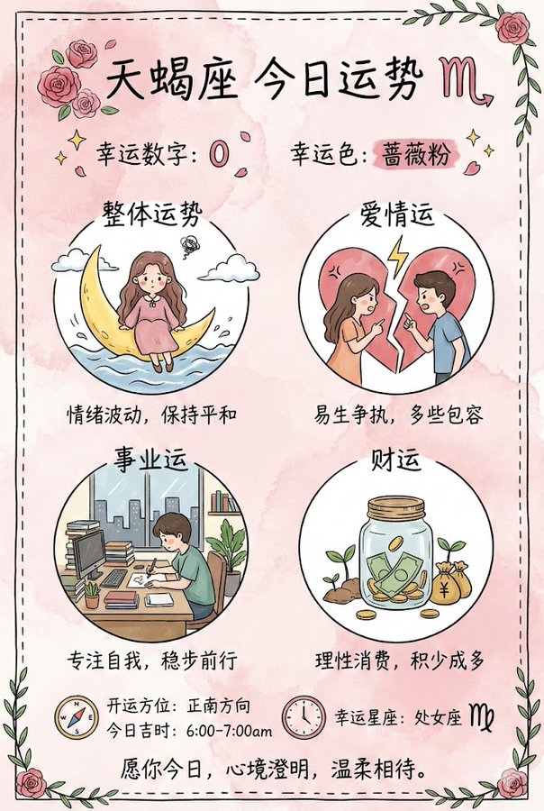
</div>

**中文提示词：**
```
请先帮我搜索「星座名」今天的最新运势，重点包含：整体运势、爱情运、事业运、财运，以及今天的幸运色与幸运数字。接着，请根据今天的运势内容，使用 Nano Banana Pro 绘制一张 文青手绘平面插画风格的星座运程故事卡片，需要 精美排版与丰富元素设计、简体中文、2K、2:3 比例。
```

<a id="prompt-670"></a>
## 案例 670：年轻女子对着镜子自拍旁边是朱迪 (来源 [@awesome_visuals](https://x.com/awesome_visuals/status/1995071645002747918)) 模型：Nano banana pro

<div style="display: flex; justify-content: space-between;">
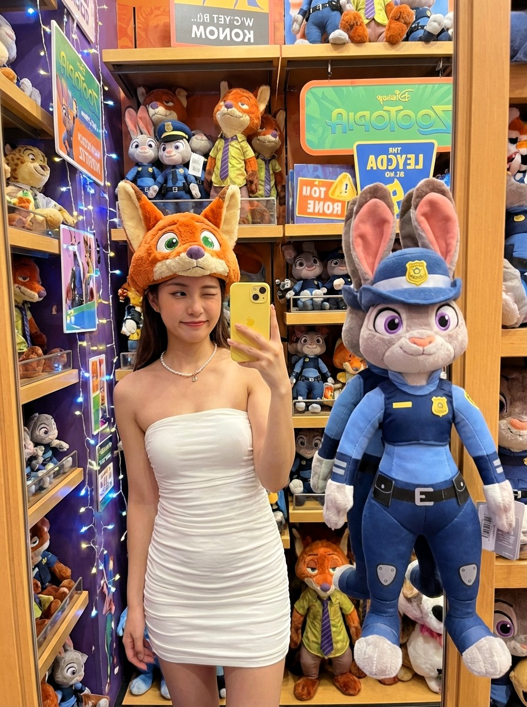
</div>

**提示词：**
```
{ "subject": "beautiful young woman mirror selfie in Disney store", "outfit": "strapless white ruched mini dress, pearl necklace", "headwear": "fluffy orange Nick Wilde fox-ear hat with green eyes", "phone": "yellow iPhone", "reflection_companion": "life-size Judy Hopps police plush in uniform standing next to her", "setting": "bright Zootopia section, shelves packed with plushies, festive lights", "style": "playful wink, cute and flirty Disney selfie" }
```

**中文提示词：**
```
{ "subject": "迪士尼商店里一位美丽的年轻女子对着镜子自拍", "outfit": "白色无肩带褶皱迷你连衣裙，珍珠项链", "headwear": "毛茸茸的橙色尼克·王尔德狐狸耳朵帽，绿色眼睛", "phone": "黄色iPhone", "reflection_companion": "她旁边站着一个真人大小的朱迪·霍普斯警官毛绒玩具，身穿制服", "setting": "明亮的疯狂动物城专区，货架上摆满了毛绒玩具，节日彩灯闪烁", "style": "俏皮的眨眼，可爱又略带挑逗的迪士尼自拍" }
```

<a id="prompt-669"></a>
## 案例 669：女子在迪士尼商店里对着镜子自拍 (来源 [@_MehdiSharifi_](https://x.com/_MehdiSharifi_/status/1995230929158320332)) 模型：Nano banana pro

<div style="display: flex; justify-content: space-between;">
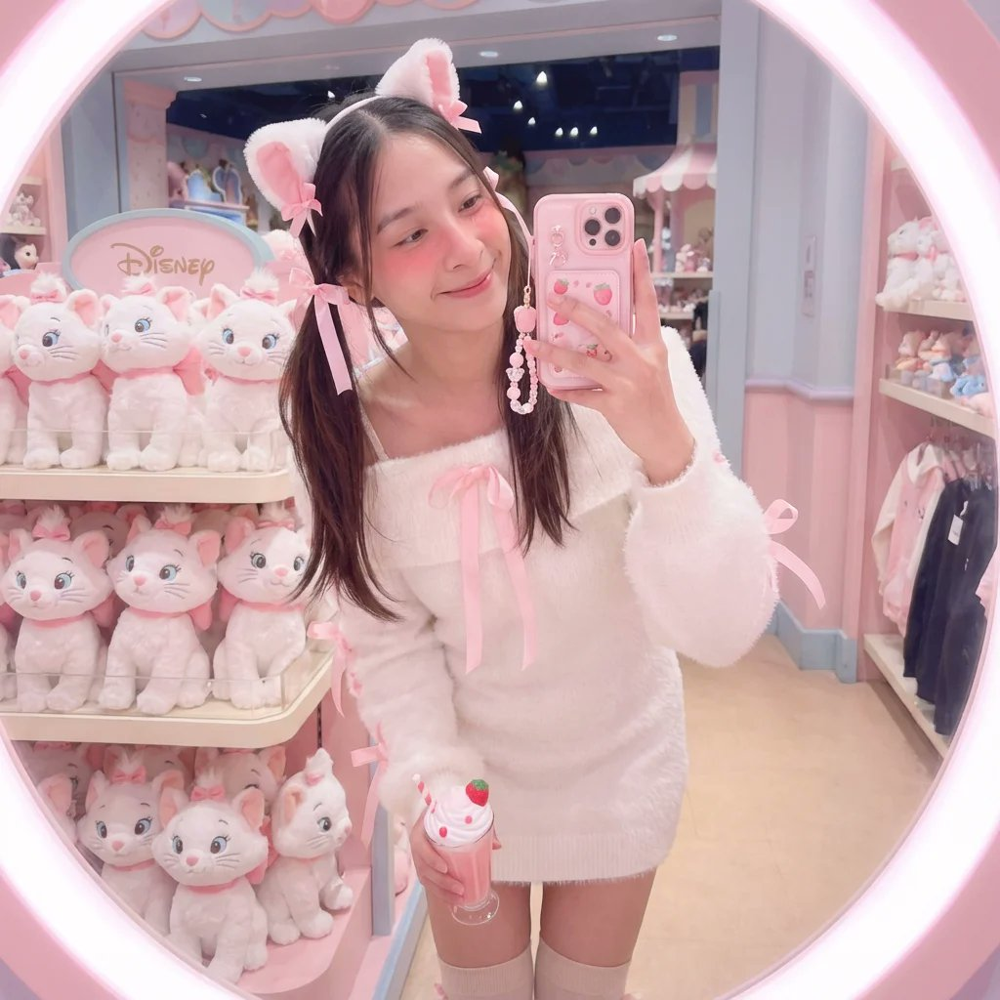
</div>

**提示词：**
```
{
  "scene_description": "A soft, kawaii aesthetic mirror selfie of a cute young woman in a Disney store, embracing a fluffy pink Aristocats theme.",
  "image_reference": {
    "path": "[UPLOADED_IMAGE]",
    "weight": "high",
    "influence": "face_and_body_structure"
  },
  "subject": {
    "type": "The woman from the uploaded image",
    "age": "match input image",
    "features": {
      "hair": "soft curls or twin tails with ribbons",
      "expression": "sweet smile, head tilted, eyes wide and innocent",
      "makeup": "heavy blush (igari style), pink glossy lips, soft lashes"
    },
    "attire": "a fluffy white off-shoulder sweater dress (angora texture) with pink satin ribbons tied on the sleeves, white knee-high knitted socks",
    "accessories": "white cat ears headband with pink bows (Marie style), holding a pink strawberry milkshake prop, pearl bracelet",
    "position": "standing with knees slightly bent together (cute pose), holding phone with both hands."
  },
  "action": {
    "primary": "taking a cute selfie",
    "secondary": "holding a drink",
    "effect": "radiating softness and charm"
  },
  "environment": {
    "setting": "Pastel plushie section of Disney store",
    "foreground_elements": [
      "pink phone case with charms",
      "fluffy texture of dress close to lens"
    ],
    "background_elements": [
      "stacks of pink and white plushies",
      "pastel floral decor",
      "soft retail lighting"
    ]
  },
  "lighting": {
    "style": "Soft diffused beauty light",
    "key_light": {
      "type": "Ring light effect",
      "color": "Soft pink/peach undertone",
      "illuminates": "rosy cheeks and fluffy textures."
    },
    "background_light": {
      "color": "Pastel pink glow"
    },
    "shadows": "very soft, almost non-existent shadows"
  },
  "style": {
    "medium": "Smartphone photography",
    "aesthetic": "Coquette, Kawaii, Soft Girl, Pastel Goth light",
    "quality": "Dreamy, soft focus edges",
    "details": "visible fluff on sweater"
  },
  "visual_description": {
    "core_subject": "An embodiment of cuteness and comfort.",
    "attire_physics": "The sweater looks incredibly soft and touchable; ribbons drape naturally.",
    "skin_rendering": "Soft-focus, airbrushed look (beauty filter simulation)."
  },
  "lighting_and_atmosphere": {
    "type": "Dreamy Interior",
    "specifics": "Bloom effect on highlights.",
    "color_grade": "Pastel palette, low contrast, rosy tint"
  },
  "attire_customization": {
    "current_clothing": "Fluffy white sweater dress, pink ribbons, knee socks",
    "customizable_clothing": "Can swap for a pink gingham sundress."
  },
  "camera_and_lens": {
    "focal_length_feel": "35mm",
    "aperture_effect": "f/2.0",
    "camera_angle": "Slightly high angle (selfie standard)",
    "lens_type": "Smartphone front camera simulation",
    "bokeh_style": "Creamy pastel bokeh"
  }
}
```

**中文提示词：**
```
{
"scene_description": "一位可爱年轻女子在迪士尼商店里对着镜子自拍，照片风格柔和可爱，以蓬松的粉色《猫儿历险记》主题为特色。"
"image_reference": {
"路径": "[上传的图像]",
"重量": "高",
“影响”： “面部和身体结构”
},
“主题”： {
"type": "上传图片中的女子",
“年龄”： “匹配输入图像”，
“特征”： {
“头发”：“柔软的卷发或用丝带扎成的双马尾辫”，
“表情”：“甜美的微笑，歪着头，睁大眼睛，显得天真无邪”，
妆容：浓重的腮红（伊加里风格），粉嫩亮泽的嘴唇，柔软的睫毛
},
“服装”：“一件蓬松的白色露肩毛衣连衣裙（安哥拉羊毛质地），袖子上系着粉色缎带，白色及膝针织袜”，
“配饰”：“白色猫耳朵发箍，配粉色蝴蝶结（玛丽风格），手持粉色草莓奶昔道具，珍珠手链”
“姿势”：“双膝微屈并拢站立（可爱姿势），双手拿着手机。”
},
“行动”： {
“主要”: “拍一张可爱的自拍”，
“次要的”: “拿着饮料”，
“效果”：“散发柔和与魅力”
},
“环境”： {
“场景”：“迪士尼商店的粉彩毛绒玩具区”，
"前景元素": [
“粉色带挂饰的手机壳”
“镜头前裙子的蓬松质感”
],
“背景元素”：[
“一堆堆粉色和白色的毛绒玩具”，
“粉彩花卉装饰”，
“柔和的零售照明”
]
},
“灯光”： {
“风格”：“柔和漫射的美光”，
"key_light": {
“类型”：“环形灯效果”，
“颜色”： “柔和的粉色/桃色底调”，
“照亮”：“红润的脸颊和蓬松的质地。”
},
"background_light": {
“颜色”： “柔和的粉红色光芒”
},
“阴影”： “非常柔和，几乎不存在的阴影”
},
“风格”： {
“媒介”：“智能手机摄影”，
“美学”：“娇媚、可爱、柔美少女、柔和哥特风”
“品质”：“梦幻般的柔焦边缘”，
“细节”：“毛衣上有明显的绒毛”
},
"visual_description": {
核心主题：可爱与舒适的化身。
“attire_physics”：“这件毛衣看起来非常柔软，触感极佳；丝带垂坠感也很自然。”
"skin_rendering": "柔焦、喷枪效果（美颜滤镜模拟）"
},
"lighting_and_atmosphere": {
"type": "梦幻内饰",
“具体细节”：“高光部分的绽放效果。”
"color_grade": "柔和色调，低对比度，玫瑰色"
},
"attire_customization": {
"current_clothing": "蓬松的白色毛衣连衣裙，粉色丝带，及膝袜"
"customizable_clothing": "可以换成粉色格子连衣裙。"
},
"camera_and_lens": {
"focal_length_feel": "35mm",
"aperture_effect": "f/2.0",
"camera_angle": "略高角度（自拍标准）",
"lens_type": "智能手机前置摄像头模拟",
"bokeh_style": "奶油粉彩散景"
}
}
```

<a id="prompt-668"></a>
## 案例 668：城市俯视等距3D卡通微缩场景 (来源 [@PavolRusnak](https://x.com/PavolRusnak/status/1995165498774802607)) 模型：Nano banana pro

<div style="display: flex; justify-content: space-between;">
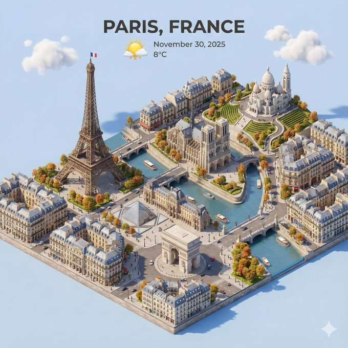
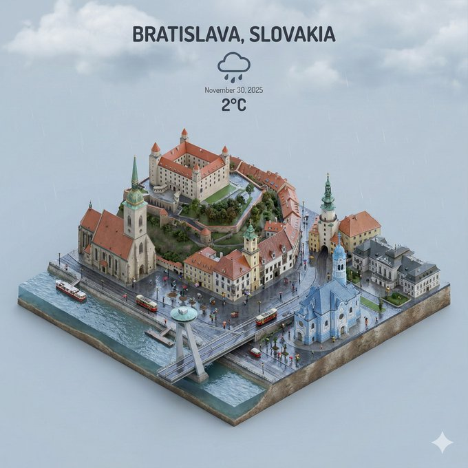
</div>

**提示词：**
```
Present a clear, 45° top-down isometric miniature 3D cartoon scene of [CITY], featuring its most iconic landmarks and architectural elements. Use soft, refined textures with realistic PBR materials and gentle, lifelike lighting and shadows. Integrate the current weather conditions directly into the city environment to create an immersive atmospheric mood.
Use a clean, minimalistic composition with a soft, solid-colored background.

At the top-center, place the title “[CITY]” in large bold text, a prominent weather icon beneath it, then the date (small text) and temperature (medium text).
All text must be centered with consistent spacing, and may subtly overlap the tops of the buildings.
Square 1080x1080 dimension.
```

**中文提示词：**
```
呈现[城市]的清晰45°俯视等距3D卡通微缩场景，展现其最具标志性的地标和建筑元素。使用柔和细腻的纹理、逼真的PBR材质以及柔和自然的灯光和阴影。将当前天气状况直接融入城市环境，营造身临其境的氛围。
使用简洁的极简主义构图，搭配柔和的纯色背景。

在顶部中心位置，用粗体大字显示标题“[城市]”，在其下方放置一个醒目的天气图标，然后是日期（小字）和温度（中字）。
所有文字必须居中，间距一致，并且可以略微与建筑物顶部重叠。
正方形，尺寸为 1080x1080。
```

<a id="prompt-667"></a>
## 案例 667：超写实风格真实和卡通分离效果 (来源 [@ZaraIrahh](https://x.com/ZaraIrahh/status/1995304550610407807)) 模型：Nano banana pro

<div style="display: flex; justify-content: space-between;">
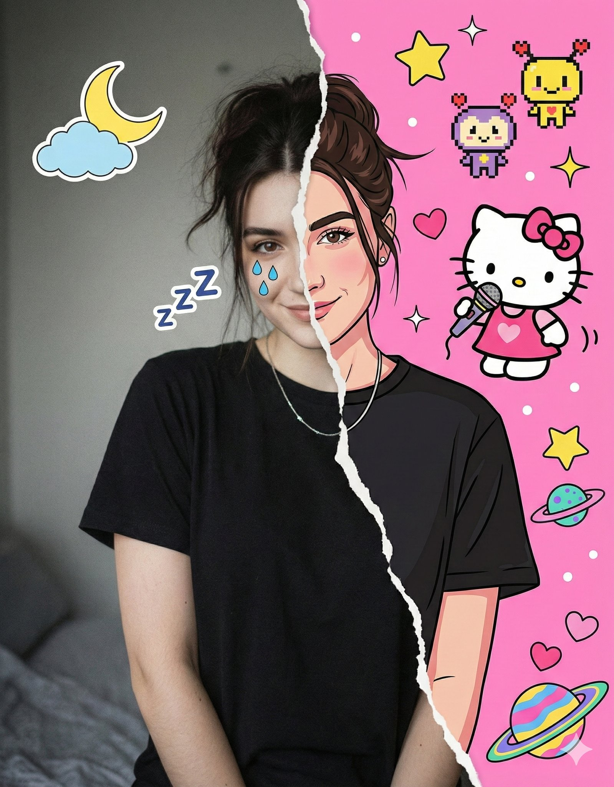
</div>

**提示词：**
```
{
  "image_generation": {
    "requirements": {
      "face_preservation": {
        "preserve_original": true,
        "accuracy_level": "100% identical to reference",
        "details": [
          "real facial proportions",
          "exact skin texture",
          "true eye shape and color",
          "natural soft makeup",
          "subtle upward eyeliner",
          "soft pink eyeshadow",
          "natural rosy lips"
        ]
      },
      "pose": {
        "match_reference_pose": true,
        "description": "Chest-up portrait, face facing forward but gently tilted to the right from the viewer’s perspective."
      },
      "lighting": {
        "match_reference_lighting": true,
        "type": "soft diffused indoor lighting",
        "direction": "from the front and slightly from the left",
        "shadows": "gentle soft shadows on the sides of the face and neck",
        "background_tone": "soft neutral with slight bluish tint"
      }
    },

    "subject": {
      "gender": "female",
      "hairstyle": {
        "match_reference": true,
        "description": "same exact hairstyle as in reference image"
      },
      "expression": "neutral, slightly thoughtful",
      "clothing": {
        "top": "simple black T-shirt",
        "necklace": "thin silver necklace with a small minimal pendant"
      }
    },

    "composition": {
      "frame": "chest-up portrait",
      "orientation": "frontal with slight rightward tilt",
      "style": "hyper-realistic with split real/cartoon effect"
    },

    "special_effects": {
      "split_effect": {
        "type": "irregular centered tear",
        "edges": "white angled torn-paper look",
        "description": "image appears ripped down the middle"
      },

      "realistic_side": {
        "background": "soft, neutral, slightly bluish environment",
        "filters": [
          "soft analog grain",
          "lightly aged texture",
          "reduced saturation",
          "subtle film imperfections"
        ],
        "overlays": [
          "blue stylized teardrop stickers below the left eye",
          "small 'Zzz' sleep symbols near forehead",
          "yellow crescent moon in upper-left corner",
          "light blue hand-drawn cloud"
        ]
      },

      "illustrated_side": {
        "art_style": "bold cartoon, digital illustration",
        "color_palette": "bright, vibrant, saturated",
        "hair": "same tone as realistic side but stylized",
        "eyes": "exaggerated eyeliner, dramatic expression",
        "background": "vibrant light pink pop-art style",
        "decorations": {
          "kawaii_elements": [
            "Hello Kitty holding a microphone",
            "pixel-art pink mascot character",
            "yellow stars",
            "pink hearts",
            "colorful planets",
            "bold pink Japanese characters"
          ]
        }
      }
    },

    "aesthetic": {
      "overall_tone": "soft, dreamy, lightly vintage",
      "lighting_consistency": "must match reference perfectly",
      "skin_texture_realism": "high",
      "blending_quality": "smooth, natural transition between real and illustrated halves with crisp tear edge"
    },

    "output": {
      "style": "hyper-realistic + digital cartoon fusion",
      "quality": "ultra-high-resolution",
      "filters": [
        "subtle analog vintage film filter",
        "soft grain"
      ]
    }
  }
}
```

**中文提示词：**
```
{
"image_generation": {
“要求”： {
"面保存": {
"preserve_original": true,
"accuracy_level": "与参考值100%相同"
“细节”： [
“真实的脸部比例”，
“精准的肌肤纹理”，
“真实的眼睛形状和颜色”，
“自然柔和的妆容”，
“淡淡的上扬眼线”，
“柔和的粉色眼影”，
“自然红润的嘴唇”
]
},
"姿势": {
"match_reference_pose": true,
“描述”：“胸部以上的肖像，脸部朝前，但从观看者的角度来看略微向右倾斜。”
},
“灯光”： {
"match_reference_lighting": true,
“类型”：“柔和漫射室内照明”，
“方向”：“从前方略偏左”，
“阴影”：“脸颊和颈部两侧柔和的阴影”，
"background_tone": "柔和的中性色，略带蓝色调"
}
},

“主题”： {
"性别": "女性",
"发型": {
"match_reference": true,
描述：与参考图中完全相同的发型
},
“表情”：“中性，略带沉思”
“衣服”： {
上衣：一件简单的黑色T恤，
“项链”： “带有小巧简约吊坠的细银项链”
}
},

“作品”： {
“画框”：“胸部以上肖像”，
“方向”: “正面略微向右倾斜”
“风格”：“超写实风格，带有真实/卡通分离效果”
},

"特效": {
"split_effect": {
“类型”：“不规则中心撕裂”，
“边缘”：“白色斜角撕纸效果”，
描述：图像似乎从中间撕裂开来
},

"realistic_side": {
“背景”：“柔和、中性、略带蓝色的环境”，
“过滤器”：[
“柔和的模拟颗粒”，
“略带陈旧的质感”，
“饱和度降低”，
“细微的胶片瑕疵”
],
“叠加层”：[
“左眼下方贴有蓝色水滴形贴纸”，
“额头附近有小小的‘Zzz’睡眠符号”，
“左上角的黄色新月”
“浅蓝色手绘云朵”
]
},

"illustrated_side": {
"art_style": "大胆的卡通，数字插画",
"color_palette": "明亮、鲜艳、饱和"
“头发”：“与写实风格相同，但风格化”，
“眼睛”：“夸张的眼线，戏剧性的表情”，
“背景”：“充满活力的浅粉色波普艺术风格”，
“装饰”： {
"kawaii_elements": [
“Hello Kitty 拿着麦克风”
“像素艺术粉色吉祥物角色”，
“黄色星星”，
“粉红色的心”，
“色彩斑斓的行星”，
“粗体粉色日文字符”
]
}
}
},

“审美的”： {
整体色调：柔和、梦幻、略带复古感
"lighting_consistency": "必须与参考完全一致",
"skin_texture_realism": "高",
"blending_quality": "真实部分与插图部分之间过渡平滑自然，撕裂边缘清晰"
},

“输出”： {
“风格”：“超写实+数字卡通融合”，
“质量”：“超高分辨率”，
“过滤器”：[
“微妙的模拟复古胶片滤镜”，
“软粒”
]
}
}
}
```

<a id="prompt-666"></a>
## 案例 666：极近距离的自拍照 (来源 [@IamEmily2050](https://x.com/IamEmily2050/status/1995065474749730989)) 模型：Nano banana pro

<div style="display: flex; justify-content: space-between;">
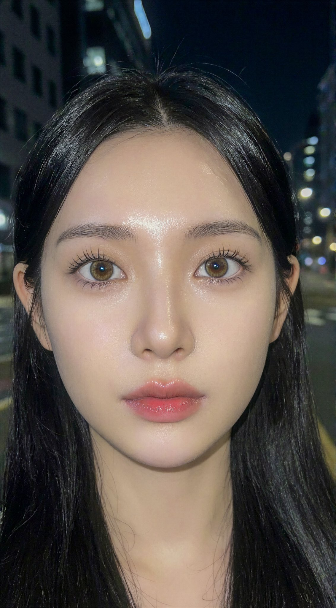
</div>

**提示词：**
```
{
  "intent": "Generate a hyper-idealized, 'Douyin-aesthetic' portrait of a young woman at night, utilizing direct flash photography to create a high-contrast, ethereal look with clear weather conditions.",
  "frame": {
    "aspect_ratio": "9:16",
    "composition": "Extreme close-up selfie framing (tighter than standard portrait), cutting off the top of the forehead to focus intensely on the eyes and lips. The subject is centered with a direct, confronting gaze.",
    "style_mode": "Flash photography, digital influencer aesthetic, soft-focus realism."
  },
  "subject": {
    "identity": "A young Asian woman, approximately 20 years old, with hyper-symmetrical, doll-like features characterized by the 'bunny tongue' and 'puppy eye' aesthetic.",
    "skin": "Pale, cool-toned porcelain complexion with zero texture. The skin reflects the flash, creating a 'mochi' or 'glass skin' effect that appears soft and translucent. High-key brightness on the T-zone.",
    "eyes": "Large, round eyes with a slight downward tint at the outer corners (puppy dog eyes). Prominent 'aegyosal' (under-eye fat bands) are highlighted to enhance youthfulness. The irises are soft brown with a large diameter. Eyelashes are styled in the 'manhwa' or 'idol' style: distinct, vertical clumps of mascara-coated lashes separated by space, rather than a dense fan.",
    "nose": "Petite, low-bridge nose with a small, rounded tip. The lighting minimizes the nostril definition, making the nose appear delicate and unobtrusive.",
    "mouth": "Heart-shaped lips featuring a 'gradient lip' technique. The center of the lips is a saturated, glossy strawberry pink, fading outward to a blurred, pale nude at the vermilion border. The texture is soft and hydrated.",
    "hair": "Long, silky jet-black hair with a straight texture. Without the snow, the hair is dry, sleek, and tucked slightly behind the ears or framing the face smoothly, catching the flash with a white sheen.",
    "wardrobe": "Minimal visibility, suggesting a stylish but casual top appropriate for a pleasant evening."
  },
  "environment": {
    "location": "Urban night setting.",
    "weather": "Clear, calm, and beautiful night weather. The atmosphere is clean and free of precipitation or fog.",
    "background": "A backdrop of deep black shadows punctuated by creamy, circular bokeh from distant city lights (streetlamps, neon signs). The background is significantly darker than the subject, ensuring the face is the sole focus."
  },
  "lighting": {
    "type": "Direct, frontal camera flash or high-intensity screen light.",
    "quality": "Hard but flattering light that flattens facial topography, eliminating shadows under the eyes and nose. This creates a 2D, illustrative quality common in high-end social media selfies.",
    "contrast": "High contrast between the brightly illuminated face and the pitch-black environment.",
    "catchlight": "Sharp, tiny pinpoint reflection in the center of the pupils from the flash."
  },
  "camera": {
    "sensor_format": "Smartphone main sensor simulation.",
    "lens": "24mm wide-angle lens. This focal length slightly exaggerates the size of the eyes and diminishes the size of the nose and face width, contributing to the 'baby face' proportion.",
    "aperture_depth_of_field": "f/1.8 to f/2.2, keeping the eyes and lips razor sharp while instantly blurring the ears and background.",
    "focus": "Critical focus on the eyelashes and iris texture."
  },
  "negative": {
    "content": "No snow, no rain, no wet hair, no masculine jawline, no skin texture, no pores, no heavy contouring, no western makeup style, no sunglasses, no hand near face.",
    "style": "No cinematic dramatic shadows (must be flat lit), no warm vintage tones, no painting, no illustration."
  }
}
```

**中文提示词：**
```
{
“意图”：“在晴朗的天气条件下，利用直接闪光灯摄影，在夜晚创作一张极具理想化、‘抖音美学’风格的年轻女性肖像，以营造高对比度、空灵的视觉效果。”
“框架”： {
"aspect_ratio": "9:16",
“构图”：“极近距离的自拍取景（比标准肖像照更近），裁掉额头顶部，将焦点集中在眼睛和嘴唇上。拍摄对象位于画面中心，目光直视前方。”
"style_mode": "闪光灯摄影、数码网红美学、柔焦写实主义。"
},
“主题”： {
“身份描述”：“一位大约20岁的年轻亚裔女性，拥有高度对称、娃娃般的五官，其特征是‘兔舌’和‘小狗眼’。”
“肌肤”：苍白、冷调的瓷白肤色，几乎没有纹理。肌肤反射闪光灯，呈现出“麻糬”或“玻璃肌”的效果，看起来柔和通透。T区高光突出。
“眼睛”：大而圆的眼睛，外眼角略微下垂（小狗眼）。突出的眼下脂肪纹（眼袋）增添了青春气息。虹膜呈柔和的棕色，直径较大。睫毛采用“漫画”或“偶像”风格：睫毛根根分明，呈垂直的簇状，涂抹睫毛膏，彼此之间留有空隙，而不是浓密的扇形。
“鼻子”：“小巧的鼻子，鼻梁较低，鼻尖小而圆润。光线柔和地弱化了鼻孔的轮廓，使鼻子看起来精致而不突兀。”
“唇部”：心形唇妆，采用渐变唇妆技术。唇部中央是饱满亮泽的草莓粉色，向外晕染至唇线边缘的浅裸色。质地柔软水润。
“头发”： “长长的、丝滑的乌黑直发。没有雪的时候，头发干燥顺滑，微微别在耳后或柔顺地垂在脸颊两侧，在闪光灯下泛着白色的光泽。”
“衣橱”：“低调的款式，暗示着一件时尚休闲的上衣，适合愉快的夜晚穿着。”
},
“环境”： {
“地点”：“都市夜景。”
天气：晴朗、平静、美丽的夜晚。大气洁净，无降水或雾。
“背景”：“深黑色的阴影背景中点缀着远处城市灯光（路灯、霓虹灯）投射出的柔和圆形散景。背景明显比主体暗，从而确保面部成为唯一的焦点。”
},
“灯光”： {
“类型”：“直接闪光灯、前置摄像头闪光灯或高强度屏幕闪光灯。”
“品质”：“硬朗但柔和的光线，使面部轮廓更加平滑，消除眼下和鼻下的阴影。这营造出一种二维的、插画般的质感，常见于高端社交媒体自拍中。”
“对比度”：“明亮的脸部与漆黑的环境形成鲜明对比。”
“眼神光”：“闪光灯照射到瞳孔中心时，形成的一个清晰、细小的点状反射光。”
},
“相机”： {
"sensor_format": "智能手机主传感器模拟。",
“镜头”：“24mm广角镜头。这种焦距会略微放大眼睛，缩小鼻子和脸部宽度，从而营造出‘娃娃脸’的比例。”
"aperture_depth_of_field": "f/1.8 至 f/2.2，保持眼睛和嘴唇清晰锐利，同时立即虚化耳朵和背景。"
“焦点”：“重点关注睫毛和虹膜的纹理。”
},
“消极的”： {
“内容”：“没有雪，没有雨，没有湿头发，没有男性化的下巴线条，没有皮肤纹理，没有毛孔，没有浓重的修容，没有西式妆容，没有太阳镜，没有手靠近脸部。”
“风格”：“禁止使用电影般的戏剧性阴影（必须采用平光），禁止使用温暖的复古色调，禁止使用绘画风格，禁止使用插画风格。”
}
}
```

<a id="prompt-665"></a>
## 案例 665：外卖员的写真照 (来源 [@songguoxiansen](https://x.com/songguoxiansen/status/1995385148792263095)) 模型：Nano banana pro

<div style="display: flex; justify-content: space-between;">
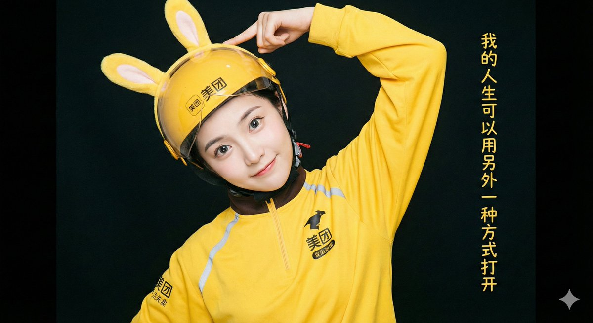
</div>

**中文提示词：**
```
在明亮的摄影棚内拍摄的半身写真。美丽的东亚女孩，有着如瓷娃娃般无瑕的肌肤和闪烁的大眼睛，正俏皮地歪着头，用手轻轻触碰头盔上的黄色兔耳朵。她穿着整套带有美团Logo的黄色外卖制服。采用柔和、均匀的商业摄影棚打光，营造出清新、活力的氛围，背景深暗，突出主体。在图片最右面搭配上一列文字“我的人生可以用另外一种方式打开”，字体与照片风格相近。
```

<a id="prompt-664"></a>
## 案例 664：多图风格参考 (来源 [@op7418](https://x.com/op7418/status/1995337868181717248)) 模型：Nano banana pro

<div style="display: flex; justify-content: space-between;">
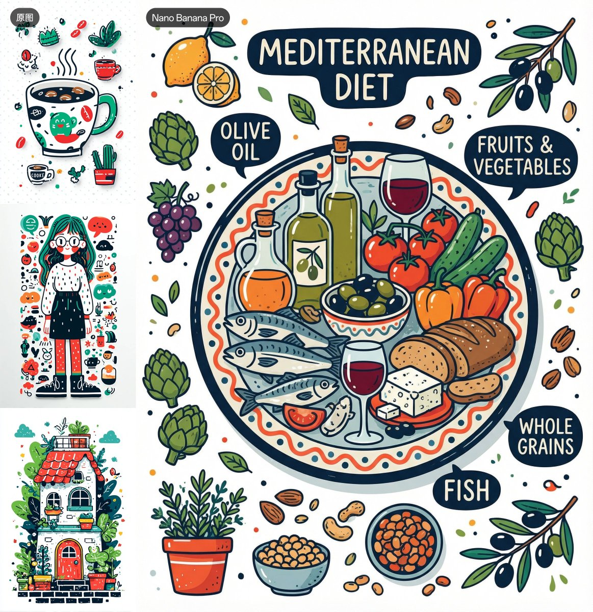
</div>

**中文提示词：**
```
请帮我参考这三张图片的风格，绘制一张地中海饮食示意图
```

<a id="prompt-663"></a>
## 案例 663：哆啦A梦讲课 (来源 [@oran_ge](https://x.com/oran_ge/status/1995075703084339500)) 模型：Nano banana pro

<div style="display: flex; justify-content: space-between;">
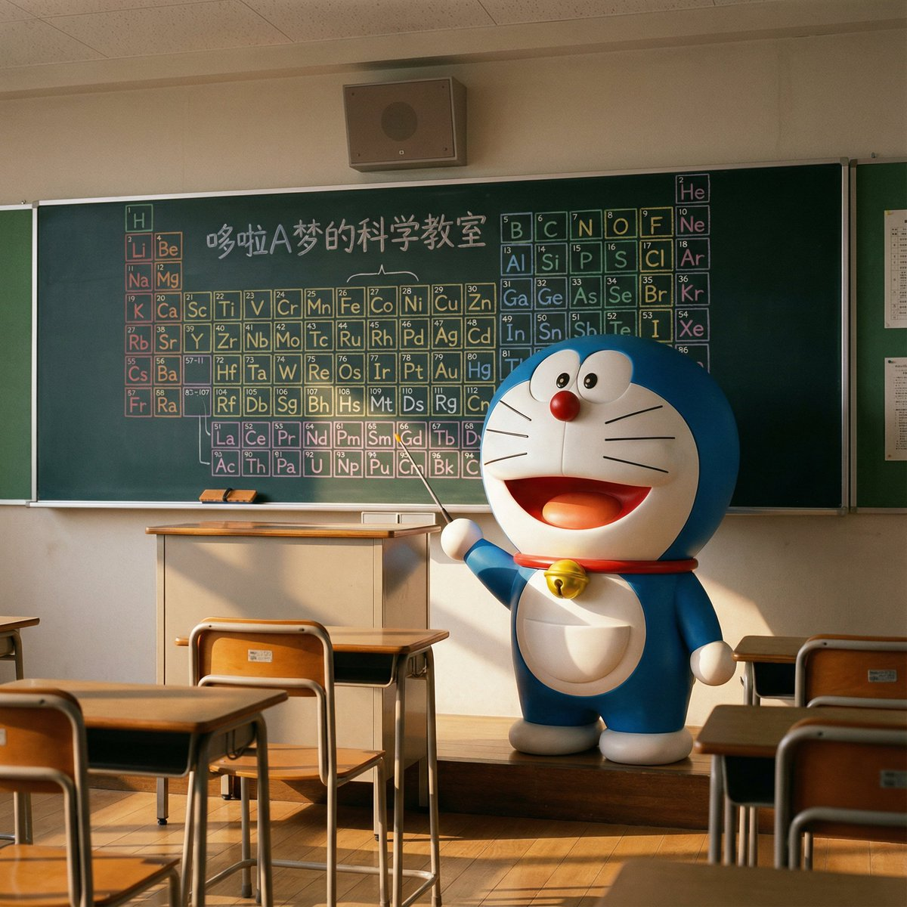
</div>

**中文提示词：**
```
我想要一张超真实的照片，但内容又有点超现实。感觉就像一个孩子放学后，偷偷从教室门缝里看到一个神奇的景象：哆啦A梦竟然真的在空无一人的教室里，像个小老师一样，认真地准备着化学课。 整个画面要非常写实，但又充满了童话般的温馨和惊奇。

画面内容

主体： 哆啦A梦本人，活生生地站在教室的讲台前面，而不是画在黑板上。他看起来是立体的，有光滑的质感，就像动画里走出来的一样，但又完美地融入了这个真实的环境里。
人物细节：哆啦A梦站在讲台旁，身体微微侧着，表情认真又亲切，仿佛在思考怎么给大雄他们讲课。
他的一只手拿着一根小小的教鞭，指向他身后的黑板。
他的黄色铃铛在教室的光线下有微微的反光，肚子上的四维口袋看起来鼓鼓的。

背景细节（黑板）：他身后的黑板上，画着一幅用各色粉笔手写的化学元素周期表。这个周期表看起来就像是哆啦A梦刚刚亲手画上去的，色彩丰富，带有一点可爱的风格。
可以用不同颜色的粉笔（比如黄色、蓝色、粉色）来区分不同的元素区域，让整个画面色彩更丰富。

文字： 在黑板的顶上或者角落，用可爱的粉笔字体写上标题：“哆啦A梦的科学教室”。
环境与构图
场景： 一间普通的日本教室，桌椅摆放整齐，夕阳的余晖从窗户照进来，营造出一种安静、温暖的氛围。
构图： 画面比例是4:3。从学生的座位视角看过去，哆啦A梦和讲台在画面的中心位置。
前景： 画面最前面可以带到一两张学生的课桌椅，让视角更具代入感。讲台上可以放着一盒彩色粉笔和一个黑板擦。
风格和技术要求
风格： 照片写实主义。关键在于真实的环境和光影，与哆啦A梦这个动漫角色的奇妙结合。

光线： 温暖的午后自然光从窗户斜射进来，光线要自然地打在哆啦A梦身上，在他圆滚滚的身体上形成柔和的光影和高光，让他看起来有体积感，并且在他的脚边投下淡淡的影子，这能让他看起来更真实。
焦点： 焦点要清晰地对准哆啦A梦，黑板上的内容也很清楚，但前景的课桌可以稍微有点模糊。
千万不要出现！
不要让哆啦A梦看起来像个塑料玩具或模型，他得是活的。

不要有其他任何人物，特别是大雄、静香他们。
不要把画风变成动画截图或纯CG，一定要是照片的感觉。
构图要稳，不要用奇怪的低角度或鱼眼镜头。
颜色别太鲜艳，要符合真实光线下的色彩。
```

<a id="prompt-662"></a>
## 案例 662：城市地标做成的蛋糕 (来源 [@lxfater](https://x.com/lxfater/status/1995341321343815694)) 模型：Nano banana pro

<div style="display: flex; justify-content: space-between;">
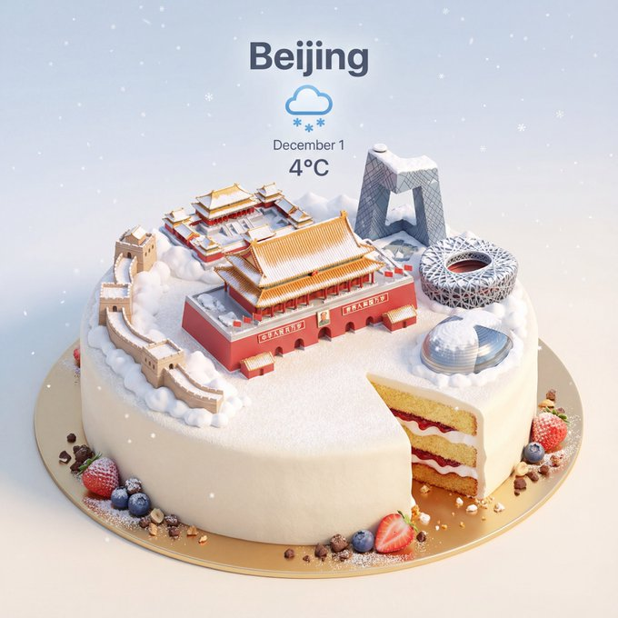
</div>

**中文提示词：**
```
在一个精致的圆形奶油蛋糕顶部，以清晰的 45° 俯视等距视角呈现 [城市名] 的微缩 3D 卡通城市场景，好像这座城市是放在蛋糕上的立体装饰。蛋糕完整可见，包括蛋糕顶部、边缘和部分侧面，底部有金色圆形蛋糕托盘。
将 [核心地标名] 放在画面正中央，体量明显大于其他建筑，成为整个画面的视觉焦点，其余城市地标围绕它环形排布，高度略低，形成从中心向外的层级感。
必须包含 [城市其他代表建筑列表，写 3–5 个即可]，以可爱但细节清晰易辨认的微缩风格绘制。蛋糕表面作为城市地面，周围点缀水果（草莓、蓝莓、橙片等）、巧克力碎和坚果碎。可以在蛋糕一侧切掉一块，露出内部分层结构，强化“好吃感”。
整个场景处于 [天气类型，例如：飘雪的冬日、雨夜、炎热晴天、海边微风天气]。天空和光线清晰表现这种天气，同时让天气以甜品的形式作用在蛋糕上：
[天气效果 1：例如“雪像糖霜覆盖在屋顶和蛋糕表面”]
[天气效果 2：例如“雨像糖浆和糖珠，形成光亮流动的质感”]
[天气效果 3：例如“阳光让奶油微微融化并产生柔和高光”]
使用柔和而精致的纹理、逼真的 PBR 材质，以及柔和、真实的光影效果，3D isometric，细节丰富。
在画面顶部中央，用大号加粗英文标题 “[CityName]”，其下方放置一个清晰的天气图标，再下面是日期（小号文字）和气温（中号文字）。所有文字须居中排列，间距统一，可以轻微与中央地标顶部产生叠加但不遮挡主要轮廓。整体构图干净、极简，背景为柔和纯色或轻微渐变。方图 1080x1080，高分辨率，超细节，soft lighting, global illumination, cinematic.
```

<a id="prompt-661"></a>
## 案例 661：根据经纬度生成的航拍图像 (来源 [@KusoPhoto](https://x.com/KusoPhoto/status/1995251500973785166)) 模型：Nano banana pro

<div style="display: flex; justify-content: space-between;">
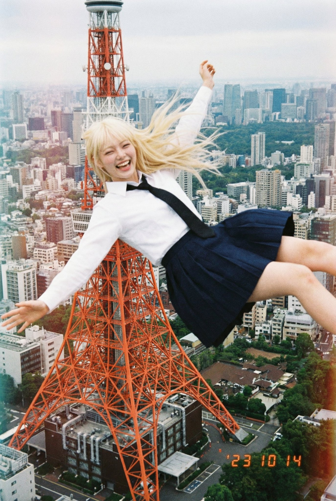
</div>

**中文提示词：**
```
创建一张与纬度 35.658807120369914, 139.74540071108495 所在位置上空天空融为一体的航拍图像。使指定的人物看起来像是从该位置落下一样融入图像中。一个面带微笑、看起来很快乐的人。一张用低分辨率一次性相机拍摄的普通日常照片。一张由日本高中生拍摄的粗糙照片。
```

<a id="prompt-660"></a>
## 案例 660：现代前卫的女生特写 (来源 [@rovvmut_](https://x.com/rovvmut_/status/1995146612885410093)) 模型：Nano banana pro

<div style="display: flex; justify-content: space-between;">
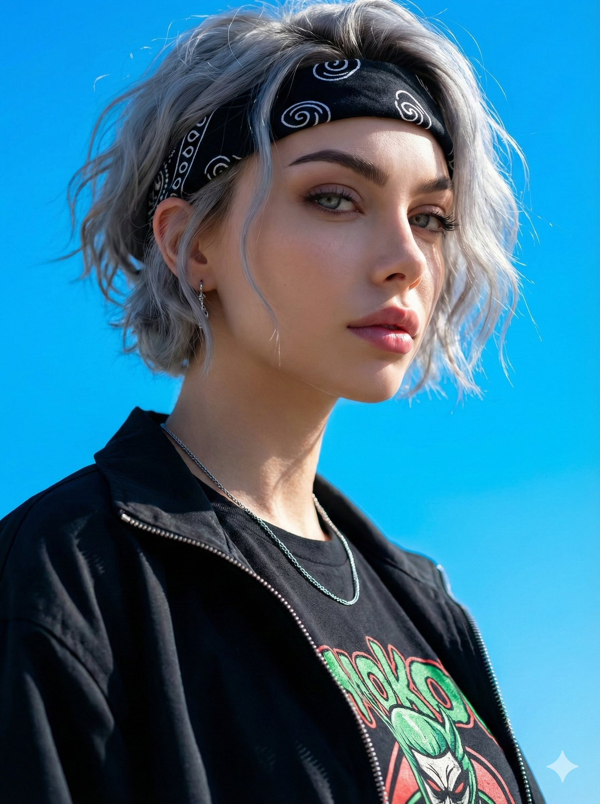
</div>

**提示词：**
```
{
  "objective": "Generate an image based on a detailed character portrait description.",
  "image_generation_prompt": {
    "subject": {
      "gender": "female",
      "portrait_type": "close-up",
      "angle": "side angle",
      "aesthetic": "edgy, modern, mysterious, confident, slightly provocative"
    },
    "appearance": {
      "hair": {
        "color": "light gray",
        "length": "short",
        "texture": "wavy",
        "style": "modern, slightly messy, partially covering forehead"
      },
      "face": {
        "skin_tone": "fair",
        "features": "sharp",
        "eyebrows": "straight, neat, dark",
        "lips": "naturally pink with a slight sheen"
      },
      "expression": "calm but intense"
    },
    "clothing_and_accessories": {
      "headwear": "black bandana with white swirl patterns",
      "outfit": {
        "jacket": "black zip-up jacket, left open",
        "inner_shirt": "black T-shirt with green and red graphic art on the chest"
      },
      "jewelry": {
        "neck": "thin silver chain",
        "ear": "small silver earring"
      }
    },
    "lighting_and_background": {
      "lighting": "front light highlighting facial features and outfit",
      "background": "bright blue sky"
    },
    "style": {
      "vibe": "striking and stylish",
      "focus": "expression and trendy fashion details",
      "mood": "modern and edgy"
    },
    "aspect_ratio": "3:4"
  },
  "response_format": "Use this JSON object as the structure for an image generation model prompt."
}
```

**中文提示词：**
```
{
“目标”：“根据详细的人物肖像描述生成图像。”
"image_generation_prompt": {
“主题”： {
"性别": "女性",
"portrait_type": "特写",
"角度": "侧角",
“美学”：前卫、现代、神秘、自信、略带挑衅性
},
“外貌”： {
“头发”： {
颜色：浅灰色，
"长度": "短",
“纹理”：“波浪状”，
“风格”：“现代，略显凌乱，部分遮住额头”
},
“脸”： {
"skin_tone": "fair",
“特点”：“锐利”，
“眉毛”：“笔直、整齐、浓密”，
“嘴唇”：“自然粉嫩，略带光泽”
},
“表情”：“平静而专注”
},
"服装和配饰": {
“头饰”：“带有白色漩涡图案的黑色头巾”，
“全套服装”： {
“外套”：“黑色拉链外套，敞开着”，
"inner_shirt": "胸前印有绿色和红色图案的黑色T恤"
},
“珠宝”： {
“脖子”： “细银链”，
“耳朵”: “小银耳环”
}
},
"lighting_and_background": {
“照明”：“正面灯光突出面部特征和服装”，
“背景”：“湛蓝的天空”
},
“风格”： {
“氛围”：“引人注目且时尚”，
“重点”：“表达和潮流时尚细节”，
“氛围”：“现代前卫”
},
"aspect_ratio": "3:4"
},
"response_format": "使用此 JSON 对象作为图像生成模型提示的结构。"
}
```

<a id="prompt-659"></a>
## 案例 659：年轻女性的超近特写肖像 (来源 [@Just_sharon7](https://x.com/Just_sharon7/status/1995108671026803004)) 模型：Grok

<div style="display: flex; justify-content: space-between;">
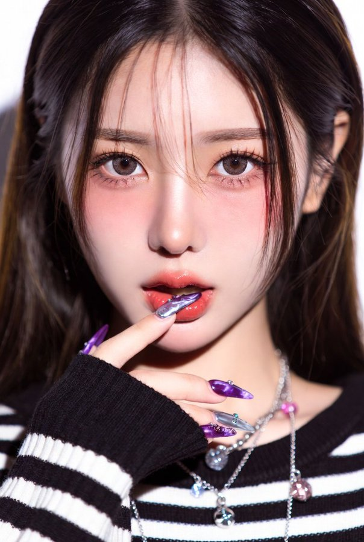
</div>

**提示词：**
```
{
  "prompt": "Ultra-close-up portrait of a stunning young East Asian woman with flawless porcelain skin, large sparkling dark brown eyes with long lashes, subtle pink blush, glossy red-tinted lips, long straight silky dark brown hair with subtle highlights, making a playful finger-frame gesture around one eye with both hands, extremely detailed long almond-shaped nails with glossy purple-marble and silver chrome galaxy nail art with tiny rhinestones, wearing black-and-white horizontal striped oversized knit sweater with ribbed cuffs, layered delicate silver necklaces with crystal pendants and small pink gems, soft studio lighting with bright white seamless background, high-fashion beauty editorial style, razor-sharp details, perfect skin texture with natural glow, shallow depth of field, shot on 85mm lens f/1.4, ultra-realistic photorealism, 8k, masterpiece, best quality",
  "negative_prompt": "blurry, low resolution, deformed hands, extra fingers, missing fingers, bad anatomy, ugly nails, cheap makeup, overexposed, underexposed, text, watermark, logo, cartoon, 3d render, plastic skin, doll face, cross-eyed, distorted proportions, old, child",
  "steps": 60,
  "cfg_scale": 7.5,
  "sampler": "DPM++ 2M Karras",
  "width": 832,
  "height": 1216,
  "seed": -1
}
```

**中文提示词：**
```
{
“提示”：一位令人惊艳的年轻东亚女性的超近特写肖像，她拥有完美无瑕的瓷白肌肤、闪亮的大眼睛（深棕色）、纤长的睫毛、淡淡的粉色腮红、光泽红润的嘴唇、柔顺的深棕色长直发（带有微妙的挑染），双手俏皮地用手指勾勒着一只眼睛，修长的杏仁形指甲上点缀着闪亮的紫色大理石纹和银色铬星空图案，并镶嵌着细小的水钻，细节极其精致。她身穿黑白横条纹宽松针织衫，袖口饰有罗纹，佩戴着层叠的精致银项链，项链上缀有水晶吊坠和粉色小宝石。柔和的影棚灯光，搭配明亮的白色背景，呈现出高级时尚美妆大片的风格，细节清晰锐利，肌肤纹理完美，散发着自然光泽，浅景深效果，使用85mm f/1.4镜头拍摄，超逼真的照片级写实效果，8K分辨率，杰作，最佳品质。
"negative_prompt": "模糊、低分辨率、手部畸形、多余手指、缺指、解剖结构错误、指甲难看、妆容廉价、曝光过度、曝光不足、文字、水印、标志、卡通、3D渲染、塑料皮肤、娃娃脸、斗鸡眼、比例失调、老旧、儿童",
“步骤”：60，
"cfg_scale": 7.5，
"采样器": "DPM++ 2M Karras",
宽度：832，
“高度”：1216，
“种子”：-1
}
```

<a id="prompt-658"></a>
## 案例 658：3x3大头贴风格拼贴画 (来源 [@KusoPhoto](https://x.com/KusoPhoto/status/1995336530286797271)) 模型：Nano banana pro

<div style="display: flex; justify-content: space-between;">
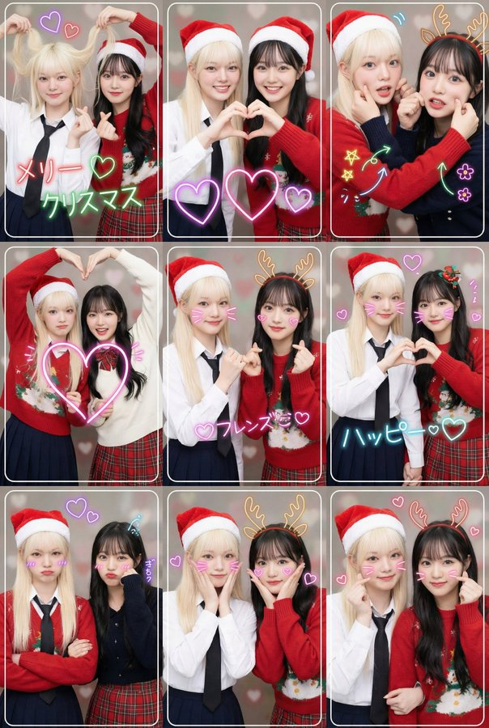
</div>

**中文提示词：**
```
主题和形式：两位年轻女性朋友创作的高分辨率现代日本大头贴风格拼贴画。
布局：由 3x3 网格组成的单个图像（共 9 帧）。
主题：圣诞节 风格：生动、全彩、明亮、动感地再现现代日本大头贴灯光效果。
背景：简单的纯色或主题色背景（带有小爱心等精致装饰）。
摄影特点：每幅画面都有一条细细的白色或装饰性边框。景深浅（虚化）。

主题和姿势：
两位年轻的女性朋友，穿着符合主题的搭配服装。
生动、活泼、明快的表达。
这九张图清晰地描绘了以下列表中九种不同的流行大头贴姿势。

9 种不同的姿势（3x3 网格）：
第一行：
“抓头发爱心”姿势：一人俏皮地抓着头发，另一人用双手比出一个小爱心。两人都面带笑容。
“双手心形”姿势：两位伴侣用双手在中心形成一个大大的心形。脸上洋溢着灿烂快乐的笑容。
“捏手臂”姿势：两人双臂交叉，其中一人或两人都轻轻捏着对方的脸颊或手臂。表情生动活泼，充满喜悦。特写镜头展现对方的脸部。

第二排：4.“双臂交叉大爱心”姿势：两人双臂交叉，用空着的那只手比出一个大大的爱心。笑容灿烂而充满活力。5.“承诺之心”姿势：一人做出“手指发誓”的手势，另一人用手比出一个小爱心。笑容俏皮而温暖。6.“手牵手爱心”姿势：两人手牵手，各自用空着的那只手比出半个爱心，组成一个完整的爱心。笑容温柔甜美。

第三排：7.“双臂交叉撅嘴”姿势：两人双臂交叉，略带夸张的撅嘴或“得意”（或严肃）的表情，似乎在强忍着笑意。8.“双手合十，脸颊贴心”姿势：两人手牵着手，双手分别放在脸颊上，在脸颊周围画出一个心形。笑容可爱迷人。9.“双臂交叉，手心相印”姿势：两人双臂交叉，每人用一只手分别画出一个小的心形。笑容自信而时尚。特写镜头展现了他们的脸部。

其他装饰：
多个发光的霓虹心形图案叠加。
每一帧画面上，都以霓虹灯风格，沿着脸部的外轮廓写着与主题相关的字母。
在每个面板上添加多个符合主题的不同霓虹线条艺术涂鸦（例如星星、箭头、饱和线条、花朵、动物耳朵等）。
主要限制：所有9张照片必须保持主体、服装、背景风格和光线的严格一致性。浅景深，这是大头贴的典型特征。
请勿：添加任何文字、徽标、标签、水印、符号、数字或其他任何类型的文本元素（上述指定的文本元素和霓虹线条艺术涂鸦除外）。
```

<a id="prompt-657"></a>
## 案例 657：身着西装的女子摆出嫌犯照姿势 (来源 [@xmiiru_](https://x.com/xmiiru_/status/1995344587750072496)) 模型：Nano banana pro

<div style="display: flex; justify-content: space-between;">

</div>

**提示词：**
```
{
  "title": "Hyper-Realistic Portrait: Suited Woman in Mugshot Pose",
  "description": "A high-resolution hyper-realistic 8K HD portrait photograph captured with a professional DSLR camera using a 50mm lens for natural depth of field and razor-sharp focus. Full-body composition mimicking an old-fashioned mugshot/police booking photo.",
  "subject": {
    "type": "woman",
    "features": {
      "likeness_reference": "attached image",
      "height": "tall",
      "build": "elegant",
      "facial_features": {
        "jawline": "sharp",
        "eyes": "intense",
        "expression": "confident, slightly smug smirk"
      },
      "pose": "leaning against wall, one knee bent"
    },
    "hair": {
      "style": "neat, straight, wavy or elegant updo",
      "appearance": "natural and well-groomed"
    },
    "clothing": {
      "jacket": "vintage-style tailored dark pinstripe suit jacket",
      "inner_garment": "none",
      "tie": "slightly loosened, dark shade matching jacket",
      "accessories": [
        {
          "type": "mugshot board",
          "text": {
            "name": "MIRA",
            "date": "17/5/62"
          }
        },
        {
          "type": "shoe",
          "description": "single shiny dark-colored high-heeled shoe in right hand",
          "material": "patent leather"
        }
      ]
    }
  },
  "background": {
    "style": "naturally blurred bokeh",
    "texture": "slightly gritty studio wall",
    "details": {
      "height_chart": "vertical lines with numerical markings 2'0\" to 6'6\"",
      "color_tone": "desaturated, slightly sepia-toned archival photograph aesthetic"
    }
  },
  "lighting": {
    "type": "clean, soft, balanced",
    "shadow": "accurate shadows and highlights",
    "direction": "strong overhead or frontal lighting emphasizing dramatic shadows and height chart lines"
  },
  "framing": {
    "resolution": "1080x1350px (4:5)",
    "focus": "sharp subject focus",
    "composition": "full figure and mugshot details",
    "color_accuracy": "professional, natural tones"
  },
  "style": "Hyper-realistic photography, 8K clarity, DSLR quality, accurate color grading, natural lens blur, vintage photo aesthetic, true-to-life detail",
  "watermark": "© xmiiru",
  "negative_prompt": [
    "No anime",
    "No cartoon",
    "No digital painting",
    "No illustration",
    "No 3D render",
    "No CGI",
    "No stylized features",
    "No plastic/doll-like skin",
    "No fantasy glow",
    "No cinematic effects",
    "No airbrushed smoothing",
    "No overexposure",
    "No unnatural blur",
    "No video-game/Unreal Engine style",
    "No sketch",
    "No artificial lighting effects",
    "No unrealistic proportions/textures",
    "No multiple shoes",
    "No modern background elements"
  ]
}
```

**中文提示词：**
```
{
标题：超写实肖像：身着西装的女子摆出嫌犯照姿势
“描述”：“这是一张高分辨率、超逼真的 8K 高清人像照片，使用专业数码单反相机和 50mm 镜头拍摄，以获得自然的景深和极其清晰的焦点。全身构图模仿了老式的嫌犯照/警局登记照。”
“主题”： {
类型： 女，
“特征”： {
"likeness_reference": "附加图像",
“身高”：“高”，
“建造”：“优雅”，
"facial_features": {
下颌线：尖锐，
“眼睛”：“专注”，
“表情”：“自信、略带自负的微笑”
},
姿势：倚靠在墙上，单膝弯曲
},
“头发”： {
“发型”：“整齐、笔直、波浪或优雅的盘发”，
“外表”：“自然且仪容整洁”
},
“衣服”： {
“外套”： “复古风格的深色细条纹修身西装外套”，
"内衣": "无",
领带：略微松开，深色，与外套相配。
“配件”： [
{
类型： '嫌犯照片板'，
“文本”： {
"name": "MIRA",
日期： 17/5/62
}
},
{
类型：鞋子，
描述：右手拿着一只闪亮的深色高跟鞋。
材质：漆皮
}
]
}
},
“背景”： {
“风格”：“自然模糊散景”，
“纹理”：“略带颗粒感的摄影棚墙面”，
“细节”： {
"身高图": "带有数字标记的垂直线，从 2'0\" 到 6'6\"",
"color_tone": "褪色、略带棕褐色调的档案照片美学"
}
},
“灯光”： {
“类型”：“干净、柔和、平衡”，
“阴影”：“精确的阴影和高光”，
“方向”：“强烈的顶光或正面照明，强调戏剧性的阴影和高度图线条”
},
"框架": {
“分辨率”：“1080x1350像素（4:5）”
“焦点”: “清晰的主体焦点”，
“构图”：“全身像和嫌犯照细节”，
"color_accuracy": "专业、自然的色调"
},
“风格”：“超逼真的摄影，8K 清晰度，单反画质，精准的色彩分级，自然的镜头虚化，复古照片美学，逼真的细节”，
“水印”： “ © xmiiru”，
"negative_prompt": [
“没有动漫”，
“没有卡通片”，
“没有数码绘画”，
“无插图”
“没有3D渲染图”，
“无电脑特效”
“没有风格化的特征”，
“没有塑料/娃娃般的皮肤”，
“没有梦幻般的光芒”，
“没有电影特效”，
“没有使用喷枪进行平滑处理”，
“没有过度曝光”，
“没有不自然的模糊效果”，
“没有电子游戏/虚幻引擎风格”，
“没有草图”，
“无人工照明效果”，
“没有不切实际的比例/纹理”，
“禁止穿多双鞋”
“无现代背景元素”
]
}
```

<a id="prompt-656"></a>
## 案例 656：女人的自拍照 (来源 [@YaseenK7212](https://x.com/YaseenK7212/status/1994815950856552898)) 模型：Nano banana pro

<div style="display: flex; justify-content: space-between;">
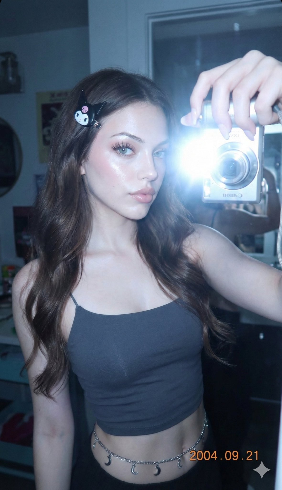
</div>

**提示词：**
```
{
  "image_generation_request": {
    "constraints": {
      "preservation_instruction": "Please keep my face 100% the same, do not change any facial details.",
      "strictness": "Critical"
    },
    "technical_specifications": {
      "camera_device": "Canon IXY/IXUS digital camera",
      "aesthetic_style": [
        "Y2K Digital Aesthetic",
        "Cyber Ulzzang",
        "Retro Japan–Korea look",
        "Early 2000s digital photograph"
      ],
      "lighting": {
        "source": "Strong front flash",
        "target": "Directly on face",
        "characteristics": "Bright white",
        "effect_on_skin": [
          "Radiant",
          "Shiny",
          "Bright"
        ]
      },
      "visual_grading": {
        "contrast": "High",
        "color_tone": "Slight cool blue",
        "atmosphere": [
          "Mysterious",
          "Sharp"
        ]
      }
    },
    "composition": {
      "type": "Portrait",
      "meta_scene_element": "A reflection in the mirror shows another woman's hand taking the photo of the model"
    },
    "subject_details": {
      "demographics": "Teenage girl",
      "physical_appearance": {
        "hair": {
          "color": "Dark brown",
          "texture": [
            "Long",
            "Soft",
            "Wavy"
          ],
          "accessory": "Sanrio Kuromi hair clip"
        },
        "eyes": {
          "description": "Bright",
          "contacts": "Blue-grey contact lenses"
        },
        "skin": {
          "base_tone": "Fair",
          "undertone": "Slightly pink toned",
          "complexion": [
            "Rosy glow",
            "Smooth"
          ]
        },
        "body_features": "Clear, shapely waistline"
      },
      "attire_and_accessories": {
        "top": "Dark grey spaghetti strap crop top",
        "belt": {
          "style": "Waist belt",
          "material": "Silver chain",
          "details": "Dangling moon charms"
        }
      },
      "makeup": {
        "general_style": "Light pink makeup",
        "lashes": "Long eyelashes",
        "additional_descriptors": "thin and"
      }
    }
  }
}
```

**中文提示词：**
```
{
"image_generation_request": {
"约束条件": {
"保存说明": "请100%保持我的脸部原貌，不要改变任何面部细节。"
“严格性”： “关键”
},
"technical_specifications": {
"camera_device": "佳能 IXY/IXUS 数码相机",
"aesthetic_style": [
“Y2K 数字美学”
“Cyber​​ Ulzzang”
“复古日韩风”
“2000 年代初期的数码照片”
],
“灯光”： {
“来源”：“强前闪光”，
“目标”：“直接作用于面部”，
“特性”：“亮白色”，
"effect_on_skin": [
“光芒四射”，
“闪亮的”，
“明亮的”
]
},
"visual_grading": {
“对比度”：“高”，
"color_tone": "略带冷蓝色",
“气氛”： [
“神秘”，
“锋利的”
]
}
},
“作品”： {
“类型”：“肖像”，
"meta_scene_element": "镜子中的倒影显示另一只女人的手正在给模特拍照"
},
"subject_details": {
“人口统计信息”：“少女”，
"physical_appearance": {
“头发”： {
“颜色”：“深棕色”，
“质地”： [
“长的”，
“柔软的”，
“波浪状”
],
“配饰”： “三丽鸥库洛米发夹”
},
"眼睛": {
描述：明亮，
“隐形眼镜”： “蓝灰色隐形眼镜”
},
“皮肤”： {
"base_tone": "Fair",
“底色”： “略带粉色调”
“肤色”：[
“玫瑰色的光芒”，
“光滑的”
]
},
"body_features": "清晰、优美的腰线"
},
"服装和配饰": {
上衣：深灰色细肩带露脐上衣，
“腰带”： {
“款式”：“腰带”，
“材质”：“银链”，
详情：垂坠的月亮吊坠
}
},
“化妆品”： {
"general_style": "浅粉色妆容",
“睫毛”： “长长的睫毛”，
"additional_descriptors": "thin and"
}
}
}
}
```

<a id="prompt-655"></a>
## 案例 655：Google DeepMind进行一次物品整齐排列展示 (来源 [@NanoBanana](https://x.com/NanoBanana/status/1993311207714177251)) 模型：Nano banana pro

<div style="display: flex; justify-content: space-between;">
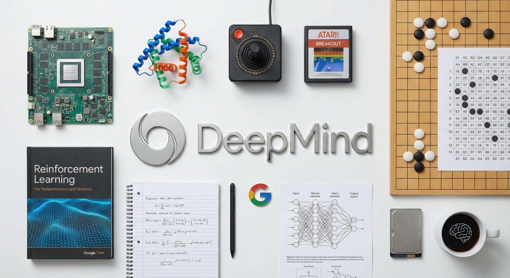
</div>

**提示词：**
```
A knolling for Google DeepMind
```

**中文提示词：**
```
为谷歌深度思维（Google DeepMind）进行一次物品整齐排列展示
```

<a id="prompt-654"></a>
## 案例 654：人手拿着一颗巨大的竖式药丸的特写镜头 (来源 [@ShreyaYadav___](https://x.com/ShreyaYadav___/status/1995145004269068406)) 模型：Nano banana pro

<div style="display: flex; justify-content: space-between;">
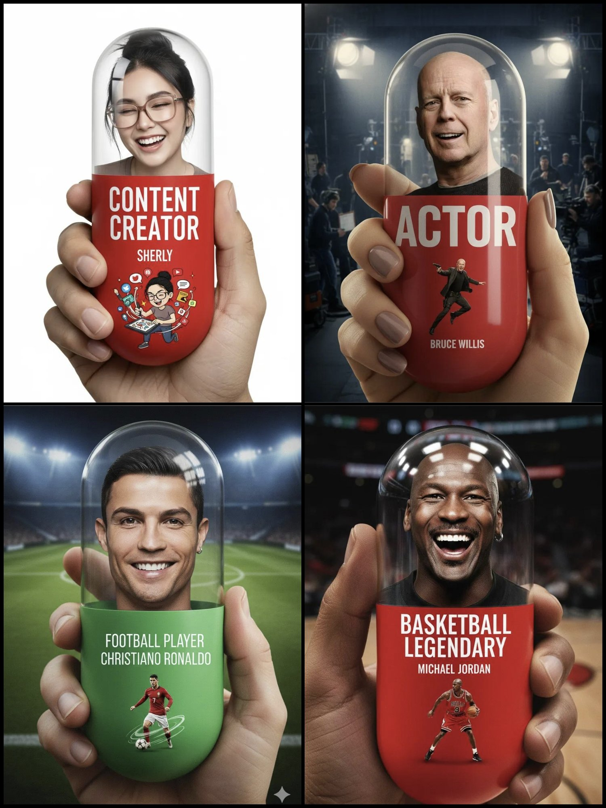
</div>

**提示词：**
```
Extreme close-up of a human hand holding a giant vertical pill.
The pill has a clear glass top section and the lower 3/4 is matte bright-red, with bold, clean, perfectly aligned typography that reads: BASKETBALL LEGENDARY.
Inside the pill, show a person whose face must match the attached photo 100% exactly — no changes to facial structure, proportions, expression baseline, or any detail. The face must display a natural, realistic, wide laughing expression.
Inside the pill, the person is performing a dynamic basketball dribbling pose with high energy, labeled with the account name 'MICHAEL JORDAN'.
Scene style: funny, chaotic, thrilling, slightly creepy, and intense.
Background: an NBA basketball court, with full cinematic lighting, dramatic shadows, and rich color depth.
Camera angle: aerial extreme close-up focused on the pill in the hand.
Texture: ultra-HD realism with fine grain, crisp micro-details, glass reflections, and smooth matte material fidelity.
Ratio 3:4.
Ensure motion, energy, and dynamic movement inside the pill while keeping the pill perfectly vertical.
```

**中文提示词：**
```
人手拿着一颗巨大的竖式药丸的特写镜头。”
该药丸顶部为透明玻璃部分，底部 3/4 为哑光亮红色，上面印有醒目、清晰、完美对齐的字体：篮球传奇。
药丸内显示一个人的脸，该人的脸必须与附图100%完全一致——面部结构、比例、表情基线或任何细节都不得更改。该脸必须展现出自然、逼真、开怀大笑的表情。
药丸内，一个人摆出充满活力的篮球运球姿势，并标有账号名称“迈克尔·乔丹”。
场景风格：滑稽、混乱、惊险、略带诡异、紧张。
背景：NBA篮球场，采用全电影级灯光、戏剧性的阴影和丰富的色彩深度。
拍摄角度：航拍，特写镜头聚焦于手中的药丸。
纹理：超高清真实感，颗粒细腻，微细节清晰，玻璃反射效果逼真，哑光材质质感细腻。
比例 3:4。
“确保药丸内部具有运动、能量和动态特性，同时保持药丸完全垂直。
```

<a id="prompt-653"></a>
## 案例 653：超写实的旅行广告 (来源 [@TechieBySA](https://x.com/TechieBySA/status/1994840773855203512)) 模型：Nano banana pro

<div style="display: flex; justify-content: space-between;">
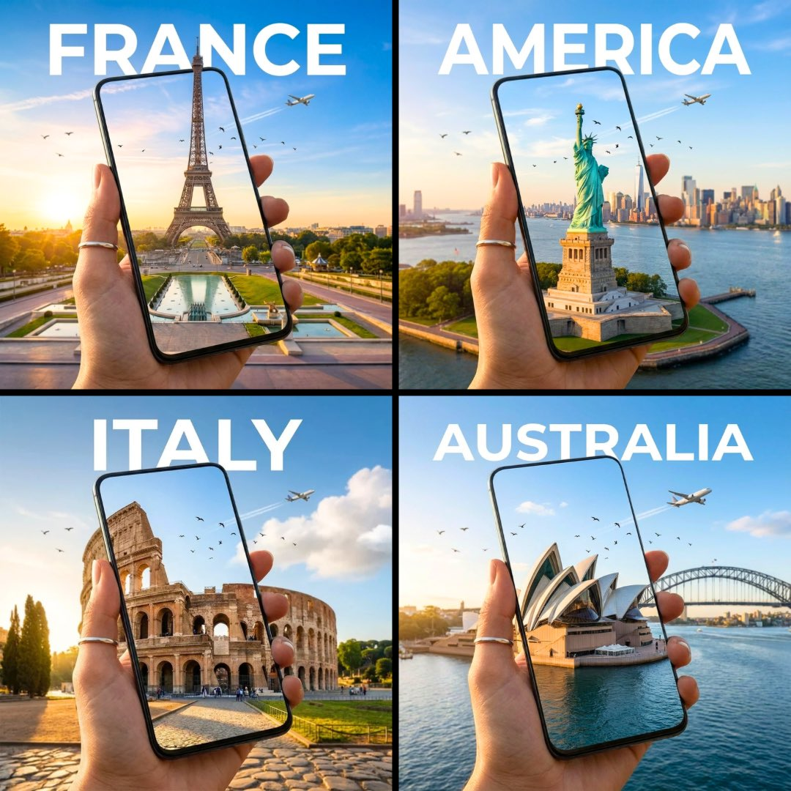
</div>

**提示词：**
```
A hyper-realistic travel advertisement in square format (1080x1080), featuring a hand holding a sleek, ultra-thin smartphone or tablet in portrait orientation, tilted slightly sideways to create a striking 3D portal effect. The screen displays a high-resolution image of an iconic landmark from [COUNTRY], which continues into the real background, blending seamlessly. The landmark appears to emerge from the screen. Birds fly nearby and a commercial airplane passes through a bright blue sky with soft white clouds. Bold, clean sans-serif text reading “[COUNTRY]” is placed prominently above. The lighting is warm and natural, casting soft shadows across the landscape. The surroundings reflect the region’s natural environment (like meadows, coastlines, or city skylines). The device is glossy and minimal-bezel, enhancing realism and depth.
```

**中文提示词：**
```
这是一则超写实的旅行广告，采用正方形格式（1080x1080），画面中一只手竖屏握着一部纤薄时尚的智能手机或平板电脑，略微侧倾，营造出引人注目的3D立体效果。屏幕上显示着[国家/地区]标志性地标的高分辨率图像，图像与真实背景无缝融合，仿佛从屏幕中浮现出来一般。附近有鸟儿飞翔，一架商用飞机掠过湛蓝的天空，朵朵白云点缀其间。醒目的无衬线字体“[国家/地区]”位于上方。温暖自然的灯光在画面上投下柔和的阴影。周围环境反映了该地区的自然环境（例如草地、海岸线或城市天际线）。设备采用光滑的超窄边框设计，进一步增强了画面的真实感和立体感。
```

<a id="prompt-652"></a>
## 案例 652：人物的电影级逼真图像 (来源 [@rovvmut_](https://x.com/rovvmut_/status/1995087450788573215)) 模型：Nano banana pro

<div style="display: flex; justify-content: space-between;">
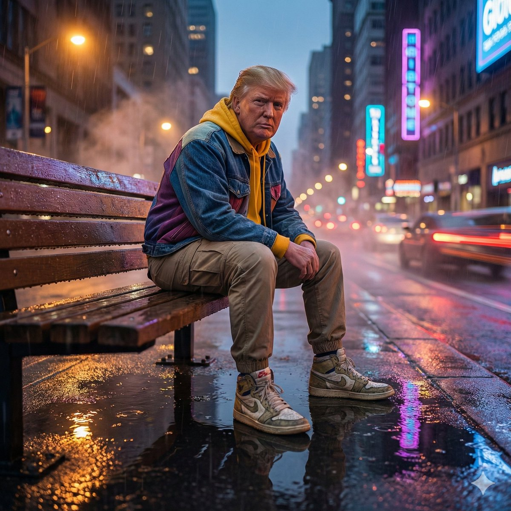
</div>

**提示词：**
```
{
  "objective": "Generate a cinematic, photo-realistic image of the person in the uploaded image",
  "scene_description": {
    "setting": {
      "location": "Rain-soaked flyover bench at dusk",
      "environment_details": [
        "wet pavement with puddle reflections",
        "mist in the air",
        "vibrant neon cityscape in the background",
        "bokeh trails from passing cars"
      ]
    },
    "subject": {
      "type": "person in the uploaded image",
      "pose": "sitting on the bench, low-angle perspective",
      "appearance": {
        "outfit": {
          "jacket": "colorblock denim jacket",
          "inner_wear": "yellow hoodie",
          "pants": "khaki cargo pants",
          "footwear": "high-top sneakers"
        }
      }
    }
  },
  "camera_and_style": {
    "camera_angle": "cinematic low-angle shot",
    "focus": {
      "subject_focus": "sharp 8K clarity on subject",
      "foreground": "intentionally blurred"
    },
    "color_grading": "moody mix of warm streetlights and cool neon tones",
    "lighting": [
      "ambient neon glow",
      "warm streetlights",
      "reflections in puddles"
    ],
    "aesthetics": [
      "cinematic depth",
      "high contrast",
      "atmospheric realism"
    ]
  },
  "output_preferences": {
    "resolution": "8K highly detailed",
    "style": "cinematic realism"
  }
}
```

**中文提示词：**
```
{
“目标”：“生成上传图像中人物的电影级、照片级逼真图像”，
"scene_description": {
“环境”： {
“地点”：“黄昏时分被雨水浸透的高架桥长椅”
"environment_details": [
“湿漉漉的路面上倒映着水坑里的水珠”，
“空气中弥漫着薄雾”，
“背景是充满活力的霓虹灯城市景观”，
“过往车辆的散景拖影”
]
},
“主题”： {
“类型”：“上传图片中的人物”，
“姿势”：“坐在长椅上，低角度视角”，
“外貌”： {
“全套服装”： {
"jacket": "拼色牛仔夹克",
"内衣": "黄色连帽衫",
裤子：卡其色工装裤，
“鞋类”: “高帮运动鞋”
}
}
}
},
"camera_and_style": {
"camera_angle": "电影般的低角度拍摄",
“重点”： {
"subject_focus": "主体清晰锐利，8K分辨率",
“前景”：“故意模糊”
},
"color_grading": "温暖的路灯和冷色调的霓虹灯交织的氛围"
“灯光”： [
“环境霓虹灯光”，
“温暖的路灯”，
“水洼中的倒影”
],
“美学”：[
“电影般的景深”，
“高对比度”，
“氛围真实感”
]
},
"output_preferences": {
“分辨率”：“8K 超高清”，
风格：电影写实主义
}
}
```

<a id="prompt-651"></a>
## 案例 651：抹茶女孩 (来源 [@egeberkina](https://x.com/egeberkina/status/1995069549805187087)) 模型：Nano banana pro

<div style="display: flex; justify-content: space-between;">
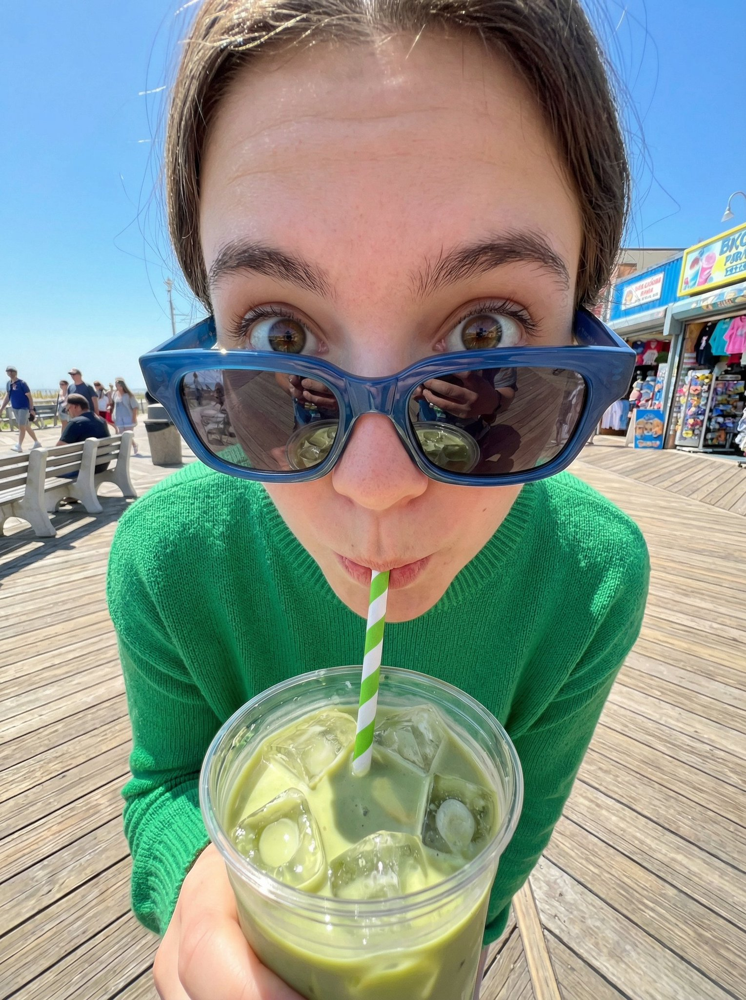
</div>

**提示词：**
```
{
  "scene": {
    "environment": "sunny_boardwalk",
    "details": "wooden_planks, colorful_stalls, people_walking, distant_umbrellas",
    "lighting": "bright_midday_sun",
    "sky": "clear_blue"
  },
  "camera": {
    "lens": "ultra_wide_fisheye_12mm",
    "distance": "very_close_up",
    "distortion": "strong_exaggeration",
    "angle": "slightly_low_upward"
  },
  "subject": {
    "type": "young_person",
    "gender": "neutral",
    "expression": "curious_playful",
    "eyes": "large_due_to_lens_distortion",
    "pose": "leaning_forward_sipping_drink",
    "clothing": {
      "top": "bright_green_knit_sweater",
      "accessory": "chunky_blue_sunglasses"
    }
  },
  "drink": {
    "type": "iced_matcha_latte",
    "ice_cubes": "large_clear",
    "cup": "transparent_plastic",
    "straw": "green_white_spiral"
  },
  "effects": {
    "depth_of_field": "shallow_foreground_sharp_background_soft",
    "reflections": "glasses_show_boardwalk_and_people",
    "color_grade": "clean_natural"
  },
  "composition": {
    "focus": "face_extreme_closeup",
    "mood": "funny_intimate_casual",
    "background_elements": [
      "distant_people",
      "benches",
      "bright_shops"
    ]
  }
}
```

**中文提示词：**
```
{
“场景”： {
"环境": "阳光木板路",
“细节”： “木板、色彩缤纷的摊位、行人、远处的雨伞”
"lighting": "bright_midday_sun",
天空：晴朗的蓝色
},
“相机”： {
"镜头": "超广角鱼眼12mm",
“距离”: “非常近”
“扭曲”：“强烈夸张”，
"角度": "略微向上低"
},
“主题”： {
"type": "young_person",
“性别”： “中性”，
"表情": "好奇_爱玩",
"眼睛": "因镜头畸变而增大",
"姿势": "前倾啜饮"
“衣服”： {
"上衣": "亮绿色针织毛衣",
"配饰": "厚重的蓝色太阳镜"
}
},
“喝”： {
"type": "冰抹茶拿铁",
"ice_cubes": "large_clear",
"杯子": "透明塑料",
"straw": "green_white_spiral"
},
"效果": {
"景深": "浅前景清晰背景柔和",
"倒影": "眼镜映照木板路和行人",
"color_grade": "clean_natural"
},
“作品”： {
"焦点": "面部特写",
"mood": "funny_intimate_casual",
“背景元素”：[
“远方的人们”，
“长凳”，
"bright_shops"
]
}
}
```

<a id="prompt-650"></a>
## 案例 650：头部的空腔内正站着迷你版自己 (来源 [@madpencil_](https://x.com/madpencil_/status/1994891011861221665)) 模型：Nano banana pro

<div style="display: flex; justify-content: space-between;">
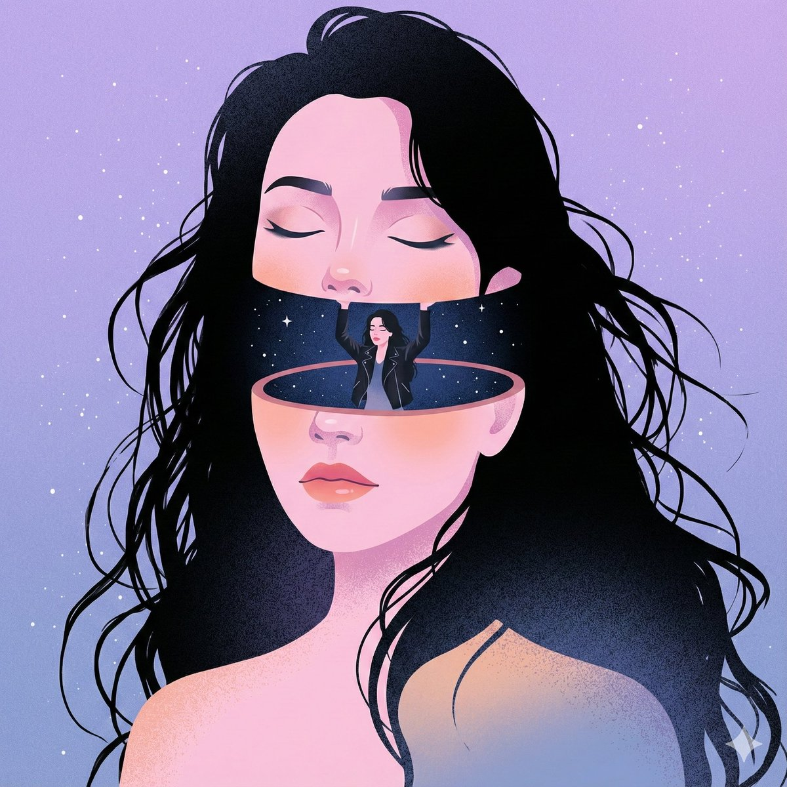
</div>

**提示词：**
```
"A surreal, whimsical digital illustration of a young woman with pale pink skin and voluminous, floating black hair. Her head is horizontally split open at the nose level. Inside the hollow of her head, a tiny, miniature version of herself (wearing the same attire) is standing and physically lifting the top half of the head (containing the closed eyes and forehead) up with her hands. The space inside the split head reveals a dark blue starry night sky or cosmic void.

Art style: Modern flat illustration with a lo-fi, grainy texture. Soft pastel colors including lavender, periwinkle, and peach. The shading is subtle and soft using gradients. There is a noise overlay/stipple effect giving it a retro print look. The background is a solid soft purple gradient with scattered white stardust. Emotional, dreamy, metaphorical."
```

**中文提示词：**
```
这是一幅超现实主义的奇幻数字插画，描绘了一位拥有淡粉色皮肤和蓬松飘逸黑发的年轻女子。她的头部在鼻子处被水平剖开。在她头部的空腔内，一个穿着同样服饰的迷你版自己正站着，用双手抬起她头部的上半部分（包括紧闭的双眼和额头）。剖开的头部内部展现出一片深蓝色的繁星点点的夜空，或是浩瀚的宇宙虚空​​。

艺术风格：现代扁平插画，带有低保真颗粒质感。柔和的粉彩色调，包括薰衣草紫、长春花蓝和蜜桃色。阴影处理细腻柔和，运用了渐变效果。叠加的噪点/点描效果赋予画面复古的印刷质感。背景是柔和的纯紫色渐变，点缀着零星的白色星尘。充满情感、梦幻和隐喻。
```

<a id="prompt-649"></a>
## 案例 649：一张超逼真的8K人像 (来源 [@kingofdairyque](https://x.com/kingofdairyque/status/1995092464193933467)) 模型：Nano banana pro

<div style="display: flex; justify-content: space-between;">
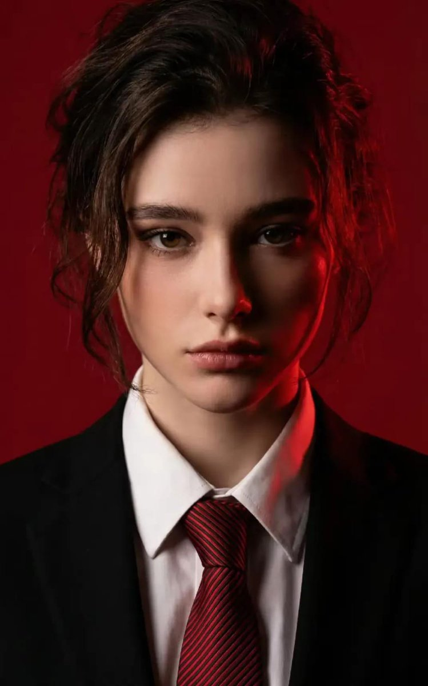
</div>

**提示词：**
```
Create an Ultra-realistic 8k portrait, standing against a deep red background. She has sharp facial features, messy styled dark hair, and a confident, slightly intense expression. She is wearing a black suits jacket over a white shirt with the collar slightly open paired with a net red stripped tie]- Unlimited Free :Dramatic red and black lighting highlights the contour of her face, jawline, and neck creating a cinematic powerful and moody atmosphere. Please do not alter facial features and leave head positioning as is.
```

**中文提示词：**
```
创作一张超逼真的8K人像，人物站在深红色背景前。她五官轮廓分明，一头凌乱的深色头发，表情自信而略带锐利。她身穿黑色西装外套，内搭白色衬衫，领口微微敞开，系着一条红色条纹网状领带。- 无限免费：戏剧性的红黑光影突显了她脸部、下颌和颈部的轮廓，营造出电影般的震撼氛围。请勿修改面部特征，并保持头部姿势不变。
```

<a id="prompt-648"></a>
## 案例 648：电影感十足的照片 (来源 [@azed_ai](https://x.com/azed_ai/status/1994767576963207277)) 模型：Nano banana pro

<div style="display: flex; justify-content: space-between;">
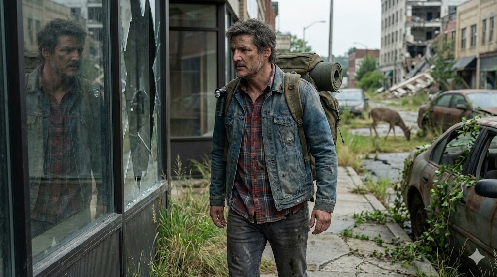
</div>

**提示词：**
```
{
  "subject": {
    "description": "A rugged male survivor walking through an overgrown city street",
    "mirror_rules": "Reflection in broken shop window",
    "age": "40s",
    "expression": "wary, scanning the horizon, tired",
    "hair": {
      "color": "salt and pepper",
      "style": "overgrown, messy beard"
    },
    "clothing": {
      "top": {
        "type": "flannel shirt and denim jacket",
        "color": "faded blue and red plaid",
        "details": "holes in elbows, sun-bleached, dirt stains"
      },
      "bottom": {
        "type": "jeans",
        "color": "dark grey",
        "details": "muddy knees, frayed hems"
      }
    },
    "face": {
      "preserve_original": true,
      "makeup": "dirt smudges, sun spots, realistic weathering"
    }
  },
  "accessories": {
    "headwear": {
      "type": "none",
      "details": "N/A"
    },
    "jewelry": {
      "earrings": "none",
      "necklace": "none",
      "wrist": "broken analog watch",
      "rings": "wedding band on chain around neck"
    },
    "device": {
      "type": "flashlight",
      "details": "clipped to backpack strap"
    },
    "prop": {
      "type": "hiking backpack",
      "details": "large, olive green, bedroll attached, worn fabric"
    }
  },
  "photography": {
    "camera_style": "Cinematic realism, 35mm wide lens",
    "angle": "wide shot establishing environment",
    "shot_type": "full body walking away from camera slightly",
    "aspect_ratio": "16:9",
    "texture": "detailed foliage, crisp sunlight, natural colors"
  },
  "background": {
    "setting": "ruined city street reclaimed by nature",
    "wall_color": "concrete covered in ivy",
    "elements": [
      "rusted cars",
      "tall grass cracking through pavement",
      "collapsed building in distance",
      "deer visible in background"
    ],
    "atmosphere": "quiet, desolate, beautiful decay",
    "lighting": "overcast soft daylight, diffuse shadows, melancholy feel"
  }
}
```

**中文提示词：**
```
{
“主题”： {
“描述”：“一位身形粗犷的男性幸存者走过杂草丛生的城市街道”，
"mirror_rules": "破损商店橱窗中的倒影",
“年龄”: “40多岁”
“表情”：“警惕地扫视着地平线，疲惫不堪”
“头发”： {
“颜色”：“盐和胡椒”，
“风格”：“杂乱不堪的胡须”
},
“衣服”： {
“顶部”： {
“类型”：“法兰绒衬衫和牛仔夹克”，
“颜色”：“褪色的蓝红色格子图案”，
“细节”：“肘部有破洞，被太阳晒褪色，有污渍”
},
“底部”： {
类型：牛仔裤，
“颜色”：“深灰色”，
细节：沾满泥巴的膝盖，磨损的下摆
}
},
“脸”： {
"preserve_original": true,
“妆容”：“污渍、晒斑、逼真的风化效果”
}
},
“配件”： {
"头饰": {
"type": "无",
“详情”： “不适用”
},
“珠宝”： {
“耳环”： “无”，
“项链”： “无”，
“手腕”: “坏掉的模拟手表”
“戒指”： “戴在脖子上的链子上的结婚戒指”
},
“设备”： {
“类型”：“手电筒”，
“细节”：“夹在背包带上”
},
"prop": {
"type": "登山背包",
“细节”：“大号，橄榄绿色，附带睡袋，布料磨损”
}
},
“摄影”： {
“camera_style”: “电影写实主义，35mm广角镜头”
角度： “广角镜头，展现环境”，
"shot_type": "全身略微远离镜头走开",
"aspect_ratio": "16:9",
“质感”：“细致的树叶、明媚的阳光、自然的色彩”
},
“背景”： {
“场景”：“被自然重新占领的废弃城市街道”，
"wall_color": "覆盖着常春藤的混凝土",
“元素”：[
“生锈的汽车”，
“高高的草丛撑破了路面”，
远处倒塌的建筑物
背景中可见鹿
],
“氛围”：“安静、荒凉、美丽的衰败”，
“光线”：“阴天柔和的日光，漫射的阴影，忧郁的氛围”
}
}
```

<a id="prompt-647"></a>
## 案例 647：漂浮在空中的3D爆炸装配图 (来源 [@HBCoop_](https://x.com/HBCoop_/status/1994822441793671485)) 模型：Nano banana pro

<div style="display: flex; justify-content: space-between;">
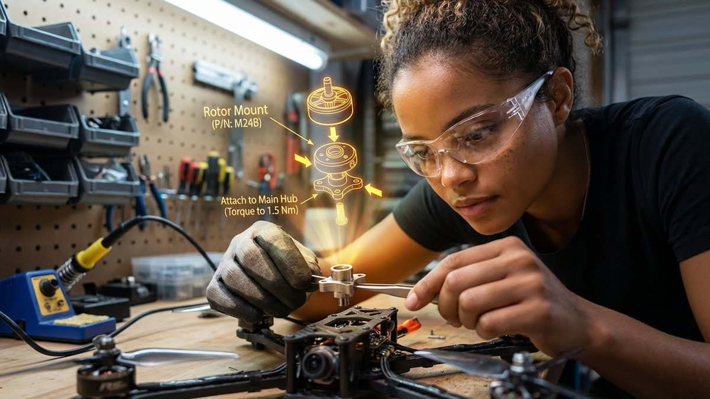
</div>

**提示词：**
```
{
 "promptDetails": {
 "description": "A garage/workshop environment with the subject assembling a complex mechanical device, viewing a 3D exploded assembly diagram floating in space.",
 "styleTags": [
 "Industrial",
 "High Detail",
 "Technical",
 "Action Shot"
 ]
 },
 "scene": {
 "background": {
 "setting": "A cluttered but organized home workshop/garage bench",
 "details": "Pegboard tool wall in the background, organized small parts containers, a soldering iron station, wood grain of the workbench, metal shavings (subtly)."
 },
 "subject": {
 "description": "The person defined by `[UPLOADED IMAGE]`, wearing safety glasses or a work glove, deeply concentrated.",
 "pose": "Leaning over the bench, holding a small component (e.g., a rotor or circuit board) with tweezers or a small screwdriver.",
 "focus": "Hands, component, and the diagram are the sharpest elements."
 }
 },
 "overlayObject": {
 "type": "3D Exploded View Assembly Hologram",
 "relationshipToEnvironment": "Hovering directly above the disassembled drone parts on the workbench.",
 "transform": "A fully rendered, rotating 3D model of the device, clearly showing where the held component fits.",
 "surfaceInteraction": "Bright, high-contrast yellow/orange vector lines with directional arrows and part numbering. It must look spatially correct.",
 "components": {
 "partID": "Rotor Mount (P/N: M24B)",
 "instruction": "Attach to Main Hub (Torque to 1.5 Nm)",
 "position": "Floating central to the workspace."
 }
 },
 "technicalStyle": {
 "aspectRatio": "16:9",
 "photographyStyle": "Product/Technical, High Contrast",
 "camera": {
 "shotType": "Close-Up",
 "angle": "Slightly overhead (designer/technical perspective).",
 "depthOfField": "Extremely shallow, focusing only on the hands, the component, and the projected diagram. The background should be a creamy blur (bokeh)."
 },
 "lighting": {
 "type": "Fluorescent Shop Light and Holographic Glow",
 "description": "Cool, bright, uniform white light from above, contrasted by the warm, directional glow of the yellow/orange hologram."
 },
 "color": {
 "palette": "Greys, deep reds, metallic silver, and the neon yellow of the graphic."
 }
 }
}
```

**中文提示词：**
```
{
"promptDetails": {
“描述”：“车库/工作室环境，人物正在组装一个复杂的机械装置，同时观看漂浮在空中的3D爆炸装配图。”
"styleTags": [
“工业的”，
“高细节”，
“技术的”，
“动作镜头”
]
},
“场景”： {
“背景”： {
“场景”：“一个杂乱但井然有序的家庭工作室/车库工作台”，
“细节”：“背景中的挂板工具墙，整齐的小零件容器，电烙铁台，工作台的木纹，（隐约可见的）金属屑。”
},
“主题”： {
“描述”：“图中所示人物（[上传图片]），戴着安全眼镜或工作手套，神情专注。”
“姿势”：“身体前倾，倚靠在工作台上，用镊子或小螺丝刀夹住一个小元件（例如转子或电路板）。”
“焦点”：“手、部件和图表是最清晰的元素。”
}
},
"overlayObject": {
"type": "3D爆炸视图组装全息图",
“与环境的关系”：“直接悬停在工作台上拆卸下来的无人机部件上方。”
“变换”：“设备的完整渲染、旋转3D模型，清晰地显示了所持组件的安装位置。”
“表面交互”： “明亮、高对比度的黄/橙色矢量线，带有方向箭头和零件编号。它必须在空间上看起来正确。”
“成分”： {
"partID": "转子安装座（部件号：M24B）",
“说明”：“连接到主轮毂（扭矩为 1.5 牛米）”
“位置”：“位于工作区中心”。
}
},
"technicalStyle": {
“aspectRatio”: “16:9”
“photographyStyle”: “产品/技术，高对比度”
“相机”： {
"shotType": "特写",
“角度”：“略微俯视（设计师/技术视角）。”
“景深”： “极浅的景深，只聚焦于手部、组件和投影图。背景应呈现柔和的虚化效果（散景）。”
},
“灯光”： {
“类型”：“荧光商店照明灯和全息发光”，
“描述”：“上方照射下来的冷色调、明亮、均匀的白光，与温暖的、定向的黄橙色全息光形成对比。”
},
“颜色”： {
“调色板”：“灰色、深红色、金属银色和图形中的霓虹黄色。”
}
}
}
```

<a id="prompt-646"></a>
## 案例 646：年轻女子坐在购物车里 (来源 [@_MehdiSharifi_](https://x.com/_MehdiSharifi_/status/1994870610410021018)) 模型：Grok

<div style="display: flex; justify-content: space-between;">
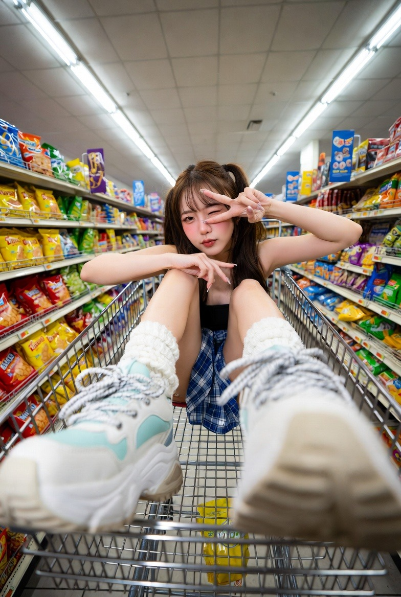
</div>

**提示词：**
```
{
  "scene_description": "A playful, high-energy fisheye portrait of a stylish young woman sitting inside a metal shopping cart in a vibrant supermarket aisle.",
  "subject": {
    "type": "young woman",
    "age": "early 20s",
    "features": {
      "hair": "long dark brown hair tied in loose low pigtails",
      "expression": "playful wink, slight smile",
      "hands": "long manicured nails, making a finger-frame gesture around her eye"
    },
    "attire": "black tank top, blue and white plaid shirt tied around the waist, white scrunched socks",
    "footwear": "oversized chunky white sneakers with light blue accents and thick laces",
    "position": "sitting inside a wire shopping cart, legs extended toward the camera lens creating foreshortening"
  },
  "action": {
    "primary": "posing playfully inside a shopping cart",
    "secondary": "framing her winking eye with her fingers using an 'L' shape gesture",
    "effect": "dynamic distortion emphasizing the sneakers and hands due to the lens"
  },
  "environment": {
    "setting": "brightly lit grocery store snack aisle",
    "foreground_elements": [
      "silver metal wire of the shopping cart",
      "chunky sneaker sole in extreme close-up"
    ],
    "background_elements": [
      "shelves stocked with colorful snack bags (yellow, red, green packaging)",
      "overhead fluorescent lights",
      "tiled supermarket floor",
      "promotional signage on shelves"
    ]
  },
  "lighting": {
    "style": "high-key, flat commercial lighting",
    "key_light": {
      "type": "overhead fluorescent tubes",
      "color": "cool white/neutral",
      "illuminates": [
        "entire aisle evenly",
        "reflections on plastic snack packaging",
        "sheen on the metal cart"
      ]
    },
    "shadows": "minimal, soft shadows beneath the cart"
  },
  "style": {
    "medium": "digital photography",
    "aesthetic": "Gen Z social media trend, Y2K influence, street style",
    "quality": "high definition, vibrant colors",
    "details": "sharp focus throughout"
  },
  "scene_composition": {
    "subject_action": "Leaning back casually in the cart, engaging directly with the camera",
    "camera_behavior": "Extreme close-up, wide-angle distortion",
    "depth_layering": "Exaggerated foreground (shoes) -> Middle ground (subject) -> Curved background (shelves)"
  },
  "visual_description": {
    "core_subject": "A trendy young woman with a fun, carefree attitude.",
    "attire_physics": "The plaid shirt is bunched naturally around the waist; the shoe laces appear large and textured due to proximity.",
    "skin_rendering": "Smooth, bright complexion, soft makeup with emphasized blush."
  },
  "lighting_and_atmosphere": {
    "type": "Artificial Interior Lighting",
    "specifics": "Even, bright illumination typical of retail environments, creating vibrant color pop on the merchandise.",
    "color_grade": "Slightly overexposed highlights, saturated primaries (reds, yellows, blues)."
  },
  "attire_customization": {
    "current_clothing": "Black tank top, plaid shirt (blue/white/grey), denim shorts (hidden), white chunky sneakers.",
    "customizable_clothing": "Leave empty to maintain current style or replace with 'oversized hoodie' for a different vibe."
  },
  "brand_product_customization": {
    "current_brand_product": "Generic colorful potato chip bags and snack packaging in background.",
    "customizable_brand": "User can insert specific snack brand names for the shelves.",
    "customizable_product": "User can specify the type of sneaker (e.g., Jordan, Balenciaga).",
    "product_placement_area": "The shelves behind the subject or the yellow bag inside the cart."
  },
  "objects_and_props": {
    "main_objects": [
      "Metal shopping cart",
      "Chunky sneakers"
    ],
    "secondary_objects": [
      "Yellow snack bag inside the cart",
      "Silver scrunched bracelet"
    ]
  },
  "camera_and_lens": {
    "focal_length_feel": "8mm to 10mm Fisheye",
    "aperture_effect": "Deep depth of field (f/8 or f/11)",
    "camera_angle": "High angle / POV looking down into the cart",
    "lens_type": "Ultra-wide angle fisheye lens",
    "bokeh_style": "None (everything in focus)"
  }
}
```

**中文提示词：**
```
{
场景描述：一张充满活力、趣味十足的鱼眼镜头肖像照，照片中一位时尚的年轻女子坐在熙熙攘攘的超市过道里的一辆金属购物车里。
“主题”： {
“类型”: “年轻女子”
“年龄”：“20岁出头”，
“特征”： {
“头发”：“长长的深棕色头发扎成松散的低辫子”，
“表情”：“俏皮的眨眼，淡淡的微笑”，
“双手”：“修长的指甲，在她眼周做出指框的手势”
},
“着装”：“黑色背心，蓝白格子衬衫系在腰间，白色皱巴巴的袜子”，
“鞋履”：“超大号厚底白色运动鞋，带有浅蓝色点缀和粗鞋带”，
“姿势”：“坐在金属购物车里，双腿伸向镜头，造成透视缩短效果”
},
“行动”： {
“主要”: “在购物车里摆出俏皮的姿势”，
“次要的”：“用手指勾勒出她眨眼的轮廓，呈‘L’形”，
“效果”：“镜头造成的动态畸变，突出了运动鞋和手部”
},
“环境”： {
“场景”：“灯光明亮的杂货店零食区”，
"前景元素": [
“购物车上的银色金属丝”，
“厚底运动鞋的超近特写”
],
“背景元素”：[
“货架上摆满了五颜六色的零食袋（黄色、红色、绿色包装）”，
“头顶荧光灯”，
“超市瓷砖地面”，
“货架上的促销标牌”
]
},
“灯光”： {
“风格”：“高调、扁平的商业照明”，
"key_light": {
“类型”：“高架荧光灯管”，
“颜色”: “冷白/中性色”
“照亮”：[
“整条过道均匀铺开”，
“关于塑料零食包装的反思”
“金属推车上的光泽”
]
},
“阴影”：“购物车下方的阴影极少，很柔和”
},
“风格”： {
“媒介”: “数码摄影”
“美学”：“Z世代社交媒体趋势、Y2K影响、街头风格”
“质量”：“高清，色彩鲜艳”，
“细节”：“始终清晰聚焦”
},
"scene_composition": {
“subject_action”: “随意地向后靠在购物车里，直接与镜头互动”
"camera_behavior": "极致特写，广角畸变",
"depth_layering": "夸张的前景（鞋子） ->中景（主体） ->弧形背景（书架）"
},
"visual_description": {
"core_subject": "一位时尚、性格开朗、无忧无虑的年轻女性。"
"attire_physics": "格子衬衫自然地堆积在腰间；鞋带由于距离较近而显得又大又有纹理。"
“皮肤渲染”: “光滑、明亮的肤色，柔和的妆容，腮红突出。”
},
"lighting_and_atmosphere": {
“类型”：“人工室内照明”，
“具体细节”：“均匀明亮的照明，符合零售环境的典型特征，使商品色彩鲜艳夺目。”
“color_grade”: “高光略微过曝，原色（红色、黄色、蓝色）饱和度高。”
},
"attire_customization": {
"current_clothing": "黑色背心，格子衬衫（蓝/白/灰），牛仔短裤（隐藏），白色厚底运动鞋。"
"customizable_clothing": "留空以保持当前风格，或替换为“oversized hoodie”以获得不同的风格。"
},
"品牌产品定制": {
"current_brand_product": "背景中是色彩鲜艳的普通薯片包装袋和零食包装。"
"customizable_brand": "用户可以为货架输入特定的零食品牌名称。"
"customizable_product": "用户可以指定运动鞋的类型（例如，乔丹、巴黎世家）。"
"product_placement_area": "主体身后的货架或购物车内的黄色袋子。"
},
"objects_and_props": {
"main_objects": [
“金属购物车”，
厚底运动鞋
],
"secondary_objects": [
“购物车里的黄色零食袋”
“银色褶皱手镯”
]
},
"camera_and_lens": {
"focal_length_feel": "8mm 至 10mm 鱼眼镜头",
"aperture_effect": "大景深（f /8或 f/11）",
"camera_angle": "高角度/POV 俯视推车内部",
"lens_type": "超广角鱼眼镜头",
"bokeh_style": "无（所有物体都清晰对焦）"
}
}
```

<a id="prompt-645"></a>
## 案例 645：一张脸六种情绪 (来源 [@ShreyaYadav___](https://x.com/ShreyaYadav___/status/1995052291981005278)) 模型：Nano banana pro

<div style="display: flex; justify-content: space-between;">
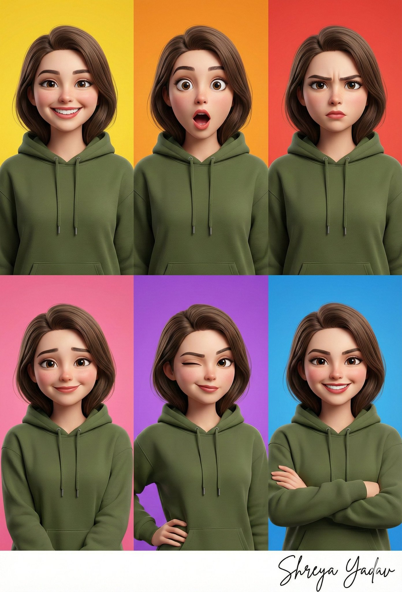
</div>

**提示词：**
```
{
  "project_name": "3D_Caricature_Collage_Olive_Green",
  "prompt_structure": {
    "subject": {
      "type": "Woman",
      "style": "3D Caricature",
      "appearance": "Highly polished, clean, meticulous detail",
      "clothing": "Deep olive green hoodie (rich, muted earth tone)"
    },
    "composition": {
      "type": "Collage",
      "layout": "Six-panel grid (3 columns x 2 rows)",
      "framing": "Close-up portraits"
    },
    "variations": {
      "panel_1": "Happy",
      "panel_2": "Surprised",
      "panel_3": "Serious",
      "panel_4": "Cute",
      "panel_5": "Sassy",
      "panel_6": "Confident",
      "facial_features": "Artistic exaggerations, widened eyes, arched eyebrows, broad smiles"
    },
    "environment": {
      "background": "Bold, vibrant colors distinct for each panel",
      "lighting": "Soft ambient lighting, sculpting subtle textures, crisp definition"
    },
    "text_elements": {
      "content": "Shreya Yadav",
      "type": "Signature",
      "style": "Elegant, legible"
    }
  },
  "technical_params": {
    "aspect_ratio": "3:4",
    "quality": "High definition, 8k, cinematic lighting",
    "render_engine": "Octane render / Unreal Engine style"
  },
  "full_prompt_text": "A six-panel collage (3 columns, 2 rows) featuring a highly polished 3D caricature of a woman wearing a deep olive green hoodie. The character maintains a consistent identity across all panels but displays six distinct emotions: happy, surprised, serious, cute, sassy, and confident. Facial features are artistically exaggerated with widened eyes and expressive mouths. Soft ambient lighting highlights skin texture and fabric folds. Backgrounds are bold and vibrant, contrasting with the muted olive hoodie. High-end digital art style, crisp definition. Signature text 'Shreya Yadav' included."
}
```

**中文提示词：**
```
{
"project_name": "3D_Caricature_Collage_Olive_Green",
"prompt_structure": {
“主题”： {
"type": "Woman",
“风格”：“3D 漫画”，
“外观”：“高度抛光，干净，细节一丝不苟”，
服装：深橄榄绿连帽衫（浓郁、柔和的大地色调）
},
“作品”： {
“类型”：“拼贴画”，
"布局": "六格网格（3列 x 2行）",
“构图”：“特写肖像”
},
"变体": {
"panel_1": "快乐",
"panel_2": "惊讶",
"panel_3": "严肃",
"panel_4": "可爱",
"panel_5": "俏皮的",
"panel_6": "自信",
"facial_features": "艺术夸张，睁大的眼睛，弯弯的眉毛，灿烂的笑容"
},
“环境”： {
“背景”：“每个面板都采用大胆、鲜艳的颜色”，
“灯光”：“柔和的环境光，勾勒出微妙的纹理，清晰的轮廓”
},
"text_elements": {
内容：Shreya Yadav，
"type": "签名",
风格：优雅、清晰
}
},
"technical_params": {
"aspect_ratio": "3:4",
“质量”：“高清、8K、电影级光照”，
"render_engine": "Octane渲染/虚幻引擎风格"
},
"full_prompt_text": "一幅六格拼贴画（三列两行），以高度精细的3D漫画形式展现了一位身穿深橄榄绿连帽衫的女性形象。人物在所有画面中保持一致，但展现了六种截然不同的情绪：快乐、惊讶、严肃、可爱、俏皮和自信。面部特征经过艺术化的夸张处理，眼睛睁得大大的，嘴巴也极具表现力。柔和的环境光突显了皮肤纹理和衣物褶皱。背景色彩鲜艳夺目，与低调的橄榄绿连帽衫形成鲜明对比。作品采用高端数字艺术风格，画面清晰锐利。包含签名文字“Shreya Yadav”。"
}
```

<a id="prompt-644"></a>
## 案例 644：极具收藏价值的国际象棋棋子 (来源 [@TechieBySA](https://x.com/TechieBySA/status/1994777464631951499)) 模型：Nano banana pro

<div style="display: flex; justify-content: space-between;">
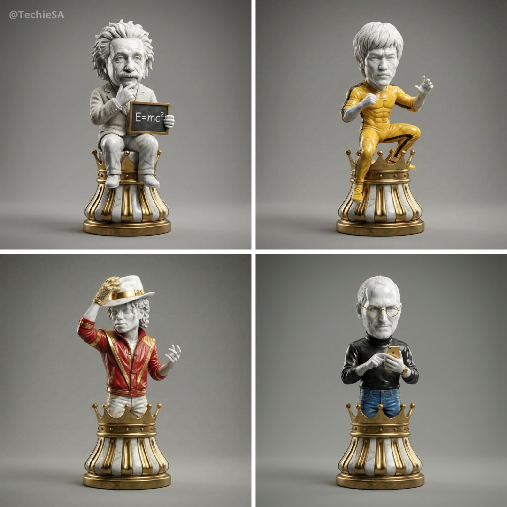
</div>

**提示词：**
```
A hyper-detailed 3D render of a collectible chess piece designed as [ICON]. The figure is sculpted in polished marble and gold accents, with a stylized base resembling a classic chess piece. The character’s iconic features, clothing, or accessories are faithfully captured in a simplified but instantly recognizable form. Studio lighting with soft reflections, dramatic shadows, photorealistic textures, cinematic presentation. Centered on a clean neutral background, 1080x1080 square format.
```

**中文提示词：**
```
这款极具收藏价值的国际象棋棋子以[ICON]为设计理念，采用超精细的3D渲染图呈现。棋子主体由抛光大理石雕刻而成，并以金色点缀，底座造型经典，宛如一枚国际象棋棋子。棋子的标志性特征、服饰和配饰均以简洁却极具辨识度的形式忠实还原。画面采用摄影棚灯光，营造出柔和的反射、戏剧性的阴影、逼真的纹理以及电影级的视觉效果。背景简洁干净，采用1080x1080像素的正方形格式。
```

<a id="prompt-643"></a>
## 案例 643：现代矢量海报肖像 (来源 [@john_my07](https://x.com/john_my07/status/1994989154669932989)) 模型：Nano banana pro

<div style="display: flex; justify-content: space-between;">
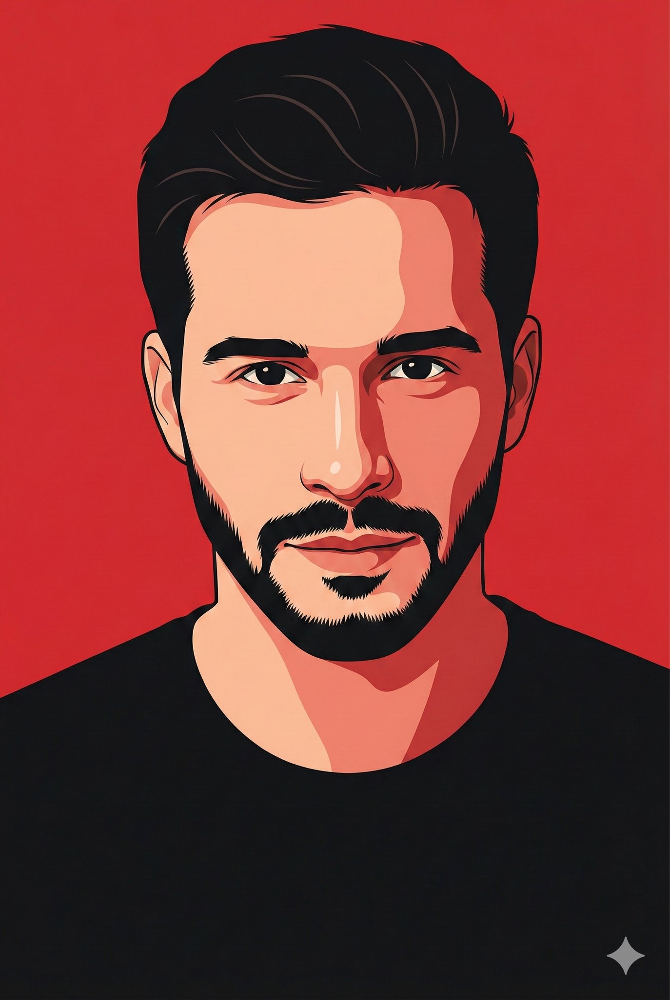
</div>

**提示词：**
```
Generate a sleek digital artwork of me (use my uploaded face), designed in the style of a modern vector poster portrait.
Visual Style & Elements:

A crisp vector aesthetic featuring strong line work and smooth, flat color shading.

Apply striking, high-contrast tones: light peach skin with gentle reddish shadowing.

Hair should be rendered with clean, stylized edges in deep brown/black shades, with faint highlights.

Beard should appear sharp, defined, and naturally blended into the facial structure.

Set the background to a solid red tone.
```

**中文提示词：**
```
请用我上传的照片，为我创作一幅简洁的数字艺术作品，风格为现代矢量海报肖像。
视觉风格与元素：

简洁的矢量美学，线条流畅有力，色彩平滑自然。

采用醒目的高对比度色调：浅桃色肌肤搭配柔和的红色阴影。

头发应以深棕色/黑色为主色调，边缘干净利落，并带有淡淡的高光。

胡须应该看起来轮廓分明、线条流畅，并与面部结构自然融合。

将背景色设置为纯红色。
```

<a id="prompt-642"></a>
## 案例 642：黑板艺术作品-海賊女帝 (来源 [@IamEmily2050](https://x.com/IamEmily2050/status/1994624635300974734)) 模型：Nano banana pro

<div style="display: flex; justify-content: space-between;">
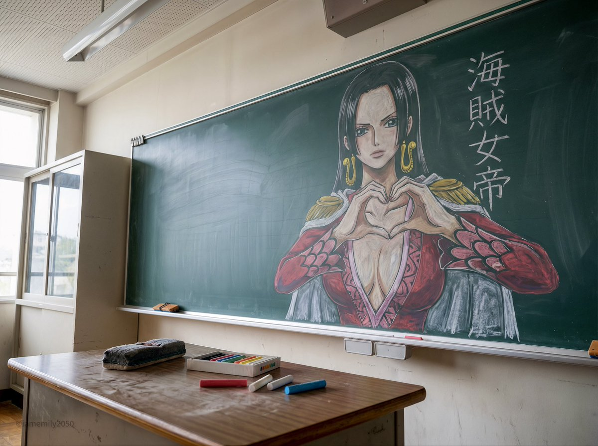
</div>

**提示词：**
```
{
  "intent": "Photorealistic documentation of a specific chalkboard art piece featuring a single anime character, capturing the ephemeral nature of the medium within a classroom context.",
  "frame": {
    "aspect_ratio": "4:3",
    "composition": "A centered medium shot focusing on the chalkboard mural. The composition includes the teacher's desk in the immediate foreground to provide scale, with the artwork of the single character dominating the background space.",
    "style_mode": "documentary_realism, texture-focused, ambient naturalism"
  },
  "subject": {
    "primary_subject": "A large-scale, intricate chalk drawing of Boa Hancock from 'One Piece' on a standard green classroom blackboard.",
    "visual_details": "The illustration depicts Boa Hancock in a commanding pose, positioned centrally on the board. She is drawn with her signature long, straight black hair with a hime cut, rendered using dense application of black chalk with white accents for sheen. Her expression is haughty and imperious, with detailed dark blue eyes. She is depicted forming a heart shape with her hands, referencing her 'Mero Mero Mellow' technique. She wears a revealing red blouse with purple geometric patterns and gold snake-shaped earrings, drawn with vibrant colored chalks.",
    "medium_texture": "The image preserves the dusty, matte quality of the chalk. Visible hatching and cross-hatching strokes create shading on her clothing and hair. Smudged areas on the green slate indicate where colors have been blended by hand.",
    "surrounding_elements": "To the right of the character, vertical Japanese text reading '海賊女帝' (Pirate Empress) is written in crisp white chalk."
  },
  "environment": {
    "location": "A standard Japanese school classroom.",
    "foreground_elements": "A wooden teacher's desk occupies the lower foreground. Scattered across the surface are a yellow box of colored chalks, loose sticks of red, white, and blue pastel chalk, and a dust-covered black felt eraser.",
    "background_elements": "The green chalkboard spans the width of the frame, bordered by a metallic chalk tray containing accumulated chalk dust. The wall above is a plain, off-white plaster, featuring a small mounted speaker box.",
    "atmosphere": "Quiet and academic, with a sense of stillness suggesting the room is currently unoccupied."
  },
  "lighting": {
    "type": "Diffuse ambient classroom lighting.",
    "quality": "Soft, nondirectional illumination provided by overhead fluorescent fixtures mixed with daylight from windows on the left. The light is even, preventing glare on the chalkboard surface while highlighting the texture of the chalk.",
    "color_temperature": "Neutral white, approximately 5000K, ensuring accurate color rendition of the red and purple chalks against the dark green board.",
    "direction": "Overhead and slightly frontal."
  },
  "camera": {
    "sensor_format": "35mm full-frame digital sensor.",
    "lens": "35mm prime lens.",
    "aperture": "f/5.6",
    "depth_of_field": "Moderate depth of field, keeping the chalkboard drawing in sharp focus while allowing the foreground desk elements to soften slightly.",
    "shutter_speed": "1/60s",
    "iso": "400",
    "camera_position": "Eye-level standing position, set back enough to frame the entire drawing and the desk."
  },
  "negative": {
    "content": "Multiple characters, Midoriya, Shigaraki, male characters, digital art overlay, vector graphics, paper texture, oil painting, messy composition, extreme low angle, fisheye lens.",
    "style": "No hyper-saturation, no soft focus filters, no heavy vignetting."
  }
}
```

**中文提示词：**
```
{
“意图”：“以照片写实的手法记录一幅特定的黑板艺术作品，作品中描绘了一个动漫角色，捕捉了课堂环境中这种媒介的转瞬即逝的特性。”
“框架”： {
"aspect_ratio": "4:3",
“构图”：“以黑板壁画为中心拍摄的中景镜头。画面前景中包含教师的办公桌以显示比例，而单个人物的画作则占据了背景空间。”
"style_mode": "纪实写实主义，注重纹理，环境自然主义"
},
“主题”： {
“primary_subject”: “一幅绘制在标准绿色教室黑板上的大型、精细的《海贼王》角色波雅·汉库克的粉笔画。”
“视觉细节”： “这幅插画描绘了波雅·汉库克，她以威严的姿态位于画面中央。她标志性的黑色长直发，采用姬发式剪裁，以浓重的黑色粉笔绘制，并以白色点缀以增加光泽。她的表情傲慢而威严，深蓝色的眼睛刻画入微。她双手比划成心形，象征着她的‘Mero Mero Mellow’（柔情蜜意）技巧。她身着一件饰有紫色几何图案的性感红色上衣，佩戴着以鲜艳彩色粉笔绘制的金色蛇形耳环。”
“medium_texture”：图像保留了粉笔的粉尘质感和哑光效果。清晰可见的排线和交叉线笔触在她的衣服和头发上营造出阴影。绿色石板上的晕染区域表明了手工调色的位置。
"surrounding_elements": "字符右侧用清晰的白色粉笔写着竖排的日文“海贼女帝”。"
},
“环境”： {
地点：一间标准的日本学校教室。
"前景元素": "一张木制教师桌占据了画面下方的前景。桌面上散落着一盒黄色的彩色粉笔、几支红色、白色和蓝色的粉彩粉笔，以及一块沾满灰尘的黑色毡橡皮。"
“背景元素”： “绿色黑板横跨整个画面宽度，边缘是一个金属粉笔托盘，里面积满了粉笔灰。黑板上方是一面普通的米白色石膏墙，墙上安装了一个小型壁挂式音箱。”
“氛围”：“安静而学术，一种静谧感表明房间里目前无人居住。”
},
“灯光”： {
“类型”：“漫射环境教室照明。”
“质量”：“柔和、无方向性的照明由上方荧光灯具提供，并混合了左侧窗户的自然光。光线均匀，既防止黑板表面产生眩光，又突显了粉笔的纹理。”
“色温”： “中性白光，约 5000K，确保红色和紫色粉笔在深绿色白板上的准确显色。”
“方向”：“头顶上方，略微朝前。”
},
“相机”： {
"sensor_format": "35mm 全画幅数码传感器。"
“镜头”：“35mm 定焦镜头。”
光圈：f/5.6，
“景深”： “适中的景深，保持黑板上的图画清晰锐利，同时让前景的桌面元素略微柔化。”
"shutter_speed": "1/60"
“iso”: “400，
“camera_position”: “与眼睛齐平的站立位置，向后移动足够远，以便将整个图纸和桌子都框入其中。”
},
“消极的”： {
内容：多个角色、绿谷出久、死柄木弔、男性角色、数字艺术叠加、矢量图形、纸张纹理、油画、凌乱构图、极低角度、鱼眼镜头。
“风格”：“不使用过饱和度，不使用柔焦滤镜，不使​​用严重的暗角。”
}
}
```

<a id="prompt-641"></a>
## 案例 641：路飞教室艺术 (来源 [@yanhua1010](https://x.com/yanhua1010/status/1995044071803371880)) 模型：Nano banana pro

<div style="display: flex; justify-content: space-between;">
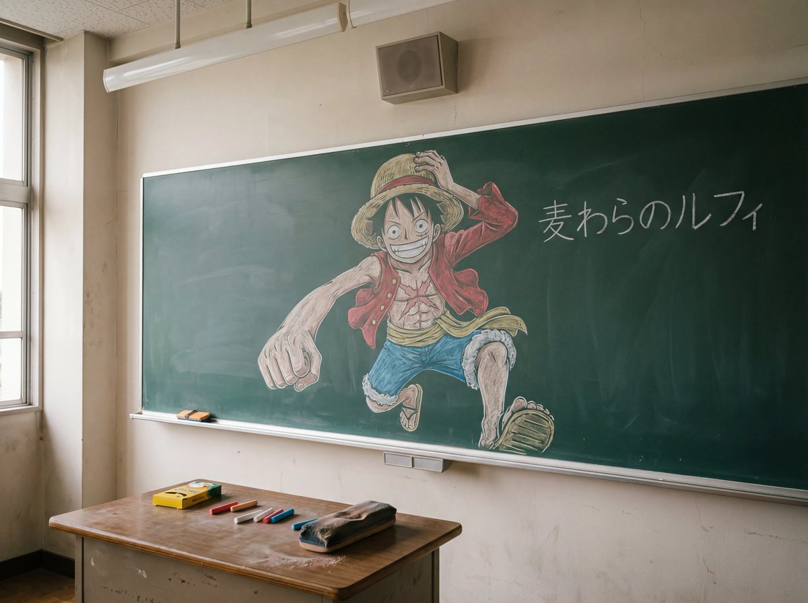
</div>

**中文提示词：**
```
{
  "意图": "对特定黑板艺术作品进行写实纪录摄影，画面呈现单个动漫角色，捕捉粉笔媒介的短暂性及教室场景氛围。",
  "画面框架": {
    "画幅比例": "4:3",
    "构图方式": "中景构图，聚焦黑板壁画。构图包含前景的教师讲台以提供比例尺度，背景空间由单个角色的艺术作品主导。",
    "风格模式": "纪实写实主义、质感聚焦、环境自然主义"
  },
  "主体对象": {
    "主要主体": "标准绿色教室黑板上绘制的大型精细粉笔画，描绘《海贼王》角色蒙奇·D·路飞。",
    "视觉细节": "画面中路飞呈现动态姿势,居于黑板中央。他戴着标志性草帽,黑色凌乱短发,露齿灿烂笑容。表情充满活力和喜悦,圆形眼睛生动传神。他的一只手臂向前伸展,呈现橡胶手臂技能(橡胶果实能力)。身穿红色无袖背心(敞开状态)露出胸前标志性X形伤疤,蓝色短裤和凉鞋,使用鲜艳彩色粉笔绘制。",
    "媒介质感": "画面保留粉笔的粉尘感和哑光质地。可见排线和交叉阴影笔触为服装和头发创造阴影效果。绿色黑板上的晕染区域显示手工混合颜色的痕迹。",
    "周边元素": "角色右侧,竖向日文'麦わらのルフィ'(草帽路飞)用清晰白色粉笔书写。"
  },
  "环境设定": {
    "场所": "标准日本学校教室。",
    "前景元素": "木质讲台占据画面下方前景。桌面上散落着黄色粉笔盒、红白蓝色散落粉笔条,以及沾满粉笔灰的黑色毡擦。",
    "背景元素": "绿色黑板横跨画面宽度,底部为金属粉笔槽,积累有粉笔灰。黑板上方为米白色石膏墙面,挂有小型扬声器盒。",
    "氛围": "安静的学术空间,静谧感暗示教室当前无人。"
  },
  "光线设定": {
    "类型": "漫射环境光,教室照明。",
    "质量": "柔和无方向性照明,由顶部荧光灯具与左侧窗户日光混合提供。光线均匀,防止黑板表面眩光,同时突显粉笔质感。",
    "色温": "中性白,约5000K色温,确保红色和紫色粉笔在深绿色黑板上的准确色彩还原。",
    "方向": "顶部和略微正面照射。"
  },
  "相机参数": {
    "传感器格式": "35mm全画幅数码传感器。",
    "镜头": "35mm定焦镜头。",
    "光圈": "f/5.6",
    "景深": "中等景深,保持黑板绘画清晰对焦,前景讲台元素轻微柔化。",
    "快门速度": "1/60秒",
    "感光度": "ISO 400",
    "机位": "站立视线高度,与画面保持足够距离以框入完整绘画和讲台。"
  },
  "负面提示": {
    "内容": "多个角色、绿谷出久、死柄木、男性角色、数字艺术叠加、矢量图形、纸张纹理、油画、混乱构图、极端低角度、鱼眼镜头。",
    "风格": "无过度饱和、无柔焦滤镜、无重度暗角。"
  }
}
```

<a id="prompt-640"></a>
## 案例 640：3x3网格构图进行拍摄照片 (来源 [@MonetizeXWithAb](https://x.com/MonetizeXWithAb/status/1994781646361694398)) 模型：Nano banana pro

<div style="display: flex; justify-content: space-between;">
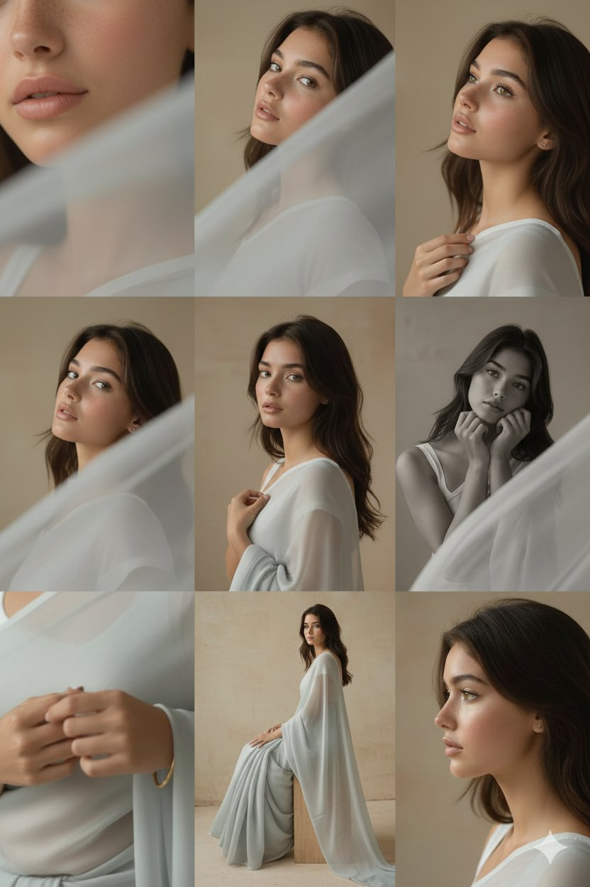
</div>

**提示词：**
```
Editorial 3x3 grid in soft golden-beige studio. Character (face characteristics 100% same as uploaded image) wearing a glossy silk saree with minimal jewelry. Lighting: warm soft key from right, reflector fill left. Shots match original structure: extreme lip/cheek macro with blurred silk, tight eye reflection crop, B&W chin-on-fist frame-fill, fabric-framed shoulder view, frontal close-up with hand-light pattern, angled portrait with loose strands, jawline-focused hand crop, half-body seated on cube, profile with rim slice. Same lens & aperture set. RAW, elegant tonal grade, smooth cinematic grain.
```

**中文提示词：**
```
在柔和的金米色摄影棚内，采用3x3网格构图进行拍摄。人物（面部特征与上传图片完全一致）身着光泽丝绸纱丽，佩戴极简首饰。灯光：右侧暖色调柔光主光，左侧反光板补光。拍摄构图与原图一致：极致唇颊微距特写（丝绸虚化）、眼部特写（反光）、黑白下巴托拳构图、织物框肩部特写、正面特写（手光图案）、斜角人像（头发散落）、下颌线特写（手部特写）、半身像（坐在立方体上）、侧面轮廓（镜框特写）。镜头和光圈设置相同。RAW格式，色调优雅，颗粒感柔和。
```

<a id="prompt-639"></a>
## 案例 639：身穿露肩白色针织上衣 (来源 [@kingofdairyque](https://x.com/kingofdairyque/status/1995046473835467038)) 模型：Nano banana pro

<div style="display: flex; justify-content: space-between;">
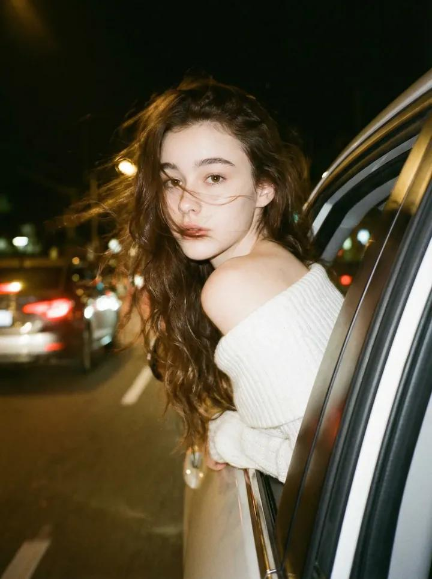
</div>

**提示词：**
```
Create a photo of me 240 leaning my back out the window car like a dark dreamy blurry vintage windy night wearing a off shoulder white knitted top.
With brown long wavy hair. keep the facial details correctly. Please do not alter facial features and leave head positioning as is.
```

**中文提示词：**
```
拍一张我身穿露肩白色针织上衣，背靠着车窗外，像一个黑暗、梦幻、模糊的复古、刮着风的夜晚的照片。
棕色长卷发。请保持面部细节正确。请勿更改面部特征，头部姿势保持不变。
```

<a id="prompt-638"></a>
## 案例 638：可爱偶像特写肖像 (来源 [@so_ainsight](https://x.com/so_ainsight/status/1995018306433290701)) 模型：Nano banana pro

<div style="display: flex; justify-content: space-between;">
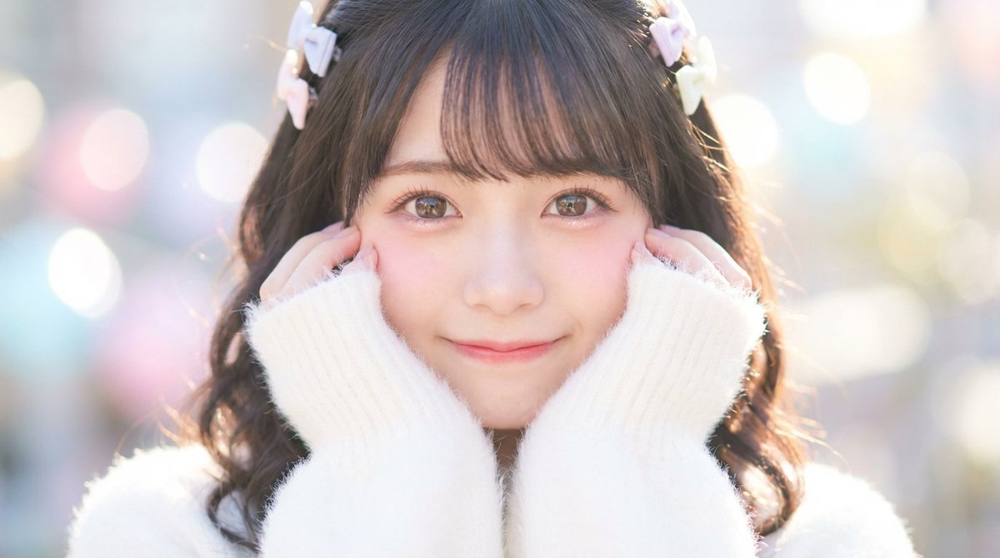
</div>

**提示词：**
```
{
  "photo": {
    "type": "kawaii_idol_closeup_portrait",
    "quality": "8k photorealistic, high fidelity, masterpiece",
    "lens": "85mm f/1.2 prime lens, beautiful bokeh",
    "composition": "bust-up shot, close-up, eye-level, subject centered, no text",
    "face": {
      "description": "A super cute 18-year-old Japanese girl with large sparkling puppy eyes, rosy cheeks (igari makeup style), glossy pink lips, porcelain skin, charming and sweet expression, radiating pure idol energy"
    },
    "model_pose": {
      "position": "facing camera slightly angled",
      "hands": "both hands bringing attention to the face, perhaps touching cheeks or holding a piece of hair, cute finger positioning",
      "expression": "beaming angelic smile, looking directly at viewer with affection, head slightly tilted"
    },
    "wardrobe": {
      "top": {
        "type": "fluffy white angora knit sweater with a cute ribbon collar",
        "style": "oversized sleeves covering half of hands (moe-sode), pastel aesthetic, soft texture"
      },
      "accessories": {
        "hair": "airy bangs, soft waves, decorated with pastel ribbon clips and tiny pearl pins",
        "earrings": "dainty dangling heart earrings",
        "necklace": "delicate gold chain with a small crystal"
      }
    },
    "textures": {
      "emphasis": [
        "hyper-detailed iris and eyelashes",
        "soft peach fuzz on skin",
        "fluffy angora texture",
        "glossy lips",
        "sparkling eye reflections"
      ]
    },
    "environment": {
      "backdrop": "dreamy blurred pastel background with bokeh lights",
      "lighting": {
        "style": "ethereal beauty lighting",
        "key_light": "soft diffuse frontal light to eliminate shadows",
        "effects": "slight bloom effect, rim light on hair to create a halo effect"
      }
    },
    "color_grade": {
      "type": "bright pastel dreamy",
      "balance": "creamy whites, soft pinks, slightly overexposed high-key look"
    }
  }
}
```

**中文提示词：**
```
{
  "photo": {
    "type": "可爱偶像特写肖像",
    "quality": "8K级照片写实，高保真，杰作",
    "lens": "85mm f/1.2 定焦镜头，美丽的散景（虚化）",
    "composition": "半身镜头，特写，视线平齐，主体居中，无文本",
    "face": {
      "description": "一位超级可爱的18岁日本少女，有着水汪汪的大眼睛（像小狗一样），红润的脸颊（宿醉妆/伊伽利妆风格），有光泽的粉色嘴唇，陶瓷般的肌肤，迷人甜美的表情，散发着纯粹的偶像能量"
    },
    "model_pose": {
      "position": "面向镜头，略微侧身",
      "hands": "双手吸引对脸部的注意，也许是摸着脸颊或捏着一缕头发，可爱的手指姿势",
      "expression": "天使般灿烂的笑容，深情地直视观看者，头部略微倾斜"
    },
    "wardrobe": {
      "top": {
        "type": "蓬松的白色安哥拉兔毛针织毛衣，带有可爱的丝带领子",
        "style": "超大袖子遮住一半手（萌袖），柔和色调美学，柔软质感"
      },
      "accessories": {
        "hair": "空气刘海，柔和的波浪卷，装饰着柔和色调的丝带夹和微小的珍珠发卡",
        "earrings": "精致的垂坠心形耳环",
        "necklace": "搭配一颗小水晶的精致金链"
      }
    },
    "textures": {
      "emphasis": [
        "超精细的虹膜和睫毛",
        "皮肤上柔软的绒毛",
        "蓬松的安哥拉兔毛质感",
        "有光泽的嘴唇",
        "闪烁的眼睛反光"
      ]
    },
    "environment": {
      "backdrop": "梦幻模糊的柔和色调背景，带有散景光斑",
      "lighting": {
        "style": "空灵的美颜光照",
        "key_light": "柔和的漫射正面光以消除阴影",
        "effects": "轻微的柔光（泛光）效果，头发上的边缘光营造出光环效果"
      }
    },
    "color_grade": {
      "type": "明亮柔和梦幻",
      "balance": "奶油白，柔和粉，略微过曝的高调外观"
    }
  }
}
```

<a id="prompt-637"></a>
## 案例 637：肤色白皙的美丽女性沐浴在晨光中 (来源 [@xmiiru_](https://x.com/xmiiru_/status/1995078053165146326)) 模型：Nano banana pro

<div style="display: flex; justify-content: space-between;">
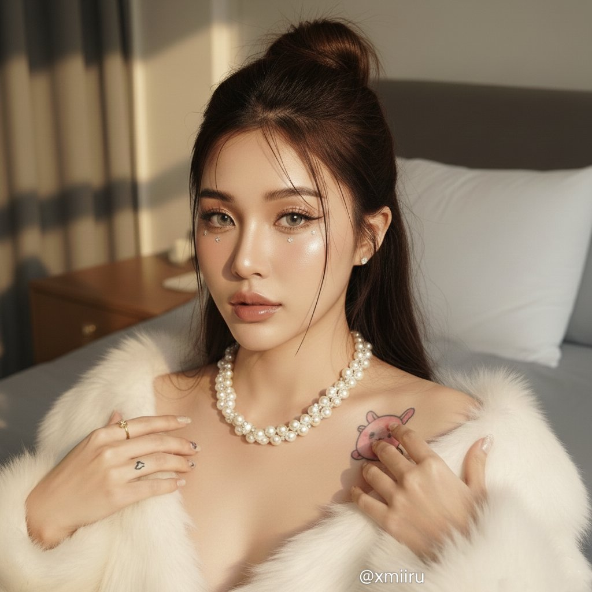
</div>

**提示词：**
```
{
  "prompt": "Edit this photo without changing the face a beautiful woman with fair skin lit by bright morning sunlight from a strong golden directional light source creating clear shadows on her face and hair",
  "details": {
    "hair": {
      "color": "dark brown",
      "shine": "natural",
      "style": "loose messy bun on top of the head",
      "wet_strands": "a few wet look strands curving on the forehead in an aesthetically neat random pattern",
      "side_strands": "two long straight strands on both sides softly framing the face",
      "volume": "back section lifted into the bun looking thick and voluminous"
    },
    "makeup": {
      "eyes": {
        "lens_color": "light grey",
        "pupil_visibility": "clear",
        "eyeshadow": "highly reflective silver glitter with tiny sparkling particles"
      }
    }
  }
}
```

**中文提示词：**
```
{
“提示”：“编辑这张照片，不要改变脸部，照片中是一位肤色白皙的美丽女性，沐浴在明亮的晨光中，强烈的金色定向光源在她脸上和头发上形成了清晰的阴影。”
“细节”： {
“头发”： {
“颜色”: “深棕色”
“光泽”：“自然”，
“发型”：“头顶上随意挽起的凌乱发髻”，
"wet_strands": "几缕湿漉漉的发丝以整齐随机的图案在额头上自然垂落"
"side_strands": "两侧各有两缕长长的直发，柔和地垂在脸颊两侧",
“蓬松度”：后脑勺的头发向上梳成发髻，看起来浓密蓬松。
},
“化妆品”： {
"眼睛": {
"lens_color": "浅灰色",
"pupil_visibility": "clear",
“眼影”：“高反射银色闪粉，带有细小闪光颗粒”
}
}
}
}
```

<a id="prompt-636"></a>
## 案例 636：3D立体书插画 (来源 [@azed_ai](https://x.com/azed_ai/status/1995084424489422885)) 模型：Nano banana pro

<div style="display: flex; justify-content: space-between;">
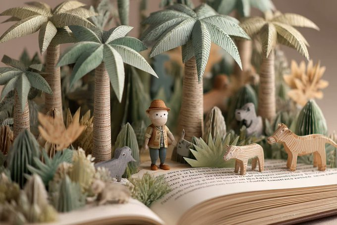
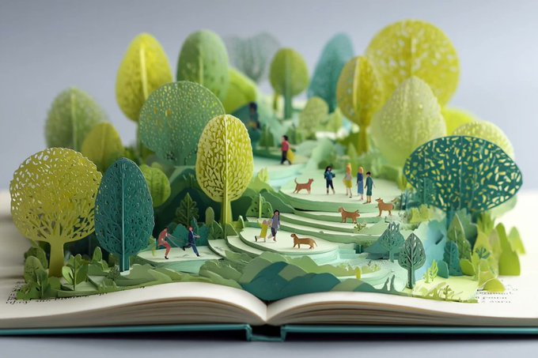
</div>

**提示词：**
```
A 3D pop-up book illustration featuring a [subject], with layered paper elements unfolding into a miniature scene. Soft lighting, textured paper surfaces, playful handcrafted look, pastel [color1] and [color2] palette, viewed from a slight angle to show depth and detail.
```

**中文提示词：**
```
一幅以[主题]为主题的3D立体书插画，层叠的纸质元素展开成一个微缩场景。柔和的光线、纹理丰富的纸张表面、充满趣味的手工质感，以及柔和的[颜色1]和[颜色2]色调，从略微倾斜的角度观看，展现出层次感和细节。
```

<a id="prompt-635"></a>
## 案例 635：根据古诗画一幅画 (来源 [@songguoxiansen](https://x.com/songguoxiansen/status/1991472285258248349)) 模型：Nano banana pro

<div style="display: flex; justify-content: space-between;">
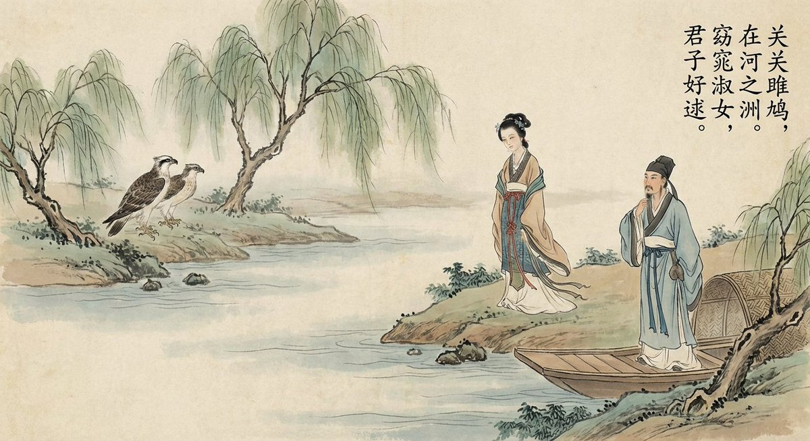
</div>

**中文提示词：**
```
关关雎鸠，在河之洲。窈窕淑女，君子好逑。
根据古诗画一幅画，并附上原文。
```

<a id="prompt-634"></a>
## 案例 634：水墨画风格与写实摄影的结合 (来源 [@songguoxiansen](https://x.com/songguoxiansen/status/1991529000519496037)) 模型：Nano banana pro

<div style="display: flex; justify-content: space-between;">
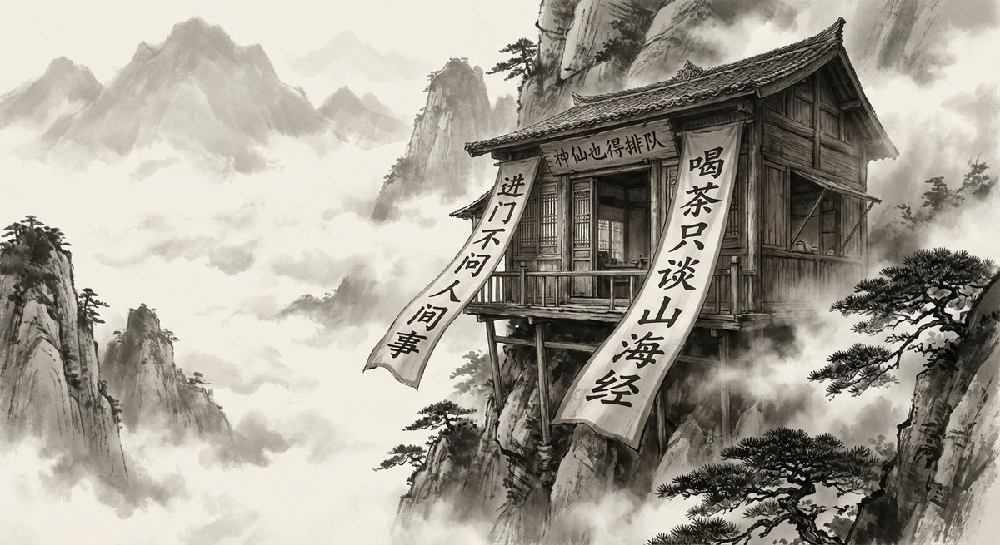
</div>

**中文提示词：**
```
水墨画风格与写实摄影的结合。云雾缭绕的深山悬崖边，有一座摇摇欲坠的古老木质茶馆。茶馆门口挂着一副巨大的对联，随风飘扬。上联写：“进门不问人间事”，下联写：“喝茶只谈山海经”。横批是一块斑驳的牌匾：“神仙也得排队”。
```

<a id="prompt-633"></a>
## 案例 633：深夜放毒是对减肥最大的不尊重 (来源 [@songguoxiansen](https://x.com/songguoxiansen/status/1991530558992859379)) 模型：Nano banana pro

<div style="display: flex; justify-content: space-between;">
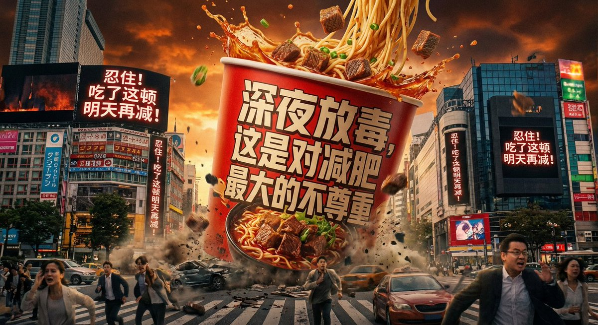
</div>

**中文提示词：**
```
巨物恐惧症风格，好莱坞灾难片质感。一个巨大的红烧牛肉面桶从天而降，砸在繁华的十字路口。面桶上原本的品牌名变成了一行巨大的警示语：“深夜放毒，这是对减肥最大的不尊重”。旁边的高楼大厦LED大屏上配合地显示：“忍住！吃了这顿明天再减！”。
```

<a id="prompt-632"></a>
## 案例 632：日式居酒屋狗狗烤串 (来源 [@songguoxiansen](https://x.com/songguoxiansen/status/1991533617403818429)) 模型：Nano banana pro

<div style="display: flex; justify-content: space-between;">
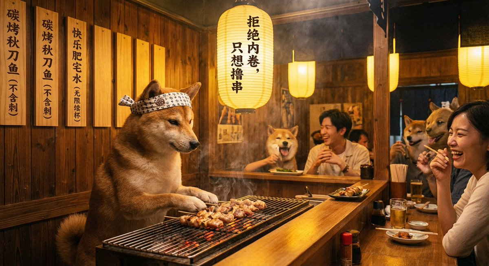
</div>

**中文提示词：**
```
温暖的日式居酒屋暖黄灯光。店长是一只系着头巾的柴犬，正在认真地烤串。吧台前的灯笼上写着汉字：“拒绝内卷，只想撸串”。墙上的菜单木牌上写着特色菜：“碳烤秋刀鱼（不含刺）”和“快乐肥宅水（无限续杯）”。
```

<a id="prompt-631"></a>
## 案例 631：根据古诗画一幅画 (来源 [@songguoxiansen](https://x.com/songguoxiansen/status/1991471244081074652)) 模型：Nano banana pro

<div style="display: flex; justify-content: space-between;">
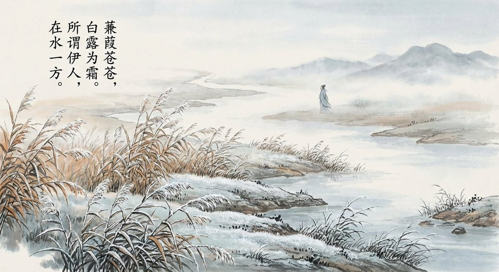
</div>

**中文提示词：**
```
蒹葭苍苍，白露为霜。所谓伊人，在水一方。
根据古诗画一幅画，并附上原文。
```

<a id="prompt-630"></a>
## 案例 630：疯狂动物城的大型毛绒角色帽子 (来源 [@kingofdairyque](https://x.com/kingofdairyque/status/1994745605621780533)) 模型：Nano banana pro

<div style="display: flex; justify-content: space-between;">
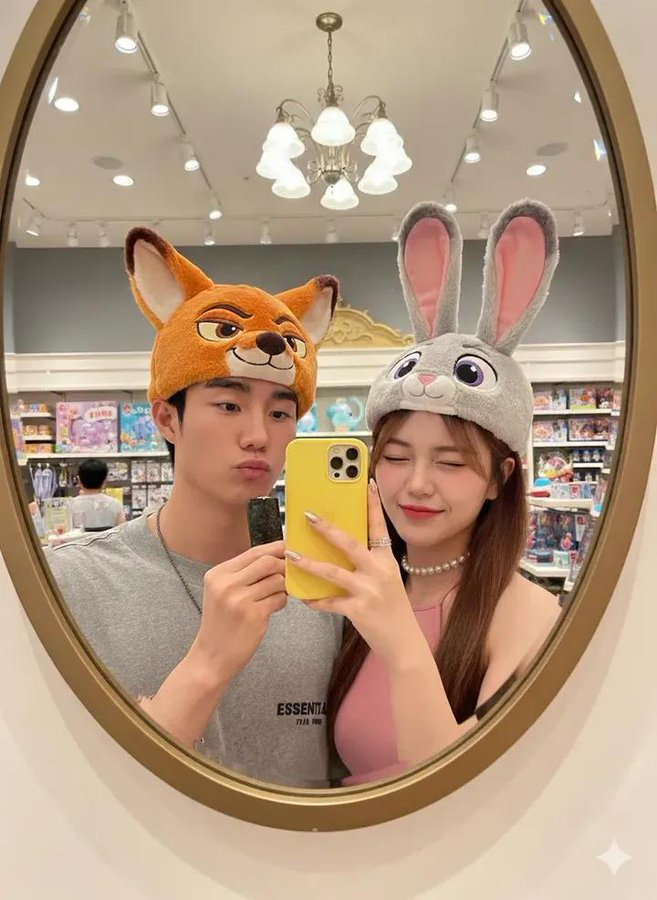
</div>

**提示词：**
```
A highly realistic, highly detailed, photorealistic 8K mirror selfie taken with an iPhone 15 Pro Max. Zootropolis fandom aesthetic.
Scene: A guy and a girl pose together in front of an oval mirror in a Disney toy store.
The guy on the left has a playful expression, matching the reference photo. The girl on the right  winks playfully, holding a bright yellow phone. Metallic nail polish.
Clothing and accessories:
• Both are wearing large plush Disney Zootropolis character hats.
The guy on the left in Photo 1—Nick Wilde's orange hat with large fox ears embroidered with sly eyes.
 Girl in photo 2 on the right—gray Judy Hopps hat with long pink bunny ears, large purple eyes.
• Photo 1 on the left—clothes and hair match the attached photo.
• Photo 2 on the right—wearing a hot pink halter top. Long, straight hair.
A pearl necklace fits snugly around her neck.
She has rings on several fingers.
Girl in photo 2's makeup: Korean K-beauty; glass skin; subtle blush; black eyeliner; colored contacts (blue/gray); pink and rosy ombre lipstick.
Background: Disney gift shop interior; frosted shelves filled with toys; holiday mall lighting; decorative ceiling chandelier.
Quality and detail: 8K, highly realistic plush texture (individual fur fibers), vibrant, saturated colors, soft commercial mall lighting, no noise, perfectly sharp focus on face and hat, mirror selfie in frame.
```

**中文提示词：**
```
一张用 iPhone 15 Pro Max 拍摄的超逼真、超精细、照片级 8K 镜面自拍。充满《疯狂动物城》的粉丝美学风格。
场景：一男一女在迪士尼玩具店的椭圆形镜子前合影。
左边那位男士表情顽皮，与参考照片相符。右边那位女士俏皮地眨着眼，手里拿着一部亮黄色的手机。她涂着金属质感的指甲油。
服装和配饰：
•两人都戴着迪士尼《疯狂动物城》的大型毛绒角色帽子。
照片 1 中左边的人——尼克·王尔德的橙色帽子，上面绣着一对大狐狸耳朵和狡黠的眼睛。
照片 2 右侧的女孩——戴着灰色的朱迪·霍普斯帽子，帽子上有长长的粉色兔子耳朵和大大的紫色眼睛。
• 左侧照片 1——衣服和发型与附图相符。
• 右侧照片2——身穿亮粉色露背上衣，留着长长的直发。
一条珍珠项链紧紧地贴合在她的脖子上。
她好几个手指上都戴着戒指。
照片 2 中女孩的妆容：韩式 K-beauty；水光肌；淡淡的腮红；黑色眼线；彩色隐形眼镜（蓝灰色）；粉色和玫瑰色渐变唇膏。
背景：迪士尼礼品店内部；摆满玩具的磨砂货架；节日商场灯光；装饰性天花板吊灯。
质量和细节：8K，高度逼真的毛绒质感（单根毛纤维），鲜艳饱和的色彩，柔和的商业商场灯光，无噪点，面部和帽子完美清晰对焦，画面中有镜子自拍。
```

<a id="prompt-629"></a>
## 案例 629：一张图片生成9个不同景别的镜头 (来源 [@songguoxiansen](https://x.com/songguoxiansen/status/1994783047825473774)) 模型：Nano banana pro

<div style="display: flex; justify-content: space-between;">
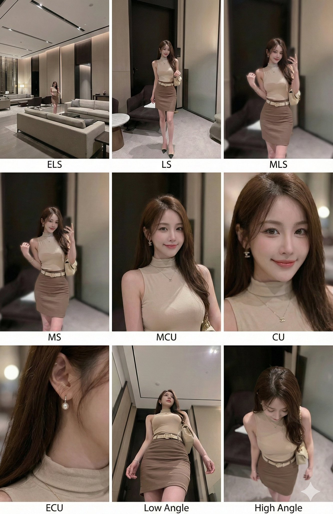
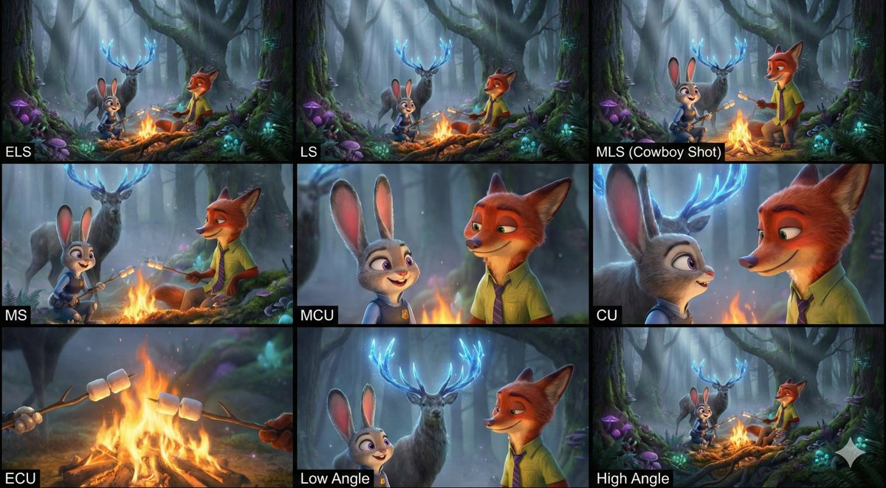
</div>

**中文提示词：**
```
<instruction> (指令)
分析输入图像的整个构图。识别所有存在的关键主体（无论是单人、群体/情侣、车辆还是特定物体）及其空间关系/互动。
生成一个连贯的 3x3 网格“电影印样（Contact Sheet）”，展示在同一环境中完全是这些主体的 9 个不同镜头。
你必须调整标准的电影镜头类型以适应内容（例如，如果是群体，保持群体在一起；如果是物体，构图包含整个物体）：
第 1 行（建立背景）：
大远景 (ELS)： 主体在广阔的环境中显得很小。
全景 (LS)： 完整的主体或群体从上到下可见（从头到脚 / 从车轮到车顶）。
中远景 (美式镜头/四分之三)： 构图从膝盖以上（针对人物）或 3/4 视角（针对物体）。
第 2 行（核心覆盖）：
4. 中景 (MS)： 构图从腰部以上（或物体的中心核心）。聚焦于互动/动作。
5. 中特写 (MCU)： 构图从胸部以上。主要主体的亲密构图。
6. 特写 (CU)： 紧凑构图于脸部或物体的“正面”。
第 3 行（细节与角度）：
7. 大特写 (ECU)： 强烈聚焦于关键特征（眼睛、手、标志、纹理）的微距细节。
8. 低角度镜头 (仰视/虫眼)： 从地面仰望主体（壮观/英雄感）。
9. 高角度镜头 (俯视/鸟瞰)： 从上方俯瞰主体。
确保严格的一致性：所有 9 个面板中是相同的人物/物体、相同的衣服和相同的光照。景深应逼真地变化（特写镜头中的背景虚化）。
</instruction>
一个包含 9 个面板的专业 3x3 电影故事板网格。
该网格以全面的焦距范围展示输入图像中的特定主体/场景。
顶行： 宽广环境镜头，全视图，3/4 剪辑（膝上景）。
中间行： 腰部以上视图，胸部以上视图，脸部/正面特写。
底行： 微距细节，低角度，高角度。
所有帧均具有照片般逼真的纹理，一致的电影级调色，以及针对所分析的主体或物体特定数量的正确构图。
```

<a id="prompt-628"></a>
## 案例 628：第一人称视角牵手照片 (来源 [@songguoxiansen](https://x.com/songguoxiansen/status/1994691557338013951)) 模型：通义Z-Image-Turbo

<div style="display: flex; justify-content: space-between;">
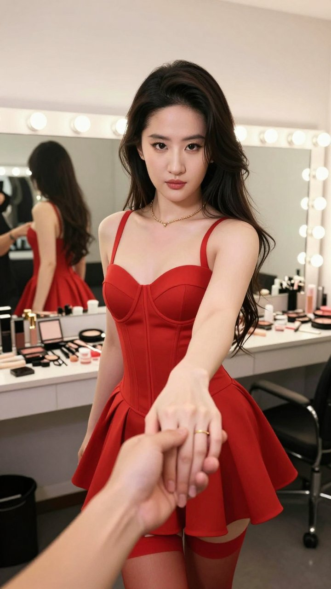
</div>

**中文提示词：**
```
说明：知名名人可能会生成失败，可换图片模型试试
一张超写实的第一人称男友视角照片，画面前景是男性的一只手正牵着长发造型的刘亦菲的手，她身穿红色吊带紧身胸衣短裙搭配红色薄透丝袜，佩戴金色项链，在后台化妆间内眼神迷人地注视着镜头，背景可见摆满化妆品的桌子及带灯泡的化妆镜（映出背影），采用直射闪光灯摄影风格，8K极致细节真实质感。
```

<a id="prompt-627"></a>
## 案例 627：MacBook Pro 笔记本电脑拆解 (来源 [@songguoxiansen](https://x.com/songguoxiansen/status/1994671420480356417)) 模型：Nano banana pro

<div style="display: flex; justify-content: space-between;">
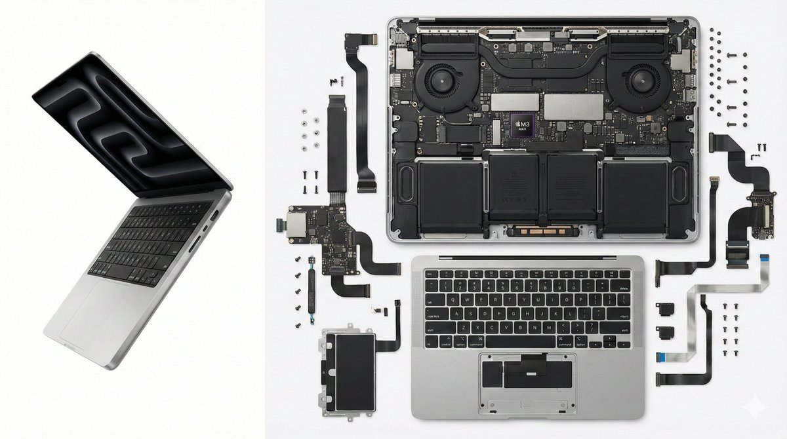
</div>

**中文提示词：**
```
MacBook Pro 笔记本电脑的极致拆解，左右分屏构图。左侧 1/3 展示合盖或半开状态的完整银色MacBook；右侧 2/3 展示极其复杂的内部构造，M系列芯片主板、风扇、铝合金外壳和键盘组件，按Knolling网格整齐平铺。纯白背景，商业产品摄影，高透光感，--ar 16:9
```

<a id="prompt-626"></a>
## 案例 626：黑白水墨画风格-孤舟蓑笠翁 (来源 [@songguoxiansen](https://x.com/songguoxiansen/status/1994949753524609418)) 模型：Nano banana pro

<div style="display: flex; justify-content: space-between;">
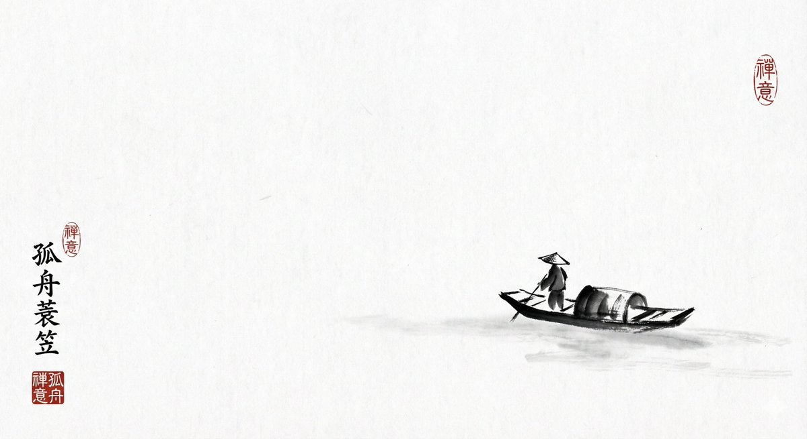
</div>

**中文提示词：**
```
黑白水墨画风格，留白意境，孤舟蓑笠翁，极简线条，宣纸纹理，红色印章点缀，东方哲学感
```

<a id="prompt-625"></a>
## 案例 625：在人物周围添加糖果怪兽 (来源 [@AI_GIRL_DESIGN](https://x.com/AI_GIRL_DESIGN/status/1993243344932413597)) 模型：Nano banana pro

<div style="display: flex; justify-content: space-between;">
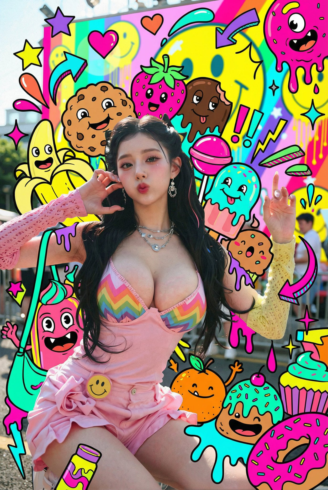
</div>

**提示词：**
```
Use the uploaded photo. 
Do NOT alter the person’s real appearance — keep the person’s face, body, clothing, colors, and texture completely photorealistic. 
Do NOT change the background perspective. 
Do NOT turn the person into a drawing or illustration.

Add a dense, overloaded layer of pop-style illustrated “sweets monsters” and graphic decorations ONLY around the person (and on top of their clothing if needed), but never on their skin or face.

Illustrated elements:
- many colorful cartoon monsters with thick black outlines, flat colors, and cute-but-ugly expressions
- sweets-inspired monsters: bananas, cookies, strawberries, melting chocolate, lollipops, ice cream, oranges, cupcakes, donuts, candy pieces, soda bottles, etc.
- additional graphic shapes: stars, hearts, arrows, drips, splashes, zigzag lines, exclamation marks, motion lines, sparkles, bubbles, comic-style text shapes (but no real text)

Make the decoration very dense and “busy”:
- fill the space behind the person with overlapping sweets monsters and shapes
- add monsters peeking from behind the shoulders, around the bag, at the person’s feet, and near the head
- allow some monsters and shapes to overlap the clothing and accessories (shirt, shorts, bag, shoes), but keep the skin of the face, arms, and legs photorealistic and visible
- use multiple layers of illustrations in front of and behind the person to create depth
- add glowing outlines, small white dots, and speed lines around the person to emphasize energy

Color and style:
- use a vivid, neon-like color palette (hot pink, yellow, cyan, lime, orange, purple, turquoise)
- keep all illustrated elements flat and graphic with clean edges and bold outlines
- ensure shadows and overlap suggest interaction with the real person (e.g., slight shadows on clothing where monsters touch)

Overall goal:
Create a highly decorated, maximalist pop-art scene where the real person stands in the middle, surrounded and wrapped by a chaotic crowd of playful sweets monsters and graphic doodles, while the person remains clearly photorealistic.
```

**中文提示词：**
```
请使用已上传的照片。
不要改变人物的真实外貌——保持人物的脸部、身体、衣服、颜色和纹理完全逼真。
请勿改变背景视角。
请勿将人物形象转化为绘画或插图。

在人物周围（必要时可以贴在衣服上）添加一层厚重的、过多的流行风格插画“糖果怪兽”和图形装饰，但绝不能贴在皮肤或脸上。

图示元素：
- 许多色彩鲜艳的卡通怪物，轮廓线粗黑，色彩扁平，表情可爱又丑陋。
- 以甜食为灵感的怪物：香蕉、饼干、草莓、融化的巧克力、棒棒糖、冰淇淋、橙子、纸杯蛋糕、甜甜圈、糖果块、汽水瓶等等。
- 其他图形形状：星星、心形、箭头、水滴、飞溅、锯齿线、感叹号、动态线条、闪光、气泡、漫画风格的文字形状（但不能包含实际文字）

装饰要非常密集、繁复：
- 用重叠的糖果怪兽和形状填满人身后的空间
- 添加一些怪物，它们会从肩膀后面、包周围、人的脚边和头部附近探出头来。
允许部分怪物和形状与服装及配饰（衬衫、短裤、包、鞋子）重叠，但保持面部、手臂和腿部的皮肤逼真可见。
- 在人物前后使用多层插图来营造景深。
- 在人物周围添加发光轮廓、小白点和速度线，以强调能量。

颜色和款式：
- 使用鲜艳的霓虹色系调色板（亮粉色、黄色、青色、酸橙色、橙色、紫色、蓝绿色）
- 保持所有插图元素扁平化、图形化，边缘清晰，轮廓粗犷。
- 确保阴影和重叠能够暗示与真人的互动（例如，怪物触碰衣服时在衣服上留下淡淡的阴影）

总体目标：
创作一幅装饰华丽、极繁主义的波普艺术场景，真人站在场景中央，被一群嬉戏玩闹的糖果怪兽和涂鸦图形包围，而真人则保持清晰的写实风格。
```

<a id="prompt-624"></a>
## 案例 624：手绘美颜科普图 (来源 [@cnyzgkc](https://x.com/cnyzgkc/status/1994954677579125124)) 模型：Nano banana pro

<div style="display: flex; justify-content: space-between;">
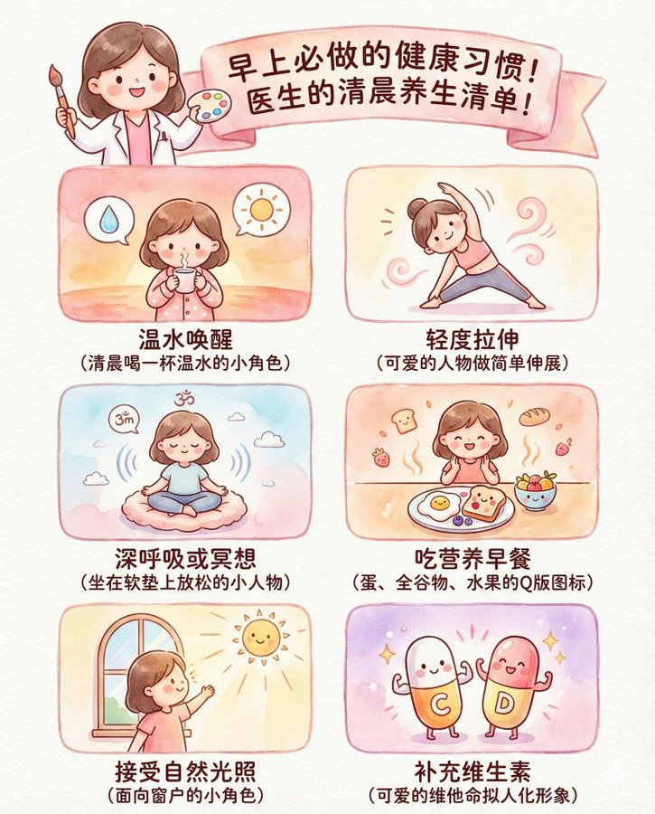
</div>

**中文提示词：**
```
Hand-drawn watercolor infographic, warm soft watercolor texture, pink tone, cute and clean design, 4:5 ratio, 1080x1350.

角色：一位专精医学保健的插画家兼医生，亲切微笑，手持水彩笔，风格卡通可爱。

主标题（上方）：缺什么营养素会变丑？医生的维生素美颜配方！

图表结构（下方开始）：
六个可爱人物，呈现六种“变丑症状”，搭配对应的卡通营养素图标。

示例内容（AI 可自由重绘，不要写实）：
1. 皮肤暗沉 → 维生素C（Vitamin C 卡通形象）
2. 眼睛干涩 → 维生素A（Vitamin A 卡通形象）
3. 掉发 → 维生素B、维生素D（B群、D 卡通形象）
4. （可继续根据文案自动生成更多症状与营养素）

风格要求：
手绘水彩感、粉色主调、柔和自然、轻松舒服的氛围。
人物要可爱、圆润、友好。
营养素图标为卡通拟人风格。
文字为清晰易读的手写笔记感字体。
整体排版简洁、资讯图表形式。

Lighting: soft, diffuse watercolor lighting.
Avoid: 照片感、真实皮肤纹理、过度写实、油画风、金属光泽。

best quality, high-res, clean edges, masterpiece.
```

<a id="prompt-623"></a>
## 案例 623：对作品进行评价 (来源 [@SSSS_CRYPTOMAN](https://x.com/SSSS_CRYPTOMAN/status/1994613956007039007)) 模型：Nano banana pro

<div style="display: flex; justify-content: space-between;">
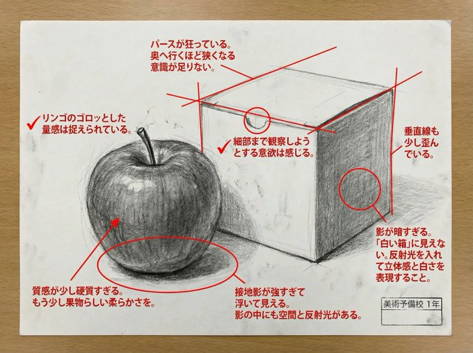
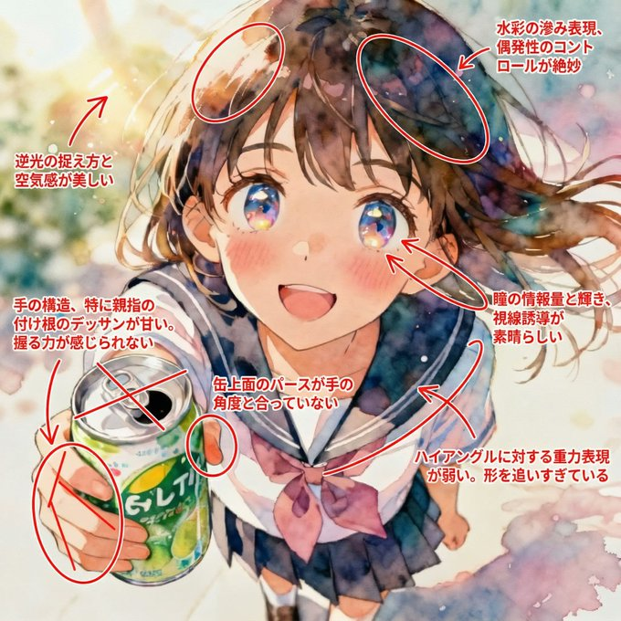
</div>

**提示词：**
```
Analyze this work in depth and critique it. In the image, mark the points that need correction and the points that are well done in red. Critique with unreserved opinions like a top art university lecturer.
```

**中文提示词：**
```
请深入分析并点评这部作品。在图像中用红色文字标注出需要修改的地方和做得好的地方。请像一流美术大学的讲师那样，毫无顾忌地发表意见进行点评。
```

<a id="prompt-622"></a>
## 案例 622：自信成熟女性室内电影肖像 (来源 [@ZaraIrahh](https://x.com/ZaraIrahh/status/1994586672504181025)) 模型：Nano banana pro

<div style="display: flex; justify-content: space-between;">
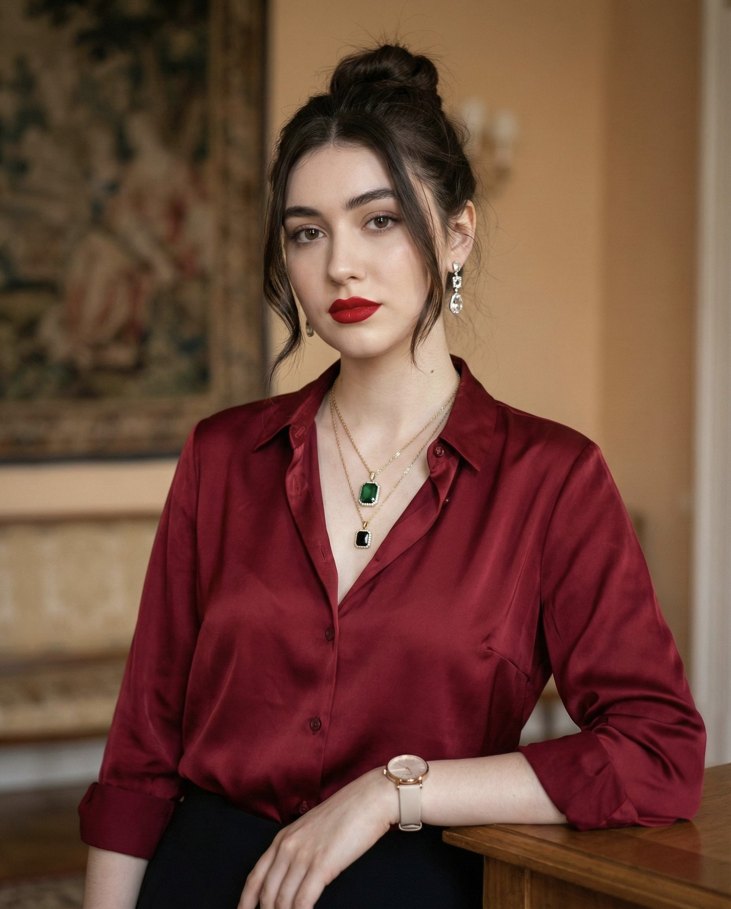
</div>

**提示词：**
```
{
  "image_description": {
    "face": {
      "preserve_original": true,
      "reference_match": true,
      "description": "Use the same facial features and identity from the uploaded image without altering any structure, proportions, or expression."
    },

    "photo_style": {
      "type": "indoor cinematic portrait",
      "camera_angle": "mid-shot, straight-on",
      "lighting": "soft warm indoor lighting with gentle highlights on skin and satin fabric",
      "mood": "elegant, confident, sophisticated",
      "depth_of_field": "shallow with lightly blurred background"
    },

    "subject": {
      "pose": "standing with relaxed posture, one hand resting on a wooden surface, body slightly turned forward",
      "expression": "calm, confident, slightly serious with bold red lips",
      "hair": {
        "style": "messy elegant bun with loose face-framing strands",
        "color": "dark brown"
      },
      "clothing": {
        "type": "deep red satin button-up blouse",
        "details": "luxurious sheen, slightly open neckline, sleeves loosely rolled"
      },
      "accessories": {
        "necklaces": [
          {
            "type": "gold chain",
            "pendant": "large emerald green stone"
          },
          {
            "type": "gold chain",
            "pendant": "black square pendant"
          }
        ],
        "earrings": "crystal drop earrings",
        "watch": "light-tone watch on left wrist"
      }
    },

    "environment": {
      "setting": "elegant indoor room",
      "background": [
        "decorative tapestry or framed wall art featuring pastoral scene",
        "warm-toned walls",
        "soft, classic interior elements"
      ],
      "atmosphere": "warm, refined, cinematic"
    },

    "aesthetic": {
      "style": "luxury editorial portrait",
      "features": [
        "warm tones",
        "rich textures",
        "glowing satin reflections",
        "elegant jewelry highlights",
        "balanced cinematic composition"
      ]
    }
  }
}
```

**中文提示词：**
```
{
"image_description": {
“脸”： {
"preserve_original": true,
"reference_match": true,
“描述”：“使用上传图像中相同的面部特征和身份，但不得改变任何结构、比例或表情。”
},

"photo_style": {
“类型”：“室内电影肖像”，
"camera_angle": "mid-shot, straight on",
“照明”：“柔和温暖的室内照明，在皮肤和缎面织物上营造柔和的高光效果”，
“情绪”：“优雅、自信、成熟”，
"depth_of_field": "浅景深，背景略微模糊"
},

“主题”： {
“姿势”：“站立姿势放松，一只手放在木质表面上，身体略微前倾”，
“表情”：“冷静、自信、略带严肃，配以鲜艳的红唇”，
“头发”： {
“发型”：“凌乱优雅的发髻，垂落几缕碎发修饰脸型”，
颜色：深棕色
},
“衣服”： {
“类型”: “深红色缎面纽扣衬衫”
细节：奢华光泽，略微敞开的领口，袖子随意卷起。
},
“配件”： {
“项链”：[
{
“类型”：“金链”，
“吊坠”： “大颗祖母绿宝石”
},
{
“类型”：“金链”，
“吊坠”： “黑色方形吊坠”
}
],
“耳环”: “水晶吊坠耳环”
“手表”： “左手腕上的浅色手表”
}
},

“环境”： {
“场景”：“优雅的室内房间”，
“背景”： [
“以田园风光为主题的装饰挂毯或装裱墙饰”
“暖色调的墙壁”，
“柔和、经典的室内元素”
],
“氛围”：“温暖、精致、电影感”
},

“审美的”： {
“风格”: “奢华的编辑肖像”
“特征”： [
“暖色调”，
“丰富的质感”，
“闪亮的缎面反射”，
“优雅的珠宝亮点”，
“均衡的电影构图”
]
}
}
}
```

<a id="prompt-621"></a>
## 案例 621：一只手拿着上传图片中的产品 (来源 [@egeberkina](https://x.com/egeberkina/status/1994380091241922920)) 模型：Nano banana pro

<div style="display: flex; justify-content: space-between;">
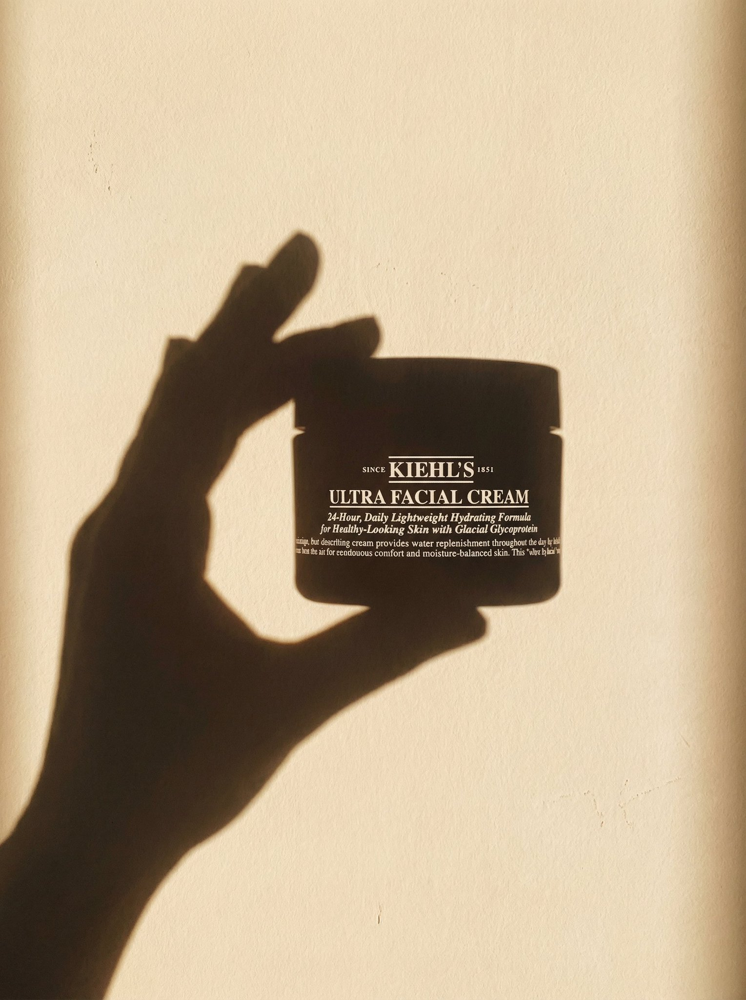
</div>

**提示词：**
```
A minimal sunlit wall. Sharp, elongated shadow of a human hand holding the exact product from the uploaded image. Recreate the product’s silhouette precisely in the shadow, accurate bottle shape, cap, edges, proportions. Project the product’s real label text (taken from the uploaded image) onto the shadow in clean, crisp white typography, perfectly matching placement, spacing, and size.Warm afternoon sunlight, soft grain, smooth beige wall texture. Ultra-minimal, high-end skincare aesthetic. No extra objects, no color except the natural wall tone. Artistic shadow-play composition, subtle dreamy atmosphere, natural imperfections on the wall, gently diffused light
```

**中文提示词：**
```
一面阳光照射的极简主义墙面。一只手拿着上传图片中的产品，投射出清晰而修长的影子。在阴影中精确地重现产品的轮廓，包括瓶身形状、瓶盖、边缘和比例。将产品标签上的真实文字（取自上传图片）以简洁清晰的白色字体投射到阴影上，确保位置、间距和大小完美匹配。温暖的午后阳光，柔和的米色墙面纹理。极简主义的高端护肤美学。除墙面自然色调外，不添加任何其他物品或颜色。艺术化的光影组合，营造出微妙梦幻的氛围，保留墙面的自然纹理，并柔和地漫射光线。
```

<a id="prompt-620"></a>
## 案例 620：超写实性感大嘴人物肖像 (来源 [@YaseenK7212](https://x.com/YaseenK7212/status/1994634660459024649)) 模型：Nano banana pro

<div style="display: flex; justify-content: space-between;">
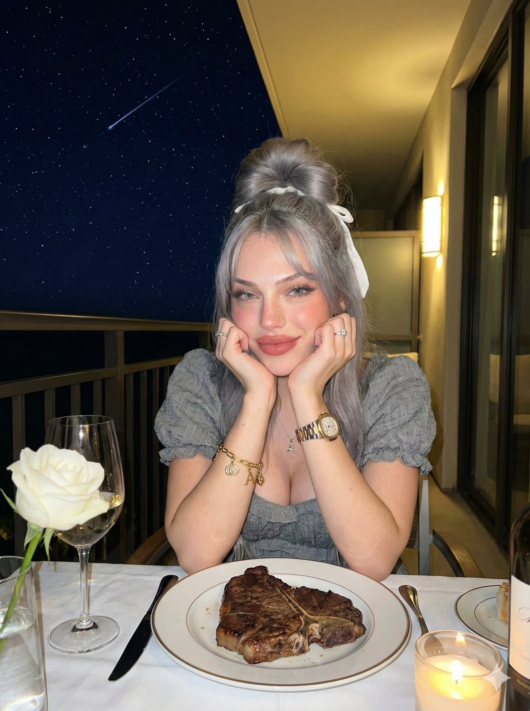
</div>

**提示词：**
```
{
  "project": "Ultra-Realistic Portrait",
  "reference_settings": {
    "use_reference_image": true,
    "fidelity_strength": "100%",
    "instruction": "Face and outfit must match reference photo 100% with absolutely no alterations."
  },
  "subject": {
    "demographics": "Woman",
    "focus_features": ["Eyes", "Nose", "Lips"],
    "expression": "Smiling, cute, fresh, dreamy, slightly sensual",
    "pose": "Sitting at a white table, resting chin on both hands, turning slightly",
    "hair": {
      "style": "Straight, large top bun",
      "accessory": "Bow matching the outfit",
      "texture": "Soft layered, loose strands falling naturally across face",
      "movement": "Slightly blown by wind"
    },
    "makeup": {
      "cheeks": "Natural blush on cheeks and nose",
      "lips": "Full lips, soft pink-peach tone"
    }
  },
  "fashion_and_accessories": {
    "outfit": "Exact match to reference image",
    "shoes": "High-heel shoes (matching reference)",
    "bag": "Same bag as reference photo",
    "jewelry": {
      "necklace": "Thin gold with alternating charms (heart, crescent moon, Gucci pendant)",
      "bracelet": "Delicate Gucci bracelet with charms",
      "rings": "Gold rings",
      "watch": "Steel-band Patek Philippe",
      "earrings": "Small gold Gucci earrings"
    }
  },
  "environment": {
    "location": "Luxury hotel terrace / Seaside",
    "time_of_day_options": [
      "Option A: Deep blue evening sky, stars, shooting star, moonlight",
      "Option B: Early sunrise, orange-yellow sky tones"
    ],
    "background_elements": [
      "Warm reflections from luxury hotel",
      "Calm seascape"
    ]
  },
  "props": {
    "table_setting": "White table",
    "items": [
      "Glass with a single white rose",
      "Wine glass",
      "Wine bottle",
      "Plate set with knife and fork",
      "Large T-bone steak in center",
      "Candle glass (adding warm highlight)"
    ]
  },
  "photography_style": {
    "aesthetic": "2000s digital-camera flash style",
    "lighting": "Realistic flash brightness, warm tone, slight shine on skin",
    "mood": "Relaxing, warm, nostalgic, stylish, elegant, slightly sexy",
    "shot_type": "Close-up portrait"
  },
  "technical_parameters": {
    "aspect_ratio": "3:4",
    "detail_level": "8k",
    "style_tags": ["photo", "realistic", "flash photography"]
  }
}
```

**中文提示词：**
```
{
“项目”：“超写实肖像”，
"reference_settings": {
"use_reference_image": true,
"fidelity_strength": "100%",
“说明”：“面部和服装必须与参考照片100%一致，绝对不能做任何修改。”
},
“主题”： {
“人口统计信息”：“女性”，
"focus_features": ["眼睛", "鼻子", "嘴唇"],
“表情”：“微笑、可爱、清新、梦幻、略带性感”
“姿势”：“坐在白色桌子旁，双手托腮，微微侧身”，
“头发”： {
“发型”：“直发，大发髻”，
“配饰”：“与服装相配的蝴蝶结”，
“质感”：“柔软、层次分明、自然垂落在脸上的发丝”，
“运动”：“微风吹拂”
},
“化妆品”： {
“脸颊”： “脸颊和鼻子上的自然红晕”
“嘴唇”：丰满的嘴唇，柔和的粉桃色调
}
},
"fashions_and_accessories": {
“服装”: “与参考图片完全匹配”，
“鞋子”：“高跟鞋（配套参考）”
“包”： “与参考照片相同的包”
“珠宝”： {
“项链”：“细金项链，饰有交替的吊坠（心形、新月形、Gucci吊坠）”
“手镯”：“精致的 Gucci 手镯，带有吊坠”，
“戒指”： “金戒指”，
“手表”: “钢带百达翡丽”
“耳环”： “古驰小金耳环”
}
},
“环境”： {
位置：豪华酒店露台/海滨
"time_of_day_options": [
“选项A：深蓝色的傍晚天空，繁星，流星，月光，”
选项B：清晨日出，橙黄色的天空色调
],
“背景元素”：[
“来自豪华酒店的温馨回响”
“平静的海景”
]
},
"props": {
"table_setting": "白色桌子",
“项目”： [
“一杯插着一朵白玫瑰的酒”
“酒杯”，
“葡萄酒瓶”，
“餐盘套装，含刀叉”
“中间是一块大块的T骨牛排”，
“烛台玻璃（增添暖色调高光）”
]
},
"photography_style": {
“美学”：“2000年代数码相机闪光灯风格”，
“光照”：“逼真的闪光亮度，暖色调，皮肤略带光泽”，
“氛围”：“轻松、温暖、怀旧、时尚、优雅、略带性感”
"shot_type": "特写肖像"
},
"technical_parameters": {
"aspect_ratio": "3:4",
"detail_level": "8k",
"style_tags": ["photo", "realistic", "flash photography"]
}
}
```

<a id="prompt-619"></a>
## 案例 619：90年代电影质感的逼真香港复古肖像照 (来源 [@ShreyaYadav___](https://x.com/ShreyaYadav___/status/1994430035554603247)) 模型：Nano banana pro

<div style="display: flex; justify-content: space-between;">
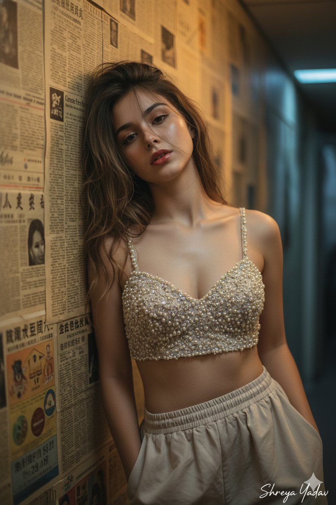
</div>

**提示词：**
```
Photorealistic Hong Kong retro portrait with authentic 1990s film look.
Use image [0] as face reference. Half-body. Subject leaning against newspaper-covered wall, gaze soft and melancholic. Cropped bralette top embroidered with pearls and sequins Loose high-waisted trousers with elastic waistband, typical 1990s street style. Hair messy, strands falling across face. Makeup glossy lips, dewy skin. Narrow Hong Kong room, walls plastered with old yellowed Cantonese newspapers.
```

**中文提示词：**
```
具有90年代电影质感的逼真香港复古肖像照。
以图[0]为面部参考。半身像。人物倚靠在贴满报纸的墙上，目光柔和而忧郁。身穿饰有珍珠和亮片的露脐抹胸上衣，搭配宽松的高腰松紧裤，典型的90年代街头风格。头发凌乱，几缕发丝垂落在脸颊。妆容精致，唇部光泽，肌肤水润。狭窄的香港房间，墙壁上贴满了泛黄的旧粤语报纸。

签名：Shreya Yadav
```

<a id="prompt-618"></a>
## 案例 618：四幅时尚生活场景组成的拼贴画 (来源 [@_MehdiSharifi_](https://x.com/_MehdiSharifi_/status/1994168239442510308)) 模型：Nano banana pro

<div style="display: flex; justify-content: space-between;">
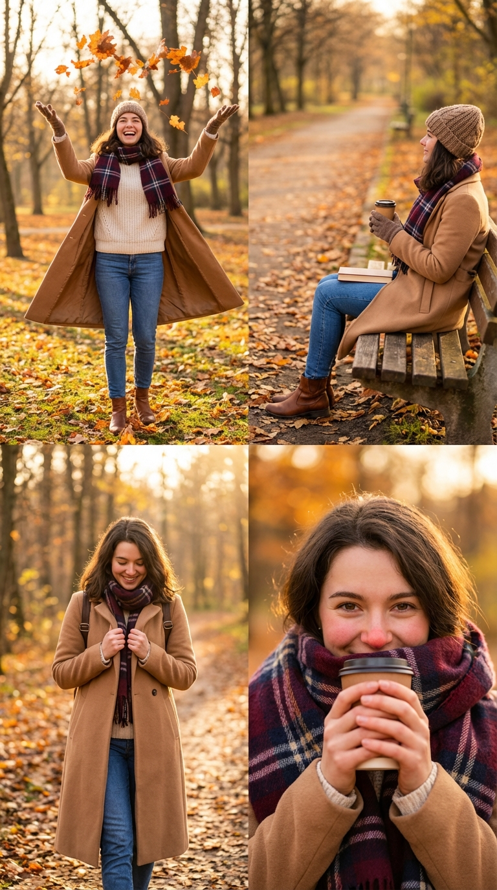
</div>

**提示词：**
```
{
  "scene_description": "A cohesive 4-panel fashion lifestyle collage featuring the same young woman in a cozy layered autumn outfit, showcasing relaxed poses in nature.",
  "subject": {
    "type": "Young Woman (Consistent character)",
    "age": "early 20s",
    "features": {
      "hair": "loose natural hair with beanie",
      "makeup": "rosy cheeks"
    },
    "attire": "chunky knit sweater, plaid scarf, long wool coat, jeans, boots",
    "accessories": "takeaway coffee cup"
  },
  "collage_layout": {
    "structure": "2x2 Grid Layout (4 frames of equal size)",
    "panel_1_top_left": "Full Body Dynamic: Throwing autumn leaves in the air or twirling, coat flowing, smiling broadly.",
    "panel_2_top_right": "Sitting Side View: Sitting on a park bench with legs crossed, reading a book or looking at the scenery, holding coffee.",
    "panel_3_bottom_left": "Mid-Shot Walking: Walking towards the camera holding the lapels of the coat, looking down shyly or smiling.",
    "panel_4_bottom_right": "Portrait with Prop: Peeking out from behind the oversized scarf, holding the coffee cup near face for warmth, eyes smiling."
  },
  "environment": {
    "setting": "Autumn Park / Forest Path",
    "background_elements": [
      "Orange and yellow leaves",
      "Trees",
      "Park bench"
    ]
  },
  "lighting": {
    "style": "Golden Hour Soft",
    "key_light": {
      "type": "Low Autumn Sun",
      "color": "Warm Golden",
      "effect": "Backlight or soft front light, magical atmosphere"
    }
  },
  "style": {
    "medium": "Portrait Photography",
    "aesthetic": "Cottagecore, Autumn Vibes, Cozy, Pinterest",
    "quality": "8k resolution, warm tones"
  },
  "attire_customization": {
    "current_clothing": "Wool coat and knitwear",
    "customizable_clothing": "User can swap for puffer jacket or raincoat"
  },
  "brand_product_customization": {
    "current_brand_product": "Winter Apparel",
    "customizable_brand": "User: Insert Brand Name",
    "customizable_product": "User: Specific coat or boots",
    "product_placement_area": "Coat texture or boots"
  }
}
```

**中文提示词：**
```
{
“场景描述”： “这是一幅由四幅时尚生活场景组成的拼贴画，画面中同一位年轻女子身着舒适的秋季叠穿服装，在自然环境中摆出轻松的姿势。”
“主题”： {
“类型”：“年轻女子（性格始终如一）”
“年龄”：“20岁出头”，
“特征”： {
“头发”：“披散的自然头发，戴着毛线帽”，
“妆容”：“红润的脸颊”
},
着装：粗针织毛衣、格子围巾、长羊毛大衣、牛仔裤、靴子。
配件：外带咖啡杯
},
"collage_layout": {
"结构": "2x2 网格布局（4 个大小相同的框架）",
"panel_1_top_left": "全身动态：抛洒秋叶或旋转，外套飘动，笑容灿烂。"
"panel_2_top_right": "坐姿侧视图：坐在公园长椅上，双腿交叉，手拿咖啡，正在看书或欣赏风景。"
"panel_3_bottom_left": "中景行走：走向镜头，抓住外套翻领，害羞地低头或微笑。"
"panel_4_bottom_right": "带道具的肖像：从超大的围巾后面探出头来，手里拿着咖啡杯贴近脸庞取暖，眼神中带着微笑。"
},
“环境”： {
“设置”: “秋季公园/森林小径”
“背景元素”：[
“橙色和黄色的叶子”，
“树木”，
“公园长椅”
]
},
“灯光”： {
“风格”：“金色时光柔和”
"key_light": {
“类型”：“低垂的秋日阳光”，
颜色：暖金色，
效果：背光或柔和的前光，营造出梦幻般的氛围
}
},
“风格”： {
“媒介”: “人像摄影”
“美学”：“田园风、秋日氛围、舒适、Pinterest”
“品质”：“8K分辨率，暖色调”
},
"attire_customization": {
"current_clothing": "羊毛大衣和针织衫",
"customizable_clothing": "用户可以换成羽绒服或雨衣"
},
"品牌产品定制": {
"current_brand_product": "冬季服装",
"customizable_brand": "用户：插入品牌名称",
"customizable_product": "用户：特定外套或靴子",
"product_placement_area": "外套纹理或靴子"
}
}
```

<a id="prompt-617"></a>
## 案例 617：四幅时尚生活场景组成的连贯拼贴画 (来源 [@_MehdiSharifi_](https://x.com/_MehdiSharifi_/status/1994166992719299026)) 模型：Nano banana pro

<div style="display: flex; justify-content: space-between;">
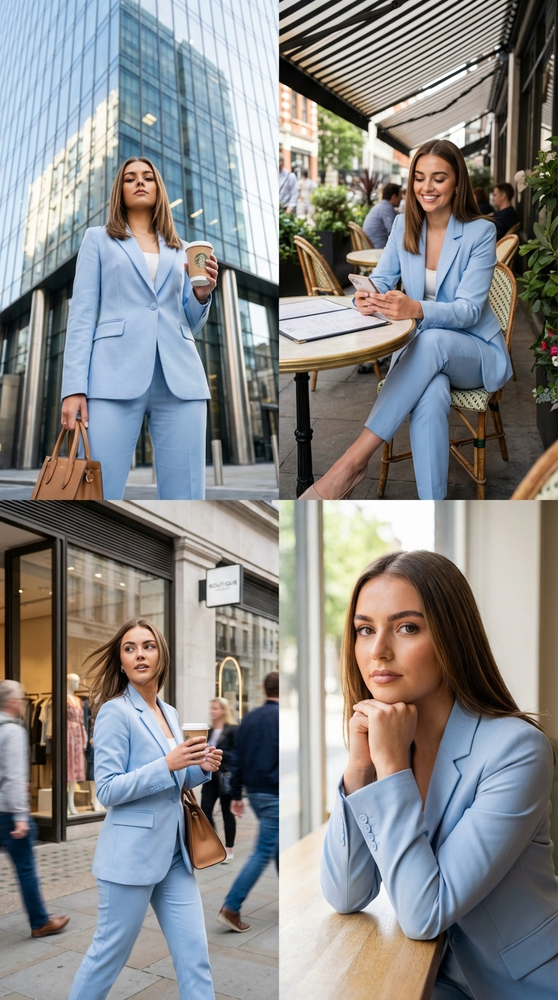
</div>

**提示词：**
```
{
  "scene_description": "A cohesive 4-panel fashion lifestyle collage featuring the same young woman in a glamorous evening outfit, showcasing cinematic poses under city lights.",
  "subject": {
    "type": "Young Woman (Consistent character)",
    "age": "early 20s",
    "features": {
      "hair": "glamorous waves",
      "makeup": "evening look with red lip"
    },
    "attire": "black satin slip dress, leather jacket draped over shoulders, strappy heels",
    "accessories": "sparkly clutch, earrings"
  },
  "collage_layout": {
    "structure": "2x2 Grid Layout (4 frames of equal size)",
    "panel_1_top_left": "Full Body Flash Shot: Standing against a metallic door or shutter, posing with one leg forward, looking fierce (flash photography style).",
    "panel_2_top_right": "Over-the-Shoulder: Looking back at the camera while walking away towards neon city lights, showcasing the back of the dress/jacket.",
    "panel_3_bottom_left": "Seated Profile: Sitting on a high bar stool or velvet booth, holding a mocktail, laughing candidly towards someone off-camera.",
    "panel_4_bottom_right": "Artistic Portrait: Standing near a neon sign, face illuminated by pink/blue light, looking dreamily upwards."
  },
  "environment": {
    "setting": "City at Night / Rooftop Bar",
    "background_elements": [
      "Neon signs",
      "City bokeh",
      "Dark shadows"
    ]
  },
  "lighting": {
    "style": "Flash & Neon Mixed",
    "key_light": {
      "type": "Camera Flash / Neon Sign",
      "color": "Cool White / Vibrant Colors",
      "effect": "High contrast, edgy vibe"
    }
  },
  "style": {
    "medium": "Flash Photography / Film Aesthetic",
    "aesthetic": "Night Luxe, Party Vibe, Cinematic, Edgy",
    "quality": "8k resolution, slight grain"
  },
  "attire_customization": {
    "current_clothing": "Slip dress and leather jacket",
    "customizable_clothing": "User can swap for sequin dress or jumpsuit"
  },
  "brand_product_customization": {
    "current_brand_product": "Evening Wear",
    "customizable_brand": "User: Insert Brand Name",
    "customizable_product": "User: Specific dress or makeup",
    "product_placement_area": "Dress silhouette"
  },
  "technical_tags": "--v 6 --ar 4:5 --stylize 400 --no daylight, office setting"
}
```

**中文提示词：**
```
{
“场景描述”： “这是一幅由四幅时尚生活场景组成的连贯拼贴画，画中同一位年轻女子身着华丽的晚礼服，在城市灯光下摆出极具电影感的姿势。”
“主题”： {
“类型”：“年轻女子（性格始终如一）”
“年龄”：“20岁出头”，
“特征”： {
“头发”：“迷人的波浪卷发”，
“妆容”：“晚宴妆容，搭配红唇”
},
“着装”：“黑色缎面吊带裙，肩上披着皮夹克，细带高跟鞋”，
“配饰”：闪亮手拿包、耳环
},
"collage_layout": {
"结构": "2x2 网格布局（4 个大小相同的框架）",
"panel_1_top_left": "全身闪光照：倚靠在金属门或卷帘门上，一条腿向前迈出，摆出凶狠的姿势（闪光摄影风格）。"
"panel_2_top_right": "过肩视角：边走边回头看向镜头，朝着霓虹闪烁的城市灯光走去，展示连衣裙/外套的背面。"
"panel_3_bottom_left": "坐姿侧脸：坐在高脚吧台凳或天鹅绒卡座上，手持一杯无酒精鸡尾酒，对着镜头外的人开怀大笑。"
"panel_4_bottom_right": "艺术肖像：站在霓虹灯招牌旁，脸部被粉色/蓝色灯光照亮，眼神梦幻般地向上凝视。"
},
“环境”： {
“场景”：“夜幕下的城市/屋顶酒吧”，
“背景元素”：[
霓虹灯招牌
“城市散景”
“黑暗阴影”
]
},
“灯光”： {
“风格”：“闪光与霓虹混合”，
"key_light": {
"type": "相机闪光灯/霓虹灯标志",
“颜色”：“冷白/鲜艳色彩”，
“效果”：“高对比度，前卫氛围”
}
},
“风格”： {
“媒介”：“闪光摄影/胶片美学”，
“美学”：“夜间奢华、派对氛围、电影感、前卫”
“画质”：“8K分辨率，略带颗粒感”
},
"attire_customization": {
"current_clothing": "吊带裙和皮夹克",
"customizable_clothing": "用户可以换成亮片连衣裙或连体裤"
},
"品牌产品定制": {
"current_brand_product": "晚礼服",
"customizable_brand": "用户：插入品牌名称",
"customizable_product": "用户：特定服装或妆容",
"product_placement_area": "连衣裙轮廓"
},
"technical_tags": " --v 6 --ar 4:5 --stylize 400 --no daylight, office setting"
}
```

<a id="prompt-616"></a>
## 案例 616：女生背对着观众坐在编织沙发上 (来源 [@chatgptpaglu](https://x.com/chatgptpaglu/status/1994689429487734995)) 模型：Nano banana pro

<div style="display: flex; justify-content: space-between;">
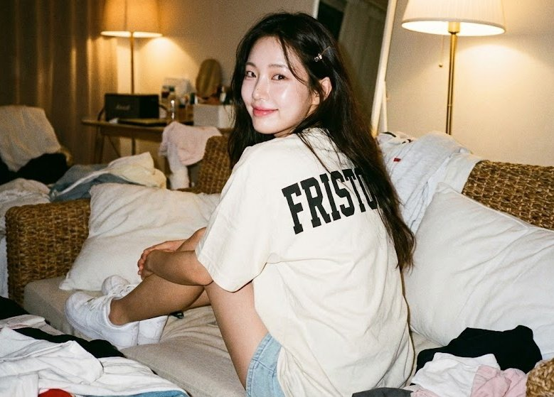
</div>

**提示词：**
```
{
  "image_generation": {
    "identity": {
      "preserve_original": true,
      "reference_match": true,
      "description": "Facial features must remain exactly identical to the provided reference photo."
    },

    "photo_style": {
      "type": "hyperrealistic lifestyle photo",
      "camera_vibe": "Olympus MJU II aesthetic",
      "lighting": "warm dim indoor lighting OR 35mm film-style flash",
      "tone": "warm vintage VSCO vibe",
      "texture": "soft grain, subtle film rendering",
      "framing": "wide shot showing interior room details"
    },

    "subject": {
      "pose": {
        "body": "sitting on a woven sofa with back turned to the viewer",
        "legs": "folded comfortably",
        "hands": "one hand resting on the sofa",
        "head": "looking over shoulder at the camera",
        "expression": "playful, soft, naturally charming"
      },

      "appearance": {
        "hair": {
          "length": "long",
          "style": "loose with a side part",
          "accessory": "simple small hair clip"
        },
        "makeup": {
          "style": "light Korean glass-skin makeup",
          "details": {
            "skin": "glowy, dewy finish",
            "lips": "soft pink",
            "eyes": "minimal eyeshadow, natural lashes"
          }
        }
      },

      "clothing": {
        "top": {
          "type": "cream oversized vintage T-shirt",
          "print": "bold graphic text 'FRISTO' on the back"
        },
        "bottom": {
          "type": "light high-waisted denim shorts"
        },
        "shoes": {
          "type": "white sneakers"
        }
      }
    },

    "environment": {
      "setting": "cozy messy room",
      "elements": [
        "woven sofa",
        "white pillows",
        "scattered clothes in the foreground",
        "soft indoor clutter for authentic lifestyle atmosphere"
      ],
      "lighting_effects": [
        "warm dim glow",
        "or direct compact film camera flash",
        "soft warm shadows enhancing vintage mood"
      ]
    },

    "aesthetic": {
      "style": "vintage lifestyle editorial",
      "vibe": "warm, nostalgic, candid",
      "features": [
        "rich room detail",
        "natural textures of fabric and skin",
        "soft grain and warm tones"
      ]
    }
  }
}
```

**中文提示词：**
```
{
"image_generation": {
“身份”： {
"preserve_original": true,
"reference_match": true,
“描述”：“面部特征必须与提供的参考照片完全一致。”
},

"photo_style": {
“类型”：“超写实生活方式照片”，
"camera_vibe": "Olympus MJU II 美学"
“照明”：“温暖昏暗的室内照明或 35 毫米胶片式闪光灯”，
"色调": "温暖复古的VSCO氛围",
“质感”：“柔和的颗粒感，细腻的胶片质感”，
“构图”：“展现室内细节的广角镜头”
},

“主题”： {
"姿势": {
“身体”：“背对着观众坐在编织沙发上”，
“腿”：“舒适地折叠起来”，
“双手”：“一只手放在沙发上”，
“头部”：“回头看向镜头”，
“表情”：“活泼、温柔、自然迷人”
},

“外貌”： {
“头发”： {
"length": "长",
“发型”：“侧分披肩”，
“配饰”：“简单的小发夹”
},
“化妆品”： {
“风格”：“清透韩式水光肌妆容”，
“细节”： {
“肌肤”：“光泽、水润妆效”，
“嘴唇”：“柔和的粉红色”，
“眼妆”：“淡眼影，自然睫毛”
}
}
},

“衣服”： {
“顶部”： {
“类型”：“奶油色超大复古T恤”，
“印刷”：“背面印有粗体字‘FRISTO’”
},
“底部”： {
类型：轻薄高腰牛仔短裤
},
“鞋”： {
类型：白色运动鞋
}
}
},

“环境”： {
“场景”: “温馨凌乱的房间”
“元素”：[
“编织沙发”，
“白色枕头”，
“前景中散落的衣物”，
“营造真实生活氛围的柔和室内杂物”
],
"lighting_effects": [
“温暖昏暗的光芒”，
“或直接使用小型胶片相机闪光灯”，
“柔和温暖的阴影增强了复古氛围”
]
},

“审美的”： {
“风格”：“复古生活方式专题报道”，
“氛围”：“温暖、怀旧、坦诚”，
“特征”： [
“丰富的房间细节”，
“织物和皮肤的自然纹理”，
“柔和的纹理和温暖的色调”
]
}
}
}
```

<a id="prompt-615"></a>
## 案例 615：人和机器人的温馨时刻 (来源 [@Samann_ai](https://x.com/Samann_ai/status/1994444395525832898)) 模型：Nano banana pro

<div style="display: flex; justify-content: space-between;">
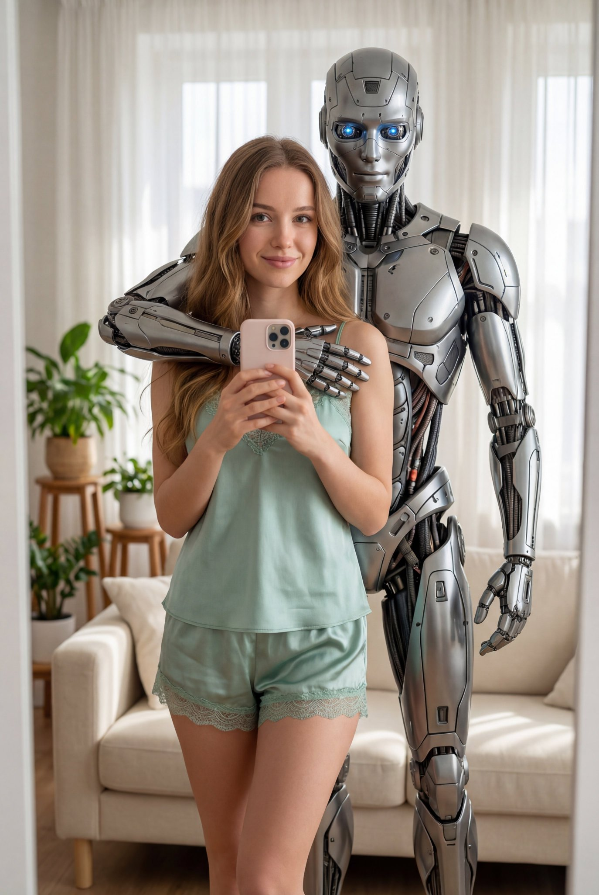
</div>

**提示词：**
```
{
  "prompt": "hyperrealistic ultra-detailed 8k photo of YOU (Upload Your Photo) standing in a bright cozy living room, same location as the reference: cream-colored sofa, large white curtains with soft daylight shining through, warm neutral walls, several green houseplants, minimal decor, natural sunlight and soft shadows. Use the uploaded photo as the main subject of the image, preserving the face, hairstyle, body type, clothing, and overall style exactly as in the uploaded photo. The subject is standing in front of the sofa, body slightly angled to the side, legs close together, one hip slightly popped, holding a smartphone in one hand at chest height, screen facing them, as if taking a mirror selfie, with a relaxed confident expression and slight smile, eyes toward the phone. Behind them, their partner is standing very close, a tall, attractive humanoid robot with a highly muscular, athletic build, entirely robotic with no human skin, detailed mechanical anatomy inspired by a futuristic cyborg: layered silver and gunmetal plates, visible bundles of flexible cables as muscles, complex joints, smooth armor around shoulders, chest, arms, and legs, elegant angular robotic face with a strong jawline, glowing blue eyes, subtle wear and micro-scratches on metal for realism. The robot’s torso is broad and V-shaped, narrow waist, perfect proportions, clearly fit and powerful but aesthetically beautiful. The robot stands just behind the subject with one sleek metallic arm wrapped gently and protectively around the front of their neck and shoulders, hand resting softly near the collarbone in an affectionate pose, the other arm relaxed at its side. Their bodies are close, giving a sense of intimacy and comfort. Extremely realistic skin texture on the subject, natural hair strands, detailed fabric texture and wrinkles on their clothing, realistic reflections and specular highlights on the robot’s metal surfaces, accurate global illumination and depth of field, sharp focus on both characters, slight background blur. Photoreal, cinematic lighting, no fantasy effects, looks like a real candid photo taken on a phone in this apartment.",
  "negative_prompt": "cartoon, anime, illustration, painting, 3d render, CGI, low resolution, blurry, grainy, oversaturated, unrealistic proportions, extra limbs, deformed hands, distorted face, visible mirror edges, text, watermark, logo, armor covering the subject, human skin on the robot, grotesque, horror, gore"
}
```

**中文提示词：**
```
{
“提示”：拍摄一张超逼真、细节丰富的8K照片，照片中的人物（上传您的照片）站在明亮舒适的客厅中，地点与参考照片相同：米色沙发，白色大窗帘透进柔和的日光，暖色调的墙面，几盆绿色植物，简约的装饰，自然光和柔和的阴影。使用上传的照片作为图像的主体，保留照片中人物的面部、发型、体型、服装和整体风格。人物站在沙发前，身体略微侧倾，双腿并拢，一侧臀部微微翘起，一手拿着智能手机，屏幕朝向自己，仿佛在自拍，表情轻松自信，略带微笑，目光注视着手机。人物身后站着一位身材高挑、外形俊朗的人形机器人，肌肉线条流畅，体格健壮，完全由机械构成，没有人类皮肤，拥有未来主义赛博格风格的精细机械结构：层叠的银色和枪灰色金属板，以及清晰可见的柔性电缆束。肌肉线条分明，关节复杂，肩部、胸部、手臂和腿部的盔甲光滑流畅，优雅的棱角分明的机械面孔，下颚线条硬朗，湛蓝的双眼闪闪发光，金属表面细微的磨损和划痕更添真实感。机器人的躯干宽阔呈V字形，腰部纤细，比例完美，既健壮有力又不失美感。机器人站在拍摄对象身后，一只光滑的金属手臂温柔地环绕着拍摄对象的颈肩，一只手轻轻地放在锁骨附近，姿态亲昵，另一只手臂自然垂于身侧。两人身体靠近，营造出亲密舒适的氛围。拍摄对象的皮肤纹理极其逼真，头发自然垂落，衣物上的织物纹理和褶皱也十分细致，机器人金属表面的反射和高光效果逼真，整体光照和景深控制精准，两个人物都清晰对焦，背景略微虚化。照片级的真实感，电影级的灯光效果，没有任何奇幻特效，看起来就像是用手机在公寓里随手拍下的真实照片。
"negative_prompt": "卡通、动画、插画、绘画、3D渲染、CGI、低分辨率、模糊、颗粒感强、过度饱和、比例失调、多余肢体、畸形手、扭曲面部、可见镜像边缘、文字、水印、标志、盔甲覆盖主体、机器人身上覆盖人类皮肤、怪诞、恐怖、血腥"
}
```

<a id="prompt-614"></a>
## 案例 614：一幅赛博武士的详细技术图解 (来源 [@LudovicCreator](https://x.com/LudovicCreator/status/1994390935019360466)) 模型：Nano banana pro

<div style="display: flex; justify-content: space-between;">
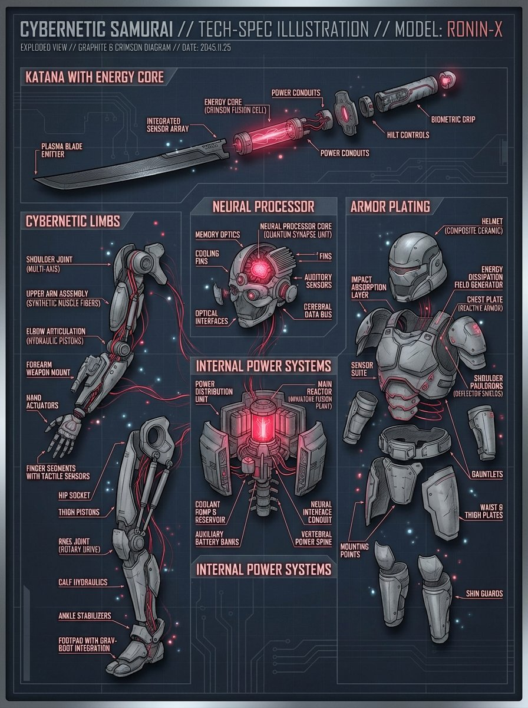
</div>

**提示词：**
```
Create a detailed technical illustration of a Cybernetic Samurai, exploded into components: katana with energy core, cybernetic limbs, neural processor, armor plating, and internal power systems. Each part is labeled with clean futuristic font. Use a graphite and crimson color scheme on a dark blueprint background. Add subtle particle glow and depth shadows. Studio render style.
```

**中文提示词：**
```
创作一幅赛博武士的详细技术图解，将其拆解为核心部件：带能量核心的武士刀、机械义肢、神经处理器、装甲板以及内部动力系统。每个部件均采用简洁的未来风格字体标注。整体采用石墨色与深红色配色方案，搭配深色蓝图背景。添加微弱的粒子光晕效果与层次感阴影，整体呈现工作室渲染风格。
```

<a id="prompt-613"></a>
## 案例 613：女子坐在地板上准备喝可乐 (来源 [@lexx_aura](https://x.com/lexx_aura/status/1994446756978020701)) 模型：Nano banana pro

<div style="display: flex; justify-content: space-between;">
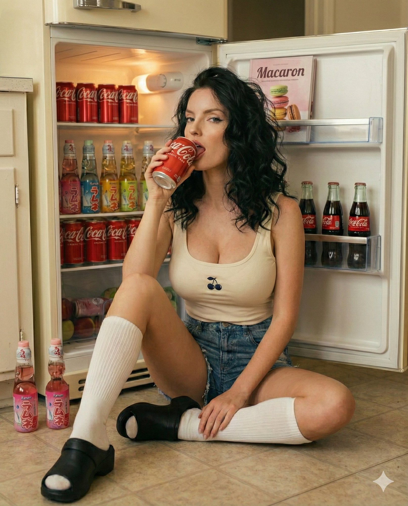
</div>

**提示词：**
```
{
  "scene": {
    "subject": {
      "demographics": "Young woman",
      "pose": "Sitting on the floor, facing forward",
      "expression": "Slightly serious or pensive, direct eye contact",
      "appearance_constraints": "Maintain original facial features",
      "hair": {
        "color": "Dark",
        "style": "Long, straight, middle part",
        "accessory": "White bandana with red accents"
      },
      "makeup": {
        "eyes": "Defined with eyeliner",
        "lips": "Soft pink"
      },
      "apparel": {
        "top": "Off-white or cream tank top with small dark cherry embroidery",
        "bottom": "Distressed denim shorts",
        "hosiery": "Knee-high white socks",
        "footwear": "Black open-toed sandals or clogs"
      }
    },
    "action": {
      "right_hand": "Holding up a Coca-Cola can"
    },
    "environment": {
      "main_fixture": "Open, retro-style refrigerator",
      "fridge_contents": [
        "Coca-Cola cans",
        "Ramune bottles",
        "Colorful beverages",
        "Macaron themed book or magazine (top shelf)"
      ],
      "foreground_floor": "Two Ramune bottles containing pink liquid",
      "setting_type": "Kitchen or studio with vintage aesthetic"
    },
    "style_and_mood": {
      "lighting": "Warm, slightly muted",
      "aesthetic": "Cool, casual, retro",
      "theme": "Beverage focus"
    }
  }
}
```

**中文提示词：**
```
{
“场景”： {
“主题”： {
“人口统计信息”：“年轻女性”，
“姿势”：“坐在地板上，面向前方”，
“表情”：“略显严肃或沉思，直视对方的眼睛”，
"appearance_constraints": "保持原始面部特征",
“头发”： {
“颜色”: “深色”
“发型”：“长直中分”，
“配饰”：“带有红色点缀的白色头巾”
},
“化妆品”： {
“眼睛”：“用眼线勾勒轮廓”，
“嘴唇”： “柔和的粉红色”
},
"服装": {
“上衣”： “米白色或奶油色背心，带有小颗深樱桃刺绣”，
“下装”： “破洞牛仔短裤”
“丝袜”: “及膝白袜”
“鞋类”：黑色露趾凉鞋或木屐
}
},
“行动”： {
“右手”： “举起一罐可口可乐”
},
“环境”： {
"main_fixture": "开放式复古风格冰箱",
"fridge_contents": [
“可口可乐罐”
“拉姆内汽水瓶”，
“色彩缤纷的饮料”，
“马卡龙主题书籍或杂志（上层书架）”
],
"前景_楼层" "两瓶装有粉红色液体的弹珠汽水瓶",
"setting_type": "具有复古美学的厨房或工作室"
},
"style_and_mood": {
“灯光”：“温暖，略微柔和”，
“美学”：“酷炫、休闲、复古”，
主题： 聚焦饮品
}
}
}
```

<a id="prompt-612"></a>
## 案例 612：一个 男人被相框套娃了 (来源 [@maxescu](https://x.com/maxescu/status/1994420399497490915)) 模型：Nano banana pro

<div style="display: flex; justify-content: space-between;">
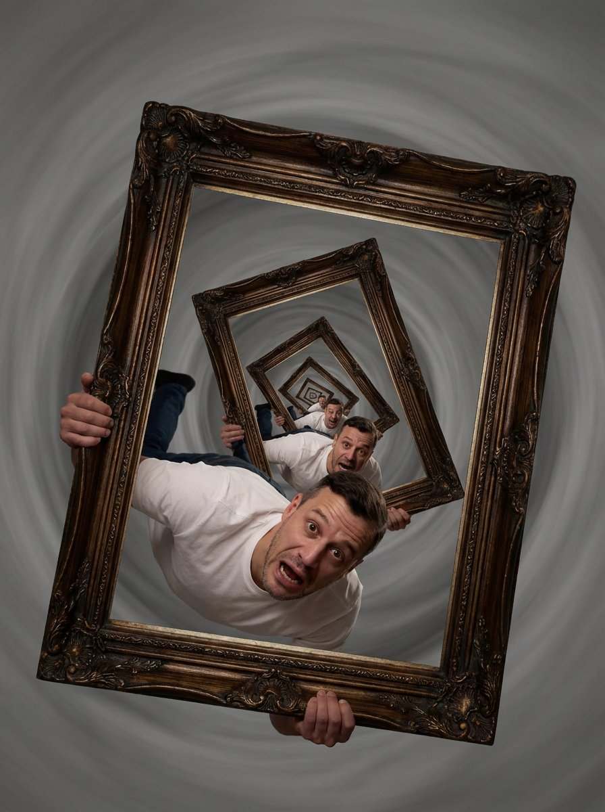
</div>

**提示词：**
```
A man with wide, horrified eyes holds a large, ornate picture frame. Inside the frame is a perfect photograph of him holding the same frame with the same horrified expression. Inside that frame is a smaller version, spiraling inward. He is falling forward into the picture, tumbling endlessly into smaller and smaller iterations of his own trapped moment, shrinking into infinity with no bottom to hit.
The Trap: He is caught in Visual Recursion. He has become a "strange loop" where he is simultaneously the container and the content, doomed to repeat the same moment at exponentially diminishing scales.
```

**中文提示词：**
```
一个男人双眼惊恐地睁大，手里拿着一个硕大的华丽相框。相框里是一张完美的照片，照片上他正拿着同样的相框，脸上带着同样的惊恐表情。在那张照片里，还有一个缩小版的他，呈螺旋状向内延伸。他正向前坠入照片中，无休止地翻滚，陷入越来越小的、重复的、他自己被困的瞬间，最终缩小到无穷无尽的境地，没有尽头。
陷阱：他陷入了视觉递归的陷阱。他变成了一个“奇怪的循环”，既是容器又是内容，注定要以指数级递减的规模重复同一时刻。
```

<a id="prompt-611"></a>
## 案例 611：一幅充满活力的混合媒介杰作 (来源 [@ecommartinez](https://x.com/ecommartinez/status/1994126063656644727)) 模型：Nano banana pro

<div style="display: flex; justify-content: space-between;">
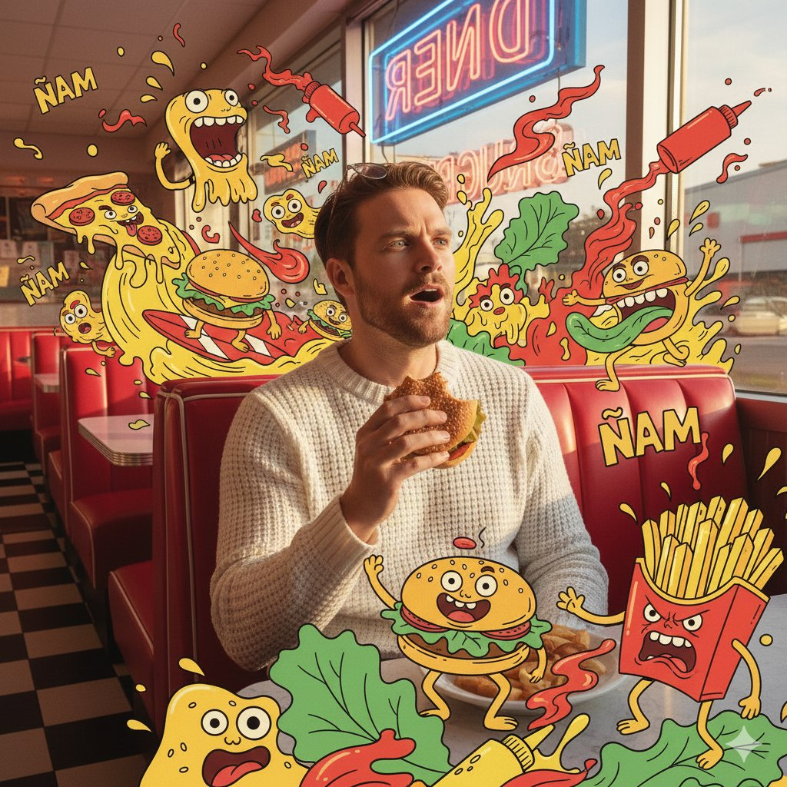
</div>

**提示词：**
```
{
  "scene_description": "A vibrant, mixed-media masterpiece featuring a photorealistic version of the person from the reference photo eating at a diner, surrounded by a chaotic swarm of maximalist fast-food monsters.",

  "subject": {
    "type": "The person from the reference photo",
    "attire": "Same clothing style as in the reference, adapted naturally to the diner setting",
    "position": "Sitting in a red leather diner booth, holding a burger",
    "expression": "Shocked but amused, looking at a floating doodle pizza",
    "consistency_note": "Face, hairstyle and proportions must perfectly match the reference photo"
  },

  "action": {
    "primary": "Eating lunch",
    "effect": "Their food is coming to life in 2D form"
  },

  "illustration_layer": {
    "style": "Thick-line Pop Art cartoons",
    "creatures": [
      "Pizza slices surfing on cheese waves",
      "Burger beasts with lettuce tongues",
      "Angry French fry box",
      "Flying ketchup bottles."
    ],
    "graphics": "Mustard splashes, sesame seeds, heat lines, 'ÑAM' text bursts",
    "colors": "Ketchup Red, Mustard Yellow, Lettuce Green"
  },

  "environment": {
    "setting": "Retro American Diner",
    "background_elements": ["Checkerboard floor", "Neon sign in window"]
  },

  "lighting": {
    "style": "Warm Diner Glow",
    "key_light": {
      "type": "Window light",
      "color": "Warm afternoon sun"
    }
  },

  "style": {
    "medium": "Mixed Media Photography",
    "aesthetic": "Retro-pop, savory, chaotic",
    "quality": "Ultra-detailed textures vs flat cartoons"
  }
}
```

**中文提示词：**
```
{
“场景描述”： “这是一幅充满活力的混合媒介杰作，画面中逼真地呈现了参考照片中的人物在餐馆用餐，周围环绕着一群造型夸张的快餐怪物。”

“主题”： {
“类型”：“参考照片中的人”，
“着装”：“与参考图中相同的服装风格，自然地适应了餐厅环境”，
“位置”：“坐在红色皮质餐厅卡座里，手里拿着一个汉堡”，
“表情”：“震惊又好笑，看着漂浮的涂鸦披萨”
"consistency_note": "脸型、发型和比例必须与参考照片完全一致"
},

“行动”： {
“主要”： “吃午饭”，
“效果”：“他们的食物以二维形式活了过来”
},

"illustration_layer": {
“风格”：“粗线条波普艺术卡通”，
“生物”：[
“披萨片在奶酪浪潮上冲浪”
“长着生菜舌头的汉堡怪兽”
“愤怒的薯条盒”
“飞舞的番茄酱瓶。”
],
“图形”：“芥末酱飞溅、芝麻、热线、‘ÑAM’文字爆发”，
颜色：番茄酱红、芥末黄、生菜绿
},

“环境”： {
“设置”: “复古美式餐馆”
"background_elements": ["棋盘格地板", "窗户上的霓虹灯"]
},

“灯光”： {
“风格”：“温馨的餐馆氛围”，
"key_light": {
类型： 窗灯，
“颜色”：“温暖的午后阳光”
}
},

“风格”： {
“媒介”：“混合媒介摄影”，
“美学”：“复古流行，美味，混乱”，
“质量”： “超精细纹理 vs 平面卡通”
}
}
```

<a id="prompt-610"></a>
## 案例 610：一位自信优雅的年轻女子 (来源 [@lexx_aura](https://x.com/lexx_aura/status/1994397944209142213)) 模型：Nano banana pro

<div style="display: flex; justify-content: space-between;">
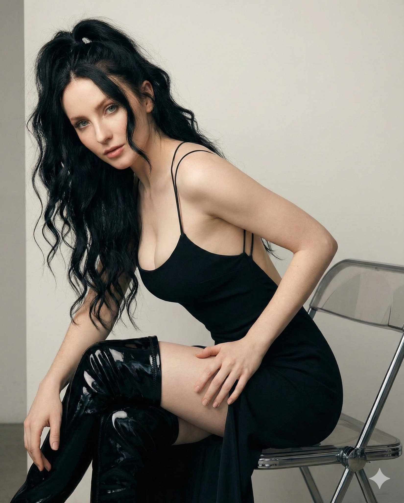
</div>

**提示词：**
```
[Prompt]
type = image_generation
style = ultra-realistic

[Setting]
type = studio portrait
background = minimalist studio background
props = a single metal chair

[Subject]
description = A young woman
mood = Confident, elegant, intimate

[Hair]
color = black
style = long, wavy, tousled, tied in a high, messy ponytail

[Appearance.Attire]
dress = elegant black dress with thin straps and a low back
footwear = thigh-high patent leather boots

[PoseAndComposition]
position = Sitting sideways in the metal chair
legs = Legs crossed
hands = Slightly raised
gaze = Looking intimately at the camera
framing = Full-body or three-quarter shot

[Lighting]
description = Professional studio lighting
quality = Soft yet defined, creating subtle shadows that enhance her features and the texture of the dress and boots
```

**中文提示词：**
```
[提示]
类型 = 图像生成
风格 = 超写实

[环境]
类型 = 影棚肖像
背景 = 极简主义工作室背景
道具 = 一把金属椅子

[主题]
描述 = 一位年轻女子
情绪 = 自信、优雅、亲密

[发型]
颜色 = 黑色
发型：长卷发，蓬松凌乱，扎成高高的凌乱马尾辫

[外观.服装]
连衣裙 = 优雅的黑色连衣裙，细肩带，露背设计
鞋履 = 过膝漆皮靴

[姿势与构图]
姿势 = 侧身坐在金属椅上
双腿交叉
双手微微抬起
凝视 = 深情地看着镜头
构图 = 全身像或四分之三身像

[灯光]
描述 = 专业影棚灯光
质感 = 柔和而又不失立体感，营造出微妙的光影效果，突显了她的五官以及连衣裙和靴子的质感。
```

<a id="prompt-609"></a>
## 案例 609：年轻女性的时尚自拍肖像 (来源 [@IqraSaifiii](https://x.com/IqraSaifiii/status/1994521805076451818)) 模型：Nano banana pro

<div style="display: flex; justify-content: space-between;">
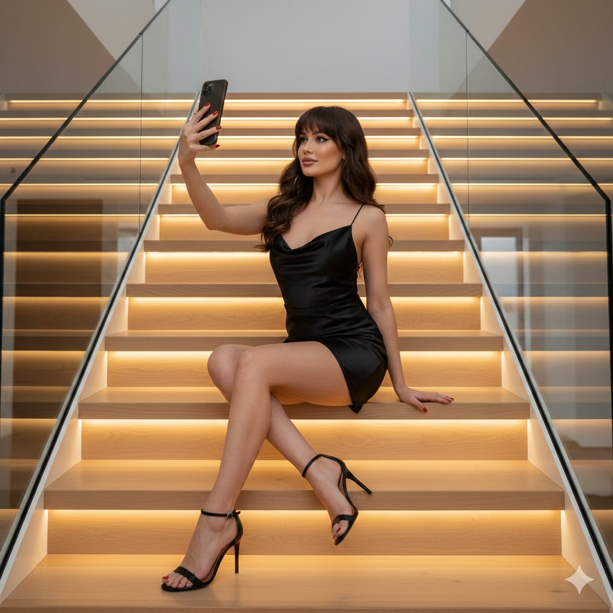
</div>

**提示词：**
```
"A full-body, high-fashion portrait of a stunning young woman. She is wearing a black satin mini slip dress with a draped cowl neckline and thin spaghetti straps, paired with black strappy stiletto high-heels. She has long, wavy dark hair with full bangs and subtle, elegant makeup. The mood is glamorous and luxurious.",   "pose": {     "description": "The subject is sitting sideways on a wide, light-wood stair step. Her left leg is crossed over her right knee, clearly showcasing the stiletto sandals. Her right hand (holding a dark smartphone) is lifted near her face, actively taking a high-angle selfie. She is looking directly at the phone camera.",     "keywords": ["sitting pose", "crossed legs", "selfie pose", "elegant posture", "hand holding phone"]   },   "setting": {     "environment": "Modern, minimalist luxury home interior. The background features a wide, symmetrical staircase made of light-colored wood (e.g., maple or oak) with treads that are individually backlit by warm linear LED lights. Clear glass railings secured by black metal posts frame the subject.",     "aesthetic": "Architectural, contemporary design, clean lines."   },   "camera": {     "shot_type": "Full-Body Portrait Shot",     "angle": "Slightly low angle (worm's-eye view) to emphasize her height and the structure of the staircase.",     "lens": "85mm prime lens",     "depth_of_field": "Shallow DoF, with the subject in crisp focus and the background elements (railings, far steps) slightly softened.",     "composition": "The subject is perfectly centered within the frame."   },   "lighting": {     "key_light": "Soft, diffused studio light (softbox) from the front-left, providing flattering, smooth illumination on her face and skin.",     "accent_light": "Dramatic, warm (3000K) linear under-lighting built directly into the wooden stair treads, creating horizontal lines of glow that define the background.",     "shadows": "Medium contrast, well-defined shadows that still preserve detail in the black dress.",     "exposure": "Perfectly exposed, emphasizing the sheen of the satin material."   },   "style_and_quality": {     "style": "Editorial Fashion Photography | Cinematic Realism | Intimate",     "details": ["High-fidelity satin texture", "Reflections on glass railings", "Manicured red fingernails", "Flawless skin texture"],     "quality": ["8K resolution", "masterpiece", "hyper-detailed", "photorealistic"]   }
```

**中文提示词：**
```
“一张惊艳年轻女性的全身时尚肖像。她身着黑色缎面迷你吊带裙，垂褶领口和细吊带设计，搭配黑色细带高跟鞋。她留着长长的波浪卷发，齐刘海，妆容精致优雅。整体氛围充满魅力，尽显奢华。”, “姿势”: { “描述”: “拍摄对象侧坐在宽阔的浅色木质台阶上。她的左腿搭在右膝上，清晰地展示了细高跟凉鞋。她的右手（拿着一部深色智能手机）举到脸旁，正积极地进行高角度自拍。她直视着手机摄像头。”, “关键词”: ["坐姿", "交叉双腿", "自拍姿势", "优雅姿态", "手持手机"] }, “场景”: { “环境”: “现代简约的豪华家居内饰。背景是宽阔对称的……”由浅色木材（例如枫木或橡木）制成的楼梯，踏板由暖色调的线性 LED 灯单独背光照明。透明玻璃栏杆由黑色金属柱固定，将拍摄对象框入其中。", "美学": "建筑风格，现代设计，线条简洁。" }, "相机": "拍摄类型": "全身肖像照", "角度": "略微低角度（仰视）以突出她的身高和楼梯的结构。", "镜头": "85mm 定焦镜头", "景深": "浅景深，拍摄对象清晰对焦，背景元素（栏杆、远处台阶）略微柔化。", "构图": "拍摄对象完美地位于画面中心。" }, "照明": { "主光": "来自左前方的柔和漫射影棚灯（柔光箱），为她的脸部和肌肤提供柔和的光线。", "辅助光": "戏剧性的暖色调（3000K）线性底光，直接嵌入木质楼梯踏板，营造出勾勒背景的水平光晕。", "阴影": "中等对比度，清晰的阴影，同时保留了黑色连衣裙的细节。", "曝光": "曝光完美，突出了缎面材质的光泽。" }, "style_and_quality": { "style": "时尚大片 | 电影写实 | 私密", "details": ["高保真缎面质感", "玻璃栏杆上的倒影", "精心修饰的红色指甲", "无瑕肌肤纹理"], "quality": ["8K分辨率", "杰作", "超细节", "照片级写实"] }
```

<a id="prompt-608"></a>
## 案例 608：一群活泼时尚的年轻人 (来源 [@Just_sharon7](https://x.com/Just_sharon7/status/1994375017971564779)) 模型：Nano banana pro

<div style="display: flex; justify-content: space-between;">
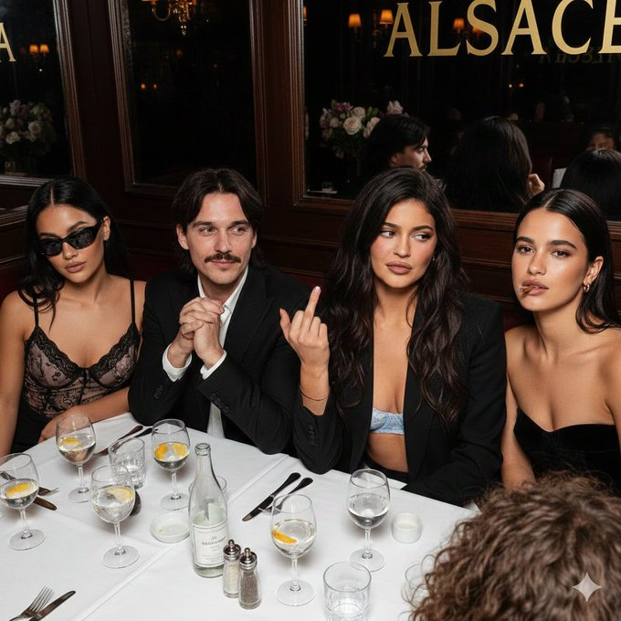
</div>

**提示词：**
```
{
  "prompt": {
    "scene": {
      "angle": "[high-angle]",
      "tilt": "[slightly off-kilter]",
      "group": "[lively group of stylish young adults]",
      "seating": "[seated closely around white dining table]",
      "setting": "[dimly lit, upscale brasserie]"
    },
    "mood": "[energetic, fashionable, slightly rebellious]",
    "subjects": [
      {
        "position": "left",
        "hair": "[long, dark hair]",
        "eyes": "[hidden behind chic black sunglasses]",
        "outfit": "[black lace-trimmed camisole with hint of floral pattern]",
        "expression": "[partially obscured by glasses]"
      },
      {
        "position": "second from left",
        "hair": "[dark, possibly mullet-style hair]",
        "facial_hair": "[distinct mustache]",
        "outfit": "[dark suit jacket over white shirt]",
        "hands": "[clasped near chin]",
        "expression": "[playful or mischievous]"
      },
      {
        "position": "center",
        "reference": "[woman resembling Kylie Jenner]",
        "hair": "[very long, dark, wavy hair]",
        "outfit": {
          "blazer": "[dark blazer]",
          "top": "[light blue, subtly patterned bralette]"
        },
        "gaze": "[looking right, slightly defiant, expressive]",
        "gesture": "[left hand raised, middle finger prominently displayed]"
      },
      {
        "position": "second from right",
        "reference": "[woman resembling Rosalía]",
        "hair": "[long dark hair in slicked-back style]",
        "outfit": "[dark, possibly velvet or satin, strapless top]",
        "accessory": "[small dark object, possibly cigarette or cigarillo between lips]",
        "expression": "[relaxed, nonchalant]"
      },
      {
        "position": "bottom right",
        "hair": "[curly brown hair]",
        "visible_part": "[top of head only, indicating more people at table]"
      }
    ],
    "table": {
      "items": [
        "[multiple clear glasses with drinks]",
        "[ice cubes in glasses]",
        "[citrus slices in glasses]",
        "[white bottle with dark label]",
        "[small white dishes]"
      ]
    },
    "background": {
      "wall": "[dark wood paneling]",
      "letters": "[ornate gold lettering partially readable as 'ALSACE']",
      "mirrors": "[dark reflective mirrors]"
    },
    "lighting": {
      "type": "[soft, warm, ambient]",
      "effect": "[illuminates faces and table]",
      "contrast": "[strong contrast against dark background]"
    },
    "additional_details": {
      "decor": "[subtle floral arrangements hinted in distance]"
    },
    "photography_style": "[hyper-realistic, candid, sharp focus on central group]"
  },
  "styles": ["photorealistic"],
  "aspect_ratio": "4:3"
}
```

**中文提示词：**
```
{
“迅速的”： {
“场景”： {
“角度”：[高角度]，
“倾斜”：[略微偏离]
“团体”：[一群活泼时尚的年轻人]
“座位安排”：[围坐在白色餐桌旁]
“环境”：[灯光昏暗的高档小酒馆]
},
“情绪”：[充满活力，时尚，略带叛逆]
“主题”：[
{
"位置": "左",
“头发”：[长长的黑发]，
“眼睛”：[藏在时髦的黑色太阳镜后面]
“服装”：[黑色蕾丝边吊带背心，带有淡淡的花卉图案]
“表情”：[部分被眼镜遮挡]
},
{
“位置”: “从左边数第二个”，
“头发”：[深色，可能是鲻鱼头]，
"facial_hair": "[distinct mustache]",
“服装”：[深色西装外套搭配白色衬衫]，
“双手”：[交握于下巴附近]
“表情”：[顽皮的或淘气的]
},
{
"位置": "中心",
“参考”：[长相酷似凯莉·詹娜的女性]
“头发”：[非常长、深色、波浪状的头发]
“全套服装”： {
"blazer": "[深色西装外套]",
上衣：[浅蓝色，带精致图案的无钢圈文胸]
},
“凝视”：[看向右侧，略带挑衅，富有表现力]
“手势”：[左手举起，中指明显竖起]
},
{
“位置”: “从右数第二个”，
“参考”：[长相酷似罗莎莉亚的女人]
“头发”：[长长的深色头发向后梳]
“服装”：[深色，可能是天鹅绒或缎面，无肩带上衣]
“配件”：[嘴唇间夹着的小黑物，可能是香烟或小雪茄]
“表情”：[放松，漫不经心]
},
{
位置：右下角，
“头发”：[棕色卷发]，
"visible_part": "[仅头部顶部，表示桌上还有其他人]"
}
],
“桌子”： {
“项目”： [
“多个装有饮料的透明玻璃杯”
“（玻璃杯中的冰块）”
“（玻璃杯中的柑橘片）”
（白色瓶子，深色标签）
“小白碟”
]
},
“背景”： {
“墙”：[深色木镶板]，
“字母”： （华丽的金色字母部分可辨认出为“ALSACE”）
“镜子”：[深色反光镜]
},
“灯光”： {
“类型”：[柔和、温暖、氛围]，
“效果”：[照亮面部和桌面]
“对比度”：[与深色背景形成强烈对比]
},
"additional_details": {
“装饰”：[远处隐约可见的精致花卉摆设]
},
“摄影风格”：[超写实、抓拍、聚焦中心人物]
},
风格：["写实风格"]
"aspect_ratio": "4:3"
}
```

<a id="prompt-607"></a>
## 案例 607：9种照片专业打光效果 (来源 [@MonetizeXWithAb](https://x.com/MonetizeXWithAb/status/1994419258789663115)) 模型：Nano banana pro

<div style="display: flex; justify-content: space-between;">
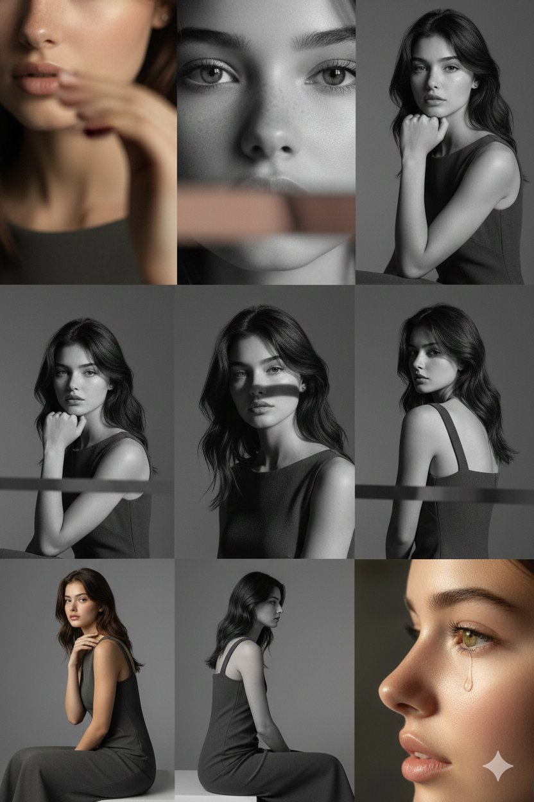
</div>

**提示词：**
```
Editorial 3x3 grid in a cool-grey seamless backdrop. Character (face characteristics 100% same as uploaded image) wearing a charcoal sleeveless dress. Lighting: large overhead softbox, faint side bounce. Shots include: 1. tight cheek + neck close-up with blurred finger foreground (85mm, f/1.8); 2. eyes locked to lens, top-light reflection visible (85mm, f/2.0); 3. monochrome chin-on-hand portrait with strong frame fill (50mm, f/2.2); 4. half-obscured over-shoulder shot through blurred dress strap (85mm, f/2.0); 5. head-on close-up with intersecting shadows across face (50mm, f/2.5); 6. angled raw portrait with tousled hair (85mm, f/2.2); 7. tight detail of hands resting near collarbone (50mm, f/3.2); 8. seated half-body profile with blurred frame edges (35mm, f/4.5); 9. profile macro with single water droplet highlight (85mm, f/1.9). RAW, smooth contrast, editorial softness.
```

**中文提示词：**
```
编辑场景，3x3网格布局，冷灰色无缝背景。人物（面部特征与上传图片完全一致）身穿炭灰色无袖连衣裙。灯光：大型顶置柔光箱，轻微侧向反射光。照片包括：1. 脸颊和颈部特写，前景手指虚化（85mm，f/1. 8) ；2. 目光锁定镜头，可见顶部反光（85mm，f/2. 0) ；3. 单色下巴托手肖像，画面填充强烈（50mm，f/2.2）；4. 透过模糊的肩带拍摄的半遮肩照（85mm，f/2. 0) ；5. 正面特写，面部阴影交错（50mm，f/2.5）；6. 斜角拍摄的原始人像，头发蓬乱（85mm，f/2.2）；7. 双手置于锁骨附近的特写（50mm，f/3.2）；8. 坐姿半身侧面照，画面边缘虚化（35mm，f/4.5）；9. 侧面微距照，单颗水滴高光（85mm，f/1.9）。原始素材，平滑对比度，编辑柔化效果。
```

<a id="prompt-606"></a>
## 案例 606：超逼真街景人像 (来源 [@lexx_aura](https://x.com/lexx_aura/status/1994351098509861265)) 模型：Nano banana pro

<div style="display: flex; justify-content: space-between;">
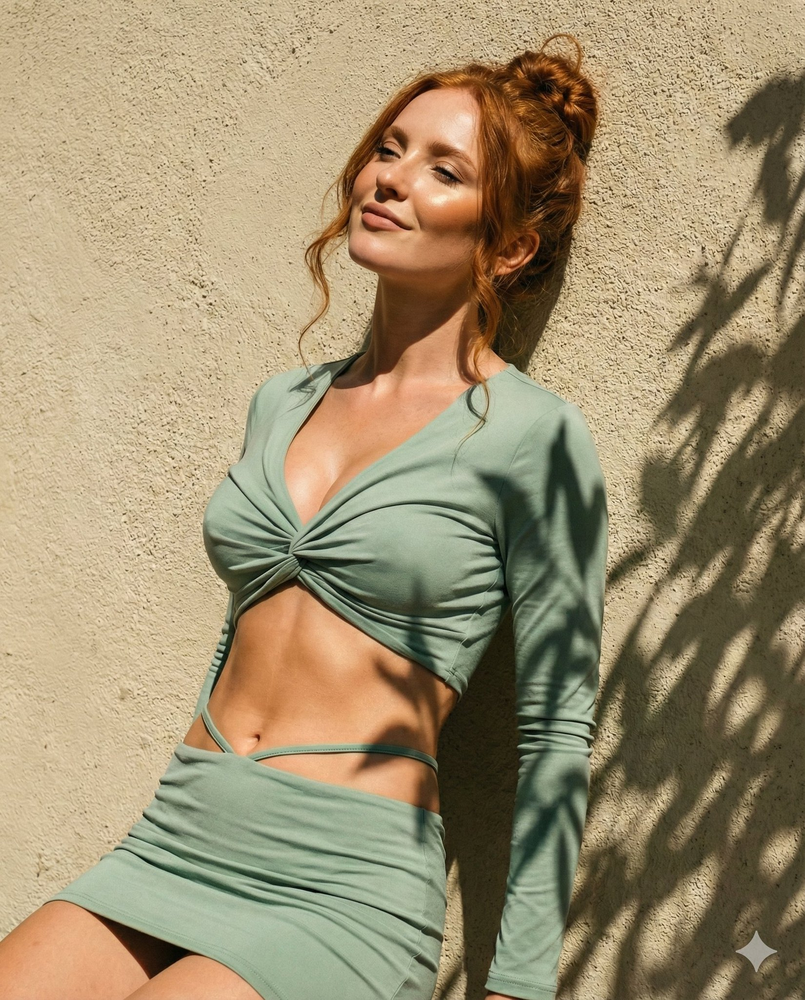
</div>

**提示词：**
```
{
  "meta": {
    "title": "Hyper-realistic 8K Street Portrait",
    "created_at": "2024-05-22T10:00:00Z",
    "tags": ["portrait", "summer", "fashion", "fujifilm", "outdoor"]
  },
  "prompt_data": {
    "full_string": "Hyper-realistic 8K street portrait, preserve the girl’s facial features from the reference. Stylish outdoor shot: girl leaning back against a textured beige stucco wall under bright sun, relaxed contrapposto stance, head tilted back, eyes half-closed, expression enjoying warmth. Wearing a trendy sage-mint set: twisted-knot long-sleeve crop top, exposed midriff, mini skirt with thong-strap detail on waist. Sunkissed makeup: bronzer, strong highlighter, nude matte lips, defined contoured cheekbones. Hair in messy bun with loose wavy face-framing strands. Background: rough stucco wall with sharp botanical shadows cast by leaves. Camera: Fujifilm X-T4, Kodak Gold 200 film emulation, high aperture f/8 for background sharpness. Lighting: harsh mid-day sun, high contrast light–shadow pattern, crisp plant shadows across skin and wall. Warm yellow-green tones, summer vibe, high clarity, magazine aesthetic. Medium shot composition, textured wall filling the frame. --ar 4:5 --style raw --v 6.0",
    "components": {
      "style": "Hyper-realistic 8K street portrait, magazine aesthetic, high clarity",
      "subject": {
        "reference_instruction": "preserve the girl’s facial features from the reference",
        "pose": "leaning back against a textured beige stucco wall, relaxed contrapposto stance, head tilted back, eyes half-closed, expression enjoying warmth",
        "clothing": "trendy sage-mint set: twisted-knot long-sleeve crop top, exposed midriff, mini skirt with thong-strap detail on waist",
        "hair_makeup": "Sunkissed makeup: bronzer, strong highlighter, nude matte lips, defined contoured cheekbones. Hair in messy bun with loose wavy face-framing strands"
      },
      "environment": {
        "setting": "rough stucco wall with sharp botanical shadows cast by leaves",
        "lighting": "harsh mid-day sun, high contrast light–shadow pattern, crisp plant shadows across skin and wall",
        "color_palette": "Warm yellow-green tones, summer vibe"
      },
      "technical": {
        "camera": "Fujifilm X-T4",
        "film_stock": "Kodak Gold 200 film emulation",
        "settings": "high aperture f/8 for background sharpness",
        "composition": "Medium shot composition, textured wall filling the frame"
      }
    },
    "parameters": {
      "aspect_ratio": "4:5",
      "style_model": "raw",
      "version": "6.0"
    }
  }
}
```

**中文提示词：**
```
{
"meta": {
标题：超逼真 8K 街景人像
"created_at": "2024-05-22T10:00:00Z",
标签：["人像", "夏季", "时尚", "富士胶片", "户外"]
},
"prompt_data": {
"full_string": "超逼真8K街头人像，保留了参考照片中女孩的面部特征。时尚户外拍摄：女孩倚靠在阳光明媚的米色纹理灰泥墙上，采用放松的对立式站姿，头部后仰，双眼半闭，表情享受着温暖。身着时髦的鼠尾草绿套装：扭结长袖露脐上衣，露出纤细腰身，搭配腰​​部饰有丁字带的迷你裙。妆容阳光亲吻般自然：古铜色粉底，高光提亮，裸色哑光唇妆，轮廓分明的颧骨。头发随意挽成发髻，几缕波浪卷发自然垂落在脸颊两侧。背景：粗糙的灰泥墙，树叶投下清晰的植物阴影。相机：富士X-T4，柯达金200胶片模拟，大光圈f /8以获得背景锐利度。光线：正午强烈的阳光，高对比度的光影图案，清晰的植物阴影投射在肌肤上。和墙壁。温暖的黄绿色调，夏日气息，高清晰度，杂志美感。中景构图，纹理丰富的墙壁充满画面。--ar 4:5 --style raw --v 6.0”
“成分”： {
“风格”：“超逼真的 8K 街头人像，杂志美学，高清晰度”
“主题”： {
"reference_instruction": "保留参考图中女孩的面部特征",
“姿势”：“背靠着米色纹理灰泥墙，采用放松的对立式站姿，头部后仰，双眼半闭，表情享受着温暖”，
“服装”：“时尚鼠尾草薄荷色套装：扭结长袖露脐上衣，露脐设计，腰部饰有丁字带的迷你裙”，
“发型_妆容”：阳光亲吻般的妆容：古铜色粉底、高光提亮、裸色哑光唇妆、轮廓分明的颧骨。头发随意挽成发髻，留出几缕波浪卷发修饰脸型。
},
“环境”： {
“背景”：“粗糙的灰泥墙，树叶投下清晰的植物阴影”，
“光线”：“正午刺眼的阳光，高对比度的光影图案，植物在皮肤和墙壁上投下的清晰阴影”，
"color_palette": "温暖的黄绿色调，夏日氛围"
},
“技术的”： {
“相机”: “富士X-T4”
"film_stock": "柯达金200胶片模拟",
“设置”：“高光圈 f /8以获得背景锐利度”，
“构图”：“中景构图，纹理墙面占据画面”
}
},
“参数”： {
"aspect_ratio": "4:5",
"style_model": "raw",
版本：6.0
}
}
}
```

<a id="prompt-605"></a>
## 案例 605：海滩写真拍摄 (来源 [@IqraSaifiii](https://x.com/IqraSaifiii/status/1994478187133432308)) 模型：Nano banana pro

<div style="display: flex; justify-content: space-between;">
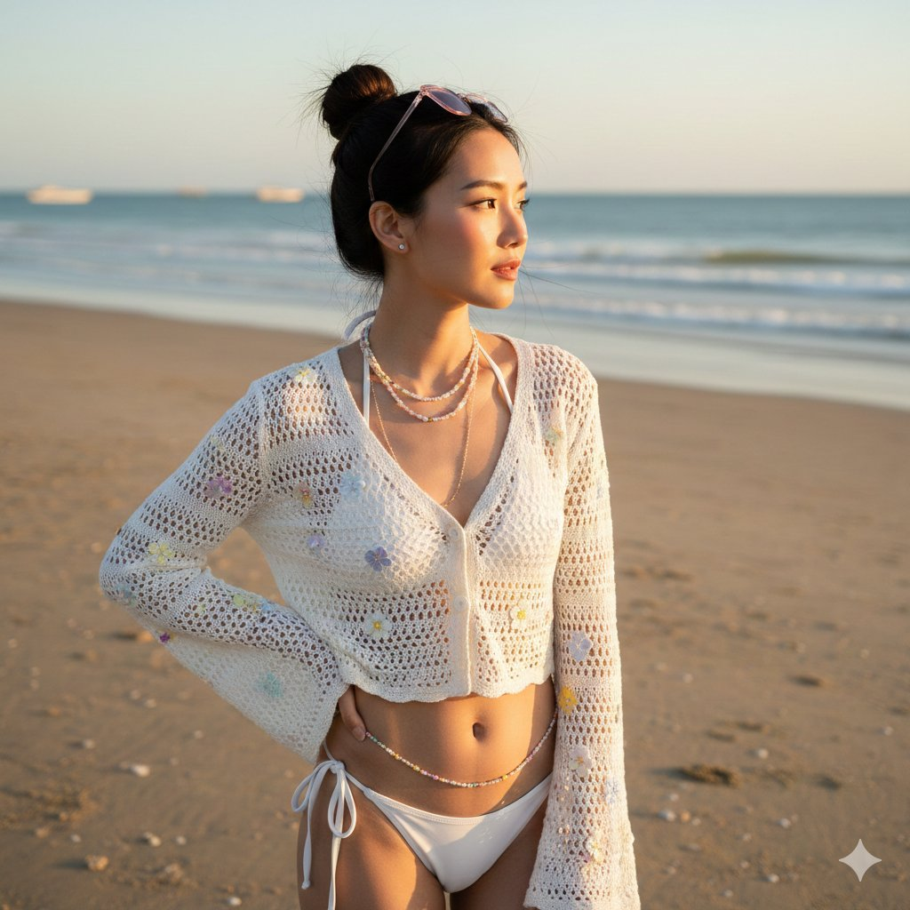
</div>

**提示词：**
```
{
 "prompt_title": "Beachside Crochet Fashion Portrait at Sunset",
  "model_type": "Hyper-Realistic Photo",
  "style": [
    "Ultra-detailed photo-realism",
    "Golden hour beach photography",
    "Soft, natural light",
    "Vibrant yet natural color palette"
  ],
  "subject": {
    "description": "A slender and elegant Asian woman, mid-20s, with a gentle, contemplative expression, gazing towards the right of the frame.",
    "hair": "Dark brown hair styled in a high, messy bun, with soft wisps framing the face.",
    "makeup": "Minimalist, natural 'no-makeup' makeup look, featuring soft pink lips and a light blush, enhancing natural features.",
    "expression": "Serene, distant gaze, creating a sense of introspection or admiration of the view.",
    "attire": {
      "outerwear": "White, open-knit crochet cardigan with long, slightly flared sleeves, adorned with scattered small, pastel-colored floral appliques (yellow, blue, pink).",
      "swimwear": "White string bikini top and matching bottom, peeking out from beneath the cardigan.",
      "accessories": "Delicate, multi-strand beaded necklaces in pastel colors (pink, white, yellow), some extending as a body chain around her waist. Pink-tinted sunglasses perched on top of her bun. Small, understated stud earrings."
    }
  },
  "setting": {
    "location": "A tranquil, sandy beach at golden hour.",
    "background_elements": [
      "Calm ocean water with subtle waves meeting the shore in the mid-ground.",
      "A light, sandy beach foreground with gentle ripples and scattered small shells.",
      "A few distant boats visible on the horizon, adding depth and realism.",
      "A soft, clear sky with warm, diffused light of late afternoon."
    ]
  },
  "pose": {
    "type": "Standing portrait, waist-up shot.",
    "stance": "Body slightly angled to the left, head turned to look towards the right. Right hand gently rests on her hip.",
    "gaze": "Looking off into the distance to the right, not directly at the camera."
  },
  "camera_and_technical": {
    "camera": "Fujifilm GFX 100S or Sony A7R IV",
    "lens": "50mm f/1.2 or 85mm f/1.4 (Fast Prime Lens for shallow depth of field)",
    "shot_type": "Medium shot / Upper body portrait.",
    "composition": "Rule of Thirds, with the subject positioned slightly to the left, allowing space for her gaze to lead the eye.",
    "depth_of_field": "Shallow (soft bokeh on the ocean and distant background).",
    "aperture": "f/2.0",
    "shutter_speed": "1/250s",
    "iso": "ISO 160",
    "resolution": "8K, emphasizing intricate details of crochet knit and sand texture."
  },
  "lighting": {
    "overall_mood": "Soft, warm, luminous, and natural.",
    "key_light": {
      "source": "Natural sunlight, low in the sky (golden hour).",
      "position": "Coming from slightly behind and to the left of the subject, creating a subtle rim light effect and soft, elongated shadows.",
      "color_temp": "Warm (4500K - 5500K), characteristic of late afternoon sun."
    },
    "fill_light": {
      "source": "Natural ambient light reflecting off the sand and ocean.",
      "position": "Filling in shadows on the front of the subject, ensuring soft transitions.",
      "intensity": "Moderate, to maintain natural contrast."
    },
    "rim_light": {
      "source": "Direct sunlight.",
      "position": "Highlights the edges of her hair, shoulders, and arms, creating a glow that separates her from the background."
    },
    "shadows": "Soft, long, and diffused, typical of golden hour, contributing to a dreamy atmosphere."
  }
}
```

**中文提示词：**
```
{
"prompt_title": "日落时分的海边钩针时尚肖像",
"model_type": "超写实照片",
“风格”： [
“超精细照片级写实主义”
“黄金时段海滩摄影”
“柔和的自然光”
“充满活力又自然的色彩搭配”
],
“主题”： {
“描述”：“一位身材苗条、气质优雅的亚洲女性，二十多岁，表情温柔沉思，目光看向画面右侧。”
“头发”：“深棕色的头发梳成高高的凌乱发髻，几缕柔软的碎发垂在脸颊两侧。”
“妆容”：“极简、自然的‘伪素颜’妆容，以柔和的粉色唇妆和淡淡的腮红为特色，凸显自然美。”
“表情”：“宁静、疏离的目光，营造出一种内省或欣赏风景的氛围。”
着装：{
“外套”：“白色镂空钩针开衫，长袖略呈喇叭形，饰有零星的粉彩色小花朵贴花（黄色、蓝色、粉色）。”
“泳装”：“白色细绳比基尼上衣和配套泳裤，从开衫下露出来。”
“配饰”：“精致的多股串珠项链，颜色柔和（粉色、白色、黄色），有些项链延伸到腰间，形成一条身体链。粉色太阳镜架在她的发髻上。小巧简约的耳钉。”
}
},
“环境”： {
地点：日落时分，一片宁静的沙滩。
“背景元素”：[
“平静的海面，轻柔的波浪在中景处拍打着海岸。”
“前景是浅色的沙滩，泛着轻柔的涟漪，散落着小贝壳。”
“远处地平线上隐约可见几艘船只，增添了画面的景深和真实感。”
“傍晚时分，天空晴朗柔和，阳光温暖而柔和。”
]
},
"姿势": {
“类型”：“站立式肖像，半身像。”
“站姿”：“身体略微向左侧倾斜，头部转向右侧。右手轻轻放在臀部。”
“凝视”：“看向右侧远处，而不是直接看向镜头。”
},
"camera_and_technical": {
“相机”: “富士GFX 100S或索尼A7R IV”
“镜头”：“50mm f/1.2 或 85mm f/1.4（用于浅景深的快速定焦镜头）”
"shot_type": "中景/上半身肖像。"
构图：采用三分法构图，主体略微偏左，留出空间引导视线。
"depth_of_field": "浅景深（海洋和远处背景呈现柔和的散景效果）",
光圈：f/2.0，
"shutter_speed": "1/250"
"iso": "ISO 160",
“分辨率”：“8K，突出钩编针织物和沙子纹理的精细细节。”
},
“灯光”： {
整体氛围：柔和、温暖、明亮、自然。
"key_light": {
“来源”：“自然阳光，低垂的天空（黄金时段）。”
“位置”：“光线从拍摄对象略后方偏左的位置照射过来，营造出微妙的轮廓光效果和柔和拉长的阴影。”
"color_temp": "暖色调（4500K - 5500K），具有午后阳光的特征。"
},
"fill_light": {
“光源”：“沙滩和海洋反射的自然环境光。”
“位置”：“填充主体前方的阴影，确保柔和的过渡。”
“强度”：“适中，以保持自然对比度。”
},
"rim_light": {
“来源”：“阳光直射。”
“位置”：“突出她的头发、肩膀和手臂的边缘，营造出一种光晕，使她与背景分离。”
},
“阴影”：“柔和、绵长、弥散，是黄金时段的典型景象，营造出梦幻般的氛围。”
}
}
```

<a id="prompt-604"></a>
## 案例 604：夜间拖影快门曝光 (来源 [@oggii_0](https://x.com/oggii_0/status/1994424983477715007)) 模型：Nano banana pro

<div style="display: flex; justify-content: space-between;">
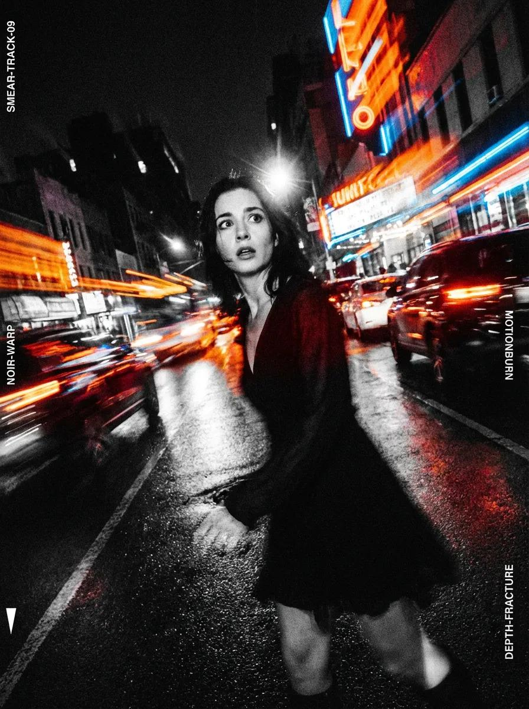
</div>

**提示词：**
```
A visual explosion in the middle of a fast-moving street. Frozen faces, sweeping movements, and a palpable "noir" atmosphere. Everything is planned, yet the results are always wild and raw.
```

**中文提示词：**
```
在车水马龙的街道中央，一场视觉风暴骤然爆发。凝固的面孔，凌厉的动作，以及弥漫的黑色电影氛围。一切都经过精心策划，但最终呈现的效果却总是狂野而原始。
```

<a id="prompt-603"></a>
## 案例 603：一张韩国流行明星的抓拍照片 (来源 [@minchoi](https://x.com/minchoi/status/1994544802902503470)) 模型：Nano banana pro

<div style="display: flex; justify-content: space-between;">
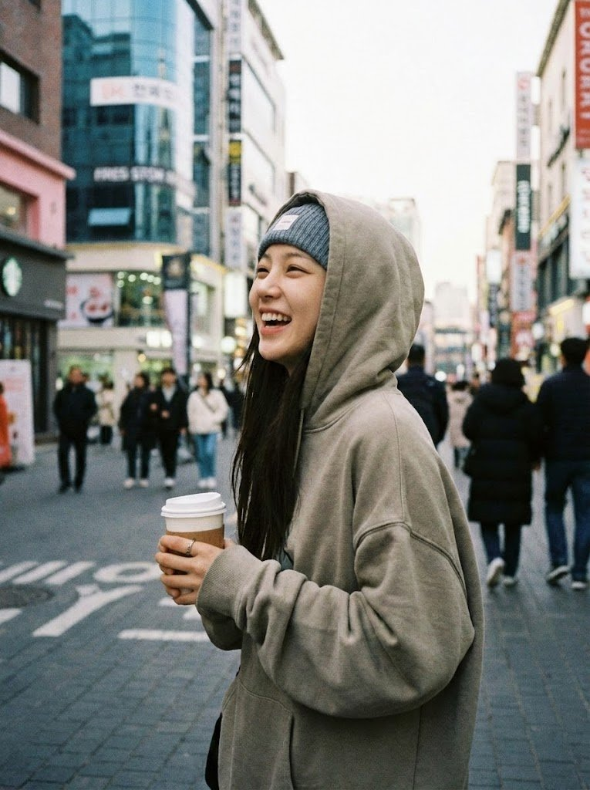
</div>

**提示词：**
```
A candid photograph of a KPOP star. format 3:4
```

**中文提示词：**
```
一张韩国流行明星的抓拍照片，3:4 比例
```

<a id="prompt-602"></a>
## 案例 602：戴口罩的妹子比了个耶 (来源 [@IqraSaifiii](https://x.com/IqraSaifiii/status/1994544453655433705)) 模型：Nano banana pro

<div style="display: flex; justify-content: space-between;">
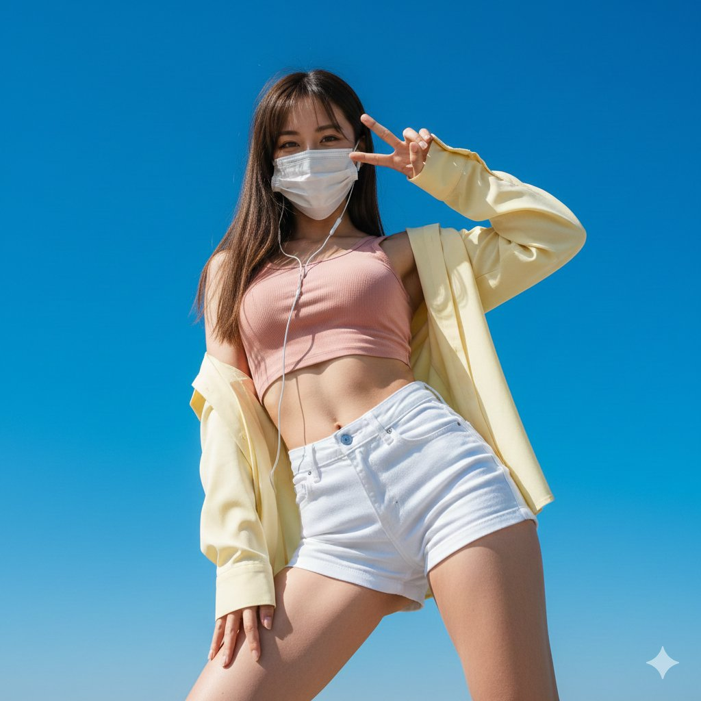
</div>

**提示词：**
```
{
  "prompt_title": "Dynamic Low-Angle Portrait Under Clear Sky - Emphasized Curves & Confident Pose",
  "model_type": "Hyper-Realistic Photo",
  "style": [
    "Ultra-detailed photo-realism",
    "Bright, high-contrast natural outdoor lighting",
    "Extreme low-angle, wide-perspective shot (heroic/empowering feel)",
    "Vibrant, saturated colors (clean, modern aesthetic)"
  ],
  "subject": {
    "description": "A youthful, radiant East Asian woman, late teens to early twenties, with a confident and engaging presence. Her skin exhibits a flawless yet natural texture, with subtle pores and a healthy, sunlit sheen across exposed areas like her shoulders and midriff. Hair strands are individually discernible.",
    "physique": "Athletic and toned, with visibly sculpted abdominal muscles, subtly defined obliques, and strong, shapely thighs. The pose emphasizes the natural curve of her hips and the gentle arch of her lower back, creating an alluring yet powerful silhouette from the low angle.",
    "hair": "Long, silky, straight dark brown hair, with a subtle natural wave at the ends. It flows freely around her shoulders and back, with a few strands gently lifted by a breeze (if applicable, or perfectly styled to look natural). A fringe or wispy bangs are subtly visible beneath the mask, framing her upper face.",
    "makeup": "Minimal, natural 'no-makeup' makeup. Clear, dewy skin finish. The visible eye area shows defined but natural brows, a hint of mascara on long lashes, and a subtle shimmer on the inner corner of the eyes. The mask obscures the mouth and nose.",
    "expression": "Her eyes are wide, bright, and directly engaging with the viewer, conveying a sense of playful confidence and warmth. The raised peace sign reinforces a cheerful, positive mood.",
    "attire": {
      "mask": "A pristine, well-fitted white disposable surgical mask, with clear pleats and elastic ear loops visible against her skin. It cleanly covers her nose and mouth.",
      "top": "A figure-hugging, finely ribbed, light salmon-pink (or dusty rose) crop tank top. The ribbing texture is highly detailed, stretching smoothly over her chest and torso, emphasizing the curve of her bust and the tautness of her midriff.",
      "outerwear": "An oversized, buttery soft, light pale yellow long-sleeved button-up shirt or lightweight jacket. It's worn open, casually draped off her shoulders, with the sleeves pushed up slightly, creating soft, natural folds in the fabric. The collar and cuffs are slightly relaxed.",
      "bottom": "Form-fitting, short white denim shorts. The fabric texture is detailed, showing subtle denim weave. The shorts sit high on her hips, emphasizing the curve of her waist and thighs. Stitching details and a faint outline of pockets are visible.",
      "accessories": "White wired earphones with clearly visible, delicate wires extending from her ears, subtly contrasting with her hair. The earbud tips are visible."
    }
  },
  "setting": {
    "location": "Outdoors on an exceptionally clear, bright summer day.",
    "background_elements": [
      "A vast, perfectly uniform, intensely vibrant cerulean blue sky, completely devoid of clouds, creating a stark, graphic backdrop that makes the subject pop.",
      "No horizon line or ground visible, making the sky appear infinite and emphasizing the extreme low-angle perspective."
    ],
    "atmosphere": "Crisp, clean air; intense feeling of open space and boundless energy."
  },
  "pose": {
    "type": "Extreme low-angle, dynamic full-body portrait (cropped at upper thigh/hip level, shot from below).",
    "stance": "The woman is standing with her weight slightly shifted, her left leg subtly bent at the knee, and her right leg extended, creating a dynamic 'power stance' effect. Her torso is slightly twisted to her left, further accentuating the curve of her waist and hips, especially from the low vantage point. Her chest is slightly pushed out, enhancing the natural curve of her bust.",
    "gaze": "Directly into the camera, with a confident, open, and friendly expression in her visible eyes. This strong eye contact creates an immediate connection with the viewer.",
    "gesture": "Her left arm is bent at the elbow, and her left hand is raised close to her face, palm facing outwards, forming a clear and crisp 'peace' (V-sign) with her index and middle fingers. The other fingers are gently curled down. Her right arm is relaxed at her side, with the jacket draped over it. The natural tension in her arm muscles is visible."
  },
  "camera_and_technical": {
    "camera": "Sony A1 with G Master Lenses or RED Komodo (for cinematic quality)",
    "lens": "20mm f/1.8 (Ultra-wide-angle prime lens to exaggerate the low perspective and create an imposing, almost monumental feel for the subject)",
    "shot_type": "Extreme Worm's-Eye View / Dynamic Low-Angle Medium Full Shot (from just below the subject's waist).",
    "composition": "The subject dominates the central frame, with her head and raised hand reaching towards the top. The expansive blue sky provides a clean, impactful negative space. The extreme low angle distorts proportions intentionally, elongating the legs and making the subject appear powerful and larger-than-life.",
    "depth_of_field": "Deep (f/11 to ensure absolute sharpness from her shorts to the distant sky, minimizing any softness).",
    "aperture": "f/11",
    "shutter_speed": "1/800s (to eliminate any possibility of motion blur and ensure tack-sharp details under intense sunlight)",
    "iso": "ISO 64 (for maximum image fidelity and dynamic range)",
    "resolution": "12K, cinematic wide aspect ratio (e.g., 1.85:1 or 16:9), emphasizing microscopic details of fabric weaves, skin pores, and the pristine blue sky. Post-processing for subtle vignetting and color grading for vibrant pop.",
    "white_balance": "Daylight (5200K), precisely calibrated for natural colors under bright sun."
  },
  "lighting": {
    "overall_mood": "High-key, crisp, and clean with stark yet appealing contrast.",
    "key_light": {
      "source": "Direct, unfiltered overhead sunlight, creating strong, well-defined form.",
      "position": "High above and slightly in front-right of the subject, casting clear, defined shadows that contour her physique and attire, adding depth.",
      "color_temp": "Cool (6500K-7000K), characteristic of a bright midday sun, ensuring a vibrant blue sky.",
      "intensity": "Very high, creating bright highlights and deep, clean shadows."
    },
    "fill_light": {
      "source": "Natural ambient light from the expansive sky.",
      "intensity": "Low, allowing for noticeable shadows that give form without becoming harsh or black. The blue sky acts as a subtle cool fill.",
      "direction": "Diffuse, minimizing contrast in shadow areas."
    },
    "rim_light": {
      "source": "The intense direct sunlight.",
      "intensity": "Subtle but crisp, creating a fine, bright outline on her hair, shoulders, and the edges of her clothing against the deep blue, enhancing separation and definition.",
      "effect": "Very thin, bright edge highlights."
    },
    "shadows": "Sharp, well-defined, and relatively dark, lending strong three-dimensionality to the subject's form and attire. Shadows are cast downwards and slightly behind the subject from the low camera angle, emphasizing the curves and contours of her body and clothing."
  }
}
```

**中文提示词：**
```
{
"prompt_title": "晴空下的动态低角度人像 - 强调曲线与自信姿态",
"model_type": "超写实照片",
“风格”： [
“超精细照片级写实主义”
“明亮、高对比度的自然户外照明”，
“极低角度、广角镜头（英雄/鼓舞人心的感觉）”，
“鲜艳饱满的色彩（简洁现代的美学）”
],
“主题”： {
描述：一位年轻、容光焕发的东亚女性，年龄在十几岁末到二十岁出头，自信迷人。她的肌肤呈现无瑕而自然的质感，毛孔细微，裸露部位（如肩膀和腰部）散发着健康的阳光光泽。发丝清晰可见。
“体格”：“身材健美匀称，腹肌线条清晰可见，斜肌轮廓分明，大腿强健有力。这个姿势突出了她臀部的自然曲线和下背部的柔和弧度，从低角度拍摄，勾勒出既迷人又充满力量的身形。”
“头发”：一头柔顺的深棕色长直发，发尾略带自然波浪。头发自然垂落在她的肩背，几缕发丝被微风轻轻拂起（如有风吹，或精心打理得自然垂顺）。面具下隐约可见刘海，勾勒出她脸部的轮廓。
“妆容”：极简自然的“伪素颜”妆容。肌肤呈现清透水润的光泽。眼部可见部分，眉形清晰自然，纤长的睫毛上略施睫毛膏，眼角内侧带有微妙的珠光。口罩遮盖了口鼻。
“表情”：“她的眼睛又大又亮，直视着观者，传递出一种俏皮自信和温暖的感觉。高举的和平手势进一步强化了这种快乐积极的情绪。”
着装：{
“口罩”：“一个洁白无瑕、贴合度极佳的一次性医用口罩，褶皱清晰可见，弹性耳带紧贴皮肤。它干净利落地遮住了她的口鼻。”
上衣：一件贴身剪裁、带有细密罗纹的浅鲑鱼粉色（或灰玫瑰色）露脐背心。罗纹纹理细节丰富，流畅地贴合胸部和躯干，凸显胸部曲线和紧致腰腹。
“外套”：一件宽松的、如黄油般柔软的浅黄色长袖衬衫或轻薄夹克。敞开穿着，随意地披在肩上，袖子略微向上卷起，在面料上形成柔软自然的褶皱。领口和袖口略微宽松。
“下装”：“修身白色牛仔短裤。面料纹理细腻，隐约可见牛仔布的编织纹路。短裤高腰设计，凸显腰部和大腿的曲线。缝线细节和隐约可见的口袋轮廓。”
“配饰”：“白色有线耳机，纤细的耳机线清晰可见地从她的耳朵延伸出来，与她的头发形成微妙的对比。耳塞套也清晰可见。”
}
},
“环境”： {
地点：户外，一个格外晴朗明媚的夏日。
“背景元素”：[
“一片广袤无垠、均匀透亮、色彩浓郁的蔚蓝色天空，万里无云，营造出鲜明的视觉背景，使主体更加突出。”
“看不到地平线或地面，使天空显得无限延伸，并强调了极低角度的透视效果。”
],
“氛围”：“空气清新洁净；开阔的空间感和无限的活力。”
},
"姿势": {
“类型”：“极低角度、动态全身肖像（裁剪至大腿/臀部上方，从下方拍摄）。”
“站姿”：这位女士站立时重心略微偏移，左腿膝盖微屈，右腿伸直，营造出一种动感十足的“力量站姿”。她的躯干略微向左扭转，从低角度观察时，更突显了腰臀的曲线。她的胸部略微挺起，凸显了胸部的自然曲线。
“凝视”：“她直视镜头，眼神自信、开朗、友善。这种强烈的眼神交流能立即与观众建立联系。”
“手势”：“她的左臂肘部弯曲，左手举至脸前，掌心朝外，食指和中指形成清晰利落的‘和平’手势（V字手势）。其余手指微微弯曲down.她的右臂自然下垂，外套搭在上面。手臂肌肉的自然张力清晰可见。”
},
"camera_and_technical": {
“相机”：“索尼 A1 配 G 大师镜头或 RED Komodo（用于电影级画质）”
“镜头”：“20mm f/1. 8 (超广角定焦镜头，可夸大低视角，为拍摄对象营造出一种气势恢宏、近乎纪念碑式的感觉。”
"shot_type": "极端仰视视角/动态低角度中景全景（从被摄对象腰部以下拍摄）",
构图：“主体占据画面中心，头部和高举的手指向上方。广阔的蓝天提供了干净而有力的留白。极低的拍摄角度刻意扭曲了比例，拉长了腿部，使主体显得强大而富有气势。”
"depth_of_field": "大光圈（f/11，以确保从她的短裤到远处的天空都绝对清晰，最大程度地减少任何柔化）。"
光圈：f/11，
"shutter_speed": "1/800s（以消除任何运动模糊的可能性，并确保在强烈的阳光下也能获得清晰锐利的细节）",
“iso”: “ISO 64（可获得最大的图像保真度和动态范围）”
“分辨率”：12K，电影级宽高比（例如 1.85:1 或 16:9），突出织物纹理、皮肤毛孔和纯净蓝天的微观细节。后期处理采用微妙的暗角和色彩分级，使画面更加鲜艳夺目。
"white_balance": "日光 (5200K)，经过精确校准，可在明亮的阳光下呈现自然色彩。"
},
“灯光”： {
整体氛围：明亮、清爽、干净，对比鲜明却又引人入胜。
"key_light": {
“光源”：“直射的、未经过滤的阳光，造就了强烈而清晰的轮廓。”
“位置”：“位于拍摄对象上方偏右上方，投射出清晰、轮廓分明的阴影，勾勒出她的体态和衣着，增添了景深。”
"color_temp": "冷色调（6500K-7000K），模拟正午明媚的阳光，确保天空呈现鲜艳的蓝色。"
“强度”：“非常高，能营造出明亮的高光和深邃、干净的阴影。”
},
"fill_light": {
“光源”：“来自广阔天空的自然环境光。”
“强度”：“低，使阴影清晰可见，勾勒出轮廓，而不会显得生硬或漆黑。蓝天起到微妙的冷色调填充作用。”
“方向”：“漫射，最大限度地减少阴影区域的对比度。”
},
"rim_light": {
“来源”：“强烈的阳光直射。”
“强度”：“微妙而清晰，在深蓝色的背景下，勾勒出她头发、肩膀和衣服边缘的精致明亮轮廓，增强了层次感和清晰度。”
“效果”：“非常细腻、明亮的边缘高光。”
},
“阴影”：“清晰、轮廓分明且相对较暗，赋予人物的体态和服饰强烈的立体感。由于拍摄角度较低，阴影向下投射，略微偏后于人物，突显了她身体和服装的曲线和轮廓。”
}
}
```

<a id="prompt-601"></a>
## 案例 601：专业工作室摄影照片 (来源 [@lexx_aura](https://x.com/lexx_aura/status/1994090956916969536)) 模型：Nano banana pro

<div style="display: flex; justify-content: space-between;">
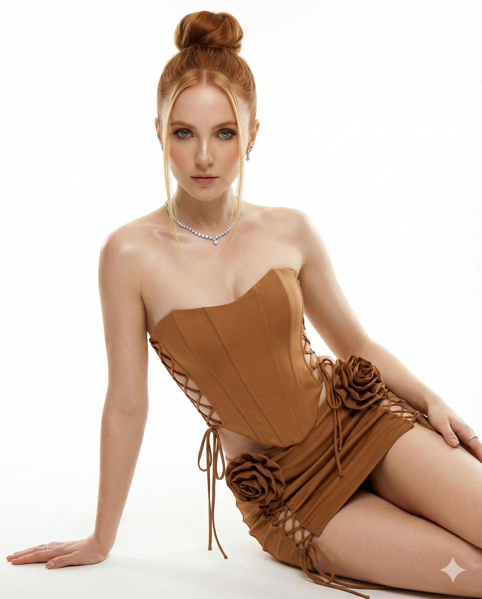
</div>

**提示词：**
```
{
  "image_specification": {
    "reference_id": "Figure 1",
    "mode": "100% Virtual Reality",
    "base_settings": {
      "focus": "Face Reference, Ear, Nose, Mouth",
      "proportion": "+++",
      "consistency": "Keep face 100% unchanged"
    },
    "technical_specs": {
      "medium": "Professional studio photography",
      "resolution": "32k sharp, HD level",
      "lighting": "Bright lights shining on model, realistic shadows, luster fascination",
      "background": "Clean bright white background"
    },
    "subject": {
      "model_attributes": {
        "skin": "Healthy focus, succulent skin, luster",
        "body_features": "Clear clavicle, beautiful shoulder, tapered neck",
        "hair": {
          "color": "Blond",
          "style": "Tall boxing bun in middle of head, heart-shaped",
          "details": "Two thin straight tresses, moisturizing texture",
          "bangs": false
        },
        "expression": {
          "gaze": "Looking straight at the camera",
          "emotion": "Seductive and alluring glint",
          "makeup": "Twinkle Petch Slash"
        }
      },
      "pose": {
        "type": "Sitting position",
        "action": "One arm pushing the floor",
        "style": "Professional model posing, presenting torso luster"
      }
    },
    "attire_and_accessories": {
      "dress_code": {
        "top": "Caramel strapless top or corset, style reinforces shape",
        "bottom": "Matching very short skirt or corset-dress style",
        "details": [
          "Cross-ties on front and sides",
          "Large floral decoration made of hip-level brown cloth (adds volume and romantic feelings)"
        ]
      },
      "jewelry": [
        "Fancy diamond necklace",
        "Tiny diamond earrings",
        "Small ring"
      ]
    }
  }
}
```

**中文提示词：**
```
{
"image_specification": {
"reference_id": "图 1",
“模式”：“100% 虚拟现实”，
"base_settings": {
“焦点”：“面部参考、耳朵、鼻子、嘴巴”，
“比例”： “+++”，
“一致性”：“面子100%不变”
},
"technical_specs": {
“媒介”: “专业工作室摄影”
分辨率：32k 清晰，高清级别
“灯光”：“明亮的灯光照射在模特身上，逼真的阴影，光泽迷人”，
“背景”： “干净明亮的白色背景”
},
“主题”： {
"model_attributes": {
“肌肤”： “健康专注，水润肌肤，光泽”
"body_features": "清晰的锁骨，优美的肩膀，纤细的脖子",
“头发”： {
“颜色”： “金色”，
“发型”：“头顶中央高高盘起的拳击发髻，呈心形”，
“详情”：“两缕纤细笔直的头发，滋润质地”，
"bangs": false
},
“表达”： {
“凝视”：“直视镜头”，
“情感”：“诱人而迷人的光芒”，
“化妆”: “Twinkle Petch Slash”
}
},
"姿势": {
“类型”：“坐姿”，
“动作”：“一只手臂推地板”，
“风格”：“专业模特摆姿势，展现躯干光泽”
}
},
"服装和配饰": {
"dress_code": {
上衣：焦糖色无肩带上衣或紧身胸衣，款式凸显身材。
下装：搭配超短裙或束身连衣裙款式。
“细节”： [
“正面和侧面有交叉系绳”，
“用齐腰高的棕色布料制成的大型花卉装饰（增添立体感和浪漫气息）”
]
},
“珠宝”： [
“精美钻石项链”
“小巧的钻石耳环”
“小戒指”
]
}
}
}
```