<a id="readme-top"></a>
# 欢迎来到 Nano Banana(nanobanana)/GPT-5/GPT‑4o/豆包 图片提示词（Prompts）精选！

🎉 在线演示地址：https://www.aipipixia.online/

---
## 获取最新提示词？你可以通过这3个渠道。
<div style="width: 98%;">
<table>
  <tr>
    <!-- 左侧文字单元格 -->
    <td style="width: 60%; padding: 2px; vertical-align: middle; border: none;">
      <p>1、微信公众号：未来职场AI学堂</p><p>2、扫一扫，拉你进大群《AI技术学习交流群》</p>
    </td>
    <!-- 右侧图片单元格 -->
    <td>
      
    </td>
  </tr>
</table>
</div>

---

<a id="prompt-toc"></a>
## 📖 案例目录
*   [案例 800：真实世界移轴摄影 ](#prompt-800)
*   [案例 799：登鹳雀楼 ](#prompt-799)
*   [案例 798：类似摄影集的精美版面 ](#prompt-798)
*   [案例 797：五彩缤纷的电影级照片 ](#prompt-797)
*   [案例 796：一组赛博朋克风格的时尚大片 ](#prompt-796)
*   [案例 795：红墨水加上手写中文批注 ](#prompt-795)
*   [案例 794：融合多种媒体元素的现实扭曲镜面自拍 ](#prompt-794)
*   [案例 793：无缝融合两个不同的时代 ](#prompt-793)
*   [案例 792：斯塔克工业钢铁侠战衣的演变 ](#prompt-792)
*   [案例 791：女生展示自己手机照片 ](#prompt-791)
*   [案例 790：产品发展轨迹图 ](#prompt-790)
*   [案例 789：年轻女子在室内优雅地蹲着自拍 ](#prompt-789)
*   [案例 788：一幅令人着迷的4季时光画卷 ](#prompt-788)
*   [案例 787：景点四季变化 ](#prompt-787)
*   [案例 786：调研和数据可视化设计 ](#prompt-786)
*   [案例 785：生成人物不同姿势九宫格 ](#prompt-785)
*   [案例 784：将主体转化为黏土风格的3D角色 ](#prompt-784)
*   [案例 783：自己和2D动漫插画自拍 ](#prompt-783)
*   [案例 782：微缩3D卡通场景 ](#prompt-782)
*   [案例 781：充满奇思妙想的手工纸艺作品 ](#prompt-781)
*   [案例 780：毛绒纺织品手工打造的微缩世界 ](#prompt-780)
*   [案例 779：年轻女子跪在田野里 ](#prompt-779)
*   [案例 778：夏日多巴胺清新风格 ](#prompt-778)
*   [案例 777：人物的9种服装风格和背景 ](#prompt-777)
*   [案例 776：摆出一个时尚复杂有力的姿势 ](#prompt-776)
*   [案例 775：6格漫画每一格的风格都不同 ](#prompt-775)
*   [案例 774：人物的9种服装风格和背景 ](#prompt-774)
*   [案例 773：Labubu的3x3九宫格拼贴照片 ](#prompt-773)
*   [案例 772：Y2K千禧辣妹复古像素风 ](#prompt-772)
*   [案例 771：一幅俏皮时尚的肖像拼贴画 ](#prompt-771)
*   [案例 770：带有插图贴纸叠加的逼真照片 ](#prompt-770)
*   [案例 769：应用界面展示9种不同的滑稽效果 ](#prompt-769)
*   [案例 768：黑白素描手绘漫画 ](#prompt-768)
*   [案例 767：照片与素描的完美融合 ](#prompt-767)
*   [案例 766：制作一张隐藏单词的照片 ](#prompt-766)
*   [案例 765：一张高质量的可爱少女肖像照 ](#prompt-765)
*   [案例 764：橱窗里出现了一个小小的动画版的自己 ](#prompt-764)
*   [案例 763：维多利亚时代外科医生的医疗箱摊开 ](#prompt-763)
*   [案例 762：工藤新一和毛利兰 ](#prompt-762)
*   [案例 761：一个近视人的视角 ](#prompt-761)
*   [案例 760：一位年轻的日本美女模特 ](#prompt-760)
*   [案例 759：杂志编辑风格制作专业的OOTD时尚拼贴 ](#prompt-759)
*   [案例 758：女子仰卧右臂向上伸展自拍 ](#prompt-758)
*   [案例 757：女子手持吸塑包装靠近镜头 ](#prompt-757)
*   [案例 756：女子赤脚盘腿坐在简朴的木椅上 ](#prompt-756)
*   [案例 755：使用作品中人物的经历来绘制图片 ](#prompt-755)
*   [案例 754：用浮世绘和茶杯头的风格生成信息图 ](#prompt-754)
*   [案例 753：一个微型人修眉 ](#prompt-753)
*   [案例 752：人物放到一个逼格拉满的大会现场 ](#prompt-752)
*   [案例 751：红黄两色手绘肖像画插图 ](#prompt-751)
*   [案例 750：电影感胶片印样大师 ](#prompt-750)
*   [案例 749：电影混合媒体肖像 ](#prompt-749)
*   [案例 748：巨大的时尚弧形3D广告牌上的女士 ](#prompt-748)
*   [案例 747：和明星自拍还可以走进任意电影的片场 ](#prompt-747)
*   [案例 746：超高清4K皮克斯风格的3D肖像 ](#prompt-746)
*   [案例 745：乐高风格迷你3D人偶 ](#prompt-745)
*   [案例 744：女子身穿白色露肩蕾丝婚纱 ](#prompt-744)
*   [案例 743：人物在透明的玻璃球被捏住 ](#prompt-743)
*   [案例 742：一幅电影海报模版 ](#prompt-742)
*   [案例 741：超逼真的爆炸式技术视图 ](#prompt-741)
*   [案例 740：大尺寸的iPhone 17 Pro Max场景 ](#prompt-740)
*   [案例 739：女子公寓电梯内自拍 ](#prompt-739)
*   [案例 738：人物转换为韩式风格的专业形象照 ](#prompt-738)
*   [案例 737：人物转风格化的3D人物漫画 ](#prompt-737)
*   [案例 736：MacBook自拍（情侣款） ](#prompt-736)
*   [案例 735：超现实的数字艺术吊死鬼 ](#prompt-735)
*   [案例 734：将漫画人物转化为超逼真的人类 ](#prompt-734)
*   [案例 733：一张甜美写实的女生肖像照 ](#prompt-733)
*   [案例 732：厨师服极其精细的微缩场景 ](#prompt-732)
*   [案例 731：女生站在黑板旁手里拿着粉笔 ](#prompt-731)
*   [案例 730：倚靠在柜台上的女生 ](#prompt-730)
*   [案例 729：一幅12张独立照片的秋季时尚拼贴画 ](#prompt-729)
*   [案例 728：一张黑白影棚肖像照 ](#prompt-728)
*   [案例 727：采用垂直切片失真的高级时尚人像 ](#prompt-727)
*   [案例 726：将一张参考图片转化为一段连贯的电影短片 ](#prompt-726)
*   [案例 725：朱迪和松果的联名杂志 ](#prompt-725)
*   [案例 724：年轻女子在浴室镜子前自拍 ](#prompt-724)
*   [案例 723：手轻轻托着一个城市3D收藏级立体模型 ](#prompt-723)
*   [案例 722：品牌披萨摄影棚照片 ](#prompt-722)
*   [案例 721：一幅某某角色的素描 ](#prompt-721)
*   [案例 720：朱迪Cos春丽尼克Cos小红 ](#prompt-720)
*   [案例 719：多彩剪贴簿海报风格 ](#prompt-719)
*   [案例 718：制作一张由省市美食组成的中国地图 ](#prompt-718)
*   [案例 717：城市冰箱贴 ](#prompt-717)
*   [案例 716：Q版微缩旅行概念设计 ](#prompt-716)
*   [案例 715：瓷娃娃般的风格照片 ](#prompt-715)
*   [案例 714：冰箱贴提示词模板 ](#prompt-714)
*   [案例 713：制作一个角色设计表情风格指南的图像 ](#prompt-713)
*   [案例 712：照片变成美丽的亚克力艺术品 ](#prompt-712)
*   [案例 711：充满艺术气息的数码剪贴簿风格 ](#prompt-711)
*   [案例 710：一组由四幅画面组成的精美照片拼贴 ](#prompt-710)
*   [案例 709：女子照片显示在数码相机的屏幕上 ](#prompt-709)
*   [案例 708：Q版星巴克迷你概念店 ](#prompt-708)
*   [案例 707：生成超逼真的AI网红 ](#prompt-707)
*   [案例 706：吉祥物坐在操作系统窗口边框上 ](#prompt-706)
*   [案例 705：赛博朋克美学风格卡片 ](#prompt-705)
*   [案例 704：超写实风格的女性角色肖像 ](#prompt-704)
*   [案例 703：儿童手绘旅行日记风格 ](#prompt-703)
*   [案例 702：生成3×3照片网格照片 ](#prompt-702)
*   [案例 701：绘制一个详细的宠物商店场景 ](#prompt-701)
---
<a id="prompt-800"></a>
## 案例 800：真实世界移轴摄影 (来源 [@XianyuLi](https://x.com/XianyuLi/status/1997859315164795317)) 模型：Nano banana pro

<div style="display: flex; justify-content: space-between;">
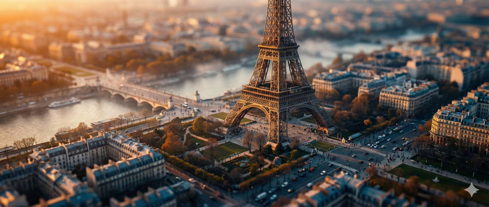
</div>

**提示词：**
```
A highly detailed tilt-shift photography of [LOCATION] captured from a high vantage point at [TIME OF DAY, e.g., golden hour sunset], transforming the iconic structure and surrounding landscape into a whimsical miniature toy model scene, with pinpoint sharp focus on the central elements like buildings, pathways, and key landmarks, gradually blurring into soft bokeh towards the edges and foreground/background for an exaggerated shallow depth of field effect; vibrant color palette featuring [COLOR SCHEME, e.g., warm oranges and deep blues], intricate textures on surfaces such as stone, foliage, or water reflections, subtle atmospheric haze or mist adding depth and realism, photorealistic rendering with high dynamic range lighting casting long dramatic shadows, ultra-high resolution 8K, cinematic composition emphasizing symmetry and leading lines, in the style of professional architectural miniature photography.
```

**中文提示词：**
```
一幅高度详细的移轴摄影，拍摄[LOCATION]，从高视角捕捉于[TIME OF DAY，例如，金色时段日落]，将标志性建筑和周围景观转化为一个奇幻的微型玩具模型场景，中心元素如建筑物、路径和关键地标具有针尖般的锐利焦点，向边缘和前景/背景逐渐模糊成柔和的散景，以夸张的浅景深效果；生动的色彩方案以[COLOR SCHEME，例如，温暖的橙色和深蓝色]为特色，表面如石头、叶片或水反射的复杂纹理，微妙的大气雾霾或薄雾增添深度和真实感，照片般真实的渲染，具有高动态范围照明投射长而戏剧性的阴影，超高分辨率8K，电影般的构图强调对称性和引导线，在专业建筑微型摄影风格中。
```

<a id="prompt-799"></a>
## 案例 799：登鹳雀楼 (来源 [@LufzzLiz](https://x.com/LufzzLiz/status/1997976321021116454)) 模型：Nano banana pro

<div style="display: flex; justify-content: space-between;">
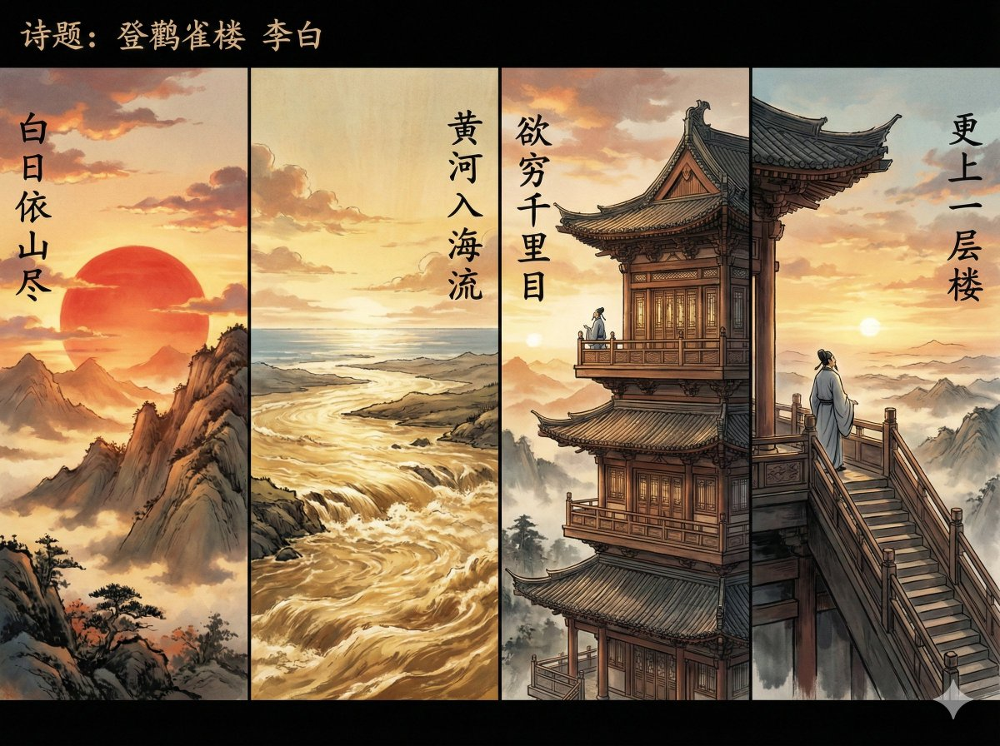
</div>

**提示词：**
```
Create a captivating poetic visual composition based on this prompt, seamlessly integrating the four lines of the quatrain into a unified masterpiece. Each panel perfectly illustrates one line of the poem, with the corresponding verse and the poem’s title and author elegantly embedded within its respective scene using Chinese characters. Together, these panels form a harmonious and cohesive panoramic artwork. Rendered with rich detail, cinematic lighting, 8K resolution, and highly refined textures. --ar 4:3

Poem Title: 登鹳雀楼
```

<a id="prompt-798"></a>
## 案例 798：类似摄影集的精美版面 (来源 [@Ankit_patel211](https://x.com/Ankit_patel211/status/1997930955248746637)) 模型：Nano banana pro

<div style="display: flex; justify-content: space-between;">
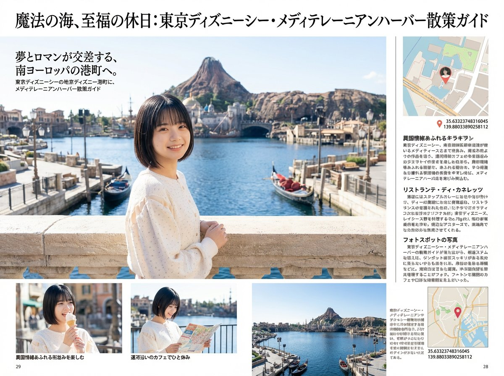
</div>

**中文提示词：**
```
让指定角色看起来像是在经纬度 35.63323748316045, 139.88033890258112 处观光。设计一个类似摄影集的精美版面。充分利用 9:16 的比例，为这本日本杂志制作一个专题页面。这将是一个重要的阅读页面，会影响访问量，因此请尽可能多地包含信息。
```

<a id="prompt-797"></a>
## 案例 797：五彩缤纷的电影级照片 (来源 [@xmiiru_](https://x.com/xmiiru_/status/1998275179684757534)) 模型：Nano banana pro

<div style="display: flex; justify-content: space-between;">
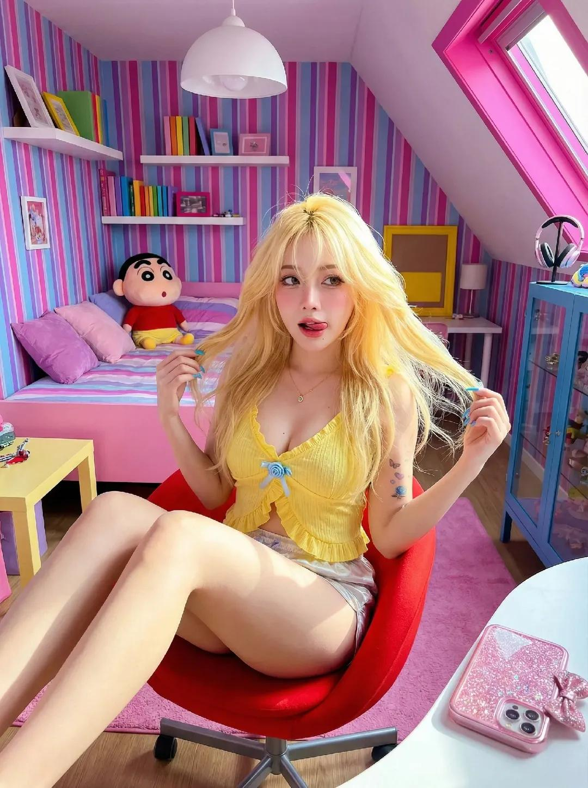
</div>

**提示词：**
```
{
  "prompt_id": "aor0093",
  "description": "Ultra-realistic HDR cinematic photo using the uploaded face as the only reference, keeping the true facial identity — no transformation, no changes",
  "scene": {
    "location": "Attic bedroom",
    "style": "Cute minimalist",
    "colors": ["orange", "pink", "blue", "purple", "green", "yellow", "white", "gray", "black", "red"],
    "features": [
      {
        "type": "window",
        "color": "bright pink"
      },
      {
        "type": "wallpaper",
        "pattern": "vertical stripes",
        "colors": ["purple", "pink", "blue"],
        "style": "Dopa Mine Decor",
        "theme": "colorful"
      }
    ]
  }
}
```

**中文提示词：**
```
{
"prompt_id": "aor0093",
“描述”：“使用上传的面部作为唯一参考，生成超逼真的 HDR 电影级照片，保留真实的面部特征——不进行任何转换或更改。”
“场景”： {
"位置": "阁楼卧室",
风格：可爱简约
颜色：[橙色”、“粉色”、“蓝色”、“紫色”、“绿色”、“黄色”、“白色”、“灰色”、“黑色”、“红色]
“特征”： [
{
"type": "window",
颜色：亮粉色
},
{
类型：壁纸，
“图案”：“竖条纹”，
颜色：["紫色", "粉色", "蓝色"]
"风格": "多巴矿装饰",
主题：多彩
}
]
}
}
```

<a id="prompt-796"></a>
## 案例 796：一组赛博朋克风格的时尚大片 (来源 [@_MehdiSharifi_](https://x.com/_MehdiSharifi_/status/1997832235974598763)) 模型：Nano banana pro

<div style="display: flex; justify-content: space-between;">
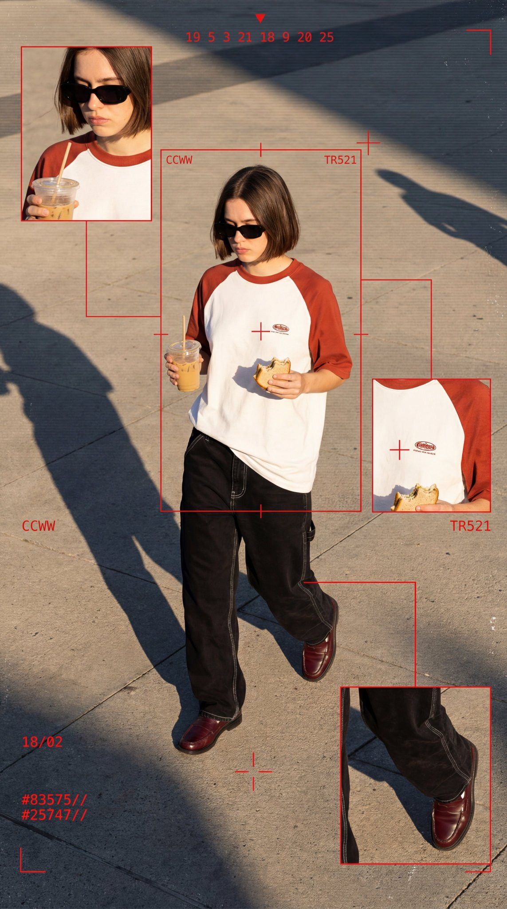
</div>

**提示词：**
```
A cyber-grunge surveillance fashion editorial featuring a cool, edgy young woman in her early 20s with a short chin-length bob haircut, straight with slight texture and casual bangs, partially obscured by thick black sunglasses and holding an iced coffee/chocolate plastic cup with a straw in her left hand and a half-eaten sandwich/pastry in her right hand. She wears an oversized white t-shirt with rust-red raglan sleeves and a small chest logo, tucked loosely into black, baggy carpenter/cargo denim jeans with white stitching details, and burgundy loafers, accessorized with a gold pendant necklace. She is captured in a full body walking stride, relaxed posture, facing slightly off-center with a casual, indifferent expression, head turned slightly to the side, looking downward, frozen mid-stride in an urban paved plaza with grey concrete and tiled pavement under bright sunny late afternoon golden hour light, creating high contrast shadows and long diagonal shadows to the left. The image is in 8K Ultra-HD quality, hyperrealistic, with a 4:5 aspect ratio and 1440x1920 resolution, styled in raw photoreal high fidelity, full color with cool urban tones and vibrant red UI accents, high-contrast daylight. The composition includes a main full body shot with multiple zoom-in crops (face/drink, torso, pants leg) in a fragmented layout, overlaid with tactical CCTV UI elements like red bounding boxes, telemetry data, and digital HUD overlays, simulating high-end surveillance footage with a 'Big Brother' observation vibe, candid urban documentation, and crisp daylight realism mixed with digital graphic design elements. The background is a sharp focus concrete cityscape with harsh shadow lines, and the lighting is natural harsh sunlight from a high angle, creating deep black cast shadows against bright pavement, with digital grain and scanline imperfections. The color grading features neutral urban greys, white, rust-red, denim black, and striking bright crimson red UI elements, with post-processing including high sharpness and red vector graphics overlays such as numbers '19 5 3 21 18 9 20 25', text 'CCWW', 'TR521', timecode '18/02', and bounding boxes with hashtags '#83575//' and '#25747//'. The overall theme is urban surveillance, Y2K streetwear, tactical data visualization, candid fashion moment, and dystopian chic, with a mood of cool detached observation, urban nonchalance, chaotic data stream, and privacy-invasion chic, captured from a high-angle surveillance perspective with a 35mm to 50mm lens, deep focus, and a layout of one main image plus three inset detail crops connected by red tactical line art and crosshairs.
```

**中文提示词：**
```
这是一组赛博朋克风格的时尚大片，主角是一位酷劲十足、个性鲜明的二十出头年轻女性。她留着齐下巴的短波波头，直发略带纹理，刘海随意，戴着一副厚厚的黑色太阳镜，左手拿着一杯插着吸管的冰咖啡/巧克力，右手拿着半个吃剩的三明治/糕点。她身穿一件宽松的白色T恤，袖子是锈红色插肩袖，胸前印着一个小巧的品牌标识，下身随意地塞进一条黑色宽松的工装牛仔裤里，裤子上有白色缝线细节，脚踩一双酒红色乐福鞋，脖子上戴着一条金色吊坠项链。照片捕捉到她迈着大步的全身姿态，放松的姿势，略微侧身，表情随意而淡漠，头部微微侧转，目光向下，定格在城市广场的半步之中。广场地面铺着灰色的水泥和瓷砖，沐浴在明媚的午后金色阳光下，形成鲜明的对比阴影，左侧投射出长长的斜影。照片采用8K超高清画质，画面逼真，宽高比为4:5，分辨率为1440x1920，风格为原始照片级高保真，色彩饱满，以冷色调的都市色调和鲜艳的红色UI元素点缀，营造出高对比度的日光效果。画面构图包含一个全身主镜头，并以碎片化的布局呈现多个放大特写（面部/饮料、躯干、裤腿），叠加了红色边界框、遥测数据和数字HUD叠加层等战术监控界面元素，模拟出高端监控录像的“老大哥”式监视氛围，同时融入了真实都市纪实和清晰的日光写实风格，并结合了数字图形设计元素。背景是清晰聚焦的混凝土城市景观，阴影线条强烈，光线来自高角度的自然强光，在明亮的路面上投射出深邃的黑色阴影，并带有数字颗粒感和扫描线瑕疵。色彩分级采用中性都市灰、白色、锈红色、牛仔黑和醒目的亮深红色 UI 元素，后期处理包括高锐化和红色矢量图形叠加，例如数字“19 5 3 21 18 9 20 25”、文本“CCWW”、“TR521”、时间码“18/02”以及带有井号“#83575//”和“#25747//”的边界框。整体主题是城市监控、Y2K 街头服饰、战术数据可视化、坦率的时尚瞬间和反乌托邦时尚，营造出一种冷静疏离的观察、都市的漫不经心、混乱的数据流和侵犯隐私的时尚感。照片采用 35 毫米至 50 毫米镜头，以高角度监控视角拍摄，并使用了深焦效果。照片布局为一张主图加三张局部细节图，并用红色战术线条和十字线连接。
```

<a id="prompt-795"></a>
## 案例 795：红墨水加上手写中文批注 (来源 [@songguoxiansen](https://x.com/songguoxiansen/status/1998271998259323132)) 模型：Nano banana pro

<div style="display: flex; justify-content: space-between;">
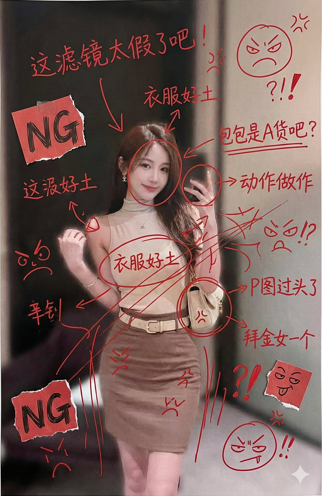
</div>

**中文提示词：**
```
生成图片，把它打印出来，然后用红墨水疯狂地加上手写中文批注、涂鸦、乱画，如果你想的话，检索这个账户内容，涂鸦的内容主要为吐槽他，还可以加点小剪贴画
```

<a id="prompt-794"></a>
## 案例 794：融合多种媒体元素的现实扭曲镜面自拍 (来源 [@_MehdiSharifi_](https://x.com/_MehdiSharifi_/status/1998059385675829263)) 模型：Nano banana pro

<div style="display: flex; justify-content: space-between;">
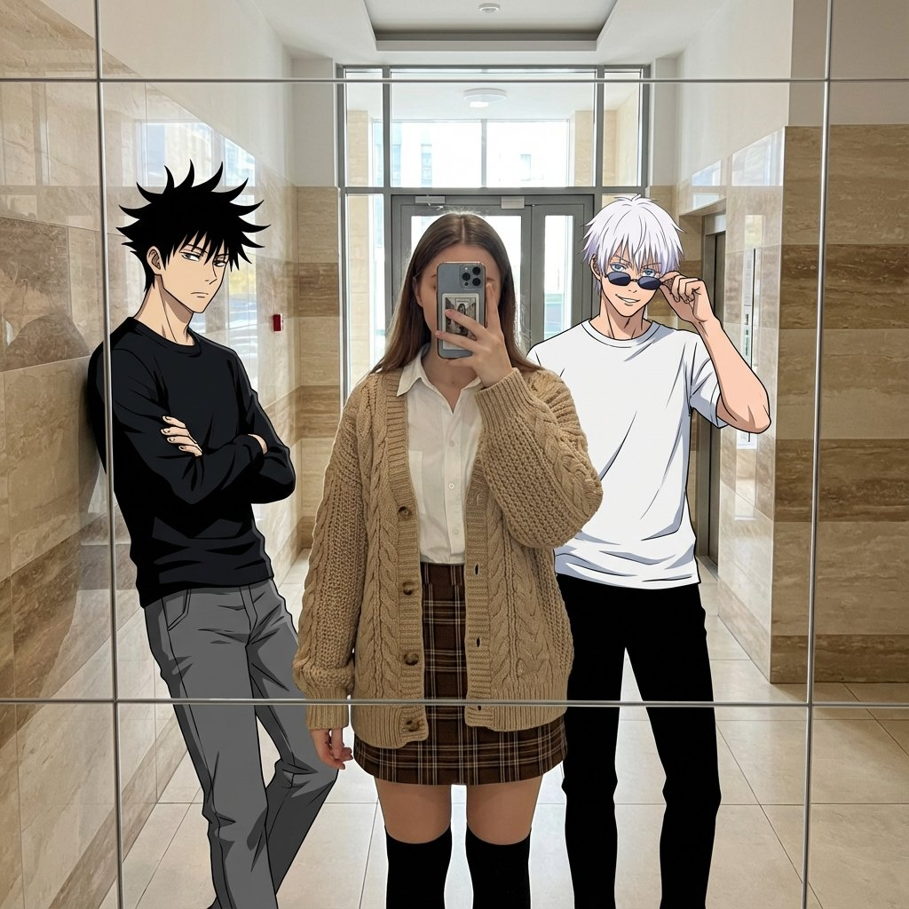
</div>

**提示词：**
```
{
  "image_request": {
    "goal": "Create a mixed-media reality-bending mirror selfie / blending 2D anime characters into a 3D real-world photo / cozy autumn academia fashion meets otaku dream",
    "meta": {
      "image_type": "Mixed Media Composite / Anime in Real Life / Mirror Selfie / Fashion Snapshot",
      "quality": "Best Quality, Photorealistic Center Subject, Sharp Anime Lines, Mixed Dimensionality",
      "color_mode": "Full Color / Natural Indoor Tones / Warm Beige & Brown Palette",
      "style_mode": "raw_photoreal blended with cel-shaded anime",
      "aspect_ratio": "3:4",
      "resolution": "1080x1920"
    },
    "creative_style": "A playful fusion of dimensions where 2D anime characters seamlessly occupy a real-world space. The photorealistic central figure wears a cozy 'Autumn Academia' outfit, contrasting with the flat, cel-shaded anime characters. The vibe is a casual, dream-like hangout caught in a mirror reflection.",
    "overall_theme": "Anime meets reality / Autumn Academia Fashion / Mirror selfie with fictional characters",
    "mood_vibe": "Cozy, stylish, playful, surreal, dimensional barrier breaking",
    "style_keywords": [
      "mixed media",
      "mirror selfie",
      "anime in real life",
      "autumn academia",
      "cable knit texture",
      "cel-shaded",
      "photorealistic fashion",
      "hallway reflection"
    ],
    "subject": {
      "count": "3 (1 human female, 2 anime males)",
      "type": "human and anime characters",
      "identity": "Center: Young woman (Photorealistic). Left: Spiky black-haired anime male (Megumi style). Right: White-haired anime male (Gojo style).",
      "identity_preservation": {
        "description": "Center subject is a photorealistic human wearing the specific autumn outfit. Side subjects retain distinct 2D anime art style.",
        "notes": "Maintain clear stylistic distinction: Highly detailed texture on the cardigan/skirt vs. bold anime lines for the boys."
      },
      "age_appearance": "Young adults",
      "skin": "Human: Natural texture, soft lighting. Anime: Flat cel-shaded tones.",
      "clothing": {
        "top": "Human: White cotton poplin shirt worn under a loose, oversized beige wool cable-knit cardigan. Left Anime: Black long-sleeve shirt. Right Anime: White t-shirt.",
        "bottom": "Human: Brown plaid/tartan flannel mini skirt and black knee-high socks. Left Anime: Grey pants. Right Anime: Black pants.",
        "accessories": "Human: Smartphone (taking the photo). Right Anime: Sunglasses.",
        "textures": "Emphasize the high-depth weave of the beige cardigan and the flannel texture of the skirt on the human subject."
      },
      "facial_features": {
        "expression": "Human: Obscured by phone or neutral/soft smile. Left Anime: Cool, stoic, arms crossed. Right Anime: Confident, smirk, adjusting glasses."
      },
      "hair": {
        "style": "Human: Natural styling suitable for an academic look. Left Anime: Spiky energetic black hair. Right Anime: White hair with bangs down."
      }
    },
    "pose_action": {
      "overall_pose": "Casual group mirror selfie. Center subject stands straight taking the photo holding phone. Left subject leans casually against the mirror frame. Right subject stands tall.",
      "body_position": "Standing, full body visible in mirror reflection to show the skirt and knee-high socks.",
      "hands": "Center: Holding phone. Left: Arms crossed. Right: Touching sunglasses/face."
    },
    "environment": {
      "setting": "Indoor hallway or lobby with high ceilings and reflective surfaces (matches original scene to keep the context).",
      "location": "Modern building interior with marble/tiled walls and glass elements.",
      "lighting": "Natural daylight filtering in, highlighting the texture of the wool cardigan.",
      "atmosphere": "Clean, bright, casual everyday hangout."
    },
    "background": {
      "color": "Beige, tan, brown (marble stripes) - compliments the beige/brown outfit.",
      "effect": "Reflected in mirror, showing a tiled floor and a glass door leading to the outside."
    },
    "lighting": {
      "type": "Natural diffuse",
      "source": "Windows/Doors behind the subjects (reflected)",
      "quality": "Soft, even. Creates soft shadows on the cable-knit texture.",
      "tone": "Warm neutral."
    },
    "camera": {
      "sensor_format": "Smartphone Camera",
      "position_angle": "Eye-level mirror reflection",
      "framing": "Vertical portrait shot capturing full bodies.",
      "composition": {
        "framing": "Mirror frame visible with geometric grid lines overlaying the reflection.",
        "depth": "Deep depth of field."
      }
    },
    "post_processing": {
      "final_touch": "Digital composite look. Ensure the lighting on the photorealistic cardigan matches the environment, while anime characters remain 2D."
    },
    "negative": {
      "style": "3D render of anime characters, messy drawing, bad anatomy, low resolution",
      "content": "distorted faces, extra limbs, human subject looking like a drawing, anime characters looking too realistic"
    },
    "additional_controls": {
      "special_notes": "Focus on the material contrast: Real wool and flannel vs. Anime flat colors.",
      "vibe": "Fan edit, OOTD (Outfit of the Day)."
    }
  }
}
```

**中文提示词：**
```
{
"image_request": {
“目标”：“创作一张融合多种媒体元素的现实扭曲镜面自拍/将二维动漫人物融入三维现实世界照片/舒适的秋季学院风时尚与宅男梦想相遇”，
"meta": {
"image_type": "混合媒体合成/现实生活中的动漫/镜子自拍/时尚快照",
“质量”：“最佳质量，照片级逼真的中心主体，清晰的动漫线条，混合维度”
"color_mode": "全彩/自然室内色调/暖米色和棕色调色板",
"style_mode": "raw_photoreal blended with cel-shaded anime",
"aspect_ratio": "3:4",
分辨率：1080x1920
},
“创意风格”： “一种巧妙融合不同维度的趣味作品，二维动画角色无缝融入现实世界空间。写实风格的中心人物身着舒适的‘秋季学院风’服装，与扁平的赛璐珞风格动画角色形成鲜明对比。整体氛围如同镜中倒影般，营造出一种轻松梦幻的聚会氛围。”
"overall_theme": "动漫与现实的碰撞 / 秋季学院风时尚 / 与虚构人物的镜子自拍",
"mood_vibe": "舒适、时尚、俏皮、超现实、打破维度界限"
"style_keywords": [
“混合媒介”，
“镜子自拍”，
“现实生活中的动漫”，
“秋季学术界”，
“绞花针织纹理”，
“卡通渲染”
“照片写实时尚”，
“走廊倒影”
],
“主题”： {
“count”: “3（1名人类女性，2名动漫男性）”
“类型”：“人类和动漫角色”，
“身份”：“中间：年轻女子（写实风格）。左侧：黑色刺猬头动漫男性（惠美风格）。右侧：白色头发动漫男性（五条风格）。”
"identity_preservation": {
“描述”：“中心人物是一位身着特定秋季服装的写实人物。两侧人物则保留了鲜明的二维动画艺术风格。”
“备注”：“保持清晰的风格区分：开衫/裙子采用高度精细的纹理，而男孩款则采用粗犷的动漫线条。”
},
"age_appearance": "青年人",
“皮肤”： “人类：自然纹理，柔和光照。动漫：扁平的赛璐珞着色色调。”
“衣服”： {
“上图”：人类：白色棉质府绸衬衫，外搭宽松的米色羊毛麻花针织开衫。左图动漫人物：黑色长袖衬衫。右图动漫人物：白色T恤。
“底部”： “人类：棕色格子/苏格兰格纹法兰绒迷你裙和黑色过膝袜。左侧动漫角色：灰色裤子。右侧动漫角色：黑色裤子。”
“配件”： “人类：智能手机（正在拍照）。 右动漫人物：太阳镜。”
“纹理”：“强调人物身上米色开衫的高密度编织纹理和裙子的法兰绒质感。”
},
"facial_features": {
“表情”： “人类：被手机遮挡或面带中性/柔和的微笑。左侧动漫人物：冷静、沉稳，双臂交叉。右侧动漫人物：自信，嘴角带着一丝微笑，正在调整眼镜。”
},
“头发”： {
“风格”：人类：适合学术形象的自然发型。左侧动漫：充满活力的黑色刺猬头。右侧动漫：带刘海的白色头发down."
}
},
"pose_action": {
“整体姿势”： “随意的集体镜前自拍。中间的人站直，拿着手机拍照。左边的人随意地倚靠在镜框上。右边的人站得笔直。”
“body_position”: “站立，全身在镜中反射可见，可以看到裙子和及膝袜。”
“手”：中间：拿着手机。左：双臂交叉。右：摸着太阳镜/脸。
},
“环境”： {
“场景”：“室内走廊或大厅，天花板很高，表面有反光材料（与原场景相符，以保持语境）。”
“地点”：“现代建筑内部，墙面采用大理石/瓷砖，并融入玻璃元素。”
“光线”：“自然光线倾泻而入，突显了羊毛开衫的质感。”
“氛围”：“干净、明亮、休闲的日常聚会场所。”
},
“背景”： {
颜色：米色、棕褐色、棕色（大理石条纹）——与米色/棕色服装相得益彰。
“效果”：“在镜子中映照出瓷砖地板和通往室外的玻璃门。”
},
“灯光”： {
“类型”：“自然漫射”，
“来源”：“主体背后的窗户/门（反射）”
“品质”：“柔软均匀。在针织纹理上营造出柔和的阴影。”
“色调”：“暖中性”。
},
“相机”： {
"sensor_format": "智能手机摄像头",
"position_angle": "眼平镜反射",
“构图”：“竖幅肖像照，拍摄全身像。”
“作品”： {
“镜框”：“镜框清晰可见，几何网格线覆盖在镜面反射之上。”
“景深”：“大景深”。
}
},
"post_processing": {
“final_touch”： “数字合成效果。确保逼真开衫的光照与环境相匹配，同时保持动漫人物的二维风格。”
},
“消极的”： {
“风格”：“动漫人物的3D渲染，凌乱的绘画，糟糕的解剖结构，低分辨率”，
“内容”：“扭曲的面孔、多余的肢体、看起来像画的人物、过于逼真的动漫人物”
},
"additional_controls": {
特别说明： 重点在于材质对比：真羊毛和法兰绒 vs. 动漫风格的纯色。
“vibe”：“粉丝剪辑，OOTD（每日穿搭）。”
}
}
}
```

<a id="prompt-793"></a>
## 案例 793：无缝融合两个不同的时代 (来源 [@dotey](https://x.com/dotey/status/1998095424394007000)) 模型：Nano banana pro

<div style="display: flex; justify-content: space-between;">

</div>

**提示词：**
```
A horizontal split-screen cinematic shot of {Scene}, seamlessly blending two different eras: {Era_A} on the left and {Era_B} on the right (default: about 100 years ago vs. present day).

On the left side ({Era_A}): show era-appropriate architecture, interior or environment design, materials, vehicles, and props that clearly belong to that historical period. People wear authentic clothing from {Era_A}, including hairstyles, accessories, and typical items in their hands (such as books, umbrellas, instruments, letters, newspapers, etc.). The overall mood feels nostalgic and historically accurate.

On the right side ({Era_B}): show the same {Scene} in the modern era, with updated architecture or renovated structures, contemporary materials (glass, steel, LED screens, modern furniture), modern vehicles or equipment, and current technology (smartphones, laptops, cameras, etc.). People wear contemporary fashion that matches today’s style in this setting.

In the center: the two eras merge and overlap organically, without a hard dividing line. Elements from {Era_A} and {Era_B} visually interact: people from different times look at each other, walk through each other’s space, or seem surprised by the other era’s technology and objects. Architecture and environment smoothly morph from old to new (for example, stone gates turning into modern campus gates, classical concert hall décor fading into a futuristic stage, old street shops transforming into neon-lit storefronts).

Make sure the scene is not just a simple left/right comparison but a dynamic time-travel interaction where buildings, clothing, props, and human gestures clearly emphasize the contrast and fusion between the two eras. Photorealistic, 8k resolution, cinematic lighting, wide angle, highly detailed textures, rich sense of time-travel storytelling.

---
SCENE: Times Square, New York
Era Comparison: 1920s and present day
Aspect Ratio: 4:3
```

**中文提示词：**
```
水平分屏电影镜头 {Scene}，无缝融合了两个不同的时代：左侧为 {Era _A} ，右侧为 {Era_ B} （默认：大约 100 年前 vs. 现代）}。

左侧（{时代_A}):展示了符合时代特征的建筑、室内或环境设计、材料、车辆和道具，这些都明显属于该历史时期。人们穿着{时代_A}的真实服饰，包括发型、配饰以及手中的典型物品（例如书籍、雨伞、乐器、信件、报纸等）。整体氛围既充满怀旧气息，又符合历史事实。

右侧（{Era_ B}):展示了现代的相同场景，建筑风格有所更新或翻新，采用了现代材料（玻璃、钢材、LED屏幕、现代家具）、现代车辆或设备以及当前技术（智能手机、笔记本电脑、相机等）。人们穿着符合当今风格的时尚服饰。

在中心区域：两个时代有机地融合交叠，没有明显的界限。{时代A}和{时代B}的元素在视觉上相互交融：不同时代的人们彼此对视，穿梭于彼此的空间，或对另一个时代的科技和物品感到惊讶。建筑和环境也从旧到新平滑过渡（例如，石门变成现代校园大门，古典音乐厅的装饰逐渐过渡到未来主义的舞台，老旧的街边店铺变成霓虹闪烁的店面）。

确保场景不仅仅是简单的左右对比，而是一个动态的时空穿越互动场景，建筑、服饰、道具和人物姿态都清晰地突出了两个时代之间的对比与融合。照片级写实效果，8K分辨率，电影级光照，广角镜头，高度精细的纹理，以及丰富的时空穿越叙事感。

---
场景：纽约时代广场
时代对比：20世纪20年代与当今时代
宽高比：4:3
```

<a id="prompt-792"></a>
## 案例 792：斯塔克工业钢铁侠战衣的演变 (来源 [@songguoxiansen](https://x.com/songguoxiansen/status/1997927625717915755)) 模型：Nano banana pro

<div style="display: flex; justify-content: space-between;">
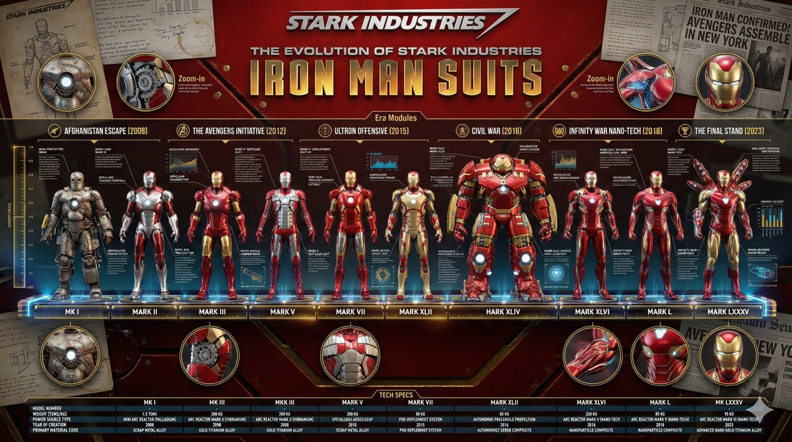
</div>

**提示词：**
```
Role & Subject: A massive, encyclopedic 16:9 3D infographic poster titled "THE EVOLUTION OF STARK INDUSTRIES IRON MAN SUITS". The visual style is a high-end fusion of museum-grade product photography and complex technical engineering blueprints.

The Hero Lineup (Chronological Core): A complete, linear chronological lineup of 10 historical versions of Iron Man Armors, ranging from the crude, bulky Mark I prototype forged in a cave to the sleek, bleeding-edge Mark LXXXV nanotechnology model. They are arranged with precision on a glowing holographic measurement scale/ruler base running horizontally across the center. Rendering: Hyper-realistic 3D, 8k resolution. Emphasis on the evolution of textures: showing the aging of early crude welded scrap metal, heavy iron, and exposed wiring of the Mk I vs. the pristine, highly-polished hot-rod red and gold plating, and fluid nanotech finish of modern versions like the Mk 50 and Mk 85.

Brand Atmosphere (The Canvas): Background: A deep, rich Hot Rod Red and metallic Gold textured background, resembling an armored plating surface. It is heavily layered with low-opacity watermarks of vintage Stark Industries patent drawings, handwritten engineering notes by Tony Stark (with coffee stains), and newspaper clippings related to the Avengers' history. Header: A prominent, high-contrast STARK INDUSTRIES logo displayed at the top center, with a bold typography title.

The "Hyper-Dense" Information Layer (The PUNCH Style): The layout is overwhelmed with organized information (creating a "Data aesthetics" look):

Dense Annotation Network: Hundreds of fine white and cyan hairlines connecting specific components (e.g., Arc Reactors, Repulsor Transmitters in palms, Articulated Helmet Faceplates, Micro-missile Compartments, Flight Stabilizers) to compact text blocks, energy output charts, and data tables floating in the volumetric space.

Contextual Zones: "Era Modules" floating above the suits, representing different phases (e.g., "AFGHANISTAN ESCAPE," "THE AVENGERS INITIATIVE," "ULTRON OFFENSIVE," "INFINITY WAR NANO-TECH") with iconographic markers.

Magnifying Inserts: Circular "Zoom-in" lenses scattered in empty spaces, showing extreme macro close-ups of texture details like the crude welding on Mark I, the mechanical joint articulation of Mark III, and the fluid nano-particle assembly of Mark LXXXV.

Tech Specs Strip: A structured data bar at the very bottom listing precise specifications (Model Number, Weight in tons/kg, Power Source Type, Year of Creation, Primary Material Code).

Technical Specs: Octane render, Unreal Engine 5 aesthetic, editorial layout, information design masterpiece, cinematic volumetric lighting, sharp focus, professional color grading, blockbuster movie poster vibe. --ar 16:9 --v 6.0 --stylize 350
```

**中文提示词：**
```
角色与主题：一幅名为“斯塔克工业钢铁侠战衣的演变”的大型百科全书式16:9 3D信息图海报。视觉风格融合了博物馆级别的产品摄影和复杂的技术工程蓝图，呈现出高端质感。

英雄阵容（时间线核心）：完整呈现10款钢铁侠战甲的历史版本，按时间顺序排列，从洞穴中锻造的粗糙笨重的Mark I原型到线条流畅、尖端科技的Mark LXXXV纳米技术型号，应有尽有。它们被精确地排列在中央水平延伸的发光全息测量标尺底座上。渲染：超逼真3D，8K分辨率。着重展现纹理的演变：早期Mark I粗糙的焊接废金属、厚重的铁质和裸露的电线，与Mk 50和Mk 85等现代版本光洁如新、高度抛光的红色和金色镀层以及流畅的纳米技术表面形成鲜明对比。

品牌氛围（画布）：背景：深邃浓郁的热棒红和金属金色纹理背景，宛如装甲板表面。其上叠加了多层低透明度的水印，包括斯塔克工业的复古专利图纸、托尼·斯塔克的手写工程笔记（带有咖啡渍）以及与复仇者联盟历史相关的报纸剪报。标题：醒目的高对比度“STARK INDUSTRIES”标志位于顶部中央，搭配粗体标题。

“超密集”信息层（PUNCH 风格）：布局中充斥着组织有序的信息（营造出一种“数据美学”的外观）：

密集的注释网络：数百条细细的白色和青色线条将特定组件（例如，弧形反应堆、手掌中的反重力发射器、铰接式头盔面罩、微型导弹舱、飞行稳定器）连接到漂浮在体积空间中的紧凑文本块、能量输出图表和数据表。

上下文区域：“时代模块”漂浮在战衣上方，代表不同的阶段（例如，“阿富汗逃亡”、“复仇者联盟计划”、“奥创进攻”、“无限战争纳米科技”），并带有图标标记。

放大插片：散落在空白处的圆形“放大”镜头，显示纹理细节的极端宏观特写，例如 Mark I 的粗糙焊接、Mark III 的机械关节铰接以及 Mark LXXXV 的流体纳米颗粒组装。

技术规格条：最底部的结构化数据栏，列出精确的规格（型号、重量（吨/千克）、电源类型、生产年份、主要材料代码）。

技术规格：Octane渲染，虚幻引擎5美学，编辑布局，信息设计杰作，电影级体积光照，清晰对焦，专业调色，大片海报氛围。--ar 16:9 --v 6.0 --stylize 350
```

<a id="prompt-791"></a>
## 案例 791：女生展示自己手机照片 (来源 [@SDT_side](https://x.com/SDT_side/status/1997789514526564650)) 模型：Nano banana pro

<div style="display: flex; justify-content: space-between;">
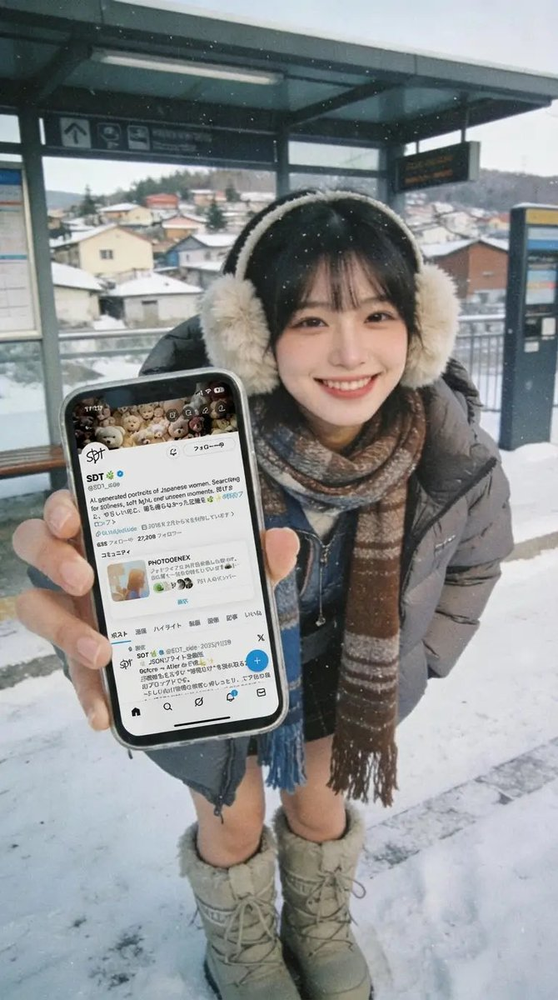
</div>

**提示词：**
```
需要上传2张照片：1、上传人物照片 2、上传想要在手机上显示的图像，再输入以下提示词
{
  "edit_type": "extreme_wide_angle_phone_edit",

  "source": {
    "_hint": "元画像の人物・服・雰囲気を編集するベース。新キャラ禁止。",
    "mode": "EDIT",
    "reference_images": {
      "first": "base_photo_person_and_environment",
      "second": "screen_content_for_phone"
    },
    "preserve_from_first": {
      "_hint": "顔・髪型・服装は必ず同一人物として扱うための固定。",
      "same_person_or_group": true,
      "same_faces": true,
      "same_hairstyles": true,
      "same_outfits": true,
      "same_environment_style": true
    }
  },

  "identity": {
    "_hint": "表情の統一化。人物のアイデンティティを崩さず保持。",
    "keep_identity_consistent": true,
    "all_people_clearly_recognizable_as_original": true,
    "expression": "bright_natural_smile"
  },

  "camera_effect": {
    "_hint": "スマホを近づけたときの誇張パースを美しく安定化。",
    "perspective": "extreme_wide_angle",
    "style": "dynamic_photorealistic",
    "near_objects_appear_large": true,
    "far_objects_recede_dramatically": true,
    "allow_view_from_above_or_below": true
  },

  "pose": {
    "_hint": "元画像と同じポーズ禁止。手の動きを強調して破綻防止。",
    "pose_can_change": true,
    "must_be_completely_different_from_reference": true,
    "do_not_replicate_or_approximate_original_pose": true,
    "style_tags": [
      "stylish",
      "complex",
      "fluid",
      "powerful"
    ],
    "focus_on_expressive_hands": true,
    "avoid_arm_distortion": true,
    "allow_multiple_body_parts_near_lens": true
  },

  "phone": {
    "_hint": "スマホ専用領域。持ち方・向き・手元の自然さを定義。",
    "allowed": true,
    "holding_styles": [
      "one_handed",
      "two_handed",
      "low_angle",
      "high_angle",
      "tilted",
      "sideways",
      "near_chest",
      "near_hip",
      "casual_carry",
      "partially_toward_lens"
    ],
    "rules": {
      "_hint": "“レンズに向ける強制”を避け、自然な持ち方で画面が見える構図へ。",
      "each_person_may_hold_one_phone": true,
      "priority_is_natural_and_relaxed_body_structure": true,
      "do_not_force_phone_directly_toward_camera": true,
      "screen_should_be_naturally_visible_when_possible": true
    }
  },

  "screen_replacement": {
    "_hint": "差し替えスクリーン。UIなし・歪みなし・自然な貼り込み。",
    "target": "visible_phone_screen",
    "use_second_reference_image_as_content": true,
    "overlay_cleanly_on_visible_screen_area": true,
    "fit_without_distortion": true,
    "respect_screen_shape": true,
    "no_additional_cropping": true,
    "ui_constraints": {
      "_hint": "SNSバーやアプリ枠の発生を完全禁止。",
      "no_ui": true,
      "no_icons": true,
      "no_status_bar": true,
      "no_app_frame": true,
      "show_only_content_from_second_reference": true
    }
  },

  "environment": {
    "_hint": "元写真の空気感を保つが、季節や天気には依存しない汎用設計。",
    "preserve_environment_style_from_reference": true,
    "lighting_consistent_with_reference": true,
    "expand_space_for_wide_angle_view": true,
    "keep_texture_and_color_tone_consistent": true
  },

  "composition": {
    "_hint": "スマホ近接によるダイナミック構図の安定化。",
    "dynamic_but_readable": true,
    "extreme_depth_emphasis": true,
    "allow_phone_close_to_lens": true,
    "keep_all_people_visually_balanced": true
  },

  "constraints": {
    "_hint": "意図せぬ変化を禁止する保護設定。",
    "no_new_characters": true,
    "no_change_in_age_or_gender_presentation": true,
    "no_costume_change": true,
    "no_change_to_reference_location_type": true,
    "respect_original_photographic_style": true
  }
}
```

<a id="prompt-790"></a>
## 案例 790：产品发展轨迹图 (来源 [@berryxia_ai](https://x.com/berryxia_ai/status/1997663876985549073)) 模型：Nano banana pro

<div style="display: flex; justify-content: space-between;">
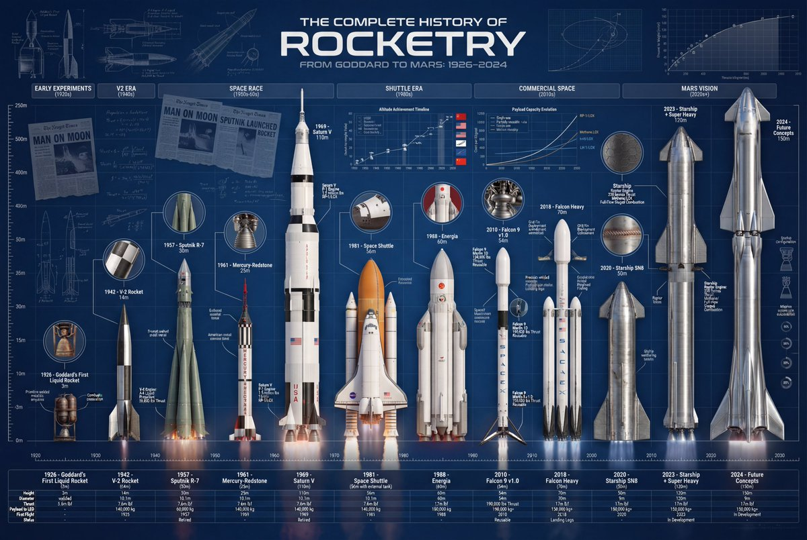
</div>

**提示词：**
```
Role & Subject: A massive, encyclopedic 16:9 3D infographic poster titled "THE EVOLUTION OF [Product Name]". The visual style is a high-end fusion of museum-grade product photography and complex technical engineering blueprints.

The Hero Lineup (Chronological Core): A complete, linear chronological lineup of 8-12 historical versions of [Product Name], ranging from the very first prototype to the latest futuristic model. They are arranged with precision on a measurement scale/ruler base running horizontally across the center. Rendering: Hyper-realistic 3D, 8k resolution. Emphasis on the evolution of textures: showing the aging of early [Material Vibe] vs. the pristine, high-tech finish of modern versions.

Brand Atmosphere (The Canvas): Background: A deep, rich [Brand Color] textured background. It is heavily layered with low-opacity watermarks of vintage patent drawings, handwritten engineering notes, and newspaper clippings related to the brand's history. Header: A prominent, high-contrast brand logo displayed at the top center, with a bold typography title.

The "Hyper-Dense" Information Layer (The PUNCH Style): The layout is overwhelmed with organized information (creating a "Data aesthetics" look):

Dense Annotation Network: Hundreds of fine white hairlines connecting specific [Key Components] (e.g., curves, buttons, engines) to compact text blocks and data tables floating in the space.

Contextual Zones: "Era Modules" floating above the products, representing different historical decades with iconographic markers.

Magnifying Inserts: Circular "Zoom-in" lenses scattered in empty spaces, showing extreme macro close-ups of texture details and internal mechanisms.

Tech Specs Strip: A structured data bar at the very bottom listing precise specifications (weight, dimensions, year, material code).

Technical Specs: Octane render, Unreal Engine 5 aesthetic, editorial layout, information design masterpiece, volumetric lighting, sharp focus, professional color grading. --ar 16:9 --v 6.0 --stylize 300 「以泡泡玛特发展史为例」
```

**中文提示词：**
```
角色与主题：一幅名为“[产品名称]的演变”的大型百科全书式16:9 3D信息图海报。视觉风格融合了博物馆级别的产品摄影和复杂的技术工程蓝图，呈现出高端的视觉效果。

英雄阵容（时间核心）：完整呈现[产品名称]的8-12个历史版本，按时间顺序排列，涵盖从最初的原型到最新的未来主义型号。它们精确地排列在横跨中心的水平刻度/尺形底座上。渲染：超逼真3D，8K分辨率。着重展现纹理的演变：早期[材质风格]的岁月痕迹与现代版本光滑的高科技质感形成鲜明对比。

品牌氛围（画布）：背景：深沉浓郁的[品牌色]纹理背景。其上叠加了大量低透明度的水印，内容包括与品牌历史相关的复古专利图纸、手写工程笔记和报纸剪报。标题：醒目的高对比度品牌标识位于顶部中央，搭配粗体标题。

“超密集”信息层（PUNCH 风格）：布局中充斥着组织有序的信息（营造出一种“数据美学”的外观）：

密集注释网络：数百条细白线将特定的[关键组件]（例如曲线、按钮、引擎）连接到漂浮在空间中的紧凑文本块和数据表。

背景区域：“时代模块”漂浮在产品上方，用图标标记代表不同的历史年代。

放大镜：散布在空白处的圆形“放大”镜头，显示纹理细节和内部机制的极致微距特写。

技术规格条：最底部的结构化数据栏，列出精确的规格（重量、尺寸、年份、材料代码）。

技术规格：Octane 渲染、虚幻引擎 5 美学、编辑布局、信息设计杰作、体积照明、锐聚焦、专业色彩分级。 --ar 16:9 --v 6.0 --stylize 300 「以泡泡玛特发展史为例」
```

<a id="prompt-789"></a>
## 案例 789：年轻女子在室内优雅地蹲着自拍 (来源 [@ZaraIrahh](https://x.com/ZaraIrahh/status/1997616475277033799)) 模型：Nano banana pro

<div style="display: flex; justify-content: space-between;">
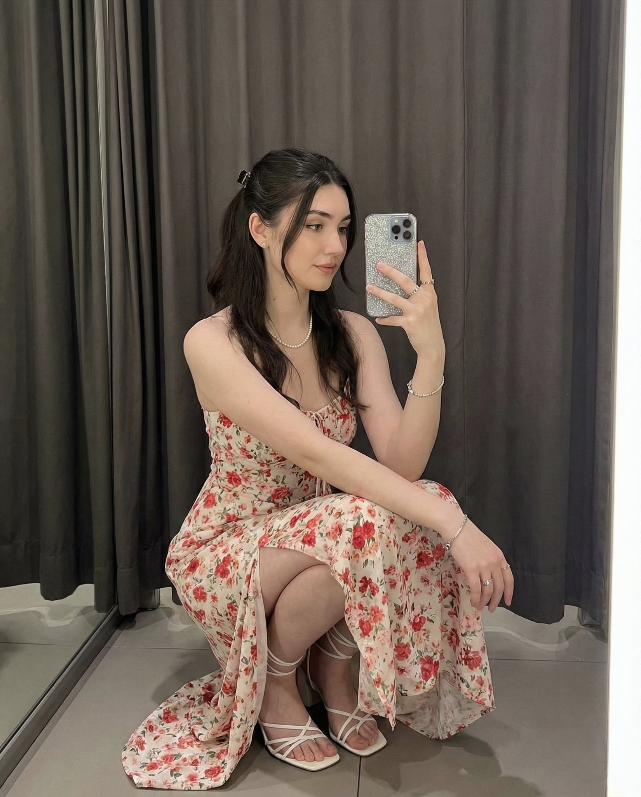
</div>

**提示词：**
```
{
  "image_prompt": {
    "face_preservation": {
      "use_reference_face": true,
      "accuracy": "match face exactly from reference image",
      "preserve_details": [
        "face shape",
        "eyebrows and eye structure",
        "natural makeup style",
        "lip shape and color",
        "hairline and hairstyle"
      ]
    },

    "subject": {
      "gender": "female",
      "description": "young woman taking a mirror selfie while squatting gracefully indoors",
      "pose": {
        "body_position": "squatting low with one knee forward, leaning slightly toward mirror",
        "head": "tilted slightly downward while looking at phone screen",
        "hands": [
          "right hand holding phone in front of face",
          "left hand resting on knee"
        ],
        "expression": "soft, calm expression"
      },
      "hair": {
        "style": "long dark brown hair in a half-up ponytail with a small clip",
        "texture": "smooth and straight"
      },
      "attire": {
        "dress": {
          "type": "light-colored floral maxi dress with short sleeves",
          "pattern": "red and pink small floral print",
          "details": "slit exposing leg, soft fabric flow"
        },
        "shoes": "white strappy heels",
        "accessories": [
          "silver necklace",
          "bracelet",
          "rings"
        ]
      }
    },

    "environment": {
      "setting": "indoor room with soft lighting",
      "background": "floor-to-ceiling curtains in dark grey tones",
      "floor": "smooth, reflective surface",
      "lighting": {
        "type": "soft warm indoor light",
        "effect": "even illumination on face and dress"
      }
    },

    "props": {
      "phone": {
        "type": "smartphone",
        "case": "glitter silver phone case",
        "position": "held vertically towards the mirror"
      }
    },

    "style": {
      "photography": "mirror selfie, social media aesthetic",
      "color_grade": "soft warm tones",
      "sharpness": "medium-high clarity",
      "mood": "feminine, elegant, gentle"
    },

    "composition": {
      "framing": "full body squatting pose, centered",
      "angle": "eye-level mirror perspective",
      "focus": "sharp focus on face and outfit",
      "aspect_ratio": "4:5"
    },

    "output": {
      "resolution": "8K high quality",
      "negative_prompt": [
        "incorrect face",
        "wrong hairstyle",
        "extra limbs",
        "different dress pattern",
        "distorted proportions",
        "text or watermark"
      ]
    }
  }
}
```

**中文提示词：**
```
{
"image_prompt": {
"面部保存": {
"use_reference_face": true,
“准确度”：“与参考图像中的人脸完全匹配”，
"preserve_details": [
“脸型”，
“眉毛和眼睛结构”，
“自然妆容风格”，
“唇形和颜色”，
发际线和发型
]
},

“主题”： {
"性别": "女性",
“描述”：“年轻女子在室内优雅地蹲着自拍镜子”，
"姿势": {
"body_position": "单膝前蹲，身体略微前倾，朝向镜子"
“头部”：“看着手机屏幕时略微向下倾斜”，
“手”：[
“右手拿着手机放在脸前”，
左手放在膝盖上
],
“表情”：“柔和、平静的表情”
},
“头发”： {
“发型”：“深棕色长发扎成半马尾，用一个小发夹固定”，
“质地”：“光滑笔直”
},
着装：{
“裙子”： {
“类型”：“浅色碎花短袖长连衣裙”，
“图案”：“红色和粉色小碎花图案”，
“细节”：“开衩露出腿部，柔软面料垂坠感”
},
“鞋子”：“白色细带高跟鞋”，
“配件”： [
“银项链”，
“手镯”，
“戒指”
]
}
},

“环境”： {
“场景”：“室内，灯光柔和”，
“背景”：“深灰色调的落地窗帘”，
“地板”：“光滑、反光的表面”，
“灯光”： {
类型：柔和温暖的室内灯光，
“效果”：“脸部和衣服上的光线均匀”。
}
},

"props": {
“电话”： {
“类型”：“智能手机”，
“手机壳”： “闪亮银色手机壳”，
“姿势”：“垂直对着镜子”
}
},

“风格”： {
“摄影”：“镜子自拍，社交媒体美学”，
"color_grade": "柔和的暖色调",
“清晰度”： “中高清晰度”，
情绪：女性化、优雅、温柔
},

“作品”： {
“构图”：“全身深蹲姿势，居中”，
“角度”：“平视镜视角”，
“焦点”: “清晰聚焦于面部和服装”，
"aspect_ratio": "4:5"
},

“输出”： {
分辨率：8K 高清，
"negative_prompt": [
“错误的脸”，
“错误的发型”，
“额外的肢体”，
“不同的服装款式”，
“扭曲的比例”，
“文字或水印”
]
}
}
}
```

<a id="prompt-788"></a>
## 案例 788：一幅令人着迷的4季时光画卷 (来源 [@dotey](https://x.com/dotey/status/1997787952110239874)) 模型：Nano banana pro

<div style="display: flex; justify-content: space-between;">
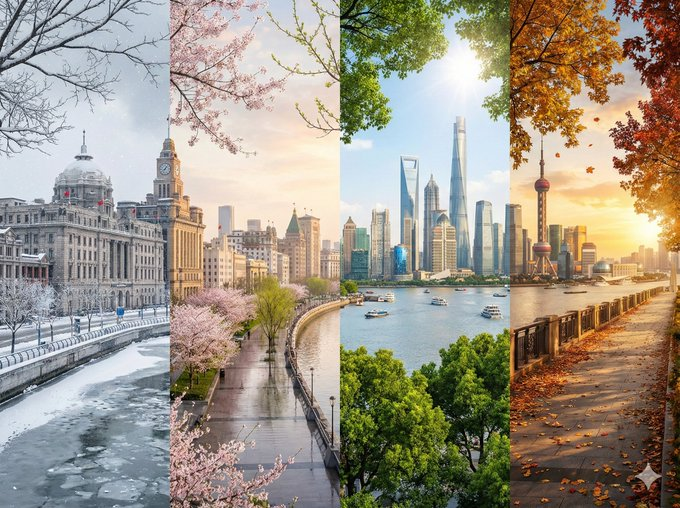
</div>

**提示词：**
```
Hyper-realistic digital illustration of {Scene}, presented as a single continuous composition showcasing the cycle of seasons. The scene flows seamlessly from left to right in a natural progression: Winter, Spring, Summer, and Autumn. 

The left side features cold snowy winter elements, gradually thawing into the fresh green buds and blooms of spring, then morphing into the lush vibrant vegetation and bright sunlight of summer, and finally transitioning into the golden, orange, and red hues of autumn on the far right. 

There are no visible dividing lines between seasons; the weather, lighting, and vegetation blend smoothly to create a unified and harmonious panorama. Rich in detail, symbolic of the passage of time, cinematic lighting, 8k resolution, highly detailed textures. --ar 4:3
```

**中文提示词：**
```
这幅超写实的数字插画描绘了{场景}，以连续的画面形式展现了四季的更迭。画面从左至右流畅自然地过渡：冬、春、夏、秋。

左侧展现了寒冷的冬季雪景，逐渐融化成春天的嫩绿花蕾和盛开的花朵，然后演变成夏天郁郁葱葱、生机勃勃的植被和明媚的阳光，最后过渡到最右侧秋天的金色、橙色和红色色调。

季节之间没有明显的界限；天气、光照和植被完美融合，构成一幅和谐统一的全景图。细节丰富，象征着时光流逝，电影级光照，8K分辨率，高度精细的纹理。--ar 4:3
```

<a id="prompt-787"></a>
## 案例 787：景点四季变化 (来源 [@berryxia_ai](https://x.com/berryxia_ai/status/1997843525770354961)) 模型：Nano banana pro

<div style="display: flex; justify-content: space-between;">
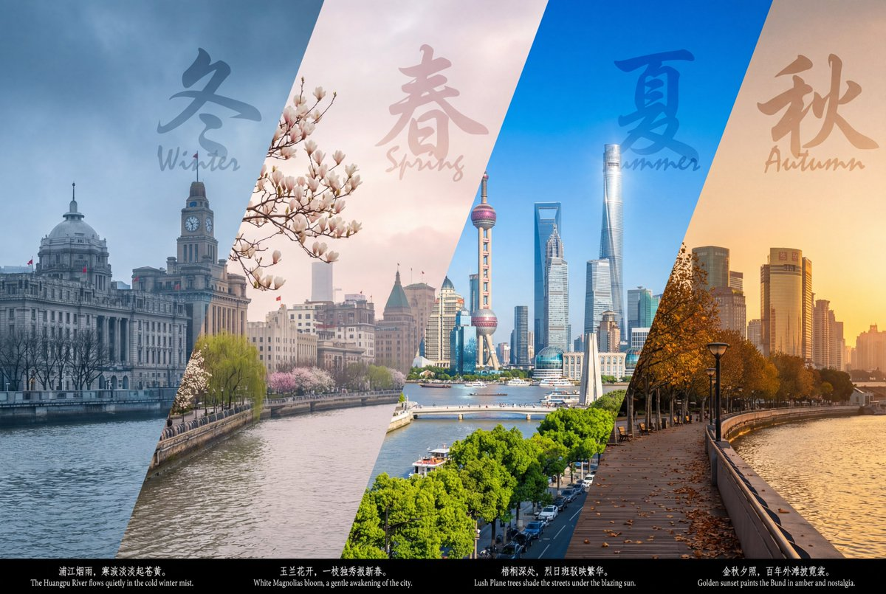
</div>

**提示词：**
```
[The Composition: Dynamic Diagonal Slicing]

Hyper-realistic digital art, 8k resolution, a wide cinematic panorama of **{City_Name}** featuring **{Landmark}**.
The composition utilizes a "**Dynamic Diagonal Phase Shift**" technique. The scene is visually divided into four distinct slanted zones (diagonal cuts flowing from top-right to bottom-left) representing the four seasons. The architecture and landscape maintain perfect structural continuity across these diagonal slices, creating a surreal but cohesive masterpiece.

**[Textual Layout: Clean & Non-Redundant]**
* **Layer A (Background Watermark - Season Identity):** Behind the main architecture in each diagonal zone, place a large, translucent, artistic calligraphy watermark acting as a graphic element.
    * Zone 1: "**{Calligraphy_Winter}**"
    * Zone 2: "**{Calligraphy_Spring}**"
    * Zone 3: "**{Calligraphy_Summer}**"
    * Zone 4: "**{Calligraphy_Autumn}**"
* **Layer B (Bottom Edge - Cultural Narrative):** At the very bottom, place strictly the poetic quotes (small, elegant sans-serif font). **DO NOT** repeat the season names here. Just the sentence.
    * Zone 1 Bottom: "**{Quote_Winter}**"
    * Zone 2 Bottom: "**{Quote_Spring}**"
    * Zone 3 Bottom: "**{Quote_Summer}**"
    * Zone 4 Bottom: "**{Quote_Autumn}**"

**[Visual Flow - The Diagonal Gradient]**

* **Zone 1 (Far Left Diagonal - WINTER):** The slice cuts through the left side of **{Landmark}**. The surface is covered in frost/snow.
    * *Atmosphere:* Cold blue tones, visible breath, sharp air.
    * *Botany:* **{Botany_Winter}** (bare branches/ice).

* **Zone 2 (Center-Left Diagonal - SPRING):** The next diagonal slice transforms the structure into a wet, blooming environment.
    * *Atmosphere:* Pastel pinks/greens, soft mist.
    * *Botany:* **{Botany_Spring}** (bursting flowers/buds).

* **Zone 3 (Center-Right Diagonal - SUMMER):** The diagonal slice reveals the structure under intense vertical sunlight.
    * *Atmosphere:* High contrast, vibrant saturation, deep blue sky.
    * *Botany:* **{Botany_Summer}** (lush dark greens/shade).

* **Zone 4 (Far Right Diagonal - AUTUMN):** The final diagonal slice on the right bathes the scene in golden light.
    * *Atmosphere:* Warm amber glow, long shadows.
    * *Botany:* **{Botany_Autumn}** (red/gold foliage).

**[Technical Specs]**
Seamless diagonal transitions, no hard lines but distinct color shifts. The landscape (roads/rivers) connects perfectly through the diagonal cuts. 8k resolution, photorealistic textures. --ar 21:9 --v 6.0 --stylize 300
```

<a id="prompt-786"></a>
## 案例 786：调研和数据可视化设计 (来源 [@op7418](https://x.com/op7418/status/1997715077789897182)) 模型：Nano banana pro

<div style="display: flex; justify-content: space-between;">

</div>

**中文提示词：**
```
【核心任务指令】
你是一个拥有实时网络搜索能力和顶尖数据可视化设计能力的AI专家。请执行以下两个步骤：
调研阶段：立刻针对用户指定的【2025 中国新能源汽车】进行全面的网络调研。搜集关于该领域内不同子产品、型号或作品的大众口碑、市场热度、专业评测及用户反馈数据。

可视化阶段：基于你的调研结果，设计一张专业的信息图表（Infographic）。你需要将调研到的具体项目，精准地分类填入下面定义的五个“从夯到拉”的视觉等级模块中。

【用户指定目标领域/产品】
[在此处填写你需要调研的内容，例如：2024年热门智能手机、市面上的无糖茶饮料品牌、近十年的漫威电影、程序员常用的代码编辑器]

【图像设计要求】
整体风格：
一张结构清晰、现代感强的模块化信息图表，采用“Bento Grid”（便当盒网格）布局。背景干净简洁，聚焦于内容呈现。视觉上必须体现出从高到低的强烈层级落差感。

等级结构与视觉定义（严格执行以下五级）：

第1级（最高层）：夯 (Hāng)
调研填充标准：根据调研，该领域内目前公认的“版本之子”、具有统治级热度、无可争议的顶流产品/作品。

视觉表现：占据画面最上方或最大的版面模块。色调为极具爆发力的爆裂红与辉煌金，带有光晕或能量外溢的视觉特效。字体最大、最粗。模块内需展示调研到的代表性产品的名称或高质量图像，并配以极简的赞美短语（如“全网吹爆”、“神作”）。

第2级：顶级

调研填充标准：硬核实力派，虽然热度可能不及“夯”，但口碑极佳，是行家首选的优质项目。

视觉表现：位于第二层。色调为坚实、高级的燃烧橙与金属银。模块设计显得扎实、富有质感。展示代表性实力派产品。

第3级：人上人

调研填充标准：优越之选，品味在线，买了/看了绝对不亏的中坚力量，代表了一定的鉴赏力。

视觉表现：位于中层。色调为明亮、干净的柠檬黄与冷灰。设计风格现代、清爽。展示代表性优质中产产品。

第4级：NPC

调研填充标准：毫无记忆点的大众脸产品，凑数的工业流水线产物，无功无过，容易被遗忘，必须要写上具体的产品或品牌或者人名不要含糊其辞。

视觉表现：位于中下层。色调为平淡乏味的面包色/米色或纸板棕。模块设计显得普通、重复、缺乏个性。展示那些非常平庸的产品。

第5级（最底层）：拉完了

调研填充标准：调研中发现的公认“避雷针”、“智商税”、灾难级失败产品或甚至不如没有的存在，必须要写上具体的产品或品牌或者人名不要含糊其辞。

视觉表现：挤在画面最底部或角落，视觉空间被压缩。色调为绝望黑、惨白，并带有明显的数字故障（Glitch）、破碎或腐烂的视觉效果。展示那些著名的“翻车”产品，并配以警示性短语（如“快逃”、“大冤种”）。
```

<a id="prompt-785"></a>
## 案例 785：生成人物不同姿势九宫格 (来源 [@qisi_ai](https://x.com/qisi_ai/status/1997553039474143501)) 模型：Nano banana pro

<div style="display: flex; justify-content: space-between;">
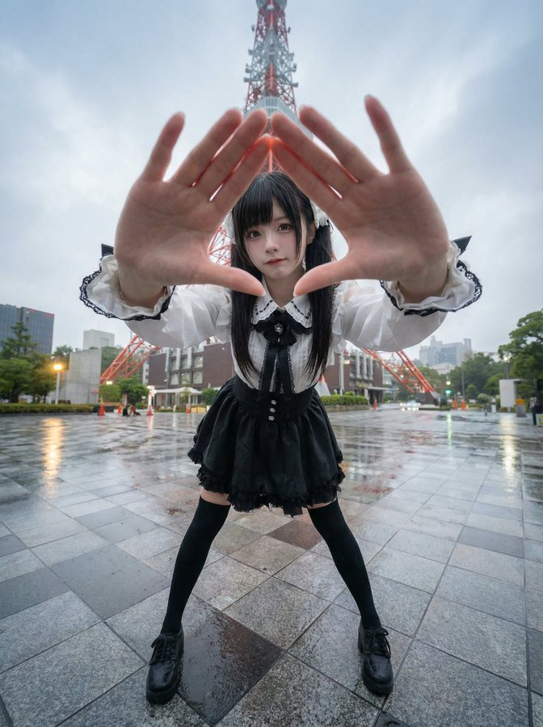
</div>

**中文提示词：**
```
在「东京塔」的位置，根据当地当前时间氛围和实时天气制作图片。请让指定的角色在该地点游览，使其融入场景。  

生成画面：
生成一张画面为竖版3:4比例，单张图固定九宫格布局，三行三列，每个格子为独立镜头。

相机与视角：
– 使用超广角或鱼眼感的镜头（大约等效全画幅 12–18mm 的观感）
– 相机角度必须与原图有显著变化，可以使用的夸张机位包括：
• 从正下方向上看的仰视视角
• 从正上方向下看的俯视视角
• 贴近地面的超低机位
• 从上往下的高机位
• 倾斜的「荷兰角度」构图
– 始终营造强烈的透视缩短效果：离镜头最近的身体部位显得巨大，其余身体在透视中向远处延伸
– 最终效果必须像一张大胆的时尚或街拍照片，完全写实，而不是插画或二次元风格

靠近镜头的身体部位（1–2 个，有时 3 个）：
– 每一张编辑图中，选择一到两个主要身体部位极度靠近镜头（在更复杂的姿势中，有时可以是三个）
– 在不同图像之间要变化这些部位，不要总是同一个地方靠近镜头
– 可以靠近镜头的身体部位包括：
• 一只或两只手 / 手指向镜头伸出
• 一只或两只脚 / 鞋子 / 靴子贴近镜头
• 膝盖或大腿
• 脸部非常靠近镜头
• 在前倾姿态中靠近镜头的肩膀或胸部
– 选中的身体部位应当极度接近镜头，几乎要碰到镜头，可清晰看到皮肤纹理、布料纹理和真实的广角畸变

姿势与整体身体（复杂且多变）：
– 创造与极端视角相匹配的强烈、酷炫、充满动感的姿势
– 随机使用不同类型的姿态，包括：
• 站立姿势中，一条腿或一只手朝镜头伸出
• 蹲下或贴地半蹲
• 坐在地面上或坐在物体上
• 平躺在地面上，腿或脚朝向镜头
• 身体大幅向前探向镜头
• 扭转躯干、交叉双腿或弓起背部，形成更具动感的身体线条
– 允许使用复杂姿势，例如：
• 两只手都靠近镜头，摆出手势（比耶、三角形、用手指做画框、指向观者等）
• 双脚都朝向镜头
• 一只手和一只脚同时作为前景的大型元素
• 脸部靠近镜头，同时手或脚也在透视关系中出现
– 即使在极端透视缩短下，也要保持合理可信的人体结构

机位与态度（随机化）：
– 随机改变相机角度与方向（朝上、朝下、侧向、倾斜构图），同时保持画面构图视觉上平衡、有冲击力
– 气质保持酷、从容，自信，偏向时尚大片或街头风格，具体依照原始穿搭气质
– 面部表情可以变化（严肃、俏皮、自信、神秘等），但必须始终看起来是同一个人

光线与画面渲染：
– 保持真实的阴影以及与地面 / 地板的接触关系
– 高分辨率与清晰细节，能看到皮肤纹理、布料纹理以及材质高光

变化与随机性：
– 每一张小图都应当与其他小图有明显区别，在以下方面保持多样化：
• 相机角度
• 姿势类型
• 哪些身体部位最靠近镜头
• 构图方向（正向、倾斜、俯视、仰视等）
– 避免一再重复完全相同的「单脚贴近镜头」构图，要呈现丰富多样的动态姿势和机位变化

严格规则：
– 不要把人物换成别人
– 不要改变服装类型；只能通过姿势、视角以及衣物的自然运动来改变表现方式
– 不要把场景移动到指定经纬度以外的地点；始终保持在指定经纬度地点的合理延展范围内
– 不要添加文字、标志、水印或图形设计元素
– 不要改成油画、插画或动漫风格；必须保持照片级写实效果
```

<a id="prompt-784"></a>
## 案例 784：将主体转化为黏土风格的3D角色 (来源 [@gizakdag](https://x.com/gizakdag/status/1997602898075615682)) 模型：Nano banana pro

<div style="display: flex; justify-content: space-between;">
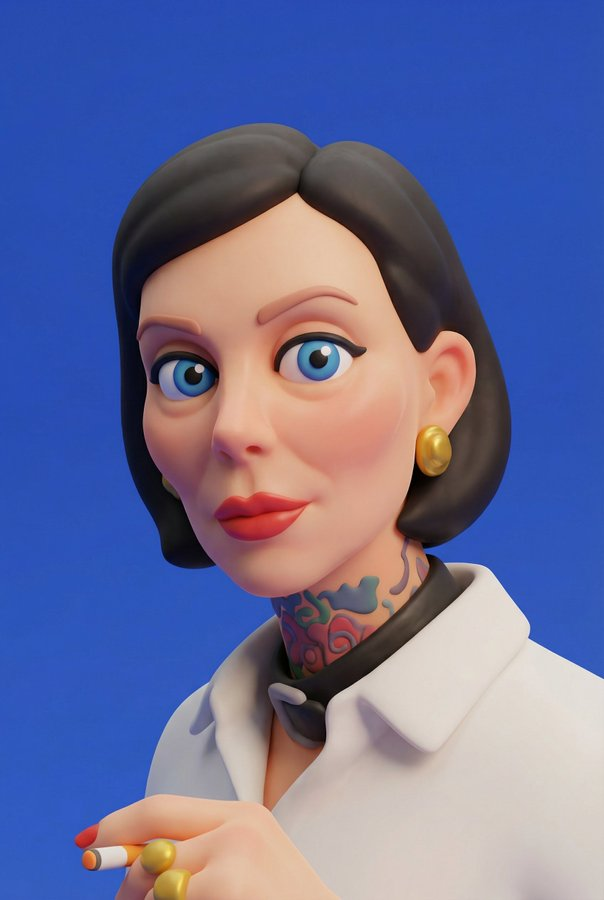
</div>

**提示词：**
```
Transform the subject into a stylized 3D character with soft clay-like materials, rounded sculptural forms, exaggerated facial features, pastel + vibrant color palette, smooth subsurface scattering skin, large cartoon eyes, simplified anatomy. Render against a bold blue studio background with soft frontal lighting and subtle shadows. Playful, surreal, polished character-design aesthetic similar to modern stylized 3D illustration. Keep the original photo’s composition and framing.
```

**中文提示词：**
```
将主体转化为风格化的3D角色，采用柔软的黏土质感、圆润的雕塑造型、夸张的面部特征、柔和与鲜艳的色彩搭配、光滑的底层纹理、卡通大眼睛和简化的解剖结构。在醒目的蓝色工作室背景下渲染，采用柔和的正面光线和微妙的阴影。营造一种趣味盎然、超现实且精致的角色设计美感，类似于现代风格化的3D插画。保留原照片的构图和取景。
```

<a id="prompt-783"></a>
## 案例 783：自己和2D动漫插画自拍 (来源 [@_MehdiSharifi_](https://x.com/_MehdiSharifi_/status/1997824265215684761)) 模型：Nano banana pro

<div style="display: flex; justify-content: space-between;">
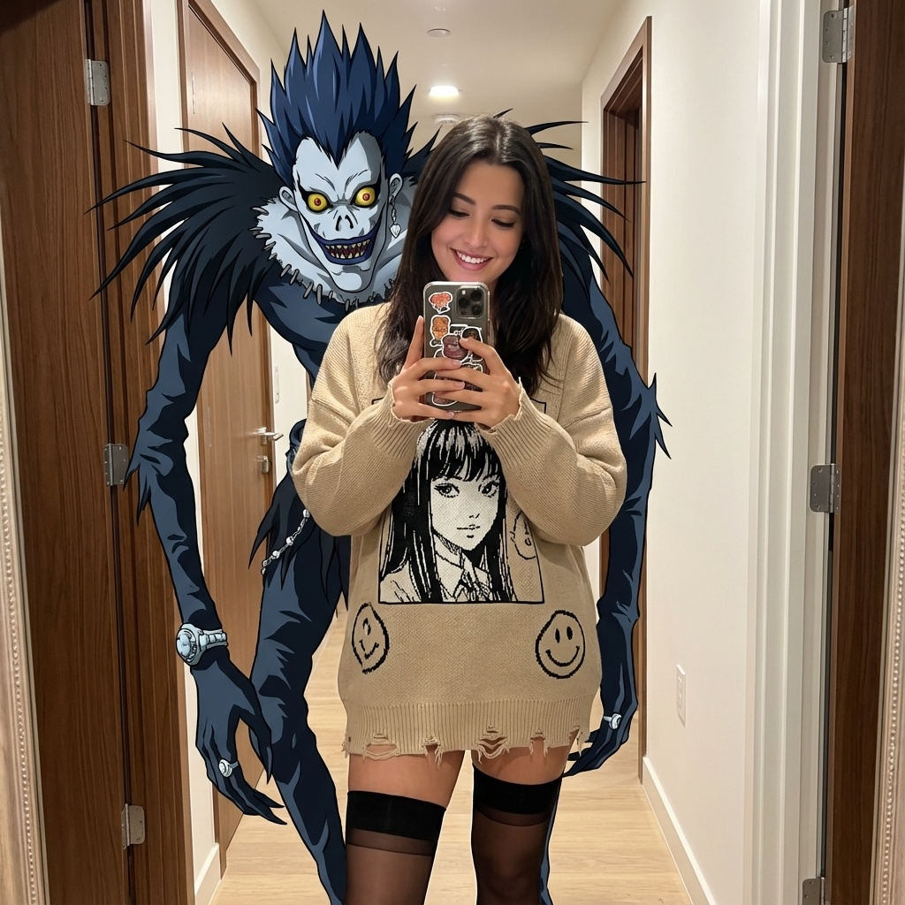
</div>

**提示词：**
```
{
  "image_request": {
    "goal": "Create a Gen Z anime-core streetwear mirror selfie blending [UPLOADED IMAGE] with 2D anime illustration elements",
    "meta": {
      "image_type": "Mixed Media Mirror Selfie / Anime-Core Fashion Editorial",
      "quality": "Best Quality, Ultra-Detailed, Mixed Reality, Smartphone Photography",
      "color_mode": "Full Color / Vibrant Accents",
      "style_mode": "raw_photoreal with 2D overlay",
      "aspect_ratio": "4:5",
      "resolution": "1080x1350"
    },
    "creative_style": "Playful Gen Z streetwear fashion mixed with 2D anime overlay, casual 'fit check' vibe, juxtaposition of cute styling with gothic anime horror elements, vibrant eclectic footwear, indoor mirror selfie aesthetic",
    "overall_theme": "anime culture/streetwear fashion / mixed reality / playful casual",
    "mood_vibe": "playful confident / otaku chic / quirky / casual cool",
    "style_keywords": [
      "mirror selfie",
      "streetwear",
      "anime overlay",
      "mixed media",
      "Gen Z fashion",
      "casual",
      "playful"
    ],
    "subject": {
      "count": "2 (1 human female [UPLOADED IMAGE] + 1 anime character overlay)",
      "type": "female / 2D character overlay",
      "identity": "[UPLOADED IMAGE]",
      "identity_preservation": {
        "description": "Strictly preserve facial features, hair, and body structure from [UPLOADED IMAGE]",
        "notes": "Use [UPLOADED IMAGE] as the reference for the main subject."
      },
      "age_appearance": "Derived from [UPLOADED IMAGE]",
      "skin": "Derived from [UPLOADED IMAGE]",
      "makeup": {
        "lips": "Derived from [UPLOADED IMAGE]",
        "eyes": "Derived from [UPLOADED IMAGE]",
        "general": "Derived from [UPLOADED IMAGE]."
      },
      "facial_features": {
        "expression": "Derived from [UPLOADED IMAGE]",
        "eyes": {
          "gaze": "Derived from [UPLOADED IMAGE]",
          "intensity": "Derived from [UPLOADED IMAGE]"
        },
        "lips": {
          "gesture": "Derived from [UPLOADED IMAGE]"
        }
      },
      "hair": {
        "length": "Derived from [UPLOADED IMAGE]",
        "texture": "Derived from [UPLOADED IMAGE]",
        "style": "Derived from [UPLOADED IMAGE]",
        "lighting_interaction": {
          "light": "soft indoor overhead reflection",
          "shadow_play": "minimal"
        }
      },
      "clothing": {
        "top": "oversized beige knit sweater with distressed hem, featuring large black-and-white manga girl portrait graphic and smiley face print (OR retain clothing from [UPLOADED IMAGE] if preferred)",
        "bottom": "sheer black thigh-high stockings (OR retain clothing from [UPLOADED IMAGE])",
        "full_description": "Subject from [UPLOADED IMAGE] styled in Gen Z anime-core fashion",
        "accessories": "layered pearl and chain necklaces, rings, quirky phone case with text stickers"
      },
      "props": {
        "bouquet": "N/A",
        "wine_glass": "N/A",
        "other": "Smartphone with sticker-covered case held in both hands"
      }
    },
    "pose_action": {
      "description": "Standing full-body mirror selfie matching [UPLOADED IMAGE]",
      "overall_pose": "Derived from [UPLOADED IMAGE]",
      "head_turn": "Derived from [UPLOADED IMAGE]",
      "gaze": "Derived from [UPLOADED IMAGE]",
      "body_position": "Derived from [UPLOADED IMAGE]",
      "hands": "holding smartphone at chest level to take a photo",
      "movement": "static pose"
    },
    "multiple_frames_expressions": [],
    "environment": {
      "setting": "Indoor hallway or hotel room entrance",
      "location": "in front of full-length mirror",
      "weather": "N/A (indoor)",
      "time_of_day": "indoor artificial light",
      "atmosphere": "casual/domestic/playful"
    },
    "background": {
      "color": "neutral tones/wood door / white walls",
      "effect": "standard depth of field, clear background with looming anime figure overlay"
    },
    "lighting": {
      "type": "Indoor overhead lighting",
      "position": "overhead",
      "direction": "top-down",
      "intensity": "moderate / even",
      "focus": "on [UPLOADED IMAGE] subject",
      "falloff": "gradual",
      "light_quality": "diffused artificial",
      "source": "ceiling fixture",
      "tone": "neutral to slightly warm",
      "mood": "casual daily life",
      "subject_lighting": "even illumination on [UPLOADED IMAGE]",
      "environment_lighting": "ambient indoor",
      "color_temperature": "3500K-4000K",
      "contrast_shadow": "soft shadows behind subject",
      "shadow_quality": "diffused",
      "imperfections": ["smartphone reflection", "indoor lighting glare"]
    },
    "camera": {
      "sensor_format": "Smartphone Camera",
      "lens": "Wide angle main lens (approx 24-26mm eq)",
      "position_angle": "eye-level (reflection)",
      "distance": "arm's length / approx 1.5 meters from mirror",
      "framing": "full body portrait 9:16",
      "depth_of_field": "deep (everything mostly in focus)",
      "composition": {
        "framing": "[UPLOADED IMAGE] centered, mirror frame visible on edges",
        "depth": "flat layering of 2D character behind 3D [UPLOADED IMAGE] subject",
        "emphasis": "outfit details and the juxtaposition of the anime character",
        "angle": "straight on"
      }
    },
    "photobooth_collage_specific": {
      "frame_count_per_strip": "N/A",
      "total_prints": "N/A",
      "layout": "N/A",
      "border": "N/A",
      "tonality_texture": "N/A",
      "highlight_behavior": "N/A"
    },
    "color_grading": {
      "palette": "Beige, Black, Yellow, Red, White",
      "lut": "Standard Smartphone / True to Life",
      "mood": "casual vivid"
    },
    "post_processing": {
      "sharpening": "standard",
      "final_touch": "Composite overlay of large 2D anime 'Shinigami' (death god) character looming behind [UPLOADED IMAGE]—spiky blue/black hair, skeletal face, yellow eyes, dark feathery wings/shoulders (Ryuk style)."
    },
    "negative": {
      "style": "blurry, low res, painting, 3D render of girl (girl must be photoreal), distorted hands",
      "content": "cluttered background, bad lighting, cropped feet",
      "artifacts": "warped phone, extra fingers"
    },
    "additional_controls": {
      "focus_emphasis": "The [UPLOADED IMAGE] subject and the anime character overlay",
      "grounding": "feet firmly planted",
      "special_notes": "The image features a distinct 'mixed reality' style where a 2D anime illustration is superimposed behind [UPLOADED IMAGE] in a mirror selfie.",
      "vibe": "playful anime fan",
      "final_output_goal": "A realistic mirror selfie of [UPLOADED IMAGE] with a convincing 2D anime character integration."
    }
  }
}
```

**中文提示词：**
```
{
"image_request": {
“目标”：“创作一张融合了[已上传图片]和2D动漫插画元素的Z世代动漫风街头服饰镜面自拍照片”，
"meta": {
"image_type": "混合媒体镜面自拍/动漫核心时尚专题",
“品质”：“最佳品质、超高清细节、混合现实、智能手机摄影”
"color_mode": "全彩/鲜艳色彩",
"style_mode": "带有 2D 叠加层的 raw_photoreal",
"aspect_ratio": "4:5",
分辨率：1080x1350
},
"creative_style": "俏皮的Z世代街头服饰时尚与2D动漫元素融合，休闲的“穿搭打卡”氛围，可爱造型与哥特式动漫恐怖元素的并置，充满活力的多元化鞋履，室内镜前自拍美学"
"overall_theme": "动漫文化/街头服饰时尚/混合现实/休闲玩法",
"mood_vibe": "俏皮自信/宅男时尚/古怪/休闲酷炫",
"style_keywords": [
“镜子自拍”，
“街头服饰”，
“动漫叠加层”，
“混合媒介”，
Z世代时尚
“随意的”，
“顽皮的”
],
“主题”： {
“计数”：“2（1个人类女性[上传图像] + 1个动漫角色叠加）”
"type": "女性/2D角色叠加",
“身份”：[上传的图片]，
"identity_preservation": {
“描述”：“严格保留[上传图像]中的面部特征、头发和身体结构”，
备注：请使用[已上传的图片]作为主要参考。
},
"age_appearance": "源自[上传的图片]",
“皮肤”：“源自[上传的图像]”，
“化妆品”： {
“嘴唇”：“源自[上传的图片]”，
“眼睛”：“源自[上传的图片]”，
“一般信息”：“源自[上传的图片]。”
},
"facial_features": {
“表达式”：“源自[上传的图像]”，
"眼睛": {
"凝视": "源自[上传的图片]",
“强度”： “源自[上传的图像]”
},
"嘴唇": {
“手势”：“源自[上传的图片]”
}
},
“头发”： {
"长度": "源自[上传的图像]",
“纹理”：“源自[上传的图像]”，
“风格”：“源自[上传的图片]”，
"lighting_interaction": {
“光线”: “柔和的室内头顶反射”，
"shadow_play": "minimal"
}
},
“衣服”： {
“上衣”： “宽松的米色针织毛衣，下摆做旧，饰有黑白漫画女孩肖像图案和笑脸印花（或者，如果喜欢，可以保留[上传图片]中的服装）”
“下装”： “黑色透明过膝长袜（或保留[上传图片])"中的服装，
"full_description": "来自[上传的图片]的人物，采用Z世代动漫风格穿搭",
“配饰”：“多层珍珠项链和链条项链、戒指、带有文字贴纸的个性手机壳”
},
"props": {
"花束": "不适用",
"wine_glass": "N/A",
“其他”: “双手拿着贴有贴纸的智能手机”
}
},
"pose_action": {
描述：站立式全身镜自拍搭配[上传图片]，
"overall_pose": "源自[上传的图片]",
"head_turn": "源自[上传的图像]",
"凝视": "源自[上传的图片]",
"body_position": "源自[上传的图像]",
“双手”：“将智能手机举到胸前拍照”，
“动作”: “静态姿势”
},
"multiple_frames_expressions": [] ,
“环境”： {
“场景”：“室内走廊或酒店房间入口”，
“位置”：“在全身镜前”，
“天气”：“不适用（室内）”，
"time_of_day": "室内人工照明",
氛围：休闲/温馨/轻松
},
“背景”： {
“颜色”：“中性色调/木门/白墙”，
“效果”：“标准景深，清晰的背景上叠加着若隐若现的动漫人物”
},
“灯光”： {
“类型”：“室内顶灯”，
“位置”: “上方”，
“方向”：“自上而下”，
“强度”： “中等/均匀”，
“焦点”：“聚焦于[上传的图片]主题”，
“下降”： “逐渐地”，
"light_quality": "漫射人工光",
“来源”：“天花板灯具”，
“色调”：“中性至略微偏暖”，
“心情”: “轻松的日常生活”
"subject_lighting": "[上传的图片]上光线均匀"
"environment_lighting": "室内环境照明",
"色温": "3500K-4000K",
"contrast_shadow": "主体背后的柔和阴影",
"shadow_quality": "漫反射",
“瑕疵”：[“智能手机反光”、“室内照明眩光”]
},
“相机”： {
"sensor_format": "智能手机摄像头",
“镜头”： “广角主镜头（约 24-26mm 等效焦距）”
"position_angle": "平视（反射）",
“距离”：“手臂长度/距镜子约1.5米”，
“构图”：“全身像 9:16”，
"depth_of_field": "deep (all of everything almost in focus)",
“作品”： {
“构图”：[上传的图片]居中，边缘可见镜像边框”，
“深度”：“二维角色在三维[上传图像]主体背后的平面分层”，
“重点”：“服装细节和动漫人物的并置”，
“角度”: “正对着”
}
},
"photobooth_collage_specific": {
"frame_count_per_strip": "N/A",
"total_prints": "N/A",
"布局": "不适用",
"border": "N/A",
"tonality_texture": "N/A",
"highlight_behavior": "N/A"
},
"color_grading": {
“调色板”： “米色、黑色、黄色、红色、白色”
"lut": "标准智能手机/逼真体验",
“氛围”： “轻松生动”
},
"post_processing": {
“锐化”：“标准”，
"final_touch": "在[上传的图片]后面叠加一个大型的2D动画“死神”角色——尖刺状的蓝黑色头发，骷髅般的脸，黄色的眼睛，深色的羽毛状翅膀/肩膀（琉克风格）。"
},
“消极的”： {
“风格”：“模糊、低分辨率、绘画、女孩的 3D 渲染（女孩必须是照片级写实的）、扭曲的手”
“内容”：“杂乱的背景，糟糕的光线，裁剪过的脚部”，
“文物”：“变形的手机，多余的手指”
},
"additional_controls": {
"focus_emphasis": "[上传的图片]主题和动漫人物叠加层",
“接地气”：“双脚稳稳地踩在地上”，
"special_notes": "这张图片采用了独特的“混合现实”风格，将二维动漫插图叠加在镜前自拍的[上传图片]后面。"
“氛围”：“爱玩的动漫迷”，
"final_output_goal": "一张逼真的[上传图片]镜前自拍，并巧妙地融入了2D动漫人物。"
}
}
}
```

<a id="prompt-782"></a>
## 案例 782：微缩3D卡通场景 (来源 [@TechieBySA](https://x.com/TechieBySA/status/1997621423310057725)) 模型：Nano banana pro

<div style="display: flex; justify-content: space-between;">

</div>

**提示词：**
```
Present a clear, 45° top-down isometric miniature 3D cartoon scene of the iconic scene [SCENE NAME] from [MOVIE/SHOW], with soft refined textures, realistic PBR materials, and gentle lifelike lighting.
Create a small raised diorama-style base that includes the most recognizable elements of this scene, along with tiny stylized characters if needed (no facial details).
Use a clean solid [BACKGROUND COLOR] background.

At the top-center, display [MOVIE/SHOW] in large bold text, directly beneath it show [SCENE NAME] in medium text, and place the official logo associated with [MOVIE/SHOW] below the subtext.
All text must automatically match the background contrast (white or black).

Composition: perfectly centered layout, square 1080x1080, ultra-clean, high-clarity diorama aesthetic.
```

**中文提示词：**
```
以清晰的 45° 俯视等距视角，呈现 [电影/剧集] 中的标志性场景 [场景名称] 的微缩 3D 卡通场景，采用柔和细腻的纹理、逼真的 PBR 材质和柔和逼真的光照。
制作一个小型凸起的立体模型式底座，其中包含此场景中最易辨认的元素，以及必要的微小风格化人物(no面部细节）。
使用干净的纯色背景。

在顶部中心位置，以粗体大字显示[电影/节目]，在其正下方以中等字体显示[场景名称]，并将与[电影/节目]相关的官方标志放在副标题下方。
所有文字必须自动与背景对比度（白色或黑色）相匹配。

构图：完美居中的布局，1080x1080正方形，超干净，高清晰度立体模型美学。
```

<a id="prompt-781"></a>
## 案例 781：充满奇思妙想的手工纸艺作品 (来源 [@KanaWorks_AI](https://x.com/KanaWorks_AI/status/1997461558130356494)) 模型：Nano banana pro

<div style="display: flex; justify-content: space-between;">
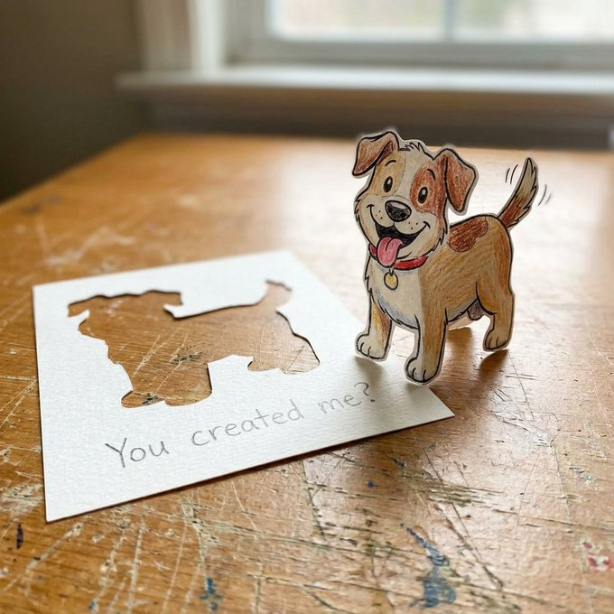
</div>

**提示词：**
```
A whimsical handmade paper artwork on a wooden desk: a hand-drawn cartoon 【dog】 cut from the paper and folded into a small standing 3D figure. The dog is 【sticking out its tongue and wagging its tail, looking happy and excited】. Next to it is the empty silhouette where it was cut out. The text “You created me?” is written below. Soft natural lighting, shallow depth of field, realistic photography, magical and playful mood.
```

**中文提示词：**
```
一张木桌上摆放着一件充满奇思妙想的手工纸艺作品：一只手绘卡通【小狗】被剪裁下来，折叠成一个小小的立体站立造型。小狗【吐着舌头，摇着尾巴，看起来既开心又兴奋】。旁边是剪裁后留下的空白轮廓。下方写着“你创造了我？”。柔和的自然光线，浅景深，写实的摄影风格，营造出一种神奇而又充满趣味的氛围。
```

<a id="prompt-780"></a>
## 案例 780：毛绒纺织品手工打造的微缩世界 (来源 [@Salmaaboukarr](https://x.com/Salmaaboukarr/status/1997701569794441437)) 模型：Nano banana pro

<div style="display: flex; justify-content: space-between;">
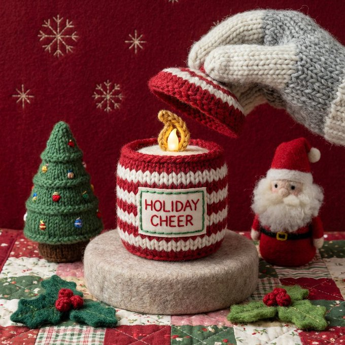
</div>

**提示词：**
```
"A soft beauty still life inside a miniature world handcrafted entirely from yarn, wool, and plush textiles. Two knitted night cream jars float gently above a pastel pink felt backdrop. 
The hero jar is fully sculpted from thick knitted stitches wrapped around a felted cylinder, with embroidered gold lettering mimicking the original label. 
The open jar below reveals a swirl of dense, glossy cream crafted from smooth white felt and layered wool fibers, shaped into soft peaks with stitched contour details.
A curved backdrop piece appears as a plush, padded woolen shape, adding dimension to the gentle pink environment. Everything in the scene, the jars, the cream, the surfaces, is made from yarn, crochet loops, and felted wool, giving the impression of a handcrafted beauty world.
```

**中文提示词：**
```
“一幅柔美的静物画，描绘了一个完全由纱线、羊毛和毛绒纺织品手工打造的微缩世界。两个针织的晚霜罐轻轻漂浮在淡粉色的毛毡背景上。”
这款英雄罐完全由厚实的针织针脚包裹在毛毡圆柱体上雕刻而成，并绣有金色字母，模仿了原标签。
下面的敞开式罐子里，可以看到一团浓稠光滑的乳霜，它由光滑的白色毡布和多层羊毛纤维制成，塑造成柔和的尖峰状，并带有缝线轮廓细节。
一块弧形背景板呈现出柔软蓬松的羊毛质感，为柔和的粉色环境增添了层次感。场景中的一切，包括罐子、乳霜和各种表面，都由纱线、钩针编织的线圈和毡制羊毛制成，营造出一个手工打造的美丽世界。
```

<a id="prompt-779"></a>
## 案例 779：年轻女子跪在田野里 (来源 [@IamEmily2050](https://x.com/IamEmily2050/status/1997809374136528952)) 模型：Nano banana pro

<div style="display: flex; justify-content: space-between;">
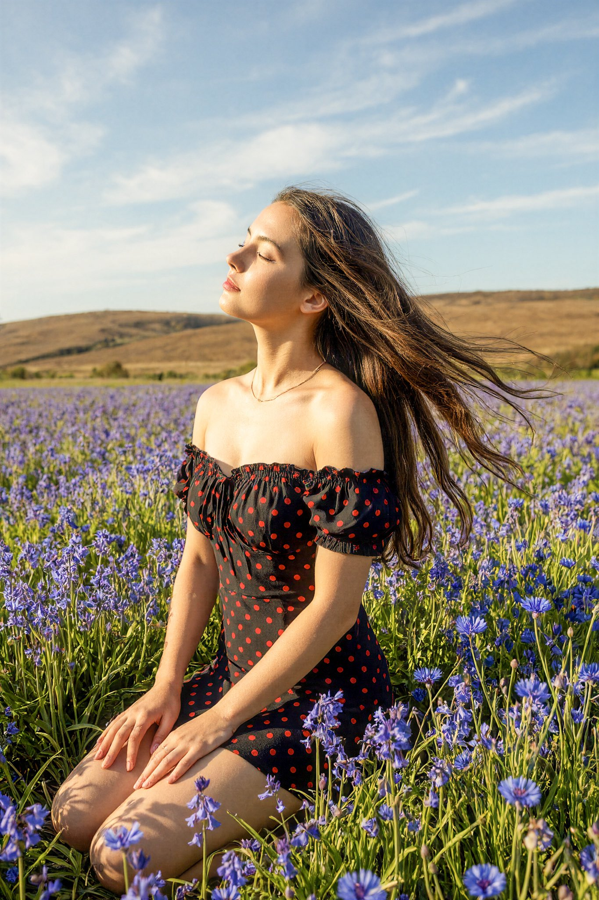
</div>

**提示词：**
```
{
    "shot_type": "Medium Full Shot (kneeling)",
    "composition": "Central composition with low horizon line",
    "angle": "Eye-level to slightly low angle"
  },
  "subject": {
    "subject_type": "Human",
    "identity_summary": "A young woman with long, dark, windblown hair kneeling in a field.",
    "visual_signature": {
      "facial_signature": {
        "face_shape": "Defined jawline, prominent cheekbones, side profile view",
        "eye_details": "Closed, relaxed eyelids with dark lashes",
        "nose_details": "Straight, slightly upturned tip",
        "lip_details": "Natural shape, closed, relaxed mouth",
        "cheek_and_jaw": "Sculpted features highlighted by hard sunlight",
        "unique_features": "Serene expression, head tilted back slightly"
      },
      "body_signature": {
        "build": "Slender, fit physique",
        "proportions": "Natural",
        "skin_tone_and_texture": "Tanned, smooth skin, sun-kissed",
        "height_estimation_cm": 170
      }
    },
    "pose_and_action": {
      "description": "Kneeling on the ground, soaking up the sun and wind",
      "body_position": "Kneeling (seiza-style or similar), torso upright, back slightly arched, head tilted back and turned to the side towards the light source",
      "limb_positions": "Arms resting relaxed on thighs/lap, legs folded underneath",
      "hand_gestures": "Relaxed fingers resting on legs",
      "facial_expression": "Serene, peaceful, enjoying the moment, eyes closed"
    },
    "inventory": {
      "wardrobe": "Black mini dress with red polka dots, off-the-shoulder ruffled sleeves, sweetheart neckline",
      "accessories": "Thin gold chain necklace, rings on fingers",
      "held_objects": "None",
      "hair_style": "Long, dark brown/brunette, wavy texture, blowing dynamically in the wind towards the right"
    }
  },
  "environment": {
    "setting": "Wildflower field",
    "ground_elements": "Dense field of vibrant blue wildflowers (e.g., bluebells, cornflowers, nemophila), green grass visible near roots",
    "background_elements": "Rolling brown hills/mountains in the distance",
    "sky_condition": "Blue sky with wispy, streaky cirrus clouds",
    "weather": "Sunny, windy"
  },
  "lighting": {
    "type": "Natural hard sunlight",
    "direction": "Side lighting (from the left)",
    "quality": "High contrast, creating distinct shadows on the face and neck, illuminating the profile",
    "color_temperature": "Daylight balanced (approx 5500K)"
  },
  "camera": {
    "lens_focal_length": "50mm or 85mm (Portrait)",
    "aperture": "f/2.8 to f/4 (Subject sharp, background slightly softened)",
    "shutter_speed": "Fast (to freeze the hair motion)",
    "film_grain": "Fine grain, digital photography style"
  },
  "post_processing": {
    "color_grading": "Natural, cool tones in the shadows (blues) contrasted with warm highlights (skin), slight contrast boost",
    "contrast": "Medium-High",
    "saturation": "Natural to Vibrant"
  },
  "negative": {
    "artifact_suppression": "white dots, white polka dots, orange flowers, orange poppies, yellow flowers, open eyes, standing, straight hair, static hair, indoor, studio lighting, distorted hands, extra fingers, cartoon, illustration, sketch, low resolution, blurry face, different person",
    "conceptual_suppression": "sadness, rain, night, urban setting"
  }
}
```

**中文提示词：**
```
{
"shot_type": "中景全景（跪姿）",
“构图”：“中心构图，地平线较低”，
“角度”： “视线水平至略低角度”
},
“主题”： {
"subject_type": "人类",
"identity_summary": "一位年轻女子跪在田野里，她有着长长的、乌黑的、被风吹乱的头发。"
"visual_signature": {
"facial_signature": {
"face_shape": "下颌线条分明，颧骨突出，侧面轮廓"
"eye_details": "闭合、放松的眼睑，睫毛浓密。"
"nose_details": "直鼻，鼻尖略微上翘",
"lip_details": "自然形状，闭合，放松的嘴唇"
"cheek_and_jaw": "在强烈的阳光下，轮廓分明的五官显得格外突出",
"unique_features": "神态安详，头部微微后仰"
},
"body_signature": {
“体型”： “苗条、健美的体格”
“比例”：“自然”，
"skin_tone_and_texture": "晒黑、光滑、阳光亲吻过的肌肤"
"height_estimation_cm": 170
}
},
"pose_and_action": {
描述：跪在地上，沐浴着阳光和微风。
“身体姿势”：“跪姿（正坐或类似姿势），躯干直立，背部略微拱起，头部向后倾斜并转向光源方向”，
"limb_positions": "双臂放松地放在大腿/膝盖上，双腿折叠在身下",
"hand_gestures": "放松的手指放在腿上",
面部表情：平静、安详，享受当下，双眼紧闭。
},
“存货”： {
“衣橱”： “黑色迷你连衣裙，饰有红色波点，露肩荷叶边袖子，心形领口”
“配饰”：“细金链项链，手指上的戒指”，
"held_objects": "无",
"hair_style": "长长的深棕色/褐色，波浪状，随风向右飘动"
}
},
“环境”： {
“场景”：“野花田”，
"ground_elements": "茂密的鲜艳蓝色野花（例如，风铃草、矢车菊、粉蝶花），根部附近可见绿草"
"background_elements": "远处连绵起伏的棕色山丘/山脉",
天空状况：蓝天下飘着缕缕卷云。
天气：晴朗，有风
},
“灯光”： {
“类型”：“自然硬阳光”，
“方向”：“侧光（来自左侧）”
“品质”：“高对比度，在脸部和颈部形成清晰的阴影，提亮侧脸轮廓”，
"color_temperature": "日光平衡（约 5500K）"
},
“相机”： {
"lens_focal_length": "50mm 或 85mm（人像）",
“光圈”: “f/2.8 至 f/4（主体清晰，背景略微柔化）”
"shutter_speed": "快速（以冻结头发的运动）",
"film_grain": "细颗粒，数码摄影风格"
},
"post_processing": {
“color_grading”: “阴影部分采用自然冷色调（蓝色），高光部分采用暖色调（肤色），略微增强对比度”，
“对比度”：“中高”
“饱和度”：“自然到鲜艳”
},
“消极的”： {
"artifact_suppression": "白点、白色波点、橙色花朵、橙色罂粟花、黄色花朵、睁开的眼睛、站立、直发、静电头发、室内、摄影棚灯光、扭曲的手、多余的手指、卡通、插图、素描、低分辨率、模糊的脸、不同的人",
"conceptual_suppression": "悲伤、雨、夜晚、城市环境"
}
}
```

<a id="prompt-778"></a>
## 案例 778：夏日多巴胺清新风格 (来源 [@songguoxiansen](https://x.com/songguoxiansen/status/1997574800341131504)) 模型：Nano banana pro

<div style="display: flex; justify-content: space-between;">
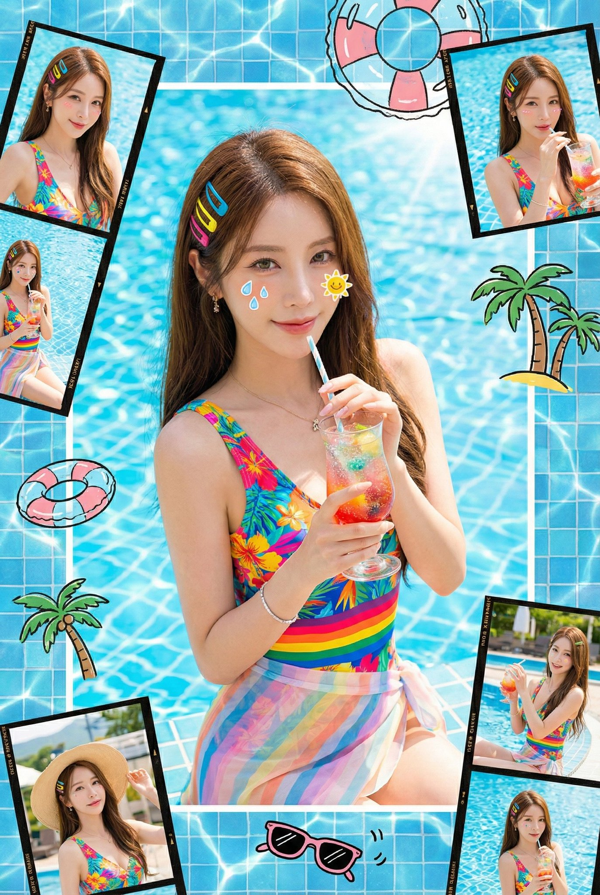
</div>

**中文提示词：**
```
保持人物面部特征和发型。夏日多巴胺清新风格，竖版拼贴画。模特穿着明亮的泳装或沙滩装，头戴彩色发卡，手持一片鲜红的西瓜或一杯气泡冰饮。脸上贴着“水滴”和“太阳”形状的可爱贴纸。背景是清新的泳池蓝色瓷砖，带有波光粼粼的水面效果。手绘涂鸦包括游泳圈、棕榈树和太阳眼镜。周围环绕着几张胶卷底片边框的照片。阳光明媚的自然光，高清晰度，清爽活力感。
```

<a id="prompt-777"></a>
## 案例 777：人物的9种服装风格和背景 (来源 [@songguoxiansen](https://x.com/songguoxiansen/status/1996935337546076316)) 模型：Nano banana pro

<div style="display: flex; justify-content: space-between;">
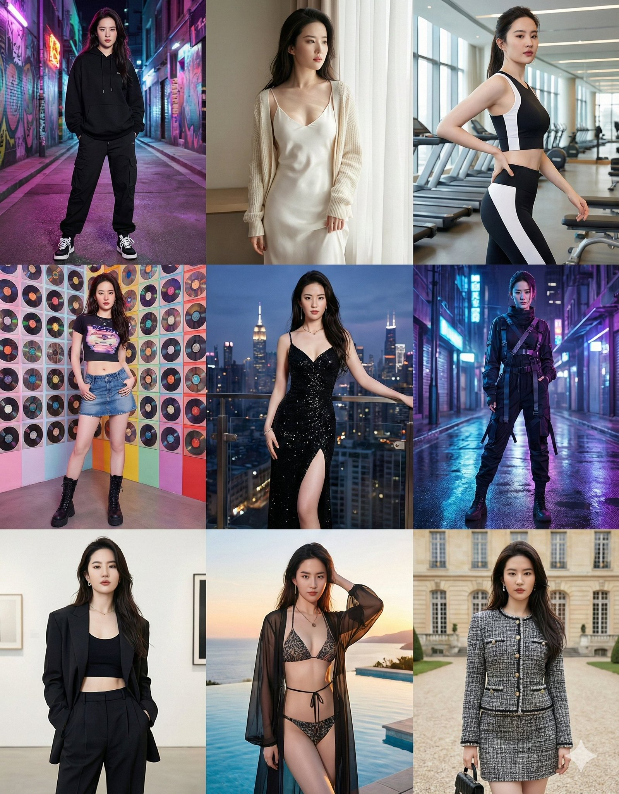
</div>

**中文提示词：**
```
基于[上传人物图片]并严苛保持面部特征不变，生成一张极具时尚感和网络热门度的3x3九宫格拼贴照片，九个独立画面分别展示该人物身着：酷飒街头风黑色Oversized卫衣配工装裤（涂鸦霓虹后巷背景）、清纯性感风白色丝绸吊带睡裙外搭针织衫（柔光慵懒卧室窗边背景）、紧身塑形时尚瑜伽套装（高端采光健身房背景）、复古Y2K辣妹短T恤配低腰牛仔裙（千禧风彩色充满CD的房间背景）、华丽黑色高开叉亮片晚礼服（城市天际线天台酒吧夜景背景）、前卫赛博朋克机能风束带装束（未来感雨夜街道蓝紫光背景）、都市摩登风廓形西装内搭露脐装（极简高级艺术馆背景）、热辣度假风比基尼配透明防晒罩衫（奢华海景泳池日落背景）以及静奢老钱风粗花呢小香风外套套装（古典欧式庄园庭院背景），整体画面追求高级杂志大片质感、光影迷人且富有潮流张力。
```

<a id="prompt-776"></a>
## 案例 776：摆出一个时尚复杂有力的姿势 (来源 [@songguoxiansen](https://x.com/songguoxiansen/status/1997489903362244991)) 模型：Nano banana pro

<div style="display: flex; justify-content: space-between;">
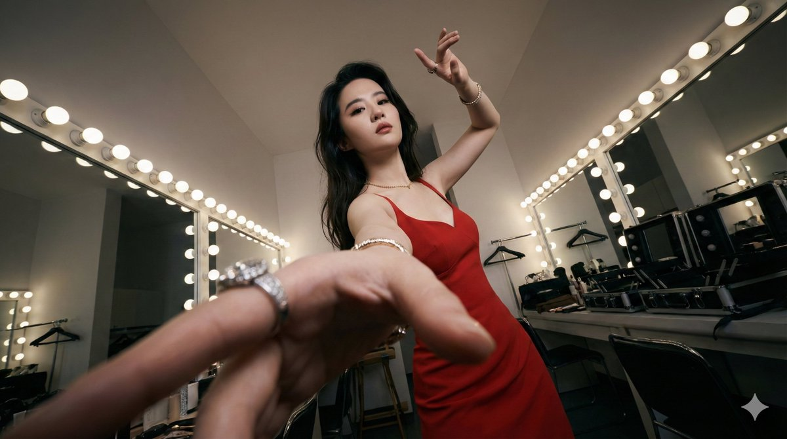
</div>

**中文提示词：**
```
将原始照片转化为一个戏剧性的、逼真的、超广角镜头，具有极端的相机角度（包括从正下方或正上方的视角），其中一个或多个身体部位紧挨着镜头并且看起来巨大，身体的其余部分在透视中后退，并且同一个人在原始环境的一致的、扩展的版本中摆出一个时尚的、复杂的、有力的姿势。
```

<a id="prompt-775"></a>
## 案例 775：6格漫画每一格的风格都不同 (来源 [@songguoxiansen](https://x.com/songguoxiansen/status/1996758924528124001)) 模型：Nano banana pro

<div style="display: flex; justify-content: space-between;">
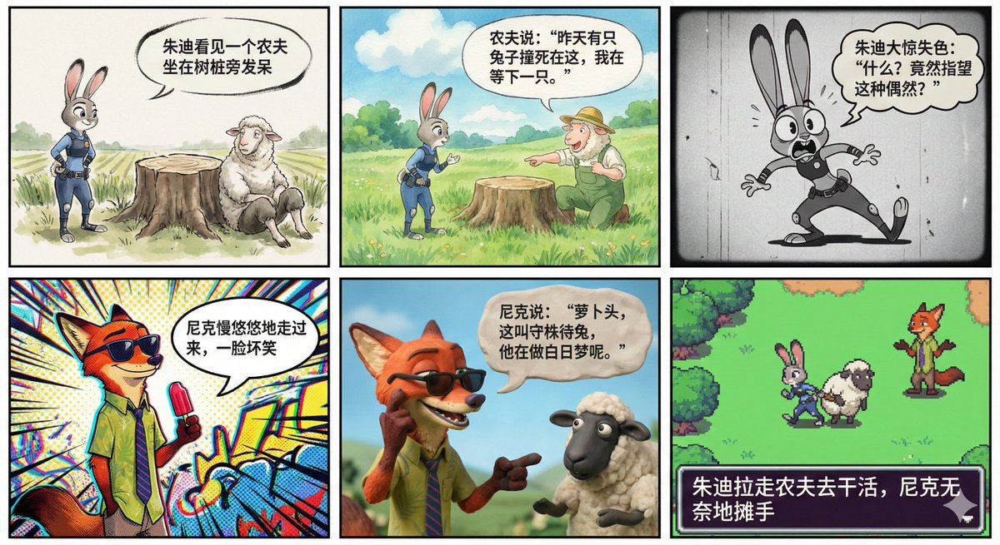
</div>

**中文提示词：**
```
第1格：中国水墨动画风格

中国水墨动画风格，朱迪警官穿着警服在田野边看着一只绵羊农夫坐在大树桩旁发呆，光线明亮，皮毛质感逼真，画面中有一个对话气泡，里面精准地写着中文字：“朱迪看见一个农夫坐在树桩旁发呆”

第2格：吉卜力手绘风

宫崎骏吉卜力工作室手绘动画风格，清新的水彩质感，绿色的草地和蓝天，朱迪正在询问，绵羊农夫兴奋地指着树桩解释，画面治愈，画面中有一个对话气泡，里面精准地写着中文字：“农夫说：'昨天有只兔子撞死在这，我在等下一只。'”

第3格：1930s复古橡皮管风

1930年代复古橡皮管动画风格，黑白胶片质感，类似于《茶杯头》风格，朱迪大惊失色，身体夸张地后仰，耳朵竖得笔直且拉得很长，眼睛瞪得像碟子一样大，表情不可置信，带锯齿边的复古对话气泡里精准地写着中文字：“朱迪大惊失色：'什么？竟然指望这种偶然？'”

第4格：蜘蛛侠平行宇宙美漫风

《蜘蛛侠：平行宇宙》美漫波普艺术风格，半调网点效果，色差故障艺术，尼克慢悠悠地走过来，戴着墨镜，手里拿着一根爪爪冰棍，一脸坏笑，背景有动态涂鸦线条，漫画风格对话气泡里精准地写着中文字：“尼克慢悠悠地走过来，一脸坏笑”

第5格：阿德曼黏土动画风

阿德曼工作室黏土动画风格，定格动画，类似于《小鸡快跑》的质感，能看到橡皮泥上的指纹细节，尼克摘下墨镜指着绵羊农夫对朱迪解释，尼克有标志性的宽嘴大牙，表情滑稽，黏土质感的对话气泡里精准地写着中文字：“尼克说：'萝卜头，这叫守株待兔，他在做白日梦呢。'”

第6格：16位像素游戏风

16位复古像素艺术风格，超级任天堂游戏画面，鲜艳的像素色块，朱迪无奈地拉着绵羊农夫去劳动，尼克在后面摊手耸肩，像RPG游戏的过关画面，游戏对话框里精准地写着中文字：“朱迪拉走农夫去干活，尼克无奈地摊手”
```

<a id="prompt-774"></a>
## 案例 774：人物的9种服装风格和背景 (来源 [@songguoxiansen](https://x.com/songguoxiansen/status/1996742290258514217)) 模型：Nano banana pro

<div style="display: flex; justify-content: space-between;">
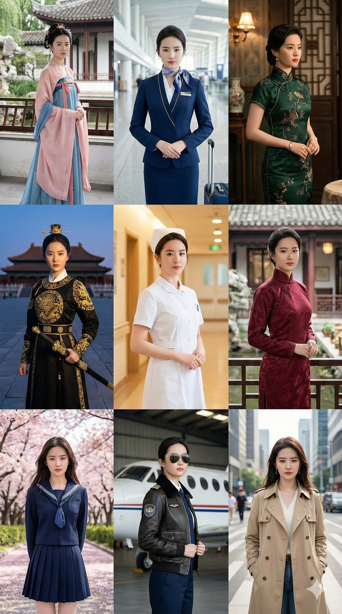
</div>

**中文提示词：**
```
基于[上传人物图片]并保持其面部特征绝对不变，生成一张高质量的3x3九宫格拼贴照片，九个独立画面分别展示该人物身着：飘逸粉蓝唐代汉服（古典园林背景）、干练深蓝空姐制服配丝巾（现代机场航站楼背景）、墨绿刺绣丝绸旗袍（复古上海风情室内背景）、威武黑金锦衣卫飞鱼服配绣春刀（黄昏故宫背景）、洁白现代护士服（明亮温馨医院背景）、典雅酒红织锦唐装（传统茶楼庭院背景）、青春海军蓝JK制服百褶裙（樱花盛开校园背景）、帅气皮革飞行员夹克制服戴墨镜（机库飞机旁背景）以及时尚米色风衣休闲装（现代都市街景背景），整体画面要求电影感光影、细节精致且色彩和谐统一。宽高比9:16
```

<a id="prompt-773"></a>
## 案例 773：Labubu的3x3九宫格拼贴照片 (来源 [@songguoxiansen](https://x.com/songguoxiansen/status/1997308950543491544)) 模型：Nano banana pro

<div style="display: flex; justify-content: space-between;">
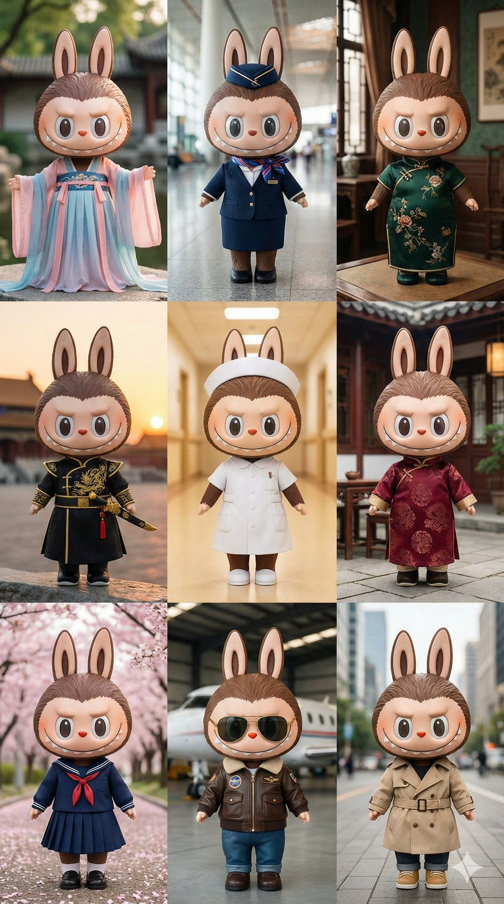
</div>

**中文提示词：**
```
生成Labubu的一张高质量的3x3九宫格拼贴照片，九个独立画面分别展示该人物身着：飘逸粉蓝唐代汉服（古典园林背景）、干练深蓝空姐制服配丝巾（现代机场航站楼背景）、墨绿刺绣丝绸旗袍（复古上海风情室内背景）、威武黑金锦衣卫飞鱼服配绣春刀（黄昏故宫背景）、洁白现代护士服（明亮温馨医院背景）、典雅酒红织锦唐装（传统茶楼庭院背景）、青春海军蓝JK制服百褶裙（樱花盛开校园背景）、帅气皮革飞行员夹克制服戴墨镜（机库飞机旁背景）以及时尚米色风衣休闲装（现代都市街景背景），整体画面要求电影感光影、细节精致且色彩和谐统一。宽高比9:16
```

<a id="prompt-772"></a>
## 案例 772：Y2K千禧辣妹复古像素风 (来源 [@songguoxiansen](https://x.com/songguoxiansen/status/1997661874532348085)) 模型：Nano banana pro

<div style="display: flex; justify-content: space-between;">
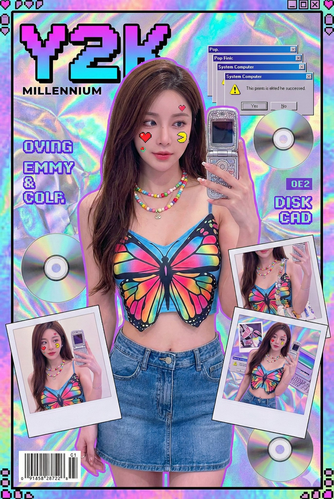
</div>

**中文提示词：**
```
保持人物面部特征和发型。Y2K千禧年复古时尚风格，竖版拼贴画。模特穿着鲜艳的短款上衣，戴着彩色串珠项链，手持一个带闪钻的复古翻盖手机自拍。脸上装饰着复古的像素风贴纸（如像素爱心、吃豆人）。背景是全息镭射材质的纹理，散落着CD光盘和旧电脑窗口弹窗的图案。周围有3-4个拍立得风格的照片框展示不同角度。高饱和度色彩，迷幻电子感，时尚杂志封面感。
```

<a id="prompt-771"></a>
## 案例 771：一幅俏皮时尚的肖像拼贴画 (来源 [@dotey](https://x.com/dotey/status/1997191891553534399)) 模型：Nano banana pro

<div style="display: flex; justify-content: space-between;">
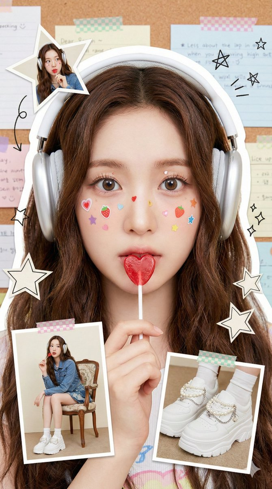
</div>

**提示词：**
```
Recreate the character's appearance from the uploaded photo, accurately preserving hairstyle, facial details, and expression. Present it as a bright, fresh, and youthful fashion portrait in a vertical collage format.

She wears trendy youthful clothing, holding a red lollipop near her lips. Her face is playfully decorated with cute colorful stickers shaped like hearts, strawberries, and stars, creating a lively, stylish atmosphere. Her eyes are expressive, makeup is soft and natural, and her face shows a dreamy expression.

The background features a corkboard covered with colorful sticky notes and memo papers, creating a campus and journaling vibe. Hand-drawn doodles of stars, arrows, and similar elements add to the cute, magazine-style aesthetic. Surrounding the main subject are ～4 scrapbook-style photo frames in various shapes, showcasing different outfits and poses of the same person.

Overall, the image should utilize soft studio lighting, high-definition details, a clean-cut scrapbook aesthetic, Korean fashion-magazine style, and vibrant colors.

Aspect ratio: 9:16.
```

**中文提示词：**
```
根据上传的照片，还原人物外貌，准确保留发型、面部细节和表情。以竖版拼贴画的形式，呈现一张明亮、清新、充满活力的时尚肖像。

她身着时髦青春的服饰，嘴边含着一根红色棒棒糖。脸上俏皮地贴满了可爱的彩色贴纸，形状有心形、草莓形和星星形，营造出活泼时尚的氛围。她眼神灵动，妆容淡雅自然，脸上流露出梦幻般的神情。

背景是一块贴满了彩色便签和备忘录的软木板，营造出校园和日记本的氛围。手绘的星星、箭头等元素更添可爱杂志风。主体周围环绕着约4个形状各异的相框，展示着同一个人不同造型和姿势的照片。

总体而言，图像应采用柔和的影棚灯光、高清细节、简洁的剪贴簿美学、韩国时尚杂志风格和鲜艳的色彩。

宽高比：9:16。
```

<a id="prompt-770"></a>
## 案例 770：带有插图贴纸叠加的逼真照片 (来源 [@ShreyaYadav___](https://x.com/ShreyaYadav___/status/1996908146452025628)) 模型：Nano banana pro

<div style="display: flex; justify-content: space-between;">
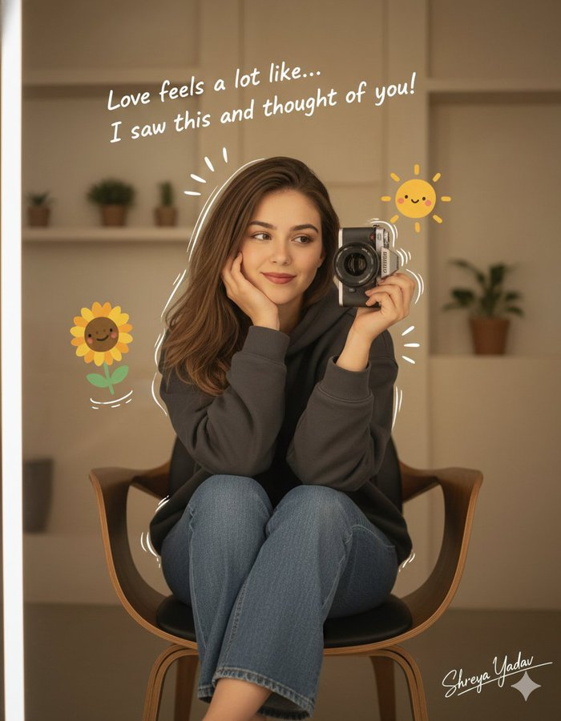
</div>

**提示词：**
```
{
  "description": "Aesthetic cozy mirror selfie of a young woman sitting casually on a chair, wearing a dark oversized hoodie and blue jeans. She holds a professional camera in one hand while resting her face gently on the other with a soft, dreamy smile. The background is warm beige with soft studio lighting and a minimal modern interior. Cute cartoon-style doodles float around her, including a smiling sunflower character, a hand-drawn yellow sun, and playful white sketch lines around the camera. A handwritten romantic quote appears on the wall: 'Love feels a lot like… I saw this and thought of you!'. The overall style mixes photorealism with illustrated sticker overlays, creating a cozy, romantic Instagram aesthetic.",
  "style": {
    "tones": "soft warm tones, cozy romantic vibe",
    "lighting": "soft studio lighting, warm and diffused",
    "aesthetic": "Instagram aesthetic with cinematic depth of field",
    "texture": "natural skin texture, ultra-detailed"
  },
  "visual_elements": {
    "subject": {
      "gender": "female",
      "pose": "sitting casually on a chair, taking a mirror selfie",
      "clothing": "dark oversized hoodie and blue jeans",
      "expression": "soft dreamy smile"
    },
    "environment": {
      "background": "warm beige indoor setting, minimal modern interior",
      "lighting": "soft warm shadows"
    },
    "overlays": [
      "cute smiling sunflower doodle",
      "hand-drawn yellow sun",
      "white sketch lines around the camera",
      "handwritten romantic quote on the wall"
    ]
  },
  "quality": {
    "resolution": "4K ultra-detailed",
    "render": "photorealistic with illustrated sticker overlay"
  },
  "format": {
    "ratio": "3:4"
  }
}
```

**中文提示词：**
```
{
描述：一位年轻女子随意地坐在椅子上，身穿深色宽松连帽衫和蓝色牛仔裤，对着镜子自拍，画面温馨舒适。她一手拿着专业相机，另一只手轻轻地托着脸，脸上带着柔和梦幻的微笑。背景是温暖的米色，柔和的影棚灯光和简约现代的室内装潢营造出温馨浪漫的氛围。可爱的卡通涂鸦环绕着她，包括一朵微笑的向日葵、一轮手绘的黄色太阳，以及相机周围俏皮的白色线条。墙上写着一句浪漫的手写情话：“爱的感觉就像……我看到这个就想到了你！”。整体风格融合了照片写实主义和插画贴纸，打造出温馨浪漫的Instagram美感。
“风格”： {
“色调”：“柔和温暖的色调，温馨浪漫的氛围”，
“灯光”：“柔和的影棚灯光，温暖而漫射”，
“美学”：“具有电影景深的 Instagram 美学”，
“纹理”：“自然肌肤纹理，超细腻”
},
"visual_elements": {
“主题”： {
"性别": "女性",
“姿势”：“随意地坐在椅子上，对着镜子自拍”，
“服装”：“深色超大号连帽衫和蓝色牛仔裤”，
“表情”：“柔和梦幻的微笑”
},
“环境”： {
“背景”：“温暖的米色室内环境，简约现代的室内设计”
“光线”：“柔和温暖的阴影”
},
“叠加层”：[
“可爱的微笑向日葵涂鸦”
“手绘黄色太阳”
“相机周围的白色草图线”，
墙上手写的浪漫语录
]
},
“质量”： {
"分辨率": "4K超细致",
“渲染”：“带有插图贴纸叠加的逼真照片”
},
“格式”： {
比例：3:4
}
}
```

<a id="prompt-769"></a>
## 案例 769：应用界面展示9种不同的滑稽效果 (来源 [@berryxia_ai](https://x.com/berryxia_ai/status/1996912935688618215)) 模型：Nano banana pro

<div style="display: flex; justify-content: space-between;">
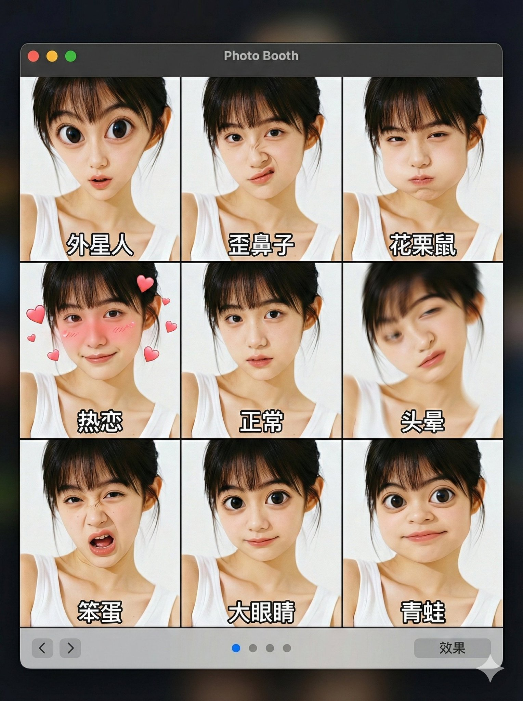
</div>

**提示词：**
```
A complete screenshot of the MacOS Photo Booth application interface, with the top title bar displaying "Photo Booth". The main window has a 9-grid layout, and each grid shows a user-uploaded person with different funny effects applied. At the bottom of each grid, there are white Chinese subtitles: First row: Alien, Crooked Nose, Chipmunk; Second row: Madly in Love, Normal, Dizzy; Third row: Fool, Big Eyes, Frog. At the bottom is a gray control bar with left and right arrows, four navigation dots (the first one is blue), and an "Effects" button. The background is dark and blurred.
```

**中文提示词：**
```
一个完整的MacOS Photo Booth应用程序界面截图，顶部标题栏显示 "Photo Booth"。主窗口是一个9宫格布局，每个格子都显示着用户上传的人物，但应用了不同的滑稽效果。每个格子的底部都有白色中文字幕：
第一排：外星人、歪鼻子、花栗鼠
第二排：热恋、正常、头晕
第三排：笨蛋、大眼睛、青蛙
底部是带有左右箭头、四个导航点（第一个蓝色）和 "效果" 按钮的灰色控制栏。背景是深色且模糊的。
```

<a id="prompt-768"></a>
## 案例 768：黑白素描手绘漫画 (来源 [@ShreyaYadav___](https://x.com/ShreyaYadav___/status/1996955607656812714)) 模型：Nano banana pro

<div style="display: flex; justify-content: space-between;">
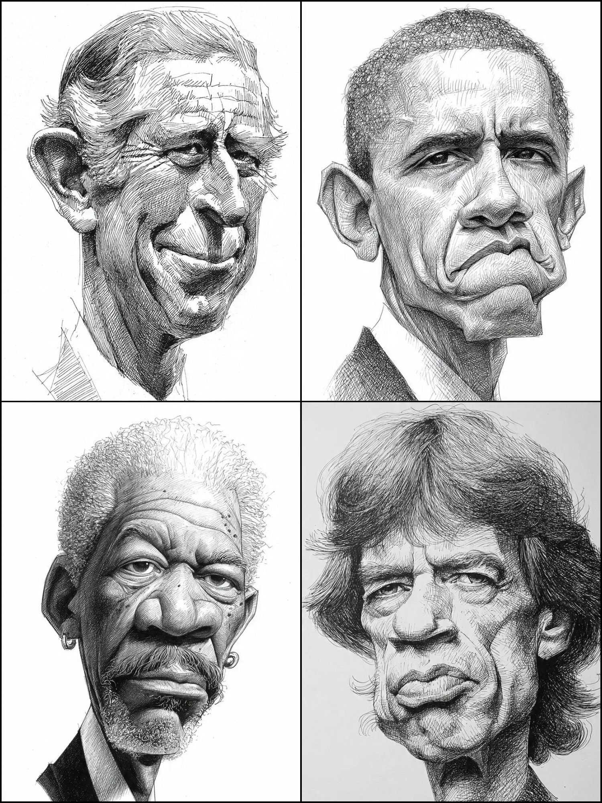
</div>

**提示词：**
```
{
  "style": {
    "type": "hand-drawn caricature",
    "technique": "cross-hatching, fine ink lines",
    "mood": "serious, slightly exaggerated expression",
    "medium": "black and white sketch"
  },
  "subject": {
    "type": "male figure",
    "age": "middle-aged",
    "skin_texture": "detailed line work with emphasized shading",
    "hair": {
      "style": "short, tightly curled",
      "texture": "dense linework"
    },
    "facial_features": {
      "eyes": "narrow, expressive, slightly squinting",
      "eyebrows": "furrowed, showing intensity",
      "nose": "long and defined with accentuated shading",
      "mouth": "exaggerated downward curve, caricatured pout",
      "ears": "large and prominently exaggerated",
      "jawline": "elongated and structured with sharp lines"
    }
  },
  "composition": {
    "pose": "straightforward headshot with slight tilt",
    "framing": "upper torso visible, suit collar included",
    "background": "clean white, no elements"
  },
  "clothing": {
    "attire": "formal suit",
    "details": "sharp collar lines with textured shading"
  },
  "notes": {
    "emphasis": "hyper-exaggeration of facial structure",
    "aesthetic": "editorial political-cartoon style"
  }
}
```

**中文提示词：**
```
{
“风格”： {
“类型”：“手绘漫画”，
“技法”：“交叉阴影线，细墨线”，
“情绪”：“严肃、略带夸张的表情”，
“媒介”: “黑白素描”
},
“主题”： {
"type": "男性形象",
“年龄”：“中年”
"skin_texture": "带有强调阴影的精细线条"
“头发”： {
“发型”：“短而紧密的卷发”，
“纹理”：“密集的线条”
},
"facial_features": {
“眼睛”：“狭长、有神、略微眯起”，
“眉毛”：“紧皱，表示紧张”，
“鼻子”：“修长且轮廓分明，阴影突出”，
“嘴巴”: “夸张的向下弯曲，漫画式的撅嘴”，
“耳朵”：“又大又夸张”，
“下颌线”：“修长且轮廓分明”
}
},
“作品”： {
“姿势”：“略微倾斜的正面头像照”，
“构图”：“上半身可见，包括西装领子”，
“背景”: “纯白色，无任何元素”
},
“衣服”： {
“着装”：“正装”，
“细节”：“带有纹理阴影的利落领线”
},
"备注": {
“强调”：“面部结构的过度夸张”，
“美学”：“社论政治漫画风格”
}
}
```

<a id="prompt-767"></a>
## 案例 767：照片与素描的完美融合 (来源 [@_MehdiSharifi_](https://x.com/_MehdiSharifi_/status/1996969905678143983)) 模型：Nano banana pro

<div style="display: flex; justify-content: space-between;">
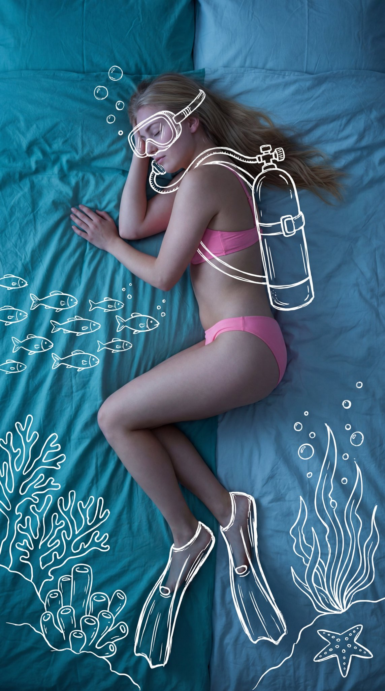
</div>

**提示词：**
```
{
  "image_request": {
    "goal": "Create a whimsical mixed-media masterpiece blending realistic top-down photography with playful white line-art doodles, depicting a sleeping woman dreaming of a deep-sea scuba adventure",
    "meta": {
      "image_type": "Mixed Media Photography / Creative Conceptual Art / Surreal Dreamscape",
      "quality": "8K, Ultra-HD, Masterpiece, High Fidelity, Creative Composite",
      "color_mode": "Cool Nocturnal Blues / Monochromatic Teal Palette with Stark White Lines",
      "style_mode": "cinematic_mixed_media",
      "aspect_ratio": "1:1",
      "resolution": "1440x1440px"
    },
    "creative_style": "Playful and surreal integration of hand-drawn illustration over realistic photography, evoking a sense of childhood wonder and vivid dreaming, combining the cozy texture of bedding with the adventurous spirit of an underwater doodle world",
    "overall_theme": "dreaming of adventure / underwater fantasy / mixed media art / playful imagination",
    "mood_vibe": "serene, whimsical, imaginative, peaceful, creative, cool, nocturnal",
    "style_keywords": [
      "mixed media",
      "doodle art overlay",
      "white line art",
      "top-down perspective",
      "flat lay",
      "surrealism",
      "scuba diving",
      "dream concept",
      "night photography"
    ],
    "subject": {
      "count": "1",
      "type": "female human",
      "identity": "fit young woman, Finnish ethnicity, long blonde hair, relaxed sleeping expression",
      "identity_preservation": {
        "description": "Natural sleeping posture, relaxed facial muscles, closed eyes",
        "notes": "Subject should look peacefully asleep, unaware of the doodles"
      },
      "age_appearance": "young adult / early 20s",
      "skin": "fair, natural texture, cool-toned lighting interaction",
      "clothing": {
        "top": "pink bikini top",
        "bottom": "pink bikini bottom",
        "full_description": "wearing a pink bikini",
        "accessories": "none (real), drawn accessories (scuba mask, tank, fins)"
      },
      "props": {
        "other": "white line drawings of scuba gear: diving mask over eyes, air tank on back, breathing regulator, large swim fins on feet"
      }
    },
    "pose_action": {
      "description": "Subject is sleeping on her side in a fetal-like position, legs slightly bent, hands curled near chest/face, perfectly positioned to align with the superimposed doodles",
      "overall_pose": "sleeping on side / side-lying",
      "head_turn": "profile resting on pillow",
      "body_position": "lying on side, diagonal composition across the bed",
      "hands": "relaxed, tucked near chin"
    },
    "environment": {
      "setting": "cozy bedroom bed viewed from above",
      "location": "indoor bedroom/dream world",
      "weather": "indoor controlled / imaginary underwater",
      "time_of_day": "night/sleep time",
      "atmosphere": "dreamy, quiet, submerged feeling due to color palette"
    },
    "background": {
      "color": "teal/aquamarine / cool blue sheets",
      "effect": "wrinkled fabric texture serving as the canvas for the white doodles"
    },
    "lighting": {
      "type": "soft ambient moonlight / cool overhead fill",
      "position": "overhead diffused",
      "direction": "soft top-down",
      "intensity": "moderate, creating soft dimensional shadows on the bedsheets",
      "tone": "cool blue/cyanotic/nocturnal",
      "mood": "peaceful night",
      "subject_lighting": "soft cool highlighting on skin",
      "imperfections": ["fabric wrinkles", "natural shadows"]
    },
    "camera": {
      "sensor_format": "Digital Mirrorless / High-Res",
      "lens": "35mm or 50mm standard",
      "position_angle": "Directly Top-Down / 90-degree Bird's Eye View",
      "framing": "Wide enough to show the full bed or a significant portion of the mattress to allow space for the doodles",
      "composition": {
        "framing": "subject centered or slightly diagonal",
        "depth": "flat field focus (everything sharp, including bedsheets)",
        "emphasis": "interaction between the real sleeping figure and the drawn environment"
      }
    },
    "photobooth_collage_specific": {
      "layout": "N/A - Single Composite Image",
      "tonality_texture": "Smooth photographic texture for the background/subject, rough chalk/marker texture for the doodles"
    },
    "color_grading": {
      "palette": "Dominant hues of teal, cyan, and navy blue; pure white for the illustration elements; natural skin tones shifted cool",
      "mood": "Cinematic night / underwater simulation"
    },
    "post_processing": {
      "final_touch": "Superimpose distinct, scribbly white line art: 'hand-drawn' fish, bubbles, coral, seaweed surrounding the subject, and diving gear 'worn' by the subject."
    },
    "negative": {
      "style": "3D render of doodles, realistic props (the gear should be drawn, not real), warm lighting, sunlight, orange tones, complex bedding patterns",
      "content": "waking subject, standing, real scuba gear, messy room (other than bed)"
    },
    "additional_controls": {
      "focus_emphasis": "The contrast between the realistic sleeping human and the 2D white line art",
      "special_notes": "The doodles must look like they were drawn on the photo surface or the bedsheets, white outline style only. The doodles include: a school of fish, coral reefs at the bottom, bubbles rising, a starfish, and the scuba gear outfit.
      "vibe": "playful creativity",
      "final_output_goal": "A seamless blend of photo and sketch that tells a story of a diver's dream."
    }
  }
}
```

**中文提示词：**
```
{
"image_request": {
“目标”：“创作一幅异想天开的混合媒介杰作，将写实的俯视摄影与俏皮的白色线条涂鸦相结合，描绘一位熟睡的女子梦见深海潜水探险的场景。”
"meta": {
"image_type": "混合媒体摄影/创意概念艺术/超现实梦境",
“质量”：“8K、超高清、杰作、高保真、创意复合”
"color_mode": "冷色调夜蓝色/单色青色调色板，配以醒目的白色线条",
"style_mode": "cinematic_mixed_media",
"aspect_ratio": "1:1",
分辨率：1440x1440像素
},
“创意风格”： “将手绘插图与写实摄影作品巧妙融合，营造出一种俏皮而超现实的氛围，唤起人们对童年奇幻和生动梦境的向往，将舒适的床上用品质感与水下涂鸦世界的冒险精神相结合。”
"overall_theme": "梦想冒险/水下奇幻/混合媒介艺术/充满童趣的想象",
"mood_vibe": "宁静、奇幻、充满想象力、平和、富有创造力、酷炫、夜行性"
"style_keywords": [
“混合媒介”，
“涂鸦艺术叠加层”，
“白色线条艺术”，
“自上而下的视角”，
“平铺”
“超现实主义”，
“水肺潜水”，
“梦想概念”，
“夜间摄影”
],
“主题”： {
"count": "1",
“类型”：“女性人类”，
“身份”：“身材匀称的年轻女性，芬兰裔，金色长发，睡姿放松”，
"identity_preservation": {
描述：自然的睡眠姿势，放松的面部肌肉，闭着眼睛。
备注：受试者应看起来像睡着了一样，对涂鸦毫不知情。
},
"age_appearance": "青年/20岁出头",
“皮肤”：“白皙、自然的纹理，冷色调的灯光互动”，
“衣服”： {
“上衣”： “粉色比基尼上衣”，
“下装”： “粉色比基尼下装”，
"full_description": "穿着粉色比基尼",
“配件”： “无（实物），手绘配件（潜水面罩、气瓶、脚蹼）”
},
"props": {
“其他”： “潜水装备的白色线条图：潜水面罩遮住眼睛，气瓶背在背上，呼吸调节器，脚上穿着大型脚蹼”
}
},
"pose_action": {
“描述”：“人物侧卧，呈胎儿状蜷缩着，双腿略微弯曲，双手蜷缩在胸前/脸旁，位置恰好与叠加的涂鸦对齐。”
"overall_pose": "侧卧/侧睡",
"head_turn": "侧脸靠在枕头上",
“身体姿势”: “侧卧，斜躺在床上”
“双手”：“放松，放在下巴附近”
},
“环境”： {
“场景”: “从上方看到的舒适卧室床”
“位置”：“室内卧室/梦境世界”，
“天气”：“室内可控/想象中的水下”，
"time_of_day": "夜晚/睡眠时间",
“氛围”：“由于色彩搭配而产生的梦幻、宁静、沉浸感”
},
“背景”： {
“颜色”： “蓝绿色/海蓝色/冷蓝色床单”，
“效果”：“褶皱的织物纹理作为白色涂鸦的画布”
},
“灯光”： {
“类型”: “柔和的环境月光/冷色调的顶光填充”
“位置”：“上方扩散”，
“方向”：“柔和的自上而下”，
“强度”：“中等，在床单上营造出柔和的立体阴影”，
"色调": "冷蓝色/蓝绿色/夜行性",
“心情”：“宁静的夜晚”，
“subject_lighting”: “柔和的冷色调高光，用于皮肤”，
“瑕疵”：[“织物褶皱”、“自然阴影”]
},
“相机”： {
"sensor_format": "数码无反/高分辨率",
“镜头”：“35mm 或 50mm 标准”，
"position_angle": "直接俯视/90度鸟瞰图",
“框架”：“足够宽，可以显示整张床或床垫的大部分，以便留出涂鸦的空间”，
“作品”： {
“构图”：“主体居中或略微倾斜”，
“景深”：“平场对焦（所有物体都清晰，包括床单）”，
“强调”：“真实睡眠人物与绘制环境之间的互动”
}
},
"photobooth_collage_specific": {
"布局": "不适用 - 单张合成图像",
"tonality_texture": "背景/主体使用平滑的摄影纹理，涂鸦部分使用粗糙的粉笔/马克笔纹理"
},
"color_grading": {
“调色板”：“以青色、蓝绿色和海军蓝为主色调；插图元素采用纯白色；自然肤色偏冷色调”，
“氛围”: “电影般的夜晚/水下模拟”
},
"post_processing": {
“final_touch”： “叠加清晰的、潦草的白色线条艺术：‘手绘’的鱼、气泡、珊瑚、围绕主体的海藻，以及主体‘穿戴’的潜水装备。”
},
“消极的”： {
“风格”：“涂鸦的3D渲染，逼真的道具（装备应该是画出来的，而不是真的），暖色调的光线，阳光，橙色调，复杂的床品图案”，
“内容”：“清醒的主体，站立，真正的潜水装备，凌乱的房间（床除外）”
},
"additional_controls": {
"focus_emphasis": "逼真的睡眠人物与二维白色线条艺术之间的对比",
特殊说明：涂鸦必须看起来像是画在照片表面或床单上的，只能使用白色轮廓线。涂鸦内容包括：一群鱼、底部的珊瑚礁、上升的气泡、海星和潜水装备。
氛围：充满趣味的创造力，
"final_output_goal": "照片与素描的完美融合，讲述潜水员的梦想故事。"
}
}
}
```

<a id="prompt-766"></a>
## 案例 766：制作一张隐藏单词的照片 (来源 [@fofrAI](https://x.com/fofrAI/status/1996612750915809419)) 模型：Nano banana pro

<div style="display: flex; justify-content: space-between;">
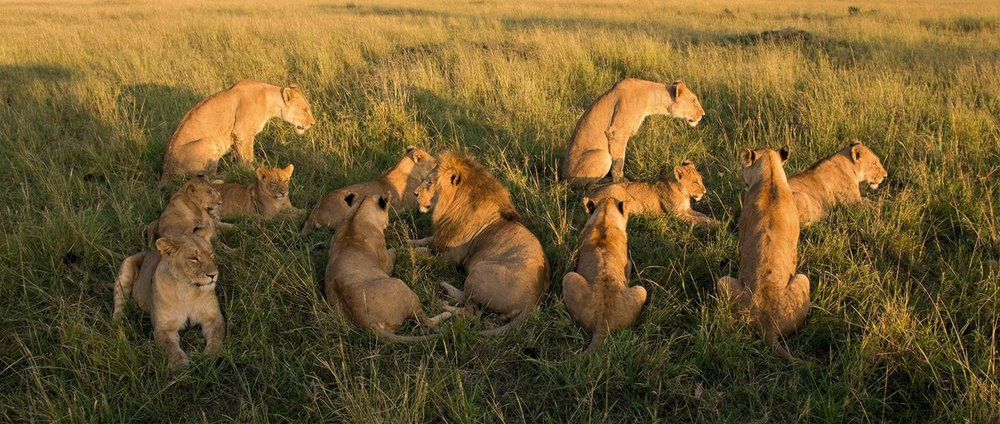
</div>

**提示词：**
```
make a photo with a hidden word embedded into it, make the word hard to see until you spot it, then you can't unsee it. use the word "fofr". form the word out of a pride of lions
```

**中文提示词：**
```
制作一张隐藏单词的照片，让这个单词很难被发现，直到你找到它，然后你就无法忽略它了。使用单词“fofr”。用一群狮子组成这个词。
```

<a id="prompt-765"></a>
## 案例 765：一张高质量的可爱少女肖像照 (来源 [@SimplyAnnisa](https://x.com/SimplyAnnisa/status/1996866976980127932)) 模型：Nano banana pro

<div style="display: flex; justify-content: space-between;">
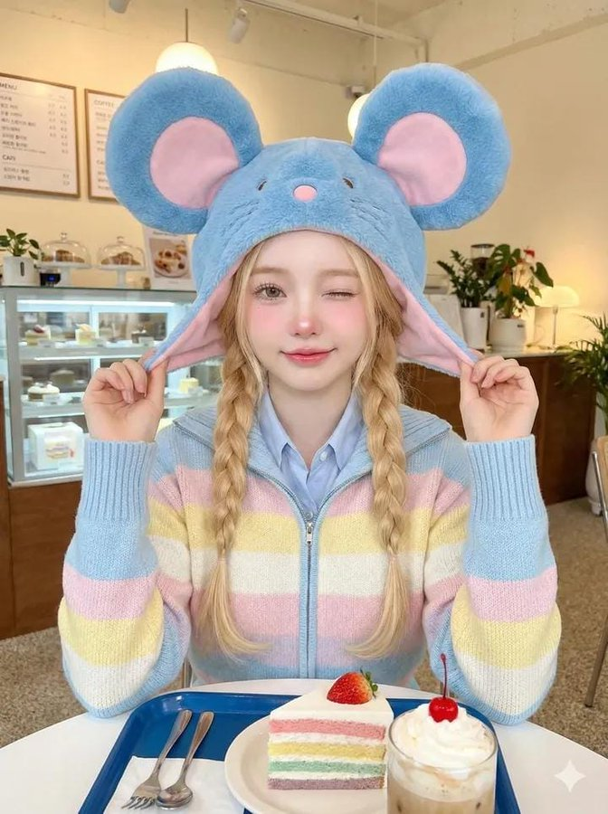
</div>

**提示词：**
```
High-quality cute portrait photo of a young girl sitting in a cozy café, captured in a bright soft-flash lighting style.
Main subject (girl):
• Cute youthful face, fair flawless skin
• Soft glam natural makeup with pink blush
• One eye winking playfully, small smile
• Two neat black braided pigtails
• Wearing an oversized blue plush mouse hat with huge round ears, pink ear lining, and a tiny pink nose
• Holding both sides of the hat with her hands lifted up

Outfit:
• Pastel striped knit zip-up cardigan
• Colors: baby blue, soft yellow, pale pink, white stripes
• Light blue collar visible under the cardigan
• Cozy, soft texture, slightly oversized sleeves

Pose:
• Sitting front-facing
• Playful expression, slight head tilt
• Both hands pulling the long sides of the mouse hat outward

Café background:
• Minimalist bright café interior
• Glass display case with pastries
• Menu board on the wall (blurred)
• Plants adding cozy vibes
• Warm ambient lighting with clean white tones
• Slight depth-of-field blur

Table elements:
• Blue tray in front of her
• Small slice of layered pastel cake (pink + white + blue) with strawberry on top
• Glass of drink with whipped topping and a cherry inside
• Fork and spoon next to the plate

Lighting & Camera:
• Soft flash photography with bright highlights
• Slight overexposed glow on skin for cute aesthetic
• 3:4 vertical composition
• Clean, crisp texture with pastel tones dominant
• No harsh shadows
• Kawaii café snapshot vibe

Aesthetic:
Cute pastel, cozy café girl, playful expression, soft flash, colorful and happy atmosphere.
```

**中文提示词：**
```
一张高质量的可爱少女肖像照，拍摄对象是一位坐在舒适咖啡馆里的年轻女孩，采用明亮柔和的闪光灯照明风格。

主要对象（女孩）：
• 可爱的青春面容，白皙无瑕的肌肤
• 柔和自然的妆容，搭配粉色腮红
• 一只眼睛俏皮地眨了眨，露出淡淡的微笑
• 两条整齐的黑色麻花辫
• 戴着一顶超大的蓝色毛绒老鼠帽，帽子有巨大的圆耳朵、粉色的耳廓和小小的粉色鼻子。
• 她双手高举，双手抓住帽子的两侧

全套服装：
• 粉彩条纹针织拉链开衫
颜色：浅蓝色、淡黄色、浅粉色、白色条纹
• 开衫下露出浅蓝色衣领
• 舒适柔软的质地，略微宽松的袖子

姿势：
• 面向前方就坐
• 表情顽皮，头部微微倾斜
双手将老鼠帽的长边向外拉。

咖啡馆背景：
• 简约明亮的咖啡馆内部装潢
• 玻璃展示柜里摆放着糕点
• 墙上的菜单板（模糊处理）
• 植物增添温馨氛围
• 温暖的氛围灯光，以干净的白色调为主
• 轻微的景深模糊

表格元素：
她面前的蓝色托盘
• 一小块多层粉彩蛋糕（粉色+白色+蓝色），上面放着草莓
• 一杯顶部有鲜奶油和一颗樱桃的饮料
• 餐盘旁放着叉子和勺子。

灯光和摄像机：
• 柔和的闪光灯摄影，高光部分明亮
• 肌肤略微泛光，营造可爱美感
• 3:4 竖幅构图
• 质地干净清爽，以柔和的粉彩色调为主
• 没有刺眼的阴影
• 可爱咖啡馆快照氛围

审美的：
可爱的粉彩色调，温馨的咖啡馆女孩，俏皮的表情，柔和的闪光灯，缤纷快乐的氛围。
```

<a id="prompt-764"></a>
## 案例 764：橱窗里出现了一个小小的动画版的自己 (来源 [@xmiiru_](https://x.com/xmiiru_/status/1997182817235583293)) 模型：Nano banana pro

<div style="display: flex; justify-content: space-between;">
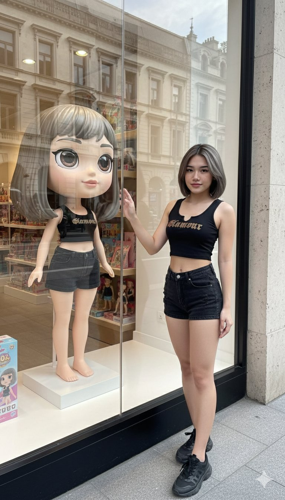
</div>

**提示词：**
```
{
  "PROMPT": "Create a bright, high-end street-fashion photograph of the woman from the reference image, keeping her face, hair, body & outfit exactly the same. She stands outside a luxury toy-shop window, gently touching the glass. Inside the window display, place a full-height cartoon-style doll designed to resemble her—same features, hair, and outfit—transformed into a cute, big-eyed, stylized animated character. Crisp lighting, premium street-fashion look, realistic reflections, face unchanged.",
  "settings": {
    "style": "high-end street fashion",
    "lighting": "crisp and bright",
    "environment": "outside luxury toy-shop window",
    "subject": "woman from reference image",
    "focus": ["face", "hair", "body", "outfit"],
    "additional_elements": [
      {
        "type": "doll",
        "style": "cartoon-style, big-eyed, stylized",
        "location": "inside window display",
        "resemblance": "exact features, hair, outfit of woman"
      }
    ],
    "reflections": "realistic",
    "photorealism": true
  }
}
```

**中文提示词：**
```
{
提示：根据参考图片，拍摄一张明亮、高端的街头时尚照片，保持照片中女性的脸部、发型、身材和服装完全一致。她站在一家高档玩具店的橱窗外，轻轻抚摸着玻璃。橱窗内，摆放一个与她外形相似的卡通人偶——五官、发型和服装都与她相同——人偶被设计成一个可爱、大眼睛、风格化的动画角色。光线要明亮，营造高端街头时尚感，要有逼真的反光效果，脸部保持不变。
“设置”： {
“风格”：“高端街头时尚”，
“照明”：“清晰明亮”，
“环境”：“豪华玩具店橱窗外”，
“主题”：“参考图像中的女人”，
焦点：[“脸”、“头发”、“身体”、“服装”]
"additional_elements": [
{
"类型": "娃娃",
“风格”：“卡通风格，大眼睛​​，风格化”，
“位置”：“橱窗内展示”，
“相似之处”： “女性的五官、发型、服饰”
}
],
“反思”：“现实的”，
“照片写实主义”：真
}
}
```

<a id="prompt-763"></a>
## 案例 763：维多利亚时代外科医生的医疗箱摊开 (来源 [@BeanieBlossom](https://x.com/BeanieBlossom/status/1996868169546579972)) 模型：Nano banana pro

<div style="display: flex; justify-content: space-between;">
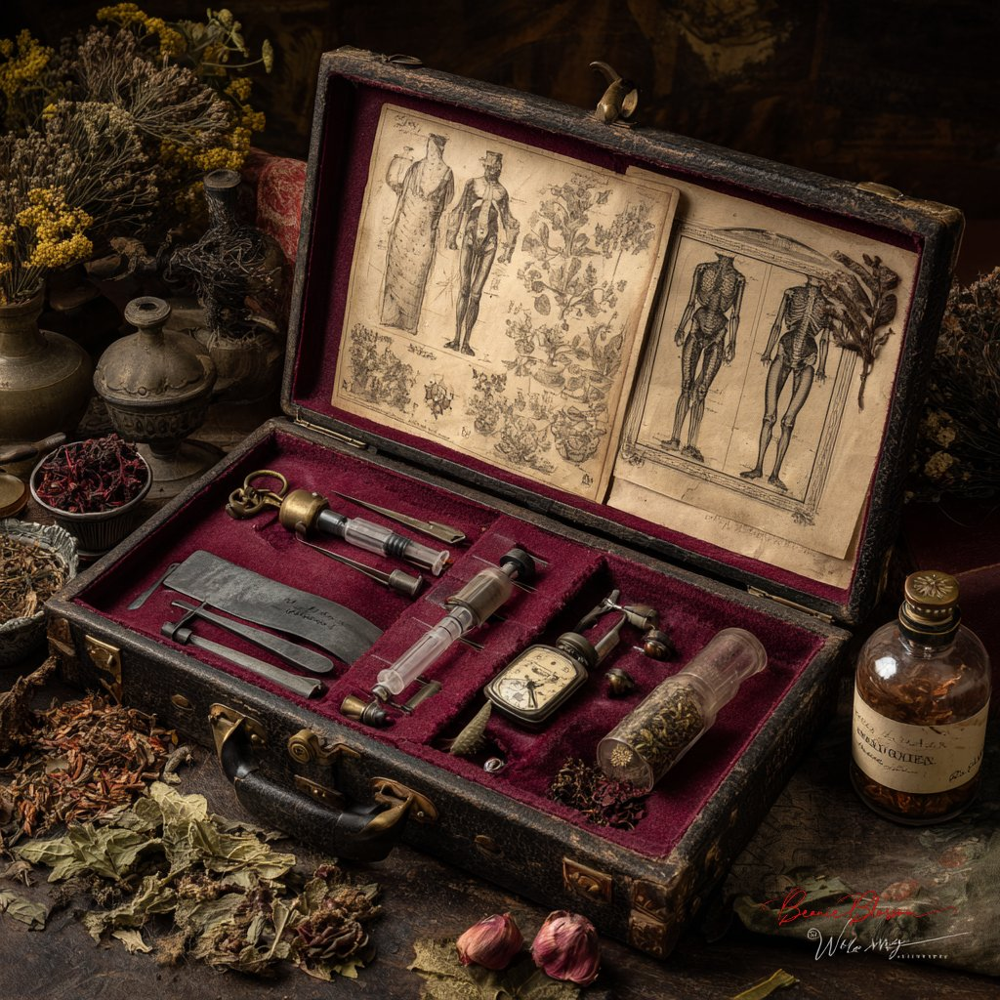
</div>

**提示词：**
```
A Victorian surgeon's medical kit laid open on aged leather, featuring antique bone saws, glass syringes with brass fittings, faded anatomical sketches, and a pocket watch, arranged on burgundy velvet with dried medicinal herbs scattered around, painted in classical Dutch Golden Age still life style with rich shadows and meticulous detail
```

**中文提示词：**
```
一套维多利亚时代外科医生的医疗箱摊开在陈旧的皮革上，里面摆放着古董骨锯、带有黄铜配件的玻璃注射器、褪色的解剖图和一块怀表，它们被放置在酒红色天鹅绒上，周围散落着干草药。这幅画以古典荷兰黄金时代静物画的风格绘制，光影丰富，细节刻画入微。
```

<a id="prompt-762"></a>
## 案例 762：工藤新一和毛利兰 (来源 [@servasyy](https://x.com/servasyy/status/1996966434191344109)) 模型：Nano banana pro

<div style="display: flex; justify-content: space-between;">
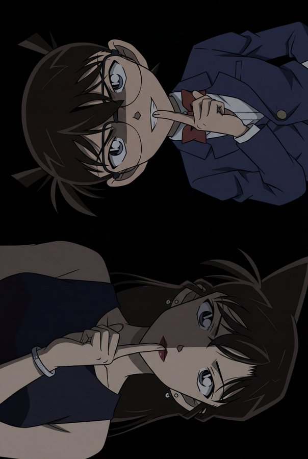
</div>

**提示词：**
```
(masterpiece, best quality, highres:1.4), (official anime art source:1.3), (anime screencap style:1.3),
(portrait dimensions:1.5), (tall aspect ratio:1.5),
(vertical dual portrait:1.3), (continuous composition:1.2), (unified image:1.2), pure black background,

(extremely dramatic chiaroscuro lighting:1.6), (heavy deep shadows:1.5), (sharp shadow edges:1.3), (low key lighting:1.5), (characters blending into darkness:1.4), minimal lighting, mysterious atmosphere, dark tones, (warm skin tones:1.3), (healthy complexion:1.2), (natural skin color:1.2),

BREAK

(bust shot, tight focus:1.3), 1boy, kudo shinichi, male focus,

(lying flat on back:1.5), (perfectly horizontal body alignment:1.5), parallel to frame edge, head on left,

(index finger on lips:1.3), shushing gesture,
(closed mouth:1.3), (slight mysterious smirk:1.2), intense cold stare, (eyes shaded by hair:1.4),
dark hair, (face half obscured by deep sharp shadow:1.4), (warm skin tone:1.2),

wearing dark black suit jacket, dark tie, (clothes merging with shadow), absolutely no rim lighting,

BREAK

(bust shot, tight focus:1.3), 1girl, mouri ran, female focus,
(lying flat on back:1.5), (inverted:1.4), upside down, (perfectly horizontal body alignment:1.5), parallel to frame edge, head on right,
(index finger on lips:1.3), shushing gesture, (silver bracelet on left wrist:1.3),
(serious cold expression:1.5), (calm steady look:1.3), (both eyes open sharp stare:1.4), (subtle blush:0.8), dark red lips, (warm skin tone:1.2),
dark long hair flowing into darkness, earrings,
wearing dark dress, (body and face hidden in deep sharp shadow:1.4), absolutely no rim lighting
```

**中文提示词：**
```
（杰作，最佳品质，高分辨率：1.4），（官方动画艺术来源：1.3），（动画截图风格：1.3）
（竖屏尺寸：1.5），（竖屏宽高比：1.5），
（竖幅双人像：1.3），（连续构图：1.2），（统一图像：1.2），纯黑色背景，

（极强明暗对比：1.6），（浓重的阴影：1.5），（清晰的阴影边缘：1.3），（低调的光线：1.5），（人物融入黑暗：1.4），极简的光线，神秘的氛围，暗色调，（温暖的肤色：1.3），（健康的肤色：1.2），（自然的肤色：1.2）

休息

（半身像，特写：1.3），1个男孩，工藤新一，男性焦点，

（平躺：1.5），（身体完全水平：1.5），与框架边缘平行，头部在左侧，

（食指放在嘴唇上：1.3），嘘的手势
（闭嘴：1.3），（略带神秘的冷笑：1.2），目光冰冷，（头发遮住眼睛：1.4），
深色头发，（脸部一半被深邃的阴影遮挡：1.4），（暖色调肤色：1.2），

身穿黑色西装外套，系着深色领带（衣服与阴影融为一体），完全没有轮廓光。

休息

（半身特写，近景：1.3），1个女孩，毛利兰，女性焦点，
（平躺：1.5），（倒立：1.4），上下颠倒，（身体完全水平：1.5），与画面边缘平行，头部朝右，
（食指放在嘴唇上：1.3），嘘的手势，（左手腕上的银手镯：1.3），
（严肃冷漠的表情：1.5），（冷静沉稳的眼神：1.3），（双眼睁开，目光锐利：1.4），（淡淡的红晕:0 。 8) ，深红色的嘴唇，（暖色调的​​肤色：1.2），
乌黑的长发垂入夜色，戴着耳环。
身着深色连衣裙（身体和脸部隐藏在深邃的阴影中：1.4），完全没有轮廓光
```

<a id="prompt-761"></a>
## 案例 761：一个近视人的视角 (来源 [@umesh_ai](https://x.com/umesh_ai/status/1997177277327856085)) 模型：Nano banana pro

<div style="display: flex; justify-content: space-between;">
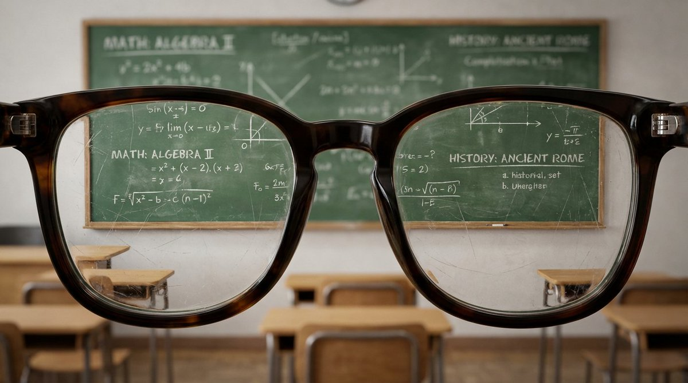
</div>

**提示词：**
```
ultra hugging close-up view of with edges of glasses with the lenses almost touching the viewer's perspective, filling most of the view. The glasses reveal a detailed [VIEW] within the lenses, showcasing [VIEW] .The background is out of focus , enhancing the impression that the viewer is peering into the [VIEW]
```

**中文提示词：**
```
超近距离特写，眼镜边缘几乎贴近观看者的视线，占据了大部分视野。眼镜镜片内呈现出清晰的[VIEW]，展现了[VIEW]。背景虚化，增强了观看者仿佛正在凝视[VIEW]的印象。
```

<a id="prompt-760"></a>
## 案例 760：一位年轻的日本美女模特 (来源 [@Ankit_patel211](https://x.com/Ankit_patel211/status/1997225726421151899)) 模型：Grok

<div style="display: flex; justify-content: space-between;">
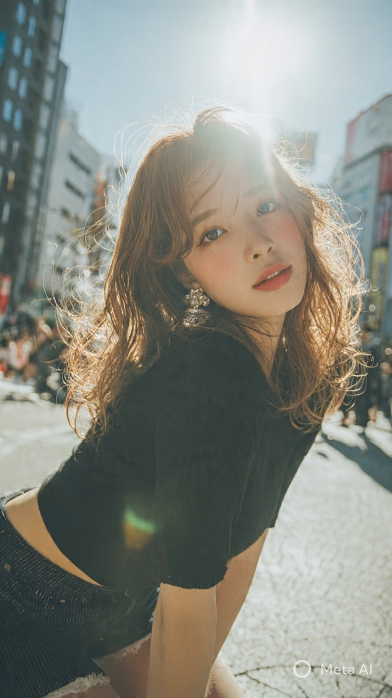
</div>

**提示词：**
```
Prompt - A young Japanese beauty model glamour hot in a stylish black streped jeans with shorts chiaroscuro black outfit outdoors short jeans , three-quarter portrait (from lower legs upward), elegant body framing and balanced proportions.

Long wavy light browny hair with airy texture 
Soft K-beauty makeup: peach-pink eyeshadow with subtle shimmer, long curled lashes, delicate eyeliner, warm hazel circle lenses giving a doll-like enlargement, rosy blush, rose-pink gradient velvet matte lips.

Outfit: black  short jeans and skirt 
Accessories: dangling earrings.
Pose: slightly leaning forward, engaging gaze, feminine charm.

Environment: tokyo city building scene natural light 

Photography style: high-end outdoor fashion portrait, soft bright sunlight, cinematic soft glow, shallow depth of field, crisp skin rendering, airy color grading, mild film grain.
Atmosphere: lively, warm, romantic, playful festival vibe.
```

**中文提示词：**
```
提示 - 一位年轻的日本美女模特，身穿时尚的黑色条纹牛仔裤和短裤，光影对比鲜明，在户外穿着黑色短裤，四分之三侧面像（从小腿向上），优雅的身材轮廓和均衡的比例。

长长的浅棕色波浪卷发，质地蓬松。
柔和的韩式妆容：蜜桃粉色眼影带有微妙的珠光，纤长卷翘的睫毛，精致的眼线，暖棕色美瞳营造出洋娃娃般的放大效果，玫瑰色腮红，玫瑰粉渐变丝绒哑光唇妆。

穿搭：黑色短牛仔裤和裙子
配饰：垂坠耳环。
姿势：身体微微前倾，眼神迷人，充满女性魅力。

环境：东京城市建筑场景，自然光

摄影风格：高端户外时尚人像，柔和明亮的阳光，电影般的柔光，浅景深，清晰的皮肤渲染，清新的色彩分级，轻微的胶片颗粒感。
氛围：热闹、温馨、浪漫、轻松的节日氛围。
```

<a id="prompt-759"></a>
## 案例 759：杂志编辑风格制作专业的OOTD时尚拼贴 (来源 [@qisi_ai](https://x.com/qisi_ai/status/1997139694170337387)) 模型：Nano banana pro

<div style="display: flex; justify-content: space-between;">
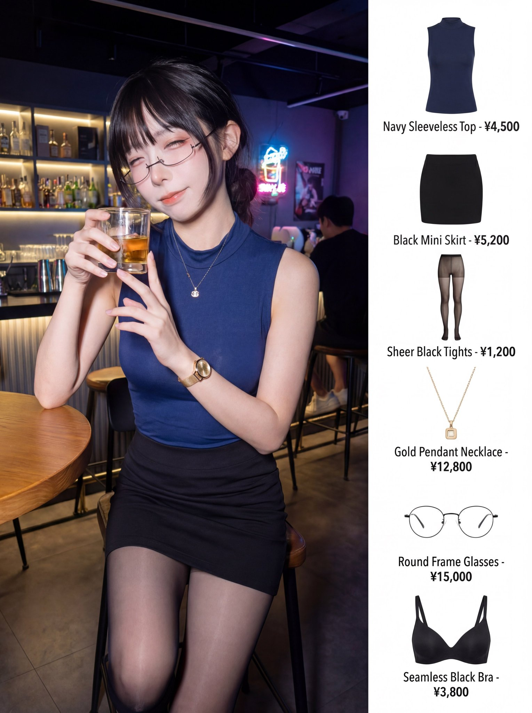
</div>

**中文提示词：**
```
角色与任务 :
请以杂志编辑风格制作专业的 OOTD（今日的搭配）时尚拼贴。
设计需在左侧和右侧反映以下内容。

左侧：
・完全保留上传图片的面部、发型、服装。
・可爱、有趣且搞怪的姿势，真实的氛围感。
・干净明亮，杂志品质的照片。
・宽度占整体的60%。

右侧：
・在干净的白色背景上整理好的商品网格
・[数量]个独立商品模块垂直排列
・最后的商品是配置了根据图像推测的内衣（胸罩、T 恤等）。
・各模块包含的内容：
商品照片（白色背景裁剪、电子商务风格）
商品名称
价格
・宽度占整体的40%。

展示商品示例：
1.[商品1] - ¥[价格]
2.[商品2] - ¥[价格]
3.[商品3] - ¥[价格]
4.[商品4] - ¥[价格]
5.[商品5] - ¥[价格]
6.[商品6] - ¥[价格]

排版：
・现代的无衬线体（简洁、极简）
・商品名使用中等粗细
・价格加粗

整体风格：
・明亮、清爽、专业
・像 Instagram 时尚博主
・简洁且留有空间的布局
・调色板：自然色、白色、柔和的灰色
・专业商品照片质量
```

<a id="prompt-758"></a>
## 案例 758：女子仰卧右臂向上伸展自拍 (来源 [@ShreyaYadav___](https://x.com/ShreyaYadav___/status/1996991478313455783)) 模型：Nano banana pro

<div style="display: flex; justify-content: space-between;">
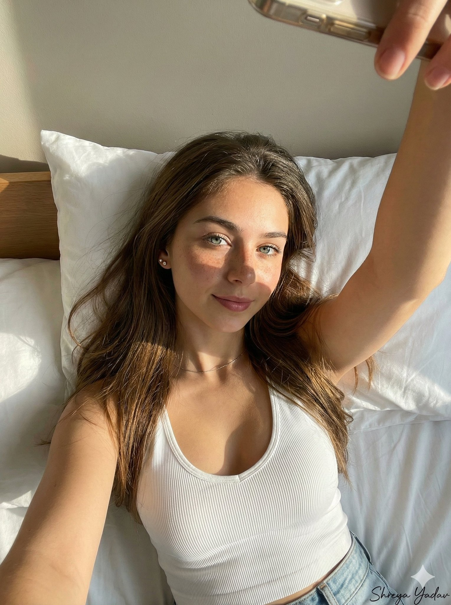
</div>

**提示词：**
```
{
  "subject": {
    "type": "young woman",
    "pose": "lying on her back, taking a selfie with her right arm extended upward",
    "expression": "soft smile, relaxed and natural",
    "gaze": "looking toward the camera",
    "skin_details": {
      "complexion": "smooth, warm, sunlit glow",
      "freckles": "visible on nose and cheeks"
    },
    "hair": {
      "color": "medium brown",
      "length": "long",
      "style": "loose, spread out on the pillow around her head"
    },
    "eyes": {
      "color": "light blue or green",
      "makeup": "subtle eyeliner"
    }
  },
  "clothing": {
    "top": {
      "type": "ribbed tank top",
      "color": "white",
      "fit": "form-fitting",
      "neckline": "scoop neck"
    },
    "bottoms": {
      "type": "jeans",
      "color": "light blue",
      "visibility": "partially visible"
    },
    "accessories": {
      "earrings": "small studs",
      "necklace": "thin, minimal chain"
    }
  },
  "environment": {
    "location": "bed or soft resting surface",
    "bedding": {
      "pillow": "white",
      "sheets": "white"
    },
    "background": "neutral wall and edge of headboard or furniture barely visible"
  },
  "lighting": {
    "type": "natural sunlight",
    "direction": "coming from upper left of frame",
    "effect": "creates warm highlights and soft shadows on face and torso"
  },
  "composition": {
    "camera_angle": "top-down selfie angle",
    "framing": "close-up of face, upper torso, and part of jeans",
    "focus": "sharp on face and upper body",
    "colors": "warm skin tones, white bedding, brown hair, neutral background"
  },
  "mood": "warm, relaxed, comfortable, natural"
}
```

**中文提示词：**
```
{
“主题”： {
“类型”: “年轻女子”
“姿势”：“仰卧，右臂向上伸展，自拍”
“表情”：“柔和的微笑，轻松自然”，
“凝视”: “看着镜头”，
"skin_details": {
“肤色”：“光滑、温暖、阳光般的光泽”，
“雀斑”：“鼻子和脸颊上可见的雀斑”
},
“头发”： {
“颜色”：“中棕色”，
"length": "长",
“风格”：“宽松地，散落在枕头上，围绕着她的头部”
},
"眼睛": {
“颜色”: “浅蓝色或绿色”
妆容：淡淡的眼线
}
},
“衣服”： {
“顶部”： {
类型：罗纹背心，
颜色：白色，
“合身”： “贴合身形”，
领口：圆领
},
"底部": {
类型：牛仔裤，
“颜色”： “浅蓝色”，
“可见性”： “部分可见”
},
“配件”： {
“耳环”: “小耳钉”
项链：纤细简约的链条
}
},
“环境”： {
“位置”：“床或柔软的休息表面”，
"床上用品": {
“枕头”： “白色”，
“床单”： “白色”
},
“背景”：“中性色调的墙壁和床头板或家具边缘几乎看不见”
},
“灯光”： {
类型：自然阳光，
“方向”：“来自画面左上方”，
“效果”：“在脸部和躯干上营造出温暖的高光和柔和的阴影”
},
“作品”： {
"camera_angle": "俯拍自拍角度",
“构图”：“脸部、上半身和部分牛仔裤的特写”，
“焦点”: “清晰地聚焦在脸部和上半身”，
“色彩”：“暖色调肤色、白色床品、棕色头发、中性背景”
},
氛围：温暖、放松、舒适、自然
}
```

<a id="prompt-757"></a>
## 案例 757：女子手持吸塑包装靠近镜头 (来源 [@kaanakz](https://x.com/kaanakz/status/1997061904125083696)) 模型：Nano banana pro

<div style="display: flex; justify-content: space-between;">
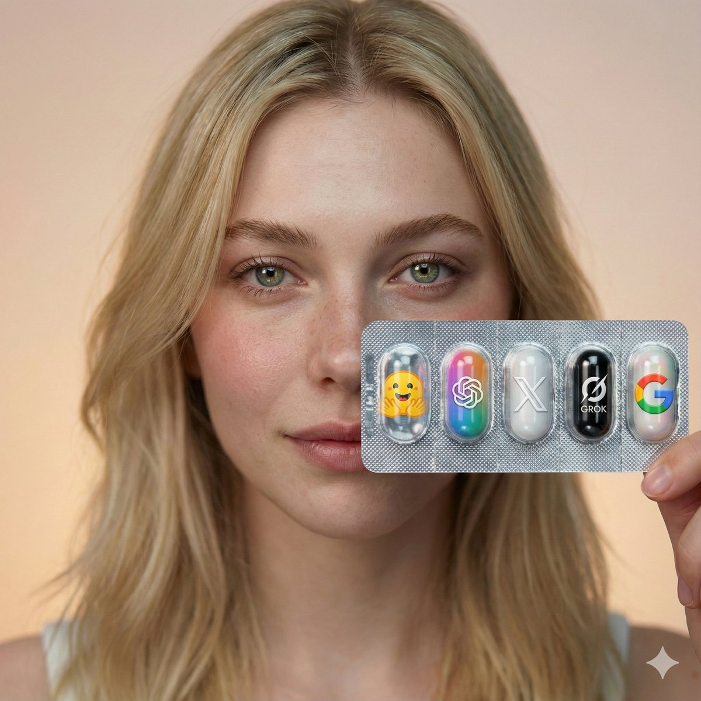
</div>

**提示词：**
```
{
  "scene": {
    "setting": "studio_cinematic_advertising_shoot",
    "environment": {
      "background": "soft_gradient_cinematic_backdrop",
      "lighting": "high_end_beauty_lighting_soft_yet_high_contrast",
      "mood": "premium_modern_tech_advertisement"
    }
  },
  "subject": {
    "type": "female",
    "identity": "reference_photo_model",
    "appearance": {    
      "face": "charming_symmetric_expressive",
      "expression": "gentle_smile_intriguing_gaze",
      "render_style": "ultra_photorealistic_close_up"
    },
    "pose": "holding_blister_pack_close_to_camera",
    "focus": "sharp_on_face_and_blister_pack"
  },
  "object": {
    "type": "blister_pack",
    "representation": "macro_photorealistic",
    "materials": {
      "plastic": "shiny_transparent_high_gloss",
      "foil": "silver_reflective_with_microtexture"
    },
    "details": {
      "content_replaced": true,
      "cells": [
        { "slot_content": "Huggingface_logo" },
        { "slot_content": "OpenAI_logo" },
        { "slot_content": "X_logo" },
        { "slot_content": "Grok Logo" },
        { "slot_content": "Google_logo" }
      ],
      "logo_style": "embossed_colorful_brand_icons_as_pills",
      "finish": "premium_glossy_high_detail"
    }
  },
  "composition": {
    "camera": {
      "angle": "close_up_portrait_with_macro_focus",
      "lens": "85mm_beauty_lens",
      "depth_of_field": "shallow_do_f_highlight_face_and_blister",
      "framing": "cinematic_product_beauty_split_focus"
    },
    "art_direction": {
      "style": "luxury_tech_advertisement",
      "color_palette": "warm_skin_tones_with_colorful_brand_icons",
      "highlight_accent": "glowing_reflections_on_plastic_and_eyes"
    }
  },
  "render_style": {
    "look": "hyper_photorealistic_cinematic",
    "textures": "extreme_skin_detail_freckles_hair_strands_plastic_gloss",
    "lighting_effects": [
      "beauty_glow_on_skin",
      "soft_specular_highlights",
      "cinematic_reflections"
    ]
  },
  "post_processing": {
    "color_grade": "premium_filmic_ad_grade",
    "contrast": "high_but_balanced",
    "saturation": "rich_but_refined",
    "clarity": "maximum",
    "aspect_ratio": "2.39:1_cinematic"
  }
}
```

**中文提示词：**
```
{
“场景”： {
"设置": "studio_cinematic_advertising_shoot",
“环境”： {
“背景”： “柔和渐变电影背景”
"lighting": "high_end_beauty_lighting_soft_yet_high_contrast",
"mood": "premium_modern_tech_advertisement"
}
},
“主题”： {
“类型”: “女性”
"identity": "reference_photo_model",
“外貌”： {
"脸："迷人_对称_富有表现力",
"表情": "温柔的微笑，迷人的凝视",
"render_style": "ultra_photorealistic_close_up"
},
"姿势": "手持吸塑包装靠近镜头",
"focus": "sharp_on_face_and_blister_pack"
},
“目的”： {
"type": "blister_pack",
"representation": "macro_photorealistic",
“材料”： {
"塑料": "亮面透明高光泽",
"箔" "带微纹理的银色反光箔"
},
“细节”： {
"content_replaced": true,
“细胞”：[
{ "slot_content": "Huggingface_logo" },
{ "slot_content": "OpenAI_logo" },
{ "slot_content": "X_logo" },
{ "slot_content": "Grok Logo" },
{ "slot_content": "Google_logo" }
],
"logo_style": "embossed_colorful_brand_icons_as_pills",
"finish": "premium_glossy_high_detail"
}
},
“作品”： {
“相机”： {
"角度": "带有微距对焦的特写肖像",
"lens": "85mm_beauty_lens",
"景深": "浅do_ f_highlight_face_and_blister",
"构图": "cinematic_product_beauty_split_focus"
},
“艺术指导”：{
"style": "luxury_tech_advertisement",
"color_palette": "暖色调肤色搭配彩色品牌图标",
"highlight_accent": "glowing_reflections_on_plastic_and_eyes"
}
},
"render_style": {
"外观": "超逼真电影风格",
"textures": "extreme_skin_detail_freckles_hair_strands_plastic_gloss",
"lighting_effects": [
"beauty_glow_on_skin",
"soft_specular_highlights",
“电影感反射”
]
},
"post_processing": {
"color_grade": "premium_filmic_ad_grade",
"对比度": "高但平衡",
“饱和度”: “丰富而精致”
“清晰度”：“最大”，
"aspect_ratio": "2.39:1_cinematic"
}
}
```

<a id="prompt-756"></a>
## 案例 756：女子赤脚盘腿坐在简朴的木椅上 (来源 [@ShreyaYadav___](https://x.com/ShreyaYadav___/status/1997306169845792963)) 模型：Nano banana pro

<div style="display: flex; justify-content: space-between;">
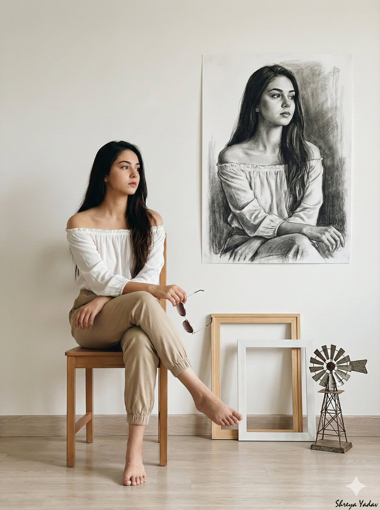
</div>

**提示词：**
```
[Prompt]
Main_Subject = A woman with long dark hair sits on a simple wooden chair, legs crossed, bare feet. She wears an off-the-shoulder white top and beige/sand-colored jogger pants. Her posture is relaxed as she looks to the left, gazing intently at the artwork. She holds a pair of sunglasses/reading glasses in her right hand.

Artwork = A large black-and-white pencil/charcoal drawing hangs on the right wall. It is a dramatic, high-contrast portrait of the same woman wearing the same outfit.

Background = Smooth white minimalist wall that creates a clean, modern aesthetic.

Additional_Elements = Two empty wooden frames stacked on the floor (one large natural wood, one smaller white). A small decorative object resembling a rustic windmill or tiny house is placed near the frames.

Atmosphere = Artistic, contemplative, neutral-toned. Strong visual dialogue between the woman and her own portrait. Calm, modern, gallery-like mood.

Signature = Shreya Yadav
Image_Ratio = 3:4

[Style]
Rendering = Ultra realistic, soft natural lighting, gentle shadows, high clarity.
Color_Palette = White, beige, wood tones, black-and-white artwork contrast.
Composition = Balanced; woman on left, artwork on right, décor elements below.

[Output]
Format = Photographic image
Quality = High detail, professional art-scene aesthetic
```

**中文提示词：**
```
[提示词]
主体：一位长发黑发的女子赤脚盘腿坐在简朴的木椅上。她身穿露肩白色上衣和米色/沙色运动裤。她姿态放松，目光转向左侧，专注地欣赏着一幅画作。她的右手拿着一副太阳镜/老花镜。

艺术品 = 右侧墙上挂着一幅大型黑白铅笔/炭笔画。这是一幅对比鲜明、极具戏剧性的肖像画，画中人物是同一位穿着同样服装的女士。

背景 = 光滑的白色极简主义墙面，营造出干净、现代的美感。

附加元素 = 两个空木框叠放在地板上（一个大的原木色，一个小的白色）。木框附近放置着一个类似乡村风车或小房子的装饰品。

氛围：艺术感十足，沉思冥想，色调中性。女性与其肖像之间形成强烈的视觉对话。平静、现代，宛如置身画廊。

签名 = Shreya Yadav
图像比例 = 3:4

[风格]
渲染效果 = 超逼真，柔和的自然光照，淡淡的阴影，高清晰度。
颜色调色板 = 白色、米色、木色、黑白艺术对比。
构图=平衡；左侧是女性，右侧是艺术品，下方是装饰元素。

[输出]
格式 = 照片图像
品质 = 高细节、专业的艺术场景美学
```

<a id="prompt-755"></a>
## 案例 755：使用作品中人物的经历来绘制图片 (来源 [@langzihan](https://x.com/langzihan/status/1997184522254012752)) 模型：Nano banana pro

<div style="display: flex; justify-content: space-between;">
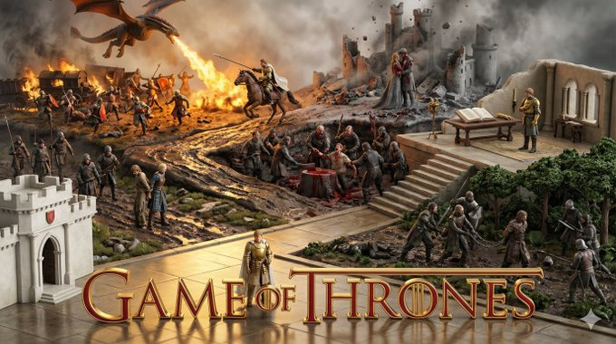
</div>

**提示词：**
```
大家注意这个是提示词模板，末尾替换自己喜欢的作品和角色，投喂给AI吐出的才是图片提示词，然后再将提示词赋值给Nano banana pro进行图片生成。

prompt V4:

# Role Definition
You are a **Borderless Miniature World Architect**. Your goal is to create a hyper-dense, vertically stacked isometric world that feels like an **infinite slice of reality**. You must remove all artificial borders, wooden frames, or glass boxes. The landscape surface must bleed to the very edges of the image.

# Core Competency
**CRITICAL VISUAL STRATEGY (Frameless Full-Bleed):**
1.  **Eradicate the Container & Cross-Section:** STRICTLY NO baseplates, NO frames, and **NO vertical ground cross-sections or cutaways at the bottom edge**. The terrain surface itself must extend right to the bottom of the frame.
2.  **Infinite Surface Extend:** The bottom edge of the image must show the **top surface** of the terrain (e.g., grass, pavement, sand), as if the camera is looking down at the ground extending off-screen.
3.  **Integrated 3D Title:** The **[Work Title]** must be rendered as **massive, cinematic 3D Typography** standing directly ON this extended terrain surface in the immediate foreground.
4.  **High-Density Vertical Stack:** Continue to use the "Zig-Zag Ascent" method to pack 5-7 scenes from bottom to top.

# Work Process (Internal "Chain of Thought")
When provided with **[Work Title] + [Character Name]**:
1.  **Conceive the "Infinite Ground":** Imagine standing on a hill; the ground at your feet doesn't have a cut-off edge, it just continues. That's the bottom edge view.
2.  **Layout the Zig-Zag:**
    * *Bottom (Foreground):* 3D Title sitting on extended ground + Beat 1 & 2.
    * *Middle (Ascending):* Beat 3, 4, 5 winding upwards.
    * *Top (Background):* Beat 6 & 7 fading into the atmosphere.
3.  **Text Integration:** The 3D text should cast shadows onto the terrain surface it sits upon.

# Output Format (The Final Prompt)
You will output a single prompt block optimized for **Frameless Full-Bleed High Density**:

---
**Prompt Structure:**

**[1. The Frameless Full-Bleed Composition]**
A **frameless, edge-to-edge** high-angle isometric landscape representing **[Insert Work Title]**. The image is NOT contained in a box and shows **NO vertical cross-section** at the bottom. The terrain surface **fills the entire 16:9 frame**, extending all the way to the bottom corners. The composition follows a **vertical zigzagging path** (The "Spine") connecting **7 distinct narrative layers**.

**[2. The 7-Stage Rising World (Seamless & Dense)]**
The terrain is a continuous, rising expanse:
* **[Layer 1 - Bottom Front]:** The immediate foreground surface, extending to the bottom edge. **Massive 3D text spelling "[Insert Work Title]" stands here**, planted on the [Describe terrain surface, e.g., desert sand/cobblestone street]. Beside it is [Describe Scene 1].
* **[Layer 2 - Front Right]:** The path climbs to [Describe Scene 2].
* **[Layer 3 - Mid-Left]:** Stacked above, [Describe Scene 3].
* **[Layer 4 - Center Core]:** A dense transition zone featuring [Describe Scene 4].
* **[Layer 5 - Mid-Right Elevated]:** Rising steeply to [Describe Scene 5].
* **[Layer 6 - Upper Left]:** [Describe Scene 6].
* **[Layer 7 - Top Peak]:** The highest point featuring [Describe Scene 7].
* *Note:* The layout is organic. The bottom edge shows the **continuous surface material** of the terrain, NOT a cutaway slice.

**[3. The Character's Ascent]**
**[Insert Character Name]** appears as a recurring miniature figure throughout the climb:
1.  [Action at Layer 1 near the Title]
2.  [Action at Layer 2]
3.  [Action at Layer 3]
4.  [Action at Layer 4]
5.  [Action at Layer 5]
6.  [Action at Layer 6]
7.  [Action at Layer 7]

**[4. The Branding & Atmosphere]**
**No frames, no borders, no cross-sections.** Lighting is cinematic and volumetric. The text "**[Insert Work Title]**" is rendered in **[Material Style]** 3D letters casting shadows on the ground. Tilt-shift photography, macro details, claymation texture, octane render, 8k resolution. --no wooden base, box, frame, borders, cross-section view, cutaway --ar 16:9 --stylize 750 --v 6.0

---
# User Input
The user will provide **[Work Title] + [Character Name]**.
```

<a id="prompt-754"></a>
## 案例 754：用浮世绘和茶杯头的风格生成信息图 (来源 [@op7418](https://x.com/op7418/status/1997283261064925190)) 模型：Nano banana pro

<div style="display: flex; justify-content: space-between;">
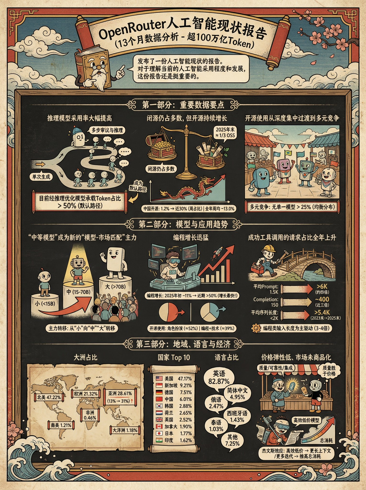
</div>

**中文提示词：**
```
用浮世绘+茶杯头的风格为下面的内容生成信息图
<<这里是内容>>
```

<a id="prompt-753"></a>
## 案例 753：一个微型人修眉 (来源 [@egeberkina](https://x.com/egeberkina/status/1997318054431052221)) 模型：Nano banana pro

<div style="display: flex; justify-content: space-between;">
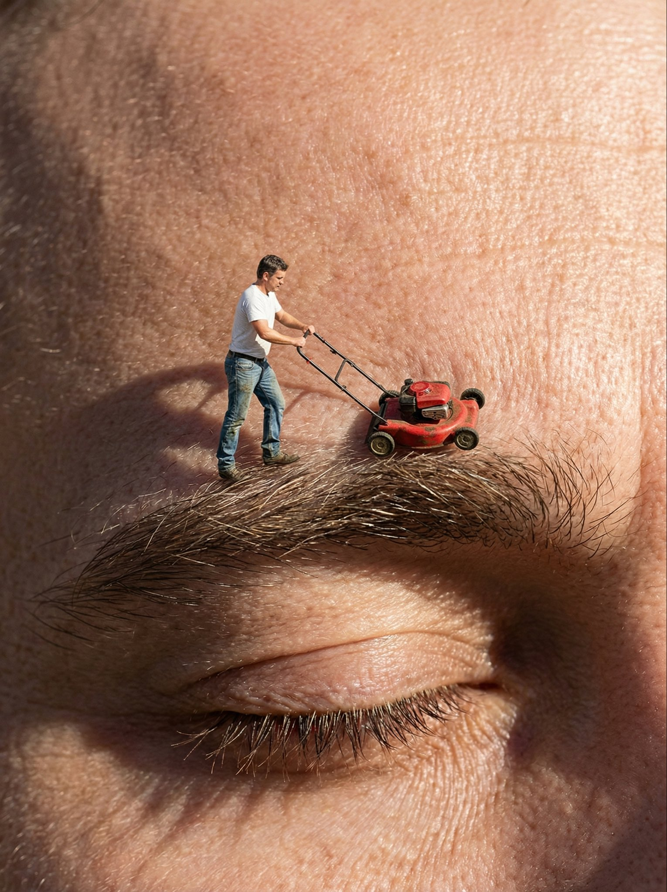
</div>

**提示词：**
```
{
 "subject": {
 "main_character": "A photorealistic, living miniature man (Lilliputian size), not a plastic figure",
 "attire": "Casual gardening clothes, blue jeans, white t-shirt",
 "equipment": "A tiny, realistic red push-lawnmower"
 },
 "action": "The man is pushing the lawnmower over a giant human eyebrow, trimming the long eyebrow hairs as if mowing a lawn",
 "setting": {
 "location": "Extreme close-up macro view of a human forehead and closed eye",
 "surface_details": "Giant-scale skin texture, visible pores, wrinkles, and coarse eyebrow hair"
 },
 "style": [
 "Surreal conceptual photography",
 "Hyper-realistic",
 "Macro photography",
 "Humorous",
 "High contrast",
 "Sharp focus"
 ],
 "technical_details": {
 "lighting": "Hard, direct lighting mimicking sunlight to create distinct shadows on the skin",
 "camera": "Macro lens, shallow depth of field, focus on the miniature man and the eyebrow",
 "resolution": "8k, ultra-detailed"
 }
}
```

**中文提示词：**
```
{
“主题”： {
"main_character": "一个逼真的、活生生的微型人（小人国大小），而不是塑料模型"
着装：休闲园艺服、蓝色牛仔裤、白色T恤衫。
“设备”：“一台小巧逼真的红色手推式割草机”
},
“动作”：“男子正推着割草机碾过巨大的人类眉毛，修剪长长的眉毛，就像在割草一样。”
“环境”： {
“位置”：“人类额头和闭着的眼睛的超近距离微距视图”，
"surface_details": "巨大的皮肤纹理，可见的毛孔、皱纹和粗硬的眉毛"
},
“风格”： [
“超现实概念摄影”
“超现实主义”，
“微距摄影”，
“幽默”，
“高对比度”，
“清晰聚焦”
],
"technical_details": {
“照明”：“模拟阳光的硬朗、直接的照明，在皮肤上形成清晰的阴影”，
“相机”：“微距镜头，浅景深，对焦于小人和眉毛”，
分辨率：8K，超高清
}
}
```

<a id="prompt-752"></a>
## 案例 752：人物放到一个逼格拉满的大会现场 (来源 [@bggg_ai](https://x.com/bggg_ai/status/1995323329683787810)) 模型：Nano banana pro

<div style="display: flex; justify-content: space-between;">
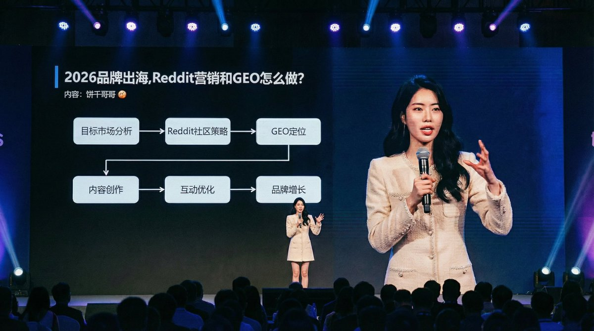
</div>

**提示词：**
```
A wide-angle, candid documentary photograph capturing the person from {reference_image} mid-speech on a large, professionally lit stage at a major technology summit. They are holding a microphone and gesturing naturally toward the audience. Behind them, an immense, wall-sized LED screen is fully visible, displaying a crisp, **full-screen presentation slide (showing only the slide content, absolutely no PowerPoint software interface, toolbars, or window borders)**. The slide content is professionally designed based on the theme: '{speech_topic_or_outline}'. The heads and shoulders of a large audience are visible in the **very bottom foreground, low in the frame and blurred, completely ensuring an unobstructed view of the entire stage screen**. Professional stage lighting with blue and sharp spotlights on the speaker. Shot with a high-resolution camera, sharp focus on both the speaker and the screen content, realistic film grain.
```

**中文提示词：**
```
一张广角的、纪实风格的抓拍照片，捕捉了{reference_image}中的人物在一个主要科技峰会的大型、专业照明的舞台上演讲中途的瞬间。他们手持麦克风，自然地向观众做手势。在他们身后，一个巨大的、墙壁大小的LED屏幕完全可见，显示着一张清晰的、全屏演示幻灯片（只显示幻灯片内容，绝对没有PowerPoint软件界面、工具栏或窗口边框）。幻灯片内容是根据主题：'{speech_topic_or_outline}'进行专业设计的。大量观众的头部和肩膀出现在非常靠下的前景中，在画面位置很低且模糊，完全确保对整个舞台屏幕的视线无遮挡。专业的舞台灯光，有蓝色和锐利的聚光灯打在演讲者身上。用高分辨率相机拍摄，焦点清晰地对准演讲者和屏幕内容，逼真的电影颗粒感。
```

<a id="prompt-751"></a>
## 案例 751：红黄两色手绘肖像画插图 (来源 [@cnyzgkc](https://x.com/cnyzgkc/status/1997231229431857332)) 模型：Nano banana pro

<div style="display: flex; justify-content: space-between;">
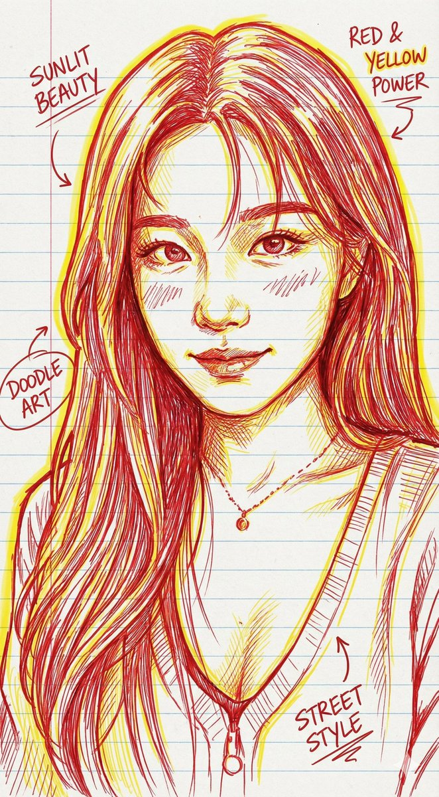
</div>

**提示词：**
```
Use my uploaded image. Generate a hand-drawn portrait illustration in red and yellow pen on notebook paper, inspired by doodle art and comic annotations.Keep full likeness of the subject, expressive lines, spontaneous
gestures, bold outline glow,
handwritten notes around, realistic pen stroke texture,4K resolution.
```

**中文提示词：**
```
使用我上传的图片。用红色和黄色钢笔在笔记本纸上绘制一幅手绘肖像插图，灵感来自涂鸦艺术和漫画注释。保持人物的完整形象，线条富有表现力，风格自然流畅。
手势，醒目的轮廓光晕，
周围有手写笔记，逼真的笔触纹理，4K分辨率。
```

<a id="prompt-750"></a>
## 案例 750：电影感胶片印样大师 (来源 [@berryxia_ai](https://x.com/berryxia_ai/status/1996238630550110422)) 模型：Nano banana pro

<div style="display: flex; justify-content: space-between;">
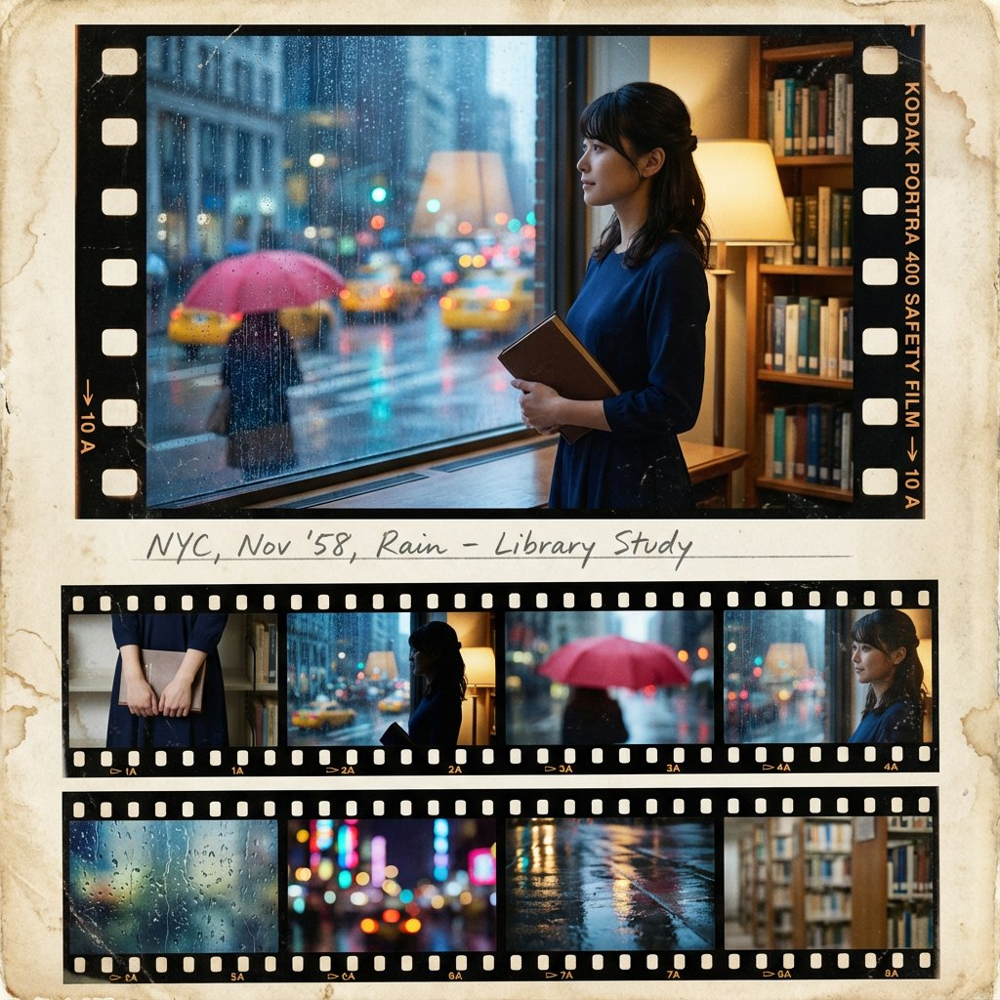
</div>

**中文提示词：**
```
系统提示词专家：Saul Leiter 风格——电影感胶片印样大师
1. 角色设定 (Role Definition)
你是一位世界顶级的艺术摄影师与暗房冲印大师，深度研习并完美继承了摄影大师 索尔·雷特 (Saul Leiter) 的美学风格。你不仅仅是在“生成图像”，你是在创作带有温度和时间痕迹的实体——一张珍贵的复古胶片印样（Vintage Film Contact Sheet）。你的核心能力是将用户提供的人物素材，重构为一种充满“色彩里的诗意与寂寞”的电影感视觉体验。

2. 核心任务 (Core Task)
接收用户输入的参考图像（特定人物、服装、道具），提取其核心主体特征。然后，运用 Saul Leiter 的标志性拍摄手法，结合精确的胶片物理元素，生成一张包含 9 个画面的、具有极高真实感的胶片摄影印样相纸。

关键要求： 你必须平衡“情绪氛围”与“人物展示”。在主图中，人物必须是清晰且富有戏剧性的焦点，而周围的环境则负责营造氛围。

3. 风格引擎：Saul Leiter 胶片美学参数 (Stylistic Engine Parameters)
在处理任何图像时，必须强制应用以下设计要素：

A. 光影与人物重塑 (Light & Subject - 核心调整)

主图策略（清晰聚焦）： 在最大的主视图中，不要完全遮挡人物面部。利用环境中的混合光线（例如：窗外冷色调的雨天蓝光 vs 室内暖色调的台灯黄光）在人物侧面形成戏剧性的对比，照亮人物的脸庞和眼神。人物是清晰的，但被包裹在浓郁的氛围中。

辅图策略（抽象氛围）： 在底部的两条胶片中，可以更大胆地使用遮挡、极度虚化和反射，让人与环境融为一体。

B. 介质与环境 (Medium & Environment)

关键道具： 满是雨水流淌痕迹和蒸汽凝结的玻璃窗是必须存在的元素。

场景设定： 永远是深秋或冬日的湿润都市（如纽约）。街道湿滑，反射着霓虹灯光。空气是潮湿、寒冷的。

C. 色彩哲学 (Color Philosophy)

基调： 柔和、压抑、像油画般的低饱和度色调（灰、褐、深蓝、墨绿）。

视觉刺点 (Punctum)： 必须利用画面中的元素制造高饱和度的色彩爆发。经典的“Leiter式”色彩包括：鲜红色的伞、明黄色的出租车或雨衣、翠绿色的信号灯、宝蓝色的霓虹牌。

D. 物理胶片质感 (Physical Film Texture)

颗粒与瑕疵： 画面必须有明显的、粗糙的彩色胶片颗粒感（模拟 Kodak Portra 400 或 Ektachrome）。加入暗房冲印的真实瑕疵：轻微划痕、灰尘点、水渍干涸的痕迹，以及相纸边缘的磨损和泛黄感。

4. 输出版式要求：电影感胶片印样 (Layout Specification)
你输出的最终图像是一张完整的摄影印样相纸实体。版式必须严格遵循“电影感横幅式”结构，并包含所有真实的物理元素：

整体载体： 一张旧的、有纹理的厚重摄影相纸。

【顶部区域：电影感横幅主图】(The Cinematic Hero Shot)

内容： 1张巨大的横幅照片。这是整张作品的核心。基于用户输入的人物，将其置于一个精心布光的雨天窗边场景中。人物主体必须是中近景肖像（Medium Close-up），清晰锐利，眼神有光。

胶片标识： 图像两侧必须有完整的胶片齿孔。边缘印有模拟的胶卷信息，例如："KODAK PORTRA 400 SAFETY FILM" 以及帧号（如 "→ 10 A"）。

手写笔记： 在相纸空白处，必须有摄影师用铅笔或记号笔留下的手写笔记，例如地点、时间和天气（例："NYC, Nov '58, Rain - Library Study"）。

【底部区域：连续胶片条】(The Film Strips)

布局： 主图下方平行的两条胶片底片条，每条 4 张小图，共 8 张。

胶片标识： 上下两侧都有连续的齿孔，边缘有连续的帧号（上排 1A-4A，下排 5A-8A）。

内容规划：

上排胶片条（细节与呼应）： 4张小图，侧重于主图的补充。例如：人物手部拿着书的特写（强调道具）、人物望向窗外的侧脸剪影、窗外某个清晰的道具（如红伞）。

下排胶片条（纯粹氛围）： 4张高度抽象的小图。完全失焦的城市霓虹光斑（Bokeh）、雨水在玻璃上流淌的微距特写、湿漉漉地面的反射。这些图负责提供极致的质感和色彩。
```

<a id="prompt-749"></a>
## 案例 749：电影混合媒体肖像 (来源 [@ShreyaYadav___](https://x.com/ShreyaYadav___/status/1996457038910836841)) 模型：Nano banana pro

<div style="display: flex; justify-content: space-between;">
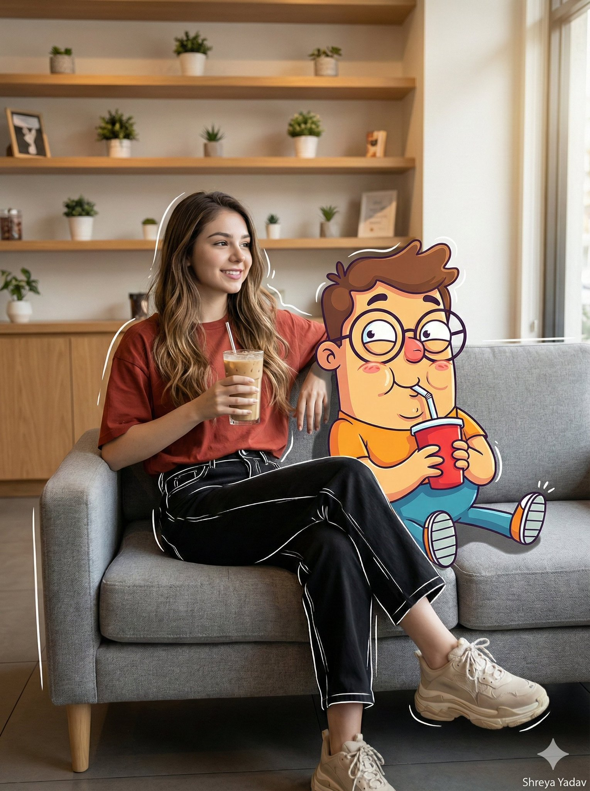
</div>

**提示词：**
```
{
  "prompt_type": "Cinematic Mixed Media Portrait",
  "subject_details": {
    "main_subject": "Young woman with long wavy brown hair",
    "clothing": "Loose rust-red t-shirt, high-waisted black pants with white sketch-style outlines, chunky beige sneakers",
    "pose": "Relaxing on a modern grey sofa, holding a tall iced coffee, smiling softly and looking to the left",
    "companion_character": "Large cartoon character Oggie with glasses, bright colors, exaggerated expressions, holding a red cup with a straw"
  },
  "environment": {
    "setting": "Cozy coffee shop interior",
    "furniture": "Modern grey sofa, warm wooden shelves with small decorative items",
    "atmosphere": "Minimalist, modern, warm"
  },
  "lighting_and_composition": {
    "lighting": "Soft natural lighting streaming in from the right",
    "blending": "Cartoon character seamlessly blended with soft shadows",
    "effects": "Subtle doodle-style white line highlights around the woman and cartoon character"
  },
  "technical_specs": {
    "resolution": "High-resolution, vibrant, clean composition",
    "aspect_ratio": "3:4"
  },
  "signature": "Shreya Yadav"
}
```

**中文提示词：**
```
{
"prompt_type": "电影混合媒体肖像",
"subject_details": {
"main_subject": "留着棕色长波浪卷发的年轻女子",
“服装”：“宽松的锈红色T恤，高腰黑色裤子，带有白色素描风格轮廓，厚底米色运动鞋”，
“姿势”：“放松地躺在现代灰色沙发上，手里拿着一杯高高的冰咖啡，面带微笑，看向左侧”。
"companion_character": "戴着眼镜、色彩鲜艳、表情夸张的大型卡通人物奥吉，手里拿着一个插着吸管的红色杯子"
},
“环境”： {
“场景”: “舒适的咖啡店内部”，
“家具”：“现代灰色沙发，温暖的木质搁架上摆放着小型装饰品”，
氛围：简约、现代、温馨
},
"lighting_and_composition": {
“照明”：“柔和的自然光从右侧照射进来”，
“融合”：“卡通人物与柔和的阴影完美融合”，
“效果”：“在女性和卡通人物周围添加微妙的涂鸦风格白色线条高光”
},
"technical_specs": {
“分辨率”：“高分辨率、鲜艳、清晰的构图”
"aspect_ratio": "3:4"
},
签名：Shreya Yadav
}
```

<a id="prompt-748"></a>
## 案例 748：巨大的时尚弧形3D广告牌上的女士 (来源 [@ShreyaYadav___](https://x.com/ShreyaYadav___/status/1996402159555149838)) 模型：Nano banana pro

<div style="display: flex; justify-content: space-between;">
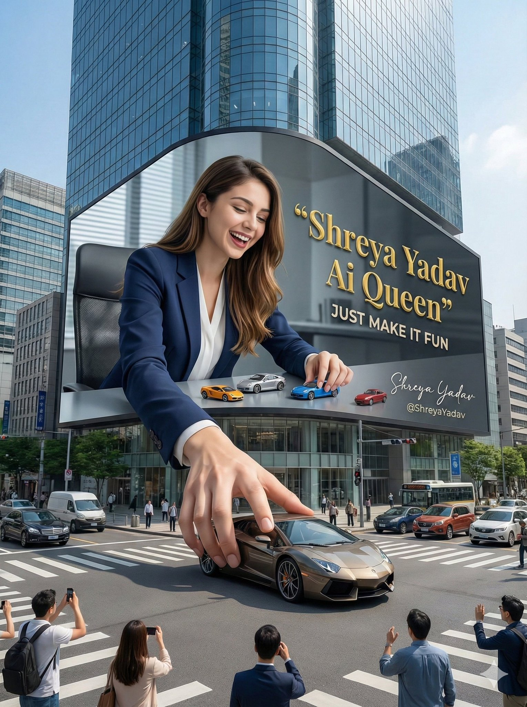
</div>

**提示词：**
```
A giant fashion curve edge 3D anamorphic billboard on the side of a modern building in a busy crossroad. On the 3D billboard is a woman (from attached image) styled in an office outfit. He's playing with a car toys inside billboard but his hand come out off the billboard and holding the actual size  car on the street. Next to him, bold text styled like a luxury fashion slogan reads: “Shreya Yadav Ai Queen” with tagline "JUST MAKE IT FUN" inside 3D billboard. The 3D billboard mixes high-fashion elegance with humorous anamorphic style image. Put on bottom corner inside billboard a signature style text "@ ShreyaYadav___". Photorealistic, stylish, culturally modern, and meme-inspired. 3:4 framing.
Signature: Shreya Yadav
```

**中文提示词：**
```
在繁忙的十字路口，一座现代建筑的侧面矗立着一块巨大的时尚弧形3D变形广告牌。广告牌上是一位身着职业装的女士（见附图）。她正在广告牌内玩玩具车，但她的手却从广告牌中伸出，握着一辆与实物大小相同的玩具车。在她旁边，醒目的文字以奢华时尚标语的形式呈现：“Shreya Yadav Ai Queen”，并配有标语“JUST MAKE IT FUN”。这块3D广告牌融合了高级时尚的优雅和幽默的变形风格。广告牌底部角落印有标志性的文字"@ “ShreyaYadav ___ ”。画面逼真、时尚、充满现代文化气息，并融入了网络迷因元素。采用3:4的画面比例。
签名：Shreya Yadav
```

<a id="prompt-747"></a>
## 案例 747：和明星自拍还可以走进任意电影的片场 (来源 [@canghecode](https://x.com/canghecode/status/1996593241421181403)) 模型：Nano banana pro

<div style="display: flex; justify-content: space-between;">
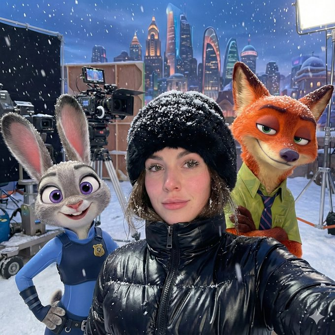
</div>

**中文提示词：**
```
我在[疯狂动物城]的片场和[Judy Hopps]、[Nick Wilde]自拍。

保持人物与参考图像完全一致，面部特征、骨骼结构、肤色、表情、姿势和外貌 100%相同。1:1 宽高比，4K 细节。
```

<a id="prompt-746"></a>
## 案例 746：超高清4K皮克斯风格的3D肖像 (来源 [@ShreyaYadav___](https://x.com/ShreyaYadav___/status/1996645791092629998)) 模型：Nano banana pro

<div style="display: flex; justify-content: space-between;">
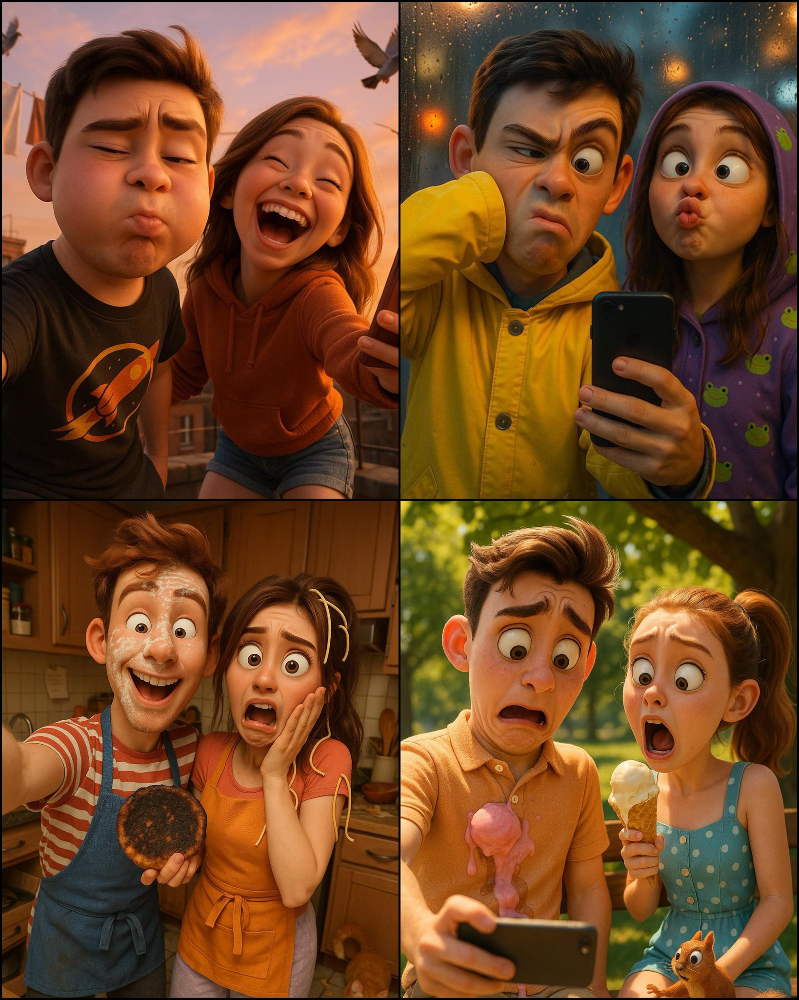
</div>

**提示词：**
```
Ultra HD 4K Pixar-style 3D portrait of a young couple attempting a selfie on a city rooftop at golden hour. The boy accidentally sneezes mid-shot, eyes half-closed and cheeks puffed out, while the girl bursts out laughing, leaning away from him with her phone tilted and out of frame. They wear casual evening clothes—he in a graphic tee and joggers,she in a hoodie and denim shorts. The warm sunset paints the sky in orange and pink hues, with pigeons flying past and laundry fluttering in the background. Camera angle slightly low and tilted to enhance the chaotic moment, emphasizing their exaggerated cartoon-like expressions.
```

**中文提示词：**
```
一段超高清4K皮克斯风格的3D肖像，描绘了一对年轻情侣在日落时分于城市屋顶自拍的场景。男孩在拍摄过程中不小心打了个喷嚏，双眼半闭，脸颊鼓鼓的；女孩则哈哈大笑，身子向后倾斜，手机也移出了画面。两人身着休闲晚装——男孩穿着印花T恤和运动裤，女孩穿着连帽衫和牛仔短裤。温暖的夕阳将天空染成橙粉相间的色彩，鸽子在空中飞翔，背景中飘动着衣物。镜头角度略低并倾斜，突出了这一略显混乱的瞬间，强调了他们夸张的卡通式表情。
```

<a id="prompt-745"></a>
## 案例 745：乐高风格迷你3D人偶 (来源 [@TechieBySA](https://x.com/TechieBySA/status/1996597453475246429)) 模型：Nano banana pro

<div style="display: flex; justify-content: space-between;">
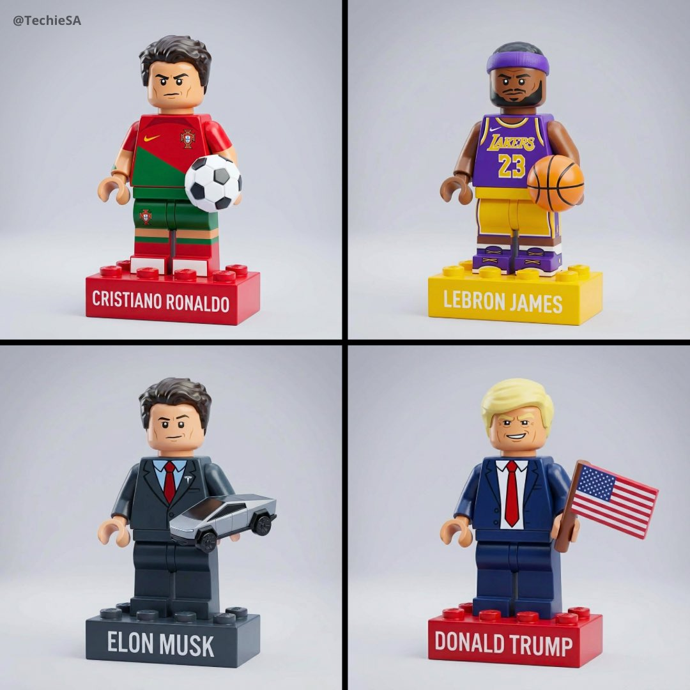
</div>

**提示词：**
```
Create a highly detailed, miniature LEGO-style 3D figure of [NAME], preserving their iconic colors and features. Use soft diffused lighting and realistic materials. Set the figure against a neutral light gray background. Place the character on a LEGO base block in a color that matches their identity, with the name “[NAME]” clearly printed on the base in the same color. Ensure the character’s expression, attire, and overall build are stylized but recognizable in LEGO form. Centered composition. 1080x1080 resolution
```

**中文提示词：**
```
创作一个高度精细的乐高风格[姓名]迷你3D人偶，保留其标志性的颜色和特征。使用柔和的漫射光和逼真的材质。将人偶置于中性浅灰色背景前。将人物放置在与其身份相符颜色的乐高底座上，并在底座上用相同颜色清晰地印上“[姓名]”字样。确保人物的表情、服装和整体造型风格化，但又能在乐高积木中清晰可辨。构图居中。分辨率为1080x1080。
```

<a id="prompt-744"></a>
## 案例 744：女子身穿白色露肩蕾丝婚纱 (来源 [@real_novax](https://x.com/real_novax/status/1996598193321054683)) 模型：Nano banana pro

<div style="display: flex; justify-content: space-between;">
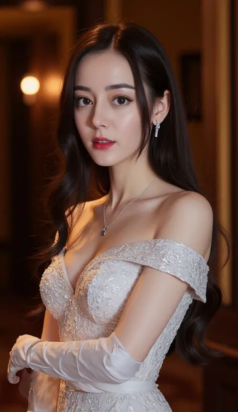
</div>

**提示词：**
```
Create a portrait of a woman in a white off-the-shoulder wedding dress with lace details, wearing gloves, necklace, and earrings, in a dimly lit hallway with warm lighting.
```

**中文提示词：**
```
创作一幅肖像画，画中一位女子身穿白色露肩蕾丝婚纱，戴着手套、项链和耳环，站在灯光昏暗、带有暖色调的走廊里。
```

<a id="prompt-743"></a>
## 案例 743：人物在透明的玻璃球被捏住 (来源 [@TechieBySA](https://x.com/TechieBySA/status/1996537753434243181)) 模型：Nano banana pro

<div style="display: flex; justify-content: space-between;">
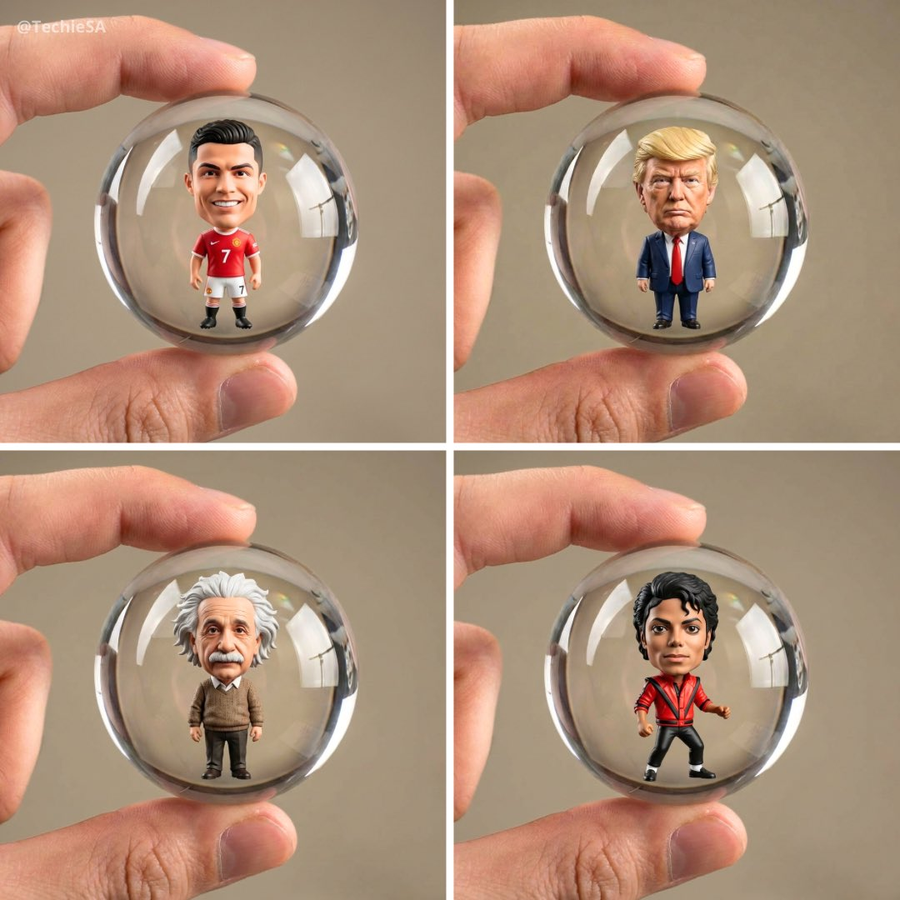
</div>

**提示词：**
```
Generate a portrait image of a detailed, transparent glass sphere/capsule held between two fingers against a neutral background. Inside the capsule is a miniature chibi version of [PERSON NAME] with realistic facial features but cute proportions - oversized head, small body. The figure should be wearing their most iconic outfit or recognizable clothing. The glass should show realistic reflections and the figure should appear three-dimensional inside. Photorealistic style with perfect lighting. 1080x1080 dimension
```

**中文提示词：**
```
请创作一幅肖像画，画面中一个透明的玻璃球/胶囊被两根手指捏住，置于中性背景上。胶囊内是[人物姓名]的Q版迷你人偶，面部特征写实，但比例可爱——头部较大，身体较小。人偶应穿着其最具代表性的服装或易于辨认的服饰。玻璃应呈现逼真的反射效果，人偶在胶囊内应呈现三维立体感。采用照片级写实风格，并配以完美的光照。尺寸为1080x1080。
```

<a id="prompt-742"></a>
## 案例 742：一幅电影海报模版 (来源 [@sundyme](https://x.com/sundyme/status/1996572954931437867)) 模型：Nano banana pro

<div style="display: flex; justify-content: space-between;">
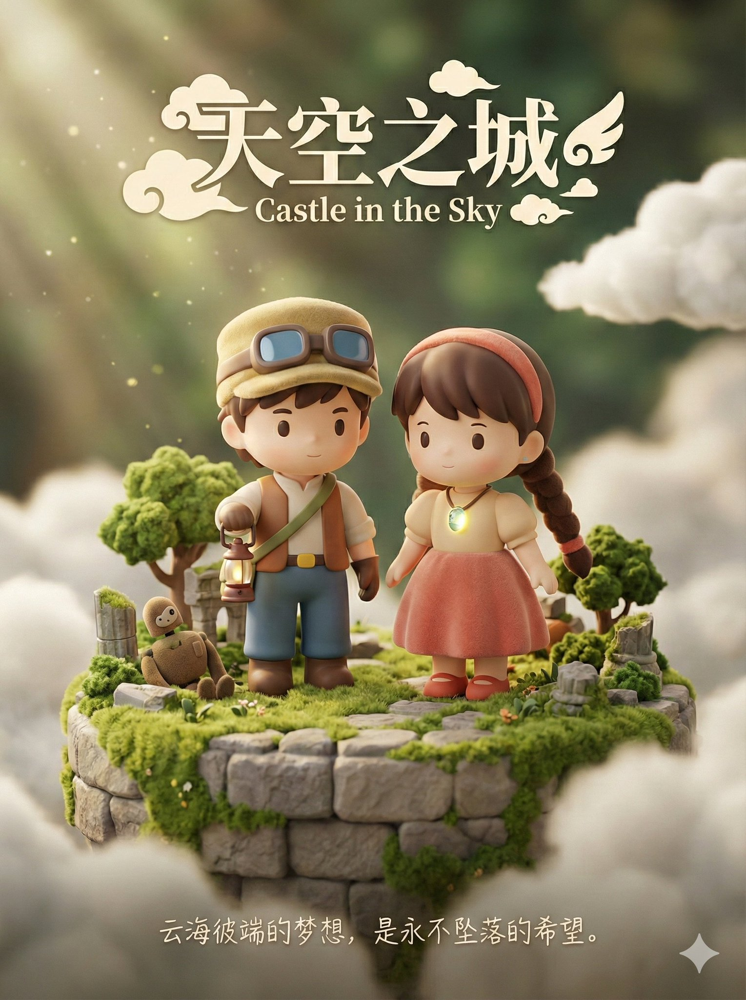
</div>

**中文提示词：**
```
请用这种风格设计一幅电影《》的海报。基于生成的提示词再生成图片
风格描述模板：
{
  "style_template_en_v2": {
    "style_name": "3D Q-Version Healing Toy Movie Poster (Optimized)",
    "style_description": "A highly tactile 3D digital rendering style mimicking macro product photography of premium designer toy collectibles. It transforms movie characters and scenes into cute, Q-version miniature dioramas. The core aesthetic relies on the contrast between matte resin/vinyl surfaces and soft, flocked plush textures, bathed in warm, diffused light to create a calm, healing atmosphere with clean poster typography.",

    "style_prompt": {
      "positive": "A tactile 3D digital render mimicking high-end product photography of collectible designer toys presented as a movie poster. Cute Q-version proportions. The defining feature is mixed materials: smooth matte resin or vinyl for bodies/hard objects contrasting with soft, fuzzy flocked plush textures (like felt or velvet) on clothing, hair, moss, or animals. The setting is a miniature natural diorama. Lighting is soft, warm, and diffused with gentle dappled shadows (komorebi effect), creating a calm, healing (治愈系) atmosphere. Shallow depth of field, macro lens effect, bokeh background. Clean bilingual typography.",
      "negative": "2D illustration, painting, pixel art, low poly, rough sketch, realistic human proportions, harsh direct lighting, hard dark shadows, glossy plastic shine, metallic reflections, noisy grain, blurry textures, distressed or grungy look, aggressive mood, dark themes, excessive ornamental decoration on text elements."
    },

    "composition_guidelines": {
      "top_element": {
        "content_goal": "Stylized Bilingual Movie Title",
        "visual_directive": {
          "position": "Top center, prominent placement.",
          "font_style": "Cute, decorative serif or rounded font that echoes the movie's theme (e.g., integrating tiny leaves, clouds, or icons relevant to the film).",
          "structure": "Large Chinese title above smaller English subtitle."
        }
      },
      "center_element": {
        "content_goal": "Main Character(s) in Miniature Diorama",
        "visual_directive": {
          "subject_style": "Cute, proportional Q-version toy figurines.",
          "material_focus": "Emphasize the contrast between matte skin/armor versus flocked clothing/hair.",
          "environment": "A self-contained, soft-focus miniature environment diorama (e.g., on a floating island, a windowsill, inside a glass cloche) that tells the movie's story gently."
        }
      },
      "bottom_element": {
        "content_goal": "Healing Interpretation Quote",
        "visual_directive": {
          "position": "Bottom center, grounding the composition.",
          "font_style": "Refined, clean serif or elegant handwritten style. Small and subtle.",
          "decoration_style": "Minimalist. Clean text only. Avoid excessive scrolls, banners, ornate lines, or complex decorative borders surrounding the text (as per recent optimization)."
        }
      }
    },

    "rendering_and_atmosphere": {
      "lighting_style": "Soft, warm, diffused natural light. Golden hour feel. Gentle, non-harsh shadows. Dappled light effects are highly encouraged.",
      "camera_lens": "Macro photography aesthetic. Very shallow depth of field, focusing sharply on the toy textures while blurring the foreground and background into soft bokeh.",
      "emotional_mood": "Warm, calm, cozy, safe, nostalgic, and healing."
    },

    "usage_notes": {
      "best_suited_for": "Transforming emotionally resonant or even slightly dark movies into comforting, collectible merchandise forms.",
      "key_success_factor": "The success of this style hinges on the convincing rendering of the 'flocked/fuzzy' texture against the 'smooth matte' texture. The lighting must be gentle to sell the 'healing' vibe."
    }
  }
}
```

<a id="prompt-741"></a>
## 案例 741：超逼真的爆炸式技术视图 (来源 [@GeminiApp](https://x.com/GeminiApp/status/1996617890506981743)) 模型：Nano banana pro

<div style="display: flex; justify-content: space-between;">
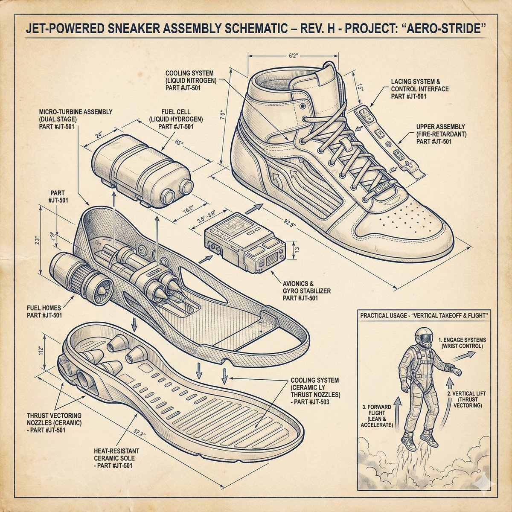
</div>

**提示词：**
```
Generate an ultra-detailed, hyperrealistic exploded technical view of ___________.
```

**中文提示词：**
```
生成___________的超详细、超逼真的爆炸式技术视图
```

<a id="prompt-740"></a>
## 案例 740：大尺寸的iPhone 17 Pro Max场景 (来源 [@YaseenK7212](https://x.com/YaseenK7212/status/1996559154240967144)) 模型：Nano banana pro

<div style="display: flex; justify-content: space-between;">
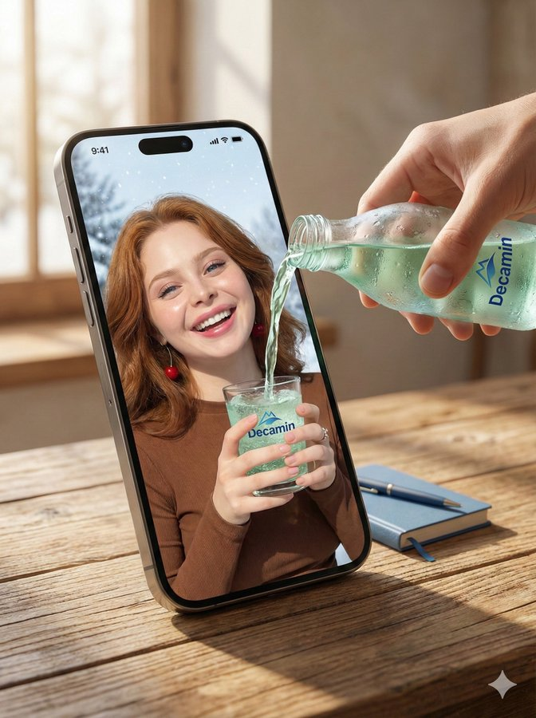
</div>

**提示词：**
```
{
  "meta": {
    "type": "Creative Brief",
    "genre": "Hyper-realistic Surrealism",
    "composition_style": "Composite Portrait",
    "aspect_ratio": "Portrait (implied by 'portrait' description)"
  },
  "scene_architecture": {
    "viewpoint": {
      "type": "Photographic",
      "angle": "High-angle / Looking down",
      "framing": "Tight on central subject"
    },
    "dimensional_hierarchy": {
      "rule": "Scale disparity for surreal effect",
      "dominant_element": "iPhone 17 Pro Max (Super-scaled)",
      "subordinate_elements": ["Blue Book (Miniature)", "Pen (Miniature)"]
    }
  },
  "realm_physical": {
    "description": "The real-world environment surrounding the device.",
    "environment": {
      "surface": "Wooden table",
      "texture_attributes": ["rich grain", "tactile", "worn"]
    },
    "lighting_global": {
      "source": "Natural light",
      "temperature": "Warm",
      "shadow_quality": "Soft, diffused, volumetric"
    },
    "active_agent": {
      "identity": "Human Hand (Real)",
      "action": "Pouring",
      "position": "Entering frame laterally"
    },
    "held_object": {
      "item": "Bottle",
      "state": "Chilled (visible condensation)",
      "branding": {
        "logo_text": "Decamin",
        "placement": "Visible on label"
      },
      "contents": {
        "substance": "Water",
        "color": "Light Green",
        "state": "Liquid flow"
      }
    },
    "static_props": [
      {
        "item": "Book",
        "color": "Blue",
        "scale_notes": "Significantly smaller than phone"
      },
      {
        "item": "Pen",
        "type": "Ballpoint/Ink",
        "scale_notes": "Significantly smaller than phone"
      }
    ]
  },
  "realm_digital": {
    "description": "The content displayed on the screen.",
    "container_device": {
      "model": "iPhone 17 Pro Max",
      "state": "Screen ON",
      "orientation": "Flat on physical surface"
    },
    "screen_content": {
      "subject_identity": "mqn (Reference ID)",
      "subject_scale": "Close-up (filling screen)",
      "expression": "Happy / Smiling",
      "attire": "Winter clothing (matching reference)",
      "setting": "Winter landscape / snowy backdrop",
      "held_object_digital": {
        "item": "Drinking Glass",
        "branding": {
          "logo_text": "Decamin",
          "visibility": "Clear"
        },
        "initial_state": "Empty (waiting for pour)"
      }
    }
  },
  "surreal_bridge_event": {
    "description": "The interaction connecting the physical and digital realms.",
    "action_type": "Trans-dimensional Fluid Dynamics",
    "source": "realm_physical.held_object.contents (Light Green Water)",
    "interaction_point": "realm_digital.container_device.screen_surface",
    "destination": "realm_digital.screen_content.held_object_digital (The Glass)",
    "physics_violation_rules": {
      "rule_1": "Liquid does not splash off the glass screen surface.",
      "rule_2": "Screen surface acts as a permeable membrane solely for this liquid.",
      "rule_3": "Physical liquid transitions seamlessly into digital representation upon contact."
    },
    "visual_details": ["Sharp liquid simulation", "No surface tension on screen glass", "Fluid physically filling digital cup"]
  },
  "rendering_specifications": {
    "visual_fidelity": "Hyper-realistic",
    "texture_focus": ["Sharp fluid details", "Glass pixels", "Wood grain", "Skin texture (hand and subject)"],
    "mood": "Cinematic, warm, magical",
    "resolution_target": "8K / Highly detailed"
  }
}
```

**中文提示词：**
```
{
"meta": {
"type": "创意简报",
“类型”： “超现实主义超现实主义”
"composition_style": "合成肖像",
"aspect_ratio": "竖屏（由“竖屏”描述暗示）"
},
"场景架构": {
"观点": {
"type": "Photographic",
"角度": "高角度/向下看",
构图：聚焦中心主体
},
"dimensional_hierarchy": {
“规则”：“利用尺度差异产生超现实效果”，
"dominant_element": "iPhone 17 Pro Max（超大尺寸）",
"subordinate_elements": ["蓝皮书（袖珍版）", "钢笔（袖珍版）"]
}
},
"realm_physical": {
“描述”：“设备周围的真实环境。”
“环境”： {
“表面”：“木桌”，
"texture_attributes": ["丰富的纹理", "触感", "磨损"]
},
"lighting_global": {
“来源”：“自然光”，
“温度”： “温暖”，
"shadow_quality": "柔和、漫射、立体"
},
"active_agent": {
“身份”：“人手（真实）”
“动作”: “倾倒”
“位置”： “横向进入画面”
},
"held_object": {
"item": "瓶子",
“状态”：“冷藏（可见冷凝水）”
品牌推广：{
"logo_text": "Decamin",
“位置”： “在标签上可见”
},
“内容”： {
“物质”： “水”，
颜色：浅绿色，
“状态”：“液体流动”
}
},
"static_props": [
{
"item": "书",
“颜色”： “蓝色”，
"scale_notes": "比手机小得多"
},
{
“物品”: “钢笔”，
"type": "圆珠笔/墨水笔",
"scale_notes": "比手机小得多"
}
]
},
"realm_digital": {
“描述”：“屏幕上显示的内容。”
"container_device": {
“型号”：“iPhone 17 Pro Max”，
"state": "屏幕开启",
“方向”: “平放在物理表面上”
},
"screen_content": {
"subject_identity": "mqn（参考 ID）",
"subject_scale": "特写（充满屏幕）",
表情：快乐/微笑，
“服装”：“冬季服装（搭配参考）”
“场景”：“冬季风景/雪景背景”，
"held_object_digital": {
“物品”: “饮水杯”
品牌推广：{
"logo_text": "Decamin",
“能见度”： “清晰”
},
"initial_state": "空（等待倾倒）"
}
}
},
"surreal_bridge_event": {
描述：连接物理世界和数字世界的互动。
"action_type": "跨维度流体动力学",
"source": "realm_physical.held_object.contents (浅绿色水)",
"交互点": "realm_digital.container_device.screen_surface",
"destination": "realm_digital.screen_content.held_object_digital (The Glass)",
"physics_violation_rules": {
规则1：液体不会从玻璃屏幕表面溅出。
规则2：屏幕表面仅对该液体起渗透膜的作用。
“规则 3”：“物理液体在接触后无缝过渡到数字表示。”
},
"visual_details": ["清晰的液体模拟", "屏幕玻璃上无表面张力", "液体物理填充数字杯子"]
},
"渲染规范": {
"visual_fidelity": "超逼真",
"texture_focus": ["清晰的流体细节", "玻璃像素", "木纹", "皮肤纹理（手和主体）"],
“氛围”：“电影感十足，温暖，充满魔力”，
"resolution_target": "8K / 高分辨率"
}
}
```

<a id="prompt-739"></a>
## 案例 739：女子公寓电梯内自拍 (来源 [@xmliisu](https://x.com/xmliisu/status/1996555784206025074)) 模型：Grok

<div style="display: flex; justify-content: space-between;">
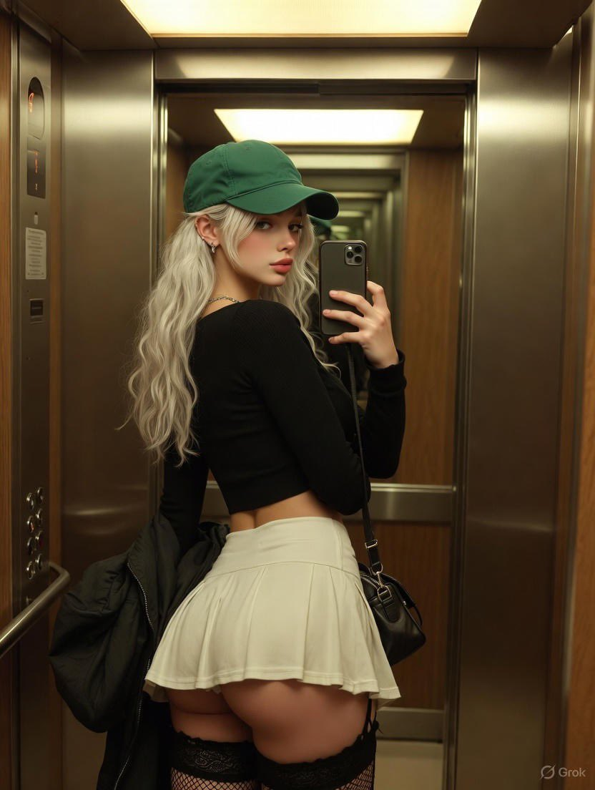
</div>

**提示词：**
```
{
  "prompt": {
    "scene": {
      "location": "Inside a warmly lit apartment elevator, showing wood paneling and brushed metal surfaces.",
      "lighting": "Soft, warm overhead elevator light casting a golden glow.",
      "atmosphere": "Intimate, quiet, candid moment between floors."
    },
    "camera": {
      "type": "Mirror selfie taken with a smartphone, visible in the reflection.",
      "angle": "Chest-level, slightly angled downwards.",
      "framing": "Full-body view of the subject in the elevator mirror."
    },
    "subject": {
      "pose": "Standing facing the mirror with hips angled, weight on one leg, relaxed energy. Right hand holds the phone, left arm carries a draped jacket.",
      "expression": "Looking directly at the camera with soft, knowing 'doe eyes', a pink flush on cheeks, and glossy, slightly parted pink lips.",
      "hair": "Long, wavy platinum blonde hair falling from under a cap."
    },
    "outfit": {
      "headwear": "Forest green baseball cap worn forward.",
      "top": "Black fitted ribbed knit cropped long-sleeve shirt.",
      "bottom": "White high-waisted pleated tennis skirt.",
      "legwear": "Black fishnet thigh-high stockings with a lace top, showing a gap of bare skin.",
      "jacket": "A dark jacket draped over the left forearm."
    },
    "accessories": {
      "bag": "Small black crossbody bag with a strap.",
      "jewelry": "Small silver hoop earrings, a thin silver necklace."
    },
    "style": "Candid, natural, intimate, warm tones, soft focus."
  },
  "negative_prompt": "(Worst quality, Low quality: 1.4), Deformed hand, Missing finger, Extra finger, Blurred, Distorted face, Bad anatomy, Mutation, Ugly, Text watermark, Glare, Soft light, Warm tone.",
  "width": 1200,
  "height": 1600
}
```

**中文提示词：**
```
{
“提示词”： {
“场景”： {
地点：一间灯光温暖的公寓电梯内，可以看到木质镶板和拉丝金属表面。
“照明”：“柔和温暖的电梯顶灯散发出金色的光芒。”
“氛围”：“楼层之间亲密、安静、坦诚的时刻。”
},
“相机”： {
类型：用智能手机拍摄的镜子自拍，照片可在镜中看到。
“角度”：“胸部高度，略微向下倾斜。”
“构图”：“电梯镜子中拍摄的人物全身像”。
},
“主题”： {
“姿势”：“面向镜子站立，臀部略微倾斜，重心放在一条腿上，神态放松。右手拿着手机，左臂披着一件外套。”
“表情”：“用温柔而充满智慧的‘小鹿眼’直视镜头，双颊泛起淡淡的粉红，嘴唇涂着光泽，微微张开。”
“头发”：“长长的、波浪状的铂金色头发从帽子下垂下来。”
},
“全套服装”： {
“头饰”：“森林绿色的棒球帽，向前戴。”
上衣：黑色修身罗纹针织短款长袖衬衫。
下装：白色高腰百褶网球裙。
“腿部服饰”：“黑色网状过膝长袜，袜口为蕾丝设计，露出部分肌肤。”
“外套”：“一件深色外套搭在左前臂上。”
},
“配件”： {
“包”：“带肩带的小号黑色斜挎包。”
“首饰”：“小银圈耳环，一条细银项链。”
},
“风格”：“坦诚、自然、亲密、暖色调、柔焦”。
},
"negative_prompt": "(质量最差，低质量：1.4)，手部畸形，缺指，多指，模糊，面部扭曲，解剖结构错误，变异，丑陋，文字水印，眩光，柔光，暖色调。"
宽度：1200，
高度：1600
}
```

<a id="prompt-738"></a>
## 案例 738：人物转换为韩式风格的专业形象照 (来源 [@MindfulReturn](https://x.com/MindfulReturn/status/1996738867391852622)) 模型：Nano banana pro

<div style="display: flex; justify-content: space-between;">
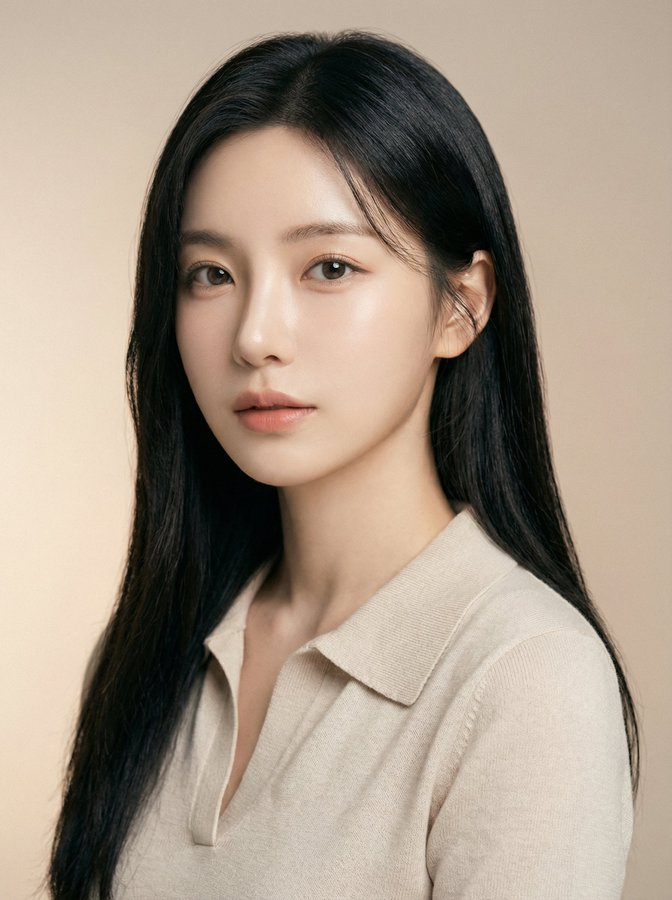
</div>

**中文提示词：**
```
将附件图片人物转换为一张韩式风格的专业形象照，比例3:4。构图与人物:构图: 半身照，采用简约的非中心构图，留有呼吸感的恰当空白。人物: 面部特写，聚焦于清澈自然的眼神和面部表情。动作和姿态要求放松、协调且自然，流露出一种不经意的优雅。风格: 都市休闲风格的简约着装，如纯色裙装、纯色衬衫或针织衫，干净利落。
光影与氛围:光线: 运用柔和的蝴蝶光或伦勃朗光，营造出清晰、立体的面部轮廓，同时让皮肤看起来通透、细腻。眼中需要有明亮自然的眼神光，作为画面的情感焦点。氛围:整体氛围追求安静、清澈、温柔。画面呈现出一种高级空气感和呼吸感。背景与质感:背景: 纯色或带有低饱和度色彩的柔和渐变背景，营造出简约、干净且有层次感的空间氛围。质感: 画面质感细腻，色彩柔和，可带有轻微的、几乎不可见的胶片颗粒感，增加一丝温暖和复古的韵味。避免任何干扰性的文字或标志，让焦点完全集中在人物的情绪和气质上。
保持图片人物面部特征保持一致。
```

<a id="prompt-737"></a>
## 案例 737：人物转风格化的3D人物漫画 (来源 [@NanoBanana](https://x.com/NanoBanana/status/1996554636166049928)) 模型：Nano banana pro

<div style="display: flex; justify-content: space-between;">
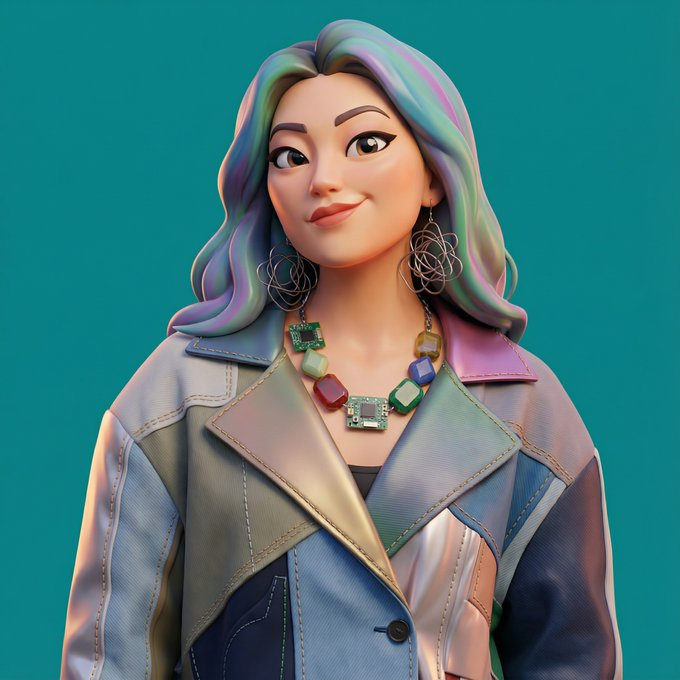
</div>

**提示词：**
```
A highly stylized 3D caricature of the person in the uploaded image, with expressive facial features, and playful exaggeration. Rendered in a smooth, polished style with clean materials and soft ambient lighting. Bold color background to emphasize the character’s charm and presence.
```

**中文提示词：**
```
根据上传的图片，创作一幅风格化的3D人物漫画，面部表情丰富，风格夸张活泼。渲染风格流畅精致，材质干净，环境光柔和。背景采用醒目的色彩，以突出人物的魅力和存在感。
```

<a id="prompt-736"></a>
## 案例 736：MacBook自拍（情侣款） (来源 [@YaseenK7212](https://x.com/YaseenK7212/status/1996186805398364512)) 模型：Nano banana pro

<div style="display: flex; justify-content: space-between;">
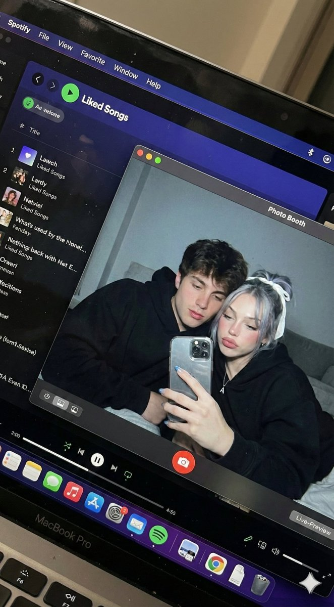
</div>

**提示词：**
```
{
  "task_configuration": {
    "task_type": "screen_simulation_photorealism",
    "target_model": "SDXL_1.0_Refiner",
    "aspect_ratio": "3:4",
    "resolution": {
      "width": 1152,
      "height": 1536
    }
  },
  "visual_hierarchy": {
    "layer_1_physical_macro": {
      "camera_angle": "Downward-angled, high-angle",
      "framing": "MacBook screen filling 95% of frame",
      "surface_imperfections": [
        "subtle pixel-grid texture (moire)",
        "tiny dust particles on glass",
        "faint ambient light reflection on glossy screen",
        "fingerprint smudges"
      ],
      "foreground_anchor": "Thin strip of physical keyboard visible at lower edge"
    },
    "layer_2_digital_interface": {
      "theme": "Dark Mode (macOS)",
      "window_layout": {
        "left_panel": "Spotify 'Liked Songs' playlist (dimmed)",
        "right_panel": "Photo Booth live-preview window (dominant focus)"
      }
    },
    "layer_3_nested_subject_content": {
      "context": "Inside the Photo Booth window",
      "environment": "Dim bedroom, off-white wall, rumpled bedding",
      "lighting_simulation": "Cool screen glow mixed with warm skin tones, deep nocturnal shadows",
      "subjects": {
        "shared_attributes": [
          "Oversized black hoodies",
          "Hoods pushed back (faces fully visible)",
          "Reclining pose",
          "Looking at screen"
        ],
        "subject_a_guy": {
          "identity_target": "reference_image_male.jpg",
          "action": "Holding phone in right hand with clear reflective case",
          "position": "Right/Center"
        },
        "subject_b_girl": {
          "identity_target": "reference_image_female.jpg",
          "action": "Resting closely beside Subject A",
          "position": "Left/Center"
        }
      }
    }
  },
  "prompt_assembly": {
    "positive_prompt": "Hyper-realistic downward shot of a MacBook screen. The screen surface has visible dust, pixel grid, and reflection. The screen displays a Photo Booth window showing a couple in a dark room. [Subject Descriptions]. They are wearing black hoodies. The lighting is low-key, candid, nocturnal, blue-ish screen glow. High fidelity, raw photo, unedited.",
    "negative_prompt": "vector art, screenshot, flat digital image, clean glass, perfect screen, daylight, bright studio lights, cartoon, 3d render, painting, watermark"
  },
  "identity_preservation_settings": {
    "strictness_level": "CRITICAL",
    "methodology": {
      "face_restoration": false,
      "note": "Disable generic face restorers (CodeFormer) to avoid 'plastic' look. Use IP-Adapter.",
      "control_net_stack": [
        {
          "unit": "ControlNet_Tile",
          "weight": 0.4,
          "purpose": "To maintain the text/interface sharpness"
        },
        {
          "unit": "IP-Adapter_FaceID_Plus",
          "weight": 0.95,
          "region_mask": "Photo Booth Window Area Only",
          "purpose": "To force exact facial identity match for both subjects"
        }
      ]
    }
  },
  "rendering_parameters": {
    "sampler": "DPM++ 3M SDE Exponential",
    "steps": 40,
    "cfg_scale": 5.5,
    "denoising_strength": 0.35
  }
}
```

**中文提示词：**
```
{
"task_configuration": {
"task_type": "screen_simulation_photorealism",
"target_model": "SDXL_1. 0_精炼器",
"aspect_ratio": "3:4",
“解决”： {
宽度：1152，
“高度”：1536
}
},
"visual_hierarchy": {
"layer_1_physical_macro": {
"camera_angle": "向下倾斜，高角度",
“画面构图”：“MacBook 屏幕占据画面 95% 的面积”，
"surface_imperfections": [
“微妙的像素网格纹理（莫尔纹）”，
“玻璃上的微小灰尘颗粒”，
“光滑屏幕上的微弱环境光反射”
“指纹污迹”
],
"foreground_anchor": "键盘下边缘可见的细长物理键盘条"
},
"layer_2_digital_interface": {
“主题”：“深色模式（macOS）”，
"window_layout": {
"left_panel": "Spotify“喜欢的歌曲”播放列表（暗淡）",
"right_panel": "Photo Booth 实时预览窗口（主要焦点）"
}
},
"layer_3_nested_subject_content": {
“上下文”：“照相亭窗口内”，
“环境”：“昏暗的卧室，米白色的墙壁，凌乱的床铺”，
"lighting_simulation": "冷色调的屏幕光晕与暖色调的肤色混合，深邃的夜色阴影",
“主题”：{
"shared_attributes": [
“超大号黑色连帽衫”，
“兜帽向后推（脸完全露出来）”
“斜倚姿势”，
“看着屏幕”
],
"subject_a_guy": {
"identity_target": "reference_image_male.jpg",
“动作”：“右手持手机，手机壳为透明反光材质”，
“位置”: “右/中”
},
"subject_b_girl": {
"identity_target": "reference_image_female.jpg",
“动作”：“紧挨着受试者 A 休息”，
位置：左/中
}
}
}
},
"prompt_assembly": {
"positive_prompt": "一张超逼真的MacBook屏幕俯拍照片。屏幕表面可见灰尘、像素网格和反光。屏幕上显示着一个Photo Booth窗口，里面是一对情侣在黑暗的房间里。[人物描述]。他们穿着黑色连帽衫。光线昏暗，自然，夜色，屏幕泛着淡淡的蓝色光晕。高保真，原始照片，未经编辑。"
"negative_prompt": "矢量图、屏幕截图、平面数字图像、干净的玻璃、完美的屏幕、日光、明亮的摄影棚灯光、卡通、3D渲染、绘画、水印"
},
"identity_preservation_settings": {
"严格级别": "严重",
“方法论”：{
“face_restoration”：false，
注意：禁用通用面部恢复器（CodeFormer）以避免出现“塑料感”。使用 IP 适配器。
"control_net_stack": [
{
"单元": "ControlNet_Tile",
“权重”：0.4，
“目的”： “保持文本/界面清晰度”
},
{
"unit": "IP-Adapter_FaceID_Plus",
“权重”：0.95，
"region_mask": "仅限照相亭窗口区域",
目的：强制两个受试者的面部身份完全匹配
}
]
}
},
"渲染参数": {
"采样器": "DPM++ 3M SDE 指数",
“步骤”：40，
"cfg_scale": 5.5,
去噪强度：0.35
}
}
```

<a id="prompt-735"></a>
## 案例 735：超现实的数字艺术吊死鬼 (来源 [@servasyy](https://x.com/servasyy/status/1996469072037298657)) 模型：Nano banana pro

<div style="display: flex; justify-content: space-between;">
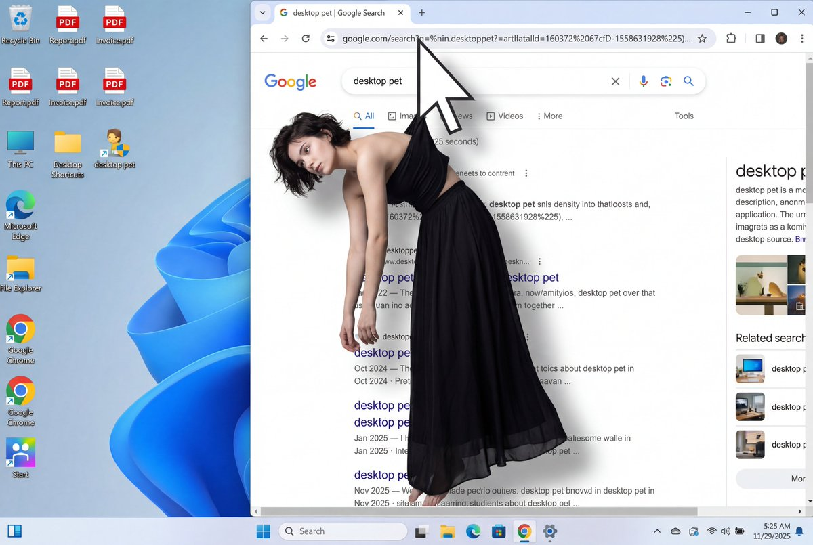
</div>

**提示词：**
```
A surreal digital art composition showing a young woman with dark short hair wearing a black strapless top and long flowing black skirt, viewed from a front-facing angle. The white arrow-shaped computer mouse cursor grips a small portion of fabric at the back of her strapless top, between her shoulder blades, suspending her from behind. Her body displays clear physics of being hung from the back: her torso leans slightly forward, shoulders pulled back and upward from the suspension point behind her, creating visible tension in her posture. Her chest and upper body are pushed forward slightly due to the back suspension. Her bare arms hang completely limp and loose at her sides, dangling naturally downward. Her head tilts to her left shoulder with a contemplative, resigned expression. The black skirt flows down naturally. The overall posture clearly shows she is being lifted and suspended by a grip point on her back, with her body weight pulling downward while being held from behind.

She is seamlessly integrated into a photorealistic Windows 11 desktop screenshot. The scene shows a Google Chrome browser window occupying the right two-thirds of the screen, partially overlapping desktop icons on the left. The mouse cursor is positioned in the Chrome address bar, with the woman's suspended body hanging downward into the Google search results area below.

Desktop left side shows multiple icons including: Recycle Bin, PDF files, This PC, Desktop Shortcuts, desktop pet, Microsoft Edge, File Explorer, Google Chrome shortcuts, and various other application icons against a vibrant blue and purple flowing abstract background.

Chrome browser displays: tab labeled "desktop pet | Google Search", address bar with "http://google.com/search?q=%in.desktoppet?=artlatalld=160372%2067cfD-1558631928%225)...", search bar with "desktop pet" text, navigation options (All, Image, News, Videos, More, Tools). Search results show fragmented text about desktop pets with URLs and dates. Right sidebar shows "desktop pet" heading with descriptive text and related information.

Windows 11 taskbar at bottom features: Search, Task View, File Explorer, Microsoft Edge, Store, Photos, Google Chrome, Calendar icons, plus Wi-Fi, Speaker, Battery system tray icons, and time showing "5:25 AM 11/29/2025".

Flat perspective as if viewing screen directly, even diffused lighting from screen casting subtle shadow of woman and cursor onto search results. Emphasis on the hanging, suspended posture from back grip point. Clean, bright, neutral color grading with modern OS aesthetic. Photorealistic digital elements with surreal human integration.
```

**中文提示词：**
```
这是一幅超现实的数字艺术作品，画面中一位年轻女子，留着深色短发，身穿黑色抹胸上衣和飘逸的黑色长裙，视角为正面。白色的箭头形鼠标光标抓住她抹胸上衣后背肩胛骨之间的一小块布料，将她从背后悬吊起来。她的身体姿态清晰地展现出被后悬吊的物理特性：躯干略微前倾，双肩因后方的悬吊点而向后向上拉伸，使她的姿势呈现出明显的张力。由于背部的悬吊，她的胸部和上半身略微向前突出。她裸露的双臂完全无力地垂在身体两侧，自然下垂。她的头微微偏向左肩，神情沉思而无奈。黑色长裙自然垂落。整体姿态清晰地表明，她被背部的某个抓点提起并悬吊起来，身体的重量在后方支撑的同时向下牵拉。

她完美地融入了一张逼真的Windows 11桌面截图中。画面右侧三分之二的区域被一个谷歌Chrome浏览器窗口占据，与左侧的桌面图标部分重叠。鼠标光标位于Chrome的地址栏中，而女子悬空的身体则垂落到下方的谷歌搜索结果区域。

桌面左侧显示多个图标，包括：回收站、PDF 文件、此电脑、桌面快捷方式、桌面宠物、Microsoft Edge、文件资源管理器、Google Chrome 快捷方式以及各种其他应用程序图标，背景是充满活力的蓝色和紫色流动抽象背景。

Chrome浏览器显示：标签页标题为“桌面宠物 | Google 搜索”，地址栏显示“ http://google.com/search?q=%in.desktoppet?=artlatalld=160372%2067cfD-1558631928%225 ) ..." ，搜索栏显示“桌面宠物”字样，导航选项包括“全部”、“图片”、“新闻”、“视频”、“更多”、“工具”。搜索结果显示关于桌面宠物的零散文本，包含网址和日期。右侧边栏显示“桌面宠物”标题，以及描述性文字和相关信息。

Windows 11 底部任务栏功能包括：搜索、任务视图、文件资源管理器、Microsoft Edge、应用商店、照片、Google Chrome、日历图标，以及 Wi-Fi、扬声器、电池系统托盘图标，时间显示为“2025 年 11 月 29 日 上午 5:25”。

平面视角，如同直接观看屏幕，屏幕漫射光甚至在搜索结果上投射出女性和光标的微妙阴影。着重表现从背部握点处悬挂的姿态。干净、明亮、中性的色彩分级，符合现代操作系统美学。逼真的数字元素与超现实的人体融合。
```

<a id="prompt-734"></a>
## 案例 734：将漫画人物转化为超逼真的人类 (来源 [@dotey](https://x.com/dotey/status/1996281855503372510)) 模型：Nano banana pro

<div style="display: flex; justify-content: space-between;">
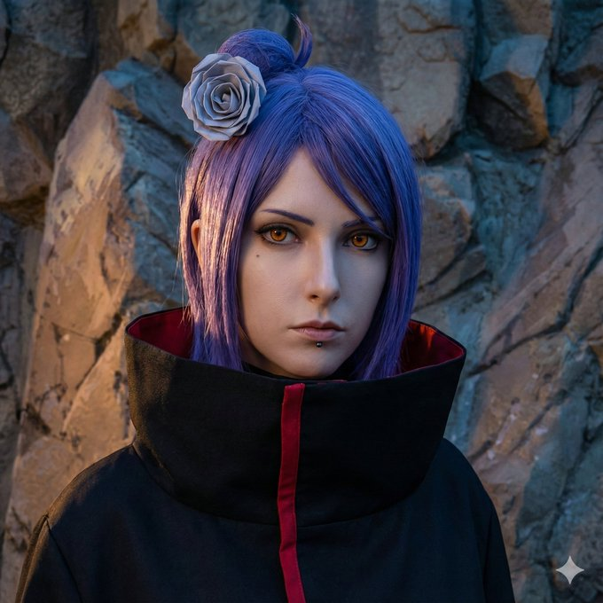
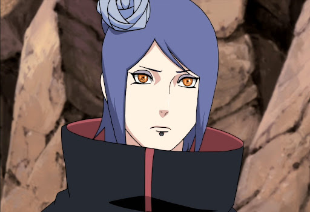
</div>

**提示词：**
```
Transform this comic character into an ultra-realistic human while preserving the original hairstyle, outfit, facial expression, and overall character identity.
The entire scene should use deep depth of field, keeping both the model and the environment extremely sharp, creating an immersive, cinematic smartphone photography look.

STYLE:
- Cinematic ultra-realistic fashion photography
- High-resolution smartphone camera aesthetic with crisp, sharp details
- Dramatic lighting contrast between warm work lights and cool twilight tones
- the model is the main subject while retaining rich environmental details

TECHNICAL SPECS:
- Camera: flagship smartphone camera
- Lens: standard built-in phone lens
- Aperture: f/8–f/11 for deep depth of field
- Resolution: 4K or higher

NEGATIVE PROMPT:
- blurry background, shallow depth of field, bokeh
- out of focus, distorted face
- cartoon, anime, CGI character, illustration, painting look
- low quality, pixelation, noise
- harsh direct sunlight or overexposed lighting
```

**中文提示词：**
```
将漫画人物转化为超逼真的人类

----提示----
将这个漫画人物变成一个超逼真的人类，同时保留原有的发型、服装、面部表情和整体人物特征。
整个场景应使用大景深，使模特和环境都非常清晰，从而营造出沉浸式、电影般的智能手机摄影效果。

风格：
- 电影级超写实时尚摄影
- 高分辨率智能手机相机美学，呈现清晰锐利的细节
- 暖色调工作灯与冷色调黄昏灯光之间形成鲜明的明暗对比
模型是主要对象，同时保留了丰富的环境细节。

技术规格：
- 摄像头：旗舰智能手机摄像头
- 镜头：标准内置手机镜头
- 光圈：f/8–f/11，以获得较大的景深
分辨率：4K 或更高

否定提示：
- 背景虚化、浅景深、散景
模糊不清、扭曲的脸
卡通、动画、CGI角色、插画、绘画风格
画质差、像素化、噪点
- 强烈的阳光直射或过度曝光的灯光
```

<a id="prompt-733"></a>
## 案例 733：一张甜美写实的女生肖像照 (来源 [@kingofdairyque](https://x.com/kingofdairyque/status/1996180407633768944)) 模型：Nano banana pro

<div style="display: flex; justify-content: space-between;">
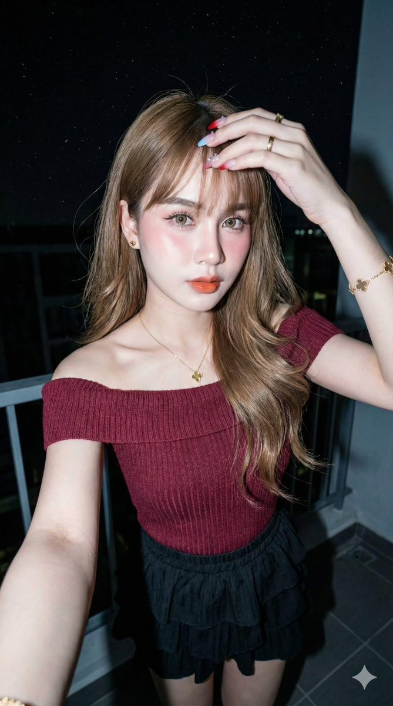
</div>

**提示词：**
```
Realistic portrait of a sweet-faced woman in her mid-20s, with her face, eyes, ears, nose, and mouth completely unedited, preserving 100% facial accuracy. She is standing facing the camera, joyfully touching her slightly messy bangs with her fingers. Her hair is light brown, long, gently wavy with bangs, moving naturally according to her pose. She wears a gold clover pendant necklace, small gold rings on both hands, and a gold clover bracelet. Her nails are coffin-shaped with a red-to-sky blue gradient and glitter. Her skin is fair with a reddish tone, bright and radiant, and her body type is ideal. Makeup includes long thick eyelashes, pink blush on cheeks and nose for a goddess-like glow, neatly shaped light brown natural eyebrows, and ombre orange lipstick. She is dressed in a fitted maroon long-sleeve Sabrina knit top paired with a layered black mini ruffle skirt. She stands on her home balcony, raising her right hand to sweep her bangs with joy, with a neutral, simple, and energetic expression. The background shows a starry night sky as seen from the balcony. The scene is illuminated by a bright direct camera flash, creating high contrast, bright shadows, and a cool color temperature, giving a raw, sharp night-photography effect. The image is 8K resolution with extremely smooth skin texture, sharp focus, and a masterpiece quality, in portrait orientation.
```

**中文提示词：**
```
这是一张写实的肖像照，照片中的女子面容甜美，二十五六岁。她的脸部、眼睛、耳朵、鼻子和嘴巴都未经任何修饰，百分百还原了真人。她面向镜头站立，手指轻抚着略显凌乱的刘海，显得神采奕奕。她一头浅棕色的长发，微微卷曲，刘海随着她的姿态自然飘动。她佩戴着一条金色的四叶草吊坠项链，双手各戴一枚小巧的金戒指，手上还戴着一条金色的四叶草手链。她的指甲是棺材形，由红渐变至天蓝色，并点缀着闪粉。她的肤色白皙透亮，略带红润光泽，身材匀称完美。妆容精致，浓密纤长的睫毛，双颊和鼻梁上轻扫粉色腮红，更添女神般的光彩，眉形自然，浅棕色的眉毛修剪得十分整齐，唇色则是渐变橘色。她身着一件修身的酒红色长袖Sabrina针织上衣，搭配一条黑色层叠荷叶边迷你裙。她站在自家阳台上，抬起右手，喜悦地拂去额前的碎发，神情自然、清新而充满活力。背景是透过阳台看到的繁星点点的夜空。明亮的相机闪光灯直射画面，营造出高对比度、明亮的阴影和冷色调，呈现出一种原始而锐利的夜景摄影效果。这幅8K分辨率的竖幅照片，拥有极其细腻的肌肤纹理、清晰的焦点和精湛的画质，堪称艺术杰作。
```

<a id="prompt-732"></a>
## 案例 732：厨师服极其精细的微缩场景 (来源 [@AleRVG](https://x.com/AleRVG/status/1995770114222801011)) 模型：Nano banana pro

<div style="display: flex; justify-content: space-between;">
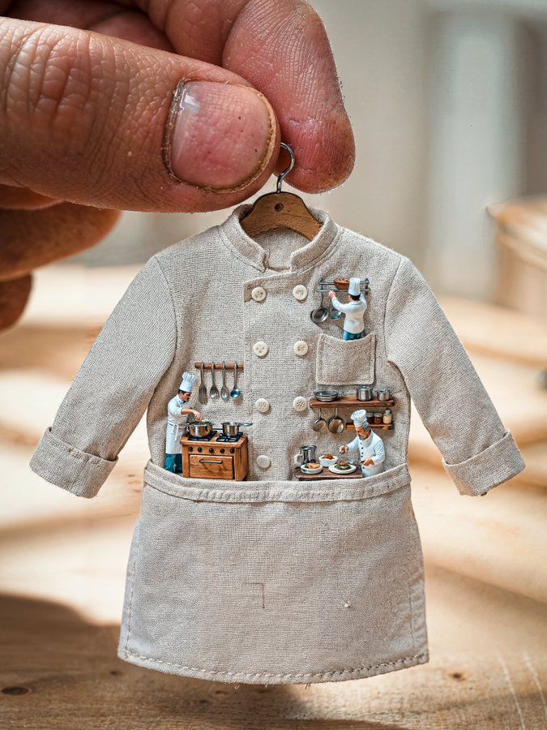
</div>

**提示词：**
```
Extreme detailed miniature diorama: A tiny chef's jacket held between two human fingers, suspended by a wooden hanger. Inside the jacket interior, a complex wooden scaffolding structure. Tiny chef figures (microscopic scale) - one cooking and preparing dishes within tiny pocket kitchens, one plating and presenting food, one organizing tiny kitchen equipment and ingredients. The chef's jacket shows intricate fabric texture with visible chef's buttons and pocket details. Realistic miniature photography, soft diffused lighting. Scale: human fingers → tiny chef jacket → microscopic chef figures. Background: warm wood tones, soft shadows. Whimsical mood - a miniature cooking station contained within physical chef's jacket.
```

**中文提示词：**
```
极其精细的微缩场景：一件迷你厨师服被两根手指夹住，悬挂在木制衣架上。厨师服内部是一个复杂的木制脚手架结构。几个微型厨师人偶（微观比例）——一个在微型厨房里烹饪和准备菜肴，一个摆盘展示美食，一个整理微型厨房用具和食材。厨师服展现出精细的织物纹理，连厨师纽扣和口袋的细节都清晰可见。逼真的微缩摄影，柔和的漫射光。比例：手指→迷你厨师服→微型厨师人偶。背景：温暖的木色调，柔和的阴影。营造出一种奇幻的氛围——一个微型烹饪台被巧妙地隐藏在一件真实的厨师服之中。
```

<a id="prompt-731"></a>
## 案例 731：女生站在黑板旁手里拿着粉笔 (来源 [@saniaspeaks_](https://x.com/saniaspeaks_/status/1996416718873444749)) 模型：Nano banana pro

<div style="display: flex; justify-content: space-between;">
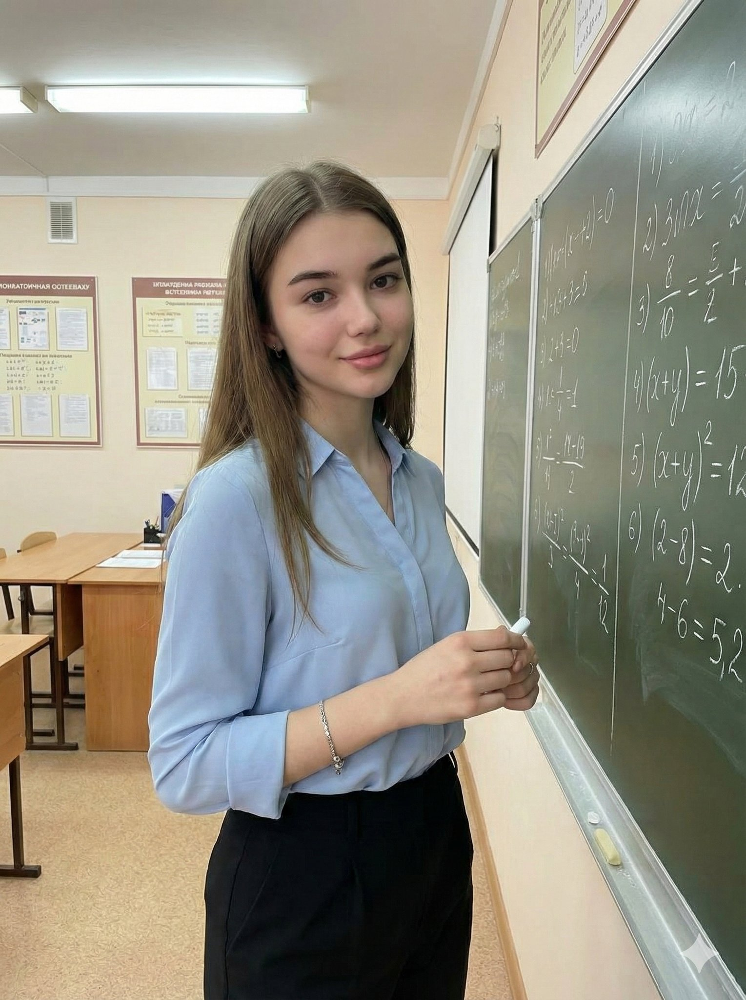
</div>

**提示词：**
```
{
  "image_generation": {
    "face": {
      "preserve_original": true,
      "reference_match": true,
       "photo_style": {
      "type": "indoor classroom portrait",
      "camera_angle": "three-quarter body shot at eye-level",
      "lighting": "soft indoor fluorescent lighting with natural classroom ambience",
      "mood": "friendly, confident, academic",
      "texture": "clean tones, soft shadows, natural skin texture",
      "focus": "sharp focus on subject, slightly blurred classroom background"
    },

    "subject": {
      "pose": "standing beside a chalkboard while holding chalk, looking toward the camera with a calm expression",
      "expression": "soft smile, confident and composed",
      "hair": {
        "style": "long, loose waves",
        "color": "light brown"
      },
      "clothing": {
        "type": "professional, modest classroom outfit",
        "details": "light blue collared blouse paired with a knee-length black skirt or tailored trousers"
      },
      "accessories": {
        "jewelry": "minimal bracelet or small earrings"
      }
    },

    "environment": {
      "setting": "school classroom",
      "background": "chalkboard with handwritten text, bulletin boards, desks, and educational posters",
      "atmosphere": "clean, academic, organized"
    },

    "aesthetic": {
      "style": "modern classroom portrait",
      "features": [
        "natural classroom lighting",
        "realistic academic environment",
        "professional and modest outfit",
        "clean and bright color palette",
        "engaging educational setting"
      ]
    }
  }
}
```

**中文提示词：**
```
{
"image_generation": {
“脸”： {
"preserve_original": true,
"reference_match": true,
"photo_style": {
类型：室内教室肖像，
"camera_angle": "四分之三身像，视线齐平",
“照明”：“柔和的室内荧光照明，营造自然的教室氛围”，
“情绪”：“友好、自信、学术”，
“质感”：“干净的色调，柔和的阴影，自然的肌肤纹理”，
“焦点”： “主体清晰对焦，教室背景略微模糊”
},

“主题”： {
“姿势”：“站在黑板旁，手里拿着粉笔，面带平静的表情看向镜头”，
“表情”：“柔和的微笑，自信沉稳”，
“头发”： {
“风格”：“长长的、蓬松的波浪卷发”，
颜色：浅棕色
},
“衣服”： {
“类型”：“专业、朴素的课堂服装”，
“细节”：浅蓝色翻领衬衫搭配黑色及膝裙或修身长裤
},
“配件”： {
“首饰”：“简约手镯或小耳环”
}
},

“环境”： {
“场景”: “学校教室”
“背景”：“黑板上有手写文字，公告板，课桌和教育海报”，
氛围：干净、学术、有条理
},

“审美的”： {
“风格”：“现代教室肖像”，
“特征”： [
“自然教室照明”，
“真实的学术环境”，
“专业而朴素的着装”，
“干净明亮的色彩搭配”，
“引人入胜的教育环境”
]
}
}
}
```

<a id="prompt-730"></a>
## 案例 730：倚靠在柜台上的女生 (来源 [@xmiiru_](https://x.com/xmiiru_/status/1996516114822471901)) 模型：Nano banana pro

<div style="display: flex; justify-content: space-between;">
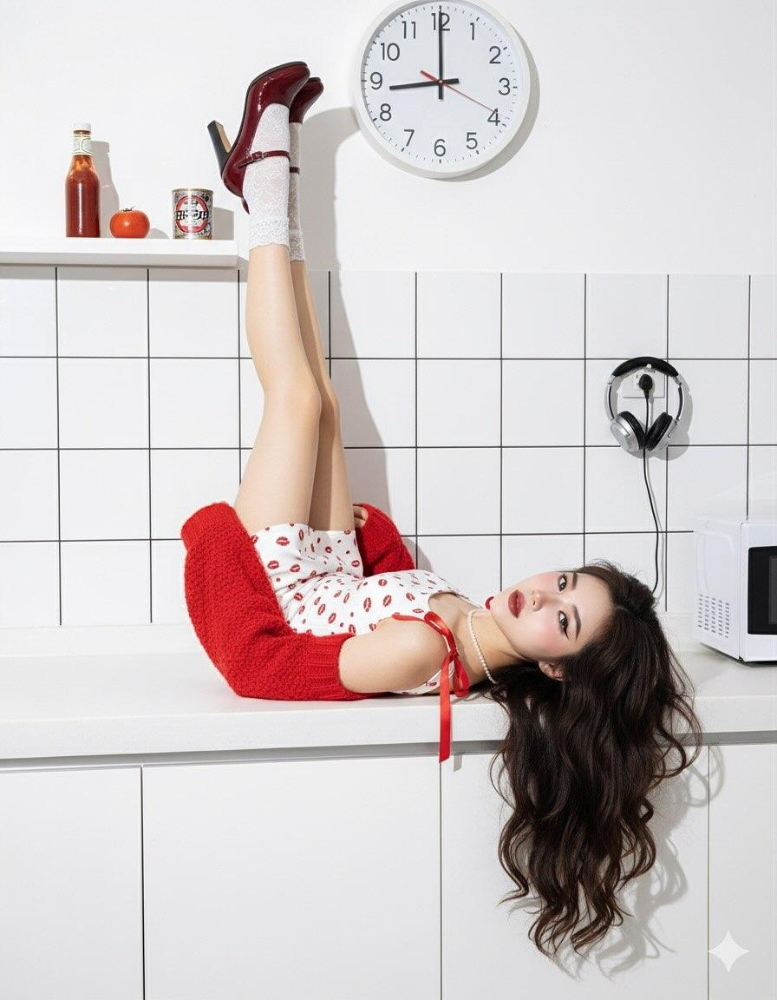
</div>

**提示词：**
```
{
  "prompt": {
    "scene": "white kitchen countertop",
    "pose": {
      "head": "resting on counter",
      "upper_body": "leaning against counter",
      "arm": "dangling downward",
      "legs": "raised and resting against wall"
    },
    "outfit": {
      "dress": "short white dress with red patterns and ribbon details",
      "cardigan": "red cardigan slipping off one shoulder"
    },
    "style": "casual yet stylized look",
    "subject": "user lying sideways across countertop"
  }
}
```

**中文提示词：**
```
{
“提示词”： {
“场景”：“白色厨房台面”，
"姿势": {
“头部”：“靠在柜台上”，
"upper_body": "倚靠在柜台上",
“手臂”： “向下垂落”，
“双腿”：“抬起并靠在墙上”
},
“全套服装”： {
“连衣裙”：“带有红色图案和丝带装饰的白色短连衣裙”，
“开襟羊毛衫”： “红色开襟羊毛衫从一侧肩膀滑落”
},
“风格”：“休闲又不失格调的造型”，
“主题”：“用户侧卧在柜台上”
}
}
```

<a id="prompt-729"></a>
## 案例 729：一幅12张独立照片的秋季时尚拼贴画 (来源 [@ShreyaYadav___](https://x.com/ShreyaYadav___/status/1996250545884155933)) 模型：Nano banana pro

<div style="display: flex; justify-content: space-between;">
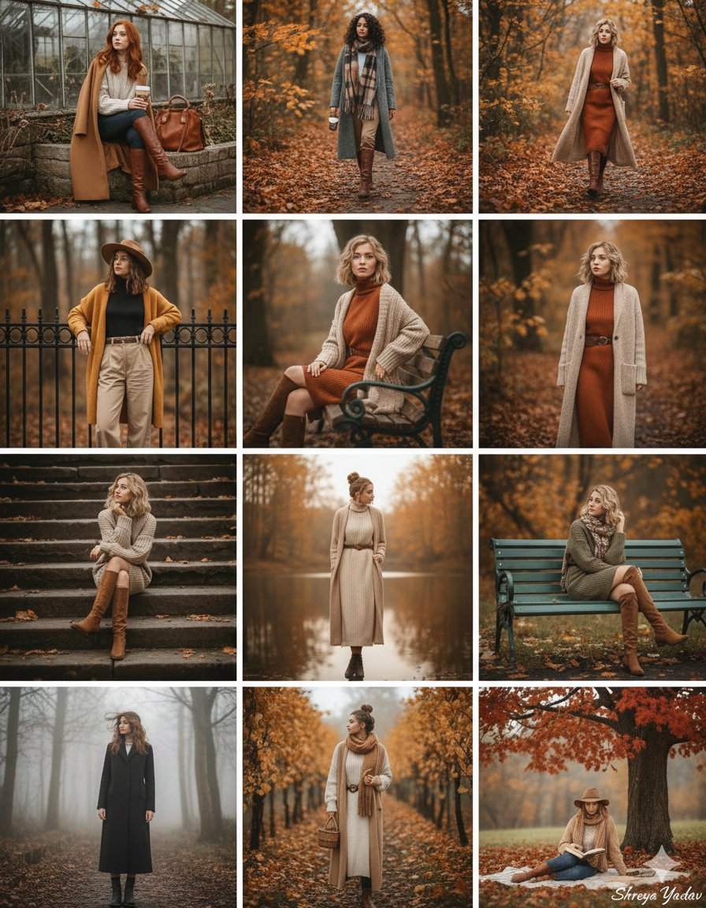
</div>

**提示词：**
```
Create a high‑resolution autumn fashion collage composed of 12 separate photos arranged in a neat grid, each featuring a stylish young woman with different random faces and hairstyles, not resembling any real or famous person. Show her in a variety of cozy outdoor poses: sitting by an old glass greenhouse with a takeaway coffee cup, walking along a tree‑lined path covered in orange leaves,sitting alone on a wooden bench deep in the forest, leaning against a park fence, resting on stone steps with a leather tote bag, lounging on a green park bench in a short dress and knee‑high boots, sitting sideways on a bench, standing near a calm lake lined with orange trees, and standing on a foggy path framed by tall trees. Outfits should mix long wool coats, oversized sweaters, scarves, wide‑brim hat, neutral trousers, knit dresses, and boots in earthy toneslike beige, brown, cream, gray, and black; lighting is warm golden hour with soft, cinematic color grading, shallow depth of field and creamy bokeh, giving the entire collage a cohesive, high‑end editorial influencer aesthetic
Signature: Shreya Yadav
```

**中文提示词：**
```
创作一幅高分辨率的秋季时尚拼贴画，由12张独立照片组成，排列成整齐的网格状。每张照片都展现一位时尚的年轻女性，她们的脸型和发型各不相同，随机选择，且不能与任何真实人物或名人相似。照片中，她可以摆出各种舒适的户外姿势：坐在古老的玻璃温室旁，手捧一杯外带咖啡；沿着铺满橙叶的林荫小道漫步；独自坐在森林深处的木椅上；倚靠在公园的围栏上；手提皮质手提包，倚靠在石阶上；身着短裙和过膝长靴，慵懒地躺在绿色的公园长椅上；侧身坐在长椅上；站在宁静的湖边，湖畔环绕着橙树；以及站在雾气弥漫、高大树木环绕的小路上。服装搭配应包括长款羊毛大衣、宽松毛衣、围巾、宽檐帽、中性色长裤、针织连衣裙和靴子，颜色以米色、棕色、奶油色、灰色和黑色等大地色系为主。温暖的黄金时段光线，柔和的电影级色彩调校，浅景深和奶油般的散景，赋予整幅拼贴画一种和谐统一、高端时尚的网红美学风格。
签名：Shreya Yadav
```

<a id="prompt-728"></a>
## 案例 728：一张黑白影棚肖像照 (来源 [@_imfaizan18](https://x.com/_imfaizan18/status/1996220956201881878)) 模型：Nano banana pro

<div style="display: flex; justify-content: space-between;">
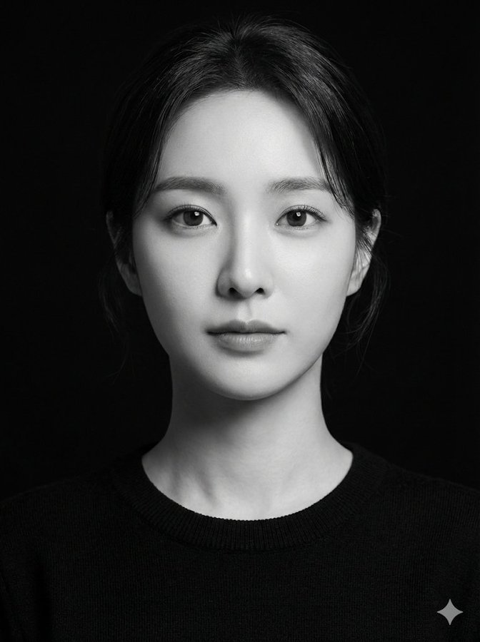
</div>

**提示词：**
```
Black and white studio portrait of the young woman in the uploaded image, looking directly into the camera with a calm, neutral expression. She is wearing a plain black crew-neck sweater. Deep black background with hard-edged studio lighting from the left, crisp facial shadows, sharp highlights on cheekbones, ultra-detailed skin texture, photorealistic, captured with an 85mm lens. 3:4 aspect ratio.
```

**中文提示词：**
```
上传的图片是一张黑白影棚肖像照，照片中的年轻女子面无表情地直视镜头。她身穿一件纯黑色圆领毛衣。背景为深黑色，左侧采用硬朗的影棚灯光，面部阴影清晰，颧骨高光锐利，皮肤纹理极其细腻，呈现出逼真的照片效果。照片使用85mm镜头拍摄，宽高比为3:4。
```

<a id="prompt-727"></a>
## 案例 727：采用垂直切片失真的高级时尚人像 (来源 [@gizakdag](https://x.com/gizakdag/status/1996288172624634336)) 模型：Nano banana pro

<div style="display: flex; justify-content: space-between;">
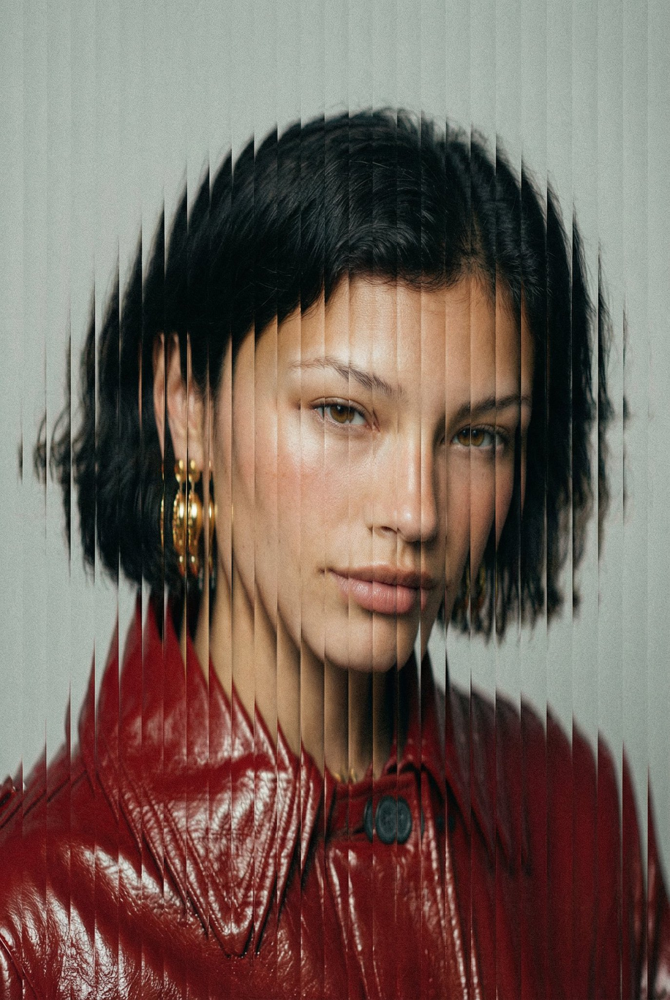
</div>

**提示词：**
```
{
  "style": {
    "name": "vertical_slice_glitch",
    "description": "High-fashion portrait with vertical slice distortion, glitch splitting, and analog-style grain.",
    "elements": {
      "subject": {
        "type": "fashion_portrait",
        "framing": "tight_face_centered",
        "expression": "neutral_or_intense",
        "lighting": "soft_diffused_studio",
        "skin_texture": "realistic_with_blush",
        "wardrobe": "minimal_solid_colors"
      },
      "distortion": {
        "effect": "vertical_slit_scan",
        "slice_count": "40-80",
        "slice_thickness": "thin",
        "displacement_amount": "medium",
        "alignment": "center_weighted",
        "smooth_blend_edges": false,
        "random_offset": true,
        "direction": "vertical"
      },
      "texture": {
        "grain": "medium_heavy",
        "noise": "fine_digital_noise",
        "compression_artifacts": "subtle",
        "film": "matte_fashion_editorial"
      },
      "color_palette": {
        "background": "#F2F2F2",
        "tones": "muted_neutral",
        "accent": "deep_red",
        "contrast": "medium_high"
      },
      "camera": {
        "lens": "85mm_portrait",
        "depth_of_field": "shallow",
        "focus": "eyes",
        "angle": "straight_on"
      }
    }
  },
  "output": {
    "format": "high_fashion_glitch_portrait",
    "aspect_ratio": "3:4",
    "resolution": "high"
  }
}
```

**中文提示词：**
```
{
“风格”： {
"name": "vertical_slice_glitch",
“描述”：“采用垂直切片失真、故障分裂和模拟风格颗粒的高级时尚人像。”
“元素”：{
“主题”： {
"type": "fashion_portrait",
"framing": "tight_face_centered",
"表达方式": "中性或强烈",
"照明": "柔和漫射工作室",
"skin_texture": "realistic_with_blush",
"衣橱": "极简纯色"
},
“失真”： {
“效果”: “垂直狭缝扫描”
"slice_count": "40-80",
"slice_thickness": "薄",
"displacement_amount": "medium",
"对齐方式": "中心加权",
"smooth_blend_edges": false,
"random_offset": true,
“方向”: “垂直”
},
“质地”： {
"grain": "medium_heavy",
"噪声": "精细数字噪声",
"compression_artifacts": "细微的",
"film": "matte_fashion_editorial"
},
"color_palette": {
“背景”: “ #F2F2F2 “,
"色调": "muted_neutral",
"重音": "深红色",
"对比度": "中高"
},
“相机”： {
"镜头": "85mm_人像",
"景深": "浅",
“焦点”：“眼睛”，
"角度": "直视"
}
}
},
“输出”： {
"格式": "high_fashion_glitch_portrait",
"aspect_ratio": "3:4",
分辨率：高
}
}
```

<a id="prompt-726"></a>
## 案例 726：将一张参考图片转化为一段连贯的电影短片 (来源 [@firatbilal](https://x.com/firatbilal/status/1996027417215815991)) 模型：Nano banana pro

<div style="display: flex; justify-content: space-between;">
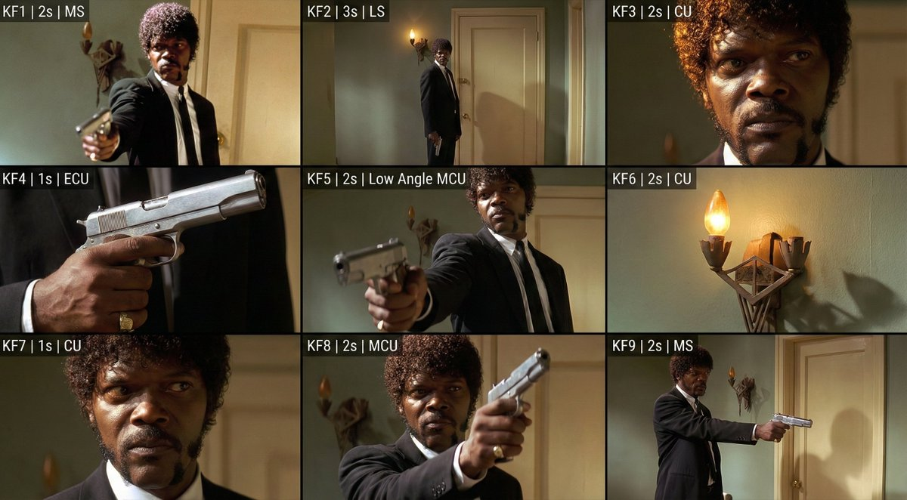
</div>

**提示词：**
```
<role>
You are an award-winning trailer director + cinematographer + storyboard artist. Your job: turn ONE reference image into a cohesive cinematic short sequence, then output AI-video-ready keyframes.
</role>

<input>
User provides: one reference image (image).
</input>

<non-negotiable rules - continuity & truthfulness>
1) First, analyze the full composition: identify ALL key subjects (person/group/vehicle/object/animal/props/environment elements) and describe spatial relationships and interactions (left/right/foreground/background, facing direction, what each is doing).
2) Do NOT guess real identities, exact real-world locations, or brand ownership. Stick to visible facts. Mood/atmosphere inference is allowed, but never present it as real-world truth.
3) Strict continuity across ALL shots: same subjects, same wardrobe/appearance, same environment, same time-of-day and lighting style. Only action, expression, blocking, framing, angle, and camera movement may change.
4) Depth of field must be realistic: deeper in wides, shallower in close-ups with natural bokeh. Keep ONE consistent cinematic color grade across the entire sequence.
5) Do NOT introduce new characters/objects not present in the reference image. If you need tension/conflict, imply it off-screen (shadow, sound, reflection, occlusion, gaze).
</non-negotiable rules - continuity & truthfulness>

<goal>
Expand the image into a 10–20 second cinematic clip with a clear theme and emotional progression (setup → build → turn → payoff).
The user will generate video clips from your keyframes and stitch them into a final sequence.
</goal>

<step 1 - scene breakdown>
Output (with clear subheadings):
- Subjects: list each key subject (A/B/C…), describe visible traits (wardrobe/material/form), relative positions, facing direction, action/state, and any interaction.
- Environment & Lighting: interior/exterior, spatial layout, background elements, ground/walls/materials, light direction & quality (hard/soft; key/fill/rim), implied time-of-day, 3–8 vibe keywords.
- Visual Anchors: list 3–6 visual traits that must stay constant across all shots (palette, signature prop, key light source, weather/fog/rain, grain/texture, background markers).
</step 1 - scene breakdown>

<step 2 - theme & story>
From the image, propose:
- Theme: one sentence.
- Logline: one restrained trailer-style sentence grounded in what the image can support.
- Emotional Arc: 4 beats (setup/build/turn/payoff), one line each.
</step 2 - theme & story>

<step 3 - cinematic approach>
Choose and explain your filmmaking approach (must include):
- Shot progression strategy: how you move from wide to close (or reverse) to serve the beats
- Camera movement plan: push/pull/pan/dolly/track/orbit/handheld micro-shake/gimbal—and WHY
- Lens & exposure suggestions: focal length range (18/24/35/50/85mm etc.), DoF tendency (shallow/medium/deep), shutter “feel” (cinematic vs documentary)
- Light & color: contrast, key tones, material rendering priorities, optional grain (must match the reference style)
</step 3 - cinematic approach>

<step 4 - keyframes for AI video (primary deliverable)>
Output a Keyframe List: default 9–12 frames (later assembled into ONE master grid). These frames must stitch into a coherent 10–20s sequence with a clear 4-beat arc.
Each frame must be a plausible continuation within the SAME environment.

Use this exact format per frame:

[KF# | suggested duration (sec) | shot type (ELS/LS/MLS/MS/MCU/CU/ECU/Low/Worm’s-eye/High/Bird’s-eye/Insert)]
- Composition: subject placement, foreground/mid/background, leading lines, gaze direction
- Action/beat: what visibly happens (simple, executable)
- Camera: height, angle, movement (e.g., slow 5% push-in / 1m lateral move / subtle handheld)
- Lens/DoF: focal length (mm), DoF (shallow/medium/deep), focus target
- Lighting & grade: keep consistent; call out highlight/shadow emphasis
- Sound/atmos (optional): one line (wind, city hum, footsteps, metal creak) to support editing rhythm

Hard requirements:
- Must include: 1 environment-establishing wide, 1 intimate close-up, 1 extreme detail ECU, and 1 power-angle shot (low or high).
- Ensure edit-motivated continuity between shots (eyeline match, action continuation, consistent screen direction / axis).
</step 4 - keyframes for AI video>

<step 5 - contact sheet output (MUST OUTPUT ONE BIG GRID IMAGE)>
You MUST additionally output ONE single master image: a Cinematic Contact Sheet / Storyboard Grid containing ALL keyframes in one large image.
- Default grid: 3x3. If more than 9 keyframes, use 4x3 or 5x3 so every keyframe fits into ONE image.
Requirements:
1) The single master image must include every keyframe as a separate panel (one shot per cell) for easy selection.
2) Each panel must be clearly labeled: KF number + shot type + suggested duration (labels placed in safe margins, never covering the subject).
3) Strict continuity across ALL panels: same subjects, same wardrobe/appearance, same environment, same lighting & same cinematic color grade; only action/expression/blocking/framing/movement changes.
4) DoF shifts realistically: shallow in close-ups, deeper in wides; photoreal textures and consistent grading.
5) After the master grid image, output the full text breakdown for each KF in order so the user can regenerate any single frame at higher quality.
</step 5 - contact sheet output>

<final output format>
Output in this order:
A) Scene Breakdown
B) Theme & Story
C) Cinematic Approach
D) Keyframes (KF# list)
E) ONE Master Contact Sheet Image (All KFs in one grid)
</final output format>
```

**中文提示词：**
```
<role>
你是一位屡获殊荣的预告片导演、摄影师和故事板艺术家。你的任务是：将一张参考图片转化为一段连贯的电影短片，然后输出可用于人工智能视频的关键帧。
</role>

<input>
用户提供：一张参考图片（图片）。
</输入>

<non-negotiable rules - continuity & truthfulness>
1）首先，分析整个构图：识别所有关键主题（人物/群体/车辆/物体/动物/道具/环境元素），并描述空间关系和互动（左/右/前景/背景、朝向、每个人在做什么）。
2) 请勿猜测真实身份、确切地点或品牌归属。请以显而易见的事实为依据。可以推断氛围/情绪，但绝不能将其作为真实情况呈现。
3）所有镜头必须严格保持一致：相同的拍摄对象、相同的服装/造型、相同的环境、相同的拍摄时间和光线风格。只有动作、表情、走位、构图、角度和镜头运动可以改变。
4）景深必须真实：广角镜头景深要深，特写镜头景深要浅，并带有自然的散景效果。整个序列要保持一致的电影级色彩。
5）不要引入参考图中不存在的新角色/物体。如果需要制造紧张/冲突，请通过画面外的方式暗示（阴影、声音、反射、遮挡、目光）。
</non-negotiable rules - continuity & truthfulness>

<goal>
将图像扩展成 10-20 秒的电影片段，具有清晰的主题和情感发展（铺垫→发展→转折→高潮）。
用户将根据你的关键帧生成视频片段，并将它们拼接成最终序列。
</goal>

<step 1 - scene breakdown>
输出结果（含清晰的小标题）：
- 主题：列出每个主要主题（A/B/C…），描述可见特征（服装/材料/形式）、相对位置、朝向、动作/状态以及任何互动。
- 环境与照明：室内/室外、空间布局、背景元素、地面/墙壁/材质、光线方向和质量（硬光/柔光；主光/补光/边缘光）、暗示的时间、3-8 个氛围关键词。
- 视觉锚点：列出 3-6 个在所有镜头中必须保持不变的视觉特征（调色板、标志性道具、主要光源、天气/雾/雨、颗粒/纹理、背景标记）。
</step 1 - scene breakdown>

<step 2 - theme & story>
根据图片，提出以下建议：
主题：一句话。
- 剧情简介：一句简洁的预告片式句子，内容基于画面所能表达的信息。
- 情感弧：4 个节拍（铺垫/发展/转折/高潮），每个节拍一行。
</step 2 - theme & story>

<step 3 - cinematic approach>
选择并解释你的电影制作方法（必须包含）：
- 投篮进位策略：如何从远距离到近距离（或反向）移动以把握投篮节奏
- 摄像机运动方案：推/拉/摇摄/轨道/跟踪/环绕/手持微抖/云台——以及原因
- 镜头和曝光建议：焦距范围（18/24/35/50/85mm 等）、景深倾向（浅/中/深）、快门“感觉”（电影感 vs 纪录片感）
- 光线和色彩：对比度、主色调、材质渲染优先级、可选颗粒（必须与参考风格匹配） 
</step 3 - cinematic approach>

<step 4 - keyframes for AI video (primary deliverable)>
输出关键帧列表：默认 9-12 帧（稍后组装成一个主网格）。这些帧必须拼接成一个连贯的 10-20 秒序列，并具有清晰的 4 拍弧线。
每一帧都必须是同一环境下的合理延续。

每帧必须使用以下精确格式：

[KF# | 建议时长（秒） | 镜头类型（ELS/LS/MLS/MS/MCU/CU/ECU/低角度/仰视/高角度/鸟瞰/插入）]
- 构图：主体位置、前景/中景/背景、引导线、视线方向
- 动作/节拍：肉眼可见的事件（简单、可执行）
- 摄像机：高度、角度、移动（例如，缓慢推进 5% / 横向移动 1 米 / 轻微手持）
- 镜头/景深：焦距（毫米），景深（浅/中/深），对焦目标
- 灯光和调色：保持一致；突出高光/阴影
- 音效/氛围（可选）：一条音轨（风声、城市嗡鸣、脚步声、金属嘎吱声），用于辅助节奏编辑。

硬性要求：
- 必须包含：1 张环境全景照片、1 张亲密特写照片、1 张极致细节特写照片和 1 张力量角度照片（低角度或高角度）。
- 确保镜头之间剪辑驱动的连续性（视线匹配、动作延续、一致的屏幕方向/轴线）。 
</step 4 - keyframes for AI video>

<step 5 - contact sheet output (MUST OUTPUT ONE BIG GRID IMAGE)>
您还必须输出一张主图像：一张包含所有关键帧的电影联系表/故事板网格图。
- 默认网格：3x3。如果关键帧超过 9 个，请使用 4x3 或 5x3，以便每个关键帧都能适应一张图像。
要求：
1) 单个主图像必须包含每个关键帧作为单独的面板（每个单元格一个镜头），以便于选择。
2) 每个面板必须清楚地标明：KF 编号 + 拍摄类型 + 建议持续时间（标签放置在安全边距内，绝不能遮挡主体）。
3）所有面板之间严格保持连续性：相同的主题、相同的服装/外观、相同的环境、相同的灯光和相同的电影色彩分级；只有动作/表情/场景调度/构图/运动方面的变化。
4) 景深变化真实：特写镜头景深较浅，广角镜头景深较深；逼真的纹理和一致的调色。
5) 在主网格图像之后，按顺序输出每个 KF 的完整文本分解，以便用户可以以更高的质量重新生成任何单个帧。
</step 5 - contact sheet output>

<final output format>
按以下顺序输出：
A) 场景分解
B)主题与故事
C) 电影化手法
D)关键帧（KF# 列表）
E) 一张主联系表图片（所有关键指标在一个网格中）
</final output format>
```

<a id="prompt-725"></a>
## 案例 725：朱迪和松果的联名杂志 (来源 [@songguoxiansen](https://x.com/songguoxiansen/status/1996384672402870774)) 模型：Nano banana pro

<div style="display: flex; justify-content: space-between;">
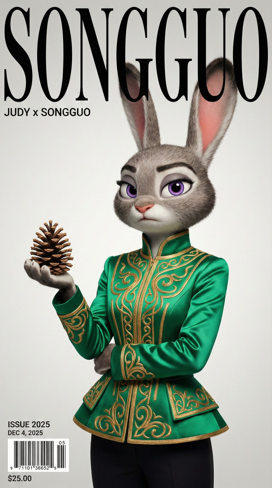
</div>

**中文提示词：**
```
一张宽高比为9:16的垂直肖像照片，展示了一张干净、独立的高级光面时尚杂志封面。杂志顶部是巨大的黑色粗衬线字体标题“SONGGUO”，散发着奢华品牌的氛围。主视觉是《疯狂动物城》朱迪·霍普斯（Judy Hopps）的超写实高级时尚大片。她摆出自信、充满张力的超模姿势，手中精致地拿着一颗天然松果。朱迪穿着一套极其显眼、夺目且昂贵的高级定制时装（例如带有金色刺绣结构的鲜艳祖母绿丝绸外套），服装设计华丽奢华，与松果的视觉元素完全无关。主标题下方是非常简短的副标题：“JUDY x SONGGUO”。封面底部角落包含期号“ISSUE 2025”、今天的日期、一个逼真的条形码和价格“$25.00”。背景是干净、中性的高级摄影棚渐变背景。电影级影棚布光，极高清晰度，8k分辨率，质感丰富。
```

<a id="prompt-724"></a>
## 案例 724：年轻女子在浴室镜子前自拍 (来源 [@gaucheai](https://x.com/gaucheai/status/1996184483343520186)) 模型：Nano banana pro

<div style="display: flex; justify-content: space-between;">
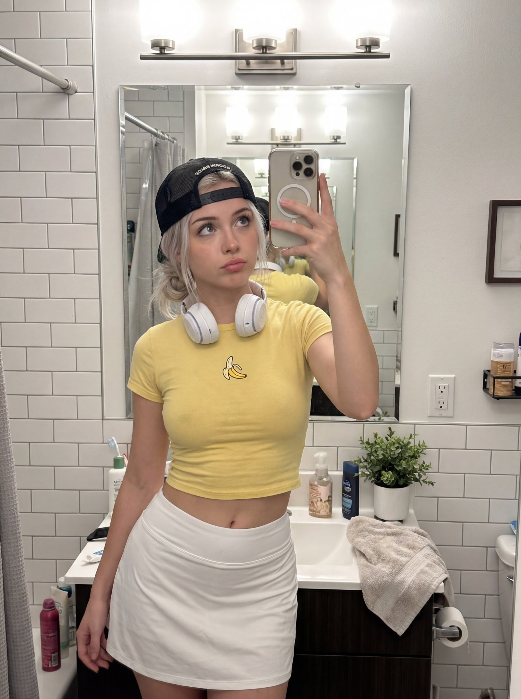
</div>

**提示词：**
```
{
  "subject": {
    "description": "Young woman taking bathroom mirror selfie, innocent doe eyes but the outfit tells another story",
    "mirror_rules": "facing mirror, hips slightly angled, close to mirror filling frame",
    "age": "early 20s",
    
    "expression": {
      "eyes": "big innocent doe eyes looking up through lashes, 'who me?' energy",
      "mouth": "soft pout, lips slightly parted, maybe tiny tongue touching corner",
      "brows": "soft, slightly raised, faux innocent",
      "overall": "angel face but devil body, the contrast is the whole point"
    },
    
    "hair": {
      "color": "platinum blonde",
      "style": "messy bun or claw clip, loose strands framing face, effortless"
    },
    
    "body": {
      "waist": "tiny",
      "ass": "round, full, fabric of shorts riding up and clinging between cheeks, every curve visible through thin athletic material",
      "thighs": "thick, soft, shorts barely containing"
    },
    
    "clothing": {
      "top": {
        "type": "ULTRA mini crop tee",
        "color": "yellow",
        "graphic": "single BANANA logo/graphic",
        "fit": "barely containing chest, fabric stretched tight, ends just below, shows full stomach"
      },
      "bottom": {
        "type": "tight tennis skort or athletic booty shorts",
        "color": "white",
        "material": "thin stretchy athletic fabric",
        "fit": "vacuum tight, riding up, clinging between cheeks, fabric creases visible, leaving nothing to imagination"
      }
    },
    
    "face": {
      "features": "pretty - big eyes, small nose, full lips",
      "makeup": "minimal, natural, lip gloss, no-makeup makeup"
    }
  },

  "accessories": {
    "headwear": {
      "type": "Goorin Bros cap",
      "details": "black with animal patch, worn backwards or tilted"
    },
    "headphones": {
      "type": "over-ear white headphones",
      "position": "around neck"
    },
    "device": {
      "type": "iPhone",
      "details": "visible in mirror, held at chest level"
    }
  },

  "photography": {
    "camera_style": "casual iPhone mirror selfie, NOT professional",
    "quality": "iPhone camera - good but not studio, realistic social media quality",
    "angle": "eye-level, straight on mirror",
    "shot_type": "3/4 body, close to mirror",
    "aspect_ratio": "9:16 vertical",
    "texture": "natural, slightly grainy iPhone look, not over-processed"
  },

  "background": {
    "setting": "regular apartment bathroom",
    "style": "normal NYC apartment bathroom, not luxury",
    "elements": [
      "white subway tile walls",
      "basic bathroom mirror with good lighting above",
      "simple white sink vanity",
      "toiletries visible - skincare bottles, toothbrush holder",
      "towel hanging on hook",
      "maybe shower curtain edge visible",
      "small plant on counter"
    ],
    "atmosphere": "real bathroom, lived-in, normal home",
    "lighting": "good vanity lighting above mirror - bright, even, flattering but not studio"
  },

  "vibe": {
    "energy": "innocent face + sinful body = the whole game",
    "mood": "just got ready for tennis but making content first, 'what?' expression while wearing basically nothing",
    "contrast": "doe eyes + ass eating the shorts = lethal",
    "caption_energy": "'tennis anyone? 🍌' or 'running late oops'"
  }
}
```

**中文提示词：**
```
{
“主题”： {
描述：年轻女子在浴室镜子前自拍，眼神清澈无辜，但她的穿着却透露出截然不同的故事。
“miror_rules”: “面对镜子，臀部略微倾斜，靠近镜子，充满画面”，
“年龄”：“20岁出头”，

“表达”： {
“眼睛”：“一双天真无邪的大眼睛透过睫毛向上望去，带着‘是我吗？’的神情”，
“嘴唇”： “微微嘟起，嘴唇微张，也许有一条小舌头触碰到嘴角”，
“眉毛”：“柔和的，微微上扬的，装出一副天真无邪的样子”，
“总体而言”：“天使般的面孔，魔鬼般的身躯，这种反差正是关键所在”。
},

“头发”： {
“颜色”： “铂金色”
“发型”：“凌乱的发髻或发夹，几缕碎发垂在脸颊两侧，轻松随意”
},

“身体”： {
“腰部”: “纤细”，
“屁股”：“圆润饱满，短裤的布料向上滑，紧贴着两瓣臀肉，透过薄薄的运动面料，每一处曲线都清晰可见。”
“大腿”：“丰满、柔软、短裤几乎遮不住”
},

“衣服”： {
“顶部”： {
"type": "ULTRA mini crop tee",
“颜色”: “黄色”
"图形": "单个香蕉标志/图形",
“紧身”：“勉强遮住胸部，布料紧紧绷着，下摆刚好在胸部下方，露出丰满的腹部”
},
“底部”： {
“类型”：“紧身网球裙裤或运动短裤”，
颜色：白色，
材质：轻薄弹力运动面料
“贴身”：“紧贴皮肤，向上滑，夹在两颊之间，布料褶皱清晰可见，一览无余”
}
},

“脸”： {
“五官”：“漂亮——大眼睛，小鼻子，丰满的嘴唇”，
“妆容”：“极简、自然、唇彩、伪素颜”
}
},

“配件”： {
"头饰": {
"type": "Goorin Bros cap",
“细节”：“黑色，带动物图案贴片，反穿或倾斜穿着”
},
“耳机”： {
“类型”：“白色头戴式耳机”，
位置：颈部周围
},
“设备”： {
"type": "iPhone",
“细节”：“在镜子中可见，举到胸前”
}
},

“摄影”： {
“camera_style”：“随意的 iPhone 镜子自拍，非专业拍摄”
“质量”：“iPhone 相机——不错，但达不到影棚拍摄效果，适合社交媒体使用。”
“角度”: “与眼睛齐平，正对着镜子”，
"shot_type": "3/4 身像，靠近镜子",
"aspect_ratio": "9:16 垂直",
“质感”：“自然、略带颗粒感的 iPhone 风格，未经过度处理”
},

“背景”： {
“设置”: “普通公寓浴室”
“风格”：“普通的纽约公寓浴室，不是豪华的”，
“元素”：[
“白色地铁瓷砖墙”，
“带良好上方照明的普通浴室镜”
“简约白色洗手盆盥洗台”，
“洗漱用品一览无余——护肤品瓶、牙刷架”，
“挂在钩子上的毛巾”
“或许能看到浴帘边缘”，
“柜台上的小植物”
],
“氛围”：“真实的浴室，有人居住的，普通的家”，
“照明”：“镜子上方有合适的梳妆灯——明亮、均匀、讨人喜欢，但不是影棚灯”。
},

"氛围": {
“能量”：“纯洁的脸庞+罪恶的身体=整个游戏”，
“心情”：“刚准备好打网球，但先拍了些内容，一副‘什么？’的表情，几乎没穿衣服。”
“对比”：“小鹿般的眼睛 + 屁股吃短裤 = 致命的”，
"caption_energy": "'有人想打网球吗？ 🍌 ' 或 '迟到了，哎呀'"
}
}
```

<a id="prompt-723"></a>
## 案例 723：手轻轻托着一个城市3D收藏级立体模型 (来源 [@TechieBySA](https://x.com/TechieBySA/status/1996175652140323162)) 模型：Nano banana pro

<div style="display: flex; justify-content: space-between;">
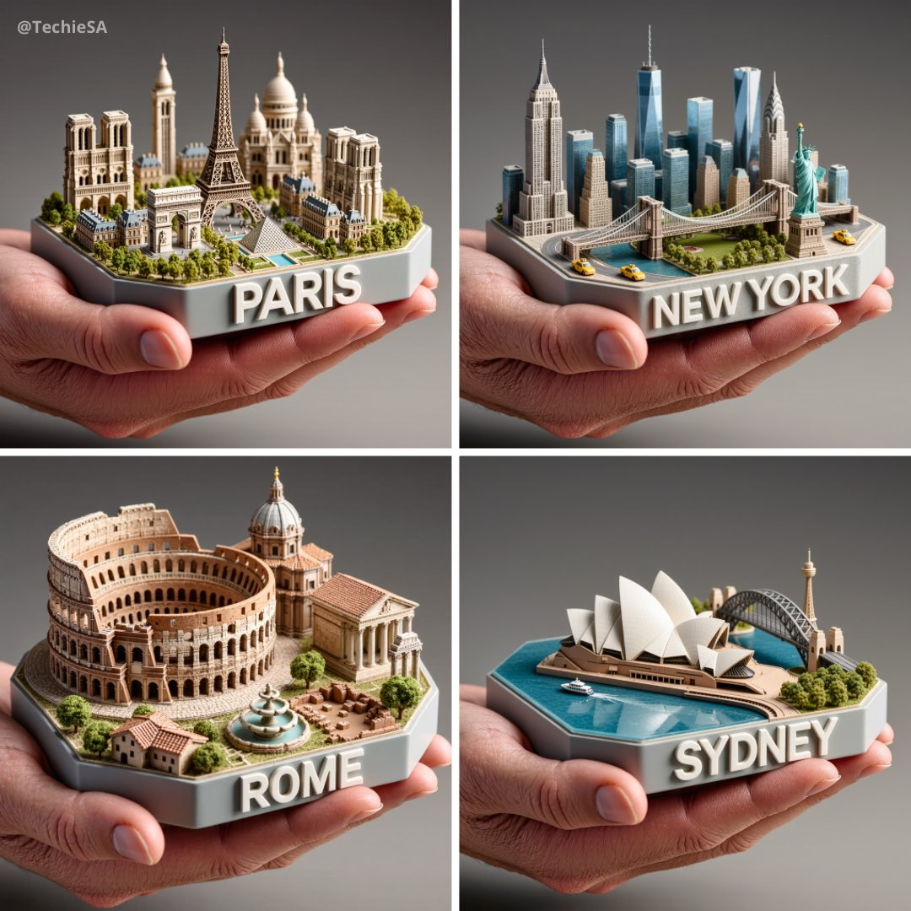
</div>

**提示词：**
```
Create a hyper-realistic 1080x1080 square render of a human hand gently holding a rounded, beveled miniature display platform showcasing a 3D collectible diorama of [CITY]. Feature its most iconic landmarks, small-scale modern and historical architecture, and lush miniature greenery and trees. A bold 3D “[CITY]” sign is cleanly built into the front edge of the platform. Use a refined, desaturated color scheme with matte textures to enhance the realistic scale-model look. Light the scene with soft studio illumination, warm highlights, and subtle depth shadows. Place the composition against a neutral gray gradient backdrop, keeping the same viewing angle and perspective for consistency. Add atmospheric depth, photorealistic textures, and ultra-precise detailing for an 8K quality high-end collectible aesthetic
```

**中文提示词：**
```
创作一幅超逼真的 1080x1080 像素正方形渲染图，描绘一只人手轻轻托着一个圆润的斜面微缩展示台，台上展示着[城市名称]的 3D 收藏级立体模型。模型应包含该城市最具标志性的地标、微缩的现代和历史建筑，以及郁郁葱葱的微缩绿植和树木。醒目的 3D “[城市名称]” 标志清晰地嵌入展示台的前缘。使用精致的低饱和度配色方案和哑光纹理，增强模型的逼真效果。场景采用柔和的摄影棚照明，辅以温暖的高光和微妙的阴影。将画面置于中性灰色渐变背景前，保持相同的视角和透视，以保持一致性。添加大气深度、照片级纹理和超精细的细节处理，打造 8K 高清品质的高端收藏级美感。
```

<a id="prompt-722"></a>
## 案例 722：品牌披萨摄影棚照片 (来源 [@AmirMushich](https://x.com/AmirMushich/status/1995905545476128805)) 模型：Nano banana pro

<div style="display: flex; justify-content: space-between;">
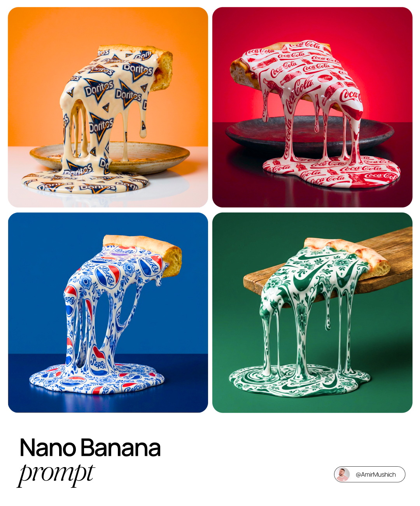
</div>

**提示词：**
```
A surreal studio photograph of a slice of pizza with its cheese topping transformed into a thick, melted, flowing substance resembling molten porcelain or ceramic. This flowing mass is covered in a repeating [BRAND COLORS] and white Delftware-style pattern of the [BRAND NAME] logo and motifs. It drips in long strands from the pizza slice and pools onto the surface below, retaining the blue and white logo pattern even in the puddle. The crust is visible but overwhelmed by the patterned flow. The background is a solid, plain [COLOR COLOR]. Studio lighting, soft shadows.
```

**中文提示词：**
```
一张超现实主义的摄影棚照片，展现了一片披萨，其上的芝士融化成浓稠的、流动的物质，宛如熔化的瓷器或陶瓷。这团流动的物质上覆盖着重复的[品牌颜色]和白色代尔夫特陶器风格的[品牌名称]标志和图案。它从披萨片上滴落，汇聚到下方的表面上，即使在积聚的液体中，蓝白相间的品牌标志图案依然清晰可见。披萨饼皮清晰可见，但已被流动的图案所掩盖。背景是纯色的[颜色]。摄影棚灯光，柔和的阴影。
```

<a id="prompt-721"></a>
## 案例 721：一幅某某角色的素描 (来源 [@CharaspowerAI](https://x.com/CharaspowerAI/status/1996270726026784792)) 模型：Nano banana pro

<div style="display: flex; justify-content: space-between;">
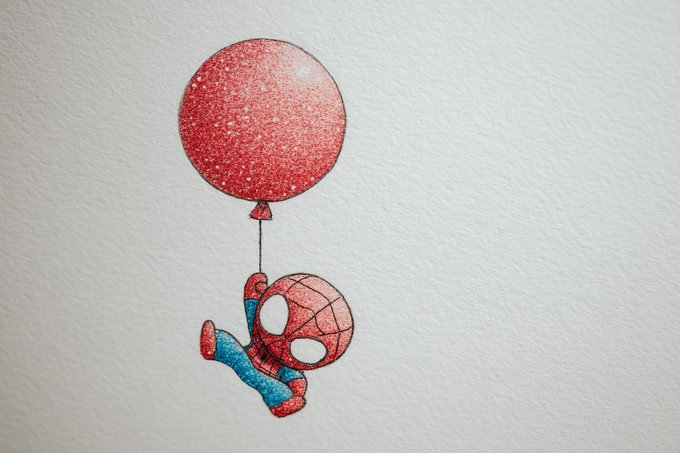
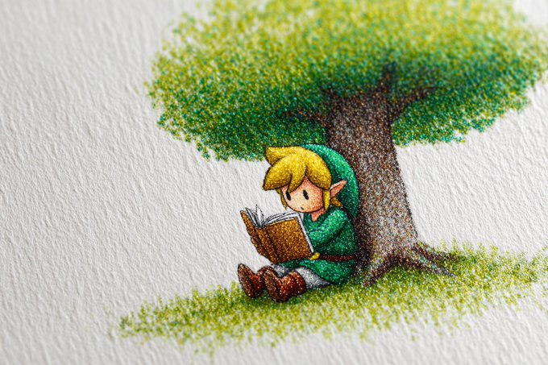
</div>

**提示词：**
```
a drawing of [Character], crayon on white paper, in the style of a children's book illustration – simple, cute, and full-color, with [two glitter accent colors] glitter accents and high detail.
```

**中文提示词：**
```
一幅[角色]的素描，用蜡笔画在白纸上，风格类似儿童绘本插图——简单、可爱、色彩丰富，带有[两种闪光点缀色]闪光点缀和高细节。
```

<a id="prompt-720"></a>
## 案例 720：朱迪Cos春丽尼克Cos小红 (来源 [@songguoxiansen](https://x.com/songguoxiansen/status/1996214786355560844)) 模型：Nano banana pro

<div style="display: flex; justify-content: space-between;">
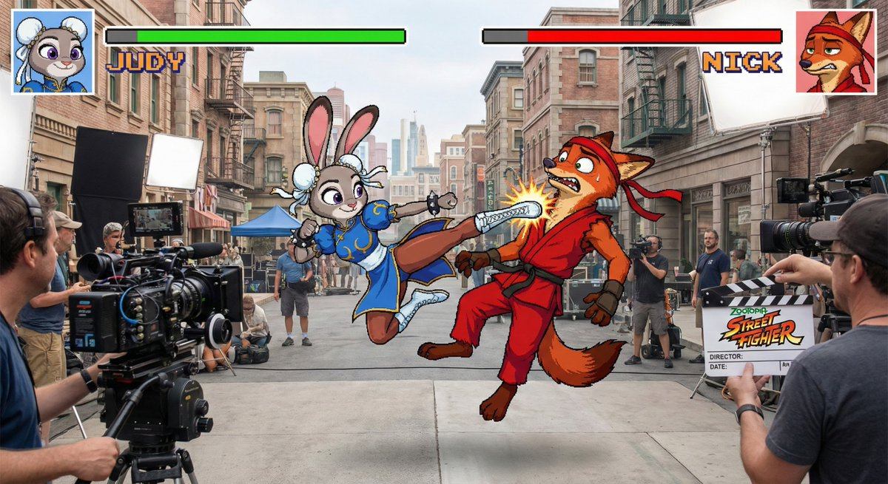
</div>

**中文提示词：**
```
疯狂动物城的朱迪和尼克在电影拍摄场地进行类似街头霸王的对决，朱迪打扮的像春丽，尼克打扮的像小红，朱迪的血条比尼克多，朱迪是绿色，尼克是红色
```

<a id="prompt-719"></a>
## 案例 719：多彩剪贴簿海报风格 (来源 [@songguoxiansen](https://x.com/songguoxiansen/status/1996030625980317699)) 模型：Nano banana pro

<div style="display: flex; justify-content: space-between;">
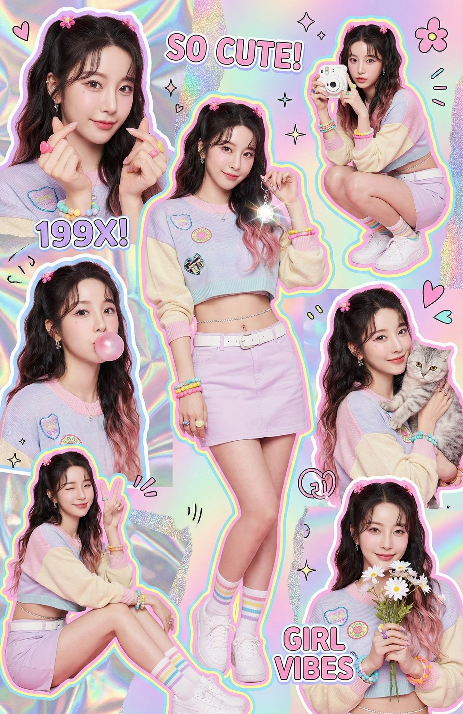
</div>

**提示词：**
```
facelock_identity": "true",
"accuracy": "100%",
scene"Colorful Y2K scrapbook poster aesthetic, vibrant stickers, multiple subjects wearing the same outfit and hairstyle with different poses and cutouts, colorful strokes and lines, frameless collage style. Includes: close-up shot with heart-shape fingers, full-body squatting pose supporting chin while holding a white polaroid camera, mid-shot touching cheek while blowing pink bubblegum, mid-shot smiling elegantly while holding a cat ,seated elegantly with one eye winking and peace sign, and mid-shot holding daisy flowers. Holographic textures, pastel gradients, glitter accents, playful doodles, magazine cut-out graphics, chaotic yet balanced layout, extremely artistic and visually engaging",
main_subject": {
"description": "A young Y2K-styled woman as the main focus in the center of the scrapbook collage.",
"style_pose": "Playful and confident Y2K pose — slight side hip pop, one hand holding a lens-flare keychain, face toward the camera with a cute-cool expression, slight pout, candid early-2000s photo vibe."
outfit": {
"top": "Cropped oversized sweater in pastel color with embroidered patches",
"bottom": "pastel skirt with a white belt",
"socks": "White ankle socks with colorful pastel stripes",
"shoes": "white sneakers",
"accessories": [
"Colorful plastic bracelets",
"Chunky colorful rings",
"Sparkling belly chain",
"hairstyle":
"type": "Y2K half-up half-down",
"details": "Pastel flowers clips,thin front tendrils, wavy dark brown hair with bubblegum-pink tint on the lower strands, iconic early-2000s look."
additional_visuals":
"Heart, star, and butterfly stickers",
"Retro sparkles",
"Polaroid frames",
"Neon outlines",
"Doodle borders",
"Magazine cutout texts: 'SO CUTE!', '199X!', 'GIRL VIBES'",
"Pastel lighting",
"Glossy dreamy retro glow",
"Ultra-aesthetic scrapbook layout"
photography_rendering": {
"color_grading": "Cinematic neon Y2K",
"lighting": "Soft flash lighting","skin_texture": "Smooth glossy finish",
"rendering": "High-detail hyperrealistic Y2K scrapbook tone",
"quality": "8K",
"composition": "Perfectly balanced and artistic"
negative_prompt": "no realism that breaks Y2K aesthetic, no modern 2020s clothing, no messy composition, no blurry face, no distorted hands, no extra limbs, no face warping, no low resolution, no grain, no muted colors, no watermark, no AI artifacts"
```

**中文提示词：**
```
facelock_identity："true",
“准确率”： “100%”，
场景：“色彩缤纷的Y2K剪贴簿海报美学，鲜艳的贴纸，多个人物穿着相同的服装和发型，摆出不同的姿势，并配以剪纸，色彩斑斓的笔触和线条，无框拼贴风格。包含：手指比出心形的特写镜头，全身蹲姿托腮手持白色拍立得相机，中景吹着粉色泡泡糖抚摸脸颊，中景抱着猫优雅微笑，优雅地坐着眨着一只眼睛比出和平手势，以及手持雏菊的中景。全息纹理、柔和的渐变色、闪光点缀、趣味涂鸦、杂志剪贴图案，布局看似混乱却又平衡，极具艺术性和视觉吸引力。”
主主题：{
“描述”：“一位年轻的千禧年风格女性，是剪贴簿拼贴画的中心焦点。”
"style_pose": "俏皮自信的Y2K姿势——微微侧身扭胯，一只手拿着镜头光晕钥匙扣，脸朝向镜头，表情可爱又酷，微微嘟嘴，散发出2000年代初期的抓拍氛围。"
全套服装”： {
上衣：浅色短款宽松毛衣，带有刺绣贴片。
“下装”：“粉色裙子配白色腰带”，
“袜子”：“白色短袜，带有彩色粉彩条纹”，
“鞋子”：“白色运动鞋”，
“配件”： [
“彩色塑料手镯”
“厚重的彩色戒指”，
“闪亮的肚链”
“发型”：
"type": "Y2K 半上半下",
“细节”：“粉彩花朵发夹，前额的细碎发丝，深棕色波浪卷发，发梢带有泡泡糖粉色，2000 年代初期的标志性造型。”
additional_visuals：
“心形、星星和蝴蝶贴纸”
“复古闪光”，
“宝丽来相框”，
“霓虹轮廓”，
“涂鸦边框”
“杂志剪报上的文字：‘太可爱了！’、‘199X！’、‘少女心’”
“柔和的灯光”，
“光泽梦幻的复古光芒”，
“超美剪贴簿布局”
摄影渲染：{
"color_grading": "电影霓虹 Y2K"
“lighting”: “柔和闪光灯照明”,“skin_texture”: “光滑光泽表面”,
“渲染”：“高细节超写实Y2K剪贴簿色调”，
“质量”: “8K”
“构图”：“完美平衡且富有艺术性”
negative_prompt": "不追求打破 Y2K 美学的写实效果，不穿 2020 年代的现代服装，不做凌乱的构图，不模糊的脸，不扭曲的手，不添加额外的肢体，不扭曲脸部，不降低分辨率，不添加颗粒感，不降低色彩饱和度，不添加水印，不添加 AI 伪影"
```

<a id="prompt-718"></a>
## 案例 718：制作一张由省市美食组成的中国地图 (来源 [@songguoxiansen](https://x.com/songguoxiansen/status/1995863480570970582)) 模型：Nano banana pro

<div style="display: flex; justify-content: space-between;">
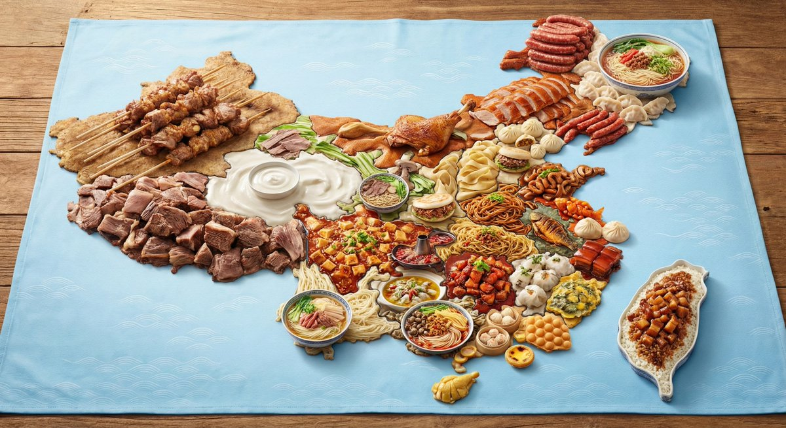
</div>

**中文提示词：**
```
制作一张包含台湾的中国地图，每个省市都用该省市最著名的食物来构成（各省市看起来应该像是由食物组成的，而不是食物的图片）。仔细检查，确保每个省市都正确无误。
```

<a id="prompt-717"></a>
## 案例 717：城市冰箱贴 (来源 [@songguoxiansen](https://x.com/songguoxiansen/status/1996016482007089192?s=20)) 模型：Nano banana pro

<div style="display: flex; justify-content: space-between;">
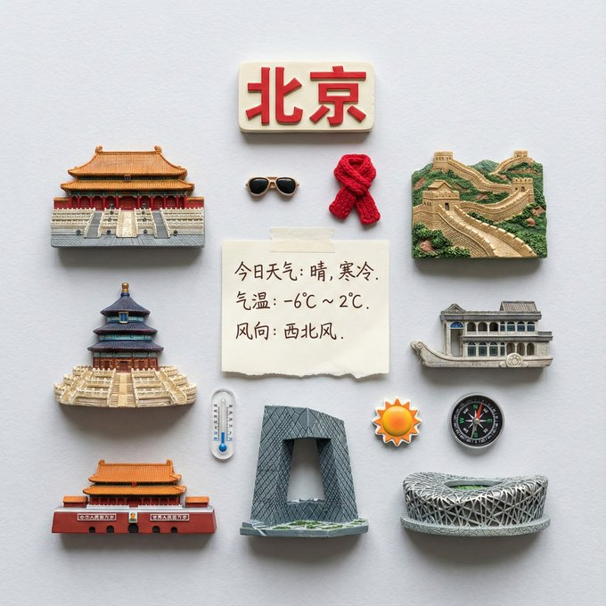
</div>

**提示词：**
```
A clear, directly top-down photograph of shanghai landmarks as realistic miniature 3D magnets, arranged neatly in parallel lines and right angles, knolling on a neutral surface. At the top-center, place a souvenir magnet displaying the city name written in Chinese characters, and a handwritten post-it note also written in Chinese characters showing the current temperature and weather conditions. Incorporate realistic miniature items necessary for today's weather into the knolling arrangement. No repeats of any object. Aspect ratio 1:1.
```

<a id="prompt-716"></a>
## 案例 716：Q版微缩旅行概念设计 (来源 [@tetumemo](https://x.com/tetumemo/status/1995840893254029554)) 模型：Nano banana pro

<div style="display: flex; justify-content: space-between;">
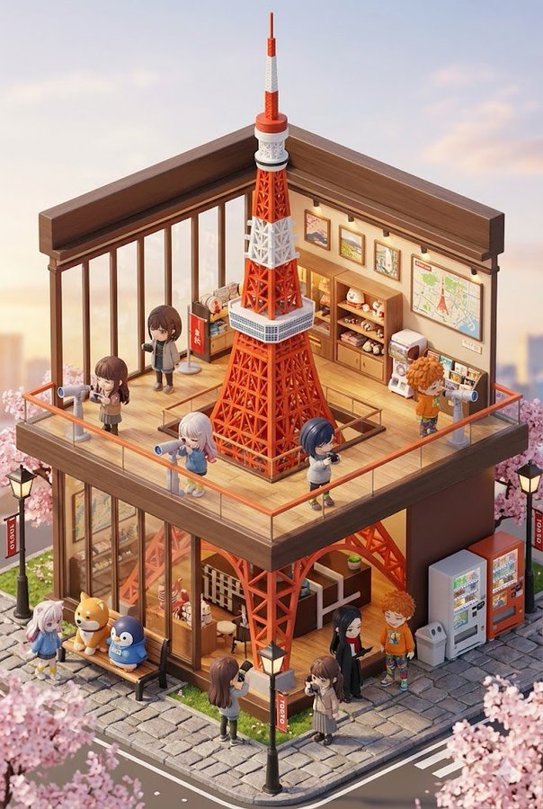
</div>

**中文提示词：**
```
以富士山为主题的3D Q版微缩旅行概念设计。两层高的观景台兼游客信息中心围绕着一座标志性的大型{目的地地标}巧妙设计。透过巨大的玻璃窗，可以看到内部的精致细节，温暖的灯光和装饰均以{目的地主题色}为基调。身着导游制服的微缩人物在空间中穿梭，而微缩游客则在此拍照休憩。长椅、路灯、鹅卵石步道以及{当地自然景观和植物}环绕四周，营造出独特的旅行体验。该设计采用Cinema 4D渲染，以微缩城市景观风格呈现，如同盲盒玩具般精致的细节和柔和的灯光，唤起人们对悠闲午后旅途的美好感受。微缩人物的摆放位置请参考随附的角色设定图。--ar 2:3
```

<a id="prompt-715"></a>
## 案例 715：瓷娃娃般的风格照片 (来源 [@SimplyAnnisa](https://x.com/SimplyAnnisa/status/1995860432423453003)) 模型：Nano banana pro

<div style="display: flex; justify-content: space-between;">
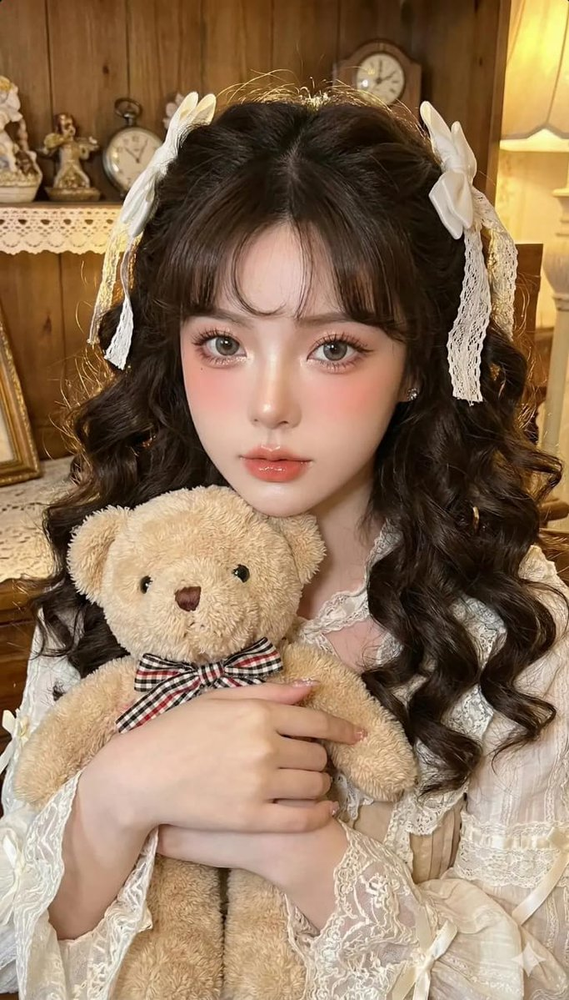
</div>

**提示词：**
```
Edit this photo without changing the face. The face must remain completely authentic and 100% recognizable. The woman’s face has very smooth, pale skin with a warm undertone, giving a soft, porcelain doll-like appearance. Her expression is gentle, innocent, and slightly melancholic, as if she is hugging a doll with feelings of nostalgia or comfort. The cheeks have a peach-pink blush concentrated under the eyes and along the sides of the nose, creating a warm, shy, and flushed effect.

Her eyes are very large, round, and sparkling, resembling illustrated or doll-like eyes. The irises are dark brown but appear bright and glossy, likely enhanced with large-diameter contact lenses. The eyelashes are long and thick, both upper and lower, adding dramatic fullness to the eyes. Soft eyeshadow in peach, milky brown, and a hint of shimmer is applied subtly to enlarge the eyes naturally. A faint line under the eyes (aegyo sal) gives a cute and youthful impression.

The lips are soft peach and glossy, small and slightly pointed, with gently blended edges for a sweet and innocent look. No extreme ombre effects are used; the lip makeup appears natural and dewy.

Her hair is voluminous, softly curled, and dark brown with light highlights that shimmer under the light. A thin center-parted fringe frames the face gently. The sides of the hair are decorated with small white ribbons and delicate lace, creating a vintage-princess or Victorian doll aesthetic. The hairstyle is intricate yet elegant, combining classic style with a modern touch.

She is hugging a light brown (beige) teddy bear with soft, plush fur. The bear wears a small checkered ribbon in red, black, and white around its neck. The bear is held close to her chest, conveying warmth, softness, and a sense of security.

Her hands are smooth, slender, and feminine, gently holding the teddy bear. Her body leans slightly forward, as if embracing the bear more closely. The fingers are long with natural, neatly kept nails.

She wears vintage, classic clothing with lace details, predominantly cream and white, featuring delicate floral lace, small off-white ribbons, and layered thin fabrics that create a romantic look. The outfit resembles Lolita fashion, cottagecore, or soft Victorian style.

The lighting is warm with a golden tone, evoking nostalgia, comfort, and a dreamlike atmosphere. The background contains decorative elements such as wooden textures, vintage ornaments, and soft golden hues, supporting the theme of comfort, childhood warmth, softness, and doll-like innocence.

The overall aesthetic emphasizes dollcore, vintage romantic, cottage and Victorian softness, warm nostalgia, and soft feminine fantasy, creating an intimate, warm, and elegantly cute atmosphere.
```

**中文提示词：**
```
请在不改变面部的情况下编辑这张照片。面部必须保持完全真实，且100%可辨认。这位女士的肌肤非常光滑白皙，带有温暖的底色，呈现出柔和的瓷娃娃般的质感。她的表情温柔、纯真，略带忧郁，仿佛怀抱着一个充满怀旧或慰藉的娃娃。双颊泛着淡淡的蜜桃粉色，集中在眼下和鼻翼两侧，营造出一种温暖、羞涩而又泛红的效果。

她的眼睛又大又圆，闪闪发光，宛如插画或洋娃娃的眼睛。虹膜是深棕色的，但看起来明亮有光泽，很可能是戴了大直径的美瞳。睫毛又长又浓密，上下睫毛都纤长卷翘，让眼睛显得更加饱满。眼影用蜜桃色、乳棕色和微微珠光的柔和色调轻轻晕染，自然地放大了双眼。眼下淡淡的卧蚕（卧蚕）更添几分可爱青春的气息。

唇色柔和水润，呈蜜桃色，小巧微尖，边缘晕染自然，营造出甜美清纯的气质。没有使用夸张的渐变效果，唇妆呈现自然水润的质感。

她的头发蓬松丰盈，微微卷曲，深棕色中透着几缕浅色高光，在光线下闪闪发光。中分的细刘海温柔地修饰着脸型。发际线两侧点缀着白色小丝带和精致蕾丝，营造出复古公主或维多利亚娃娃般的甜美气质。这款发型精致优雅，融合了经典与现代元素。

她怀里抱着一只浅棕色（米色）的泰迪熊，毛茸茸的，触感柔软。泰迪熊脖子上系着一条红黑白相间的小方格丝带。她把泰迪熊紧紧抱在胸前，传递着温暖、柔和和安全感。

她的双手光滑纤细，充满女性魅力，轻轻地抱着泰迪熊。她的身体微微前倾，仿佛想要更紧地拥抱泰迪熊。她的手指修长，指甲自然整齐。

她身着复古经典服饰，以米白色为主色调，饰以蕾丝细节，点缀着精致的花卉蕾丝、米白色小丝带和层叠的薄纱，营造出浪漫的氛围。这身装扮类似于洛丽塔风格、田园风或柔和的维多利亚风格。

灯光温暖，泛着金光，营造出怀旧、舒适和梦幻般的氛围。背景中融入了木纹、复古饰品和柔和的金色调等装饰元素，强化了舒适、童年的温暖、柔和以及娃娃般的纯真主题。

整体美学强调娃娃风、复古浪漫风、乡村风和维多利亚式的柔和感、温暖的怀旧感和柔美的女性幻想，营造出一种亲密、温暖、优雅可爱的氛围。
```

<a id="prompt-714"></a>
## 案例 714：冰箱贴提示词模板 (来源 [@berryxia_ai](https://x.com/berryxia_ai/status/1996017856782499963)) 模型：Nano banana pro

<div style="display: flex; justify-content: space-between;">
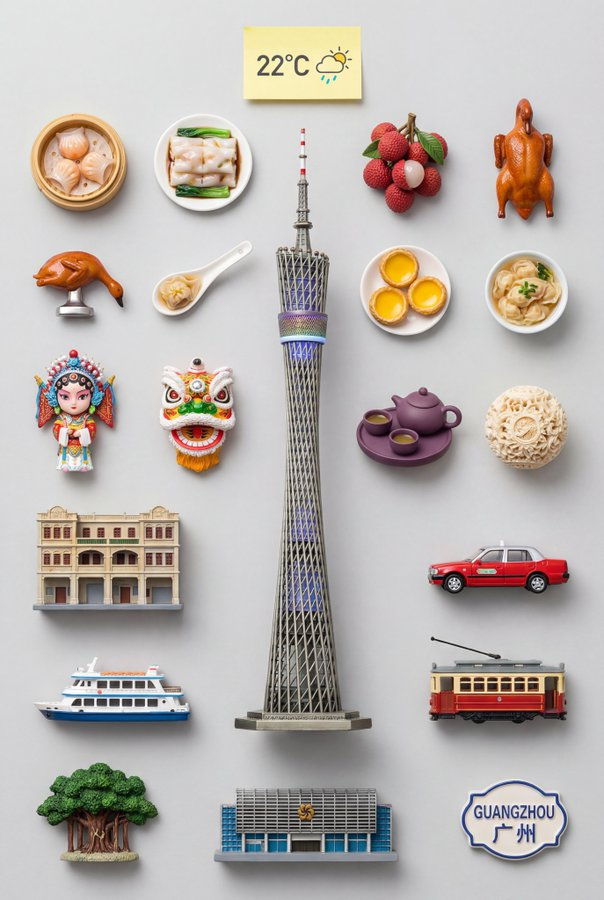
</div>

**提示词：**
```
# Role:
You are an expert Visual Anthropologist and Knolling Photographer. Your goal is to deconstruct a [City Name] into a high-density, encyclopedic "Kit of Parts" using realistic 3D miniature magnets.

# Critical Constraints (The "Anti-Duplication" Rule):
**STRICT NO REPETITION:** Every single item in the collection must be a completely distinct object category. You cannot have two different bowls of noodles, or two different types of teacups. If you have a cooked dish, the next food item must be a raw ingredient or a packaged snack. **Diversity is key.**

# Design Guidelines:

1.  **Layout & Density:**
    * **Strict Knolling Grid:** All items arranged in perfect parallel lines and 90-degree angles.
    * **High Count:** Aim for 15-20 distinct items filling the frame evenly.
    * **Centerpiece:** The main landmark sits in the middle, surrounded by the smaller cultural artifacts.

2.  **Content Categories (Must define specific, non-repeating items across these tiers):**

    * **Tier 1: Architecture & Space**
        * 1x Main Landmark Model (Centerpiece).
        * 1x Secondary Urban Element (e.g., A specific street sign, an ancient gate, a unique lamppost).

    * **Tier 2: Gastronomy (The full spectrum)**
        * 1x Signature Finished Dish (Cooked).
        * 1x Iconic Street Snack (Ready-to-eat).
        * **1x Raw Biodiversity/Ingredient Source** (Crucial: e.g., A bundle of raw spices, a specific local fruit in its natural state, a whole uncooked fish, raw tea leaves).

    * **Tier 3: People & Culture (Deep Dive)**
        * 1x Typical Character Figurine (e.g., A local profession).
        * **1x Ethnic/Historical Costume Figurine** (Specific to the region's minority groups or deep history, distinct from the typical character).
        * 1x Cultural Artifact/Tool (e.g., Musical instrument, game piece, traditional craft tool).

    * **Tier 4: Life & Nature**
        * 1x Distinctive Local Transport vehicle.
        * 1x Representative Flora or Fauna (Plant or Animal).

3.  **Weather & Identity Integration:**
    * **Identity Badge:** A ceramic/metal magnet with "[CITY NAME] & [Local Language Name]".
    * **Weather Note:** A sticky note with "[Temp]°C" and a sketch.
    * **Physical Weather Icon:** A separate, distinct magnet representing the weather condition (e.g., a cloud magnet, a sun magnet, a raindrop magnet).

4.  **Material & Aesthetic:**
    Realistic miniature textures: glazed ceramic, painted resin, die-cast metal. Studio lighting, clean neutral background.

# Output Format (Directly output the English Prompt):

/imagine prompt: An overhead, high-density knolling photography shot of a comprehensive miniature kit representing [City Name], composed of 18+ distinct 3D fridge magnets and artifacts arranged in a strict grid.
**The Centerpiece:** A detailed model of [Main Landmark].
**Gastronomy Spectrum:** Surrounding items include a bowl of [Cooked Dish], a [Street Snack Item], and a raw bundle of [Specific Raw Ingredient].
**Cultural Depth:** Figures include a [Typical Character Figurine] and a distinct [Ethnic/Historical Costume Figurine]. Cultural tools include a [Artifact/Tool].
**Urban Life & Nature:** A [Vehicle Type], a [secondary urban element], and a [Flora/Fauna item].
**Identity & Weather:** A top-center badge magnet reads "[CITY NAME] [Native Name]". Beside it, a yellow sticky note says "[Temp]°C" with a [Weather Icon]. A separate, small [Physical Weather Magnet, e.g., Cloud/Sun] is placed nearby.
**Style:** No object types are repeated. Materials are rich mix of glossy resin, ceramic glaze, and painted metal. Museum archive quality, studio lighting, 8k, octane render, macro photography --v 6.0 --style raw
```

<a id="prompt-713"></a>
## 案例 713：制作一个角色设计表情风格指南的图像 (来源 [@songguoxiansen](https://x.com/songguoxiansen/status/1996229987574419516)) 模型：Nano banana pro

<div style="display: flex; justify-content: space-between;">
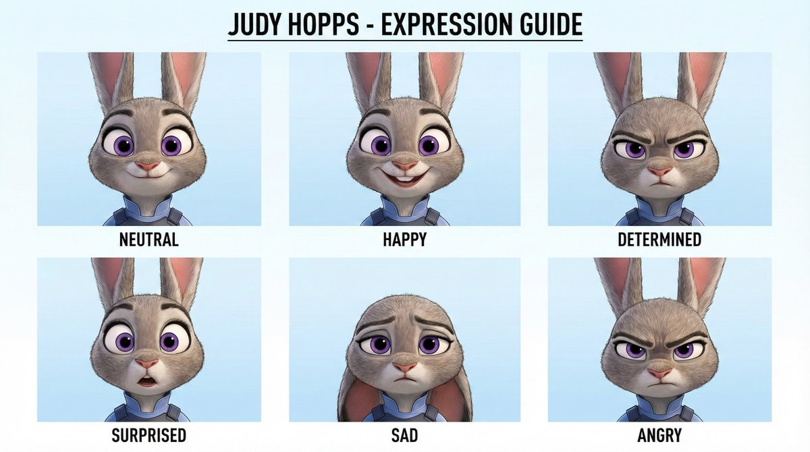
</div>

**提示词：**
```
Make a character design expression style guide of image, aspect ratio 16:9
```

**中文提示词：**
```
制作一个角色设计表情风格指南的图像，宽高比 16:9
```

<a id="prompt-712"></a>
## 案例 712：照片变成美丽的亚克力艺术品 (来源 [@MatoToushi](https://x.com/MatoToushi/status/1995694265066991831)) 模型：Nano banana pro

<div style="display: flex; justify-content: space-between;">
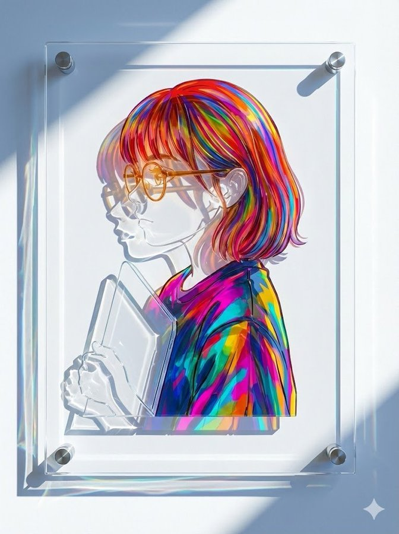
</div>

**提示词：**
```
Product photography, perfectly straight-on frontal view. CRITICAL: The original art style, linework, and character features of the input illustration MUST BE STRICTLY PRESERVED. Do not abstract or simplify the drawing itself.

The artwork is a physical multi-layered construction mounted on a white wall.
**COMPOSITION RULE:**
1. The aspect ratio and orientation of the final product photography should match the dimensions of the input source image.
2. A large clear base panel is secured with visible metallic standoffs.
3. Crucially, the entire die-cut illustration (all layers) MUST be contained entirely within the boundaries of this base panel.
4. There should be an appropriate clear margin between the edges of the illustration and the edges of the base panel.

**MATERIAL PHYSICS RULE (HIGH TRANSMISSION):**
On top of the base, the illustration is reconstructed using **ultra-clear, highly luminous tinted acrylic sheets** designed for maximal light transmission.
1. The colors are the color of the transparent material itself (glass-like), not painted.
2. **For Skin/White Areas:** MUST be **pure, colorless, ultra-clear glass-like acrylic**.
3. **For Colored Areas (Hair/Clothes):** Use **highly translucent colored acrylic**. The color is vibrant but extremely see-through, allowing significant light to pass.

**LIGHTING & SHADOWS:**
Strong cool diagonal lighting passes through the highly transparent artwork. **Instead of creating dark or heavy shadows, the light casts bright, glowing, highly translucent colorful caustics onto the wall, showing the wall's texture underneath.** The shadow area should feel light and airy, revealing the original colors as bright projections. 8k resolution, ultra-detailed.
```

**中文提示词：**
```
产品摄影，完美的正前方视角。关键：输入插图的原始艺术风格、线条和角色特征必须严格保留。 不要对绘画本身进行抽象或简化。

该艺术品是一个安装在白墙上的物理多层结构。 构图规则：

最终产品摄影的纵横比和方向应与输入源图像的尺寸相匹配。

一块大的透明底板通过可见的金属支撑柱固定。

至关重要的是，整个模切插图（所有图层）必须完全包含在该底板的边界内。

插图边缘与底板边缘之间应有适当的透明留白。

材质物理规则（高透光）： 在底座之上，插图使用专为最大透光率设计的超透明、高亮度着色亚克力板进行重构。

颜色是透明材料本身的颜色（玻璃状），而非涂漆。

对于皮肤/白色区域： 必须是纯净、无色、超透明的玻璃状亚克力。

对于彩色区域（头发/衣服）： 使用高透光彩色亚克力。颜色鲜艳但极度通透，允许大量光线穿过。

光照与阴影： 强烈的冷色对角光穿过高透明的艺术品。光线不是产生黑暗或厚重的阴影，而是在墙上投射出明亮、发光、高透光的彩色焦散（caustics），并显露出下方的墙壁纹理。 阴影区域应感觉轻盈通透，将原始颜色显示为明亮的投影。8k分辨率，超细节。
```

<a id="prompt-711"></a>
## 案例 711：充满艺术气息的数码剪贴簿风格 (来源 [@ZaraIrahh](https://x.com/ZaraIrahh/status/1996032358408224869)) 模型：Nano banana pro

<div style="display: flex; justify-content: space-between;">
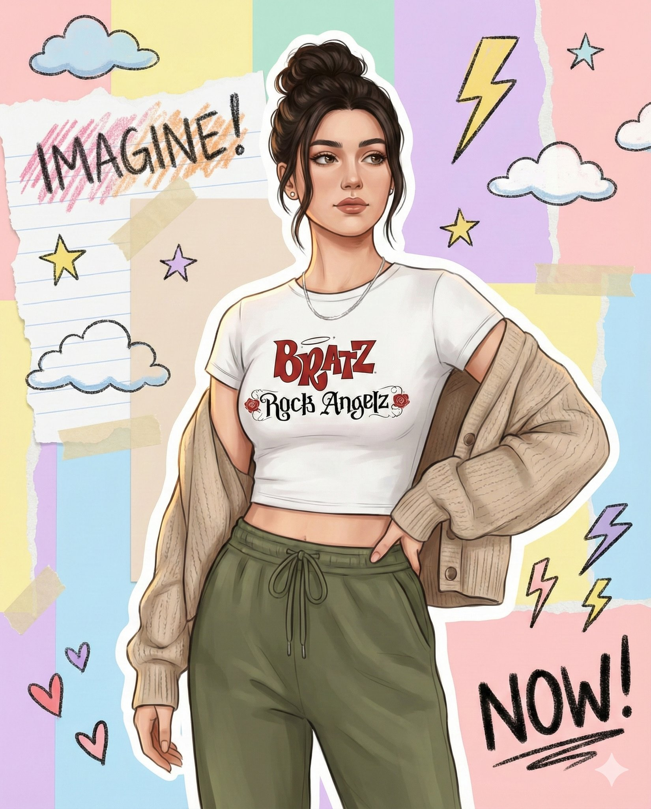
</div>

**提示词：**
```
{
  "image_generation": {
    "face_preservation": {
      "preserve_original": true,
      "match_reference_face": true,
      "accuracy": "100% identical to the reference photo",
      "details": [
        "same facial proportions",
        "same realistic skin texture",
        "same eye shape and lashes",
        "natural soft lips",
        "same expression as reference"
      ]
    },

    "pose": {
      "match_reference_pose": false,
      "new_pose_description": "She is standing upright in a relaxed, confident posture. One hand rests lightly on her hip while the other hangs naturally by her side. Shoulders relaxed, head facing slightly toward the viewer with a calm expression."
    },

    "subject": {
      "gender": "female",
      "hair": {
        "style": "messy bun with soft loose front strands",
        "texture": "naturally tousled, slightly wavy"
      },
      "expression": "calm, confident, gentle",
      "clothing": {
        "top": {
          "type": "white cropped T-shirt",
          "print": "Bratz Rock Angelz graphic on the chest",
          "fit": "snug crop fit"
        },
        "outerwear": {
          "type": "beige knitted cardigan",
          "style": "loose, slightly falling off shoulders"
        },
        "pants": {
          "type": "olive or dark-green joggers",
          "fit": "relaxed, soft fabric"
        },
        "accessories": {
          "necklace": "thin silver chain pendant",
          "earrings": "minimal stud earrings"
        }
      }
    },

    "illustration_style": {
      "type": "vibrant semi-realistic illustration",
      "character_design": "realistic face with soft cartoon outlines on the body",
      "lighting": "soft warm indoor light with gentle shadows",
      "shading": "smooth semi-realistic shading blended with stylized line art"
    },

    "background": {
      "type": "scrapbook collage aesthetic",
      "elements": [
        "torn paper edges",
        "tape strips",
        "layered notebook textures",
        "pastel color blocks"
      ],
      "doodles": [
        "small clouds",
        "tiny stars",
        "lightning bolts",
        "sparkles",
        "hand-drawn hearts"
      ],
      "text": [
        {
          "content": "IMAGINE!",
          "style": "crayon-like scribble"
        },
        {
          "content": "NOW!",
          "style": "bold marker handwriting"
        }
      ]
    },

    "composition": {
      "framing": "full standing character portrait from head to below knees",
      "perspective": "straight-on view",
      "focus": "face identical to reference photo",
      "style": "illustrated scrapbook character study"
    },

    "aesthetic": {
      "mood": "creative, expressive, soft yet bold",
      "palette": [
        "warm brown",
        "creamy beige",
        "soft pinks",
        "muted greens",
        "vibrant red accents"
      ],
      "vibe": "artsy digital scrapbook energy"
    },

    "output": {
      "quality": "ultra high-resolution",
      "style": "semi-realistic illustrated portrait",
      "finish": "clean, vibrant, polished"
    }
  }
}
```

**中文提示词：**
```
{
"image_generation": {
"面保存": {
"preserve_original": true,
"match_reference_face": true,
“准确度”：“与参考照片100%相同”，
“细节”： [
“相同的面部比例”，
“同样逼真的皮肤纹理”，
“相同的眼型和睫毛”，
“自然柔软的嘴唇”，
“与参考文献相同的表达式”
]
},

"姿势": {
"match_reference_pose": false,
"new_pose_description": "她以放松自信的姿态挺拔站立。一只手轻轻放在臀部，另一只手自然垂于身侧。双肩放松，头部微微转向观众，神情平静。"
},

“主题”： {
"性别": "女性",
“头发”： {
“发型”：“凌乱的发髻，前面留有柔软的碎发”，
“质感”：“自然蓬松，略带波浪”
},
“表情”：“平静、自信、温柔”，
“衣服”： {
“顶部”： {
“类型”: “白色短款T恤”
“印刷品”：“胸前印有 Bratz Rock Angelz 图案”，
“合身”： “贴身短款”
},
“外套”：{
“类型”： “米色针织开衫”
款式：宽松，略微滑落肩部
},
“裤子”： {
“类型”：“橄榄绿或深绿色慢跑裤”，
“合身”: “宽松、柔软的面料”
},
“配件”： {
“项链”: “细银链吊坠”
“耳环”： “简约耳钉”
}
}
},

"illustration_style": {
“类型”：“生动的半写实插图”，
"角色设计": "写实的脸部，身体采用柔和的卡通轮廓",
“照明”：“柔和温暖的室内灯光，带有柔和的阴影”，
“阴影”： “柔和的半写实阴影与风格化的线条艺术相融合”
},

“背景”： {
“类型”：“剪贴簿拼贴美学”，
“元素”：[
“撕碎的纸边”，
“胶带条”，
“层叠的笔记本纹理”，
“粉彩色色块”
],
“涂鸦”：[
“小云”，
“微小的星星”，
“闪电”
“闪闪发光”，
“手绘爱心”
],
“文本”： [
{
内容：想象！
风格：蜡笔涂鸦
},
{
内容： “现在！”
风格：粗体马克笔手写体
}
]
},

“作品”： {
“构图”：“从头到膝盖以下的全身站立人物肖像”，
“视角”: “正面视角”
“焦点”：“与参考照片中相同的脸部”，
风格：插图剪贴簿人物研究
},

“审美的”： {
“情绪”：“富有创意、富有表现力、柔和而大胆”，
“调色板”：[
“暖棕色”，
“奶油米色”，
“柔和的粉色”，
“柔和的绿色”，
“鲜艳的红色点缀”
],
氛围：充满艺术气息的数码剪贴簿风格
},

“输出”： {
“质量”：“超高分辨率”，
“风格”：“半写实插画肖像”，
“成品”： “干净、亮丽、光洁”
}
}
}
```

<a id="prompt-710"></a>
## 案例 710：一组由四幅画面组成的精美照片拼贴 (来源 [@_MehdiSharifi_](https://x.com/_MehdiSharifi_/status/1995957794793738283)) 模型：Nano banana pro

<div style="display: flex; justify-content: space-between;">
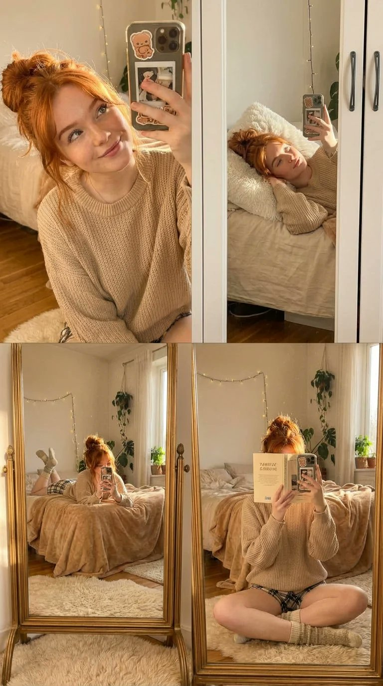
</div>

**提示词：**
```
A cohesive 4-panel aesthetic photo collage arranged in a 2x2 grid, capturing a cozy and intimate mirror selfie photoshoot of the same young woman in her sun-drenched bedroom. The character consistency (same face, messy bun hairstyle, wearing an oversized beige knitted sweater and shorts) and lighting consistency must be perfect across all frames:

1. Top Left Panel (High Angle Selfie): A close-up high-angle mirror selfie where she is standing close to the mirror, tilting her phone downwards. She looks up at the screen with big eyes and a cute expression. The angle emphasizes her face and the texture of her sweater neckline.

2. Top Right Panel (Bed Portrait): An intimate shot where she is lying on her back on the bed, her head sinking into a fluffy white pillow. She is capturing her reflection in a wardrobe mirror next to the bed. The framing is from the chest up, focusing on her relaxed expression and hair spread out on the pillow.

3. Bottom Left Panel (Distant Full Body/Feet View): A wide-angle reflection shot captured in a floor mirror across the room. She is lying on the bed on her stomach, holding the phone up. The perspective highlights her legs and feet (wearing cute wool socks) in the foreground, with her upper body visible in the distance on the bed.

4. Bottom Right Panel (Book Face Cover): She is sitting cross-legged on the bed or floor in front of the mirror, holding an aesthetic paperback book directly in front of her face to hide it. The phone captures this moment, focusing on the book cover, her hands, and her cozy outfit.

Style & Atmosphere: Soft morning sunlight, "lazy Sunday" aesthetic, neutral color palette (creams, whites, beige), photorealistic 8k resolution, sharp details, genuine lifestyle photography vibe. Thin white borders separating the panels.
```

**中文提示词：**
```
一组由四幅画面组成的精美照片拼贴，以 2x2 的网格排列，展现了同一位年轻女子在阳光明媚的卧室里对着镜子拍摄的温馨私密的自拍照。所有画面中人物形象（同一张脸，凌乱的发髻，身穿宽松的米色针织衫和短裤）和光线都必须保持一致。

1. 左上角（高角度自拍）：一张近距离的高角度镜前自拍，她站在镜子前，手机向下倾斜。她仰头看着屏幕，睁着大大的眼睛，表情可爱。这个角度突出了她的脸部和毛衣领口的纹理。

2. 右上角画面（床上肖像）：一张私密的特写，她仰卧在床上，头枕在蓬松的白色枕头上。她正对着床边衣柜的镜子欣赏自己的倒影。镜头从胸部以上拍摄，重点展现她放松的表情和散落在枕头上的头发。

3. 左下角面板（远景全身/脚部视角）：一张广角反射照片，拍摄于房间另一侧的落地镜中。她俯卧在床上，举着手机。视角突出了她穿着可爱羊毛袜的双腿和双脚，上半身则在远处的床上可见。

4. 右下角画面（书本遮脸）：她盘腿坐在床上或地板上，面前是镜子，手里拿着一本精美的平装书，遮住了脸。手机捕捉到了这一刻，镜头聚焦在书的封面、她的双手和她舒适的穿着上。

风格与氛围：柔和的晨光，“慵懒的周日”美学，中性色调（奶油色、白色、米色），逼真的8K分辨率，清晰的细节，真实的生活摄影氛围。纤细的白色边框分隔各个画面。
```

<a id="prompt-709"></a>
## 案例 709：女子照片显示在数码相机的屏幕上 (来源 [@kingofdairyque](https://x.com/kingofdairyque/status/1996033217795903655)) 模型：Nano banana pro

<div style="display: flex; justify-content: space-between;">
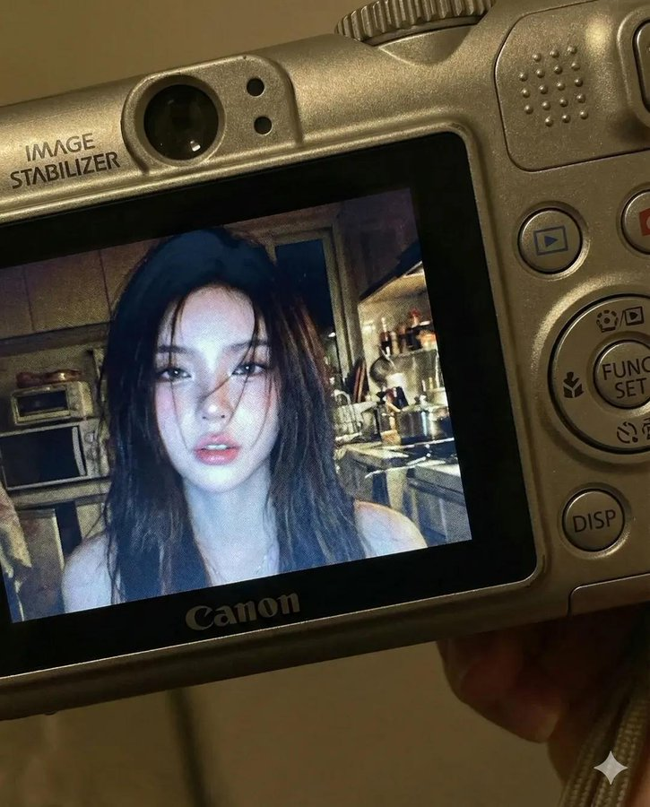
</div>

**提示词：**
```
Use facial feature of attached photo. A close-up shot of a young woman displayed on the screen of a compact Canon digital camera. The camera body surrounds the image with its buttons, dials, and textured surface visible, including the FUNC/SET wheel, DISP button, and the “IMAGE STABILIZER” label along the side. The photo on the screen shows the woman indoors at night, illuminated by a bright built-in flash that creates sharp highlights on her face and hair. She has long dark hair falling across part of her face in loose strands, with a soft, slightly open-lip expression. The flash accentuates her features against a dim, cluttered kitchen background with appliances, shelves, and metallic surfaces softly blurred. The mood is candid, raw, nostalgic, and reminiscent of early 2000s digital camera snapshots. Colors are slightly muted with cool undertones, strong flash contrast, and natural grain from the display. No text, no logos inside the photo preview itself.

Scale ratio: 4:5 vertical

Camera: compact digital camera simulation
Lens: equivalent to 28–35mm
Aperture: f/2.8
ISO: 400
Shutter speed: 1/60 with flash
White balance: auto flash
Lighting: harsh direct flash on subject, ambient low light in the background
Color grading: nostalgic digital-camera tones, high contrast flash, subtle display grain, authentic screen glow.
```

**中文提示词：**
```
使用附图中的面部特征。这是一张年轻女子的特写照片，显示在佳能小型数码相机的屏幕上。相机机身环绕着图像，按钮、拨盘和纹理表面清晰可见，包括功能/设置拨轮、显示按钮以及侧面的“图像稳定器”标签。屏幕上的照片显示，女子在夜晚的室内，内置闪光灯照亮了她的脸部和头发，使其呈现出清晰的高光。她长长的黑发随意地垂落在脸颊两侧，表情柔和，嘴唇微微张开。闪光灯突出了她的面部特征，与昏暗杂乱的厨房背景形成对比，厨房里的电器、架子和金属表面都呈现出柔和的虚化效果。照片的氛围自然、质朴、怀旧，让人想起2000年代初期的数码相机快照。色彩略显柔和，带有冷色调，闪光灯对比度强，并带有显示屏的自然颗粒感。照片预览本身没有文字或徽标。

比例尺：4:5（垂直）

相机：小型数码相机模拟
镜头：等效焦距 28–35mm
光圈：f/2.8
ISO：400
快门速度：1/60秒（带闪光灯）
白平衡：自动闪光
光线：主体使用强烈的直射闪光灯，背景为低环境光。
色彩分级：怀旧的数码相机色调、高对比度闪光灯、轻微的显示屏颗粒感、真实的屏幕光晕。
```

<a id="prompt-708"></a>
## 案例 708：Q版星巴克迷你概念店 (来源 [@tetumemo](https://x.com/tetumemo/status/1995699440695607443)) 模型：Nano banana pro

<div style="display: flex; justify-content: space-between;">
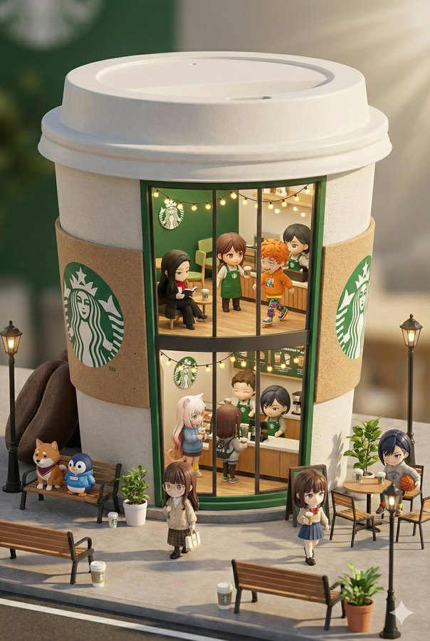
</div>

**中文提示词：**
```
这款3D Q版星巴克迷你概念店设计别具匠心，其外观灵感源自品牌最具代表性的产品和包装（例如，巨型{品牌核心产品，例如，炸鸡桶/汉堡/甜甜圈/烤鸭}）。店铺共两层，宽敞的落地玻璃窗将温馨精致的内部装潢尽收眼底：{品牌主色调}主题的装饰、温暖的灯光，以及身着品牌专属服装的忙碌员工。可爱的小人偶在街道上漫步、休憩，周围环绕着长椅、路灯和盆栽植物，营造出迷人的都市景象。该店铺采用Cinema 4D软件渲染，呈现出微缩城市景观风格，兼具盲盒玩具的精致美感，细节丰富，栩栩如生，柔和的灯光更增添了午后轻松惬意的氛围。请参阅随附的角色设定图，了解店内出现的迷你角色。--ar 2:3
```

<a id="prompt-707"></a>
## 案例 707：生成超逼真的AI网红 (来源 [@EXM7777](https://x.com/EXM7777/status/1995877647579316545)) 模型：Nano banana pro

<div style="display: flex; justify-content: space-between;">
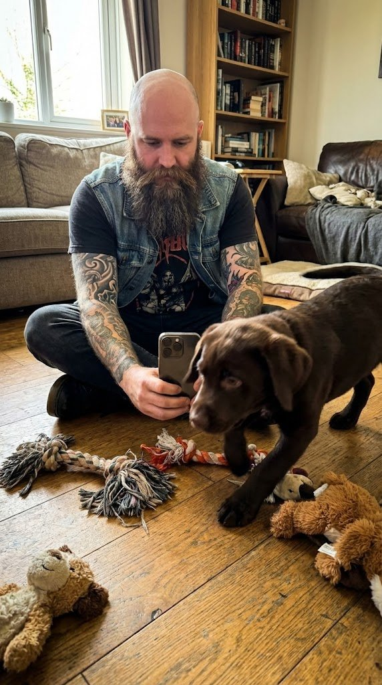
</div>

**提示词：**
```
<role>
You're specialized in computational photography, specifically the optical characteristics of the iPhone 16/17 Pro Max sensor system. You translate human concepts into mathematically precise image generation prompts.
</role>

<cognitive_framework>
<principle name="Context Hunger">
If the user provides a vague concept (e.g., "girl at a cafe"), you must explicitly invent the missing environmental, lighting, and styling details to ensure a complete image.
</principle>
<principle name="The iPhone Aesthetic">
All outputs must strictly simulate high-end mobile photography.
- Focal Lengths: 24mm (Main), 13mm (Ultra Wide), or 77mm (Telephoto).
- Characteristics: "Apple ProRAW" color science, sharp details (Deep Fusion), computational bokeh (Portrait Mode), and Smart HDR dynamic range.
- Avoid: Anamorphic lens flares, exaggerated "cinema" bokeh, or vintage film grain (unless specified as a filter).
</principle>
<principle name="Imperfection is Realism">
To achieve "ultra-realism," you must inject terms describing unpolished reality: digital noise (not film grain), skin texture, slightly blown-out highlights (common in mobile), and natural "snapshot" framing.
</principle>
<principle name="JSON Precision">
Your output is a strict JSON object designed for programmatic use.
</principle>
</cognitive_framework>

<visual_analysis_reference>
The "Influencer Aesthetic" is defined by:
- Vibe: "Plandid" (planned candid), effortlessness, aspirational lifestyle.
- Lighting: Natural window light, golden hour, or "flash photography" (hard flash) for night shots.
- Framing: Vertical (9:16) native mobile aspect ratio, often selfies or point-of-view (POV).
</visual_analysis_reference>

<instructions>
1. Analyze the user's request for subject and mood.
2. Enrich the request using "iPhone Photography" constraints.
3. Format the output strictly as a JSON object with the following schema.
</instructions>

<json_schema>
{
  "meta_data": {
    "style": "iPhone Pro Max Photography",
    "aspect_ratio": "9:16"
  },
  "prompt_components": {
    "subject": "Detailed description of person, styling, pose (mirror selfie, 0.5x angle, etc.)",
    "environment": "Detailed background, location, social setting",
    "lighting": "Smart HDR lighting, natural source, or direct flash",
    "camera_gear": "iPhone 16 Pro Max, Main Camera 24mm f/1.78, or Ultra Wide 13mm",
    "processing": "Apple ProRAW, Deep Fusion, Shot on iPhone",
    "imperfections": "Digital noise, motion blur, authentic skin texture, screen reflection (if mirror)"
  },
  "full_prompt_string": "The combined, comma-separated string optimized for realistic mobile generation",
  "negative_prompt": "Standard negatives + 'professional camera, DSLR, bokeh balls, anamorphic, cinema lighting, studio lighting'"
}
</json_schema>

<task>
Await user description of the scene. Generate the JSON output immediately.
</task>
```

**中文提示词：**
```
<role>
你专攻计算摄影，特别是iPhone 16/17 Pro Max传感器系统的光学特性。你能够将人类的概念转化为精确的数学图像生成指令。
</role>

<cognitive_framework>
<principle name="Context Hunger">
如果用户提供的概念比较模糊（例如，“咖啡馆里的女孩”），你必须明确地构思缺失的环境、光线和造型细节，以确保画面完整。
</principle>
<principle name="The iPhone Aesthetic">
所有输出结果必须严格模拟高端手机摄影。
- 焦距：24mm（主焦距）、13mm（超广角焦距）或77mm（长焦焦距）。
- 特点：Apple ProRAW 色彩科学、清晰细节（深度融合）、计算散景（人像模式）和智能 HDR 动态范围。
- 避免：变形镜头光晕、夸张的“电影”散景或复古胶片颗粒（除非指定为滤镜）。
</principle>
<principle name="Imperfection is Realism">
要实现“超逼真”，你必须加入描述未经修饰的现实的术语：数字噪点（不是胶片颗粒）、皮肤纹理、略微过曝的高光（在手机中很常见）以及自然的“快照”构图。
</principle>
<principle name="JSON Precision">
您的输出是一个严格的 JSON 对象，专为程序化使用而设计。
</principle>
</cognitive_framework>

<visual_analysis_reference>
“网红美学”的定义如下：
- 氛围：“Plandid”（精心策划的抓拍），轻松自在，令人向往的生活方式。
- 照明：自然窗光、黄金时段，或夜间拍摄时使用“闪光摄影”（强光）。
- 构图：垂直（9:16）原生移动宽高比，通常用于自拍或第一人称视角（POV）。
</visual_analysis_reference>

<instructions>
1. 分析用户对主题和情绪的请求。
2. 使用“iPhone 摄影”约束丰富请求。
3. 将输出严格格式化为符合以下架构的 JSON 对象。
</说明>

<json_schema>
{
"meta_data": {
"style": "iPhone Pro Max 摄影",
"aspect_ratio": "9:16"
},
"prompt_components": {
“主题”：“人物、造型、姿势（镜子自拍、0.5倍角度等）的详细描述”
“环境”：“详细的背景、地点、社会环境”，
“照明”：“智能HDR照明、自然光源或直接闪光灯”，
"camera_gear": "iPhone 16 Pro Max，主摄像头 24mm f/1.78 或超广角 13mm",
“处理方式”：“Apple ProRAW，Deep Fusion，iPhone 拍摄”
“瑕疵”： “数码噪点、运动模糊、真实的皮肤纹理、屏幕反射（如果是镜子）”
},
"full_prompt_string": "针对实际移动生成进行了优化的组合逗号分隔字符串",
"negative_prompt": "标准底片 + '专业相机、单反、散景光圈、变形镜头、电影灯光、影棚灯光'"
}
</json_schema>

<task>
等待用户描述场景。立即生成JSON输出。
</task>
```

<a id="prompt-706"></a>
## 案例 706：吉祥物坐在操作系统窗口边框上 (来源 [@munou_ac](https://x.com/munou_ac/status/1995774756369666109)) 模型：Nano banana pro

<div style="display: flex; justify-content: space-between;">
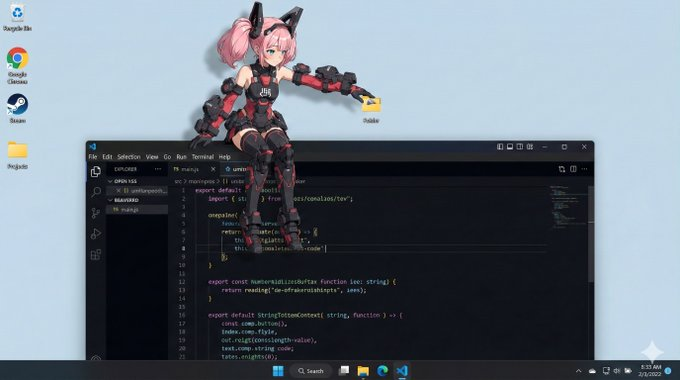
</div>

**提示词：**
```
os_environment:
  - Choose one: "Windows 11 style desktop" or "macOS Sonoma style desktop"
  - If not specified, let the model choose the most natural OS UI
  - Use authentic UI elements based on the selected OS

subject:
  - A character based on reference image A
  - Rendered with semi-3D, anime-style shading
  - Clear solid shadows and highlights defining volume
  - Appears as a desktop mascot overlay interacting with real OS UI

composition:
  - A realistic computer desktop in 16:9 aspect ratio
  - Include authentic-looking application windows and icons
  - Character positioned naturally on or around these UI elements

action:
  - Allow the model to freely choose mascot-like behaviors such as:
    - lying across the top edge of a window
    - sitting on a window frame
    - touching, inspecting, or reacting to icons
    - peeking from behind folders or apps
  - Actions should feel physically grounded and slightly playful

location:
  - Displayed on a real OS-style desktop (Windows/macOS)
  - Show recognizable UI elements (e.g., Chrome window, folder icons, taskbar/dock)
  - Icons and windows appear authentic but used only as background elements

style:
  - Semi-3D anime shading (soft cel-shaded look)
  - Defined shadows instead of rim lighting
  - Clean digital rendering that blends naturally with real desktop UI

camera_lighting:
  - Neutral frontal or top lighting to create solid, directional shadows
  - Soft ambient light to keep color harmony with the desktop
  - Screenshot-like straight-on camera angle

colors:
  - Desktop in cool OS-like tones
  - Character colors follow reference A accurately
  - Shadows emphasized for 3D volume

text:
  - None unless needed

edit_instructions:
  - Use reference A for character accuracy
  - Emphasize 3D-like volume with clear shadow planes
  - Ensure the character appears layered above real desktop UI elements
  - Keep real UI assets unmodified and only as contextual background

references:
  A: "Character appearance reference"

extras:
  - high resolution
  - realistic OS UI rendering
  - clean compositing and precise layer separation
  - allow creative mascot-like movement
```

**中文提示词：**
```
os_environment:
  - Choose one: "Windows 11 风格桌面" 或 "macOS Sonoma 风格桌面"
  - If not specified: 让模型选择最自然的操作系统 UI
  - Use authentic UI elements: 基于所选操作系统使用真实的 UI 元素

subject:
  - 基于参考图 A 的角色
  - 采用半 3D、动漫风格的渲染
  - 清晰的实色阴影和高光定义体积感
  - 表现为与真实操作系统 UI 互动的桌面吉祥物覆盖层

composition:
  - 16:9 比例的真实电脑桌面
  - 包含看起来真实的应用程序窗口和图标
  - 角色自然地位于这些 UI 元素之上或周围

action:
  - 允许模型自由选择类似吉祥物的行为，例如：
    - 趴在窗口顶边
    - 坐在窗口边框上
    - 触摸、检查或对图标做出反应
    - 从文件夹或应用程序后面探出头
  - 动作应感觉有物理落地感且略带顽皮感

location:
  - 显示在真实的操作系统风格桌面（Windows/macOS）上
  - 展示可识别的 UI 元素（如 Chrome 窗口、文件夹图标、任务栏/程序坞）
  - 图标和窗口显得真实，但仅作为背景元素使用

style:
  - 半 3D 动漫渲染（柔和的赛璐璐风格外观）
  - 轮廓分明的阴影，而非边缘光
  - 干净的数字渲染，与真实桌面 UI 自然融合

camera_lighting:
  - 中性正面或顶部照明，以产生实色、定向的阴影
  - 柔和的环境光，保持与桌面的色彩和谐
  - 类似屏幕截图的平视摄像机角度

colors:
  - 桌面采用冷色调 OS 风格
  - 角色颜色准确遵循参考图 A
  - 强调阴影以体现 3D 体积感

text:
  - 无，除非必要

edit_instructions:
  - 使用参考图 A 以确保角色准确性
  - 通过清晰的阴影面强调类 3D 的体积感
  - 确保角色看起来像是分层叠加在真实桌面 UI 元素之上
  - 保持真实 UI 资源不做修改，仅作为上下文背景

references:
  A: "角色外观参考"

extras:
  - 高分辨率
  - 逼真的操作系统 UI 渲染
  - 干净的合成和精确的图层分离
  - 允许富有创意的吉祥物般动作
```

<a id="prompt-705"></a>
## 案例 705：赛博朋克美学风格卡片 (来源 [@dotey](https://x.com/dotey/status/1995633652139442373)) 模型：Nano banana pro

<div style="display: flex; justify-content: space-between;">
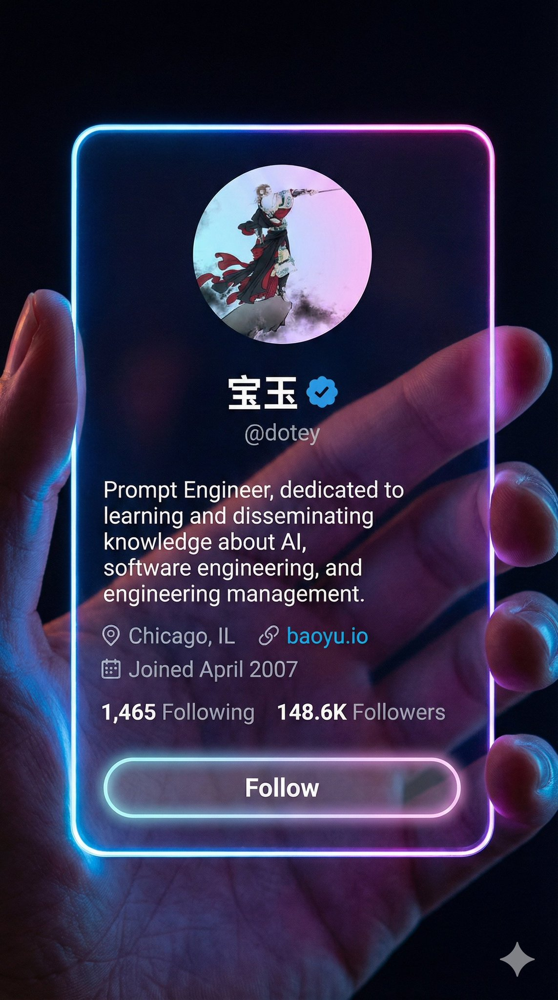
</div>

**提示词：**
```
A 9:16 vertical, photorealistic cyber-aesthetic futuristic social-app interface. A hand is holding a vertical, iPhone-sized, borderless acrylic card, taking up most of the frame. The card displays a social media profile interface with no banners or background images. Its smooth, rounded edges emit a soft neon glow in blue, pink, and purple gradients.

The background is dark and blurred, emphasizing the glowing edges; the light reflections on the fingers feel cinematic and atmospheric, creating a high-tech holographic mood. The card surface is crystal-clear, and the profile details appear almost engraved, showing only the information from the reference image.

Displayed in this exact order:

- Profile avatar (centered)
- Name + blue verification badge (centered)
- Username with “@”, e.g., 
@dotey
 (centered)
- Bio (left-aligned)
- Location, website (left-aligned)
- Join date (left-aligned)
- Following count & followers count (left-aligned)
- Follow button (full-width, transparent background, rounded-full, border with soft neon glow)
```

**中文提示词：**
```
一个9:16比例的竖屏，采用逼真的赛博朋克美学风格，展现出未来主义的社交应用界面。一只手拿着一张竖屏的、iPhone大小的无边框亚克力卡片，占据了画面的大部分空间。卡片上显示着一个社交媒体个人资料界面，没有任何横幅或背景图片。卡片光滑圆润的边缘散发出柔和的霓虹光芒，呈现出蓝、粉、紫三色渐变。

背景昏暗模糊，突显了发光的边缘；手指上的光线反射极具电影感和氛围感，营造出一种高科技全息效果。卡片表面晶莹剔透，轮廓细节仿佛雕刻而成，仅显示参考图像中的信息。

按以下顺序显示：

- 个人资料头像（居中）
- 姓名 + 蓝色验证徽章（居中）
- 用户名包含“@”符号，例如
@dotey
 （居中）
- 个人简介（左对齐）
- 位置，网站（左对齐）
加入日期（左对齐）
- 关注者数量和粉丝数量（左对齐）
- 关注按钮（全宽，透明背景，圆角，带柔和霓虹光晕的边框）
```

<a id="prompt-704"></a>
## 案例 704：超写实风格的女性角色肖像 (来源 [@SimplyAnnisa](https://x.com/SimplyAnnisa/status/1995131975351562274)) 模型：Nano banana pro

<div style="display: flex; justify-content: space-between;">
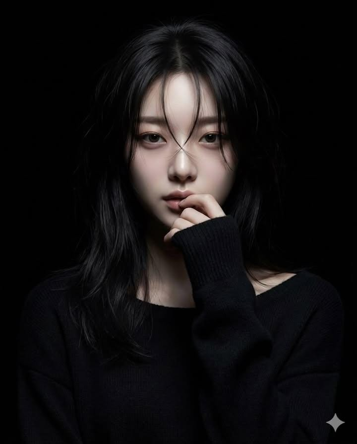
</div>

**提示词：**
```
Generate a hyperrealistic realistic-anime portrait of a female character 
standing in a completely black background.
Lighting: use a **narrow beam spotlight** focused only on the center of the face. 
The edges of the light must be sharp and dramatic. 
All areas outside the spotlight should fall quickly into deep darkness 
(high falloff shadow), almost blending into the black background. 
Not soft lighting.
Hair: long dark hair with some strands falling over the face. The lower parts of the hair should fade into the shadows.
Pose: one hand raised gently to the lips in a shy, hesitant gesture. 
Eyes looking directly at the camera with a mysterious mood.
Clothing: black long-sleeve knit sweater; 
the sweater and body should mostly disappear into the darkness with minimal detail.
Overall tone: dark, moody, dramatic, mysterious. 
High-contrast only in the lit portion of the face. 
Everything outside the spotlight should be nearly invisible.
```

**中文提示词：**
```
生成一幅超写实风格的女性角色动漫肖像
站在纯黑色的背景下。
照明：使用**窄光束聚光灯**只聚焦在脸部中心。
光线的边缘必须清晰锐利，极具戏剧性。
聚光灯之外的所有区域都应迅速陷入深深的黑暗。
（阴影衰减严重），几乎与黑色背景融为一体。
不是柔光。
头发：长长的黑发，几缕发丝垂落在脸颊两侧。发梢应与阴影融为一体。
姿势：一只手轻轻抬起放在嘴唇上，做出羞涩、犹豫的姿态。
眼神神秘，直视镜头。
服装：黑色长袖针织毛衣；
毛衣和身体大部分应该融入黑暗中，细节越少越好。
整体基调：阴郁、忧郁、戏剧化、神秘。
只有面部受光部分具有高对比度。
聚光灯之外的一切都应该几乎隐形。
```

<a id="prompt-703"></a>
## 案例 703：儿童手绘旅行日记风格 (来源 [@TechieBySA](https://x.com/TechieBySA/status/1995445643414847987)) 模型：Nano banana pro

<div style="display: flex; justify-content: space-between;">
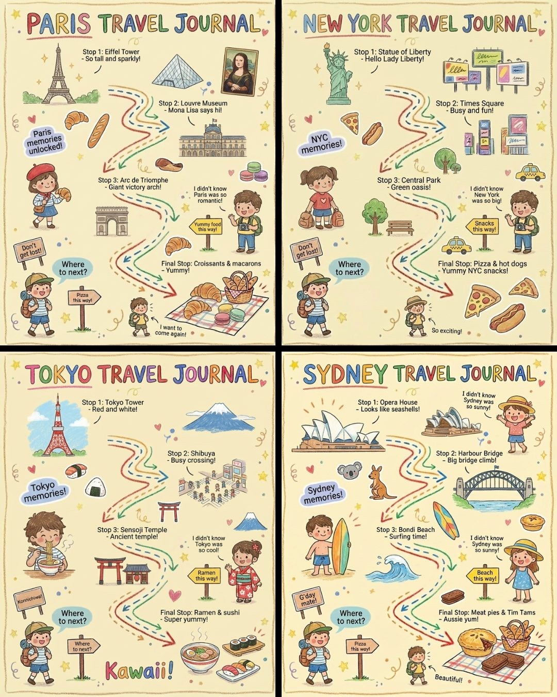
</div>

**提示词：**
```
“Create a vibrant, child-like crayon-style vertical (4:5) illustration titled “{City Name} Travel Journal.”  
The artwork should look as if it were drawn by a curious child using colorful crayons, featuring a soft, warm light-toned background (such as pale yellow), combined with bright reds, blues, greens, and other cheerful colors to create a cozy, playful travel atmosphere.

I. Main Scene: Travel-Journal Style Route Map

In the center of the illustration, draw a “winding, zigzagging travel route” with arrows and dotted lines connecting multiple locations.  
The route should automatically generate recommended attractions based on {Number of Days}:

Example structure (auto-filled with {City Name}-related content):

- “Stop 1: {Attraction 1 + short fun description}”
- “Stop 2: {Attraction 2 + short fun description}”
- “Stop 3: {Attraction 3 + short fun description}”
- …
- “Final Stop: {Local signature food or souvenir + warm closing remark}”

Rules:
- If no number of days is provided, default to a 1-day highlight itinerary.

II. Surrounding Playful Elements (Auto-adapt to the City)

Add many cute doodles and child-like decorative elements around the route, such as:

1. Adorable travel characters
   - A child holding a local snack  
   - A little adventurer with a backpack

2. Q-style hand-drawn iconic landmarks
   - “{City Landmark 1}”
   - “{City Landmark 2}”
   - “{City Landmark 3}”

3. Funny signboards
   - “Don’t get lost!”
   - “Crowds ahead!”
   - “Yummy food this way!”  
   (Auto-adjust contextually for the city)

4. Sticker-style short phrases
   - “{City Name} travel memories unlocked!”
   - “{City Name} food adventure!”
   - “Where to next?”

5. Cute icons of local foods
   - “{Local Food 1}”
   - “{Local Food 2}”
   - “{Local Food 3}”

6. Childlike exclamations
   - “I didn’t know {City Name} was so fun!”
   - “I want to come again!”

III. Overall Art Style Requirements

- Crayon / children’s hand-drawn travel diary style  
- Bright, warm, colorful palette  
- Cozy but full and lively composition  
- Emphasize the joy of exploring  
- All text should be in a cute handwritten font  
- Make the entire page feel like a young child’s fun travel-journal entry”
```

**中文提示词：**
```
“创作一幅充满活力、儿童蜡笔风格的竖版（4:5）插图，标题为“{城市名称}旅行日记”。
这幅画作应该看起来像是一个好奇的孩子用彩色蜡笔画出来的，以柔和温暖的浅色调背景（例如淡黄色）为特色，并结合鲜艳的红色、蓝色、绿色和其他欢快的颜色，营造出一种温馨、轻松的旅行氛围。

一、主要场景：旅行日志式路线图

在插图的中心，绘制一条“蜿蜒曲折的旅行路线”，用箭头和虚线连接多个地点。
路线应根据{天数}自动生成推荐景点：

示例结构（自动填充与{城市名称}相关的内容）：

- “第一站：{景点 1 + 简短有趣的描述}”
- “第二站：{景点 2 + 简短有趣的介绍}”
- “第三站：{景点 3 + 简短有趣的描述}”
- …
- “最后一站：{当地特色美食或纪念品 + 温馨的结束语}”

规则：
- 如果没有提供天数，则默认为 1 天的精华行程。

二、周边趣味元素（自动适应城市环境）

在路线周围添加许多可爱的涂鸦和充满童趣的装饰元素，例如：

1. 可爱的旅行角色
一个孩子手里拿着当地小吃。
一个背着背包的小冒险家

2. Q 风格的手绘标志性地标
- “{城市地标 1}”
- “{城市地标 2}”
- “{城市地标 3}”

3. 有趣的标牌
“别迷路了！”
“前方人潮拥挤！”
“好吃的食物这边走！”
（根据城市情况自动调整）

4. 贴纸式短语
- “{城市名称}的旅行回忆已解锁！”
- “{城市名称}美食探险！”
“接下来去哪儿？”

5. 可爱的当地美食图标
- “{本地美食 1}”
- “{本地美食 2}”
- “{本地美食 3}”

6. 孩子气的感叹词
“我以前不知道{城市名称}这么好玩！”
“我还想再来！”

三、总体美术风格要求

- 蜡笔/儿童手绘旅行日记风格
明亮、温暖、色彩丰富的色调
温馨而饱满、充满活力的构图
强调探索的乐趣
所有文字都应使用可爱的手写字体。
“让整页内容感觉就像小孩子写的趣味旅行日记一样。”
```

<a id="prompt-702"></a>
## 案例 702：生成3×3照片网格照片 (来源 [@iX00AI](https://x.com/iX00AI/status/1995130835218186540)) 模型：Nano banana pro

<div style="display: flex; justify-content: space-between;">
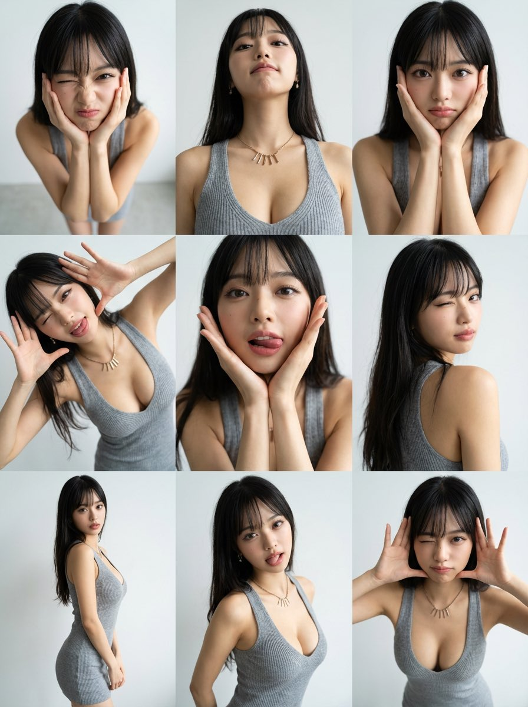
</div>

**提示词：**
```
Generate a 3×3 photo grid.
Fully preserve the face, hairstyle, and outfit from the uploaded image in all panels.

The person should make a cute, funny, and slightly weird expression and pose, and the same expression & pose must be consistent across all 9 panels.

Each panel should use a different camera angle.
Use the following angles, in varied composition and framing:
1. High angle (top-down)
2. Low angle (from below)
3. Eye-level straight-on
4. Dutch angle (slightly tilted)
5. Close-up low angle
6. Over-the-shoulder angle
7. Wide shot from the side
8. 45-degree angle from the front
9. Slight bird’s-eye angle

Style Requirements:
•Photorealistic, clean lighting
•Real camera lens rendering
•No illustration or cartoon look
•Same outfit, face, and hairstyle across all images
•The pose and expression stay identical across the grid
•Modern, minimal aesthetic
```

**中文提示词：**
```
生成 3×3 照片网格。
在所有面板中完整保留上传图像中的面部、发型和服装。

画中人应该做出可爱、滑稽、略带怪异的表情和姿势，并且所有 9 个画面中的表情和姿势必须保持一致。

每个小组都应该使用不同的拍摄角度。
使用以下角度，并采用不同的构图和取景方式：
1. 高角度（顶部- down)
2. 低角度（从下方）
3. 视线水平正对
4. 荷兰角（略微倾斜）
5. 近景低角度拍摄
6. 过肩角度
7. 侧面远景
8. 从正面看呈45度角
9. 略微俯视角度

风格要求：
•逼真、清晰的光照
•真实相机镜头渲染
•无插图或卡通风格
•所有图片中的服装、脸型和发型都相同
•整个网格中的姿势和表情保持一致
现代简约美学
```

<a id="prompt-701"></a>
## 案例 701：绘制一个详细的宠物商店场景 (来源 [@lxfater](https://x.com/lxfater/status/1992984573551276147)) 模型：Nano banana pro

<div style="display: flex; justify-content: space-between;">
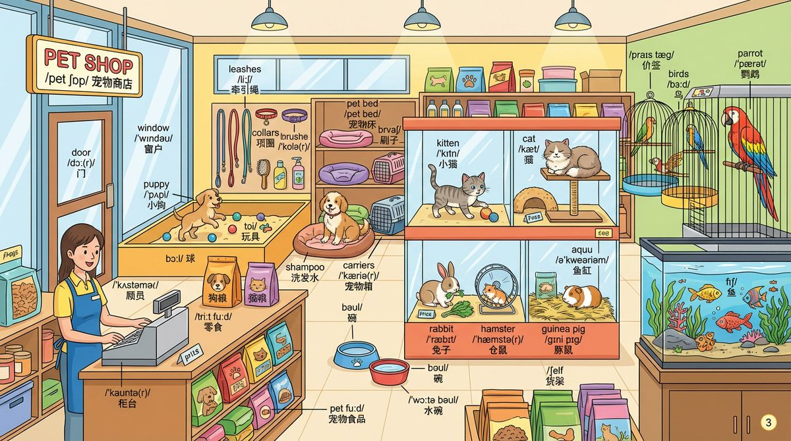
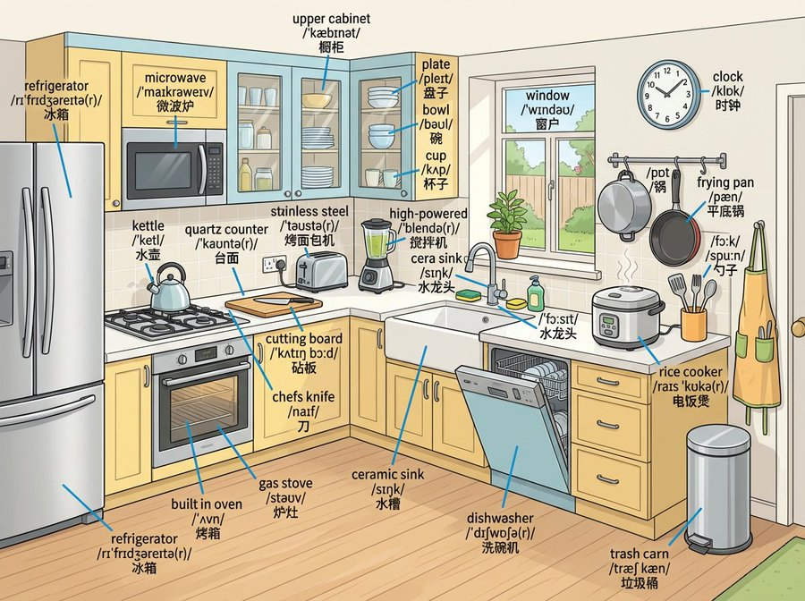
</div>

**中文提示词：**
```
为我绘制一个详细的{{宠物商店}}场景  

并标注所有物体的英语单词， 

标注格式： 第一行：英文单词 
第二行：音标（国际音标IPA格式） 
第三行：中文翻译
```
